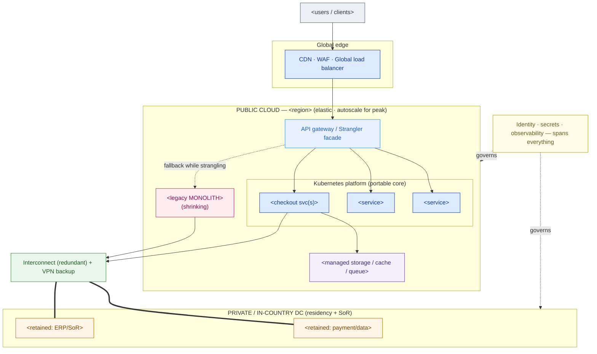

# Migration Strategy + Wave Plan — Template

> Fill this in after discovery and placement are done. It turns "move us to cloud" into a defensible program: a target you can draw, a disposition for every workload, a sequenced set of waves, a connectivity design, and a cutover that the SLA can survive. An executive should grasp the topology and the wave table; an engineer should trust the disposition and cutover sections. This is the backbone of a hybrid-cloud capstone/HLD.

**Customer:** `<company>`  ·  **Industry:** `<industry>`  ·  **Prepared by:** `<SA name>`  ·  **Date:** `<YYYY-MM-DD>`
**Engagement / opportunity:** `<deal or project name>`  ·  **Version:** `<v0.1 draft>`
**Primary public cloud:** `<AWS | Azure | GCP>`  ·  **Private/on-prem:** `<DC / private cloud>`  ·  **Region(s):** `<e.g. Jakarta>`

**Hard constraints (fill these first — they drive every decision below):**
- **Residency / sovereignty:** `<what data must stay where, and why>`
- **Availability SLA:** `<e.g. 99.95% for checkout>`  →  budget: `<compute below>`
- **Peak / spike profile:** `<e.g. flash sale ~10x baseline>`
- **Platform standard:** `<e.g. Kubernetes>`  ·  **Systems of record to retain:** `<e.g. finance/ERP>`

Legend: **SoR** = system of record · **6 R's** = Rehost / Replatform / Refactor / Repurchase / Retire / Retain · **facade** = strangler-fig router in front of a monolith.

---

## How to use this template

1. **Target first** (§1) — decide placement (private/in-country vs public/elastic) and your multi-cloud stance *before* touching a single workload.
2. **Disposition** (§2) — give every workload exactly one of the 6 R's, with a one-line why.
3. **Waves** (§3) — sequence the dispositions low-risk-first, crown-jewel-last.
4. **Connectivity** (§4) — design the hybrid link (interconnect + VPN backup) and enforce residency.
5. **Cutover/rollback** (§5) — compute the error budget, then build a cutover that can't spend it in one shot.
6. **Risks & findings** (§6) — the anti-patterns you consciously avoided and the open risks.

---

## 1. Hybrid target + multi-cloud stance

**Placement decisions**

| Workload group | Placement | Driver (residency / SoR / elasticity / latency / cost) |
|---|---|---|
| `<e.g. payment data>` | Private / in-country | `<residency>` |
| `<e.g. finance/ERP>` | Private / on-prem | `<system of record>` |
| `<e.g. web/catalog/checkout>` | Public cloud (elastic) | `<spike absorption>` |
| `<…>` | | |

**Multi-cloud stance (state it explicitly — avoid the anti-patterns):**
> `<e.g. "Portable core on Kubernetes, ONE primary public cloud for managed services, documented second-source. We do NOT spread a single app across clouds (gratuitous multi-cloud) and we do NOT design to the lowest common denominator. Portability buys leverage + optionality, not an ops tax.">`

**Target topology (Mermaid skeleton — replace placeholders, delete rows you don't need):**



---

## 2. Workload disposition — the 6 R's

> Exactly one disposition per workload. "Retain" and "Retire" are decisions, not cop-outs. Rehost/Replatform can be tool-assisted; Refactor is architecture work.

```
WORKLOAD                     DISPOSITION      WHY (one line)
──────────────────────────────────────────────────────────────────────────────────────────
<crown-jewel monolith>       Refactor         <scaling-hostile shape IS the problem; strangle it>
<containerized services>     Rehost/Replat.   <already portable; move onto the landing zone>
<search / stateless>         Replatform       <swap to managed/self-hosted engine on K8s>
<media / files>              Replatform       <managed object storage + CDN>
<payment / regulated data>   Retain           <residency: stays in-country>
<ERP / system of record>     Retain           <SoR; no elasticity need; not worth moving>
<analytics / warehouse>      Repurchase       <adopt managed service; stop self-running>
<commodity (email/SMS)>      Repurchase       <buy the SaaS, drop the infra>
<dead / duplicated jobs>     Retire           <no owner or superseded; delete>
──────────────────────────────────────────────────────────────────────────────────────────
```

| Disposition | Count | Tool-assisted? |
|---|---|---|
| Rehost / Replatform | `<n>` | Yes — `<MGN / Azure Migrate / Migrate to VMs/Containers>` |
| Refactor | `<n>` | No — architecture work (strangler-fig) |
| Repurchase / Retire / Retain | `<n>` | N/A |

---

## 3. Wave plan (sequence by dependency + risk)

> Low-risk, stateless, low-blast-radius **first** (prove the pipeline). Crown jewel **last**, and incrementally. Retained workloads never enter a wave — only the connectivity to them does.

```
WAVE  NAME                CONTENTS                                  RISK   SLA EXPOSURE
────────────────────────────────────────────────────────────────────────────────────────────
 0    Foundation         Landing zone · network · interconnect+VPN  Low    None (no prod traffic)
                         · platform (K8s) · CI/CD · observability
 1    Prove the pipeline <rehost 2-3 low-risk stateless svcs>       Low    Behind facade, canary
 2    Strangle reads     <peel read-path capabilities off monolith> Med    Read path; fast rollback
 3    Strangle writes    <peel write-path / crown jewel, 1 at a     High   Canary %, freeze windows
                         time, behind the facade>
 4    Data & decommiss.  <replatform analytics · repurchase SaaS ·  Med    Monolith drained; low
                         RETIRE the emptied monolith>
────────────────────────────────────────────────────────────────────────────────────────────
 THROUGHOUT:  <retained workloads> stay in-country, reached over the interconnect.
```

| Wave | Entry criteria (go) | Exit criteria (done) | Rollback trigger |
|---|---|---|---|
| 0 | `<landing zone approved>` | `<connectivity + platform smoke-tested>` | n/a |
| 1 | `<Wave 0 exit met>` | `<services stable at 100% behind facade>` | `<error/latency threshold>` |
| 2 | `<…>` | `<…>` | `<…>` |
| 3 | `<…>` | `<…>` | `<canary metric breach>` |
| 4 | `<…>` | `<monolith retired>` | `<…>` |

---

## 4. Connectivity design

- **Production path:** `<Direct Connect / ExpressRoute / Cloud Interconnect>` from `<private DC>` into `<region>` — committed bandwidth `<Gbps>`, target latency `<ms>`.
- **Redundancy:** `<two diverse circuits>` + **site-to-site VPN** as automatic backup. (One link = SPOF for the whole hybrid.)
- **Residency enforcement:** `<which data must never leave in-country; how private DNS + network policy enforce it>`.
- **Strangler facade location:** `<API gateway at the cloud edge; owns new-vs-monolith routing per capability>`.
- **Identity/security spine:** `<directory/SSO, secrets, cross-boundary service identity for the retained SoR>`.

---

## 5. Cutover & rollback (respect the SLA)

**Error-budget math (compute from the SLA):**

```
SLA <99.95%> uptime  →  downtime budget
  Month (30 d = 43,200 min):  43,200 × (1 − <0.9995>) = <21.6> min / month
  Year  (525,600 min):        525,600 × (1 − <0.9995>) = <262.8> min ≈ <4.38> h / year
  Implication: <a single big-bang cutover can burn a quarter's budget → no big-bang for the SLA'd path>
```

**Cutover mechanics:**
1. **Canary behind the facade:** `<1% → 5% → 25% → 100%>`, watching `<success rate · p99 latency · downstream error>` at each step; old system serves the rest.
2. **Rollback = the old system:** shift facade weight back to `<0% new / 100% legacy>` — a config change in seconds.
3. **Freeze windows:** `<no cutover during/near peak events; the calendar is part of the design>`.
4. **Go/no-go metrics + owner:** `<explicit thresholds and who can call the rollback>`.
5. **Error-budget gating:** `<if the month's budget is partly spent, the next risky step waits>`.

---

## 6. Anti-patterns avoided & open risks

| # | Anti-pattern / risk | How this plan handles it | Severity |
|---|---|---|---|
| 1 | Gratuitous multi-cloud | `<single primary cloud; portable core, not spread apps>` | `<H/M/L>` |
| 2 | LCD abstraction | `<consume managed services deliberately; K8s for the core only>` | `<…>` |
| 3 | Forklift the monolith | `<Refactor via strangler-fig, not Rehost>` | `<…>` |
| 4 | Big-bang cutover vs SLA | `<canary + monolith-as-rollback + freeze windows>` | `<…>` |
| 5 | Single connectivity link | `<redundant interconnect + VPN backup>` | `<…>` |
| 6 | `<open risk>` | `<mitigation / owner / date>` | `<…>` |

**One-line strategy statement (fill in):**
> The target is a **hybrid** estate — `<retained workloads>` private and in-country for `<residency/SoR>`, `<elastic workloads>` on `<primary cloud>` with a **portable K8s core** (leverage without sprawl) — reached by **redundant `<interconnect>`**, migrated in **`<n>` waves** (low-risk first, `<crown jewel>` strangled last), cut over by **canary with the legacy system as rollback**, inside a **`<SLA>`** error budget.

---

*Worked example: see `example-pasarkita-migration-strategy.md` in this folder.*
