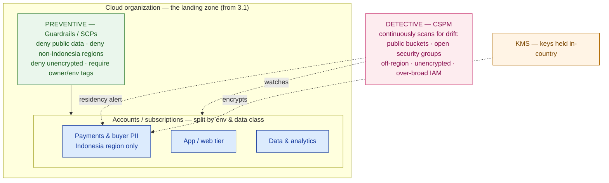

# Cloud Security, FinOps & Cost Optimization

> A cloud bill nobody can explain and an attack surface nobody mapped will cancel a cloud program faster than any outage — and both are decided at design time, not in the billing console.

**Type:** Design
**Track:** AI, Data & Infrastructure Solution Architect (Presales)
**Prerequisites:** 3.6 Hybrid, Multi-Cloud & Migration
**Time:** ~4h
**Lab:** —
**Ship It:** TCO/cost model + FinOps plan

## The Problem

You have spent Phase 3 designing **PasarKita**'s cloud. You laid the landing zone and its guardrails (3.1), toured the three hyperscalers (3.2–3.4), weighed a private cloud (3.5), and drew the hybrid target and the migration waves (3.6). The architecture is sound. Then you walk into the quarterly business review and discover the architecture is not the problem anyone in the room is worried about.

PasarKita is an Indonesian e-commerce marketplace — ~15M active buyers, ~200,000 sellers, ~2M orders/day, with flash sales that spike traffic ~10× for a few hours. It runs on a **single public cloud**, plus an on-prem finance/ERP estate, and it is moving to hybrid. The CFO opens the review with one slide: the cloud bill, climbing every month, now the single largest line in infrastructure and the **#1 issue on her desk**. She asks three questions you cannot answer from an architecture diagram. *"Why did the bill grow faster than orders did?"* *"What does it cost us to serve one order — and is that going up or down?"* *"When we run a flash sale, are we paying for that 10× spike all month, or only while it's happening?"* Nobody in the room has a number. The engineers say "the cloud is elastic, it just scales"; the CFO hears "we don't know." That is failure mode one: **a cloud you can't cost is a cloud the CFO will stop funding.** The program does not die from a technical flaw — it dies from an unexplained invoice.

Failure mode two is quieter and worse. To move fast, the estate has sprawled into many accounts and is now stretching across on-prem and cloud. Every new account is a new **attack surface**: an IAM role someone made `*:*` "just to unblock the sprint," a storage bucket flipped public for a quick integration test and never flipped back, a database snapshot copied to a convenient region — which happens to be *outside Indonesia*, where PasarKita's **payment data is legally required to stay**. No guardrail stopped any of it, and no scanner is watching for it. A single misconfiguration exposing 15M buyers' data, or a payment-residency violation, is not a bad afternoon — it is a regulator, the press, and a churned user base. Both failure modes share one root cause: the SA treated **cost and security as operational chores someone bolts on after go-live.** They are not. Cost governance (FinOps) and security posture are *architecture* — you design them into the landing zone, or you pay for their absence in an uncontrolled bill and an unmapped breach. This lesson designs both, and builds the **TCO model the CFO will actually trust** — the artifact that keeps the whole cloud program funded.

## The Concept

Cost and security are the two forces that sink cloud programs, and they rhyme: each is a governance system you design once and run continuously, each has a *preventive* and a *detective* half, and — as you'll see — the same primitives (tagging, region control, egress control) serve both. Take them in turn.

### Where the money actually goes — the five cost drivers

Before you can cut a bill you must know its shape. Five drivers blow cloud budgets, and rookies see only the first:

| Driver | What it is | Why it surprises people |
|---|---|---|
| **Compute** | VMs, containers, functions — usually the biggest line | Sized for *peak* and left *always-on*; a fleet at 15% average utilization bills at 100% |
| **Data egress** | Bytes leaving a region/cloud/to the internet | Ingress is free, egress is not; cross-region chatter and cross-cloud data pulls are a silent tax |
| **Managed-service premium** | The markup for managed DB / search / queue / LB over raw compute | Convenience has a price; a managed database can cost multiples of the instance under it |
| **Idle / over-provisioned** | Dev-test left running 24/7, oversized instances, orphaned disks/IPs | Nobody owns it, so nobody turns it off — pure waste |
| **Flash-sale peaks** | Capacity for the ~10× spike | If you provision the peak *permanently*, you pay 10× for a few hours' need, all month |

The last one is PasarKita's signature trap. A marketplace that provisions for its flash-sale peak and leaves it on is buying a stadium and paying rent on it 365 days to use it twice. The architecture fix — elasticity — is also the cost fix.

### FinOps: the Inform → Optimize → Operate loop

**FinOps** is not a tool or a cost-cutting sprint; it is an operating model that makes engineering, finance, and business *share accountability* for cloud spend — decentralized decisions, centralized visibility. It runs as a continuous loop, and an architect designs the loop into the platform:

```mermaid
flowchart LR
  subgraph INF["① INFORM — see the money"]
    direction TB
    i1["Cost visibility<br/>(billing / usage export)"]:::inf
    i2["Tagging &amp; allocation<br/>showback per team / service"]:::inf
    i3["Unit economics<br/>cost per order"]:::inf
  end
  subgraph OPT["② OPTIMIZE — cut the waste"]
    direction TB
    o1["Rightsize · kill idle"]:::opt
    o2["Autoscale · spot for peaks"]:::opt
    o3["Commit (savings plans / CUD)"]:::opt
    o4["Storage tiering · egress cuts"]:::opt
  end
  subgraph OPR["③ OPERATE — make it stick"]
    direction TB
    p1["Budgets &amp; alerts"]:::opr
    p2["Anomaly detection"]:::opr
    p3["Guardrails &amp; policy"]:::opr
    p4["Shared accountability<br/>eng + finance + business"]:::opr
  end
  INF --> OPT --> OPR
  OPR -.continuous loop.-> INF

  classDef inf fill:#DCEBFD,stroke:#12379C,color:#12379C;
  classDef opt fill:#EAF6EC,stroke:#2E7D32,color:#1B5E20;
  classDef opr fill:#FFF4E5,stroke:#B26A00,color:#7A4600;
```



- **Inform** — you cannot optimize what you cannot see. Turn on the detailed billing/usage export, **tag every resource** with an owner and an environment, and produce **showback**: each team sees the cost it caused. The apex of Inform is **unit economics** — cost per business unit (here, **cost per order**), the one number a CFO can hold you to.
- **Optimize** — apply the levers (below) against what Inform revealed. Not once — every cycle, because usage drifts.
- **Operate** — make savings durable: budgets and alerts, **anomaly detection** (page when spend jumps), guardrails that stop waste being created, and a culture where the team that spends the money sees the bill.

### The optimization levers — rate, usage, architecture

There are only three ways to cut a cloud line, and an architect reaches for them in this order:

| Lever type | The move | Examples | Trade-off |
|---|---|---|---|
| **Reduce the rate** | Pay less per unit for the same usage | **Commitments** (savings plans / committed-use discounts), **spot/preemptible**, region choice | Commit = discount for lock-in; spot = deep discount for interruptibility |
| **Reduce the usage** | Consume fewer units | **Rightsizing**, **autoscaling**, **storage tiering** (hot→infrequent→archive), **egress reduction** (CDN, keep traffic in-region), turn off idle | Effort + risk of under-provisioning if done blindly |
| **Change the architecture** | Design so peaks don't become permanent cost | Elastic burst on cloud + steady baseline committed/on-prem; event-driven instead of always-polling | The biggest lever — and the hardest to retrofit |

The **commitment spectrum** is worth internalizing, because it is the CFO's favorite conversation:

```
 FLEXIBILITY  ◀──────────────────────────────────────────────────────▶  DISCOUNT
 On-demand         Savings plan / Committed-use        Reserved        Spot / Preemptible
 pay list price    commit $/hr or resource for 1–3yr   commit capacity  bid on spare capacity
 0% off            ~ moderate discount                  ~ higher        ~ deepest discount
 no commitment     flexible across instance families    specific        can be reclaimed anytime
 ── use for ──     ── steady, predictable baseline ──   ── stable ──    ── fault-tolerant / burst ──
```

The design pattern that falls out: **cover your predictable baseline with commitments, and ride your spiky, interruptible work (flash-sale burst, batch, stateless workers) on spot.** On-demand is the expensive default you use only for the unpredictable middle.

### Unit economics and the TCO model

A total bill is an argument nobody can win — it only ever goes up as the business grows. **Unit economics** reframes it: *cost per order* separates "we spend more because we sell more" (healthy) from "we spend more per order" (a leak). It is the number that turns a defensive budget review into a story of improving efficiency. And it is trivially derived from a *given* fact — orders — so it needs no fabricated revenue figure.

A **TCO (Total Cost of Ownership) model** puts today's state next to the target state so the CFO can see the delta and the levers behind it. For PasarKita that is **today's single-cloud run-rate vs the hybrid target**, with the flash-sale peak handled by autoscale + spot rather than always-on capacity. Here is the shape of that model and the unit metric it produces — every figure a stated **assumption with a range**, never a magic number:

```
COST MODEL — today (single cloud) vs hybrid target     [cost-units/month; 100 = today's bill]
                                          all composition %/Δ are ASSUMPTIONS — confirm from the
                                          billing & usage export (CUR / Cost Management / BQ export)
 DRIVER                 TODAY   LEVER APPLIED                              TARGET   Δ
 ───────────────────────────────────────────────────────────────────────────────────────────
 Compute — steady         30    commit (savings plan / CUD) + rightsize      18    −40%
 Compute — flash-sale     15    autoscale + spot (not always-on 10×)          5    −67%
 Managed-service premium  20    keep managed only where it earns its keep     16    −20%
 Data egress              15    CDN + keep traffic in-region + fewer hops      9    −40%
 Storage                  12    tiering hot→infrequent→archive + cleanup       8    −33%
 Idle / over-provisioned   8    kill orphans · schedule dev-test off           2    −75%
 ───────────────────────────────────────────────────────────────────────────────────────────
 TOTAL (cloud run-rate)  100                                                  58    −42%  (band 25–45%)
 on-prem finance/ERP      —     unchanged (sunk); hybrid adds burst headroom, not a second estate
 ═════════════════════════════════════════════════════════════════════════════════════════════
 UNIT METRIC   cost per order = monthly cloud cost ÷ orders/month
               given: ~2M orders/day  →  ~60M orders/month
               today    index 1.00   (100 units / 60M orders)
               target   index 0.58   (58 units / 60M orders)   → ~42% lower cost-to-serve per order
               and it stays ~flat through a flash sale, because burst scales WITH demand
               instead of sitting idle — so more orders no longer means a worse per-order cost.
```

The percentages are illustrative and **must be re-derived from the customer's actual usage export** — the point is the *method* (driver → lever → modeled range → unit metric), not the digits.

### Security posture: shared responsibility, preventive + detective

Now the other force. The foundational idea every cloud security conversation starts from is the **shared-responsibility model**: the cloud provider secures *of* the cloud (the hardware, the hypervisor, the physical region); **you** secure *in* the cloud (your identities, network config, encryption, data). Most breaches live entirely on the customer's side of that line — a public bucket, an over-broad role — which is why posture is *your* architecture, not the provider's problem. On hybrid the line moves again: the on-prem finance/ERP is *entirely* PasarKita's to secure, while the cloud stays shared.

A cloud security posture has two halves, and you design both:



- **Preventive — guardrails / SCPs.** These are the org-level policies from your **3.1 landing zone**: rules that *cannot be overridden* by an account owner. A Service Control Policy (SCP) that **denies creating resources outside Indonesian regions** enforces payment-data residency *mechanically* — an engineer physically cannot put the data in the wrong place. Others deny public storage, deny unencrypted resource creation, and **require owner/environment tags**. Guardrails stop the misconfiguration before it exists.
- **Detective — CSPM (Cloud Security Posture Management).** Guardrails cannot catch everything, and estates drift. CSPM continuously scans the running estate for misconfigurations — a bucket that went public, a security group open to `0.0.0.0/0`, an unencrypted volume, an over-broad IAM role, a resource that landed off-region — and alerts. Preventive stops the known bad; detective catches the drift.

Here is the control set as the checklist you hand a customer — control, what it prevents, and how each is enforced on *both* halves. Notice the two columns that also appear in the cost model — **tagging** and **region/egress control** — the same primitives paying double duty:

```
 SECURITY POSTURE — control × what it prevents × enforcement (preventive | detective)
 ────────────────────────────────────────────────────────────────────────────────────────────
 CONTROL FAMILY          PREVENTS                          PREVENTIVE (guardrail/SCP)   DETECTIVE (CSPM)
 ────────────────────────────────────────────────────────────────────────────────────────────
 Identity (IAM)          over-broad access · leaked keys   deny root · no long-lived keys  flag over-permissive roles
 Data residency          payment data leaving Indonesia    deny non-Indonesia regions      flag any resource off-region
 Public exposure         open buckets / DBs to internet    block public access             flag public storage / open SG
 Encryption at rest      readable disks/snapshots/backups  deny unencrypted create          flag unencrypted volumes/keys
 Encryption in transit   sniffed traffic                   TLS-only endpoints               flag plaintext listeners
 Network segmentation    lateral movement                  per-env accounts + private links flag cross-env / open egress
 Tagging & ownership     un-owned, untraceable spend/risk  require owner + env tags         flag untagged resources
 Landing-zone baseline   drift from the 3.1 guardrails     org SCPs applied to every account continuous conformance scan
```

Two of these lines are where cost and security *fuse*. **Tagging** is the FinOps showback key *and* the security ownership key — one required-tag guardrail serves both. **Egress/region control** cuts the egress cost line *and* shrinks the attack surface and enforces residency. Design them once; bill them to two budgets. That is the thesis of this lesson made concrete: cost and security are not two projects, they are two views of one governed landing zone.

## Design It

Build PasarKita's **TCO/cost model + FinOps plan** as a governance overlay on the hybrid target from 3.6 and the landing zone from 3.1. Six steps; the output is the Ship It deliverable that closes Phase 3 into Capstone C. Every number is a labelled assumption carried as a band — the given facts are only ~15M buyers, ~200k sellers, ~2M orders/day, ~10× flash-sale spikes, single cloud + on-prem finance/ERP, payment data in Indonesia.

### Step 1 — Map where the money goes (Inform)

You cannot optimize a bill you have not decomposed. Pull the billing/usage export and allocate today's spend across the five drivers. PasarKita has no tagging yet, so the first finding is: **a large share of spend is un-attributable** — which is itself the headline. State the composition as a band to confirm:

```
DRIVER                     SHARE OF TODAY'S BILL (ASSUMPTION — confirm from usage export)
Compute (steady + peak)    ~45%   band 40–55%   ← includes flash-sale capacity left always-on
Managed-service premium    ~20%   band 15–25%
Data egress                ~15%   band 10–20%
Storage                    ~12%   band  8–15%
Idle / over-provisioned    ~ 8%   band  5–15%   ← the pure-waste line; grows without tagging
```

The two fat, addressable targets jump out: **compute provisioned for a peak that lasts hours** and **idle nobody owns**. Everything downstream attacks these.

### Step 2 — Build the cost model: today vs hybrid target

Take the model shape from The Concept and apply the levers driver by driver, landing a **modeled target range** — not a promise. The move that carries the story is flash-sale compute: today's always-on peak capacity (~15 units) collapses to ~5 when the 10× spike rides **autoscaling + spot** for the few hours it exists, instead of renting the peak all month.

```
                       AUTOSCALE + SPOT  vs  ALWAYS-ON PEAK  (illustrative capacity over a day)

 capacity                    ┌──flash sale──┐                     always-on peak line ($$$ 24h)
   10× ─ ─ ─ ─ ─ ─ ─ ─ ─ ─ ─ ┤              ├─ ─ ─ ─ ─ ─ ─ ─ ─ ─ ─ ─ ─ ─ ─ ─ ─ ─ ─ ─ ─ ─ ─ ─ ─
                             ╱                ╲
    1× ─────────────────────╱                  ╲────────────────  committed/on-prem baseline
        00:00      elastic burst scales WITH demand           23:59
        pay for the shaded spike only  ◀── this is the saving ──▶  not the whole rectangle
```

Result: total cloud run-rate models to **~58 units (band 55–75) — a 25–45% reduction** — with the committed baseline optionally shifting to on-prem in the hybrid target. State the band, name the biggest lever (flash-sale elasticity), and note that the on-prem finance/ERP is a *sunk* estate, not a second bill.

### Step 3 — Design the tagging & showback scheme

Give every rupiah an owner. Define a **mandatory tag set**, enforce it with a guardrail (Step 6), and use it to produce showback:

| Tag | Example values | Serves |
|---|---|---|
| `owner` / `team` | payments, search, seller-portal | FinOps showback **and** security ownership |
| `environment` | prod, staging, dev | schedule dev/staging off-hours; scope guardrails |
| `service` / `cost-center` | checkout, catalog, ledger | cost per service → unit economics roll-up |
| `data-class` | payment, pii, public | drives residency + encryption guardrails |

Showback (each team sees its own cost) is the low-friction start; **chargeback** (the cost actually hits the team's budget) is the mature end-state — propose showback first, because accountability without a billing fight changes behavior fastest.

### Step 4 — Rightsizing + commitment strategy (the elasticity design)

This is the architecture lever, staged:

- **Rightsize & kill idle first** — never commit to an oversized fleet. Cut idle and right-size *before* buying commitments, or you lock in waste.
- **Commit the baseline** — once the steady floor is known, cover ~60–80% of it (assumption to confirm) with **savings plans / committed-use discounts**; leave headroom for growth so you don't over-commit.
- **Burst on spot** — flash-sale workers, batch, and stateless tiers ride **spot/preemptible**, which suits interruptible work and turns the 10× spike from a capital decision into a variable cost.
- **On-demand for the unpredictable middle only** — the expensive default, minimized.

State the commitment coverage as a band and note the risk both ways: under-commit → leave discount on the table; over-commit → pay for capacity you don't use.

### Step 5 — The cost-per-order unit metric (for the CFO)

Convert the model into the one number the CFO will remember. Orders are *given* (~2M/day → ~60M/month), so:

```
cost per order = monthly cloud cost ÷ monthly orders
   today   index 1.00   (100 cost-units / 60M orders)
   target  index 0.58   (58 cost-units / 60M orders)   →  ~42% lower cost-to-serve per order
```

Present it three ways the CFO can act on: (1) **today vs target** (efficiency is improving, here's the lever); (2) **trend** (is per-order cost rising or falling month over month — the leak detector); (3) **flash-sale behavior** (elastic → per-order cost holds during a sale; always-on → the sale's idle capacity inflates *every* order's cost all month). That third point is the clincher: it reframes the flash sale from a cost fear into a solved problem.

### Step 6 — Security guardrails, CSPM & residency (Operate)

Cost governance and security posture share the same landing zone, so design them together. Apply to PasarKita's accounts:

- **Preventive guardrails / SCPs (from 3.1):** deny resource creation **outside Indonesian regions** for the payments/PII accounts (residency, enforced mechanically); deny public storage; deny unencrypted create; **require the Step 3 tag set** (one guardrail, serving both FinOps and security).
- **IAM least-privilege:** roles via SSO federation, **no long-lived access keys**, scoped policies, and a monitored break-glass path — no standing `*:*`.
- **Network & encryption:** per-environment account/VPC separation with **private links** (which also cuts egress cost), TLS/mTLS in transit, and encryption at rest with **KMS keys held in-country**.
- **Detective CSPM:** continuously scan for public buckets, open security groups, unencrypted volumes, over-broad roles, and **any resource that drifts off-region** (residency alarm). Route findings like burn-rate alerts: page on the critical few, ticket the rest.

### Step 7 — Assemble the one-pager and hand it to Capstone C

Combine the cost model (Step 2), tagging/showback (Step 3), rightsizing + commitment strategy (Step 4), cost-per-order (Step 5), and the security-controls map (Step 6) into a single **TCO/Cost Model + FinOps Plan**. That page is the cost-and-governance chapter of the **Capstone C** hybrid-cloud proposal — the evidence that the estate is not only well-architected but *affordable and defensible*, the two things the CFO and the CISO respectively must sign.

## Compare It

The design names methods and reference tools. In a real deal the customer asks "which pricing model, which tool, who owns FinOps?" — know the trade-offs and the "it depends."

**Pricing models — on-demand vs reserved/savings-plans vs spot:**

| Model | Discount vs on-demand | Commitment | Interruption risk | Best for |
|---|---|---|---|---|
| **On-demand** | none (baseline) | none | none | Unpredictable, short-lived, or first-week-of-migration workloads |
| **Savings plans / CUD** | moderate | 1–3 yr $/hr or resource commit | none | The **predictable baseline** — the bulk of a steady fleet |
| **Reserved instances** | often similar-to-higher, but rigid | 1–3 yr specific capacity | none | Very stable, known instance shapes you won't change |
| **Spot / preemptible** | deepest | none | can be reclaimed any time | **Flash-sale burst**, batch, CI, stateless workers — anything fault-tolerant |

The architect's rule: *baseline on commitments, burst on spot, on-demand only for the unpredictable middle* — mixing all three is normal and correct.

**Cost tooling — native vs third-party FinOps platforms:**

| Option | Strength | Weakness | Reach for it when… |
|---|---|---|---|
| **Native** (Cost Explorer / Cost Management / GCP Billing) | Free, deep in one cloud, real-time | Single-cloud view; weaker chargeback/RI optimization | You're on one cloud and just starting FinOps |
| **CloudHealth / Cloudability / Apptio** | **Multi-cloud** single pane, showback/chargeback, commitment optimization, policy | Licence cost; another tool to run | Hybrid/multi-cloud (PasarKita's direction) or a maturing FinOps practice |

**CSPM tooling — native vs dedicated:** native posture tools (**AWS Security Hub**, **Microsoft Defender for Cloud**, **GCP Security Command Center**) are cheap and well-integrated per cloud; dedicated **CNAPP/CSPM platforms (Wiz, Prisma Cloud, Orca)** give one multi-cloud posture view, agentless scanning, and richer attack-path analysis. Same axis as the cost tools: **single-cloud → native; hybrid/multi-cloud → a dedicated platform earns its licence.**

**The organizational "it depends" — who owns FinOps?** Centralized (a FinOps/cloud-CoE team owns cost) gives consistency and negotiating leverage but can become a bottleneck the teams route around. Team-level (each product team owns its bill via showback/chargeback) drives the fastest behavior change but risks inconsistency. The mature answer is **both**: a small central team owns *visibility, commitments, and guardrails*; product teams own *their own optimization* against a showback they can see. Propose the hybrid — it mirrors "centralized guardrails, decentralized freedom," the exact model of the landing zone.

## Ship It

This lesson ships a **TCO/Cost Model + FinOps Plan** — the cost-and-governance chapter that turns a well-architected hybrid estate into an *affordable, defensible* one, and the final Phase-3 input to **Capstone C**. Both files live in [`outputs/`](../outputs/):

- **[`template-tco-cost-model-and-finops-plan.md`](../outputs/template-tco-cost-model-and-finops-plan.md)** — a fill-in-the-blank template: the driver-by-driver cost model (today vs target, with bands), the optimization-lever plan, the tagging/showback scheme, the cost-per-order unit-economics block, and the security-controls checklist (preventive guardrails × detective CSPM × residency). A colleague can run it against any cost-pressured cloud customer.
- **[`example-pasarkita-tco-and-finops.md`](../outputs/example-pasarkita-tco-and-finops.md)** — the template fully worked for PasarKita, so the skeleton isn't abstract. It's the artifact you attach to the Capstone C proposal.

The point of shipping this as the phase closer: a plan that shows *both* how the bill comes down (with a unit metric the CFO can track) *and* how each control keeps the estate safe and in-country is the difference between "we designed you a cloud" and "we designed you one you can afford and defend." The second one keeps the program funded.

## Exercises

1. **(Easy)** For each symptom, name the **cost driver** and the single **lever** you'd reach for first: (a) "the dev environment bill is the same on Sunday as on Tuesday"; (b) "our bill jumped the week we added a second region for analytics"; (c) "we pay for flash-sale capacity all month." Then compute PasarKita's **cost per order** as an index if the modeled target lands at 65 cost-units instead of 58 — and say in one sentence whether efficiency still improved.
2. **(Medium)** Re-scope the tagging/showback scheme and the security-controls checklist for a **different customer**: a **regional digital bank** under a financial regulator instead of an e-commerce marketplace. Keep the structure, but change the `data-class` values and rewrite the **residency** and **encryption** rows for banking data — and name the **one guardrail that becomes strictest** versus the marketplace, and why.
3. **(Hard)** Combine this with your **3.6 migration wave plan**. For the **first migration wave**, show how the cost model changes *during* migration (you're paying for both the old and new estate at once — the "double-bubble"), how you'd tag to keep the two apart in showback, and which **commitments you would and would not buy mid-migration** (hint: don't commit to a fleet you're about to reshape). Save it alongside your worked example; you'll fold it into the Capstone C cost model and migration plan.

## Key Terms

| Term | What people say | What it actually means |
|------|-----------------|------------------------|
| FinOps | "Cutting the cloud bill" | An operating model where engineering, finance, and business share accountability for cloud spend, run as a continuous Inform → Optimize → Operate loop — not a one-off cost cut. |
| Showback / Chargeback | "Splitting the bill" | Showback = each team *sees* the cost it caused (visibility, no billing fight); chargeback = that cost actually *hits* the team's budget (accountability, harder to introduce). Start with showback. |
| Unit economics / cost per order | "Total spend" | Cost divided by a business unit (per order, per user). It separates "spending more because selling more" from "spending more per order" — the metric a CFO can hold you to. |
| Rightsizing | "Making it smaller" | Matching provisioned capacity to *actual* utilization from real usage data — done **before** buying commitments, so you don't lock in waste. |
| Savings plan / Committed-use discount | "A discount" | A 1–3 year commitment to a baseline of spend/resource in exchange for a lower rate — the right tool for the *predictable* floor, sized with headroom to avoid over-committing. |
| Spot / Preemptible | "Cheap instances" | Deeply discounted spare capacity that the provider can reclaim at any time — correct for interruptible, fault-tolerant work (flash-sale burst, batch), wrong for stateful cores. |
| Data egress | "Bandwidth" | The charge for bytes *leaving* a region/cloud/to the internet (ingress is usually free); a silent cost driver from cross-region chatter and cross-cloud pulls — and an attack-surface concern. |
| Shared-responsibility model | "The cloud is secure" | The split where the provider secures *of* the cloud (hardware, hypervisor) and **you** secure *in* it (identity, config, data). Most breaches live on the customer's side of the line. |
| Guardrail / SCP | "A permission" | An org-level policy that *cannot be overridden* by an account owner — e.g. "deny any region outside Indonesia" — enforcing residency/encryption/tagging **preventively**, from the landing zone. |
| CSPM | "A security scanner" | Cloud Security Posture Management — continuous **detective** scanning of the running estate for misconfigurations (public buckets, open SGs, off-region resources) and drift from the guardrails. |
| Data residency | "Where it's hosted" | The legal requirement that certain data (PasarKita's **payment data**) stay within a country's borders — enforced preventively by a region guardrail and detectively by CSPM. |
| TCO | "The price" | Total Cost of Ownership — the full run-rate of a target state (compute, egress, managed services, storage, plus the sunk on-prem estate), modeled with stated assumptions and ranges, not a single number. |

## Further Reading

- [FinOps Foundation — Framework & Principles](https://www.finops.org/framework/) — the canonical Inform → Optimize → Operate model and the maturity/persona guidance this lesson's loop is built on.
- [AWS Well-Architected — Cost Optimization Pillar](https://docs.aws.amazon.com/wellarchitected/latest/cost-optimization-pillar/welcome.html) and [Security Pillar](https://docs.aws.amazon.com/wellarchitected/latest/security-pillar/welcome.html) — the design questions and levers behind Steps 1–6, cloud-agnostic in substance even where AWS-named.
- [Microsoft Azure Well-Architected — Cost Optimization](https://learn.microsoft.com/en-us/azure/well-architected/cost-optimization/) and [Google Cloud Architecture Framework — Cost & Security](https://cloud.google.com/architecture/framework) — the other two hyperscalers' versions, so you can speak the customer's dialect.
- [AWS Shared Responsibility Model](https://aws.amazon.com/compliance/shared-responsibility-model/) — the one-page mental model every security conversation starts from; read it once and reuse it in every HLD.
- [CIS Benchmarks](https://www.cisecurity.org/cis-benchmarks) and [CIS Cloud Foundations](https://www.cisecurity.org/) — the named baselines a CSPM scans against; "compliant" should mean "measured against a named benchmark," not a vibe.
- [Cloud Security Alliance — Cloud Controls Matrix](https://cloudsecurityalliance.org/research/cloud-controls-matrix) — a control-family map to align your security-controls checklist to a framework a customer's CISO will recognize.
- [FinOps Foundation — Unit Economics](https://www.finops.org/wg/unit-economics/) — deeper on cost-per-business-unit, the cost-per-order idea that makes the model a story instead of a spreadsheet.
