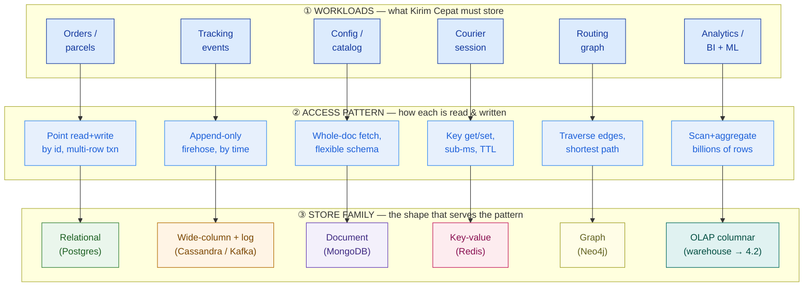
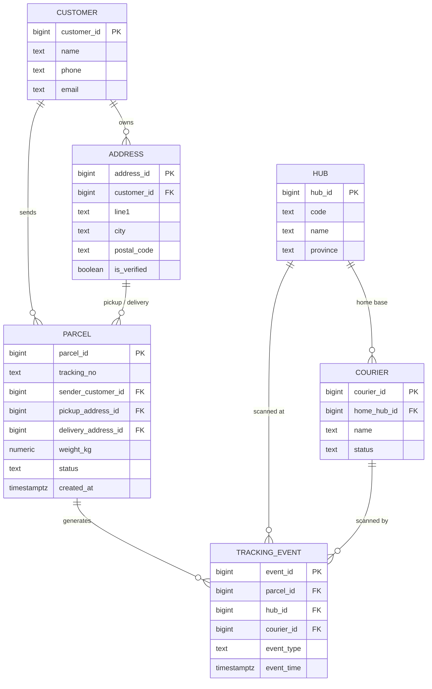
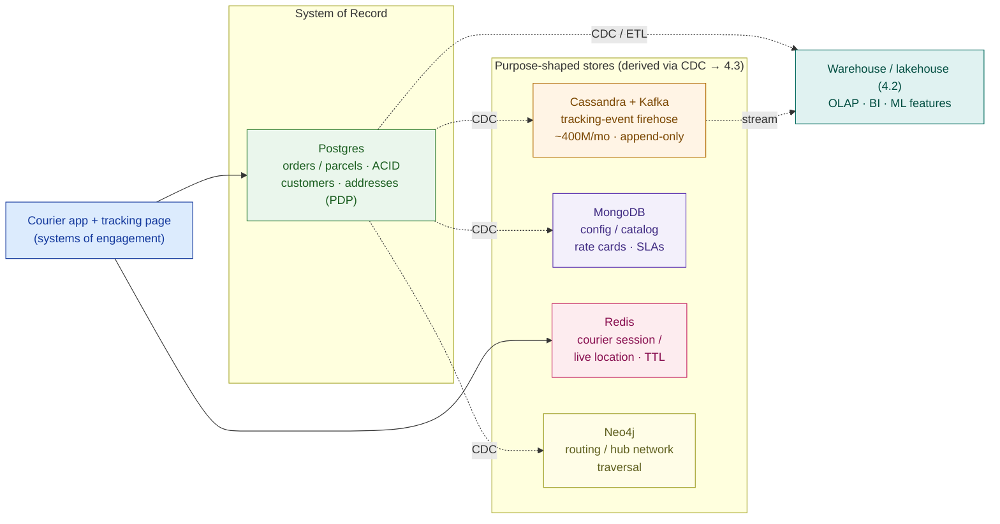

# Data Fundamentals (SQL vs NoSQL)

> Nobody needs "a database." They need the right store for each access pattern — so model the data first, then let the pattern pick the store.

**Type:** Design
**Track:** AI, Data & Infrastructure Solution Architect (Presales)
**Prerequisites:** Phase 3 (Cloud Architecture)
**Time:** ~5h
**Lab:** Postgres
**Ship It:** Data model + store-selection matrix

## The Problem

You are the SA on **Kirim Cepat** — a fast-growing Indonesian last-mile logistics company: ~50 million parcels a month, ~10,000 couriers, ~200 hubs, nationwide. Their data is a mess and everyone knows it: ~30 source systems (an operational Postgres for orders and tracking, a WMS, a TMS, the courier mobile app, finance/ERP) plus spreadsheets, no single source of truth, day-old batch reports, and duplicate customers and addresses no one can reconcile. The CTO opens the workshop with a sentence that sounds like a scoping win: *"We just need to consolidate everything into a proper database and give the business real-time visibility."* You nod, and in your head you're already picking one — "Postgres for everything," or the architect two chairs down is muttering "just put it all in MongoDB, it scales."

Both of those answers lose the deal, and they lose it the same way. Kirim Cepat's data is not one workload — it is at least six, each with a *completely different access pattern*. The **order ledger** (who sent what, who pays, what state it's in) needs transactions and referential integrity — money and legal liability ride on it. The **tracking-event firehose** — every scan at every hub by every courier — is append-only, time-ordered, and enormous: assume ~8 scan events per parcel and 50M parcels/month is already ~400 million writes a month, growing forever. The **live courier location** the app polls is a sub-millisecond key lookup that is worthless five minutes later. **Routing** across the hub network is a graph traversal. **Analytics** for the promised dashboards scans billions of rows. Force all six into one relational OLTP database and the tracking firehose either drowns the transactional writes or the analytics scans lock the order tables at the worst moment. Force all six into "one big Mongo" and you throw away the ACID guarantees the finance team is legally required to have.

Every one of those failures comes from the same root mistake: **reaching for "a database" before you have modeled the data or named the access pattern.** An SA who can't tell an OLTP point-write from an OLAP scan, or a system of record from a cache, designs a platform that is simultaneously too slow for the firehose, unsafe for the money, and too rigid for the config that changes weekly. This lesson gives you the two moves that prevent all of it: **model the domain** (so you know what the data *is* and where duplicates hide), and **match each workload's access pattern to the store that serves it** (so you stop buying one hammer for six different nails). Get this right and "consolidate into a proper database" becomes a defensible, tiered data platform — the foundation of Kirim Cepat's Capstone D.

## The Concept

A store choice is never "SQL or NoSQL?" It is a chain: **workload → access pattern → consistency need → store**. Run that chain for every workload and the platform designs itself. Skip it and you inherit the customer's accidental sprawl. Here is the whole decision on one page.



### Relational modeling & OLTP — the discipline that protects the money

The relational model stores data as **tables** (rows and columns) with two rules that make it the default for anything transactional:

- **Keys and referential integrity.** Every row has a **primary key (PK)** — a unique id. A **foreign key (FK)** is a column that points at another table's PK, and the database *refuses* to create a tracking event for a parcel that doesn't exist, or delete a customer who still has parcels. Integrity is enforced by the engine, not by hopeful application code.
- **Normalization.** You store each fact *once*, in one place, and reference it by key. A customer's address lives in an `addresses` table, not copied into every parcel. This is what kills Kirim Cepat's duplicate-address plague at the source: if the address exists once, there is one thing to verify and dedupe. (The formal target is *third normal form* — no repeating groups, every non-key column depends on the key.)

Relational databases guarantee **ACID** transactions — **A**tomic (all-or-nothing), **C**onsistent (constraints always hold), **I**solated (concurrent transactions don't corrupt each other), **D**urable (committed means committed). This is **OLTP** — *Online Transaction Processing* — many small, fast, correctness-critical reads and writes. When a Kirim Cepat parcel is created, paid for, and assigned in one transaction, ACID is why the customer is never charged for a parcel the system then forgets. **You do not give this up lightly.**

### The NoSQL families — each is a specialized answer, not a general upgrade

"NoSQL" is not one thing and it is not "better SQL." It is four different families, each optimized for one access pattern by *relaxing* something relational gives you (usually joins, or strong consistency, or a fixed schema):

| Family | Data shape | Access pattern it serves | Gives up | Reach for it when… |
|---|---|---|---|---|
| **Document** (MongoDB, Couchbase) | JSON-like documents | Fetch/replace a whole nested object by key; flexible schema | Cross-document joins, some consistency | Config, catalogs, content — data that is naturally one nested blob and changes shape often |
| **Key-value** (Redis, Memcached) | Key → opaque value | Get/set by exact key, sub-ms, TTL expiry | Queries on the value, durability (often) | Caches, sessions, live location, rate limits — ephemeral hot state |
| **Wide-column** (Cassandra, Bigtable, HBase) | Rows keyed by partition, sparse columns | Massive append + read by partition key and time | Ad-hoc joins, strong consistency by default | Time-series and event firehoses at write rates that break a single relational node |
| **Graph** (Neo4j, Neptune) | Nodes + edges | Traverse relationships, shortest path, "N hops from X" | Simple bulk scans, familiar tooling | Networks: routing, fraud rings, recommendations, org charts |

The trap the CTO nearly walked into: "MongoDB scales" is true *for its pattern* (whole-document fetch) and irrelevant for Kirim Cepat's order ledger, which needs the joins and ACID that a document store deliberately relaxes.

### Consistency — CAP, and "strong" vs "eventual"

Once data is spread across more than one machine, the **CAP theorem** bites: during a network **P**artition you can keep **C**onsistency *or* **A**vailability, not both. That forces a per-workload choice:

- **Strong consistency** — every read sees the latest write. Non-negotiable for the order ledger and payments: you must never read a stale balance. Relational OLTP defaults here.
- **Eventual consistency** — reads may briefly lag writes, but the system stays available and converges. Perfectly fine for a tracking event ("scanned at hub 12" arriving 200 ms late changes nothing) or a cached courier location. Wide-column and many NoSQL stores default here and are *faster and more available* because of it.

The architect's rule: **spend strong consistency only where correctness demands it, and take eventual everywhere else** — because eventual buys you the write throughput and availability the firehose needs.

### OLTP vs OLAP — two different jobs, two different engines

The single most expensive misunderstanding in data platforms is running analytics on the transactional database. They are opposite workloads:

```
                 OLTP  (transactions)                 OLAP  (analytics)
─────────────────────────────────────────────────────────────────────────────────
Question         "update THIS parcel now"             "avg delivery time by hub, 12 mo"
Rows touched     one / a few, by key                  billions, scanned + aggregated
Writes           constant, small, ACID                bulk load, then read-mostly
Storage layout   ROW store (whole row together)       COLUMN store (one column together)
Schema           normalized (no duplication)          dimensional / star (denormalized on purpose)
Wrong tool cost  analytics scans lock the ledger      per-row OLTP updates crawl on a column store
```

**Dimensional thinking (preview of 4.2):** OLAP models deliberately *denormalize* into facts (the tracking events, one row per measurable event) and dimensions (hub, courier, date, service type). Column stores scan one column across billions of rows ~100× more cheaply than a row store — which is why analytics belongs in a warehouse/lakehouse, never in the OLTP Postgres. You will build that in the next lesson; here you only need to know **it is a separate store because it is a separate job.**

### Indexing — the one lever that turns a scan into a seek

An **index** is a sorted side-structure (usually a B-tree) that lets the engine jump straight to matching rows instead of reading the whole table. Kirim Cepat's "where is my parcel?" lookup on `tracking_no` is a full-table scan without an index and an instant seek with one. The trade-off an architect must state: **every index speeds reads but slows writes** (each insert must update every index) and costs space. So you index the hot *read* paths and resist indexing every column of the *write*-heavy firehose. Indexing is an access-pattern decision, not a default.

### Polyglot persistence — the store-selection decision

Put it together and you get **polyglot persistence**: use more than one type of store, each matched to a workload's access pattern, instead of forcing everything into one. The decision artifact is a **store-selection matrix** — the ASCII below is the one you'll build for Kirim Cepat in *Design It*:

```
WORKLOAD                    ACCESS PATTERN                        CONSISTENCY   VOLUME / RATE          STORE FAMILY          WHY (the pattern picks it)
──────────────────────────────────────────────────────────────────────────────────────────────────────────────────────────────────────────────────
Orders / parcels (OLTP)     point read+write by id; multi-row     STRONG        ~50M new rows/mo;      Relational (Postgres)  ACID + FKs protect the money
                            txn; referential integrity            (ACID)        moderate write rate                          and the source of truth
Tracking events (firehose)  append-only; write-heavy; read by     eventual OK   ~400M writes/mo (A1);  Wide-column + log/     built for ordered append at
                            parcel_id + time range                              ~150–800 writes/sec    stream (Cassandra/     scale; OLTP row store chokes
                                                                                                       Kafka)
Config / catalog            read-mostly; nested, flexible         eventual OK   small; changes weekly  Document (MongoDB)     schema flexes per service type;
(hubs, rate cards, SLAs)    schema; fetch whole document                                                                     no joins needed
Courier session / live loc  key by courier_id; sub-ms get/set;    last-write-   ~10,000 hot keys;      Key-value (Redis)      RAM speed + TTL; ephemeral,
                            TTL, ephemeral                        wins          very high read rate                          NOT a system of record
Routing / network graph     traverse legs hub→hub, zone→courier;  eventual OK   ~200 hubs + edges,     Graph (Neo4j)          traversal is O(hops), not the
                            shortest path                                        10k couriers                                 O(joins) a relational DB pays
Analytics / BI / ML feats   scan + aggregate billions of rows,    eventual OK   whole-history scans,   OLAP columnar          column store scans ~100× less;
                            column-oriented                                     grows monthly          (warehouse → 4.2)      never run this on the ledger
──────────────────────────────────────────────────────────────────────────────────────────────────────────────────────────────────────────────────
A1 = events-per-parcel assumption (see Design It Step 3): ~8 avg, range 5–12.  "Eventual OK" = the workload tolerates brief lag for higher throughput/availability.
```

Polyglot is powerful but not free — every store added is another thing to run, secure, staff, and keep in sync. The architect's judgement is *how much* polyglot a customer actually needs, which is exactly the "it depends" in *Compare It*.

## Design It

**Goal:** produce Kirim Cepat's **data model + store-selection matrix** — a normalized relational core for the transactional domain, then a defensible mapping of every workload to the store its access pattern demands. Verbatim facts are fixed (50M parcels/month, 10,000 couriers, 200 hubs, ~30 source systems); every other number is a **labelled assumption with a range**.

### Step 1 — Model the core domain as a normalized relational schema

Start where correctness matters most: the transactional core. Six entities cover the parcel domain — `customers`, `addresses`, `hubs`, `couriers`, `parcels`, `tracking_events`. Model them normalized, with PKs and FKs, so each fact lives once and integrity is enforced by the engine.



Two modeling decisions to defend out loud:

- **`addresses` is its own table, not columns on `parcel` or `customer`.** This is the direct fix for the duplicate-address / data-quality driver: one address row, verified once (`is_verified`), referenced by many parcels. It is also where you later attach dedupe and PDP handling (customer PII lives in `customers` / `addresses`, so residency and access control have one place to bind).
- **`tracking_events` is modeled relationally *for the domain*, but that does not mean it lives in Postgres at scale.** The model shows the relationships; Step 3 decides the store. Keep those two ideas separate — the ER diagram is the *logical* model, the store-selection matrix is the *physical* placement.

### Step 2 — Validate the model in Postgres (copy-run lab)

A model you can't run is a hypothesis. Stand up Postgres, create the schema, and run the "trace one parcel's journey" query — the exact join the customer's tracking page needs. This validates the design claim that the normalized model answers the real question in one query.

```bash
# 1) Start a throwaway Postgres (nothing to install but Docker)
docker run --rm --name kc-pg -e POSTGRES_PASSWORD=kirim -p 5432:5432 -d postgres:16
sleep 5   # give it a moment to accept connections

# 2) Create the schema, seed a few rows, and run the journey query
docker exec -i kc-pg psql -U postgres -v ON_ERROR_STOP=1 <<'SQL'
CREATE TABLE customers (
  customer_id bigint GENERATED ALWAYS AS IDENTITY PRIMARY KEY,
  name  text NOT NULL,
  phone text,
  email text
);
CREATE TABLE addresses (
  address_id  bigint GENERATED ALWAYS AS IDENTITY PRIMARY KEY,
  customer_id bigint NOT NULL REFERENCES customers(customer_id),
  line1 text NOT NULL,
  city  text,
  postal_code text,
  is_verified boolean NOT NULL DEFAULT false
);
CREATE TABLE hubs (
  hub_id bigint GENERATED ALWAYS AS IDENTITY PRIMARY KEY,
  code text UNIQUE NOT NULL,
  name text,
  province text
);
CREATE TABLE couriers (
  courier_id bigint GENERATED ALWAYS AS IDENTITY PRIMARY KEY,
  home_hub_id bigint REFERENCES hubs(hub_id),
  name text NOT NULL,
  status text NOT NULL DEFAULT 'active'
);
CREATE TABLE parcels (
  parcel_id bigint GENERATED ALWAYS AS IDENTITY PRIMARY KEY,
  tracking_no text UNIQUE NOT NULL,
  sender_customer_id  bigint NOT NULL REFERENCES customers(customer_id),
  pickup_address_id   bigint NOT NULL REFERENCES addresses(address_id),
  delivery_address_id bigint NOT NULL REFERENCES addresses(address_id),
  weight_kg numeric(6,2),
  status text NOT NULL DEFAULT 'created',
  created_at timestamptz NOT NULL DEFAULT now()
);
CREATE TABLE tracking_events (
  event_id bigint GENERATED ALWAYS AS IDENTITY PRIMARY KEY,
  parcel_id bigint NOT NULL REFERENCES parcels(parcel_id),
  hub_id     bigint REFERENCES hubs(hub_id),
  courier_id bigint REFERENCES couriers(courier_id),
  event_type text NOT NULL,
  event_time timestamptz NOT NULL DEFAULT now()
);

-- Index the hot read paths (Step 5): the "where is my parcel?" lookup and the journey scan.
CREATE INDEX idx_parcels_tracking_no ON parcels(tracking_no);
CREATE INDEX idx_events_parcel_time  ON tracking_events(parcel_id, event_time);

-- Seed just enough to prove the joins hold.
INSERT INTO customers(name, phone) VALUES ('Sari Dewi', '0811-0001');
INSERT INTO hubs(code, name, province) VALUES ('JKT-01','Jakarta Pusat','DKI Jakarta'), ('BDG-01','Bandung','Jawa Barat');
INSERT INTO couriers(home_hub_id, name) VALUES (1,'Budi'), (2,'Andi');
INSERT INTO addresses(customer_id, line1, city, is_verified) VALUES (1,'Jl. Sudirman 1','Jakarta',true), (1,'Jl. Asia Afrika 5','Bandung',true);
INSERT INTO parcels(tracking_no, sender_customer_id, pickup_address_id, delivery_address_id, weight_kg)
  VALUES ('KC00000001', 1, 1, 2, 1.50);
INSERT INTO tracking_events(parcel_id, hub_id, courier_id, event_type, event_time) VALUES
  (1, 1, 1, 'picked_up',   now() - interval '6 hours'),
  (1, 1, 1, 'at_hub',      now() - interval '5 hours'),
  (1, 2, 2, 'out_for_delivery', now() - interval '1 hour'),
  (1, 2, 2, 'delivered',   now());

-- The query the tracking page needs: one parcel's full journey, newest last.
SELECT p.tracking_no, e.event_type, h.code AS hub, c.name AS courier, e.event_time
FROM   parcels p
JOIN   tracking_events e ON e.parcel_id = p.parcel_id
LEFT   JOIN hubs h     ON h.hub_id     = e.hub_id
LEFT   JOIN couriers c ON c.courier_id = e.courier_id
WHERE  p.tracking_no = 'KC00000001'
ORDER  BY e.event_time;
SQL

# 3) Clean up
docker rm -f kc-pg
```

The query returns the four events in order, joined to hub codes and courier names — proof the normalized model answers the customer-facing question cleanly, and that FKs would have *rejected* an event for a non-existent parcel. That correctness is exactly what you refuse to give up for the order domain.

### Step 3 — Size the tracking firehose and prove it can't share the OLTP store

Now the decision the naïve "one Postgres" answer gets wrong. Derive the write rate from the one verbatim volume fact.

```
GIVEN (verbatim):   ~50,000,000 parcels / month
A1  events per parcel = 5–12  (pickup, hub-in, hub-out, line-haul, out-for-delivery, delivered, exceptions)  → design 8
    events / month  ≈  50M × 8  ≈  400,000,000 writes / month
    per day         ≈  400M ÷ 30 ≈  13.3M / day
    per second avg  ≈  13.3M ÷ 86,400 ≈ ~150 writes/sec  ;  peak ×3–5 → ~500–800 writes/sec
    per YEAR        ≈  4.8 billion rows, and it never stops growing
BYTES are NOT the binding axis:  ~200 B/event → ~80 GB/month raw.  The problem is the
ROW COUNT + sustained WRITE RATE on the same node that must also serve ACID order transactions.
```

This is the storage-lesson lesson again in a new guise: **capacity isn't what binds — the access pattern is.** A single relational primary node absorbing ~150–800 sustained writes/sec of append-only events, on top of the order OLTP load, will contend on locks, bloat indexes, and turn every analytics scan into a table-lock incident. The firehose is append-only, read by `parcel_id` + time, and tolerant of eventual consistency — the textbook profile for a **wide-column store** (Cassandra/Bigtable) fed by a **log/stream** (Kafka), which is built to absorb ordered append at this rate and scale horizontally. So the model stays relational (Step 1), but the *store* for events is not the OLTP Postgres. Naming that split is the whole job.

### Step 4 — Build the store-selection matrix (workload → access pattern → store)

Run the chain for all six workloads and record the decision. This is the deliverable's core.

| Workload | Access pattern | Consistency | Store family | Concrete pick | Justification (the pattern) |
|---|---|---|---|---|---|
| Orders / parcels | Point read+write by id, multi-row txn, FKs | **Strong (ACID)** | Relational | **Postgres** | Money + legal liability; integrity enforced by engine; this is the **system of record** |
| Tracking events | Append-only firehose, read by parcel_id+time | Eventual OK | Wide-column + log | **Cassandra + Kafka** | ~400M writes/mo (A1); OLTP node can't absorb it; ordered append at scale |
| Config / catalog | Whole-doc fetch, flexible nested schema | Eventual OK | Document | **MongoDB** | Rate cards, SLAs, hub metadata change shape often; no joins needed |
| Courier session / live location | Key get/set by courier_id, sub-ms, TTL | Last-write-wins | Key-value | **Redis** | 10,000 hot keys, very high read rate, ephemeral — a cache, not a record |
| Routing / network graph | Traverse hub→hub legs, shortest path | Eventual OK | Graph | **Neo4j** | Traversal is O(hops); relational joins explode with hop count |
| Analytics / BI / ML features | Scan + aggregate billions of rows, columnar | Eventual OK | OLAP columnar | **Warehouse/lakehouse (4.2)** | Column store scans ~100× less; never on the ledger |

Every row is defensible in one sentence, and the sentence is always the *access pattern* — never "because it's popular." That is what separates this from "just use MongoDB."

### Step 5 — Index the hot paths and draw the polyglot platform

Two finishing moves an architect always makes explicit:

- **Indexing (access-pattern-driven, not blanket).** Index `parcels(tracking_no)` for the customer "where is my parcel?" lookup, and `tracking_events(parcel_id, event_time)` for the journey scan (both created in the Step 2 lab). Do **not** index every column of the firehose — each index taxes the write rate you just sized. Index reads you actually serve; leave the rest.
- **Polyglot map + the glue.** Postgres is the **system of record** for orders; the other stores are downstream, kept in sync by **change data capture (CDC)** — a forward reference to lesson 4.3. Drawing this makes the "one source of truth" promise concrete: truth lives in Postgres, everything else is a derived, purpose-shaped copy.



That is the whole design: a normalized relational core that owns the truth, a matrix that places every other workload on the store its access pattern demands, indexes on the read paths, and CDC as the glue. The *Ship It* template turns it into a form a colleague can run on the next deal.

## Compare It

Three "it depends" the customer will push on. Answer each with the access pattern, not the brand.

**Postgres vs MySQL (the relational OLTP pick).** Both are mature, free, and safe for the order ledger. **Postgres** wins for Kirim Cepat: richer types (native `JSONB` lets you defer *some* NoSQL, arrays, strong constraints), **PostGIS** for the geo/address data at the heart of a logistics company, and stricter standards compliance. **MySQL** is simpler, has a vast hosting ecosystem, and very mature read-replica replication — a fine default for straightforward web CRUD. Rule of thumb: *complex data + geo + you want one engine to stretch → Postgres; simple, read-heavy, huge commodity hosting → MySQL.*

| | **MongoDB** (document) | **DynamoDB** (managed key-value/doc) | **Cassandra** (wide-column) |
|---|---|---|---|
| Best access pattern | Whole-doc fetch, flexible schema | Key lookups at any scale, predictable latency | Massive ordered append + time-range reads |
| Consistency | Tunable, strong within a doc | Strong or eventual per-request | Tunable (quorum), eventual by default |
| Scaling | Sharding | Automatic, serverless | Peer-to-peer, linear, multi-DC |
| Ops burden | Medium | **Low** (fully managed) — but AWS-locked | **High** — you run the ring |
| Residency (PDP) | Self-host or Atlas in-country | Needs an in-country AWS region | Self-host in-country control |
| Fits Kirim Cepat for… | Config / catalog | (avoid lock-in unless all-in on AWS) | The tracking firehose |

The nuance for a **cost-conscious, PDP-bound, mixed-skill** customer: DynamoDB's zero-ops is genuinely attractive, but it hard-couples them to AWS and pushes all data modeling to be access-pattern-first up front (change a query later, redesign the table). Cassandra fits the firehose technically but is operationally heavy — a real cost against "mixed SQL skill in business teams."

**One store vs polyglot persistence.** The maximal-polyglot diagram in Step 5 is the *target*, not the *starting point*. Every store added is another thing to secure, staff, keep in-country, and glue with CDC — and Kirim Cepat is explicitly cost-conscious with mixed skills. The defensible recommendation is **pragmatic polyglot, phased**:

- **Phase 1 — do more with fewer stores.** Postgres as the system of record for orders *and*, using `JSONB`, the config/catalog too; Redis for the one thing a relational DB genuinely can't do (sub-ms live location). Two stores, small team, ships fast.
- **Phase 2 — split when a pattern forces it.** The tracking firehose is the first forced split (Step 3 proves Postgres can't hold it) → add Kafka + a wide-column sink. This is also where 4.3 (streaming/CDC) and 4.2 (lakehouse) land.
- **Phase 3 — add graph only when routing is a real product feature**, not on day one.

Saying "you do **not** need six databases in month one" is what an architect does — it matches the store roadmap to the customer's actual maturity and budget, and it beats the competitor who quotes the full zoo up front.

## Ship It

This lesson ships a reusable **Data Model + Store-Selection Matrix** — the artifact that turns "consolidate into a proper database" into a modeled domain plus a defensible, access-pattern-driven store map. Both files live in [`outputs/`](../outputs/):

- **[`template-data-model-and-store-selection.md`](../outputs/template-data-model-and-store-selection.md)** — a fill-in-the-blank template: an ER-model skeleton + normalization checklist, an access-pattern register, the workload→access-pattern→store matrix with a justification column, an indexing plan, a phased polyglot roadmap (Mermaid + ASCII), and a risks/assumptions log. A colleague can run it on any data-platform deal.
- **[`example-kirim-cepat-data-model.md`](../outputs/example-kirim-cepat-data-model.md)** — the template fully worked for Kirim Cepat, so the skeleton isn't abstract: the six-entity normalized model, the firehose sizing (~400M events/month from A1), the six-row store-selection matrix, and the phased Phase 1→3 roadmap.

This deliverable is the data-modeling foundation of **Capstone D (Enterprise Data Platform)** — the lakehouse (4.2), streaming/CDC (4.3), and governance (4.5) lessons all build on the model and matrix you produce here.

## Exercises

1. **(Easy)** Take Kirim Cepat's store-selection matrix from Step 4. For each of the six workloads, name the *single tightest* access-pattern property (e.g. "append rate", "sub-ms latency", "referential integrity") that forces its store. Then write one sentence, using the Step 3 firehose sizing (not byte capacity), explaining why the tracking events cannot share the order OLTP Postgres.
2. **(Medium)** Re-run the method for a **different customer**: a national **food-delivery marketplace** (restaurants, menus, orders, drivers, live order tracking, reviews). Draw a normalized ER model for its core domain, then build a store-selection matrix — classify each workload's access pattern and pick a store family, justifying each by the pattern. State every volume figure as a labelled assumption with a range.
3. **(Hard)** Extend Kirim Cepat's design into a **decision** the CTO will ask for: should the tracking firehose be **Cassandra self-hosted** vs **DynamoDB** vs **stay in Postgres with monthly partitioning**? Write a half-page recommendation naming the access-pattern fit, the PDP/residency and cost-vs-ops trade-off, and the failure mode of each path. Reuse the Step 3 sizing, and carry the recommendation into your **Capstone D** platform HLD.

## Key Terms

| Term | What people say | What it actually means |
|------|-----------------|------------------------|
| Normalization | "Splitting tables" | Storing each fact once and referencing it by key, so there is one place to update and dedupe. The direct fix for duplicate-customer/address data quality. |
| Primary / foreign key | "The id column" | PK uniquely identifies a row; FK points at another table's PK and lets the engine *enforce* that references are valid — integrity in the database, not hopeful app code. |
| ACID | "It's reliable" | Atomic, Consistent, Isolated, Durable transactions. The guarantee that a payment and its parcel commit together or not at all. What you refuse to give up for money. |
| OLTP | "The app database" | Online Transaction Processing — many small, fast, correctness-critical reads/writes by key. The order ledger's job. |
| OLAP | "Reporting" | Online Analytical Processing — scan-and-aggregate over huge history on a column store. A *separate* store because it's a separate job; running it on OLTP locks the ledger. |
| CAP theorem | "You can't have it all" | Under a network partition you choose Consistency or Availability. Forces a per-workload call: strong for money, eventual for events. |
| Eventual consistency | "It's out of date" | Reads may briefly lag writes but the system stays available and converges. Correct and *desirable* for tolerant workloads like tracking events — it buys throughput. |
| Document store | "MongoDB" | Stores JSON-like documents fetched whole by key; flexible schema, weak on joins. For config/catalog/content, not the order ledger. |
| Key-value store | "A cache" | Get/set by exact key at RAM speed with TTL. For sessions, live location, rate limits — ephemeral hot state, never a system of record. |
| Wide-column store | "Cassandra" | Rows keyed by partition with sparse columns, built for massive ordered append and time-range reads. The home for an event firehose that would break a relational node. |
| Graph database | "Neo4j" | Nodes + edges where traversal is O(hops). For routing/networks/fraud where relational joins explode with each hop. |
| Polyglot persistence | "Lots of databases" | Deliberately using several store types, each matched to a workload's access pattern — with the judgement to phase them in, not deploy the whole zoo on day one. |
| Index | "Makes it fast" | A sorted side-structure that turns a table scan into a seek; speeds reads, taxes writes. An access-pattern decision, not a default on every column. |
| System of record vs cache/copy | "The database" | The SoR (Postgres here) owns the truth; derived stores (Redis, Cassandra, the lakehouse) are purpose-shaped copies kept in sync by CDC. Read truth from the SoR. |

## Further Reading

- [Martin Kleppmann — *Designing Data-Intensive Applications*](https://dataintensive.net/) — the definitive architect-altitude treatment of relational vs NoSQL, consistency, and how the access pattern picks the store. Read chapters 2–3 and 5 before any data-platform deal.
- [PostgreSQL — Data Types](https://www.postgresql.org/docs/current/datatype.html) and [Indexes](https://www.postgresql.org/docs/current/indexes.html) — the two pages that let one relational engine stretch across more workloads (JSONB, arrays) and the indexing trade-offs you must state.
- [MongoDB — Data Modeling Introduction](https://www.mongodb.com/docs/manual/core/data-modeling-introduction/) — how document modeling differs from relational, so you recognize when config/catalog fits it and when it does not.
- [AWS — DynamoDB single-table design & access patterns](https://docs.aws.amazon.com/amazondynamodb/latest/developerguide/bp-general-nosql-design.html) — the "model from access patterns first" discipline that applies to *all* NoSQL, not just DynamoDB.
- [Apache Cassandra — Data modeling for time-series / append workloads](https://cassandra.apache.org/doc/latest/cassandra/developing/data-modeling/intro.html) — why wide-column is built for the event firehose, and the ops cost that comes with it.
- [Kimball Group — Dimensional Modeling Techniques](https://www.kimballgroup.com/data-warehouse-business-intelligence-resources/kimball-techniques/dimensional-modeling-techniques/) — the star-schema preview for lesson 4.2, so you see where the OLAP half of the split goes next.
