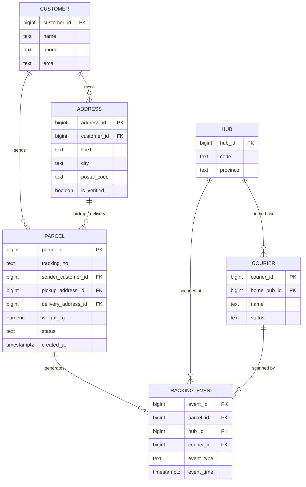
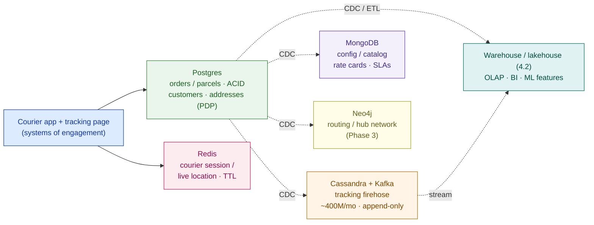

# Data Model + Store-Selection Matrix — Kirim Cepat (worked example)

> This is `template-data-model-and-store-selection.md` filled in for the running customer. It shows what "good" looks like: a modeled domain, a firehose sized from a verbatim number, and every store choice justified by an access pattern. It is the data-modeling foundation of **Capstone D — Enterprise Data Platform**.

**Customer:** Kirim Cepat (fictional)  ·  **Industry:** Last-mile logistics / delivery, Indonesia
**Prepared by:** SA — Presales  ·  **Date:** 2026-07-05  ·  **Opportunity:** Enterprise data platform (consolidate ~30 source systems → single source of truth + real-time visibility)  ·  **Version:** v0.2
**Residency / compliance:** Indonesia **PDP** — customer & address PII must stay in-country  ·  **Team SQL/data skill:** mixed (business teams low-to-mid SQL)  ·  **Cost posture:** cost-conscious, fast-growing volume

**Company shape (verbatim):** ~50 million parcels/month · ~10,000 couriers · ~200 hubs · nationwide · ~30 siloed source systems (operational Postgres, WMS, TMS, courier app, finance/ERP) + spreadsheets · nightly-batch reports only.
**Drivers:** real-time parcel & fleet visibility · unified analytics (lakehouse) · governance + data quality (dedupe address/customer, PDP) · self-service BI · ML runway (ETA, demand forecasting).
**Constraints:** fast-growing volume · PDP/residency in-country · mixed SQL skill · cost-conscious.

Legend: **SoR** = system of record · **ACID** = atomic-consistent-isolated-durable · **CDC** = change data capture · **A1** = the events-per-parcel assumption.

---

## 1. Core domain model (normalized relational)

Six entities cover the parcel domain. Modeled relationally with PKs, FKs, and clear cardinality — the logical truth, independent of where each table finally lives.



**Normalization checklist (defended):**

- [x] Every entity has a **primary key**.
- [x] Every relationship is a **foreign key** — e.g. a `tracking_event` cannot exist for a non-existent `parcel`; the engine enforces it.
- [x] **`addresses` is its own table**, referenced by `parcels` (pickup + delivery) and owned by `customers`. This is the direct fix for the duplicate-address / data-quality driver: one address row, verified once (`is_verified`), reused everywhere.
- [x] **PII isolated** in `customers` and `addresses` — the single place PDP residency and access control bind.
- [x] Third normal form; `tracking_events` is modeled here relationally but **placed** on a wide-column store at scale (§3) — logical model ≠ physical store.

## 2. Access-pattern register

| Workload | Read/write shape | Consistency | Volume / rate | Latency |
|---|---|---|---|---|
| Orders / parcels | point read+write by id, multi-row txn, FKs | **STRONG (ACID)** | ~50M new rows/mo | ms |
| Tracking events | append-only, read by parcel_id + time | eventual OK | ~400M writes/mo (see §2b) | tolerant |
| Config / catalog (hubs, rate cards, SLAs) | whole-doc fetch, flexible nested schema | eventual OK | small, changes weekly | ms |
| Courier session / live location | key by courier_id, sub-ms get/set, TTL | last-write-wins | ~10,000 hot keys | sub-ms |
| Routing / hub network | traverse hub→hub legs, shortest path | eventual OK | ~200 hubs + edges, 10k couriers | tolerant |
| Analytics / BI / ML features | scan + aggregate billions of rows, columnar | eventual OK | whole-history scans, grows monthly | batch/interactive |

### 2b. Firehose sizing — why tracking events can't share the OLTP Postgres

```
GIVEN (verbatim):   ~50,000,000 parcels / month
A1  events per parcel = 5–12 (pickup, hub-in, hub-out, line-haul, out-for-delivery, delivered, exceptions) → design 8
    events / month  ≈  50M × 8  ≈  400,000,000 writes / month
    per day         ≈  400M ÷ 30 ≈ 13.3M / day
    per second avg  ≈  13.3M ÷ 86,400 ≈ ~150 writes/sec ; peak ×3–5 → ~500–800 writes/sec
    per YEAR        ≈  4.8 billion rows, and it never stops growing
BINDING AXIS:  row count + sustained write rate — NOT bytes (~200 B/event → ~80 GB/mo raw).
A single relational primary absorbing ~150–800 sustained append-writes/sec ON TOP of the
order OLTP load will contend on locks, bloat indexes, and turn analytics scans into table-lock
incidents.  → the firehose needs a wide-column store (Cassandra) fed by a log/stream (Kafka).
```

The tracking events stay relationally *modeled* (§1) but are *placed* off the OLTP Postgres. Naming that split is the core design decision.

## 3. Store-selection matrix (workload → access pattern → store)

| Workload | Access pattern | Consistency | Store family | Concrete pick | Justification (the pattern) |
|---|---|---|---|---|---|
| Orders / parcels | point txn by id, FKs | **STRONG (ACID)** | Relational | **Postgres** | Money + legal liability; integrity in the engine; the **system of record** |
| Tracking events | append firehose, by parcel_id+time | eventual OK | Wide-column + log | **Cassandra + Kafka** | ~400M writes/mo (A1); OLTP node can't absorb it; ordered append at scale |
| Config / catalog | whole-doc, flexible schema | eventual OK | Document | **MongoDB** | Rate cards / SLAs / hub metadata change shape often; no joins |
| Courier session / live location | key get/set, sub-ms, TTL | last-write-wins | Key-value | **Redis** | 10,000 hot keys, very high read rate, ephemeral — a cache, not a record |
| Routing / hub network | traverse legs, shortest path | eventual OK | Graph | **Neo4j** | Traversal is O(hops); relational joins explode with hop count |
| Analytics / BI / ML | scan + aggregate, columnar | eventual OK | OLAP columnar | **Warehouse/lakehouse (4.2)** | Column store scans ~100× less; never on the ledger |

Every choice is defensible in one sentence, and the sentence is always the **access pattern** — never "because it's popular." Postgres is chosen over MySQL for the geo/address data (PostGIS) and JSONB reach that lets Phase 1 stay small.

## 4. Indexing plan + phased polyglot roadmap

**Indexes (hot read paths only):**

| Table | Index | Serves | Cost noted |
|---|---|---|---|
| `parcels` | `(tracking_no)` | customer "where is my parcel?" lookup | small write tax; high payoff |
| `tracking_events` | `(parcel_id, event_time)` | one parcel's journey / time-range scan | do **not** index every firehose column |

**Phased rollout — store count tracks maturity + budget (mixed skill, cost-conscious):**

```
PHASE 1 — do more with fewer stores  (ships fast, small team)
   Postgres = SoR for orders  +  config/catalog in JSONB   |   Redis for live courier location
PHASE 2 — split when a pattern forces it
   add Kafka + Cassandra for the tracking firehose (§2b)    → ties to 4.3 streaming/CDC, 4.2 lakehouse
PHASE 3 — add specialist stores only when the feature is real
   Neo4j for routing/network optimization                   → when routing becomes a product feature
```



### ASCII fallback

```
                         ┌──────────────────────────────┐
  courier app + ───────▶ │  POSTGRES  (System of Record)│ ◀── truth: ACID orders, PII (PDP), FKs
  tracking page  │       │  orders · customers · address│
        │ sub-ms         └───────┬──────────────────────┘
        ▼                        │ CDC (→ 4.3)
   ┌──────────┐   ┌──────────────┼──────────────┬────────────────────┐
   │  REDIS   │   ▼              ▼              ▼                    ▼
   │ session/ │  CASSANDRA+     MONGODB        NEO4J          WAREHOUSE / LAKEHOUSE
   │ live loc │  KAFKA          config/        routing        OLAP · BI · ML  (→ 4.2)
   └──────────┘  tracking       catalog        (Phase 3)      ▲
                 firehose ~400M/mo └──────── stream ───────────┘
Truth = Postgres.  Cassandra / Mongo / Neo4j / lakehouse = purpose-shaped copies synced by CDC.
Phase 1: Postgres + Redis.  Phase 2: + Kafka/Cassandra.  Phase 3: + Neo4j.
```

## 5. Headline, risks & one-line design statement

**Executive headline:**
> Kirim Cepat's data is **six different workloads, not one database**. Truth lives in **Postgres** (ACID orders, customer/address PII under PDP, the source of truth); the **~400M-events/month tracking firehose** goes to **Cassandra + Kafka**; config/catalog to **MongoDB**; live courier location to **Redis**; routing to **Neo4j**; analytics to a **lakehouse**. Rolled out in **3 phases** — Postgres + Redis first, the firehose split second, graph last — so store count tracks the team's mixed skill and cost-conscious budget, not six databases in month one.

| # | Risk / assumption to confirm | Impact if wrong | Owner | Severity |
|---|---|---|---|---|
| 1 | A1 — events per parcel (5–12, design 8) and peak factor | Under-sized firehose split → OLTP lock incidents | Data eng | **H** |
| 2 | PDP residency for any managed NoSQL (e.g. DynamoDB/Atlas region) | Non-compliance + vendor lock | Compliance | **H** |
| 3 | Mixed skill vs ops-heavy Cassandra / Neo4j | Team can't operate the chosen store | Platform | **H** |
| 4 | Consistency per workload (strong for orders, eventual for events) | Stale reads on money, or over-strict on events | Architect | M |
| 5 | Phasing vs pressure to "buy the whole platform now" | Over-spend + operational overload on day one | SA / sponsor | M |

**One-line design statement:**
> Kirim Cepat's platform is **polyglot by access pattern**: **Postgres** (SoR) for transactions, **Cassandra + Kafka** for the ~400M-events/month firehose, **MongoDB** for config, **Redis** for live location, **Neo4j** for routing, and a **lakehouse** for analytics — modeled once, placed by pattern, phased over three stages, with Postgres as the source of truth kept in sync by CDC.

## Carry-forward → Capstone D (Enterprise Data Platform)

| Item | Value to carry | Where it lands |
|---|---|---|
| Core domain model | 6-entity normalized parcel schema (§1) | HLD — canonical data model; governance (4.5) MDM anchor |
| System of record | Postgres owns orders + PII (PDP) | HLD — SoR + residency mapping |
| Firehose placement | Cassandra + Kafka, ~400M events/mo (A1) | Streaming architecture (4.3); lakehouse ingest (4.2) |
| Store-selection matrix | 6 workloads → stores, each justified by pattern | HLD — polyglot storage section + BOM lines |
| Phased roadmap | Phase 1 (PG+Redis) → 2 (firehose) → 3 (graph) | HLD — rollout plan + cost staging |
| Dedupe / data-quality hook | `addresses`/`customers` isolated for MDM + PDP | Governance framework (4.5) |

> Every figure here is a **design point with a stated assumption and range** — the number the customer can challenge and you can defend, line by line.
