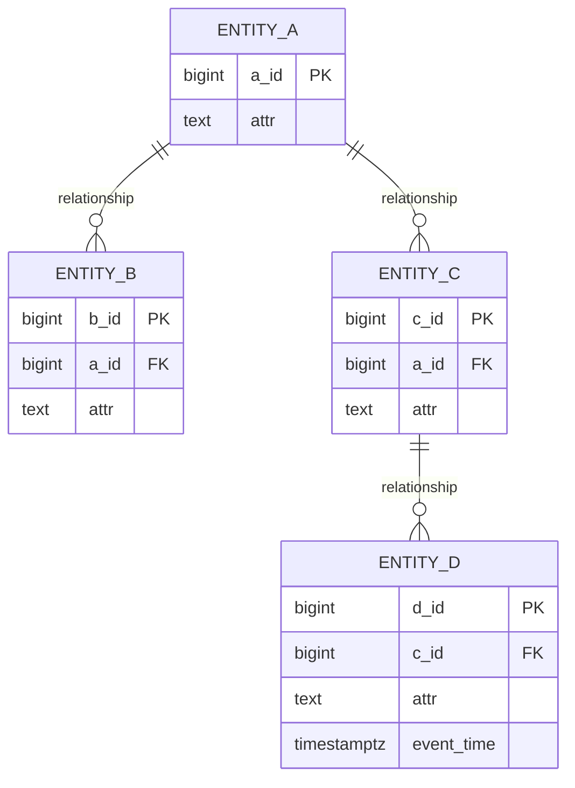
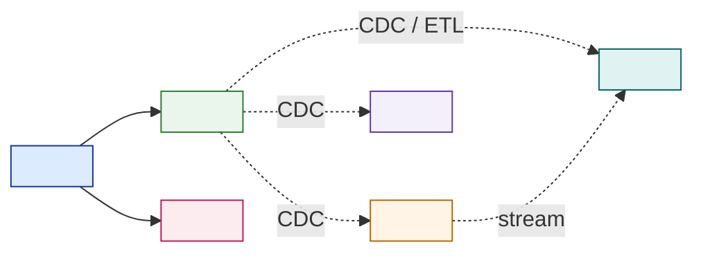

# Data Model + Store-Selection Matrix — Template

> Fill this in when a customer says "consolidate everything into a proper database." It forces the two moves that prevent slow, unsafe, or over-sprawled platforms: **model the domain** (so you know what the data is and where duplicates hide) and **match each workload to the store its access pattern demands** (so you stop buying one hammer for six nails). An executive should read §5's headline; an engineer should trust §1–§4. Never pick a store without naming the **access pattern** that forces it.

**Customer:** `<company>`  ·  **Industry:** `<industry>`  ·  **Prepared by:** `<SA name>`  ·  **Date:** `<YYYY-MM-DD>`
**Engagement / opportunity:** `<deal or project name>`  ·  **Version:** `<v0.1 draft>`
**Residency / compliance:** `<e.g. PDP / GDPR — in-country?>`  ·  **Team SQL/data skill:** `<thin / mixed / strong>`  ·  **Cost posture:** `<cost-conscious / balanced>`

Legend: **PK/FK** = primary/foreign key · **ACID** = atomic-consistent-isolated-durable · **OLTP** = transactions · **OLAP** = analytics · **SoR** = system of record · **CDC** = change data capture.

---

## How to use this template

1. **Model the core domain** as a normalized relational schema — entities, PKs, FKs, cardinality (§1).
2. **Register the access pattern** of every workload (read/write shape, consistency, volume) (§2).
3. **Size any firehose / high-volume workload** from a verbatim number, to prove where it can't live (§2b).
4. **Map workload → access pattern → store**, one justification sentence each (§3).
5. **Plan indexes** on the hot read paths only; **phase the polyglot rollout** (§4).
6. **State the headline, risks, and the one-line design statement** (§5).

> **Golden rule:** the access pattern picks the store — never the brand. "It scales" is only true *for a pattern*. Model first, then place each workload on the store that serves how it is actually read and written.

---

## 1. Core domain model (normalized relational)

> Model the transactional core relationally *regardless* of where each table finally lives — the ER model is the logical truth; §3 decides physical placement.



**Normalization checklist (defend each):**

- [ ] Every entity has a **primary key**.
- [ ] Every relationship is a **foreign key** — integrity enforced by the engine, not app code.
- [ ] **Shared, duplication-prone data** (addresses, customers, products) is its **own table**, referenced by key — this is the fix for the customer's data-quality / dedupe pain.
- [ ] **PII / regulated data** is isolated in named tables so residency and access control bind in one place: `<which tables hold PII>`.
- [ ] No repeating groups; each non-key column depends on the key (third normal form) — unless you *deliberately* denormalize and note why.

## 2. Access-pattern register (one row per workload)

| Workload | Read/write shape | Consistency need | Volume / rate | Latency need |
|---|---|---|---|---|
| `<orders / core txn>` | `<point read+write by id, multi-row txn>` | `<STRONG (ACID)>` | `<rows/mo>` | `<ms>` |
| `<event / activity firehose>` | `<append-only, read by key+time>` | `<eventual OK>` | `<writes/sec — size it §2b>` | `<tolerant>` |
| `<config / catalog>` | `<whole-doc fetch, flexible schema>` | `<eventual OK>` | `<small>` | `<ms>` |
| `<session / cache / live state>` | `<key get/set, TTL, ephemeral>` | `<last-write-wins>` | `<hot keys>` | `<sub-ms>` |
| `<network / relationships>` | `<traverse edges, shortest path>` | `<eventual OK>` | `<nodes/edges>` | `<tolerant>` |
| `<analytics / BI / ML>` | `<scan + aggregate, columnar>` | `<eventual OK>` | `<whole-history scans>` | `<batch/interactive>` |

### 2b. Size the high-volume workload (don't guess — derive it)

```
GIVEN (verbatim):   <N> <units> / <period>
Ax  <multiplier assumption, e.g. events per unit> = <lo>–<hi>   → design <mid>
    <derived> / <period>  ≈  <N> × <mid>  ≈  <total>
    per second avg  ≈  <total ÷ seconds>  ;  peak ×<f> → <peak> writes/sec
    per YEAR        ≈  <rows> — and it keeps growing
BINDING AXIS:  <row count + sustained write rate>, NOT bytes.  A single OLTP node serving
<total>/period of append on top of transactional load will contend, bloat, and lock.
→ this workload needs <wide-column + stream>, not the OLTP store.
```

## 3. Store-selection matrix (workload → access pattern → store)

| Workload | Access pattern | Consistency | Store family | Concrete pick | Justification (the pattern — one sentence) |
|---|---|---|---|---|---|
| `<orders>` | `<point txn, FKs>` | `<STRONG>` | Relational | `<Postgres/MySQL>` | `<ACID + integrity protect the money; system of record>` |
| `<firehose>` | `<append, by time>` | `<eventual>` | Wide-column + log | `<Cassandra + Kafka>` | `<built for ordered append at scale; OLTP node chokes>` |
| `<config>` | `<whole-doc>` | `<eventual>` | Document | `<MongoDB>` | `<flexible nested schema, no joins needed>` |
| `<session>` | `<key, sub-ms, TTL>` | `<LWW>` | Key-value | `<Redis>` | `<RAM speed + expiry; cache, not a record>` |
| `<network>` | `<traversal>` | `<eventual>` | Graph | `<Neo4j>` | `<O(hops) beats exploding relational joins>` |
| `<analytics>` | `<scan+aggregate>` | `<eventual>` | OLAP columnar | `<warehouse/lakehouse>` | `<column store scans ~100× less; never on the ledger>` |

*Rule:* transactional + correctness-critical → **relational**; whole-object + flexible → **document**; ephemeral hot key → **key-value**; massive ordered append → **wide-column + stream**; relationship traversal → **graph**; scan-and-aggregate history → **OLAP columnar**.

## 4. Indexing plan + phased polyglot roadmap

**Indexes (hot read paths only — every index taxes writes):**

| Table | Index | Serves which query | Cost noted |
|---|---|---|---|
| `<parcels>` | `<(tracking_no)>` | `<"where is my X?" lookup>` | `<write tax small>` |
| `<events>` | `<(parent_id, event_time)>` | `<journey / time-range scan>` | `<don't index every column>` |

**Phased rollout (match store count to customer maturity + budget — do NOT deploy the whole zoo on day one):**

```
PHASE 1 — do more with fewer stores
   <Relational SoR (+ JSONB for config)>  ·  <Key-value for the one sub-ms need>
PHASE 2 — split when a pattern forces it
   <add stream + wide-column for the firehose>  (ties to 4.2 lakehouse, 4.3 streaming/CDC)
PHASE 3 — add specialist stores only when the feature is real
   <graph for routing/recommendations, etc.>
```



### ASCII fallback (for docs/email that can't render Mermaid)

```
                         ┌──────────────────────────┐
   clients / apps  ────▶ │  RELATIONAL SoR          │ ◀── owns the truth (ACID, PII, FKs)
        │                │  <Postgres: orders, PII> │
        │ sub-ms         └───────┬──────────────────┘
        ▼                        │ CDC (→ 4.3)
   ┌──────────┐   ┌──────────────┼───────────────┬───────────────────┐
   │ key-value│   ▼              ▼               ▼                   ▼
   │ <Redis>  │  <wide-column>  <document>     <graph>        WAREHOUSE / LAKEHOUSE
   │ session  │  <Cassandra+    <MongoDB>      <Neo4j>        <OLAP · BI · ML>  (→ 4.2)
   └──────────┘   Kafka firehose> config       routing        ▲
                       └──────────── stream ──────────────────┘
Truth = SoR.  Everything else = purpose-shaped derived copy kept in sync by CDC.
```

## 5. Headline, risks & the one-line design statement

**Executive headline (fill in):**
> `<Customer>`'s data is **`<n>` different workloads, not one database**. Truth lives in `<relational SoR>` (ACID, PII, source of truth); the `<firehose>` at `<rate>` goes to `<wide-column + stream>`; `<config>` to `<document>`; `<live state>` to `<key-value>`; analytics to `<OLAP/lakehouse>`. Rolled out in **`<3>` phases** so store count tracks maturity and budget — not six databases in month one.

| # | Risk / assumption to confirm | Impact if wrong | Owner | Severity |
|---|---|---|---|---|
| 1 | `<firehose sizing assumption Ax>` | `<under-placed → OLTP contention / lock incidents>` | `<data eng>` | `<H/M/L>` |
| 2 | `<residency: managed NoSQL in-country?>` | `<PDP/GDPR non-compliance, vendor lock>` | `<compliance>` | `<…>` |
| 3 | `<team skill vs ops-heavy store (Cassandra/graph)>` | `<can't operate the chosen store>` | `<platform>` | `<…>` |
| 4 | `<consistency need per workload>` | `<stale reads on money, or over-strict on events>` | `<architect>` | `<…>` |

**One-line design statement:**
> `<Customer>`'s platform is **polyglot by access pattern**: `<relational SoR>` for transactions, `<wide-column + stream>` for the `<firehose>`, `<document>` for config, `<key-value>` for live state, `<graph>` for `<network>`, and `<OLAP/lakehouse>` for analytics — modeled once, placed by pattern, phased in over `<n>` stages, with `<SoR>` as the source of truth kept in sync by CDC.

---

*Worked example: see `example-kirim-cepat-data-model.md` in this folder.*
