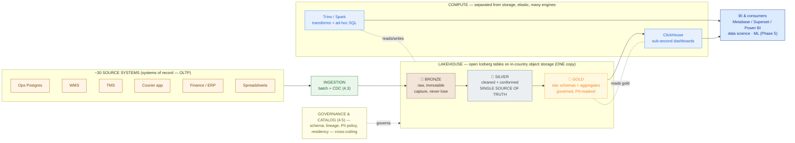

# Warehouse, Lake & Lakehouse

> Don't buy a warehouse *and* build a lake and pray they agree. Choose the analytics-platform pattern first, keep one copy of the truth, and defend the cost before you draw a single table.

**Type:** Design
**Track:** AI, Data & Infrastructure Solution Architect (Presales)
**Prerequisites:** 4.1 Data Fundamentals
**Time:** ~6h
**Lab:** DuckDB/ClickHouse
**Ship It:** Lakehouse HLD

## The Problem

Kirim Cepat runs on day-old numbers. It's an Indonesian last-mile logistics company — ~50 million parcels a month, ~10,000 couriers, ~200 hubs — and every one of those parcels leaves a trail across roughly **30 siloed source systems**: an operational Postgres behind the ops dashboard, a warehouse management system (WMS), a transport management system (TMS), the courier mobile app, finance/ERP, and a long tail of spreadsheets that individual regional managers guard like state secrets. When the COO asks *"what was our on-time delivery rate in Surabaya last week, and which hubs dragged it down?"*, the answer comes from a **nightly batch job** that stitches a few of those systems together into a report that is, by definition, already a day old — and it only covers the systems someone bothered to wire in. There is **no single source of truth**. Ask two teams for "yesterday's delivered count" and you get two numbers, because operations reads the TMS, finance reads the ERP, and the courier app has a third view none of them reconcile.

Kirim Cepat wants to replace that mess with one unified analytics platform — and they are **cost-conscious**: the CFO has already said the words *"we are not paying enterprise-warehouse prices."* This is where an SA who has only ever seen one pattern loses the deal three different ways. **Mistake one — the two-copy trap:** you propose a data lake for the data-science team *and* a proprietary warehouse for the BI dashboards, so now the same delivery event is copied twice, transformed by two pipelines, governed by two regimes, and billed by two vendors — and the two copies drift, so you've *recreated* the no-single-source-of-truth problem you were hired to kill. **Mistake two — the swamp:** you dump all 30 sources into cheap object storage, declare victory, and hand the customer a governance-free "data lake" that within six months no one can query, trust, or find anything in — a **data swamp**. **Mistake three — the CFO chokes:** you spec a beautiful proprietary MPP warehouse, the per-terabyte-scanned bill lands, analysts run one wide query, and the finance team pulls the plug on the whole program.

The job in this lesson is the one an SA actually gets paid for: **choose the analytics-platform pattern — warehouse vs lake vs lakehouse — and design the platform around that choice, then defend the cost.** These are not interchangeable buzzwords; the choice is a major capability-and-cost fork that shapes the storage bill, the lock-in, the governance model, and whether the data-science and BI teams share one copy of the truth or fight over two. For a cost-conscious logistics company drowning in silos, the pattern that wins is almost always the **lakehouse** — but only if you can say *why*, size it, and price it against the warehouse the CFO is afraid of. That is what we design here. This is the platform layer of **Capstone D (Enterprise Data Platform)**.

## The Concept

Three patterns have competed for "where analytics data lives" for thirty years. An architect has to hold all three in their head at once, because the customer will name one and mean another, and because the right answer is often a deliberate blend. Here they are, stripped to the mechanism that actually distinguishes them.

### Warehouse vs lake vs lakehouse — the one comparison that matters

```
   DATA WAREHOUSE            DATA LAKE                  LAKEHOUSE
   (Teradata, Snowflake,     (files on S3/GCS/          (Iceberg/Delta/Hudi
    BigQuery, Redshift)       object storage)            tables ON object storage)
   ───────────────────       ───────────────────        ───────────────────────
 · schema-on-WRITE          · schema-on-READ           · schema-on-read storage +
   (define structure          (dump anything, make       schema-on-write TABLES
    before you load)           sense of it later)         (open table format adds
 · proprietary storage      · open files (Parquet,        ACID, schema, time-travel
   format (vendor owns it)    JSON, CSV) — you own it      on top of the open files)
 · MPP engine bundled       · bring-your-own engine     · storage and compute fully
   with the storage           (Spark, Trino, Presto)      separated; many engines,
 · dimensional models,      · no ACID, no reliable         ONE copy of the data
   great BI performance       transactions, no schema    · cheap object storage +
 · $$$ + lock-in;             enforcement → SWAMP RISK     elastic OSS compute
   pay per credit/TB-scan   · cheapest storage,         · one copy serves BI *and*
 · one copy, but it's         hardest to trust            data science
   the vendor's copy        · not a platform on its own · warehouse reliability at
                                                           lake economics
   ▲ reliable, costly,        ▲ cheap, ungoverned,        ▲ the modern default for a
     locked-in                  a liability                 cost-conscious estate
```

- **Data warehouse — schema-on-write, MPP, dimensional.** You decide the structure *before* you load: you model the business as **facts and dimensions** (Kimball dimensional modeling — more below), enforce that schema on write, and load clean, conformed data into a **massively parallel processing (MPP)** engine that bundles storage and compute together. The payoff is fast, reliable, governed BI. The price is exactly that — price — plus **lock-in**: the data lives in the vendor's proprietary format, and you pay per compute-credit or per-terabyte-scanned. Teradata was the classic; Snowflake, BigQuery, and Redshift are the cloud generation.
- **Data lake — schema-on-read, cheap, dangerous.** Flip the model: dump raw files (Parquet, JSON, CSV) into cheap object storage *first*, and impose structure only when you read them. Storage is nearly free and you keep the open files, but a bare lake has **no transactions, no schema enforcement, and no guarantee two readers see a consistent snapshot**. Left ungoverned it rots into a **data swamp** — technically full of data, practically un-queryable and un-trustworthy. A lake is a storage tactic, **not an analytics platform** on its own.
- **Lakehouse — the lake, made trustworthy.** The lakehouse keeps the lake's cheap open storage and adds a thin, powerful layer on top: an **open table format** (Apache Iceberg, Delta Lake, or Apache Hudi) that brings **ACID transactions, schema enforcement/evolution, and time travel** to the very same Parquet files sitting in object storage. Now a table on cheap storage behaves like a warehouse table — consistent snapshots, safe concurrent writes, "show me this table as of last Tuesday" — but the data stays in an **open format you own**, and **any** engine (Trino, Spark, DuckDB, ClickHouse, even Snowflake) can read it. Storage and compute are fully separated, so you keep **one copy** of the data and point elastic, mostly open-source compute at it. This is the pattern a cost-conscious enterprise reaches for today, and it's what we'll design for Kirim Cepat.

### The medallion architecture — bronze → silver → gold

A lakehouse without an internal structure is just a swamp with ACID. The organizing pattern is **medallion architecture**: three progressively-refined zones, each a set of tables in the lakehouse, that turn raw sludge into trustworthy marts.

- **Bronze — raw, immutable, append-only.** Land every source *as-is*, losing nothing: all ~30 systems dumped verbatim into Iceberg tables. Bronze's only job is "**capture it, never lose it**" — it's your replayable history and your audit trail. Schema-tolerant, minimally transformed.
- **Silver — cleaned, conformed, deduplicated.** Type it, dedupe it, fix the keys, and **conform** the sources into one integrated model: one `parcel`, one `hub`, one `courier` that every downstream user agrees on. **Silver is the single source of truth** — the layer that finally answers "yesterday's delivered count" with *one* number.
- **Gold — curated, aggregated, business-ready.** Shape silver into the **dimensional marts** (star schemas) and aggregates that BI tools and dashboards actually consume: `fact_delivery` with its dimensions, pre-aggregated SLA-by-hub tables, governed and PII-masked for wide sharing.



Read it left to right: the **systems of record** (the 30 OLTP sources — remember from 0.1 and 4.1 that these *own the truth*; the lakehouse is the analytics **copy**, never a record) feed an ingestion layer into **bronze**; transforms refine bronze → silver → gold, all as open tables on one pile of cheap object storage; and separated, elastic compute engines read that single copy for whatever each consumer needs.

### Two ideas that make the whole thing cheap: columnar files and storage/compute separation

- **Columnar file format (Parquet).** Analytics queries read a few columns across millions of rows ("average delivery hours by hub"), never whole rows. **Parquet** stores data **column-by-column**, so the engine reads only the columns a query touches and skips the rest — and columnar data compresses 5–10× because a column is all the same type. This is why a lake of Parquet is both small on disk and fast to scan. (Row formats like CSV/JSON force you to read everything; that's the 4.1 OLTP-vs-OLAP split, made physical.)
- **Separation of storage and compute.** In an old warehouse, storage and the MPP engine are welded together — to store more you buy more engine, and vice versa. The lakehouse **splits them**: data sits in object storage (priced per GB, dirt cheap), and compute is a *separate*, elastic thing you spin up only when a query or transform runs. You scale each independently, you turn compute *off* between jobs, and — the decisive part — **many engines share the one copy**. That single fact is what kills the two-copy trap: BI and data science point different engines at the *same* Iceberg tables instead of maintaining two divergent stores.

### The gold-layer star schema (dimensional modeling in one picture)

Gold is where you model the business as a **star schema** (Kimball): a central **fact** table of measurable events surrounded by **dimension** tables that describe them. A fact row is "what happened and how much"; a dimension row is "who/what/where/when." It's the shape BI tools love and the layer analysts actually query.

```
                          ┌────────────────────┐
                          │      dim_date      │
                          │ date_key (PK)      │
                          │ day, week, month,  │
                          │ quarter, is_holiday│
                          └─────────┬──────────┘
   ┌────────────────┐               │              ┌────────────────────┐
   │    dim_hub     │        ┌──────▼───────────┐  │   dim_service_level│
   │ hub_key (PK)   │        │  fact_delivery   │  │ svc_key (PK)       │
   │ hub_name       │◄───────┤  (grain: 1 parcel│──►│ name (same-day,    │
   │ city, region   │ origin │   delivery)      │  │  next-day, regular)│
   │ lat, lon       │  dest  │──────────────────│  │ promised_hours     │
   └────────────────┘        │ FKs:             │  └────────────────────┘
   ┌────────────────┐        │  date_key        │  ┌────────────────────┐
   │  dim_courier   │◄───────┤  origin_hub_key  │  │   dim_merchant     │
   │ courier_key    │        │  dest_hub_key    │──►│ merchant_key (PK)  │
   │ courier_type   │        │  courier_key     │  │ merchant_name      │
   │ (staff/gig)    │        │  merchant_key    │  │ segment, tier      │
   │ home_hub       │        │  svc_key         │  └────────────────────┘
   └────────────────┘        │  status_key      │  ┌────────────────────┐
                             │ Measures:        │  │   dim_status       │
                             │  sla_met (0/1)   │◄─┤ status_key (PK)    │
                             │  delivery_hours  │  │ delivered/failed/  │
                             │  attempts        │  │  returned/lost     │
                             │  distance_km     │  └────────────────────┘
                             │  weight_kg       │
                             │  cod_amount (Rp) │      ★ = one fact,
                             └──────────────────┘        many dimensions
```

The COO's question — *"on-time rate in Surabaya last week, worst hubs?"* — is now one clean query: filter `fact_delivery` by `dim_date` (last week) and `dim_hub.city = 'Surabaya'`, average `sla_met`, group by `dim_hub`. One table, one number, no reconciliation. That is what "single source of truth" *buys* — and it lives in gold, on cheap open storage.

## Design It

Kirim Cepat's brief: ~50M parcels/month across ~200 hubs and ~10,000 couriers, ~30 siloed sources, day-old reports, no single source of truth, **cost-conscious** (open lakehouse over proprietary warehouse), and **PDP/residency** obligations on customer data. Design the platform in seven decisions. Every capacity and cost figure below is a **design proposal with stated assumptions and ranges** — an HLD proposes; the Phase 6 sizing and cost/BOM lessons finalize against real telemetry. No customer numbers are invented; only the given volumes anchor the estimates.

### Step 1 — Pattern: open lakehouse, not a warehouse and not two copies

The foundational decision, and it's driven by the constraints, not fashion. A **proprietary warehouse** conflicts head-on with "cost-conscious" and adds lock-in. A **bare lake** can't give finance a trustworthy on-time number — swamp risk. Running **both** is the two-copy trap the Problem warned about. So: **one open lakehouse** — **Apache Iceberg tables on in-country object storage**, medallion bronze/silver/gold, open engines on top. One copy of the data, warehouse-grade reliability from the table format, lake economics from object storage. This single choice pre-answers the CFO ("we're not buying a warehouse"), the data-science lead ("you read the same tables BI does"), and the auditor ("bronze is your immutable trail").

### Step 2 — Storage & residency: in-country object storage, PDP-governed

The lake floor is **object storage**, and residency decides *where*. Indonesia's **PDP Law** governs recipient PII (name, address, phone, COD amounts), so customer-identifying data lands in an **in-country region** — AWS `ap-southeast-3` (Jakarta), GCP Jakarta, Azure Indonesia, or a local provider (Biznet, Lintasarta, IDCloudHost). Store everything as **Parquet inside Iceberg tables**. Governance is *layered*, not bolted on: raw PII allowed in bronze/silver (in-country, tightly RBAC'd), and **tokenized/masked in gold** so the widely-shared marts carry no raw PII. (Catalog, lineage, and the masking policy engine are the 4.5 concern; here we reserve the seams.)

### Step 3 — Zones: the medallion, mapped to Kirim Cepat

| Zone | Content for Kirim Cepat | Format | Retention (assumption) |
|---|---|---|---|
| 🥉 **Bronze** | Raw dumps of all ~30 sources: parcel scans, TMS legs, WMS movements, courier-app events, ERP postings, ingested spreadsheets — verbatim | Iceberg / Parquet, append-only | 3+ yrs (audit/replay) |
| 🥈 **Silver** | Conformed model: one `parcel`, one `hub`, one `courier`, one `merchant`; deduped, typed, late/duplicate scans resolved | Iceberg / Parquet, ACID upserts | 2–3 yrs hot, older to cold |
| 🥇 **Gold** | `fact_delivery` star schema + pre-aggregated marts (SLA-by-hub-by-day, courier productivity, COD reconciliation); PII-masked | Iceberg / Parquet + ClickHouse copies | 1–2 yrs hot for dashboards |

### Step 4 — The gold star schema for delivery analytics

Model gold as the star schema from the Concept: **`fact_delivery`** at one-row-per-parcel-delivery grain, surrounded by `dim_date`, `dim_hub` (used twice — origin and destination), `dim_courier`, `dim_merchant`, `dim_service_level`, `dim_status`. Measures: `sla_met`, `delivery_hours`, `attempts`, `distance_km`, `weight_kg`, `cod_amount`. Add a finer-grain **`fact_scan_event`** (one row per scan) in silver/gold for operational drill-down. This is the model the Lab builds and queries, and the artifact the BI lesson (4.6) sits its dashboards on.

### Step 5 — Compute: separate the engines, right tool per job

Storage is settled; now point **separate, elastic compute** at the one copy — different engines for different jobs, all reading the same Iceberg tables:

| Engine | Job | Why this one |
|---|---|---|
| **Spark or Trino** | Medallion transforms (bronze→silver→gold), heavy backfills | Scales out for big batch; Trino also serves federated ad-hoc SQL. Spun up per job, off between runs |
| **Trino or DuckDB** | Analyst / data-science ad-hoc exploration | Trino for cluster-scale SQL over the lake; **DuckDB** for a single analyst querying Parquet on a laptop (the Lab) |
| **ClickHouse** | Sub-second operational dashboards (live hub/SLA screens) | Purpose-built columnar OLAP; materialize gold marts into it for the fast, high-concurrency dashboards ops watch all day |
| **dbt** | Transformation logic + tests, as version-controlled SQL | Makes silver/gold a reviewable, testable codebase (feeds 4.4 + 4.5) |

The pattern: **one open copy, many engines, compute you turn off.** Nobody re-copies data into a proprietary store to get performance — ClickHouse holds *derived* gold marts for speed, not a second source of truth.

### Step 6 — Sizing & cost (assumptions + ranges)

State the assumptions, show the arithmetic, give a range — never a single magic number.

```
ASSUMPTIONS (design proposal — firm up in Phase 6 with real telemetry)
─────────────────────────────────────────────────────────────────────
 Parcels/month ......... 50,000,000            (given)
 Scan events/parcel .... ~8         (assumption, range 6–10)
 → Scan events/month ... ~400,000,000
 Raw event size ........ ~250 bytes JSON        (assumption)
 Parquet+ZSTD compress . 6–10×                  (assumption, columnar)
 Courier GPS pings ..... ~78M/month (10k couriers × ping/2min × 10h × 26d)
                         → streamed + downsampled; cold tier, off the BI hot path

STORAGE (compressed, per month landed)
 Bronze scan events .... 400M × 250B ÷ 8× ≈ 12 GB    (range 10–17 GB)
 Source snapshots/CDC .. WMS/TMS/ERP/ref dims ....... 5–15 GB
 Silver (conformed) .... ≈ bronze, deduped .......... 10–20 GB
 Gold (marts+aggs) ..... small, curated ............. 3–8 GB
 New data/month ........ ≈ 40–80 GB  →  ~0.5–1 TB/year
 3-yr total w/ history . ~2–5 TB object storage

COST (order-of-magnitude, in-country)
 Object storage ........ 5 TB × $0.02/GB/mo ≈ $100/mo   (range $75–150/mo)
 Transform compute ..... Spark/Trino, few VMs × hrs/day  $500–1,500/mo
 Serving (ClickHouse) .. 3 nodes (16 vCPU/64 GB) ....... $900–1,800/mo
 ─────────────────────────────────────────────────────
 LAKEHOUSE TOTAL ....... ≈ $1.5k–3.7k / month

 Proprietary warehouse . equivalent Snowflake/BigQuery/Redshift workload
 (illustrative range) ... ≈ $8k–30k / month + data in vendor format (lock-in)
```

The headline for the CFO: **storage is ~$100/month; the whole platform lands in the low thousands, an order of magnitude under a proprietary warehouse at this scale — and there is no per-terabyte-scanned surprise and no lock-in**, because the data stays in open Iceberg on object storage you own. Flag clearly that the warehouse figure is an assumption-based comparison to be firmed in the Phase 6 cost/BOM lesson; the *shape* of the gap (cheap open storage + elastic OSS compute vs bundled proprietary MPP) is the durable point.

### Step 7 — Migration: strangle the nightly reports, don't big-bang

You cannot rip out 30 systems and a nightly batch on day one. Use a **strangler-fig migration** that runs beside the old reports until parity is proven:

```
   PHASE A  Land sources → bronze (batch first; CDC via 4.3 for the hot ones).
            Old nightly reports keep running. Nothing user-facing changes yet.
   PHASE B  Build silver conformed model + the gold fact_delivery star schema.
   PHASE C  Rebuild the top ~5 nightly reports on gold. Run BOTH in parallel;
            reconcile numbers until the lakehouse matches (or beats) the old report.
   PHASE D  Cut over report-by-report; decommission each nightly job as its
            replacement passes parity. Point BI (4.6) at gold/ClickHouse.
   PHASE E  New capability the old stack never had: near-real-time hub/SLA
            dashboards (streaming + CDC, handed to 4.3).
```

Parallel-run-until-parity is the risk control that gets a cost-conscious, trust-scarred customer to actually switch: you never ask them to *believe* the new platform — you *show* it matching their own reports, then retire the old one.

## Lab — one open file, two engines, in 10 minutes

You don't need 50 million parcels to prove the lakehouse claim. Generate a synthetic `fact_delivery` as a **single Parquet file** (the open storage layer), then query that *same file* from **two different engines** (DuckDB and ClickHouse) — proving the two ideas that make a lakehouse: **columnar storage is tiny and fast**, and **storage is separate from compute, so many engines share one copy**.

```bash
# --- Setup (pick one) -------------------------------------------------
# DuckDB: brew install duckdb   |   or download the CLI from duckdb.org
# ClickHouse (optional 2nd engine): curl https://clickhouse.com/ | sh

# --- 1. Generate a "silver/gold" fact as ONE open Parquet file --------
duckdb -c "
COPY (
  SELECT
    (random()*50000000)::BIGINT                       AS parcel_id,
    DATE '2026-06-01' + (random()*30)::INT            AS delivery_date,
    (1 + (random()*200)::INT)                         AS dest_hub_id,
    (1 + (random()*10000)::INT)                       AS courier_id,
    (1 + (random()*5)::INT)                           AS service_level_id,
    (random() < 0.92)::INT                            AS sla_met,
    round((random()*72)::DECIMAL(6,1),1)             AS delivery_hours,
    round((random()*300000)::DECIMAL(12,2),2)        AS cod_amount
  FROM range(1000000)                                 -- 1M parcel deliveries
) TO 'fact_delivery.parquet' (FORMAT PARQUET, COMPRESSION ZSTD);"

ls -lh fact_delivery.parquet    # ~7–12 MB for 1M rows — columnar + ZSTD is TINY

# --- 2. Engine A (DuckDB) reads the file directly — no import, no load -
duckdb -c "
SELECT dest_hub_id,
       count(*)                       AS parcels,
       round(100.0*avg(sla_met),1)    AS on_time_pct
FROM 'fact_delivery.parquet'
GROUP BY dest_hub_id
ORDER BY on_time_pct ASC              -- the worst hubs, the COO's question
LIMIT 10;"

# --- 3. Engine B (ClickHouse) reads the SAME file — one copy, many engines
clickhouse local -q "
SELECT round(100*avg(sla_met),1) AS on_time_pct_overall
FROM file('fact_delivery.parquet', Parquet);"
```

What you just proved, at architect altitude: **(1)** a million delivery rows compress to a handful of megabytes of columnar Parquet — that's why 50M/month sits in a few TB and storage costs ~$100/month; **(2)** the engine reads the file *in place* — no proprietary load step, no second copy; and **(3)** two completely different engines answered questions from the **one open file** — exactly the lakehouse promise that lets BI and data science share a single source of truth. Scale this file up to Iceberg tables on object storage and you have Kirim Cepat's gold layer. (Add DuckDB's `iceberg` extension to read real Iceberg tables when you want the ACID/time-travel layer.)

## Compare It

Two questions decide Kirim Cepat's platform: **which pattern**, and **which serving engine**. Name the products and the trade-offs a customer will actually raise.

| Option | Pattern | Cost model | Lock-in | Fit for Kirim Cepat (cost-conscious, PDP, 30 silos) |
|---|---|---|---|---|
| **Snowflake / BigQuery / Redshift** | Proprietary warehouse | Credits / per-TB-scanned / reserved nodes | **High** — data in vendor format | Excellent BI, mature governance — but the cost model and lock-in are exactly what the CFO rejected. Reach for it if BI-only, budget-rich, skills-thin |
| **Databricks** | Managed lakehouse (Delta + Unity Catalog + Photon) | DBU compute + subscription | Medium — Delta is open, platform is not | Turnkey lakehouse, strong if they'll pay for managed. More than a cost-conscious shop needs to start |
| **Open Iceberg on object storage + Trino/Spark** | Open lakehouse (DIY) | Object storage + OSS compute you run | **Lowest** — fully open format & engines | **✅ Recommended.** Cheapest, no lock-in, PDP-friendly (in-country object storage), one copy for BI + DS. You assemble catalog/governance (4.5) |
| **Raw data lake (files, no table format)** | Bare lake | Object storage only | Low | Cheapest on paper, but no ACID/schema → **swamp**. Not a platform; the trap to avoid |
| **ClickHouse** | Serving OLAP engine (not a lake/warehouse) | Compute nodes you run | Low (open source) | **Pair with the lakehouse**, don't replace it — materialize gold marts here for sub-second, high-concurrency ops dashboards |

The through-line — and the sentence you say to the CFO: **the pattern choice is a cost-and-lock-in decision before it is a technology decision.** A proprietary warehouse buys convenience and mature BI at the price of a bill that scales with every query and data trapped in a vendor's format. The open lakehouse inverts that: cheap object storage you own, elastic open-source compute you turn off between jobs, open Iceberg tables any engine can read, and **one copy** that serves both the BI dashboards *and* the future ML models (Phase 5). For Kirim Cepat — cost-conscious, residency-bound, silo-scarred — the open lakehouse with ClickHouse for serving is the defensible call. The "it depends" a customer will raise — *"but Snowflake would be running next week"* — is real: managed convenience is worth money, and if Kirim Cepat were BI-only and budget-rich you'd weigh Snowflake or Databricks seriously. They are neither, so you buy back the assembly cost with a small platform team and keep the open economics.

## Ship It

This lesson ships a reusable **Lakehouse HLD** — the deliverable you produce once the analytics-platform pattern is chosen (this lesson) and before capacity/cost is finalized (Phase 6). It walks a customer and their data team through the platform in the order the decisions must be made. Both files live in [`outputs/`](../outputs/):

- **[`template-lakehouse-hld.md`](../outputs/template-lakehouse-hld.md)** — a fill-in-the-blank HLD: pattern choice → storage/residency → medallion zones → gold star schema → storage/compute engines → sizing/cost with assumptions → migration, with a Mermaid + ASCII skeleton and a decision log.
- **[`example-kirim-cepat-lakehouse-hld.md`](../outputs/example-kirim-cepat-lakehouse-hld.md)** — the template fully worked for Kirim Cepat, so the skeleton isn't abstract. It's the artifact that forms the core of **Capstone D (Enterprise Data Platform)** and hands off to **4.3 (Streaming & CDC)**, **4.4 (Processing & Orchestration)**, **4.5 (Governance)**, and **4.6 (BI)**.

The point of shipping this: the HLD is where you *defend* the un-obvious calls — one copy not two, open Iceberg not a proprietary warehouse, ClickHouse for serving not as the source of truth — and where you put the cost range in front of the CFO before a competitor puts a warehouse quote there instead.

## Exercises

1. **(Easy)** In three sentences an SA could say to Kirim Cepat's CFO, explain why the platform uses an **open lakehouse** instead of a proprietary warehouse. Name the storage cost (with its assumption), the lock-in difference, and the "one copy" benefit. Then label each medallion zone (bronze/silver/gold) with the one word that captures its job.

2. **(Medium)** Kirim Cepat's data-science team wants raw courier GPS telemetry (~78M pings/month) for a route-optimization model, and the ops team wants a live SLA dashboard — on the *same* platform. Show *where* each lands in the medallion (which zone, hot or cold tier) and *which engine* serves each, without creating a second copy of the data. Then re-map the design for a **different customer** — a **mid-size Indonesian e-commerce marketplace** doing clickstream + order analytics — and note which single decision (the fact-table grain) changes and why.

3. **(Hard)** Kirim Cepat's new Head of Data, fresh from a bank that ran Snowflake, mandates: *"Just buy Snowflake — a lakehouse is a science project."* Write a half-page rebuttal for the steering committee. Use the sizing/cost block (with assumptions and ranges) to show the order-of-magnitude cost gap, name the lock-in and per-TB-scan risks, concede where a warehouse genuinely wins (managed convenience, mature BI, thin-skills teams), and present the open-lakehouse-plus-ClickHouse alternative with what it hands to **4.5 (governance)**. Save it beside your worked Kirim Cepat HLD — you'll reuse this reasoning in **Capstone D**.

## Key Terms

| Term | What people say | What it actually means |
|------|-----------------|------------------------|
| Data warehouse | "The reporting database" | A schema-on-write, MPP analytics store with dimensional models and bundled storage+compute (Snowflake, BigQuery, Redshift). Reliable BI, but proprietary format, lock-in, and a cost that scales with queries. |
| Data lake | "Where we dump the data" | Cheap object storage holding raw open files (Parquet/JSON), schema-on-read. Cheapest storage, but no ACID/schema on its own — a storage tactic, not a platform, and a swamp if ungoverned. |
| Lakehouse | "A lake and a warehouse" | A lake made trustworthy: an open table format adds ACID, schema, and time travel to Parquet on object storage, so one open copy gets warehouse reliability at lake cost. The modern cost-conscious default. |
| Open table format | "The file format" | Iceberg / Delta Lake / Hudi — a metadata layer *over* Parquet files that adds transactions, schema evolution, and snapshots. Not a file format (that's Parquet); the thing that makes a lakehouse a lakehouse. |
| Schema-on-write vs -on-read | "How you load data" | On-write: structure enforced before load (warehouse — clean but rigid). On-read: dump first, structure at query time (lake — flexible but risky). Medallion uses both — bronze on-read, gold on-write. |
| Medallion (bronze/silver/gold) | "Layers of the lake" | Three refinement zones: bronze = raw/immutable (capture), silver = cleaned/conformed (single source of truth), gold = curated marts/star schemas (business-ready, governed). |
| Parquet | "A file type" | A columnar, compressed file format that stores data column-by-column, so analytics scans read only needed columns and compress 5–10×. The physical reason a lake is small and fast. |
| MPP | "A big database" | Massively parallel processing — a warehouse engine splitting a query across many nodes. In classic warehouses it's welded to storage; the lakehouse's separation of storage/compute breaks that weld. |
| Star schema / fact / dimension | "The data model" | Kimball dimensional modeling: a central **fact** table of measured events (a delivery, its SLA and COD) ringed by **dimension** tables that describe them (hub, courier, date). The shape BI queries live on. |
| Storage/compute separation | "It scales" | Data in cheap object storage; compute as a separate, elastic thing you turn off between jobs — and many engines share the one copy. The lever that makes the lakehouse cheap and kills the two-copy trap. |
| Data swamp | "A messy lake" | An ungoverned lake no one can trust or query — no schema, no catalog, no lineage. The failure mode of "just dump it in object storage"; why a lake needs the lakehouse layer + governance (4.5). |

## Further Reading

- [Apache Iceberg — documentation](https://iceberg.apache.org/docs/latest/) — the open table format at the center of the recommended design; skim the "tables", "schema evolution", and "time travel" pages to defend the ACID-on-object-storage claim.
- [Delta Lake](https://delta.io/) and [Apache Hudi](https://hudi.apache.org/) — the other two open table formats; read one page of each so you can compare Iceberg/Delta/Hudi when a customer or Databricks asks.
- [Lakehouse: A New Generation of Open Platforms (Armbrust et al., CIDR 2021)](https://www.cidrdb.org/cidr2021/papers/cidr2021_paper17.pdf) — the paper that named the pattern and argues *why* one system can serve BI and data science; the intellectual backing for "one copy."
- [Databricks — Medallion architecture](https://www.databricks.com/glossary/medallion-architecture) — the canonical bronze/silver/gold description this lesson mirrors; useful even if you deploy the open, non-Databricks version.
- [Kimball Group — Dimensional Modeling Techniques](https://www.kimballgroup.com/data-warehouse-business-intelligence-resources/kimball-techniques/dimensional-modeling-techniques/) — the source for facts, dimensions, and star schemas; the gold layer *is* Kimball on a lake.
- [DuckDB documentation](https://duckdb.org/docs/) and [ClickHouse documentation](https://clickhouse.com/docs) — the two engines from the Lab; DuckDB for single-node exploration over Parquet/Iceberg, ClickHouse for the sub-second serving layer.
- [Trino documentation](https://trino.io/docs/current/) — the distributed SQL engine for federated queries and medallion transforms over the lake; the "many engines, one copy" workhorse.
- [Apache Parquet](https://parquet.apache.org/docs/) — the columnar file format under everything above; read the "file format" overview to understand why analytics scans are cheap.
