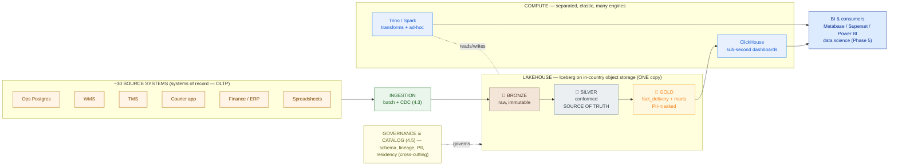

# Lakehouse Platform HLD — Kirim Cepat (worked example)

> This is `template-lakehouse-hld.md` filled in for the running Phase 4 customer. It shows what "good" looks like: the pattern choice defended against the CFO, the medallion zones mapped to 30 real silos, a delivery-analytics star schema, and a cost range an order of magnitude under a proprietary warehouse.

**Customer:** Kirim Cepat (fictional)  ·  **Industry:** Indonesian last-mile logistics (parcel delivery)
**Prepared by:** SA — Presales  ·  **Date:** 2026-07-05  ·  **Opportunity:** Unified analytics data platform  ·  **Version:** v0.2
**Key operating constraint:** **Cost-conscious** (rejects proprietary-warehouse pricing) + **PDP/data residency** on customer PII + **~30 siloed sources with no single source of truth** → **drives an open lakehouse (§1).**

**Company shape (from discovery):** ~50M parcels/month · ~10,000 couriers · ~200 hubs · ~30 source systems (operational Postgres, WMS, TMS, courier app, finance/ERP) + spreadsheets · today: day-old nightly-batch reports, no single source of truth.

Legend: **medallion** = bronze (raw) → silver (conformed, single source of truth) → gold (curated marts) · **open table format** = Apache Iceberg (ACID + schema + time travel over Parquet) · **storage/compute separation** = one open copy on object storage, many elastic engines · **SoR** = system of record (the 30 sources own truth; the lakehouse is the analytics copy).

---

## 1. Pattern choice

| Option | Cost model | Lock-in | Fit for Kirim Cepat |
|---|---|---|---|
| Proprietary warehouse (Snowflake/BigQuery/Redshift) | Credits / per-TB-scanned | **High** (vendor format) | **Poor** — exactly the pricing model and lock-in the CFO rejected |
| Managed lakehouse (Databricks) | DBU + subscription | Medium | Turnkey but more spend than a cost-conscious start needs |
| **Open lakehouse (Iceberg + Trino/Spark)** | Object storage + OSS compute | **Lowest** | **✅ Chosen** — cheapest, no lock-in, PDP-friendly in-country storage, one copy for BI + DS |
| Bare lake (files, no table format) | Object storage only | Low | **Rejected** — no ACID/schema → swamp; can't give finance a trustworthy number |

**Chosen pattern: Open lakehouse — Apache Iceberg tables on in-country object storage, medallion bronze/silver/gold, open engines on top.**
**Defense (one sentence):** *We chose an open lakehouse so Kirim Cepat gets warehouse-grade reliability at lake economics — one open copy of the data that serves BI and data science alike, in a format they own, at roughly a tenth of a proprietary warehouse's bill — avoiding both the two-copy trap (lake + warehouse that drift) and the swamp (a bare, ungoverned lake).*

## 2. Storage & residency

| Item | Decision | Rationale |
|---|---|---|
| Object storage | In-country object storage (AWS `ap-southeast-3` Jakarta / GCP Jakarta / Azure Indonesia / local: Biznet, Lintasarta, IDCloudHost) | Cheap per-GB; decouples storage from compute |
| Region / residency | **In-country (Indonesia)** | **PDP Law** governs recipient PII (name, address, phone, COD) — customer data stays onshore |
| Table format | **Apache Iceberg** (Delta as alternative) | ACID + schema evolution + time travel over Parquet; any engine (Trino, Spark, DuckDB, ClickHouse) reads it |
| PII handling | Raw PII allowed in bronze/silver (in-country, tightly RBAC'd); **tokenized/masked in gold** | Widely-shared gold marts carry no raw PII; the masking policy engine is the 4.5 concern |

## 3. Medallion zones

| Zone | Content for Kirim Cepat | Format | Retention (assumption) |
|---|---|---|---|
| 🥉 **Bronze** | Raw dumps of all ~30 sources: parcel scans, TMS legs, WMS movements, courier-app events, ERP postings, ingested spreadsheets — verbatim | Iceberg / Parquet, append-only | 3+ yrs (audit/replay) |
| 🥈 **Silver** | Conformed model: one `parcel`, one `hub`, one `courier`, one `merchant`; deduped, typed, late/duplicate scans resolved | Iceberg / Parquet, ACID upserts | 2–3 yrs hot, older to cold |
| 🥇 **Gold** | `fact_delivery` star schema + pre-aggregated marts (SLA-by-hub-by-day, courier productivity, COD reconciliation); PII-masked | Iceberg / Parquet + ClickHouse copies | 1–2 yrs hot for dashboards |

## 4. Gold star schema

- **Fact table:** `fact_delivery` — **grain:** one row per parcel delivery — **measures:** `sla_met` (0/1), `delivery_hours`, `attempts`, `distance_km`, `weight_kg`, `cod_amount` (Rp)
- **Dimensions:** `dim_date`, `dim_hub` (role-playing: **origin** + **destination**), `dim_courier` (staff/gig, home hub), `dim_merchant` (shipper segment/tier), `dim_service_level` (same-day/next-day/regular, promised_hours), `dim_status` (delivered/failed/returned/lost)
- **Finer-grain fact:** `fact_scan_event` — one row per scan — for operational hub/leg drill-down.

```
                          ┌────────────────────┐
                          │      dim_date      │
                          └─────────┬──────────┘
   ┌────────────────┐               │              ┌────────────────────┐
   │    dim_hub     │        ┌──────▼───────────┐  │  dim_service_level │
   │ (origin+dest)  │◄───────┤  fact_delivery   │──►│ same/next-day/reg  │
   └────────────────┘        │ grain: 1 parcel  │  └────────────────────┘
   ┌────────────────┐        │ sla_met,         │  ┌────────────────────┐
   │  dim_courier   │◄───────┤ delivery_hours,  │──►│   dim_merchant     │
   │ staff / gig    │        │ attempts, cod_amt│  └────────────────────┘
   └────────────────┘        │ distance_km      │  ┌────────────────────┐
                             └────────┬─────────┘◄─┤   dim_status       │
                                      ▼            └────────────────────┘
                     COO's Q: filter dim_date=last week + dim_hub.city='Surabaya',
                     avg(sla_met), group by dim_hub → ONE query, ONE number.
```

## 5. Compute engines (separate from storage)

| Engine | Job | Why this one |
|---|---|---|
| **Spark** (heavy) / **Trino** (SQL) | Medallion transforms bronze→silver→gold, backfills | Scales out for 400M+ events/month; Trino also serves federated ad-hoc SQL. Spun up per job, off between runs |
| **Trino** / **DuckDB** | Analyst + data-science ad-hoc exploration | Trino for cluster-scale SQL over Iceberg; DuckDB for a single analyst querying Parquet on a laptop |
| **ClickHouse** | Sub-second live hub/SLA dashboards ops watch all day | Purpose-built columnar OLAP; materialize gold marts here for high-concurrency, low-latency serving |
| **dbt** | silver/gold transformation logic + tests, as versioned SQL | Reviewable, testable transforms (feeds 4.4 orchestration + 4.5 governance) |

*One open copy, many engines, compute you turn off.* ClickHouse holds *derived* gold marts for speed — never a second source of truth; silver stays the truth.

## 6. Sizing & cost (assumptions + ranges)

```
ASSUMPTIONS (design proposal — firm up in Phase 6 with real telemetry)
 Parcels/month ......... 50,000,000            (given)
 Scan events/parcel .... ~8         (assumption, range 6–10)
 → Scan events/month ... ~400,000,000
 Raw event size ........ ~250 bytes JSON        (assumption)
 Parquet+ZSTD compress . 6–10×                  (assumption, columnar)
 Courier GPS pings ..... ~78M/mo (10k × ping/2min × 10h × 26d) → cold tier, off BI hot path

STORAGE (compressed, per month landed)
 Bronze scan events .... 400M × 250B ÷ 8× ≈ 12 GB    (range 10–17 GB)
 Source snapshots/CDC .. WMS/TMS/ERP/ref dims ....... 5–15 GB
 Silver (conformed) .... ≈ bronze, deduped .......... 10–20 GB
 Gold (marts + aggs) ... small, curated ............. 3–8 GB
 New data/month ........ ≈ 40–80 GB  →  ~0.5–1 TB/year
 3-yr total w/ history . ~2–5 TB object storage

COST (order-of-magnitude, in-country)
 Object storage ........ 5 TB × $0.02/GB/mo ≈ $100/mo   (range $75–150/mo)
 Transform compute ..... Spark/Trino, few VMs × hrs/day  $500–1,500/mo
 Serving (ClickHouse) .. 3 nodes (16 vCPU/64 GB) ....... $900–1,800/mo
 ─────────────────────────────────────────────────────
 LAKEHOUSE TOTAL ....... ≈ $1.5k–3.7k / month
 Proprietary warehouse . equivalent Snowflake/BigQuery/Redshift ≈ $8k–30k/mo + lock-in
                         (illustrative; firm in Phase 6 cost/BOM)
```

**Cost headline for the CFO:** *Storage is ~$100/month; the entire platform lands in the low thousands — an order of magnitude under a proprietary warehouse at this scale — with no per-terabyte-scanned surprise and no lock-in, because the data stays in open Iceberg on object storage Kirim Cepat owns.*

## 7. Migration (strangle the nightly reports)

```
 PHASE A  Land all ~30 sources → bronze (batch first; CDC for the hot ops DB via 4.3).
          The old nightly reports keep running — nothing user-facing changes yet.
 PHASE B  Build the silver conformed model + the gold fact_delivery star schema.
 PHASE C  Rebuild the top ~5 nightly reports on gold. Run BOTH in parallel; reconcile
          until the lakehouse matches (or beats) each old report's numbers.
 PHASE D  Cut over report-by-report; decommission each nightly job as its replacement
          passes parity. Point BI (4.6) at gold / ClickHouse.
 PHASE E  New capability the old stack never had: near-real-time hub/SLA dashboards
          (streaming + CDC, handed to 4.3).
```

Parallel-run-until-parity is the risk control that gets a cost-conscious, trust-scarred customer to switch: never ask them to *believe* the platform — *show* it matching their own reports, then retire the old one.

---

## 8. Architecture diagram



### ASCII fallback

```
  ~30 SOURCES (SoR, OLTP) ─ingest(batch/CDC 4.3)─▶ ┌──── LAKEHOUSE (one open Iceberg copy) ────┐
   Postgres WMS TMS app ERP xls                     │ 🥉 BRONZE ─▶ 🥈 SILVER ─▶ 🥇 GOLD           │
                                                    │ raw        conformed     fact_delivery     │
                                                    │ immutable  SOURCE OF     + marts, masked    │
                                                    │            TRUTH                            │
                                                    └───────┬──────────────────────┬─────────────┘
     in-country object storage ◀── storage ─────────────── ┘                       │ compute (separate)
     governance/catalog (4.5): schema · lineage · PII · residency ── cross-cutting │
                            ┌──────────────────────────────────────────────────────┴────┐
                            │ Trino/Spark  transforms+ad-hoc      ClickHouse  dashboards  │
                            └───────────────────────────┬─────────────────────────────────┘
                                                        ▼  ONE copy, many engines, compute you turn off
                                                  BI (Metabase/Superset/Power BI) + data science
```

---

## 9. Decision log

| # | Decision | Alternative rejected | Why | Owner |
|---|---|---|---|---|
| 1 | Open lakehouse (Iceberg on object storage) | Proprietary warehouse (Snowflake/BigQuery/Redshift) | Cost + lock-in; open format any engine reads; PDP-friendly in-country storage | SA |
| 2 | One copy (lakehouse serves BI + DS) | Lake + warehouse (two copies) | Two copies drift, double the cost, double the governance — recreates the no-single-truth problem | SA |
| 3 | In-country object storage | Cheaper offshore region | PDP Law on recipient PII — customer data stays onshore | SA |
| 4 | Medallion bronze/silver/gold | "Just dump it in the lake" | Structure prevents the swamp; silver becomes the single source of truth finance can trust | SA |
| 5 | ClickHouse for serving (derived marts) | ClickHouse as the source of truth | Speed layer only; silver/gold stays the truth — no second store to drift | SA |
| 6 | Strangler migration (parallel-run-until-parity) | Big-bang cutover of 30 systems | De-risks a trust-scarred customer; prove parity before retiring each nightly job | SA |

## 10. Open items & handoffs

- **Sizing/cost (Phase 6):** finalize storage TB and compute node counts from real event telemetry; firm up the Snowflake/BigQuery cost comparison for the CFO's BOM.
- **Streaming & CDC (4.3):** CDC off the operational Postgres (and courier app) into bronze for the near-real-time hub/SLA dashboards; decide which of the 30 sources need streaming vs nightly batch.
- **Processing & orchestration (4.4):** the engine (Spark/Trino) + scheduler (Airflow/Dagster) running the medallion transforms; dbt models for silver/gold.
- **Governance & quality (4.5):** catalog, column-level lineage, PII masking policy for gold, data-quality tests on silver, residency enforcement.
- **Analytics & BI (4.6):** the BI tool + the operational and executive dashboards sitting on gold / ClickHouse.

**So what (the pivot this HLD buys you):** instead of "buy a warehouse" or "dump it in a lake," Kirim Cepat gets one open lakehouse — a single source of truth on cheap in-country storage, one copy serving both BI and future ML, at roughly a tenth of a proprietary warehouse's bill. This is the platform core of **Capstone D (Enterprise Data Platform)**, and it hands clean seams to streaming (4.3), orchestration (4.4), governance (4.5), and BI (4.6).
