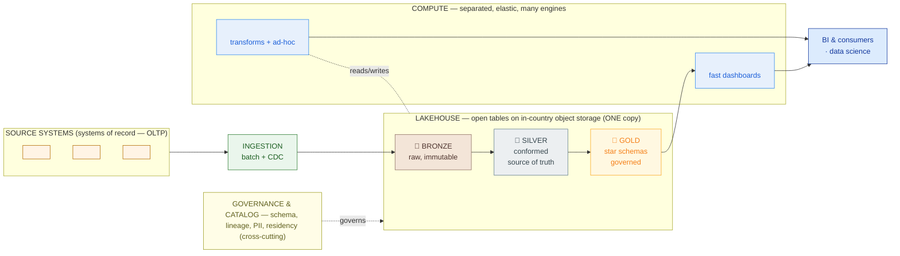

# Lakehouse Platform — High-Level Design (Template)

> Fill this in once the analytics-platform **pattern is chosen** (warehouse vs lake vs lakehouse) and before capacity/cost is finalized (Phase 6). Work the sections **in order** — each decision constrains the next. An executive should grasp the medallion diagram and the cost range; a data engineer should trust the star schema and decision log. This HLD is *design + defense*, not a runbook.

**Customer:** `<company>`  ·  **Prepared by:** `<SA name>`  ·  **Date:** `<YYYY-MM-DD>`
**Engagement / opportunity:** `<deal or project name>`  ·  **Version:** `<v0.1 draft>`
**Key operating constraint:** `<e.g. cost-conscious / data residency / N siloed sources / no single source of truth>` ← this drives the pattern choice in §1.

Legend for every diagram/table below: **medallion** = bronze (raw) → silver (conformed, single source of truth) → gold (curated marts) · **open table format** = Iceberg/Delta/Hudi (ACID + schema + time travel over Parquet) · **storage/compute separation** = one open copy on object storage, many elastic engines · **SoR** = system of record (the source owns truth; the lakehouse is the analytics copy).

---

## How to use this template

1. **Pattern** — warehouse vs bare lake vs lakehouse. Decide *first*; it sets cost, lock-in, and governance for everything after.
2. **Storage & residency** — object storage + table format, and *where* it lives (residency/PII law).
3. **Medallion zones** — bronze/silver/gold, mapped to this customer's sources.
4. **Gold star schema** — the fact table(s) + dimensions the BI layer will query.
5. **Compute engines** — separate, elastic engines per job (transform / ad-hoc / serving). One copy, many engines.
6. **Sizing & cost** — assumptions → arithmetic → range. Never a single magic number; always compare to the proprietary-warehouse alternative.
7. **Migration** — strangle the legacy reports with a parallel-run-until-parity plan, not a big bang.

---

## 1. Pattern choice

> Score against the **operating constraint** in the header, not the feature list. Cost-conscious + residency + many silos usually → **open lakehouse**. State what you rejected and why.

| Option | Cost model | Lock-in | Fit vs constraint |
|---|---|---|---|
| Proprietary warehouse (Snowflake/BigQuery/Redshift) | Credits / per-TB-scanned | High (vendor format) | `<...>` |
| Managed lakehouse (Databricks) | DBU + subscription | Medium | `<...>` |
| **Open lakehouse (Iceberg + Trino/Spark)** | Object storage + OSS compute | Lowest | `<...>` |
| Bare lake (files, no table format) | Object storage only | Low | `<swamp risk — reject unless staging only>` |

**Chosen pattern:** `<pattern>` — **Defense (one sentence):** `<why this pattern fits the cost/lock-in/residency constraint the customer must live inside; name the two-copy trap and swamp risk you're avoiding>`

## 2. Storage & residency

| Item | Decision | Rationale |
|---|---|---|
| Object storage | `<S3 / GCS / Azure Blob / local provider>` | `<cheap per-GB; decouples storage from compute>` |
| Region / residency | `<in-country region — name it>` | `<PII / data-protection law: keep customer data in-country>` |
| Table format | `<Iceberg / Delta / Hudi>` | `<ACID + schema + time travel; open, any engine reads it>` |
| PII handling | `<raw in bronze/silver (RBAC'd); masked/tokenized in gold>` | `<wide-shared marts carry no raw PII; policy engine = governance lesson>` |

## 3. Medallion zones

| Zone | Content (this customer's sources) | Format | Retention (assumption) |
|---|---|---|---|
| 🥉 **Bronze** | `<raw dumps of all N sources, verbatim>` | `<Iceberg/Parquet, append-only>` | `<3+ yrs, audit/replay>` |
| 🥈 **Silver** | `<conformed model: one entity per real-world thing; deduped, typed>` | `<Iceberg/Parquet, ACID upserts>` | `<2–3 yrs hot>` |
| 🥇 **Gold** | `<star schemas + aggregates; PII-masked, governed>` | `<Iceberg + serving-engine copies>` | `<1–2 yrs hot>` |

## 4. Gold star schema

> The dimensional model the BI layer queries. Name the fact grain, its measures, and each dimension.

- **Fact table:** `<fact_name>` — **grain:** `<one row per …>` — **measures:** `<measure list>`
- **Dimensions:** `<dim_date, dim_…, dim_…>` (note any role-playing dims used twice, e.g. origin/destination)
- **Finer-grain fact (optional):** `<fact_event>` for operational drill-down.

## 5. Compute engines (separate from storage)

| Engine | Job | Why this one |
|---|---|---|
| `<Spark / Trino>` | Medallion transforms + backfills | `<scales out; spun up per job, off between runs>` |
| `<Trino / DuckDB>` | Ad-hoc analyst / data-science SQL | `<cluster-scale vs single-node laptop>` |
| `<ClickHouse>` | Sub-second, high-concurrency dashboards | `<serving layer; materialize gold marts here — NOT a 2nd source of truth>` |
| `<dbt>` | Transformation logic + tests as versioned SQL | `<reviewable, testable; feeds orchestration + governance>` |

*Rule:* one open copy, many engines, compute you turn off. Serving engines hold *derived* marts, never a second source of truth.

## 6. Sizing & cost (assumptions + ranges)

> State assumptions, show arithmetic, give a range, and compare to the proprietary-warehouse alternative. HLD proposes; Phase 6 finalizes.

```
ASSUMPTIONS
 <volume driver> ....... <given number>
 <events per unit> ..... <assumption + range>
 <raw size / compression> <assumption>

STORAGE (compressed, per month → total)
 Bronze ................ <GB>   Silver ... <GB>   Gold ... <GB>
 New data/month ........ <GB>  →  <TB/year>  →  <N-yr total TB>

COST (order-of-magnitude, in-country)
 Object storage ........ <TB × $/GB/mo> ≈ $<...>/mo   (range $<..>–$<..>)
 Transform compute ..... $<..>–$<..>/mo
 Serving compute ....... $<..>–$<..>/mo
 ────────────────────────────────────
 LAKEHOUSE TOTAL ....... ≈ $<..>k–$<..>k / mo
 Proprietary warehouse . ≈ $<..>k–$<..>k / mo + lock-in  (illustrative; firm in Phase 6)
```

**Cost headline for the CFO:** `<one sentence: storage cost, total range, order-of-magnitude gap vs warehouse, and "no per-TB-scan surprise, no lock-in">`

## 7. Migration (strangle the legacy reports)

```
 PHASE A  Land sources → bronze (batch first; CDC for hot ones). Old reports keep running.
 PHASE B  Build silver conformed model + gold star schema.
 PHASE C  Rebuild top ~N reports on gold. Parallel-run; reconcile until parity.
 PHASE D  Cut over report-by-report; decommission each legacy job as it passes parity.
 PHASE E  New capability the old stack lacked (e.g. near-real-time dashboards — streaming/CDC).
```

Parallel-run-until-parity is the risk control: never ask the customer to *believe* the platform — *show* it matching their own numbers, then retire the old one.

---

## 8. Architecture diagram (Mermaid skeleton)



### ASCII fallback

```
  SOURCES (SoR, OLTP) ──ingest(batch/CDC)──▶ ┌──────── LAKEHOUSE (one open copy) ────────┐
   <src1> <src2> <srcN>                       │ 🥉 BRONZE ─▶ 🥈 SILVER ─▶ 🥇 GOLD          │
                                              │ raw        conformed     star schemas     │
                                              │ immutable  SOURCE OF     governed/masked   │
                                              │            TRUTH                           │
                                              └───────┬───────────────────────┬────────────┘
        object storage (in-country) ◀── storage ── ─ ┘                        │ compute (separate, elastic)
        governance/catalog: schema · lineage · PII · residency ── cross-cutting│
                            ┌─────────────────────────────────────────────────┴──────┐
                            │ <Trino/Spark> transforms+ad-hoc   <ClickHouse> dashboards│
                            └───────────────────────┬──────────────────────────────────┘
                                                    ▼   ONE copy, many engines, compute you turn off
                                              BI & data science
```

---

## 9. Decision log (defend the un-obvious calls)

| # | Decision | Alternative rejected | Why | Owner |
|---|---|---|---|---|
| 1 | `<open lakehouse>` | `<proprietary warehouse>` | `<cost + lock-in; open format any engine reads>` | `<SA>` |
| 2 | `<one copy (lakehouse)>` | `<lake + warehouse (two copies)>` | `<drift + double cost + double governance>` | `<SA>` |
| 3 | `<in-country object storage>` | `<offshore region>` | `<PII/residency law on customer data>` | `<SA>` |
| 4 | `<ClickHouse for serving>` | `<ClickHouse as source of truth>` | `<derived marts only; gold/silver stays the truth>` | `<SA>` |
| 5 | `<strangler migration>` | `<big-bang cutover>` | `<parallel-run-until-parity de-risks a trust-scarred customer>` | `<SA>` |

## 10. Open items & handoffs

- **Sizing/cost (Phase 6):** `<finalize storage TB, compute node counts, and the warehouse cost comparison from real telemetry>`
- **Streaming & CDC (4.3):** `<which sources need near-real-time; CDC off the operational DB into bronze>`
- **Processing & orchestration (4.4):** `<the engine + scheduler running the medallion transforms; dbt models>`
- **Governance & quality (4.5):** `<catalog, lineage, PII masking policy, data-quality tests, residency enforcement>`
- **Analytics & BI (4.6):** `<the BI tool + dashboards sitting on gold/ClickHouse>`

---

*Worked example: see `example-kirim-cepat-lakehouse-hld.md` in this folder.*
