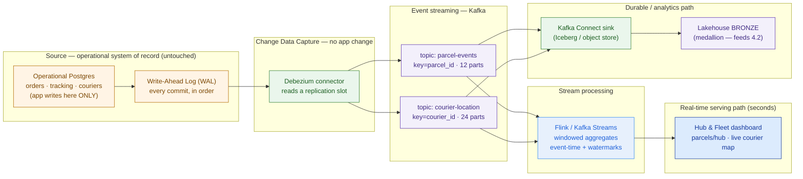

# Streaming & CDC

> Stop asking the database for yesterday's news. The truth is already streaming out of its transaction log — design the pipe that reads it.

**Type:** Design
**Track:** AI, Data & Infrastructure Solution Architect (Presales)
**Prerequisites:** 4.2 Warehouse, Lake & Lakehouse
**Time:** ~5h
**Lab:** local Kafka
**Ship It:** Streaming architecture

## The Problem

**Kirim Cepat** is an Indonesian last-mile logistics company: ~50 million parcels/month, ~10,000 couriers, ~200 hubs. Their operational backbone is a single PostgreSQL database — every order, every scan, every status change, every courier assignment is written there by the tracking app. It works. The problem is that *analytics* is trapped a full day behind. Every night at 02:00 a batch job dumps Postgres into the warehouse, and every morning the operations team looks at a picture of *yesterday*. When a hub floods with parcels at 14:00, they find out at 09:00 tomorrow. When a courier goes dark for three hours, nobody notices until the SLA is already blown. The VP of Operations says the sentence that starts every streaming project: *"I want to see the network live — parcels and fleet, right now, not tomorrow."*

You could nod and reach for the obvious hack, and this is exactly where a rookie architect burns the deal. **Hack #1: dual-write.** "Just have the app write to Postgres *and* publish to a message bus at the same time." Now you have two systems that must agree, with no shared transaction — a crash between the two writes silently drifts them apart forever, and you've coupled the customer's core operational app to your analytics plumbing. **Hack #2: poll the database.** "Run `SELECT * FROM parcels WHERE updated_at > :last` every few seconds." Now you're adding query load to the one database that must never slow down, your lag is capped at the poll interval, and you *silently miss* deletes and any intermediate state that changed and changed back between two polls. **Hack #3: redefine the word.** "We'll run the batch every five minutes and call it real-time." A five-minute batch is a five-minute batch; selling it as streaming is how you lose trust in the second demo.

The honest job is harder and much better: **unlock the operational database for real-time analytics without touching its code, without dual-writing, and without polling it to death.** That means reading the database's own transaction log — the ordered record it already writes for its own durability — and turning every committed change into an event stream. From there you fan the stream two ways: a low-latency path that powers the live hub-and-fleet dashboard the VP asked for, and a durable path that lands every event in the lakehouse **bronze** layer you designed in 4.2, feeding the whole data platform. This lesson is how you design that pipe, size it from Kirim Cepat's real numbers, and — the part that separates architects from tinkerers — **defend a delivery guarantee for each use case** instead of hand-waving "it's reliable."

## The Concept

### Batch vs stream — and when "real-time" is actually the requirement

Batch processing moves **data at rest** in bounded chunks on a schedule. Stream processing moves **data in motion**, one event at a time, as it happens. Neither is "better"; they answer different questions. The architect's first move is *not* to pick streaming because it sounds modern — it's to ask **which decisions the customer makes on this data, and how stale an answer can be before it's worthless.** A finance month-end close is perfectly happy with yesterday's batch. A live courier map is worthless at yesterday's resolution. Most estates need both, and a lot of asks labelled "real-time" are actually "fresh enough" — minutes, not milliseconds. Knowing the difference is how you avoid over-engineering a cost-conscious customer into a bill they didn't need.

```
   BATCH  (nightly ETL — "yesterday's answer, delivered today")
   ─────────────────────────────────────────────────────────────
   Postgres ──dump──▶ [ wait all day ] ──02:00 job──▶ Warehouse ──▶ BI
   data at rest → moved in bounded chunks → answer is HOURS-to-a-DAY old
   good for: finance close, ML training sets, large historical scans

   STREAM  (event-by-event — "the answer as it happens")
   ─────────────────────────────────────────────────────────────
   Postgres ─WAL▶ CDC ─▶ Kafka ─▶ processing ─▶ dashboard   (seconds)
                                        └────────▶ bronze (also durable)
   data in motion → processed on arrival → answer is SECONDS old
   good for: live tracking, fleet maps, exception/fraud alerts, SLA timers

   MICRO-BATCH  (the honest middle — NOT "real-time")
   ─────────────────────────────────────────────────────────────
   ...every 1–5 min a small batch runs → answer is MINUTES old.
   Call it "near-real-time". Never sell a 5-minute batch as streaming.
```

### Event streaming with Kafka — the log, not a queue

An event stream is an **append-only, ordered, replayable log** of things that happened. Apache Kafka is the de-facto engine for it, and the single most important mental correction for a new architect is this: **Kafka is a log, not a queue.** A traditional queue deletes a message once a consumer reads it. Kafka keeps every event for a *retention period* (say 7 days) regardless of who read it — so a new consumer, or a recovering one, can **replay** from any point. That single property is why streaming can be reliable *and* feed both a dashboard and a warehouse from the same events.

Four terms carry the whole model:

- **Topic** — a named stream (`parcel-events`, `courier-location`). Producers append; consumers read.
- **Partition** — a topic is split into partitions for parallelism. **Order is guaranteed only *within* a partition, never across the topic.** The event's **key** decides its partition, so choosing `parcel_id` as the key keeps every event for one parcel strictly ordered.
- **Offset** — each event's position in its partition. Consumers track their own offset; nobody's read position affects anyone else's.
- **Consumer group** — a set of consumers that share the work of a topic. Partitions are divided among the group's members, so `partitions ÷ consumers` is your parallelism ceiling. Crucially, **two different groups each read every event independently** — that's how the dashboard and the bronze-sink both consume the same log without stealing from each other.

```
   TOPIC  "parcel-events"   (an append-only, replayable LOG — not a queue)
   ┌──────────────────────────────────────────────────────────────────┐
   │ partition 0 │ e0 e3 e7 e9 …  ──▶  ordered WITHIN a partition       │
   │ partition 1 │ e1 e4 e5 …     ──▶  key = parcel_id decides which    │
   │ partition 2 │ e2 e6 e8 …     ──▶  partition → per-parcel ordering  │
   └──────────────────────────────────────────────────────────────────┘
        every event has an OFFSET; consumers track their own offset
        retention = time/size, NOT "deleted on read" → replay anytime

   CONSUMER GROUPS  (independent readers of the SAME log)
   ┌─ group: realtime-dashboard ─┐   ┌─ group: bronze-sink ───────────┐
   │  consumer A ← part 0,1       │   │  consumer X ← part 0,1,2 …      │
   │  consumer B ← part 2         │   │  (its own offsets, own pace)    │
   └──────────────────────────────┘   └─────────────────────────────────┘
   partitions ÷ consumers = parallelism ceiling (more consumers than
   partitions ⇒ some sit idle). Both groups read every event, once each.
```

### Change Data Capture — read the log the database already writes

Here is the clean way to unlock an operational database without touching it. Every transactional database already writes a **transaction log** for its own crash recovery — in Postgres it's the **Write-Ahead Log (WAL)**: an ordered record of every committed change, written *before* the change hits the table. **Log-based CDC** taps that log. A connector (the standard is **Debezium**) subscribes to Postgres's logical replication stream, reads each committed insert/update/delete in commit order, and emits it as an event to Kafka. The application never changes. There is no second write to keep in sync. There is no polling load on the tables. And because it reads the *log of commits*, it captures **deletes and every intermediate state** — the two things polling silently drops.

Contrast the three ways to get changes out of a database:

- **Log-based CDC (Debezium)** — reads the WAL. No app change, low source load, captures everything in order. Needs the DB configured for logical replication and a *replication slot* managed carefully.
- **Query-based CDC** — polls `WHERE updated_at > :last`. Simple, but adds load, needs an `updated_at` column, lag equals the poll interval, and misses deletes and in-between states.
- **Dual-write** — the app writes the DB and the stream itself. **This is an anti-pattern.** There is no shared transaction, so any partial failure drifts the two apart, and it couples the operational app to the analytics bus forever.

The one caveat the architect must name out loud: a replication slot holds WAL on the source until the consumer confirms it read it, so **if Debezium falls too far behind, the source database's disk fills** — a stability risk on the customer's crown-jewel database. Monitoring slot lag and sizing WAL headroom is a first-class design item, not an afterthought.

### Stream processing — windows, watermarks, and delivery guarantees

Raw events are rarely the answer; the dashboard needs *aggregates* — "parcels processed per hub in the last 5 minutes", "couriers currently idle". Turning an endless stream into aggregates means **windowing**: slicing the infinite stream into finite buckets. **Tumbling** windows are fixed, non-overlapping (every 5 minutes); **sliding** windows overlap (last 5 minutes, updated every minute); **session** windows group bursts of activity separated by gaps of inactivity.

The subtlety that trips up every streaming project is **time**. There are two clocks: **event time** (when the courier's phone recorded the GPS ping) and **processing time** (when your engine saw it). On a mobile network they differ by seconds to minutes, and events arrive **out of order and late**. A **watermark** is the engine's declared belief that "I have probably now seen all events up to time T" — it's the knob that trades **latency against completeness**: wait longer and your 5-minute count is more accurate but staler; close the window sooner and it's fresher but may miss stragglers. Choosing that trade-off per use case is architecture, not configuration.

Finally, the guarantee that must be defended for every stream: **delivery semantics.**

- **At-most-once** — fire and forget; an event may be lost, never duplicated. Fine for a GPS ping (the next one is 10 seconds away).
- **At-least-once** — never lost, but may be delivered twice on retry. The sane default — *if* the consumer can tolerate or absorb duplicates.
- **Exactly-once** — never lost, never double-counted. The strongest and most expensive. In practice you rarely need true end-to-end exactly-once; you get the same outcome more cheaply with **at-least-once transport plus an idempotent sink** — an upsert keyed by a unique event id, so a replayed event overwrites rather than double-counts. That distinction — *effectively-once via idempotency* — is the pragmatic architect's move.

Engines that do this work: **Apache Flink** (true event-time streaming, watermarks, exactly-once, stateful joins), **Kafka Streams** (a library inside your JVM app, no separate cluster, great for Kafka-to-Kafka transforms), and **Spark Structured Streaming** (micro-batch, unifies batch + stream, seconds-not-milliseconds latency). You compare them in **Compare It**.

### The two paths out of the stream

The reason this architecture is worth the effort is that one CDC stream serves **both** of the customer's needs at once. The real-time path drives the live dashboard; the durable path lands every event in the lakehouse **bronze** layer from 4.2, from which your batch refinement (silver/gold) and BI run. Same events, two consumer groups, no dual-write.



## Design It

Let's design Kirim Cepat's streaming layer end to end. The deliverable is a **Streaming Architecture** the customer can fund: sources → CDC → topics → processing → sinks, with a defended guarantee per use case and sizing that comes from *their* numbers, not vibes.

### Step 1 — Decide what actually needs to be real-time

Not everything does. Sort the ask by *how stale an answer can be before the decision it feeds goes bad*:

| Data / use case | Freshness needed | Verdict |
|---|---|---|
| Live courier location on the fleet map | seconds | **Stream** |
| Parcels-per-hub throughput (congestion alert) | seconds–1 min | **Stream** |
| Delivery / exception status for SLA timers | seconds | **Stream** |
| Nightly reconciliation, finance, ML training sets | next-day | **Batch** (keep it) |
| ~30 other siloed sources (billing, WMS, HR…) | hours–next-day | Batch first; stream only if a decision demands it |

The discipline here is *saying no*. Kirim Cepat has ~30 siloed sources; streaming all of them would be a runaway bill for a cost-conscious customer. Two streams — **parcel state** and **courier location** — cover the VP's live-visibility ask. The rest stay batch until a real decision needs them fresher.

### Step 2 — Choose CDC (and rule out the hacks in writing)

Source of truth is the operational Postgres. We take **log-based CDC via Debezium** and put the rejected options in the document so nobody re-proposes them next quarter:

- **Dual-write?** No — no shared transaction, silent drift, couples the core app to our bus.
- **Query-based polling?** No — adds load to the crown-jewel DB, misses deletes/intermediate states, lag = poll interval.
- **Log-based CDC?** Yes — reads the WAL, zero app change, captures deletes + every state transition in commit order.

Prerequisites to write into the design (so the DBA isn't surprised): Postgres `wal_level = logical`, a dedicated replication user with `REPLICATION`, a **publication** on the tables we need, and a **replication slot** with monitored lag and WAL-disk headroom on the source. Flag the slot-lag/disk risk as a named operational item.

### Step 3 — Design the topics (ordering, partitions, retention)

Two topics, keyed for the ordering each use case needs:

| Topic | Key | Why the key | Partitions | Retention | acks / replication |
|---|---|---|---|---|---|
| `parcel-events` | `parcel_id` | all events for one parcel stay strictly ordered (created→…→delivered) | 12 | 7 days | `acks=all`, RF=3, min ISR=2 — no loss |
| `courier-location` | `courier_id` | pings per courier stay ordered for the map trail | 24 | 24 hours | `acks=1`, RF=3 — loss-tolerant, cheaper |

Two design points to defend out loud. **(1) Partition count is driven by parallelism and ordering, not throughput** — at this scale (Step 4) throughput is trivial; we pick 12/24 to give the ~200-hub and map consumers room to parallelize, not because the bytes demand it. **(2) Kafka is transport, not the system of record.** Retention is short (days) because the *durable* copy lives in bronze on object storage. Short retention keeps broker disk — and cost — small, which matters for a cost-conscious customer.

### Step 4 — Size it from Kirim Cepat's real numbers

State assumptions, show the formula, give a range. Never a single magic number.

**`parcel-events` throughput**
- Assumption: each parcel emits ~8 scan/state events over its life (range 5–12: created → picked up → arrived hub → departed hub → line-haul → out for delivery → delivered; exceptions and re-attempts add more).
- Volume: `50,000,000 parcels × 8 = 400,000,000 events/month`.
- Average: `400,000,000 ÷ (30 × 86,400 s) ≈ 154 events/s`.
- Peak: last-mile concentrates in daytime + sort waves → apply 5–6× → **≈ 770–920 events/s peak**.
- This is the **same parcel tracking / scan-event firehose** sized in 4.1, 4.2, and 4.4 (~8 events/parcel → ~400M/month → ~4.8B/year) — one entity, one number across the phase.

**`courier-location` throughput**
- Assumption: ~8,000 of 10,000 couriers active at peak, GPS ping every 10 s.
- Peak: `8,000 ÷ 10 s ≈ 800 pings/s` (≈530/s at a 15 s cadence; ≈1,600/s at 5 s). **The ping cadence is a cost dial** — freshness vs volume.

**Sanity check → this is real-time, not "big data".** Combined peak ≈ **~1,700 msg/s** at sub-KB messages ≈ **~1–2 MB/s**. A modest **3-broker** Kafka (or Redpanda) cluster carries this with enormous headroom; a single broker handles it in the dev lab. The architect's insight for a cost-conscious customer: **size for ordering, durability, and consumer parallelism — not for bytes.** Do not quote a 12-node cluster for a 2 MB/s problem.

### Step 5 — Defend a delivery guarantee per use case

This table is the heart of the deliverable — it's what "reliable" actually means, decided per stream:

| Use case | Lose an event? | Duplicate an event? | Guarantee | How you achieve it |
|---|---|---|---|---|
| Courier GPS ping | Tolerable (next in 10 s) | Tolerable | **at-least-once**, `acks=1` | keep it cheap and fast; no dedup |
| Parcel state (delivered, exception, COD settlement) | **Not tolerable** | **Not tolerable** (double COD = money error) | **effectively-once into the sink** | at-least-once transport + **idempotent upsert keyed by `event_id`/LSN** |
| Real-time hub throughput count | Tolerable (small drift) | Prefer not | **at-least-once + idempotent windowed agg** | dedup by `event_id` inside the window |

The move to remember: we get exactly-once *outcomes* on the money-critical stream **without** paying for true end-to-end exactly-once — at-least-once transport plus an idempotent sink is cheaper and just as correct.

### Step 6 — Wire the two sinks and honor PDP/residency

- **Real-time path:** a Flink (or Kafka Streams) job consumes both topics, computes windowed hub throughput and fleet state with event-time watermarks (accept ~15–30 s late pings), and pushes aggregates to the live dashboard.
- **Durable path:** a Kafka Connect sink writes raw events to the lakehouse **bronze** layer (Iceberg tables on object storage) — the source for silver/gold refinement and BI in 4.2 and the processing/orchestration in 4.4.
- **PDP & residency:** Indonesia's PDP law (UU PDP 27/2022) governs personal data. Recipient names, phone numbers, and addresses ride in `parcel-events`. Design in **field-level masking/tokenization** at the CDC or processing stage, keep Kafka and processing in an **in-country region** (or on-prem), and note data-residency as an explicit constraint — not a footnote.

### Step 7 — Name the backfill, replay, and failure modes before the customer does

A streaming design that only handles the happy path isn't finished. Put these four in the document so they're decisions, not surprises:

- **Initial snapshot (backfill).** Debezium first takes a consistent **snapshot** of existing rows, *then* switches to streaming the WAL. For 50M-parcel history that snapshot is heavy — schedule it off-peak and size the source-DB load, or snapshot only the recent window that the live dashboard needs and let batch backfill the deep history into bronze.
- **Replay.** Because Kafka is a log, recovering a bad downstream is just *rewind the consumer's offset and reprocess* — provided the sink is idempotent (Step 5). This is why we chose at-least-once + idempotent upsert: replay becomes safe and boring.
- **Consumer/broker failure.** A dashboard consumer that dies restarts from its last committed offset and catches up from the retained log; RF=3 means a lost broker doesn't lose events. The one failure that *does* bite is the **replication slot filling the source disk** if Debezium stalls — so slot-lag monitoring and WAL headroom are named operational owners, not "someone will watch it".
- **Schema change.** When the app adds a column to `parcels`, the CDC stream's schema changes. A **schema registry** with compatibility rules keeps consumers from breaking on the next deploy — call it out as a required component, not an optional nicety.

## Compare It

**Streaming platform — Kafka vs Kinesis vs Pub/Sub vs Redpanda.** All are logs; the choice is about ops model, ecosystem, and where the data may legally live.

| Option | What it is | Reach for it when… | Watch out |
|---|---|---|---|
| **Apache Kafka** (self-managed, MSK, or Confluent) | The de-facto log; richest ecosystem — Kafka Connect, **Debezium**, Flink | you want portability, in-country/on-prem control, and the deepest CDC ecosystem | you (or a managed provider) run brokers; self-hosting is real ops |
| **AWS Kinesis Data Streams** | Managed, AWS-native log | you're all-in on AWS and want zero broker ops | shard-based scaling, weaker ecosystem, less portable off AWS |
| **GCP Pub/Sub** | Serverless, auto-scaling messaging | GCP-native, spiky load, you don't want partition math | per-key ordering is weaker (needs ordering keys); at-least-once |
| **Redpanda** | Kafka-API-compatible, C++, no JVM/ZooKeeper | you want the Kafka API with a smaller footprint, lower latency, fewer nodes — **cost-conscious** | smaller community/ecosystem than Kafka; newer |

For **Kirim Cepat** — cost-conscious, PDP/residency-bound, and reliant on the Debezium ecosystem — the finalists are **Kafka managed in an Indonesian region** or **Redpanda** (Kafka-compatible, lower footprint). Kinesis and Pub/Sub fit worse here: residency plus the Debezium-to-Kafka path are the deciding constraints.

**Getting data out of the DB — log-based CDC vs query-based vs dual-write.**

| Approach | How it works | Pros | Cons |
|---|---|---|---|
| **Log-based CDC (Debezium)** | reads the WAL / logical replication | no app change; captures deletes + all intermediate states; ordered; low source load | needs logical replication + slot management (WAL-disk risk); initial snapshot |
| **Query-based CDC** | polls `WHERE updated_at > :last` | trivial to start; no special DB config | adds query load; misses deletes + in-between states; lag = poll interval; needs `updated_at` |
| **Dual-write** *(anti-pattern)* | app writes DB **and** stream | looks simple in a diagram | no shared transaction → silent drift; partial-failure bugs; couples app to bus — **don't** |

**Processing engine — Flink vs Kafka Streams vs Spark Structured Streaming.**

| Engine | Model | Reach for it when… | Watch out |
|---|---|---|---|
| **Apache Flink** | true event-time streaming; watermarks; exactly-once; stateful joins | complex windowing, sub-second latency, stateful joins, strong guarantees | separate cluster; steeper operational learning curve |
| **Kafka Streams** | a library inside your JVM app; no separate cluster | Kafka-to-Kafka transforms, a small team, simpler topologies | JVM-only; scales by running more app instances |
| **Spark Structured Streaming** | micro-batch (mostly) | you're already on Spark/lakehouse and seconds-latency is fine; unify batch + stream | micro-batch latency floor — mind the "real-time" caveat |

For Kirim Cepat the **live dashboard** wants seconds and windowed aggregates → **Flink** (or **Kafka Streams** if the team is small and the transforms stay simple). **Spark Structured Streaming** is the natural fit for the *bronze→silver* refinement in 4.4, where seconds-to-minutes latency is fine and you want batch+stream unified.

## Ship It

This lesson ships a reusable **Streaming Architecture** — the deliverable that turns "I want it live" into a fundable design: sources → CDC → topics → processing → sinks (real-time + lakehouse), with a defended guarantee per use case and sizing from the customer's own numbers. Both files live in [`outputs/`](../outputs/):

- **[`template-streaming-architecture.md`](../outputs/template-streaming-architecture.md)** — a fill-in-the-blank template: a Mermaid pipeline skeleton plus tables for the freshness triage, CDC decision (with the hacks ruled out), topic design, sizing (assumptions + formula + range), the delivery-guarantee matrix, sinks, and PDP/residency notes. A colleague can run a streaming design session straight from it.
- **[`example-kirim-cepat-streaming.md`](../outputs/example-kirim-cepat-streaming.md)** — the template fully worked for Kirim Cepat, so the skeleton isn't abstract. It's the artifact you'd attach to the data-platform proposal, and it feeds **Capstone D**.

You can validate the core claim yourself in the [`lab/`](../lab/README.md): spin up a local Kafka, create a topic, produce and consume events, and *feel* the log/consumer-group model before you defend it in a room. An architect runs this loop once; the value is the design decisions above, not the CLI.

## Exercises

1. **(Easy)** For Kirim Cepat, write one sentence each explaining why **dual-write** and **query-based polling** are the wrong way to unlock the operational Postgres, and one sentence on what **log-based CDC** gives you that polling silently drops. Then state the delivery guarantee you'd defend for a **courier GPS ping** versus a **COD "delivered" event**, and *why* they differ.
2. **(Medium)** Re-size the pipeline for a *different* customer: a **ride-hailing** app with ~2 million trips/day and ~50,000 active drivers pinging location every 4 seconds. Compute average and peak throughput for a `driver-location` topic (show the formula), propose a partition count and retention, and decide the delivery guarantee for a "trip completed → charge rider" event. State every assumption.
3. **(Hard)** Extend Kirim Cepat's streaming design into the lakehouse from 4.2: describe how `parcel-events` lands in **bronze**, what a **silver** refinement would do to it (dedup, schema, PII masking), and how a **gold** table would serve the live hub-congestion dashboard. Name the delivery-guarantee boundary between the stream and the lakehouse, and save it alongside your worked example — you'll fold it into **Capstone D (Enterprise Data Platform)**.

## Key Terms

| Term | What people say | What it actually means |
|------|-----------------|------------------------|
| Streaming | "Real-time data" | Processing an unbounded log of events one at a time as they arrive, so answers are seconds old — not a faster batch. |
| CDC | "Syncing the database" | Change Data Capture — turning every committed row change into an event. The clean, non-invasive way to unlock an operational DB. |
| Log-based CDC | "Reading the DB" | Reading the database's own transaction log (Postgres WAL) via a connector like Debezium — no app change, captures deletes + all states. |
| WAL | "Database logs" | Write-Ahead Log — the ordered record of every commit a DB writes for its own durability. CDC taps it. A stuck reader fills its disk. |
| Topic / partition | "A Kafka channel" | A topic is a named stream; partitions split it for parallelism. **Order holds only within a partition** — the key decides which one. |
| Consumer group | "The readers" | Consumers sharing a topic's partitions. Different groups each read *every* event independently — one log, many uses. |
| Watermark | "A timestamp" | The engine's declared belief that all events up to time T have arrived — the latency-vs-completeness knob for windows. |
| Exactly-once | "Never wrong" | No loss, no duplication end-to-end. Expensive and rarely needed — usually replaced by at-least-once + an idempotent sink. |
| Dual-write | "Just write to both" | App writes the DB *and* the stream with no shared transaction — an anti-pattern that silently drifts the two apart. |
| Kafka Connect / sink | "The exporter" | The framework that moves data in/out of Kafka without custom code — Debezium is a *source* connector; a *sink* connector lands events in bronze. |
| Backfill / snapshot | "Loading history" | CDC's initial consistent copy of existing rows before it starts streaming the WAL — heavy at scale, so schedule it and size the source load. |

## Further Reading

- [The Log: What every software engineer should know about real-time data's unifying abstraction](https://engineering.linkedin.com/distributed-systems/log-what-every-software-engineer-should-know-about-real-time-datas-unifying) — Jay Kreps's essay that frames the log as *the* abstraction behind streaming; read it once and the whole model clicks.
- [Debezium documentation — PostgreSQL connector](https://debezium.io/documentation/reference/stable/connectors/postgresql.html) — how log-based CDC actually reads the WAL, plus the replication-slot and snapshot caveats you must design around.
- [Apache Kafka documentation — Design & the log](https://kafka.apache.org/documentation/#design) — topics, partitions, offsets, consumer groups, and retention from the source; the reference for the concepts in this lesson.
- [Apache Flink — Event Time and Watermarks](https://nightlies.apache.org/flink/flink-docs-stable/docs/concepts/time/) — the definitive explanation of event-time vs processing-time and how watermarks trade latency for completeness.
- [Kleppmann — *Designing Data-Intensive Applications*, Ch. 11 "Stream Processing"](https://dataintensive.net/) — the architect's canonical treatment of streams, CDC, and delivery guarantees; the one book to own for this phase.
- [Kafka Connect — concepts](https://docs.confluent.io/platform/current/connect/index.html) — how source connectors (Debezium) and sink connectors (to bronze) move data without custom code; the plumbing between the DB, the log, and the lakehouse.
- [Redpanda vs Kafka](https://www.redpanda.com/blog/redpanda-vs-kafka-performance-benchmark) — the Kafka-API-compatible, JVM-free alternative from Compare It; read one page to know when a smaller, cheaper footprint is the right call for a cost-conscious customer.
- [PDP Law UU 27/2022 — overview](https://www.dataguidance.com/notes/indonesia-data-protection-overview) — Indonesia's personal-data-protection regime; why masking and in-country residency are design constraints, not footnotes, on any parcel stream carrying PII.
