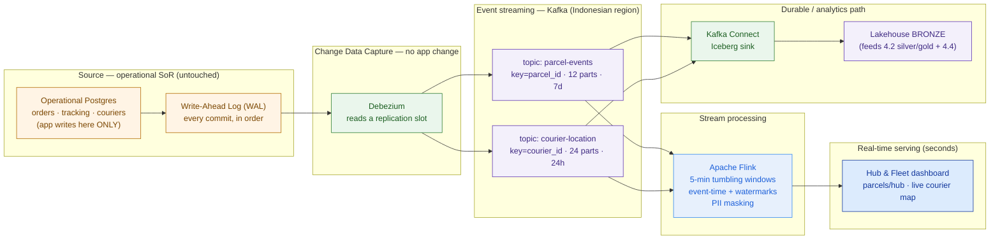

# Streaming Architecture — Kirim Cepat (worked example)

> This is `template-streaming-architecture.md` filled in for a fictional customer. It shows what "good" looks like: the pipeline, the sizing from the customer's own numbers, and the delivery guarantee defended per use case — the artifact you'd attach to the data-platform proposal. Feeds **Capstone D (Enterprise Data Platform)**.

**Customer:** Kirim Cepat (fictional)  ·  **Industry:** Last-mile logistics (Indonesia)
**Prepared by:** SA — Presales  ·  **Date:** 2026-07-05  ·  **Opportunity:** "Live Network Visibility" → Enterprise Data Platform  ·  **Version:** v0.2

**Company shape:** ~50 million parcels/month · ~10,000 couriers · ~200 hubs · ~30 siloed sources · cost-conscious · PDP/residency-bound.
**The ask (verbatim):** *"I want to see the network live — parcels and fleet, right now, not tomorrow."*
**Constraint that shapes everything:** analytics is a full day behind because it depends on a 02:00 nightly batch off the operational Postgres. We must unlock that DB for real-time **without touching the app, without dual-writing, and without polling it to death.**

Legend: **CDC** = Change Data Capture · **WAL** = Postgres Write-Ahead Log · **bronze** = raw landing layer of the lakehouse (4.2) · **guarantee** = delivery semantics.

---

## 1. Freshness triage (what actually needs to be real-time)

| Data / use case | Decision it feeds | Freshness needed | Stream or batch? |
|---|---|---|---|
| Live courier location on the fleet map | dispatch, re-routing, "where is my parcel" | seconds | **Stream** |
| Parcels-per-hub throughput | open a congestion alert, shift staff | seconds–1 min | **Stream** |
| Parcel state (delivered / exception / COD) | SLA timers, COD settlement, customer notify | seconds | **Stream** |
| Nightly reconciliation, finance, ML training | month-end, model retraining | next-day | **Batch** (keep) |
| ~30 other sources (billing, WMS, HR, …) | reporting | hours–next-day | **Batch** until a decision demands fresher |

**The discipline is saying no.** Streaming all ~30 sources would be a runaway bill for a cost-conscious customer. Two streams — **parcel state** and **courier location** — fully cover the VP's live-visibility ask. Everything else stays batch.

## 2. CDC decision (and the hacks ruled out — in writing)

**Source system of record:** operational **PostgreSQL** (orders, tracking, courier assignments).
**Chosen mechanism:** **log-based CDC via Debezium.**

| Option | Verdict | One-line reason |
|---|---|---|
| Dual-write (app writes Postgres + Kafka) | **Rejected** | no shared transaction → silent drift; couples the crown-jewel app to our analytics bus |
| Query-based polling (`WHERE updated_at > :last`) | **Rejected** | adds load to the DB that must never slow; misses deletes + intermediate states; lag = poll interval |
| Log-based CDC (Debezium / WAL) | **Chosen** | zero app change; captures deletes + every state transition in commit order; low source load |

**Source prerequisites (write into the design so the DBA isn't surprised):** `wal_level=logical` · a replication user with `REPLICATION` · a **publication** on `orders`, `parcel_events`, `courier_pings` · a **replication slot** with **monitored lag + WAL-disk headroom**. Named risk: if Debezium stalls, the slot holds WAL and can fill the source disk — a stability risk on the operational DB.

## 3. Topic design (ordering · partitions · retention)

| Topic | Key | Why this key (ordering need) | Partitions | Retention | acks / RF |
|---|---|---|---|---|---|
| `parcel-events` | `parcel_id` | every event for one parcel stays strictly ordered (created→…→delivered) | 12 | 7 days | `acks=all`, RF=3, min ISR=2 — **no loss** |
| `courier-location` | `courier_id` | pings per courier stay ordered for the map trail | 24 | 24 hours | `acks=1`, RF=3 — loss-tolerant, cheaper |

**Defended out loud:** **(1)** partitions are for **consumer parallelism (~200 hubs, the live map) + ordering**, not bytes — throughput is trivial (see §4). **(2)** Kafka is **transport, not the system of record**: retention is short (days) because the durable copy lives in **bronze** on object storage — which keeps broker disk and cost small for a cost-conscious customer.

## 4. Sizing (assumptions → formula → range)

**Topic `parcel-events`**
- Assumption: ~8 scan/state events per parcel (range 5–12: created → picked up → arrived hub → departed hub → line-haul → out for delivery → delivered; exceptions and re-attempts add more).
- Volume: `50,000,000 parcels × 8 = 400,000,000 events/month`.
- Average: `400,000,000 ÷ (30 × 86,400 s) ≈ 154 events/s`.
- Peak: last-mile concentrates in daytime + sort waves → `× 5–6` → **≈ 770–920 events/s peak**.
- Same **parcel tracking / scan-event firehose** sized in 4.1 / 4.2 / 4.4 (~8 events/parcel → ~400M/month → ~4.8B/year) — one entity, one number across the phase.

**Topic `courier-location`**
- Assumption: ~8,000 of 10,000 couriers active at peak, GPS ping every 10 s.
- Peak: `8,000 ÷ 10 s ≈ 800 pings/s`.
- Dial: 15 s cadence → ≈530/s; 5 s cadence → ≈1,600/s. **Ping cadence is the cost dial** — freshness vs volume.

**Sanity check → real-time, not "big data".** Combined peak ≈ **~1,700 msg/s** at sub-KB messages ≈ **~1–2 MB/s**. A modest **3-broker** Kafka (or Redpanda) cluster carries this with huge headroom; one broker handles it in the dev lab. **Size for ordering, durability, and parallelism — not for bytes.** Quoting a 12-node cluster for a 2 MB/s problem would be malpractice.

## 5. Delivery-guarantee matrix (the heart of the deliverable)

| Use case | Lose an event? | Duplicate an event? | Guarantee | How you achieve it |
|---|---|---|---|---|
| Courier GPS ping | Tolerable (next in 10 s) | Tolerable | **at-least-once** (`acks=1`) | keep cheap/fast; no dedup |
| Parcel state (delivered, exception, **COD settlement**) | **Not tolerable** | **Not tolerable** (double COD = money error) | **effectively-once into the sink** | at-least-once transport + **idempotent upsert keyed by `event_id`/LSN** |
| Real-time hub throughput count | Tolerable (small drift) | Prefer not | at-least-once + idempotent windowed agg | dedup by `event_id` inside the window |

**The move:** the money-critical COD stream gets exactly-once *outcomes* via **at-least-once transport + an idempotent sink** — cheaper than true end-to-end exactly-once, and just as correct. This is the line that separates a defensible design from "trust us, it's reliable."

## 6. Sinks — the two paths out of the stream

- **Real-time serving path:** an **Apache Flink** job consumes both topics, computes **windowed** hub throughput (5-min tumbling) and live fleet state with **event-time watermarks** (accept ~15–30 s late pings), and pushes aggregates to the **Hub & Fleet dashboard**. Latency target: **seconds**. (Kafka Streams is the fallback if the team wants no separate cluster and transforms stay simple.)
- **Durable / analytics path:** a **Kafka Connect** sink lands raw events as **Iceberg** tables in the lakehouse **bronze** layer on object storage → feeds silver/gold refinement, BI, and the processing/orchestration of 4.4. Same events, second consumer group, **no dual-write.**

## 7. PDP / residency + failure modes

- **PII in the stream:** recipient name, phone, address in `parcel-events` → **field-level masking/tokenization** at the processing stage before bronze.
- **Residency:** keep **Kafka + Flink + bronze** in an **Indonesian region** (or on-prem) — Indonesia's **PDP law (UU 27/2022)** makes this a hard constraint, not a footnote.
- **Backfill:** Debezium's initial **snapshot** of 50M-parcel history is heavy → snapshot only the recent window the dashboard needs; **batch-backfill deep history** straight into bronze off-peak.
- **Replay:** rewind consumer offsets + reprocess — safe *because* the sink is idempotent (§5).
- **Failure:** consumers restart from last committed offset; RF=3 means a lost broker loses no events. **Owner for replication-slot-lag + WAL-disk monitoring: Platform team** (named, not "someone").
- **Schema change:** a **schema registry** with backward-compatibility rules so a new `parcels` column doesn't break the dashboard or the sink on the next app deploy.

---

## 8. The pipeline



### ASCII fallback

```
   SOURCE                 CDC              STREAM (Kafka, ID region)   PROCESS       SINKS
   Operational Postgres                ┌─ parcel-events (parcel_id) ─┐          ┌─▶ Hub & Fleet dashboard (secs)
     │ app writes here only            │  12 parts · 7d              │  Flink   │
     ▼                                 │                             ├─▶ window ┤   (5-min tumbling, watermarks,
   [ WAL ] ─▶ Debezium ──slot──────────┤                             │  + mask  │    PII masking)
     (every commit, in order)          │                             │          └─▶ bronze (Iceberg) ─▶ 4.2/4.4
                                        └─ courier-location (courier_id) ─┘
   NO app change · NO dual-write · NO polling        guarantee PER use case: GPS=at-least-once · COD=effectively-once
```

---

## 9. Findings & implications

| # | Finding | Layer | Implication | Severity |
|---|---|---|---|---|
| 1 | COD "delivered" must never double-count (money) | Guarantees | idempotent upsert keyed by `event_id`/LSN into bronze | **High** |
| 2 | Replication slot can fill the operational-DB disk if Debezium stalls | CDC / source | monitor slot lag + WAL headroom; owner = Platform team | **High** |
| 3 | Recipient PII in `parcel-events` under PDP law + residency | Compliance | mask/tokenize before bronze; keep stream + processing in-country | **High** |
| 4 | Only 2 of ~30 sources actually need streaming | Scope / cost | stream parcel + courier only; rest stay batch — protects the budget | Medium |
| 5 | ~1–2 MB/s peak → this is small | Sizing | 3-broker cluster, not a 12-node quote; don't oversize | Medium |

**One-line scope statement:**
> The **Live Network Visibility** layer streams **two topics** (`parcel-events`, `courier-location`) off the operational Postgres via **log-based CDC (Debezium)** — no app change, no dual-write, no polling — feeding a **seconds-latency Flink dashboard** and the lakehouse **bronze** layer, with **effectively-once** on the money-critical COD stream and PII masked in-country under PDP. The design work is the **CDC and the per-use-case guarantees**, not the cluster size.

**So what (the pivot this design buys you):** instead of "we'll make the batch run more often", Kirim Cepat gets true live visibility *and* a durable event backbone that feeds the entire data platform — one CDC stream, two paths, no touch to the operational app. You phase it — Phase 1: CDC + the two topics + the live dashboard; Phase 2: bronze sink + silver/gold + the exception/SLA alerting — and you win it because the customer sees you unlocked their database the clean way while a competitor was still proposing a dual-write.
