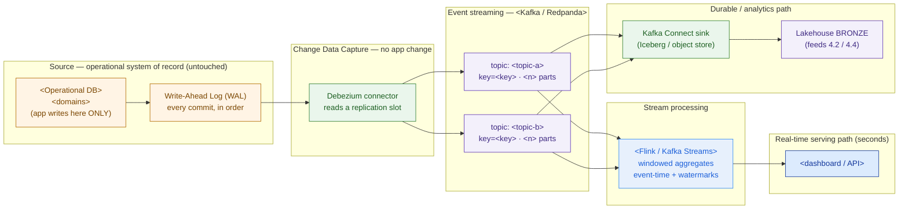

# Streaming Architecture — Design Template

> Fill this in when a customer asks for "real-time" anything on top of an operational database. It takes you from sources → CDC → topics → processing → sinks (real-time + lakehouse), sizes the pipe from the customer's own numbers, and — the part that wins trust — defends a **delivery guarantee per use case** instead of hand-waving "reliable". An executive should grasp the diagram; an engineer should trust the tables.

**Customer:** `<company>`  ·  **Industry:** `<industry>`  ·  **Prepared by:** `<SA name>`  ·  **Date:** `<YYYY-MM-DD>`
**Engagement / opportunity:** `<deal or project name>`  ·  **Version:** `<v0.1 draft>`

Legend: **CDC** = Change Data Capture · **WAL** = Write-Ahead Log · **SoR** = system of record · **bronze** = raw landing layer of the lakehouse (from 4.2) · **guarantee** = delivery semantics (at-most / at-least / effectively-once).

---

## How to use this template

1. **Freshness triage** — decide what genuinely needs streaming vs what stays batch. Saying *no* is the deliverable.
2. **CDC decision** — pick log-based CDC and rule out the hacks (dual-write, polling) *in writing*.
3. **Topic design** — key for the ordering each use case needs; set partitions and retention.
4. **Sizing** — assumptions → formula → range. Never a single magic number.
5. **Delivery-guarantee matrix** — the heart of the doc: one defended guarantee per use case.
6. **Sinks** — the real-time path and the durable (bronze) path.
7. **PDP / residency + failure modes** — the constraints and the not-happy-path.
8. **Draw the map + findings.**

---

## 1. Freshness triage (what actually needs to be real-time)

> Sort each ask by *how stale an answer can be before the decision it feeds goes bad*. Most "real-time" asks are really "fresh enough" — minutes, not milliseconds.

| Data / use case | Decision it feeds | Freshness needed | Stream or batch? |
|---|---|---|---|
| `<use case>` | `<decision>` | `<seconds / minutes / next-day>` | `<Stream / Batch>` |
| `<use case>` | `<decision>` | `<…>` | `<…>` |
| `<the long tail of sources>` | `<…>` | `<hours / next-day>` | Batch until a decision demands otherwise |

*Rule:* stream only the use cases whose decisions break at batch latency. Everything else stays batch — especially for a cost-conscious customer.

## 2. CDC decision (and the hacks ruled out — in writing)

**Source system of record:** `<database + version, e.g. PostgreSQL 15>`
**Chosen mechanism:** `<log-based CDC via Debezium>`

| Option | Verdict | One-line reason |
|---|---|---|
| Dual-write (app writes DB + stream) | **Rejected** | no shared transaction → silent drift; couples core app to the bus |
| Query-based polling (`WHERE updated_at > :last`) | **Rejected** | load on the source; misses deletes/intermediate states; lag = poll interval |
| Log-based CDC (Debezium / WAL) | **Chosen** | no app change; captures deletes + all states in commit order; low source load |

**Source prerequisites to write into the design:** `<wal_level=logical>` · replication user with `REPLICATION` · a **publication** on `<tables>` · a **replication slot** with **monitored lag + WAL-disk headroom** (named risk: a stalled reader fills the source disk).

## 3. Topic design (ordering · partitions · retention)

| Topic | Key | Why this key (ordering need) | Partitions | Retention | acks / RF |
|---|---|---|---|---|---|
| `<topic-a>` | `<key>` | `<what must stay ordered>` | `<n>` | `<7d>` | `<acks=all, RF=3, minISR=2>` |
| `<topic-b>` | `<key>` | `<…>` | `<n>` | `<24h>` | `<acks=1, RF=3>` |

*Two things to defend:* **(1)** partition count is driven by **consumer parallelism + ordering**, not bytes (see §4). **(2)** Kafka is **transport, not the SoR** — keep retention short because the durable copy lives in **bronze**; short retention keeps broker disk and cost small.

## 4. Sizing (assumptions → formula → range)

> One block per topic. State every assumption; show the arithmetic; give a range; end with a sanity check.

**Topic `<topic-a>`**
- Assumptions: `<events per entity, active entities, cadence…>`
- Volume: `<N × M = … per month/day>`
- Average: `<volume ÷ seconds ≈ … /s>`
- Peak: `<× peak-factor ≈ … /s>`

**Topic `<topic-b>`**
- Assumptions: `<…>` · Average: `<…>` · Peak: `<…>` · Dial: `<what trades freshness for cost>`

**Sanity check:** combined peak ≈ `<… msg/s>` at `<msg size>` ≈ `<… MB/s>` → cluster size = `<brokers>`.
*Reminder:* size for ordering, durability, and parallelism — **not** for bytes. Don't quote a 12-node cluster for a 2 MB/s problem.

## 5. Delivery-guarantee matrix (one defended guarantee per use case)

> The heart of the deliverable. "Reliable" is not an answer; *this table* is.

| Use case | Lose an event? | Duplicate an event? | Guarantee | How you achieve it |
|---|---|---|---|---|
| `<loss-tolerant, e.g. GPS ping>` | Tolerable | Tolerable | **at-least-once** (`acks=1`) | keep cheap/fast; no dedup |
| `<money/SLA-critical event>` | **Not tolerable** | **Not tolerable** | **effectively-once into sink** | at-least-once + **idempotent upsert keyed by `<event_id/LSN>`** |
| `<aggregate/count>` | Tolerable | Prefer not | at-least-once + idempotent agg | dedup by `<event_id>` in the window |

*The move:* get exactly-once *outcomes* on the critical stream via **at-least-once transport + an idempotent sink** — cheaper than true end-to-end exactly-once, just as correct.

## 6. Sinks — the two paths out of the stream

- **Real-time serving path:** `<engine: Flink / Kafka Streams / Spark SS>` computes `<windowed aggregates>` with event-time watermarks (accept `<N>`s late), pushing to `<dashboard / API / cache>`. Latency target: `<seconds>`.
- **Durable / analytics path:** `<Kafka Connect sink>` lands raw events in the lakehouse **bronze** layer (`<Iceberg/Delta on object storage>`) → feeds silver/gold, BI, and downstream processing (4.2 / 4.4).

## 7. PDP / residency + failure modes (name them before the customer does)

- **PII in the stream:** `<which fields>` → `<masking / tokenization at CDC or processing>`.
- **Residency:** keep `<Kafka + processing>` in `<in-country region / on-prem>` because `<law/policy>`.
- **Backfill:** initial Debezium **snapshot** is heavy → `<schedule off-peak / snapshot recent window + batch-backfill deep history>`.
- **Replay:** rewind offsets + reprocess — safe *because* the sink is idempotent (§5).
- **Failure:** consumer restart from last offset; RF ensures broker loss ≠ data loss; **owner for slot-lag/WAL-disk monitoring = `<team>`**.
- **Schema change:** `<schema registry + compatibility rule>` so a new column doesn't break consumers.

---

## 8. The pipeline (Mermaid skeleton)

> Replace the placeholder nodes. Keep source on the left, CDC next, topics in the middle, then the two paths (real-time serving up, durable bronze down). Delete rows you don't need.



### ASCII fallback (for docs/email that can't render Mermaid)

```
   SOURCE            CDC            STREAM (Kafka)        PROCESS        SINKS
   <Operational DB>            ┌─ topic <a> (key=<k>) ─┐            ┌─▶ <dashboard>  (seconds)
     │ writes                 │                        │  window +  │
     ▼                        │                        ├──▶ <engine>┤
   [ WAL ] ─▶ Debezium ─slot─▶┤                        │  watermark │
     (every commit, in order) │                        │            └─▶ bronze (durable, feeds 4.2/4.4)
                              └─ topic <b> (key=<k>) ──┘
   NO app change · NO dual-write · NO polling      guarantee decided PER use case (§5)
```

---

## 9. Findings & implications (what the design tells us)

| # | Finding | Layer | Implication | Severity |
|---|---|---|---|---|
| 1 | `<e.g. money-critical event needs idempotent sink>` | Guarantees | `<upsert keyed by event_id>` | `<H/M/L>` |
| 2 | `<e.g. replication slot can fill source disk>` | CDC / source | `<monitor slot lag + WAL headroom; named owner>` | `<…>` |
| 3 | `<e.g. PII in stream under residency law>` | Compliance | `<mask + keep in-country>` | `<…>` |

**One-line scope statement (fill in):**
> The proposed real-time layer streams `<n>` topics off `<source DB>` via **log-based CDC** — no app change, no dual-write — feeding a `<seconds>`-latency `<dashboard>` and the lakehouse **bronze** layer, with `<the critical guarantee>` on `<the critical stream>`. The design work is the guarantees and the CDC, not the cluster size.

---

*Worked example: see `example-kirim-cepat-streaming.md` in this folder.*
