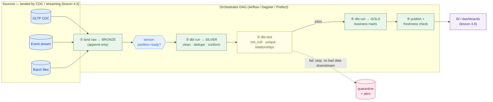
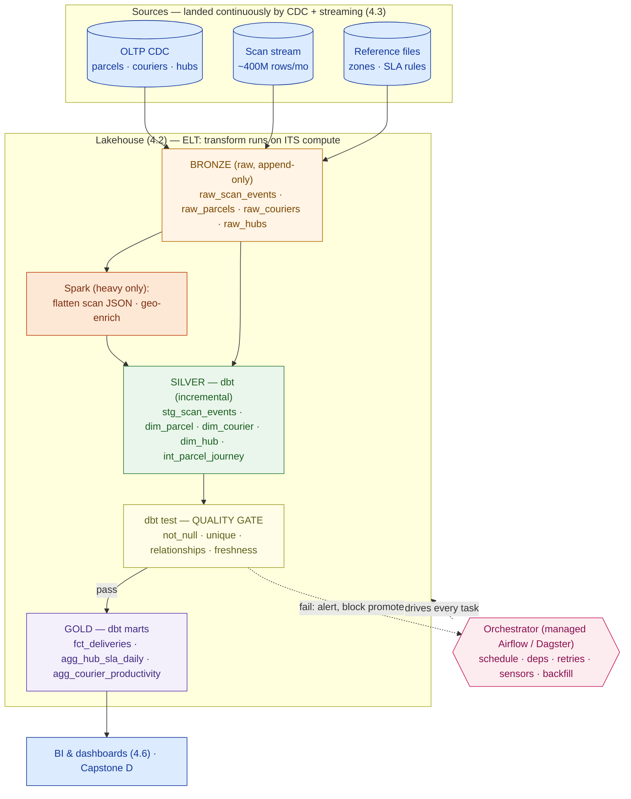

# Processing & Orchestration

> Raw data becomes trusted analytics only through transformation and orchestration. A cron job and a folder of scripts is not a data platform.

**Type:** Design
**Track:** AI, Data & Infrastructure Solution Architect (Presales)
**Prerequisites:** 4.3 Streaming & CDC
**Time:** ~5h
**Lab:** dbt + DuckDB
**Ship It:** Pipeline design

## The Problem

Kirim Cepat has done the hard part. Change-data-capture off the operational databases and a scan-event stream (lesson 4.3) now land raw parcel data into the lakehouse (lesson 4.2) within seconds. The lake is filling up. And the head of Ops is *angrier than before*, because the dashboards still show yesterday's numbers, and now nobody can explain why. "You told me the data was real-time. My hub-SLA report is still a day old."

Here is what happened between the lake and the dashboard. A well-meaning engineer wrote a Python script that reads the raw scans, cleans them, joins couriers and hubs, and writes a summary table. It runs from `cron` at 2 a.m. When a courier's phone sends a malformed scan, the script throws and dies at row 4 million — half the table written, half missing, no alert. When someone asks for last quarter's numbers, there is no way to re-run just that range without re-processing everything and double-counting. A second engineer wrote a *different* script for the finance report that cleans the same scans *differently*, so Ops and Finance now quote two different delivery counts in the same meeting. Nobody can say which table feeds which dashboard, or what "delivered" even means in each one. There is no test, no lineage, no recovery, and no owner. It is exactly the day-old batch report they were trying to escape — only now it is a day old *and* fragile.

This is the failure mode of an SA who designs the sources and the storage but forgets the layer in between. Streaming gets data *in*; the lakehouse holds it *cheaply*; but neither one turns 400 million raw scan events a month into a delivery count a hub manager can trust at 9 a.m. That is the job of the **transformation** layer (the business logic that shapes raw rows into clean, conformed, analytics-ready tables) and the **orchestration** layer (the machinery that runs those transforms in the right order, on schedule, with retries, backfills, tests, and lineage). Get this layer wrong and every dashboard downstream inherits the fragility. This lesson is where you design it — not by writing every SQL model yourself, but by choosing the transformation approach, the orchestration engine, the incremental and backfill patterns, and the freshness SLAs, then defending the whole design to a cost-conscious customer with a mixed-skill team.

## The Concept

An architect reasons about this layer in two moves: **how you transform** and **how you orchestrate**. Get the mental model for each before naming a single tool.

### Move 1 — ETL vs ELT: transform *where*?

Every pipeline does three things — Extract, Load, Transform — but the *order* decides your whole architecture.

- **ETL (Extract → Transform → Load):** clean and shape the data on a *separate* engine (a classic ETL tool, or a Spark cluster) **before** loading it into the warehouse. This is how it was done when warehouse compute was scarce and expensive: you paid a dedicated fleet to transform, and the warehouse only ever saw the finished product.
- **ELT (Extract → Load → Transform):** land the **raw** data first, then transform it **using the warehouse or lakehouse's own compute**, in SQL. Modern lakehouse compute (lesson 4.2) is elastic and cheap, so you push the transform *into* the platform that already holds the data. You keep the raw copy forever (audit + reprocess), and every transform is just a `SELECT`.

For a cost-conscious team with mixed SQL skill, ELT usually wins, and the reason is organizational as much as technical: a `SELECT` statement is something a business analyst can *read and review*, where a Spark job is not. ELT turns transformation from a specialist engineering task into a version-controlled, testable SQL asset the whole data team can own.

### Move 2 — dbt: transformation as testable, documented SQL

**dbt** (data build tool) is the tool that made ELT a discipline. The mental model is small and powerful:

- A **model** is a `SELECT` statement in a `.sql` file. dbt wraps it in the `CREATE TABLE`/`CREATE VIEW` boilerplate and materializes it for you — you never write DDL.
- Models reference each other with `ref('other_model')`. From those refs, dbt **derives the dependency graph itself** — so you get **lineage for free** and dbt always builds in the correct order.
- **Tests** are declarative: `not_null`, `unique`, `accepted_values`, `relationships` (a foreign-key check), plus any custom SQL assertion. They run as part of the build and *fail the pipeline* before bad data reaches a dashboard.
- **Docs** are generated from the models and column descriptions — a browsable catalog and lineage graph, with no separate effort.

This is where the **medallion architecture** from lesson 4.2 becomes *code*. Bronze → Silver → Gold is just a folder of dbt models:

```
  EXTRACT + LOAD  (raw bytes, no logic)     TRANSFORM  (in-lakehouse SQL, dbt)
  ─────────────────────────────────────     ───────────────────────────────────────────
                                             BRONZE           SILVER              GOLD
   OLTP  ──CDC──┐                            (raw, as-is)     (clean, conformed)  (marts)
   events──strm─┼──▶ LAND ──────────────────▶ raw_scans  ──▶  stg_scan_events ──▶ fct_deliveries
   files ──batch┘                             raw_orders ──▶  dim_parcel      ──▶ agg_hub_sla
                                              raw_courier──▶  dim_courier     ──▶ agg_courier_prod
   ▲ E and L just move bytes                  ▲ each box is a dbt model = one SELECT + tests
```

And because every arrow is a `ref()`, dbt hands you the **lineage graph** without you drawing it:

```
   raw_scans ──┐
               ├─▶ stg_scan_events ─┐
   raw_orders ─┘                    ├─▶ int_parcel_journey ─┬─▶ fct_deliveries ─▶ agg_hub_sla_daily
               ┌─▶ dim_parcel ──────┘                       └─▶ agg_courier_productivity
   raw_courier─┴─▶ dim_courier ────────────────────────────────▶ (joined into the facts above)

   every arrow = a dbt ref()   →   free lineage, safe rebuild order, blast-radius on any change
```

### When you still need Spark

dbt SQL covers the vast majority of transformation. You reach past it for **big-data processing with Spark** (or an equivalent engine) in three cases: (1) the transform isn't cleanly expressible in SQL — heavy parsing of deeply nested raw payloads, complex geospatial or graph work, ML feature engineering; (2) the *volume* of a single step is so large that running it as warehouse SQL is uneconomical; or (3) a one-time reprocessing of billions of historical rows. The architect's rule: **SQL/dbt by default; Spark only where the transform is not SQL-expressible or the volume makes warehouse SQL too costly.** Reaching for Spark everywhere re-creates the specialist bottleneck ELT was meant to remove.

### Move 3 — Orchestration: the machinery that runs it reliably

Transformation says *what*. Orchestration says *when, in what order, and what happens when it breaks*. An **orchestrator** (Airflow, Dagster, Prefect) runs your pipeline as a **DAG** — a directed acyclic graph of tasks with dependencies — and gives you what `cron` never could:

- **Dependencies:** task B runs only after task A *succeeds* — not just "3 a.m. and hope A finished."
- **Retries with backoff:** a transient failure (a network blip, a locked table) is retried automatically instead of killing the run.
- **Sensors:** wait for a condition — a source partition landed, a file arrived, an upstream job done — before starting.
- **Backfills:** re-run the pipeline for a *historical date range* on demand, without hand-editing scripts.
- **Idempotency:** re-running any task produces the *same* result, never duplicates. Achieved by writing with partition-overwrite or `MERGE` keyed on a business key — never blind `INSERT ... APPEND`. This is the single property that makes retries and backfills safe.

Here is the shape of an orchestrated ELT pipeline — the thing that replaces the fragile cron script:



Notice the **quality gate**: tests run *between* silver and gold, so a bad batch stops at the gate and alerts, instead of silently corrupting the dashboard. That is the difference between a pipeline and a cron job.

### Three pipeline patterns you will always design

| Pattern | Problem it solves | How it works |
|---|---|---|
| **Incremental model** | Re-processing the full history every run is slow and expensive | Process only rows newer than a stored **watermark** (e.g. `max(event_ts)`); append/merge into the target |
| **Backfill** | You need to (re)populate history — migrating off old reports, or fixing a bug | Run the DAG over a bounded range of past partitions, oldest→newest, idempotently, on a throttled queue |
| **Freshness SLA** | "Is the data current?" must be answerable and monitored | Define max acceptable lag per data product; a freshness check alerts when a table is stale beyond its SLA |

## Design It

Kirim Cepat's ask: retire the day-old nightly report, and stand up an **intraday, trustworthy** analytics layer on the lakehouse — dashboards Ops can act on before the shift ends, without hiring a fleet of Spark engineers. You are designing the transformation + orchestration layer. Work it in six decisions.

**Assumptions (state them, then size):**

- ~50M parcels/month. Assume ~8 tracking scans per parcel (range 5–12: pickup, hub-in, sort, line-haul, out-for-delivery, delivered/attempt; exceptions add more) → **~400M scan-event rows/month** (~250–600M range).
- ~400M/month ÷ 30 ≈ **~13.3M scans/day** ÷ 86,400s ≈ **~154 events/sec average**, with **~500–800/sec peaks** (3–5× at evening delivery waves).
- ~12 months of history to migrate off the nightly reports → **~4.8 billion scan rows** to backfill.
- ~10,000 couriers and ~200 hubs are small **dimension** tables (thousands of rows), refreshed from CDC.

### Step 1 — Choose ELT over ETL

The lakehouse compute is already provisioned (lesson 4.2) and elastic. The business teams have **mixed SQL skill** and the customer is **cost-conscious** — they cannot staff a separate ETL/Spark platform team just to transform data. That is a textbook ELT case: land raw scans in Bronze, transform in-place with SQL, keep the raw copy for audit and reprocessing. **Decision: ELT, transform pushed into the lakehouse.** This alone kills the "second engineer wrote a different cleaning script" problem, because all transforms now live in one version-controlled SQL project.

### Step 2 — Model the medallion as dbt, with a quality gate

Structure the transform as dbt models across the three medallion layers, and define the tests that gate promotion between them:

| Layer | Models (examples) | Materialization | Tests at this layer |
|---|---|---|---|
| **Bronze** | `raw_scan_events`, `raw_parcels`, `raw_couriers`, `raw_hubs` | source (as landed) | source **freshness** (is CDC still flowing?) |
| **Silver** | `stg_scan_events`, `dim_parcel`, `dim_courier`, `dim_hub`, `int_parcel_journey` | table / **incremental** | `not_null` on keys, `unique` on parcel_id, `relationships` scan→parcel, `accepted_values` on status |
| **Gold** | `fct_deliveries`, `agg_hub_sla_daily`, `agg_courier_productivity` | table / incremental | reconciliation totals, `not_null` on metrics, uniqueness on grain |

The single shared `stg_scan_events` and `dim_*` models give Ops and Finance **one definition of "delivered"** — the two-numbers-in-a-meeting problem disappears by construction.

### Step 3 — Make the high-volume events incremental (the sizing decision)

`stg_scan_events` and `fct_deliveries` sit on the ~400M-rows/month firehose. Full-refresh is not an option — here is the arithmetic that proves it:

```
  Full refresh, hourly gold rebuild
    → re-scan the whole ~4.8 B-row history        EVERY run
  Incremental (watermark on event_ts)
    → process only new scans since last run
    → ~13.3M/day ÷ 24 ≈ ~555K rows / hourly run

  ~4,800,000,000  ÷  ~555,000   ≈  ~8,600× less work per run
```

**Decision: incremental materialization** for `stg_scan_events`, `int_parcel_journey`, and `fct_deliveries`, keyed on `event_ts` with a `MERGE`/insert-overwrite on the event-date partition so re-runs are **idempotent**. The small `dim_*` tables stay full-refresh — they are tiny and simpler to reason about.

### Step 4 — Use Spark only where the volume demands it

Default to dbt SQL. Reach for a Spark job in exactly the places the volume or shape justifies it:

- **Flattening raw scan payloads** — the device sends deeply nested JSON at ~400M/month; parse/flatten once in Spark into a tabular Bronze table dbt can consume.
- **Geospatial enrichment** — mapping scan lat/long to hub catchment and delivery zone is awkward and slow in warehouse SQL; do it in Spark.
- **The one-time ~4.8B-row historical backfill** (Step 6).

Everything else — silver conforming, dimensions, gold marts, aggregates — is dbt SQL. **Decision: Spark for two recurring steps (JSON flatten, geo-enrich) + the backfill; dbt for all the rest.** This keeps the specialist surface small and the running cost low.

### Step 5 — Orchestrate with a DAG, schedules, retries, sensors

Wire the whole thing under one orchestrator. The DAG, its cadence, and its recovery behavior:



- **Schedule:** the operational path (silver + hub-SLA gold) runs on a **15-minute micro-batch**; heavier marts hourly; finance/exec marts daily at 02:00.
- **Sensors:** the transform waits on a **freshness sensor** confirming the latest scan partition has landed, so it never runs on half-arrived data.
- **Retries:** each task retries 2–3× with exponential backoff for transient failures; idempotent writes (Step 3) make retries safe.
- **Failure isolation:** a failed test **blocks promotion to Gold and alerts** — the dashboard keeps showing the last good data instead of corrupt data.

### Step 6 — Plan the backfill (migrating off the nightly reports)

The cutover isn't done until history is in the lakehouse. Backfill ~4.8B rows **idempotently, in bounded batches, without starving the live pipeline**:

- **Partition by event date**; run the DAG over past partitions **oldest → newest**, one day (or week) per task.
- Each partition run does **insert-overwrite on that date** → safe to re-run, no double-counting (the exact bug the old scripts had).
- Run on a **separate, throttled queue** at lower priority so the 15-minute live pipeline is never blocked.
- **Sizing (assumption + range):** at an assumed sustained transform throughput of ~100–300M rows/hr on a right-sized cluster, ~4.8B rows ≈ **~16–48 compute-hours**, spread over **~3–5 nights**. Validate throughput on one month first, then extrapolate.

**Freshness SLAs — the contract you publish:**

| Data product | Consumer | Freshness SLA | Cadence |
|---|---|---|---|
| Hub-SLA / exception dashboard | Ops (hub managers) | ≤ 30 min | 15-min micro-batch |
| Courier productivity | Fleet / Ops | ≤ 1 hr | hourly |
| Executive daily KPIs | Leadership | ≤ 4 hr after midnight | daily 02:00 |
| COD / finance reconciliation | Finance | T+1 by 06:00 | daily |

## Compare It

Four decisions, mapped to a **mixed-skill, cost-conscious** team.

**ETL vs ELT**

| | ETL (transform before load) | ELT (transform in-platform) |
|---|---|---|
| Transform engine | Separate ETL tool / Spark fleet | The warehouse/lakehouse's own compute |
| Who can own it | Data engineers (specialist) | Anyone who reads SQL — analysts included |
| Raw kept? | Often no | **Yes** — reprocess + audit anytime |
| Best when | Compute scarce, heavy non-SQL logic | Cheap elastic compute, SQL-shaped work |
| **Kirim Cepat fit** | Only for the heavy Spark steps | **Default** — lakehouse + mixed SQL skill |

**dbt vs hand-written SQL scripts vs Spark**

| | dbt | Hand-written SQL + cron | Spark |
|---|---|---|---|
| Lineage | Automatic (`ref`) | None | Manual |
| Tests / docs | Built-in | You build it (rarely happens) | You build it |
| Skill barrier | SQL | SQL | Scala/PySpark specialist |
| Big-data / non-SQL | No | No | **Yes** |
| **Use for** | **95% of transforms** | Avoid (this is the Problem) | JSON flatten, geo, backfill |

**Airflow vs Dagster vs Prefect**

| | Airflow | Dagster | Prefect |
|---|---|---|---|
| Model | Task DAG (mature, ubiquitous) | **Asset**-based (data-aware, great lineage) | Pythonic, dynamic flows |
| Ecosystem | Largest; most hires know it | Growing | Growing |
| Ops weight | Heavy to self-host | Lighter | Light |
| Best for | Standard, hire-friendly | dbt-centric, lineage-first | Dynamic Python-heavy pipelines |

**Managed vs self-hosted orchestration**

| | Managed (MWAA / Astronomer / Dagster Cloud) | Self-hosted (own Airflow) |
|---|---|---|
| Ops burden | Vendor runs it | You need a platform team |
| Cost shape | Higher subscription | Lower licence, higher labour |
| **Fit for Kirim Cepat** | **Yes** — no platform team to spare | No — hidden labour cost |

**The recommendation and its defense:** **ELT + dbt Core (free, open-source) for transformation**, on a **managed orchestrator** (managed Airflow if they want the ubiquitous skill, or Dagster for tighter dbt-native lineage), with **Spark reserved for the two heavy steps and the backfill**. It matches the mixed-skill team (analysts contribute SQL models), it stays cost-conscious (dbt Core is free; managed orchestration avoids hiring a platform team; incremental models keep compute ~8,600× smaller per run than full-refresh), and it delivers the one thing the old cron script never could — **tested, lineage-tracked, recoverable, intraday** data.

## Ship It

This lesson ships a reusable **Pipeline Design** — the artifact that specifies the transformation + orchestration layer for any data platform, and the direct input to **Capstone D (Enterprise Data Platform)**. Both files live in [`outputs/`](../outputs/):

- **[`template-pipeline-design.md`](../outputs/template-pipeline-design.md)** — a fill-in-the-blank template: sources inventory → ELT/ETL decision → medallion model plan → tests & quality gates → orchestration DAG (Mermaid skeleton) → freshness SLAs → backfill/migration plan → Spark decision → tooling & cost. A colleague can run a design session straight from it.
- **[`example-kirim-cepat-pipeline.md`](../outputs/example-kirim-cepat-pipeline.md)** — the template fully worked for Kirim Cepat, so the skeleton isn't abstract: the intraday medallion, incremental sizing, the 4.8B-row backfill plan, and the freshness-SLA contract.

The [`lab/`](../lab/) folder proves the core claim on your own laptop with **dbt + DuckDB** (free, no cloud): a silver model, a gold aggregate, and a test — so you have *seen* dbt build a lineage-tracked, tested pipeline before you put it in a proposal.

## Exercises

1. **(Easy)** Take the fragile cron script from The Problem and list the four things the orchestrated DAG gives you that it cannot: dependency ordering, retries, idempotent backfill, and a test gate. For each, write one sentence on which of Kirim Cepat's symptoms (half-written table, double-counting, two delivery numbers, day-old data) it fixes.
2. **(Medium)** Re-scope the pipeline for a *different* customer: a **retail chain** doing nightly sales + inventory analytics (no 400M-event firehose, but strict T+1 finance close). Which models can be full-refresh instead of incremental? Do they need Spark at all? Pick an orchestration cadence and one freshness SLA, and justify each against their profile.
3. **(Hard)** Extend the Kirim Cepat design into a **decision memo**: Ops now wants the hub-SLA dashboard *near-real-time* (≤ 2 min, not ≤ 30). Using the freshness-SLA table and the incremental pattern, write a half-page recommendation — micro-batch vs streaming transformation — that names the cost and complexity of each path and where the 15-minute batch stops being enough. Combine it with your lesson 4.3 streaming architecture and save it toward Capstone D.

## Key Terms

| Term | What people say | What it actually means |
|------|-----------------|------------------------|
| ELT | "It's just ETL backwards" | Load raw first, then transform **using the warehouse/lakehouse's own compute** in SQL — cheaper and analyst-ownable when compute is elastic. The default modern pattern. |
| dbt | "A SQL runner" | A transformation framework: models are `SELECT`s, `ref()` builds the lineage DAG automatically, and tests/docs are first-class — turning transforms into a tested, version-controlled asset. |
| Medallion (as code) | "Bronze/Silver/Gold tables" | The three layers implemented as dbt models — raw → cleaned/conformed → business marts — so lineage and tests run end to end. |
| Orchestration | "A scheduler" | Running a pipeline as a **DAG** with dependencies, retries, sensors, and backfills — everything `cron` can't do. The reliability layer, not just a clock. |
| DAG | "The pipeline" | Directed Acyclic Graph of tasks: B runs only after A *succeeds*, and there are no cycles. The unit an orchestrator executes. |
| Idempotency | "Re-running is fine" | Re-running a task yields the **same** result, never duplicates — achieved with partition-overwrite/`MERGE`, not append. The property that makes retries and backfills safe. |
| Incremental model | "Only new data" | Process only rows past a stored **watermark** each run, instead of the full history — the difference between minutes and hours at 400M rows/month. |
| Backfill | "Loading old data" | Re-running the pipeline over a bounded range of **historical** partitions, idempotently and throttled, to populate or repair history. |
| Freshness SLA | "It's real-time" | The **maximum acceptable lag** for a data product, published and monitored — with an alert when a table goes stale. Turns "is it current?" into a contract. |
| Sensor | "A trigger" | A task that **waits for a condition** (partition landed, file arrived, upstream done) before the pipeline proceeds — so it never runs on half-arrived data. |

## Further Reading

- [dbt — What is dbt? (docs)](https://docs.getdbt.com/docs/introduction) — the canonical mental model for models, `ref()` lineage, and tests; read the "Building your first models" path once and you can review any dbt project.
- [dbt best practices — how we structure our projects](https://docs.getdbt.com/best-practices/how-we-structure/1-guide-overview) — the staging/intermediate/marts (medallion-as-code) layout this lesson designs against.
- [Apache Airflow — Core Concepts](https://airflow.apache.org/docs/apache-airflow/stable/core-concepts/index.html) — DAGs, operators, sensors, retries, and backfills in the most widely deployed orchestrator; know the vocabulary even if you pick Dagster.
- [Dagster — Thinking in assets](https://docs.dagster.io/guides/build/assets) — the asset-based, data-aware alternative to task DAGs, with lineage as a first-class citizen; the strongest fit for a dbt-centric platform.
- [The Rise of the Data Engineer / Analytics Engineer](https://www.getdbt.com/blog/the-analytics-engineering-guide) — why ELT + SQL transformation reshaped who owns the pipeline, which is exactly the mixed-skill-team argument in Compare It.
- [DuckDB documentation](https://duckdb.org/docs/) — the free, in-process engine the lab runs on, so you can prove a dbt pipeline end-to-end with no cloud account.
