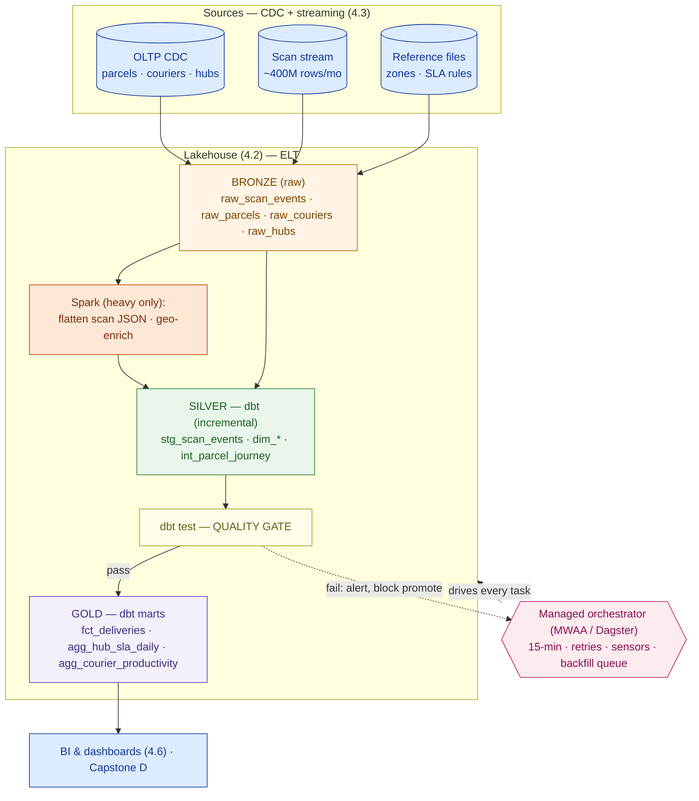

# Pipeline Design — Kirim Cepat (worked example)

> This is `template-pipeline-design.md` filled in for the running customer. It shows what "good" looks like: the intraday medallion, the incremental sizing that proves full-refresh is uneconomical, the 4.8B-row backfill plan, and the freshness-SLA contract. Direct input to **Capstone D (Enterprise Data Platform)**.

**Customer:** Kirim Cepat (fictional)  ·  **Industry:** Indonesian last-mile logistics
**Prepared by:** SA — Presales  ·  **Date:** 2026-07-05  ·  **Opportunity:** Data Platform — Processing & Orchestration layer  ·  **Version:** v0.2

**Company shape:** ~50M parcels/month · ~10,000 couriers · ~200 hubs.
**The ask (verbatim):** *"You told me the data was real-time. My hub-SLA report is still a day old — and now nobody can explain why."*

**Assumptions (stated, then sized):**
- ~8 tracking scans per parcel (range 5–12) → **~400M scan-event rows/month** (~250–600M range).
- ~13.3M scans/day ≈ **~154 events/sec average**, **~500–800/sec peaks** (evening delivery waves).
- ~12 months history to migrate off the nightly reports → **~4.8 billion rows** to backfill.
- ~10,000 couriers, ~200 hubs = small dimension tables (thousands of rows).

---

## 1. Sources inventory

| Source | Mechanism | Volume | Freshness in | Notes |
|---|---|---|---|---|
| Scan-event stream (courier devices) | Streaming (4.3) | ~400M rows/mo | seconds | nested JSON payload; dedupe on `scan_id` |
| Parcels / orders DB | CDC (4.3) | ~50M new/mo | seconds | key `parcel_id` |
| Couriers, hubs, zones | CDC + reference files | thousands | hourly / on change | slowly-changing dimensions |

## 2. ETL vs ELT decision

- **Decision:** **ELT** (transform on the lakehouse's own compute), with a thin Spark carve-out for two heavy steps.
- **Why:** lakehouse compute already provisioned and elastic (4.2); business teams have **mixed SQL skill** and can read/review SQL models; customer is **cost-conscious** and cannot staff a separate ETL platform team; raw scans must be retained for audit + reprocessing.
- **Raw retention:** keep Bronze indefinitely (cheap object storage) — enables backfill and dispute audit.

## 3. Medallion model plan

| Layer | Models | Grain | Materialization | Owner |
|---|---|---|---|---|
| Bronze | `raw_scan_events`, `raw_parcels`, `raw_couriers`, `raw_hubs` | raw event/row | source (as landed) | Data Eng |
| Silver | `stg_scan_events`, `dim_parcel`, `dim_courier`, `dim_hub`, `int_parcel_journey` | one row per scan / per parcel | **incremental** (scans, journey) · table (dims) | Analytics Eng |
| Gold | `fct_deliveries`, `agg_hub_sla_daily`, `agg_courier_productivity` | delivery / hub-day / courier-day | incremental (fct) · table (aggs) | Analytics Eng |

*One shared definition:* "delivered" is defined **once** in `int_parcel_journey` and reused everywhere → Ops and Finance stop quoting two different counts.

## 4. Incremental vs full-refresh (the sizing call)

```
  Full-refresh hourly gold rebuild
    → re-process the whole ~4,800,000,000-row history   EVERY run
  Incremental (watermark on event_ts)
    → ~13.3M/day ÷ 24 ≈ ~555,000 rows / hourly run

  4,800,000,000 ÷ 555,000 ≈ ~8,600× less work per run
```

- **Incremental:** `stg_scan_events`, `int_parcel_journey`, `fct_deliveries` — watermark on `event_ts`, write via **insert-overwrite on the event-date partition** (idempotent).
- **Full-refresh:** `dim_parcel`, `dim_courier`, `dim_hub` — tiny; simpler to reason about.

## 5. Tests & data-quality gates

| Layer | Test | Column / rule | Action on fail |
|---|---|---|---|
| Bronze | source freshness | scan stream still flowing (< 10 min old) | alert |
| Silver | `unique` | `scan_id` (dedupe) | block promotion |
| Silver | `not_null` | `parcel_id`, `event_ts`, `hub_id` | block promotion |
| Silver | `relationships` | `stg_scan_events.parcel_id → dim_parcel` | block promotion |
| Silver | `accepted_values` | `status ∈ {picked_up, in_hub, in_transit, out_for_delivery, delivered, failed}` | block promotion |
| Gold | reconciliation | daily delivered count vs source system | alert |

**Gate rule:** tests run between Silver and Gold. A failed batch **stops at the gate and alerts** — the hub-SLA dashboard keeps yesterday's *correct* number instead of today's corrupt one.

## 6. Orchestration DAG



### ASCII fallback

```
  CDC + stream ──▶ ① BRONZE ──▶ Spark(flatten+geo) ──▶ ② SILVER(dbt,incr) ──▶ ③ TEST ─┬─pass─▶ ④ GOLD ──▶ BI
                     raw_*                              stg/dim/int              gate    └─fail─▶ alert + block promote
  orchestrator: 15-min micro-batch (ops) · hourly (fleet) · daily 02:00 (exec/finance) · retries 3×backoff · backfill queue
```

**Schedule / retries / sensors:**
- Operational path (silver + `agg_hub_sla_daily`): **15-minute micro-batch**; `agg_courier_productivity` hourly; exec/finance marts daily 02:00.
- Retries: **3× exponential backoff**; idempotent writes make retries safe.
- Sensor: **freshness sensor** on the latest scan partition — transform never runs on half-arrived data.

## 7. Freshness SLA contract

| Data product | Consumer | Freshness SLA | Cadence |
|---|---|---|---|
| Hub-SLA / exception dashboard | Ops (hub managers) | **≤ 30 min** | 15-min micro-batch |
| Courier productivity | Fleet / Ops | ≤ 1 hr | hourly |
| Executive daily KPIs | Leadership | ≤ 4 hr after midnight | daily 02:00 |
| COD / finance reconciliation | Finance | T+1 by 06:00 | daily |

## 8. Backfill / migration plan (retiring the nightly reports)

- **Goal:** migrate ~12 months (~4.8B scan rows) into the lakehouse Gold marts.
- **Partitioning:** by `event_date`; run **oldest → newest**, one day per task.
- **Idempotency:** each partition = **insert-overwrite on that date** → re-runnable, no double-counting (the exact old-script bug).
- **Isolation:** run on a **separate throttled queue** at lower priority so the 15-minute live pipeline is never starved.
- **Sizing (assumption + range):** at ~100–300M rows/hr sustained transform throughput → ~4.8B rows ≈ **~16–48 compute-hours**, spread over **~3–5 nights**. Validate on one month first, then extrapolate.

## 9. Spark (big-data) decision

| Step | Engine | Why |
|---|---|---|
| Flatten nested scan JSON (~400M/mo) | **Spark** | not SQL-shaped; do it once into a tabular Bronze table |
| Geo-enrich (lat/long → hub catchment, zone) | **Spark** | geospatial is awkward/slow in warehouse SQL |
| One-time 4.8B-row historical backfill | **Spark** | bulk reprocessing |
| Silver conforming, dims, gold marts, aggregates | **dbt SQL** | default; analyst-ownable; keeps cost + specialist surface small |

## 10. Tooling & cost notes

- **Transform:** **dbt Core** (free, open-source) — not dbt Cloud, to stay cost-conscious.
- **Orchestration:** **managed** (MWAA if they want the ubiquitous Airflow skill for hiring; Dagster for tighter dbt-native lineage) — no platform team to self-host.
- **Compute:** right-sized lakehouse SQL warehouse with **autosuspend**; a small Spark cluster spun up **only** for the two heavy steps + backfill.
- **Cost levers:** incremental models (~8,600× less/run than full-refresh), autosuspend, throttled backfill queue.

## 11. Risks & findings

| # | Risk / finding | Layer | Mitigation | Severity |
|---|---|---|---|---|
| 1 | Old cron scripts append with no idempotency → double counts | Orchestration | insert-overwrite / `MERGE` on partition | **High** |
| 2 | Full-refresh at 400M rows/mo is too slow + costly | Transform | incremental + `event_ts` watermark | **High** |
| 3 | No test gate → bad scans corrupt dashboards silently | Quality | dbt tests block promotion + alert | **High** |
| 4 | Two cleaning scripts → Ops vs Finance disagree | Transform | one shared `int_parcel_journey` definition | Medium |
| 5 | Backfill could starve the live 15-min pipeline | Orchestration | separate throttled low-priority queue | Medium |

**One-line design statement:**
> Kirim Cepat's pipeline is an **ELT** transformation layer — Bronze→Silver→Gold as dbt models, **incremental** on the ~400M-rows/month scan tables, **Spark only** for JSON flatten + geo-enrich + the 4.8B-row backfill — orchestrated as a **tested, idempotent 15-minute DAG** delivering hub-SLA data within a **≤ 30-minute** freshness SLA, retiring the fragile day-old cron reports.

**So what (the pivot this design buys you):** the customer stops hearing "it's real-time" and seeing yesterday's data. You hand them a *contract* (freshness SLAs), a *guarantee* (test gate + idempotent retries), and a *migration path* (throttled backfill) — priced honestly, because the incremental sizing and managed-orchestration choices keep it inside a cost-conscious budget.
