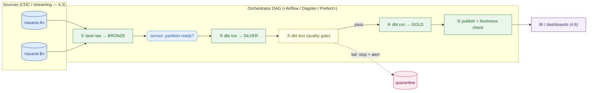

# Pipeline Design — Template

> Fill this in after the sources (CDC/streaming, lesson 4.3) and storage (lakehouse, lesson 4.2) are decided. It specifies the layer *between* them: how raw data becomes trusted, tested, intraday analytics. An executive should grasp §3 and §6; an engineer should be able to build from §4–§8.

**Customer:** `<company>`  ·  **Industry:** `<industry>`  ·  **Prepared by:** `<SA name>`  ·  **Date:** `<YYYY-MM-DD>`
**Engagement / opportunity:** `<deal or project name>`  ·  **Version:** `<v0.1 draft>`

Legend: **Bronze** = raw as-landed · **Silver** = cleaned/conformed · **Gold** = business marts · **SLA** = max acceptable data lag · **idempotent** = safe to re-run.

---

## How to use this template

1. **Sources** — list what lands, how fast, and how big (§1).
2. **ETL vs ELT** — decide where transformation runs, and why (§2).
3. **Medallion plan** — the Bronze/Silver/Gold model list, materialization, and which are incremental (§3–§4).
4. **Tests & gates** — the data-quality checks that block bad data (§5).
5. **Orchestration** — the DAG, schedule, retries, sensors (§6).
6. **Freshness SLAs** — the published contract per data product (§7).
7. **Backfill** — how history is migrated/repaired idempotently (§8).
8. **Spark decision, tooling, cost, risks** (§9–§11).

---

## 1. Sources inventory

| Source | Mechanism (CDC / stream / batch file) | Volume | Freshness in | Notes |
|---|---|---|---|---|
| `<system>` | `<CDC / stream / file>` | `<rows/day or GB>` | `<seconds / hourly / nightly>` | `<key / dedupe key>` |
| `<…>` | | | | |

## 2. ETL vs ELT decision

- **Decision:** `<ELT / ETL / hybrid>`
- **Why:** `<compute location, team SQL skill, cost posture, raw-retention need>`
- **Raw retention:** `<keep Bronze forever? how long?>`

## 3. Medallion model plan (Bronze → Silver → Gold)

| Layer | Model(s) | Grain | Materialization (view / table / **incremental**) | Owner |
|---|---|---|---|---|
| Bronze | `<raw_*>` | raw event/row | source | `<team>` |
| Silver | `<stg_*, dim_*, int_*>` | `<conformed grain>` | `<table / incremental>` | `<team>` |
| Gold | `<fct_*, agg_*>` | `<business grain>` | `<table / incremental>` | `<team>` |

*One shared definition rule:* the same metric (e.g. "delivered") must be defined **once** in Silver/Gold and reused — never re-cleaned per report.

## 4. Incremental vs full-refresh (the sizing call)

> Show the arithmetic; never assert "it'll be fine."

```
  Full-refresh cost   = <rows in full history> processed EVERY run
  Incremental cost    = <new rows per run> (watermark on <column>)
  Ratio               = <full> ÷ <incremental> ≈ <N>× less work / run
```

- **Incremental models:** `<list>` — watermark on `<column>`, write via `<MERGE / insert-overwrite partition>` (idempotent).
- **Full-refresh models:** `<small dims / lookups>` — cheap enough to rebuild.

## 5. Tests & data-quality gates

| Layer | Test | Column / rule | Action on fail |
|---|---|---|---|
| Bronze | source freshness | `<is source still flowing?>` | alert |
| Silver | `not_null` / `unique` | `<keys>` | block promotion |
| Silver | `relationships` | `<fact → dim FK>` | block promotion |
| Silver | `accepted_values` | `<status enum>` | block promotion |
| Gold | reconciliation | `<totals match source?>` | alert / block |

**Gate rule:** tests run **between Silver and Gold** — a failure blocks promotion and alerts; the dashboard keeps the last good data.

## 6. Orchestration DAG (Mermaid skeleton)

> Replace placeholders. Keep sources left/top, the test gate before Gold, and the orchestrator driving every task.



### ASCII fallback (docs/email that can't render Mermaid)

```
  <sources> ──▶ ① LAND(Bronze) ──▶ [sensor] ──▶ ② SILVER(dbt) ──▶ ③ TEST ─┬─pass─▶ ④ GOLD ──▶ ⑤ publish ──▶ BI
                                                                          └─fail─▶ alert + quarantine (no bad data downstream)
  orchestrator: schedule <cadence> · retries <n>×backoff · sensors <on what> · backfill <how>
```

**Schedule / retries / sensors:**

- Cadence: operational `<15-min / hourly>` · exec/finance `<daily HH:MM>`
- Retries: `<n>×` with `<exponential backoff>`
- Sensors: `<wait on which partition/file/upstream>`

## 7. Freshness SLA contract

| Data product | Consumer | Freshness SLA | Cadence |
|---|---|---|---|
| `<dashboard/mart>` | `<team>` | `<≤ N min / hr / T+1>` | `<15-min / hourly / daily>` |
| `<…>` | | | |

## 8. Backfill / migration plan

- **Goal:** `<migrate N months history / repair range>`
- **Partitioning:** by `<event_date>`; run `<oldest→newest>`, `<day/week>` per task.
- **Idempotency:** each partition = `<insert-overwrite / MERGE>` → safe to re-run.
- **Isolation:** `<separate throttled queue so live pipeline isn't starved>`
- **Sizing (assumption + range):** `<rows>` ÷ `<assumed throughput/hr>` ≈ `<compute-hours>` over `<nights>`. Validate on one partition first.

## 9. Spark (big-data) decision

| Step | dbt SQL or Spark? | Why |
|---|---|---|
| `<flatten nested payloads>` | `<Spark>` | `<not SQL-shaped / volume>` |
| `<geo / ML enrichment>` | `<Spark>` | `<awkward in SQL>` |
| `<historical backfill>` | `<Spark>` | `<one-time bulk>` |
| `<everything else>` | `<dbt SQL>` | `<default; analyst-ownable>` |

## 10. Tooling & cost notes

- **Transform:** `<dbt Core (free) / dbt Cloud>`
- **Orchestration:** `<managed (MWAA/Astronomer/Dagster Cloud) / self-hosted>` — reason: `<platform team? cost?>`
- **Compute:** `<lakehouse SQL warehouse size + Spark cluster only for heavy steps>`
- **Cost levers:** incremental models, autosuspend compute, throttled backfill queue.

## 11. Risks & findings

| # | Risk / finding | Layer | Mitigation | Severity |
|---|---|---|---|---|
| 1 | `<no idempotency → double counts>` | Orchestration | `<partition-overwrite/MERGE>` | `<H/M/L>` |
| 2 | `<full-refresh too slow/costly>` | Transform | `<incremental + watermark>` | `<…>` |
| 3 | `<no test gate → bad data downstream>` | Quality | `<dbt tests block promotion>` | `<…>` |

**One-line design statement (fill in):**
> The pipeline is an **`<ELT>`** transformation layer (`<Bronze→Silver→Gold as dbt models, incremental on the high-volume tables>`) orchestrated as a **tested, idempotent DAG** delivering `<intraday>` data within published freshness SLAs — replacing `<the fragile cron/batch it retires>`.

---

*Worked example: see `example-kirim-cepat-pipeline.md` in this folder.*
