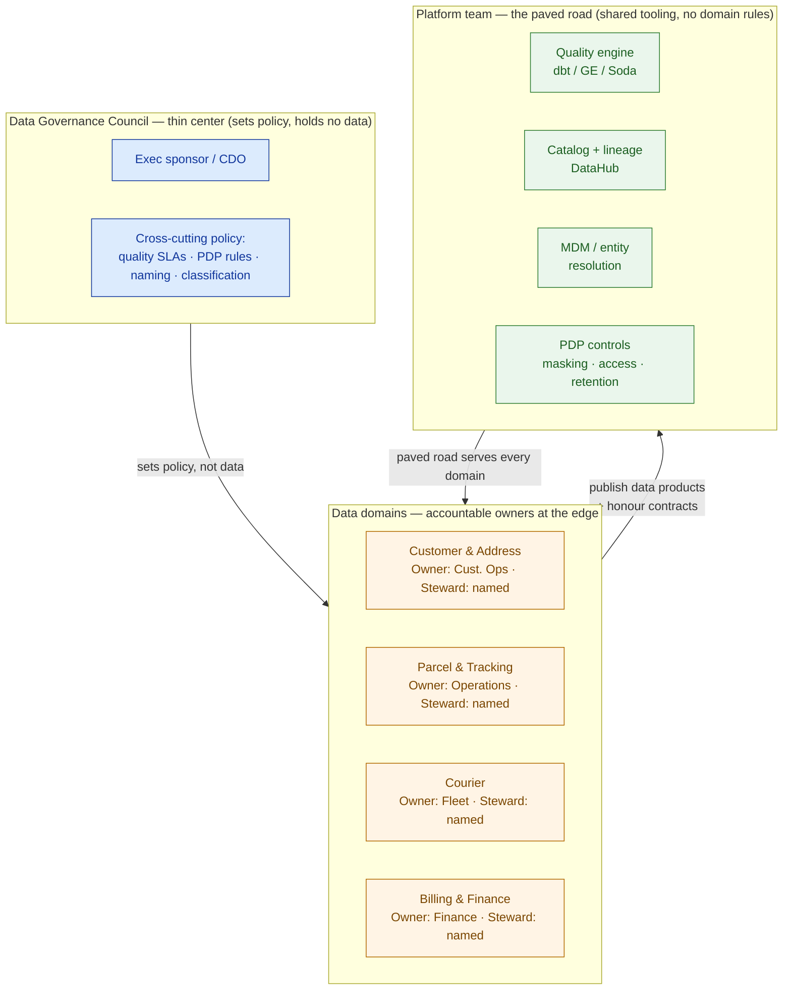

# Data Governance, Quality & Catalog

> A data platform no one trusts or can find is just an expensive backup. Govern trust, quality, and discovery as running systems — not a policy PDF filed after go-live.

**Type:** Design
**Track:** AI, Data & Infrastructure Solution Architect (Presales)
**Prerequisites:** 4.4 Processing & Orchestration
**Time:** ~4h
**Lab:** —
**Ship It:** Governance framework

## The Problem

You have spent four lessons building Kirim Cepat a real platform. The lakehouse (4.2) holds parcels, couriers, and customers. Streaming and CDC (4.3) pull ~30 siloed sources in near-real-time. Spark and dbt (4.4) transform them on an Airflow schedule. The pipelines are green. Then the platform meets its first users, and it dies of distrust.

The finance analyst asks a simple question — *"how many parcels did we deliver in Jakarta last month?"* — and gets three different numbers from three tables, because nobody can say which one is authoritative. The operations lead wants the "real" address for a high-value customer and finds **four** of them: same person, four spellings of the same kelurahan, two postcodes, no way to tell which is current. A data scientist spends a week hunting for a courier-performance table that already exists, because there is no catalog and no one to ask — the person who built it left. And the legal team, six weeks from an audit, discovers that raw customer phone numbers and national ID fragments are sitting unmasked in a dozen derived tables that half the company can query. Kirim Cepat has PDP obligations (Indonesia's Personal Data Protection Law) on exactly this data, and right now the honest answer to *"who can see customer PII and why?"* is *"we don't know."*

This is the failure mode of an architect who treats governance as a document. The rookie ships a beautiful pipeline and a 40-page "Data Governance Policy" that says stewards *should* keep data clean and users *should* handle PII responsibly — and then wires **zero** of it into the platform. No in-pipeline quality checks, so bad data flows to dashboards unchallenged. No catalog, so no one can discover or trust a table, and no one can trace where a number came from when it looks wrong. No golden record, so the duplicate addresses multiply forever. No data classification, so PII sprawls into every downstream table. Governance-as-a-PDF changes no bytes. This lesson is about designing governance, quality, master data, cataloging, and privacy as **systems that run inside the platform** — controls with teeth, owned by named people, enforced in the pipeline — and defending that design to a customer who thinks "governance" is a committee that slows everyone down.

## The Concept

Governance is not one thing; it is **six systems that make a platform trustworthy and findable**, each answering a different question. An architect designs all six as an operating model, then defends where to invest first. Here they are on one page.

| # | System | Question it answers | Enforced by |
|---|--------|---------------------|-------------|
| 1 | **Governance & stewardship** | *Who owns this data and decides the rules?* | Domains, owners, stewards, a RACI, an operating model |
| 2 | **Data quality** | *Can I trust these values?* | Tests **in the pipeline** + quality SLAs |
| 3 | **Master data & entity resolution** | *Which record is the real one?* | Dedup → survivorship → a **golden record** |
| 4 | **Metadata & catalog** | *Does this data exist, and where did it come from?* | Discovery, business glossary, **lineage** |
| 5 | **Data contracts** | *Will my upstream break me without warning?* | Schema + SLA agreements on sources |
| 6 | **Privacy / PDP** | *Who may see PII, and for how long?* | Classification, masking, retention, access control |

### 1. Governance & the operating model

Governance is the answer to *"who is accountable?"* Every **data domain** (customer, parcel, courier, billing) needs a **data owner** (a business leader accountable for the data's fitness) and a **data steward** (the hands-on custodian who curates definitions and triages quality issues). The **operating model** decides where that accountability sits, and it is the single biggest governance design decision:

- **Centralized** — one central data team owns all data, sets all rules, does all curation. Consistent, but a bottleneck; it doesn't scale and it puts the people who *know least* about a domain in charge of it.
- **Federated / data mesh** — domains own their own data as **products**, with a thin central **council** setting cross-cutting policy (quality SLAs, PDP rules, naming standards) and a **platform team** providing the paved-road tooling everyone uses. Scales with the org; needs maturity to work.

Kirim Cepat has ~30 sources and no single team that understands all of them, so pure centralization is a fantasy. The target is federated — but you don't start there. Governance maturity is **crawl → walk → run**, and selling "data mesh" to a company with four unmasked-PII tables is malpractice.



Read it as accountability flowing to the **edges** (domains own their data), policy flowing from a **thin center** (the council, not a bottleneck), and tooling flowing from a **shared platform** (so every domain enforces the same rules the same way). That is the federated operating model an architect defends: *govern the standards centrally, own the data locally, enforce with common tooling.*

### 2. Data quality — the six dimensions, tested in the pipeline

"Quality" is not a vibe; it decomposes into **six measurable dimensions**, and each becomes an automated test that runs *inside* the pipeline (as a dbt test, a Great Expectations expectation, or a Soda check) — not a manual review after the fact.

| Dimension | Plain question | Kirim Cepat example test |
|---|---|---|
| **Validity** | Does the value fit its allowed format/range? | Postcode matches the Indonesian 5-digit format |
| **Completeness** | Are required fields present? | `kelurahan` and `kecamatan` are not null |
| **Uniqueness** | No unintended duplicates? | Exactly one golden record per resolved address |
| **Accuracy** | Does it match reality? | Geocode falls within a plausible hub service radius |
| **Consistency** | Do related values agree across tables? | Province code matches the postcode's province |
| **Timeliness** | Is it fresh enough? | CDC lag from source is under the contract SLA |

Each test carries a **severity**: a **blocking** check fails the pipeline and the data is not published; a **warning** publishes but alerts the steward and opens a ticket. Bundle the targets into a **quality SLA** per data product — the contract that says "this table is ≥99% valid postcodes, <15 min fresh, or it's not fit to serve." Here is that scorecard as an operator reads it:

```
DATA-QUALITY SCORECARD — data product: dim_customer_address (golden record)
────────────────────────────────────────────────────────────────────────────
DIMENSION      CHECK (runs IN pipeline, every build)      TARGET   ACTUAL  GATE
────────────────────────────────────────────────────────────────────────────
Validity       postcode matches ID 5-digit format          ≥99%    97.3%   WARN
Completeness   kelurahan + kecamatan not null              ≥98%    99.1%   PASS
Uniqueness     one golden record per resolved address      100%   100.0%   PASS
Accuracy       geocode within hub service radius           ≥95%    95.4%   PASS
Consistency    province code == postcode's province        ≥99%    99.8%   PASS
Timeliness     CDC lag from source < contract SLA         <15 min   6 min  PASS
────────────────────────────────────────────────────────────────────────────
GATE: any BLOCKING check FAIL → pipeline stops, table not published, page owner.
      WARN → publish + alert steward + open quality ticket (validity trending down).
```

The targets (≥99%, <15 min) are **proposed SLAs the architect sets and the owner ratifies** — not facts about the customer. That distinction is the whole discipline: quality is a negotiated contract with thresholds, gates, and an owner, enforced by code on every run.

### 3. Master data & entity resolution — killing the duplicate address

Kirim Cepat's duplicate-address problem is a **master data** problem. Master data is the shared, high-value reference data — customers, addresses — that many systems touch and none fully owns. The cure is **entity resolution**: decide when two messy records are the same real-world thing, then merge them into one **golden record**.

```
   RAW (30 sources, no truth)                 GOLDEN RECORD (one, trusted)
   ─────────────────────────                  ────────────────────────────
   "Jl. Sudirman No.5, Kel. Karet"   ┐
   "Jln Sudirman 5, Karet Tengsin"   ┼─ block → match → survive →  ONE canonical
   "Sudirman St 5, Jakarta 10220"    ┘        (fuzzy)   (rules)     address + all
   ...4 variants, 2 postcodes                                       source keys mapped
```

The pipeline is **block → match → survive**: *block* to group candidate records cheaply (e.g. by postcode + street token), *match* within blocks using deterministic keys plus probabilistic/fuzzy scoring (edit distance, geocode proximity), then apply **survivorship rules** to build the winner (most-recent, most-complete, most-trusted source). The output is one golden address with every source key mapped to it, so downstream joins finally agree. This is a platform capability (tools like Splink, Zingg, or a commercial MDM), not a steward retyping addresses by hand.

### 4. Metadata & the data catalog — discovery and lineage

If quality makes data *trustworthy*, the **catalog** makes it *findable and explainable*. A catalog harvests **metadata** (schemas, owners, descriptions, freshness, quality status) into a searchable index with three jobs: **discovery** (search "courier performance" and find the table), a **business glossary** (agree that "active courier" means one thing), and **lineage** (trace any column back to its sources and forward to every dashboard it feeds). Lineage is what lets you answer *"where did this wrong number come from?"* and *"if I change this source, what breaks?"* — in seconds, not a week.

```
CATALOG CARD — dim_customer_address
──────────────────────────────────────────────────────────────────────
Business term : "Customer Address (golden record)"
Domain / Owner: Customer & Address · Owner: Cust. Ops · Steward: <name>
Classification: RESTRICTED — contains PII (PDP)
Quality       : 5/6 PASS, 1 WARN (validity) · SLA: freshness < 15 min
Description   : Deduplicated, survivorship-merged address per customer.
Access        : masked by default; raw PII needs an approved purpose.

LINEAGE (upstream ──▶ this ──▶ downstream)
   cdc.customer ─┐
   cdc.address  ─┼─▶ stg_address ─▶ resolve_entity ─▶ dim_customer_address
   hub_geo ──────┘                                          │
                                              ┌─────────────┼─────────────┐
                                              ▼             ▼             ▼
                                         routing_ml    finance_bi    ops_dashboard
```

### 5. Data contracts — a seatbelt on the CDC sources

The streaming/CDC sources from 4.3 are owned by *other* teams who can rename a column at 2 a.m. and silently break every downstream table. A **data contract** is an explicit, versioned agreement on a source: its **schema** (fields and types), its **semantics** (what each field means), its **SLA** (freshness, allowed null rate), and a **change policy** (breaking changes require a version bump and notice). It is code the ingestion layer checks, not prose:

```
CONTRACT  source: cdc.customer  ·  version: 2.1  ·  owner: Customer Ops
  field customer_id   : string   required   pii: no    # stable key, never reused
  field phone         : string   required   pii: yes   # tokenize downstream
  field postcode      : string   optional   pii: no    # ID 5-digit format
  SLA   freshness < 15 min   ·   null_rate(phone) < 1%
  CHANGE  breaking change ⇒ new major version + 2-week notice to consumers
```

Enforced at the ingestion boundary, a contract turns a silent breakage into a *loud, early* failure the producer owns — the difference between "the dashboard was wrong for a week" and "ingestion rejected the schema change at 2:01 a.m. and paged the producer."

### 6. Privacy & PDP — classification, masking, retention, access

Customer data at Kirim Cepat is subject to Indonesia's PDP law, and privacy is a **system**, not a promise. Five controls:

- **Classification** — tag every column: `PUBLIC` / `INTERNAL` / `CONFIDENTIAL` / `RESTRICTED (PII)`. You cannot protect what you haven't labelled.
- **Masking / tokenization** — RESTRICTED columns are masked by default; raw PII (phone, national-ID fragments) is tokenized so joins still work without exposing the value.
- **Retention** — define how long each class is kept *per purpose*, then delete on schedule; "keep everything forever" is a PDP liability, not a strategy.
- **Residency** — keep regulated customer PII in-region; know where every copy lives.
- **Access control** — RBAC/ABAC with **column-level** and **row-level** rules, so raw PII requires an approved, logged purpose — enforcing purpose limitation, not just "don't be evil."

The through-line of all six: **governance is enforced by the platform, owned by named people, and measured** — never a PDF.

## Design It

Kirim Cepat's platform is live and distrusted. Your job is not to run stewardship day-to-day — it is to **design the governance framework** and defend where the customer invests first. Work it in five moves, then phase it crawl-walk-run.

### Step 1 — Assign domains, owners, and stewards (the operating model)

You cannot fix quality no one owns. Carve the estate into domains and give each an accountable owner and a hands-on steward. This is a RACI, not a hire — the people already exist; governance names them.

| Domain | Data owner (accountable) | Steward (hands-on) | Key data products |
|---|---|---|---|
| Customer & Address | Head of Customer Ops | Cust. Ops analyst | `dim_customer`, `dim_customer_address` |
| Parcel & Tracking | Head of Operations | Ops data analyst | `fct_parcel`, `fct_tracking_event` |
| Courier | Head of Fleet | Fleet analyst | `dim_courier`, `fct_courier_shift` |
| Billing & Finance | Head of Finance | Finance analyst | `fct_invoice`, `fct_settlement` |

Above them sits a **thin governance council** (the four owners + a legal/PDP rep + the platform lead) that ratifies cross-cutting policy — quality SLAs, the PDP classification scheme, naming standards — and nothing else. Federated ownership, central standards.

### Step 2 — Put quality checks in the pipeline + resolve the golden record

Attach the six-dimension scorecard to each critical data product as **dbt/GE/Soda tests that run on every build**, with blocking vs warning gates. Then solve the headline pain: stand up an **entity-resolution** step (block → match → survive) that collapses the four duplicate addresses into one `dim_customer_address` golden record, uniqueness-tested at 100%. Bad data now fails *loudly at build time*; the duplicate address stops multiplying.

### Step 3 — Stand up the catalog for discovery + lineage

Deploy a catalog (DataHub) that harvests metadata from the warehouse and dbt so every data product gets a card: owner, description, classification, quality status, freshness SLA, and column-level **lineage**. Now the data scientist finds the courier table by search instead of by asking around, and when finance sees a wrong number, lineage traces it to the source in seconds. Discovery and trust become self-service.

### Step 4 — Wrap data contracts around the CDC sources

For each of the ~30 CDC sources, register a **data contract** at the ingestion boundary: expected schema, per-field semantics, freshness/null SLAs, and a breaking-change policy that forces a version bump. A source team renaming a column now trips a loud, early rejection the *producer* owns — instead of silently poisoning every downstream table.

### Step 5 — Classify, mask, and control access for PDP

Run a classification pass tagging every column `PUBLIC`→`RESTRICTED`. RESTRICTED (PII) columns are **masked by default** with tokenized joins; raw access needs an approved, logged purpose via row/column-level access rules. Set per-purpose **retention** and confirm **residency** for regulated PII. The audit answer flips from *"we don't know"* to *"here is who can see PII, why, and for how long."*

### Phasing it — crawl, walk, run

Governance maturity can't be bought in one release. Sequence it so each phase earns trust for the next:

```
CRAWL (0–3 mo)  Name owners/stewards · classify PII · quality checks + golden
                record on the 3 worst data products · deploy catalog (auto-harvest).
                → Stops the bleeding: no more unmasked PII, no more duplicate address.

WALK  (3–9 mo)  Quality SLAs on all critical products · data contracts on top CDC
                sources · glossary + lineage adopted · access control enforced.
                → Platform becomes trustworthy and self-service.

RUN   (9–18 mo) Federated domains own their data products end-to-end · council sets
                policy only · quality/PDP fully automated + audited.
                → Data mesh operating model, earned not imposed.
```

### Defending it in the room

The customer will push back, and your altitude is to defend the *system*, not run the stewardship. Three objections and your answers: *"Governance will slow us down"* → the gates run in the pipeline you already have (4.4); they slow down *bad* data, not good work, and they page a producer instead of a week-long incident. *"Can't we just write a policy?"* → a policy changes no bytes; classification, masking, contracts, and quality tests are the only governance that touches the data. *"Do we need all six systems now?"* → no — crawl-walk-run sequences them so each phase earns the trust to fund the next; you start with owners, PII classification, the golden record, and the catalog, because those stop the bleeding. That is the defence: governance as enforced systems with owners, phased by maturity.

## Compare It

Three tool choices decide how the framework is built. An architect names them and maps them to the customer's maturity.

**Catalog — DataHub vs OpenMetadata vs Collibra/Alation**

| Option | Strength | Watch out for | Fits when… |
|---|---|---|---|
| **DataHub** (open source) | Strong lineage + metadata model, active community, streaming-native | You run it; needs platform effort | Engineering-led team wants control and no licence cost — Kirim Cepat's fit |
| **OpenMetadata** (open source) | Fast setup, built-in quality + glossary, clean UX | Younger ecosystem, fewer connectors | Team wants catalog **and** quality in one OSS tool, lighter ops |
| **Collibra / Alation** (commercial) | Enterprise governance workflows, business-user friendly, support | Licence cost, heavier, IT-led rollout | Regulated enterprise with a formal governance office and budget |

**Quality engine — dbt tests vs Great Expectations vs Soda**

| Option | Strength | Watch out for | Fits when… |
|---|---|---|---|
| **dbt tests** | Live *inside* transformations you already run (4.4); zero new infra | Basic assertions; complex checks need packages | You already run dbt — start here, it's free coverage |
| **Great Expectations** | Rich expectation library, data docs, profiling | Heavier config, its own runtime | You need deep validation + shareable quality docs |
| **Soda** | Declarative checks (SodaCL), alerting, source-side checks | Another tool/service to run | You want quality **at ingestion**, before dbt even runs |

Kirim Cepat's honest answer: **start with dbt tests** (already running from 4.4), add **Soda at ingestion** to guard the CDC sources, and keep GE in reserve for the few products that need deep validation. Not one tool — the right tool per layer.

**Operating model — centralized vs federated (data mesh)**

| | Centralized | Federated / data mesh |
|---|---|---|
| Who owns data | One central team | Each domain owns its products |
| Scales with org size | No — bottleneck | Yes |
| Domain expertise | Low (central team is generalist) | High (owners know their data) |
| Needs maturity | Low | **High** — tooling, culture, discipline |
| Right for Kirim Cepat | As the *crawl* start | As the *run* target |

The "it depends" a customer will ask: *"Should we just hire a central data team to own everything?"* Your answer, from the maturity map: centralize the **standards** and the **paved-road tooling**, but push data **ownership** to the domains — because the people who understand a courier record are in Fleet, not in a central team, and a central team of 30-source generalists becomes the bottleneck that kills the platform you just built.

## Ship It

This lesson ships a reusable **Governance Framework** — the deliverable that makes the Capstone D data platform *trustworthy and findable* instead of an expensive, ignored backup. Both files live in [`outputs/`](../outputs/):

- **[`template-governance-framework.md`](../outputs/template-governance-framework.md)** — a fill-in-the-blank framework: the operating-model Mermaid skeleton, a domain/owner/steward RACI, a six-dimension quality scorecard, an entity-resolution + golden-record spec, a catalog/lineage plan, a data-contract template, a PDP classification/masking/retention/access matrix, and a crawl-walk-run roadmap. A colleague can run a governance design session from it.
- **[`example-kirim-cepat-governance-framework.md`](../outputs/example-kirim-cepat-governance-framework.md)** — the template fully worked for Kirim Cepat, so the skeleton isn't abstract. It's the artifact you attach to the Capstone D HLD to prove the platform can be trusted.

The point of shipping this: a customer will forgive a platform that is a little slow. They will *never* trust one that gives three answers to one question and leaks PII. The governance framework is what converts "we built you a data platform" into "we built you a data platform you can bet the business on."

## Exercises

1. **(Easy)** Take the six data-quality dimensions and write one concrete, pipeline-runnable check for the Kirim Cepat `dim_courier` data product — one per dimension. Mark each as **blocking** or **warning** and justify the severity in a sentence (hint: a null courier ID is not the same risk as a slightly stale rating).
2. **(Medium)** Apply the framework to a **different customer**: a mid-size Indonesian digital bank with a customer, account, and transaction domain. Assign domains/owners/stewards, name the master-data entity that most needs a golden record, and write the PDP classification for five columns. Note where the operating model should differ from Kirim Cepat's and why (hint: a bank starts more centralized and more regulated).
3. **(Hard)** Extend Kirim Cepat's framework into a **decision defence**: the customer's CTO wants to buy Collibra and stand up a central data team to "own governance." Using the maturity map and the crawl-walk-run phasing, write a half-page recommendation — buy vs build, centralize vs federate — that names the risk of each path and the evidence behind your call. Save it beside your worked example; you will fold it into the Capstone D HLD.

## Key Terms

| Term | What people say | What it actually means |
|------|-----------------|------------------------|
| Data governance | "The policy document" | The *operating model* — domains, owners, stewards, and enforced rules — that makes data trustworthy. If it isn't wired into the platform, it's just a PDF. |
| Data steward | "The data police" | The hands-on custodian of a domain who curates definitions and triages quality issues. Accountability for *fitness* still sits with the business owner above them. |
| Data quality dimension | "Is the data good?" | One of six measurable properties — validity, completeness, uniqueness, accuracy, consistency, timeliness — each testable *in the pipeline* with a target and a gate. |
| Golden record | "The clean version" | The single survivorship-merged record for a master entity (customer, address) produced by entity resolution, with every source key mapped to it. |
| Entity resolution | "Deduping" | The block → match → survive process that decides when messy records are the same real-world thing and merges them into one golden record. |
| Data catalog | "A table list" | A searchable metadata index for discovery, a business glossary, and **lineage** — the tool that makes data findable and its origin explainable. |
| Data lineage | "Where the data lives" | The traced path of a column from its sources through every transform to every dashboard — how you answer "where did this wrong number come from?" and "what breaks if I change this?" |
| Data contract | "The schema" | A versioned, enforced agreement on a source's schema, semantics, SLA, and change policy — turning silent upstream breakage into a loud, early, producer-owned failure. |
| Master data (MDM) | "Reference tables" | Shared high-value entities (customers, addresses) many systems touch and none fully owns; MDM is the discipline of maintaining one trusted version. |
| Data classification | "Tagging PII" | Labelling every column PUBLIC→RESTRICTED so masking, retention, and access controls have something to enforce against. You can't protect what you haven't labelled. |
| Operating model (centralized vs federated) | "Who runs data" | Whether one central team owns all data (bottleneck) or domains own their products under central policy and shared tooling (data mesh) — the biggest governance design call. |

## Further Reading

- [DAMA-DMBOK: Data Management Body of Knowledge](https://www.dama.org/cpages/body-of-knowledge) — the canonical reference for governance, quality dimensions, MDM, and stewardship; skim the quality and governance chapters so your framework speaks the standard language.
- [Data Mesh Principles and Logical Architecture (Zhamak Dehghani, martinfowler.com)](https://martinfowler.com/articles/data-mesh-principles.html) — the source of the federated, domain-as-product operating model your "run" phase targets.
- [The rise of data contracts (Chad Sanderson)](https://dataproducts.substack.com/p/the-rise-of-data-contracts) — the clearest argument for contracts on upstream sources, exactly the CDC problem from 4.3.
- [Great Expectations docs](https://docs.greatexpectations.io/) and [Soda checks (SodaCL)](https://docs.soda.io/) — read one page of each to recognize the two most common in-pipeline quality engines on sight.
- [DataHub](https://datahubproject.io/) and [OpenMetadata](https://docs.open-metadata.org/) — the two open-source catalogs you will compare in most engagements; browse each project's lineage and glossary features.
- [Indonesia's Personal Data Protection Law (UU No. 27/2022) — overview](https://www.dataguidance.com/notes/indonesia-data-protection-overview) — the PDP obligations that drive the classification, masking, retention, and access controls in the framework.
