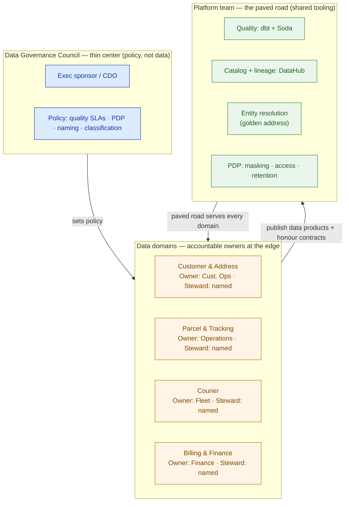

# Data Governance Framework — Kirim Cepat (worked example)

> This is `template-governance-framework.md` filled in for the running customer. It shows what "good" looks like: an operating model, in-pipeline quality, a golden address record, a catalog with lineage, contracts on the CDC sources, and PDP controls — phased so trust is earned. It attaches to the Capstone D HLD to prove the platform can be bet on.

**Customer:** Kirim Cepat (fictional)  ·  **Industry:** Last-mile logistics (Indonesia)
**Prepared by:** SA — Presales  ·  **Date:** 2026-07-05  ·  **Opportunity:** Enterprise Data Platform (Capstone D)  ·  **Version:** v0.2

**Company shape:** ~50 million parcels/month · ~10,000 couriers · ~200 hubs · ~30 siloed sources · **no single source of truth**.
**The pain (verbatim):** duplicate customer/address records, no catalog, no data owners, PDP obligations on customer data, and business teams who *can't discover or trust the data* the new platform holds.

---

## 1. Operating model — domains, owners, stewards

Four domains carry ~all the value. Each gets an accountable owner (a business leader) and a hands-on steward. The people already exist — governance names them.

| Domain | Data owner (accountable) | Steward (hands-on) | Key data products |
|---|---|---|---|
| Customer & Address | Head of Customer Ops | Cust. Ops analyst | `dim_customer`, `dim_customer_address` |
| Parcel & Tracking | Head of Operations | Ops data analyst | `fct_parcel`, `fct_tracking_event` |
| Courier | Head of Fleet | Fleet analyst | `dim_courier`, `fct_courier_shift` |
| Billing & Finance | Head of Finance | Finance analyst | `fct_invoice`, `fct_settlement` |

**Governance council (thin center):** the four owners + a Legal/PDP rep + the platform lead. It ratifies cross-cutting policy — quality SLAs, the PDP classification scheme, naming standards — and owns no data. Accountability lives at the domain edges; standards live in the center.



**Operating-model choice:** **federated as the target, centralized standards from day one.** With ~30 sources and no team that understands all of them, pure centralization is a bottleneck and pure mesh is premature. Start with central standards + a paved road; push ownership to domains as they mature.

---

## 2. Data quality — the six-dimension scorecard

The headline product to protect is the golden address. Its scorecard runs on every build; targets are proposed SLAs the Customer Ops owner ratifies.

**Data product:** `dim_customer_address` (golden record)  ·  **Owner:** Head of Customer Ops  ·  **Refresh:** near-real-time (CDC)

```
DATA-QUALITY SCORECARD — data product: dim_customer_address (golden record)
────────────────────────────────────────────────────────────────────────────
DIMENSION      CHECK (runs IN pipeline, every build)      TARGET   ACTUAL  GATE
────────────────────────────────────────────────────────────────────────────
Validity       postcode matches ID 5-digit format          ≥99%    97.3%   WARN
Completeness   kelurahan + kecamatan not null              ≥98%    99.1%   PASS
Uniqueness     one golden record per resolved address      100%   100.0%   PASS
Accuracy       geocode within hub service radius           ≥95%    95.4%   PASS
Consistency    province code == postcode's province        ≥99%    99.8%   PASS
Timeliness     CDC lag from source < contract SLA         <15 min   6 min  PASS
────────────────────────────────────────────────────────────────────────────
GATE: any BLOCKING FAIL → pipeline stops, table not published, page owner.
      WARN → publish + alert steward + open ticket (validity trending down —
             root cause: free-text postcode entry in one legacy source).
```

**Quality engines:** **dbt tests** inside the transforms already running (from 4.4) + **Soda** at ingestion to guard the CDC sources *before* dbt runs. Great Expectations held in reserve for the few products needing deep validation.

---

## 3. Master data & the golden address record

The duplicate-address pain is a master-data problem. Entity resolution collapses the variants into one golden record.

- **Master entity:** customer address  ·  **Problem today:** up to ~4 duplicate records per real-world address (spelling, postcode, RT/RW variance)
- **Blocking key:** postcode + first street token (cheap grouping)
- **Match logic:** deterministic (exact customer_id + normalized street) + probabilistic (edit distance on street, geocode proximity)
- **Survivorship rules:** most-recent update wins for volatile fields; most-complete wins for `kelurahan`/`kecamatan`; most-trusted source wins on conflict
- **Golden output:** `dim_customer_address`, uniqueness-tested at 100%, every source key mapped to the winner
- **Tooling:** Splink (probabilistic ER) on the platform, orchestrated by Airflow — a platform capability, not a steward retyping addresses

```
   RAW (30 sources, no truth)                  GOLDEN RECORD (one, trusted)
   ─────────────────────────                   ────────────────────────────
   "Jl. Sudirman No.5, Kel. Karet"   ┐
   "Jln Sudirman 5, Karet Tengsin"   ┼─ block → match → survive → ONE canonical
   "Sudirman St 5, Jakarta 10220"    ┘   (postcode+  (fuzzy+    address + all
   ...4 variants, 2 postcodes            street)     rules)     source keys mapped
```

---

## 4. Catalog & lineage

- **Catalog tool:** **DataHub** (open source) — engineering-led, strong lineage, no licence cost, streaming-native (fits Kirim Cepat)
- **Harvest from:** the lakehouse/warehouse + dbt + BI
- **Business glossary owner:** the governance council ratifies terms (e.g. "active courier", "delivered parcel") so one word means one thing

```
CATALOG CARD — dim_customer_address
──────────────────────────────────────────────────────────────────────
Business term : "Customer Address (golden record)"
Domain / Owner: Customer & Address · Owner: Cust. Ops · Steward: <name>
Classification: RESTRICTED — contains PII (PDP)
Quality       : 5/6 PASS, 1 WARN (validity) · SLA: freshness < 15 min
Description   : Deduplicated, survivorship-merged address per customer.
Access        : masked by default; raw PII needs an approved, logged purpose.

LINEAGE (upstream ──▶ this ──▶ downstream)
   cdc.customer ─┐
   cdc.address  ─┼─▶ stg_address ─▶ resolve_entity ─▶ dim_customer_address
   hub_geo ──────┘                                          │
                                              ┌─────────────┼─────────────┐
                                              ▼             ▼             ▼
                                         routing_ml    finance_bi    ops_dashboard
```

Now the data scientist finds the courier table by **search**, and when finance sees a wrong parcel count, **lineage** traces it to the source in seconds instead of a week.

---

## 5. Data contracts (on the CDC sources)

Each of the ~30 CDC sources gets a contract at the ingestion boundary. A sample of the critical ones:

| Source | Owner (producer) | Schema version | Freshness SLA | Null policy | Breaking-change rule |
|---|---|---|---|---|---|
| `cdc.customer` | Customer Ops | v2.1 | < 15 min | null(phone) < 1% | major bump + 2-week notice |
| `cdc.address` | Customer Ops | v1.4 | < 15 min | null(kecamatan) < 2% | major bump + 2-week notice |
| `cdc.parcel` | Operations | v3.0 | < 5 min | null(parcel_id) = 0 | major bump + 2-week notice |
| `cdc.courier_shift` | Fleet | v1.2 | < 30 min | null(courier_id) = 0 | major bump + 2-week notice |

```
CONTRACT  source: cdc.customer  ·  version: 2.1  ·  owner: Customer Ops
  field customer_id : string   required   pii: no    # stable key, never reused
  field phone       : string   required   pii: yes   # tokenize downstream
  field postcode    : string   optional   pii: no    # ID 5-digit format
  SLA   freshness < 15 min   ·   null_rate(phone) < 1%
  CHANGE  breaking change ⇒ new major version + 2-week notice to consumers
```

A producer renaming a column now trips a **loud, early rejection they own** — instead of silently poisoning every downstream table.

---

## 6. Privacy / PDP controls

Customer data is subject to Indonesia's PDP law. Classification drives masking, retention, and access.

| Column / field | Classification | Masking / tokenization | Retention (per purpose) | Access rule |
|---|---|---|---|---|
| `customer_id` | INTERNAL | none (surrogate key) | life of relationship | domain + analysts |
| `phone` | RESTRICTED (PII) | tokenized (join-safe) | per purpose, then delete | raw = approved + logged purpose only |
| `national_id_fragment` | RESTRICTED (PII) | masked by default | minimal, purpose-bound | raw = Legal-approved only |
| `address (golden)` | RESTRICTED (PII) | masked in analytics views | life of relationship | raw = routing/ops purpose only |
| `parcel_count` (agg) | INTERNAL | none | analytics retention | all analysts |

- **Residency:** regulated customer PII stays in an Indonesia region; all copies inventoried in the catalog by classification
- **Access model:** RBAC + row/column-level rules; raw-PII access approved by Legal/PDP rep and **logged**; purpose limitation enforced, not assumed
- **Data subject rights:** access/deletion requests served via the golden record (one place to find and erase a customer, thanks to entity resolution)
- **Audit answer:** *"Who can see PII, why, and for how long?"* → now answerable from the classification + access matrix above. Before: "we don't know."

---

## 7. Crawl-walk-run roadmap

```
CRAWL (0–3 mo)  Name the 4 owners/stewards · classify PII across all products ·
                quality checks + golden address record on the 3 worst products ·
                deploy DataHub (auto-harvest).
                → Stops the bleeding: no more unmasked PII, no more duplicate address.

WALK  (3–9 mo)  Quality SLAs on all critical products · Soda contracts on the top
                CDC sources · glossary + lineage adopted · access control enforced.
                → Platform becomes trustworthy and self-service.

RUN   (9–18 mo) Domains own their data products end-to-end · council sets policy
                only · quality + PDP fully automated and audited.
                → Federated (data mesh) operating model — earned, not imposed.
```

---

## 8. Findings & tool decisions

| # | Decision | Options weighed | Choice + why | Owner |
|---|---|---|---|---|
| 1 | Catalog | DataHub / OpenMetadata / Collibra | **DataHub** — OSS, strong lineage, no licence, engineering-led fit | Platform lead |
| 2 | Quality engine | dbt / GE / Soda | **dbt (transforms) + Soda (ingestion)**, GE in reserve | Platform lead |
| 3 | Operating model | centralized / federated | **Federated target, central standards now** — 30 sources, no all-knowing team | Council |
| 4 | MDM approach | OSS ER / commercial MDM | **Splink (OSS ER)** on-platform — golden address without a heavy MDM licence | Cust. Ops + Platform |

**One-line governance statement:**
> Kirim Cepat's data platform is made trustworthy by **4 accountable domains** under a thin central council, **six-dimension quality checks enforced in-pipeline** (dbt + Soda), a **golden customer-address record** (Splink entity resolution), a **DataHub catalog** for discovery + lineage, **data contracts on the ~30 CDC sources**, and **PDP classification/masking/retention/access** — phased crawl-walk-run so maturity is earned, not imposed.

**So what (the pivot this buys the deal):** the platform stops giving three answers to one question and stops leaking PII. Finance gets one trusted parcel count, Ops gets one real address, the data scientist finds tables by search, and Legal can answer the audit. Governance is what converts *"we built you a data platform"* into *"we built you a data platform you can bet the business on"* — and it is why Capstone D wins on trust, not just on architecture.
