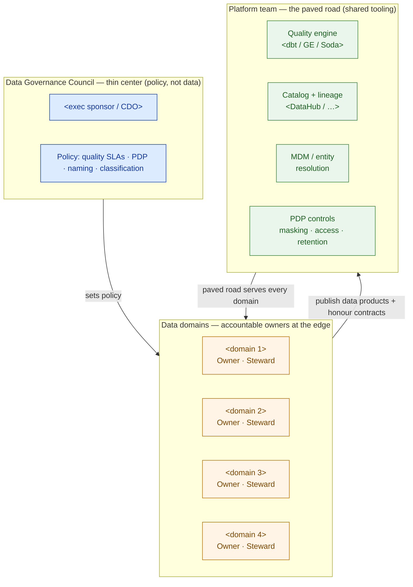

# Data Governance Framework — Template

> Fill this in to make a data platform *trustworthy and findable*, not an expensive backup. It is the governance half of a data-platform HLD: an executive should grasp the operating model; an engineer should be able to implement every control. Governance here is a set of running systems — owners, in-pipeline checks, a catalog, contracts, and PDP controls — never a policy PDF.

**Customer:** `<company>`  ·  **Industry:** `<industry>`  ·  **Prepared by:** `<SA name>`  ·  **Date:** `<YYYY-MM-DD>`
**Engagement / opportunity:** `<deal or project name>`  ·  **Platform:** `<lakehouse / warehouse ref>`  ·  **Version:** `<v0.1 draft>`

---

## How to use this template

Governance is six systems, not one. Fill the sections in order — each answers a different question — then phase the whole thing crawl-walk-run.

1. **Operating model** — who owns which domain, and where accountability vs policy vs tooling sits.
2. **Data quality** — the six-dimension scorecard, tested in the pipeline, per critical data product.
3. **Master data** — the entity-resolution + golden-record spec for the entity that hurts most.
4. **Catalog & lineage** — how data becomes findable and its origin explainable.
5. **Data contracts** — the schema/SLA seatbelt on upstream (CDC) sources.
6. **Privacy / PDP** — classification, masking, retention, residency, access control.
7. **Roadmap** — crawl → walk → run so maturity is earned, not imposed.

Legend: **Owner** = business leader accountable for a domain's data · **Steward** = hands-on custodian · **SoR** = system of record · **PII** = personal data under the applicable privacy law · **SLA** = the negotiated quality/freshness target with a gate.

---

## 1. Operating model — domains, owners, stewards

> Name the domains and the accountable people. This is a RACI, not a hire — the people exist; governance names them.

| Domain | Data owner (accountable) | Steward (hands-on) | Key data products |
|---|---|---|---|
| `<domain>` | `<role / name>` | `<role / name>` | `<tables / products>` |
| `<domain>` | `<role / name>` | `<role / name>` | `<tables / products>` |
| `<…>` | | | |

**Governance council (thin center):** `<who sits on it — the owners + legal/PDP + platform lead>` — ratifies cross-cutting policy (quality SLAs, PDP classification scheme, naming standards) **only**; owns no data.



**Operating-model choice (circle one + justify):** centralized · federated / data mesh · hybrid → `<why, given the customer's maturity>`

---

## 2. Data quality — the six-dimension scorecard

> One scorecard per critical data product. Each check runs **in the pipeline** with a target and a gate (BLOCKING fails the build; WARN publishes + alerts). Targets are proposed SLAs the owner ratifies.

**Data product:** `<name>`  ·  **Owner:** `<name>`  ·  **Refresh:** `<cadence>`

```
DATA-QUALITY SCORECARD — data product: <name>
────────────────────────────────────────────────────────────────────────────
DIMENSION      CHECK (runs IN pipeline)                    TARGET   GATE
────────────────────────────────────────────────────────────────────────────
Validity       <format/range check>                        <≥xx%>   <BLOCK/WARN>
Completeness   <required fields not null>                   <≥xx%>   <BLOCK/WARN>
Uniqueness     <no unintended duplicates>                   <100%>   <BLOCK/WARN>
Accuracy       <matches reality / reference>                <≥xx%>   <BLOCK/WARN>
Consistency    <related values agree across tables>         <≥xx%>   <BLOCK/WARN>
Timeliness     <freshness / lag under SLA>                  << Xm>   <BLOCK/WARN>
────────────────────────────────────────────────────────────────────────────
GATE: any BLOCKING FAIL → pipeline stops, table not published, page owner.
      WARN → publish + alert steward + open quality ticket.
```

**Quality engine(s):** `<dbt tests / Great Expectations / Soda — and at which layer>`

---

## 3. Master data & the golden record

> Fill in for the master entity that causes the most pain (customer, address, product…). Specify block → match → survive.

- **Master entity:** `<entity>`  ·  **Problem today:** `<e.g. N duplicate records per real-world thing>`
- **Blocking key:** `<cheap grouping key, e.g. postcode + street token>`
- **Match logic:** deterministic `<exact keys>` + probabilistic `<fuzzy: edit distance / geo proximity / …>`
- **Survivorship rules:** `<most-recent / most-complete / most-trusted source wins per field>`
- **Golden output:** `<table>` with `<uniqueness = 100%>` and all source keys mapped
- **Tooling:** `<Splink / Zingg / dbt macros / commercial MDM>`

```
   RAW (many sources, no truth)              GOLDEN RECORD (one, trusted)
   ─────────────────────────                 ────────────────────────────
   <variant 1>            ┐
   <variant 2>            ┼─ block → match → survive → ONE canonical <entity>
   <variant 3>            ┘   (fuzzy)   (rules)         + source keys mapped
```

---

## 4. Catalog & lineage

- **Catalog tool:** `<DataHub / OpenMetadata / Collibra / Alation>`  ·  **Harvest from:** `<warehouse, dbt, BI>`
- **Business glossary owner:** `<who ratifies term definitions>`
- **Must-have card fields:** owner · description · classification · quality status · freshness SLA · column-level lineage

```
CATALOG CARD — <data product>
──────────────────────────────────────────────────────────────────────
Business term : "<agreed name>"
Domain / Owner: <domain> · Owner: <name> · Steward: <name>
Classification: <PUBLIC / INTERNAL / CONFIDENTIAL / RESTRICTED (PII)>
Quality       : <x/6 PASS> · SLA: <freshness>
Access        : <default masking + how to get raw>

LINEAGE (upstream ──▶ this ──▶ downstream)
   <src a> ─┐
   <src b> ─┼─▶ <staging> ─▶ <transform> ─▶ <this product>
   <src c> ─┘                                   │
                                     ┌──────────┼──────────┐
                                     ▼          ▼          ▼
                                  <consumer> <consumer> <consumer>
```

---

## 5. Data contracts (on the upstream / CDC sources)

> One row per source. Enforced at the ingestion boundary so upstream changes fail loud and early, owned by the producer.

| Source | Owner (producer) | Schema version | Freshness SLA | Null policy | Breaking-change rule |
|---|---|---|---|---|---|
| `<source>` | `<team>` | `<vX.Y>` | `<< Xm / hourly>` | `<max null% per key field>` | `<major bump + N notice>` |
| `<…>` | | | | | |

```
CONTRACT  source: <name>  ·  version: <vX.Y>  ·  owner: <team>
  field <name> : <type>  <required/optional>  pii: <yes/no>   # <note>
  ...
  SLA   freshness < <Xm>   ·   null_rate(<field>) < <x%>
  CHANGE  breaking change ⇒ new major version + <N> notice to consumers
```

---

## 6. Privacy / PDP controls

> Classification drives everything else — you can't protect what you haven't labelled.

| Column / field | Classification | Masking / tokenization | Retention (per purpose) | Access rule |
|---|---|---|---|---|
| `<field>` | `<PUBLIC/INTERNAL/CONFIDENTIAL/RESTRICTED>` | `<none / mask / tokenize>` | `<duration + trigger to delete>` | `<role · column/row-level · logged purpose>` |
| `<…>` | | | | |

- **Residency:** `<where regulated PII must live; where copies exist>`
- **Access model:** `<RBAC / ABAC; who approves raw-PII access; is it logged?>`
- **Data subject rights:** `<how access / deletion requests are served>`
- **Audit answer:** *"Who can see PII, why, and for how long?"* → `<must be answerable from the controls above>`

---

## 7. Crawl-walk-run roadmap

```
CRAWL (<0–3 mo>)  <name owners/stewards · classify PII · quality + golden record
                   on the worst products · deploy catalog auto-harvest>
                   → <what trust this earns>

WALK  (<3–9 mo>)  <quality SLAs on all critical products · contracts on top sources
                   · glossary + lineage adopted · access control enforced>
                   → <what trust this earns>

RUN   (<9–18 mo>) <federated domains own products · council sets policy only ·
                   quality/PDP automated + audited>
                   → <target operating model, earned>
```

---

## 8. Findings & tool decisions

| # | Decision | Options weighed | Choice + why | Owner |
|---|---|---|---|---|
| 1 | Catalog | DataHub / OpenMetadata / Collibra | `<choice + rationale>` | `<name>` |
| 2 | Quality engine(s) | dbt / GE / Soda | `<choice + layer>` | `<name>` |
| 3 | Operating model | centralized / federated | `<choice + maturity fit>` | `<name>` |
| 4 | MDM approach | OSS ER / commercial MDM | `<choice>` | `<name>` |

**One-line governance statement (fill in):**
> `<Customer>`'s data platform is made trustworthy by `<N>` accountable domains, six-dimension quality checks enforced in-pipeline, a golden `<entity>` record, a `<catalog>` for discovery + lineage, data contracts on `<N>` sources, and PDP classification/masking/retention/access — phased crawl-walk-run so maturity is earned, not imposed.

---

*Worked example: see `example-kirim-cepat-governance-framework.md` in this folder.*
