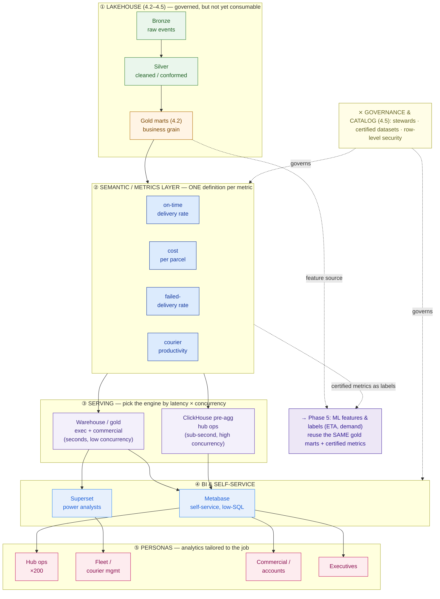

# Analytics & BI Enablement

> A data platform nobody trusts to answer "what's our on-time rate?" is just an expensive hard drive. The last mile of a data platform is the human who asks it a question.

**Type:** Design
**Track:** AI, Data & Infrastructure Solution Architect (Presales)
**Prerequisites:** 4.5 Data Governance, Quality & Catalog
**Time:** ~5h
**Lab:** —
**Ship It:** BI enablement plan

## The Problem

You've spent four lessons building Kirim Cepat a proper data platform. Streaming and CDC (4.3) land parcel events within seconds. Orchestration (4.4) runs the transforms on schedule. The medallion layers from 4.2 are clean — bronze raw, silver conformed, a **gold layer** of business-grade marts. Governance, quality, and a catalog (4.5) put a steward's name on every table. On paper, Capstone D is done. Then the VP of Operations opens the platform to ask the one question that justified the whole spend — *"what was our on-time delivery rate last week?"* — and three things happen, all of them bad.

First, she can't ask it herself; there's no way in except a SQL prompt, and she doesn't write SQL. So she emails the central analytics team, and the request joins a two-week backlog behind forty other reports. Second, when the number finally comes back, it's *91%* — but the commercial team's client deck said *87%* that same week, and the board slide said *94%*. Same company, same week, one parcel stream, three different "on-time rates." Nobody is lying: ops measures "delivered within the promised SLA window," commercial measures "delivered next-day or better," and the exec deck quietly counts "delivered without a failed attempt." Three teams, three formulas, three numbers, and a CEO who now trusts none of them. Third — the part that kills the deal in renewal — the ops team *did* build a live hub dashboard, but it queries the raw event tables directly, so at 6 p.m. across 200 hubs it takes forty seconds to load and everyone gave up on it.

This is the failure mode of an SA who designs a pristine platform and forgets that a platform's value is only realized at the **consumption layer**. The rookie mistakes cluster: no **semantic/metrics layer**, so every team re-derives every metric and "on-time delivery" fractures into three definitions (metric chaos); a central team acting as a **report ticket-queue** instead of enabling governed self-service; **dashboard sprawl** where 200 hubs each hand-roll a slightly different board; and **slow dashboards** pointed at raw data because nobody designed a serving path. Your job in this lesson is not to build 200 dashboards — that's the trap. It's to design the *consumption layer* (one governed definition per metric, the right tool, a fast serving path), design the *enablement* (roles, certified datasets, literacy — not a queue), and **defend** those choices to a cost-conscious customer. Do that and the platform finally earns its keep — and the same gold marts and certified metrics become the runway to the ML use cases in Phase 5.

## The Concept

Everything upstream of this lesson produced *governed data*. This lesson turns governed data into *governed answers*. That happens in the **consumption layer** — the top of the stack, where four concerns stack in order. Get the order wrong (most teams start by arguing about the dashboard tool) and you rebuild it in a year. Get it right and self-service scales without chaos.

Before the stack, name the enemy. Every failure in The Problem is one of four consumption-layer mistakes, and each has a specific fix that this lesson designs. Keep this table on the wall during discovery — it converts a vague "our reporting is bad" into four scoped work items:

| The mistake | What it looks like at the customer | The fix (what the SA designs) |
|---|---|---|
| **No semantic/metrics layer** | One metric, several definitions; teams argue in meetings about whose number is right | A metrics layer holding **one governed definition** per metric, as code |
| **Report ticket-queue** | Every new report is a request to one central team; multi-week backlog | **Governed self-service**: central team owns certified data, business builds on top |
| **Dashboard sprawl** | 200 sites each hand-build a slightly different board; nobody maintains them | **One parameterized template per persona**, filtered per site/account |
| **Slow dashboards on raw data** | Interactive board queries billions of raw event rows; loads in tens of seconds | **Pre-aggregation** + a serving engine chosen by *latency × concurrency* |

Now the stack that delivers all four fixes:



### The semantic / metrics layer — the fix for metric chaos

The single most important box in that diagram is the one most platforms skip: the **semantic layer** (also called a *metrics layer*). It sits between the gold marts and every tool that reads them, and it holds **one governed definition of each business metric** — the formula, the grain, the filters, the time basis, and the steward who owns it. Define "on-time delivery rate" *once*, here, and every dashboard, every ad-hoc query, and every ML feature that references it gets the identical number. Delete the semantic layer and each of those consumers re-implements the metric in its own SQL, and you are back to 91% vs 87% vs 94%.

This is *metrics-as-code*: the definition lives in version control (dbt Semantic Layer / MetricFlow, Cube, or LookML), it's reviewed like code, and it inherits the stewardship and certification you built in 4.5. The semantic layer is where governance stops being a wiki page and becomes an enforced contract. Here is what "one definition each" looks like for Kirim Cepat's four core metrics — the artifact that ends the arguments:

```
METRIC                 THE ONE DEFINITION (grain · numerator / denominator · time basis · filters)     STEWARD
──────────────────────────────────────────────────────────────────────────────────────────────────────────────
On-time delivery rate  grain: parcel · delivered_at <= promised_at  /  parcels with a delivery outcome   Ops
  (OTDR)               time basis: delivery date · excludes customer-cancelled & weather-force-majeure
Cost per parcel        grain: parcel · last-mile cost (courier pay + fuel allowance + redelivery)         Finance
  (CPP)                          / delivered parcels · time basis: delivery date
Failed-delivery rate   grain: attempt · parcels with >=1 failed attempt / parcels attempted               Ops
  (FDR)                 note: measured on attempts, NOT on all created parcels (a common trap)
Courier productivity   grain: courier-shift · delivered parcels / active courier-shifts                   Fleet
                        "active" = a courier who logged >=1 scan that day
```

### Serving: match the engine to latency × concurrency

A governed number nobody can load is as useless as a wrong one. Serving is a sizing decision, not a tooling preference. Kirim Cepat moves ~50 million parcels/month — roughly **1.6 million a day** — and each parcel emits several scan events (pickup, line-haul, out-for-delivery, attempt, delivery), so the raw event tables hold **hundreds of millions of rows a month**. An interactive dashboard must never scan that. Two moves fix it: (1) **pre-aggregate** in the gold layer to the grain the dashboard actually shows (hub-day, courier-day, client-week), so a query touches thousands of rows, not hundreds of millions; and (2) route the *hot, high-concurrency* boards — 200 hubs all refreshing at the evening peak — to a serving engine built for it (**ClickHouse**), while the *low-concurrency, latency-tolerant* boards (exec, commercial) read the warehouse/gold directly. The rule of thumb: **latency × concurrency picks the engine.** Sub-second and hundreds-concurrent → a columnar serving store; seconds and tens-concurrent → the warehouse is fine and cheaper to run.

Separate two things customers conflate: **query latency** (how fast a board loads) and **data freshness** (how recent the numbers are). The streaming and CDC pipeline from 4.3 lands events in seconds, but a dashboard is only as fresh as the *slowest transform between the event and the board*. A `hub_day` mart refreshed every 15 minutes gives a sub-second board on data that's up to 15 minutes old — which is right for hub ops, and cheaper than recomputing continuously. Decide freshness per persona: an exec KPI can be daily; a hub scorecard wants intraday; a live courier-tracking view (if one exists) is a genuine streaming case, not a BI dashboard. Promising "real-time dashboards" without saying which of the two you mean is how a consumption layer over-runs its budget.

### Governed self-service, not a ticket queue

The central-team backlog is not a staffing problem you solve by hiring analysts — it's an *architecture* problem you solve by **enablement**. The model: a small central team owns the **certified datasets** (the gold marts and semantic metrics, badged so users know what's trustworthy), and the business builds its own dashboards and explorations *on top of those certified building blocks*, inside guardrails (row-level security so a client sees only their own parcels; query cost limits; a sandbox for un-certified ad-hoc SQL). Add **data literacy** — onboarding, a metrics glossary wired to the 4.5 catalog, office hours instead of tickets — and self-service scales without the chaos, because everyone is standing on the same certified definitions. The shift is in *who* answers the question:

```
BEFORE — ticket queue (central team is the bottleneck)
   business user ──"can I get on-time rate by hub?"──▶ [central team backlog] ──~2 weeks──▶ report
                                                              ▲
                                                       one team, N teams waiting

AFTER — governed self-service (central team curates, business self-serves)
   central team ──curates──▶ [certified datasets + one-definition metrics]
                                          │  (badged, RLS, guardrails)
   business user ──self-serves in minutes─┘──▶ own dashboard on trusted building blocks
```

The central team's job flips from *producing every report* to *producing the certified building blocks everyone else reports on* — the only version of "self-service" that doesn't reintroduce chaos.

### Tailor to the persona — one scorecard template, not 200 dashboards

Different people need different answers, and an architect designs the *map*, not every pin on it. The anti-sprawl move is to design **one parameterized template per persona** (a hub scorecard that any of the 200 hubs opens filtered to itself) rather than approving 200 near-identical boards. Persona-first design is also what keeps the exec's single-pane KPI from drowning in the hub-ops firehose:

```
PERSONA          THE QUESTION THEY ASK             DASHBOARD (one template)    SERVED FROM      LATENCY
─────────────────────────────────────────────────────────────────────────────────────────────────────────
Hub ops (×200)   "How is MY hub doing right now?"  Hub scorecard (parameterized) ClickHouse       sub-second
Fleet / courier  "Which couriers & routes lag?"    Courier productivity + cost   Warehouse + SQL  seconds
Commercial       "Is client X hitting its SLA?"    Client SLA (per-account, RLS) ClickHouse/Cube  sub-second
Executive        "Is the network healthy overall?" 1-page network KPI (certified) Warehouse       seconds
```

### The BI-to-AI runway

Here's why this lesson closes Phase 4 and opens Phase 5: the assets you build for BI are the *same* assets ML needs. The gold marts become the feature source for an ETA model; the certified **on-time-delivery** metric becomes the label you train and evaluate that model against; the semantic layer's one-definition guarantee is what stops "the ML team's OTDR" from disagreeing with "the dashboard's OTDR." Good BI enablement is not a detour from AI — it *is* the on-ramp.

## Design It

Let's produce the deliverable: a **BI Enablement Plan** for Kirim Cepat. Work the consumption layer top-down, and remember the altitude — you're designing the layer and the enablement, not hand-building dashboards.

### Step 1 — Define the metrics once (the semantic layer)

Start where the chaos is. Sit the ops, commercial, finance, and fleet leads in one room and force *one* definition per metric, then encode it as metrics-as-code. For Kirim Cepat, the four core metrics resolve as in the table above, but the *design decisions* are what matter:

- **On-time delivery rate** is measured on `promised_at`, not a fixed next-day bar — because Kirim Cepat sells tiered SLAs, and "next-day" would mislabel an express parcel. Time basis is **delivery date**, so a parcel counts in the week it was delivered, not created (this alone reconciles two of the three warring numbers).
- **Failed-delivery rate** is measured on **attempts**, not on all created parcels — otherwise same-day-created parcels not yet attempted deflate the rate. This is the trap the exec deck fell into.
- Each metric gets a **steward** (reusing 4.5's governance roles) and a **certified** badge. The steward, not the dashboard author, owns the formula.

Encode these in **dbt Semantic Layer (MetricFlow)** — Kirim Cepat already runs dbt for the gold transforms in 4.4, so the metrics live in the same git repo, get code-reviewed, and version alongside the marts. One definition, one place, one owner. "Metrics-as-code" is not a slogan; it's a file that looks like this — the on-time-delivery argument, settled, in version control:

```yaml
# metrics/on_time_delivery.yml  (illustrative — dbt Semantic Layer style)
metric:
  name: on_time_delivery_rate
  label: "On-Time Delivery Rate (OTDR)"
  owner: ops_team           # steward from 4.5 governance
  type: ratio
  numerator:   { measure: parcels_on_time }    # delivered_at <= promised_at
  denominator: { measure: parcels_with_outcome }
  time_basis: delivery_date # NOT creation date — this line ended two of three arguments
  filters:
    - "outcome != 'customer_cancelled'"
    - "not force_majeure"
  certified: true           # badged in the BI tool; ad-hoc SQL cannot override it
```

Every dashboard, every ad-hoc query, and every Phase 5 model that asks for `on_time_delivery_rate` now gets *this* — not a hand-rolled reinterpretation.

### Step 2 — Choose the BI tool (cost + mixed skill decide it)

Now — and only now — pick the tool. Kirim Cepat is cost-conscious and its users span from a hub supervisor who has never written SQL to a commercial analyst who lives in it. Per-seat commercial licensing (Power BI, Tableau, Looker) across hub staff and thousands of couriers would dominate the platform's whole budget. So:

- **Metabase (open-source, self-hosted)** as the primary self-service surface — its ask-a-question UI lets low-SQL users explore certified datasets without writing a query. No per-seat cost.
- **Apache Superset (open-source)** for the ~dozen power analysts who want SQL Lab and richer visualizations.

Both read the *same* dbt-certified metrics, so tool choice never re-opens the definition question. If Kirim Cepat were a Microsoft shop, Power BI's semantic model would be worth reconsidering — but the estate here is open and price-sensitive, so open BI wins on both axes.

### Step 3 — Design the serving path (pre-aggregate; split hot from cold)

Apply *latency × concurrency*. Build **pre-aggregated gold marts** at dashboard grain — `hub_day`, `courier_day`, `client_week` — refreshed by the 4.4 orchestrator. Then split serving:

- **Hub-ops boards** (200 hubs, sub-second, high evening concurrency) → serve from **ClickHouse**, loaded from the pre-aggregated marts. This is the board that used to take 40 seconds on raw events; on a pre-aggregated `hub_day` table in ClickHouse it's sub-second.
- **Exec + commercial boards** (tens of users, seconds acceptable) → read the **warehouse/gold** directly. No need for a second engine there; keep it cheap.

Draw the line explicitly in the plan so nobody later points a 200-hub board at raw silver "to save a table."

### Step 4 — Stand up governed self-service + literacy (kill the queue)

Design the operating model, not just the tech:

- **Roles:** *analytics engineers* own certified datasets + semantic models; *metric stewards* (from 4.5) own definitions; *business explorers* build their own dashboards on certified data; *viewers* consume.
- **Certified datasets:** gold marts and semantic metrics carry a certified badge in Metabase; ad-hoc SQL runs in a clearly-labelled sandbox that is *not* certified.
- **Guardrails:** **row-level security** so a commercial account manager (and any client-facing embed) sees only their own parcels; per-query cost/row limits; PII columns masked per 4.5 policy.
- **Literacy:** a two-hour onboarding, a metrics glossary generated from the semantic layer and linked to the 4.5 catalog, and weekly office hours *replacing* the ticket queue.

### Step 5 — Map personas to dashboards (design the template, not 200 copies)

Deliver **one parameterized template per persona** (see the persona map above): a single hub scorecard filtered by hub, a courier-productivity board, a per-account client-SLA board with RLS, and a one-page exec KPI built entirely on certified metrics. Any hub, any account manager self-serves from *their* copy of the template. That is how you serve 200 hubs without building — or maintaining — 200 dashboards.

### Step 6 — Note the Phase 5 handoff

Close the plan with the runway: the `courier_day`/`hub_day`/`client_week` marts are the feature source for Phase 5's ETA and demand-forecast models; the certified OTDR metric is the label; the semantic layer keeps BI and ML numerically consistent. Capstone D ends here; Phase 5 picks up these exact assets.

## Compare It

Three decisions carry this lesson. Here's how the real options map to a cost-conscious, mixed-skill, open-leaning customer like Kirim Cepat.

**BI / dashboard tools** — the question customers ask first, though it should be last:

| Tool | License model | Self-service for low-SQL | Power-analyst depth | Fit for Kirim Cepat |
|---|---|---|---|---|
| **Metabase** | Open-source (self-host) or paid cloud | **Excellent** — ask-a-question UI | Moderate | **Primary** — cost + low-SQL self-service |
| **Apache Superset** | Open-source (Apache) | Moderate | **High** — SQL Lab, rich viz | **Secondary** — power analysts |
| **Power BI** | Per-user / Premium capacity | Good (with modeling) | High (DAX) | Only if Microsoft-anchored; per-seat cost bites at scale |
| **Looker** | Premium (Google) | Good | High (governed via LookML) | Strong semantic layer, but premium price |
| **Tableau** | Per-seat (Salesforce) | Good | **Best-in-class viz** | Excellent tool, hard to justify per-seat at courier/hub scale |

**Semantic / metrics layer** — where the one definition actually lives:

| Option | Where metrics live | Strength | Watch out |
|---|---|---|---|
| **dbt Semantic Layer (MetricFlow)** | Metrics-as-code in the dbt project you already run | Git-versioned, one definition, reuses 4.5 stewardship | Tool-side query support still maturing |
| **Cube** | Standalone headless semantic API with caching + pre-agg | High-concurrency, great for **embedded** & client-facing | Another service to run |
| **LookML** | Inside Looker's modeling layer | Powerful, mature governed model | Locks the definition to Looker |

For Kirim Cepat: **dbt Semantic Layer** as the definition store (it's already in the stack), with **Cube in front of ClickHouse** where sub-second high-concurrency embedding is needed (hub ops, client-facing commercial boards).

**Delivery model** — central vs self-service vs embedded:

| Model | How reports get made | Cost / skill fit |
|---|---|---|
| **Central BI (ticket queue)** | Every report is a request to one team | Safe but a bottleneck — this is the pain we're removing |
| **Governed self-service** | Central team owns certified data; business builds on top within guardrails | **The target** — scales without chaos |
| **Embedded analytics** | Dashboards inside the hub/courier app or client portal | For operational + customer-facing surfaces (RLS mandatory) |

**Embedded / client-facing analytics is a distinct surface — and often an upsell.** The commercial persona's client-SLA board isn't just internal: last-mile clients want to see *their own* on-time rate, so the same certified metric can power a client-facing portal. That changes two requirements — **row-level security becomes mandatory** (a client must never see another client's parcels), and concurrency spikes (every client, not every internal user). This is exactly where Cube over ClickHouse earns its place, and where a purely internal per-seat tool doesn't fit at all. Flag it in discovery: a governed metric you already own, re-served through an embedded portal, is a differentiator the customer can sell — the same data asset paying off twice.

The **"it depends" a customer will push on:** *"Which BI tool should we buy?"* The honest architect answer is that the tool is the *least* consequential choice — swappable in a quarter — while the semantic layer is the one that, if skipped, costs you a year and your credibility. Sequence the decision: define metrics first, choose serving second, pick the tool last. If you're forced to defend the open stack on price, the line is simple — *at hub-and-courier headcount, per-seat BI licensing would exceed the cost of the entire lakehouse; open BI keeps internal seats free and puts the money where the latency actually needs it.*

And the objection that follows every open-source recommendation — *"who supports it?"* Answer it head-on: Metabase, Superset, ClickHouse, dbt, and Cube all ship **commercial-backed editions or paid cloud** you can buy support from without changing the architecture, and all have large hiring pools — so "open" here means *no per-seat tax and no lock-in*, not *unsupported*. That reframes open-source from a risk into a cost-and-flexibility win, which is precisely what a cost-conscious buyer needs to hear to sign off.

## Ship It

This lesson ships a reusable **BI Enablement Plan** — the deliverable that turns "we built a platform" into "the business self-serves trusted answers," and the artifact that formally closes Capstone D. Both files live in [`outputs/`](../outputs/):

- **[`template-bi-enablement-plan.md`](../outputs/template-bi-enablement-plan.md)** — a fill-in-the-blank plan: a metrics-definition table (one definition + steward per metric), a BI-tool decision table, a serving/performance plan (engine by latency × concurrency), a governed-self-service + literacy model, a persona→dashboard map, and a Mermaid consumption-stack skeleton with an ASCII fallback. A colleague can run a BI-enablement workshop straight from it.
- **[`example-kirim-cepat-bi-enablement.md`](../outputs/example-kirim-cepat-bi-enablement.md)** — the template fully worked for Kirim Cepat, so the skeleton isn't abstract: four certified metrics, Metabase + Superset over dbt Semantic Layer, ClickHouse for the 200 hub boards, the self-service operating model, and the Phase 5 ML handoff spelled out.

The point of shipping this: a data platform is judged at the moment a non-technical VP asks it a question and either trusts the answer or doesn't. This plan is what makes that answer trustworthy, fast, and self-served — and it hands Phase 5 a clean runway.

## Exercises

1. **(Easy)** Kirim Cepat's three teams report on-time-delivery rate three ways (SLA-window, next-day, no-failed-attempt). Pick **one** definition, write it out as a semantic-layer entry (grain, numerator/denominator, time basis, filters, steward), and in two sentences explain why the *other two* were producing different numbers off the same parcel stream.

2. **(Medium)** Re-do the persona→dashboard map for a **different** customer: a national **retail pharmacy chain** with ~800 stores. List four personas (hint: store manager, pharmacist/clinical, category/merchandising, exec), the one question each asks, the dashboard template, and — applying *latency × concurrency* — which serving engine each should read from and why.

3. **(Hard)** Extend the Kirim Cepat plan into the **BI-to-AI handoff** for Phase 5. Name two ML use cases (ETA prediction, demand forecasting), and for each state: which gold mart is the feature source, which certified metric is the label or evaluation target, and one concrete risk that the *absence* of a semantic layer would create for the model. Save it alongside your worked example; you'll reuse this reasoning at the start of Phase 5.

## Key Terms

| Term | What people say | What it actually means |
|------|-----------------|------------------------|
| Consumption layer | "The dashboards" | The top of the platform where governed *data* becomes governed *answers* — semantic layer, serving, BI, and the enablement around them. Where a platform's value is finally realized. |
| Semantic / metrics layer | "The BI tool's data model" | A tool-independent store of **one governed definition per metric** (formula, grain, filters, steward), as versioned code. The single fix for metric chaos; every consumer reads the same number. |
| Metric chaos | "Reporting discrepancies" | The state where each team re-derives each metric in its own SQL, so one metric ("on-time delivery") has several conflicting definitions and numbers. What the semantic layer prevents. |
| Certified dataset | "An approved report" | A gold mart or semantic model badged as trustworthy so self-service users know what to build on. The building block of governed self-service. |
| Governed self-service | "Letting people make their own charts" | Central team owns certified data + metrics; the business builds on top *within guardrails* (RLS, cost limits). Kills the ticket queue without losing control. |
| Pre-aggregation | "Making it faster" | Rolling raw events up to the grain a dashboard shows (hub-day, client-week) so an interactive query scans thousands of rows, not hundreds of millions. The first move for dashboard performance. |
| Serving engine | "The database behind BI" | The store a dashboard actually queries. Chosen by *latency × concurrency*: sub-second + high-concurrency → a columnar store like ClickHouse; seconds + low-concurrency → the warehouse. |
| Row-level security (RLS) | "Permissions" | A rule that filters *rows* by who's asking, so a client (or account manager) sees only their own parcels in the same shared dashboard. Mandatory for embedded/customer-facing BI. |

## Further Reading

- [dbt Semantic Layer & MetricFlow](https://docs.getdbt.com/docs/build/about-metricflow) — the metrics-as-code approach this lesson recommends; one governed definition, versioned alongside your transforms.
- [Cube — the headless semantic layer](https://cube.dev/docs/product/introduction) — a semantic API with caching and pre-aggregation, the right front-end for high-concurrency and embedded analytics.
- [Metabase documentation](https://www.metabase.com/docs/latest/) and [Apache Superset](https://superset.apache.org/docs/intro) — the two open-source BI tools that fit a cost-conscious, mixed-skill customer; skim the self-service and SQL-Lab models.
- [ClickHouse: why it's fast](https://clickhouse.com/docs/en/concepts/why-clickhouse-is-so-fast) — the columnar serving store for sub-second, high-concurrency operational dashboards over pre-aggregated marts.
- [Airbnb: "How Airbnb Achieved Metric Consistency at Scale" (Minerva)](https://medium.com/airbnb-engineering/how-airbnb-standardized-metric-computation-at-scale-f5507b8b57f4) — the canonical war story on metric chaos and why a central metrics layer became non-negotiable.
- [Google Looker — the semantics of LookML](https://cloud.google.com/looker/docs/what-is-lookml) — read one page to recognize the commercial governed-semantic-layer model when a customer already owns it.
