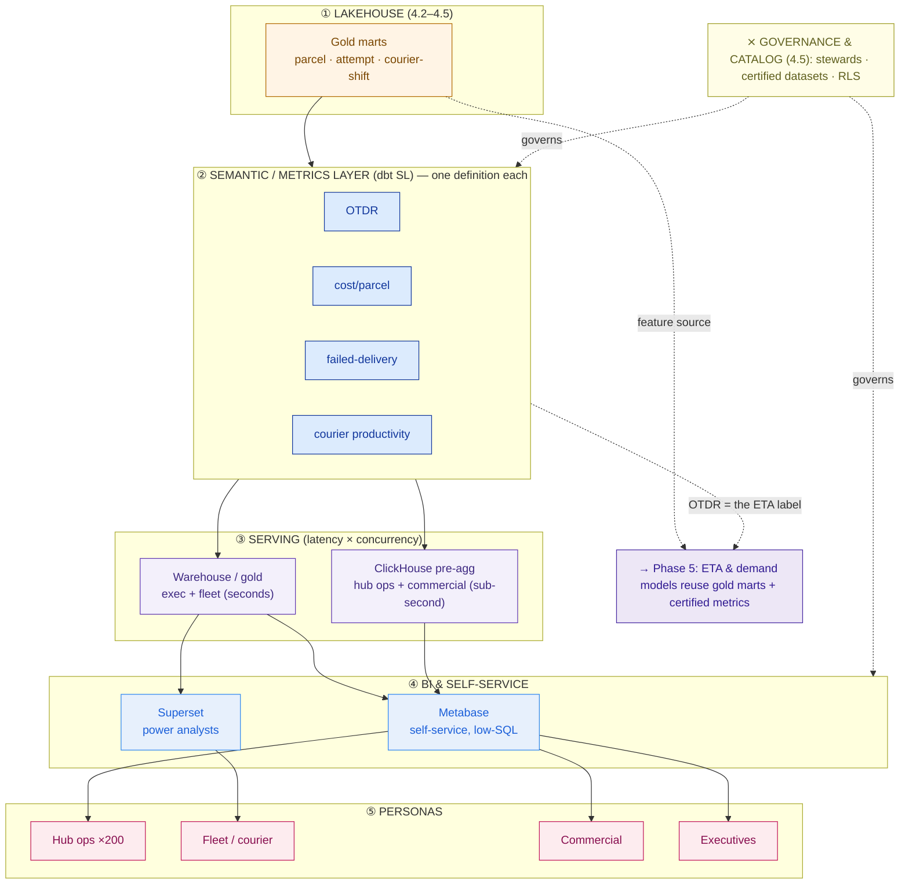

# BI Enablement Plan — Kirim Cepat (worked example)

> This is `template-bi-enablement-plan.md` filled in for a fictional customer. It shows what "good" looks like: four metrics defined once, an open BI stack chosen on cost + skill, a serving path that survives 200 hubs at peak, governed self-service that kills the ticket queue, and a clean ML runway into Phase 5.

**Customer:** Kirim Cepat (fictional)  ·  **Industry:** Last-mile logistics (Indonesia)
**Prepared by:** SA — Presales  ·  **Date:** 2026-07-05  ·  **Opportunity:** "Enterprise Data Platform" (Capstone D) — consumption layer  ·  **Version:** v0.2

**Company shape:** ~50 million parcels/month · ~10,000 couriers · ~200 hubs · teams: ops, fleet, commercial, exec.
**The ask (verbatim):** *"Our teams can't self-serve — reports are a day old and nobody agrees on the numbers. We want self-service BI, and a runway to ML for ETA and demand."*

---

## 1. Objective & current-state pain

- **What "done" looks like:** ops, fleet, commercial, and exec self-serve *trusted* metrics without filing a ticket; one number per metric, network-wide.
- **Can teams self-serve today?** No. Every report is a request to a small central team; the backlog runs ~2 weeks, and even then reports are day-old batch extracts.
- **Metric chaos check:** "on-time delivery rate" has **three** live definitions — ops uses *delivered within the promised SLA window*, commercial uses *delivered next-day or better*, the board deck uses *delivered without a failed attempt*. Same parcel stream, three numbers, zero trust.
- **Performance pain:** the ops team's live hub board queries the raw scan-event tables directly; across ~200 hubs at the evening peak it takes ~40 seconds to load, so it's abandoned.
- **Upstream assets available:** gold marts from 4.2 (parcel, attempt, courier-shift facts) ✅ · governance + catalog + stewards from 4.5 ✅.

## 2. Semantic / metrics layer (ONE definition per metric)

| Metric | Grain | Numerator / Denominator | Time basis | Filters / edge cases | Steward | Certified? |
|---|---|---|---|---|---|---|
| **On-time delivery rate (OTDR)** | parcel | `delivered_at <= promised_at` / parcels with a delivery outcome | delivery date | exclude customer-cancelled & declared force-majeure; measured vs the *promised* SLA, not a fixed next-day bar | Ops | **Y** |
| **Cost per parcel (CPP)** | parcel | last-mile cost (courier pay + fuel allowance + redelivery cost) / delivered parcels | delivery date | redelivery cost attributed to the parcel, not the attempt | Finance | **Y** |
| **Failed-delivery rate (FDR)** | attempt | parcels with ≥1 failed attempt / parcels **attempted** | attempt date | measured on attempts, NOT on all created parcels (the exec-deck trap) | Ops | **Y** |
| **Courier productivity** | courier-shift | delivered parcels / active courier-shifts | shift date | "active" = a courier who logged ≥1 scan that day | Fleet | **Y** |

**Where the definitions live (metrics-as-code):** **dbt Semantic Layer (MetricFlow)** — Kirim Cepat already runs dbt for the gold transforms (4.4), so metrics sit in the same git repo, get code-reviewed, and version with the marts. One definition, one place, one owner.

**Findings:** OTDR's three definitions are the root of the "nobody agrees" pain; fixing the *time basis* (delivery date, not creation date) and the *bar* (promised SLA, not next-day) reconciles two of the three warring numbers immediately. FDR must be measured on attempts — the board deck deflated it by dividing by all created parcels.

## 3. BI tool choice (decide by cost + skill mix)

| Candidate | License model | Self-service for low-SQL users | Power-analyst depth | Verdict for Kirim Cepat |
|---|---|---|---|---|
| **Metabase (open)** | Self-hosted | **Excellent** — ask-a-question UI | Moderate | **Primary** — low-SQL hub/commercial self-service, no per-seat cost |
| **Superset (open)** | Apache | Moderate | **High** — SQL Lab, rich viz | **Secondary** — the ~dozen power analysts |
| Power BI | Per-user / capacity | Good | High | No — not Microsoft-anchored; per-seat cost bites at hub scale |
| Looker / Tableau | Premium / per-seat | Good | High / best-viz | No — per-seat can't be justified across hub staff + couriers |

**Chosen stack:** **Metabase (primary self-service) + Superset (power analysts)**, both reading the *same* dbt-certified metrics. **Rationale:** cost-conscious customer + users spanning no-SQL hub supervisors to SQL-fluent analysts; open-source self-hosted keeps internal seats free at a headcount where per-seat licensing would rival the cost of the whole lakehouse.

## 4. Serving & performance (latency × concurrency)

**Sizing sanity check:** ~50M parcels/month ≈ **~1.6M/day**; each parcel emits several scan events (pickup, line-haul, out-for-delivery, attempt, delivery), so raw event tables hold **hundreds of millions of rows/month**. An interactive board must never scan that — pre-aggregate.

**Pre-aggregated marts to build (in gold, refreshed by the 4.4 orchestrator):**
```
hub_day      — powers the 200 hub scorecards (OTDR, FDR, inbound/outbound, roster)
courier_day  — powers courier productivity & cost boards
client_week  — powers per-account commercial SLA boards
```

| Board group | Users / concurrency | Latency need | Serving engine | Why |
|---|---|---|---|---|
| Hub-ops scorecards | ~200 hubs, high at evening peak | **sub-second** | **ClickHouse** (loaded from `hub_day`) | high-concurrency, pre-aggregated; the old 40-second board becomes sub-second |
| Commercial client-SLA | tens, but client-facing embed | sub-second | **ClickHouse / Cube** (RLS) | concurrency + embedding; Cube caches the API |
| Exec + fleet | tens, internal | seconds OK | **Warehouse / gold** | latency-tolerant; no second engine needed — keep it cheap |

**Rule stated for the record:** a 200-hub board must not query raw/silver "to save a table"; it reads `hub_day` in ClickHouse. Full stop.

## 5. Governed self-service & literacy (kill the ticket queue)

**Roles:**

| Role | Owns | Can do |
|---|---|---|
| Analytics engineer (central, small) | Certified gold marts + semantic models | Build/curate marts & metrics |
| Metric steward (4.5: Ops/Finance/Fleet leads) | The metric definitions | Approve/change a definition |
| Business explorer (ops/commercial analysts) | Own dashboards on certified data | Self-serve within guardrails |
| Viewer (hub staff, execs) | — | Consume certified boards |

**Certified-dataset policy:** the four semantic metrics + the `hub_day`/`courier_day`/`client_week` marts are **certified** (green badge in Metabase). Ad-hoc SQL runs in a labelled sandbox that is explicitly **not** certified — explorers can experiment, but only certified assets carry the trust badge.

**Guardrails:**
- **Row-level security:** commercial account managers and any client-facing embed see only their own clients' parcels.
- **Query cost/row limits:** caps on sandbox queries to protect the serving engines at peak.
- **PII masking:** recipient contact fields masked per the 4.5 policy.

**Data literacy program (replaces the queue):**
- 2-hour onboarding on certified datasets + how to read the four metrics.
- Metrics glossary generated from the dbt Semantic Layer and linked to the 4.5 catalog — one click from a chart to "what this metric means and who owns it."
- Weekly analytics office hours *replacing* the report ticket queue.

## 6. Persona → dashboard map (one template per persona)

```
PERSONA            THE QUESTION THEY ASK                DASHBOARD (one template)        SERVED FROM      LATENCY
──────────────────────────────────────────────────────────────────────────────────────────────────────────────
Hub ops (×200)     "How is MY hub doing right now?"     Hub scorecard (param: hub_id)   ClickHouse       sub-second
Fleet / courier    "Which couriers & routes lag?"       Courier productivity + CPP      Warehouse + SQL  seconds
Commercial (accts) "Is client X hitting its SLA?"       Client SLA (param: client, RLS) ClickHouse/Cube  sub-second
Executive          "Is the network healthy overall?"    1-page network KPI (certified)  Warehouse        seconds
```

Note the altitude: this is **four parameterized templates**, not 200+ dashboards. Any of the 200 hubs opens the *same* scorecard filtered to itself; any account manager opens the *same* client-SLA board filtered (via RLS) to their accounts. That is how the platform serves everyone without a maintenance nightmare.

## 7. The consumption stack



### ASCII fallback

```
   GOVERNANCE & CATALOG (4.5)  stewards · certified datasets · RLS  ──── spans the layer
   ─────────────────────────────────────────────────────────────────────────────────────
 ① LAKEHOUSE     Bronze ─▶ Silver ─▶ GOLD (parcel · attempt · courier-shift marts)
 ② SEMANTIC (dbt SL)   OTDR · cost/parcel · failed-delivery · courier productivity
 ③ SERVING       Warehouse/gold (exec, fleet)    |    ClickHouse pre-agg (hub ops, commercial)
 ④ BI            Metabase (self-service)  ·  Superset (power analysts)
 ⑤ PERSONAS      Hub ops ×200    Fleet/courier    Commercial    Executives
   ───────────────────────────────────────────────────────────────────────────────────────
   → Phase 5 (ML):  gold marts = features   ·   OTDR = ETA label / eval target
```

## 8. Phase 5 / ML runway

- **Feature source:** `hub_day`, `courier_day`, and route-level gold marts feed feature engineering for the **ETA** and **demand-forecast** models.
- **Labels / eval targets:** the certified **OTDR** metric is the evaluation target for the ETA model (does a predicted ETA improve on-time delivery?); historical `hub_day` volume is the demand-forecast label.
- **Consistency guarantee:** because the ETA model trains and is evaluated against the *same* semantic-layer OTDR the dashboards show, "the model's on-time rate" and "the board's on-time rate" can never diverge — the metric chaos that started this lesson can't reappear inside ML.

## 9. Rollout phasing & findings

| # | Finding / decision | Layer | Implication | Severity |
|---|---|---|---|---|
| 1 | Three live definitions of on-time delivery | Semantic | Pick the promised-SLA/delivery-date definition, encode in dbt SL, assign Ops as steward | **High** |
| 2 | Hub board scans raw events (~40s at peak) | Serving | Pre-aggregate to `hub_day`; serve from ClickHouse → sub-second | **High** |
| 3 | Central team is a 2-week report ticket-queue | Enablement | Certified datasets + governed self-service + office hours replace the queue | **High** |
| 4 | FDR deflated by dividing by all created parcels | Semantic | Redefine FDR on the attempt grain | Medium |
| 5 | Client-facing commercial boards need isolation | Governance | Row-level security + Cube/ClickHouse for embedded SLA boards | Medium |

**Rollout phases:**
1. **Foundation:** encode the four metrics in dbt Semantic Layer; certify the gold marts; ship the exec 1-page KPI on the warehouse. (Ends the "nobody agrees" problem first.)
2. **Serving + self-service:** stand up ClickHouse over `hub_day`; ship the parameterized hub scorecard; roll out Metabase self-service + the literacy program.
3. **Embedded + handoff:** client-facing commercial SLA boards with RLS; onboard power analysts to Superset; hand the gold marts + certified OTDR to Phase 5 as the ML runway.

**One-line closing statement:**
> The Kirim Cepat consumption layer delivers **four certified metrics** through **Metabase + Superset** over **dbt Semantic Layer**, with **ClickHouse** serving the 200 hub scorecards sub-second and the warehouse serving exec/commercial; it replaces a two-week report ticket-queue with **governed self-service** for ops, fleet, commercial, and exec personas, and hands **Phase 5** the same gold marts and certified metrics as an ML runway for ETA and demand — **closing Capstone D**.

**So what (the pivot this plan buys you):** the platform stops being "an expensive hard drive." A hub supervisor loads their scorecard in under a second; the CEO reads *one* on-time number everyone trusts; the central team stops firefighting a backlog and starts curating certified data. And when Phase 5's ML lands, it inherits trusted metrics instead of re-litigating them — which is exactly why analytics enablement, not the dashboard tool, is the deliverable that closes an enterprise data platform.
