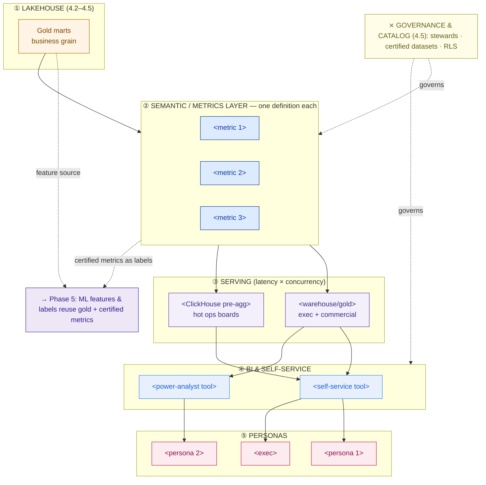

# BI Enablement Plan — Template

> Fill this in once the lakehouse (medallion gold layer, 4.2) and governance/catalog (4.5) exist. This plan designs the **consumption layer** — how business teams get *trusted, fast, self-served* answers — and closes the Enterprise Data Platform (Capstone D). An executive should grasp the persona map and the one-definition metrics; an analytics engineer should trust the serving and semantic-layer detail.

**Customer:** `<company>`  ·  **Industry:** `<industry>`  ·  **Prepared by:** `<SA name>`  ·  **Date:** `<YYYY-MM-DD>`
**Engagement / opportunity:** `<deal or project name>`  ·  **Version:** `<v0.1 draft>`

---

## How to use this template

Work the consumption layer **top-down**, in this order — and resist the customer's urge to start at §2 (the tool). Metric definitions come first; the tool is the last and least consequential choice.

1. **Objective & current-state pain** — can teams self-serve today? Is there one trusted number per metric, or metric chaos?
2. **Semantic / metrics layer** — force ONE definition per core metric, with a steward. This is the anti-chaos artifact.
3. **BI tool choice** — decide by cost + user skill mix, not by demo dazzle.
4. **Serving & performance** — pre-aggregate; split hot/high-concurrency boards from cold/low-concurrency ones by *latency × concurrency*.
5. **Governed self-service & literacy** — roles, certified datasets, guardrails, a literacy program that replaces the ticket queue.
6. **Persona → dashboard map** — one parameterized template per persona; never 200 hand-built copies.
7. **Draw the consumption stack** — fill the Mermaid skeleton.
8. **Phase 5 / ML runway** — note how these same assets feed ML.

Legend: **semantic/metrics layer** = one governed definition per metric · **certified dataset** = a gold mart/metric badged trustworthy for self-service · **RLS** = row-level security · **latency × concurrency** = the rule that picks a serving engine.

---

## 1. Objective & current-state pain

- **What does "done" look like?** `<e.g. exec/ops/commercial self-serve trusted metrics without a ticket>`
- **Can teams self-serve today?** `<yes/no — how reports get made now, and the backlog>`
- **Metric chaos check:** does any core metric have more than one definition in the wild? `<list the divergent definitions>`
- **Performance pain:** are any dashboards slow because they query raw/silver data? `<which, how slow>`
- **Upstream assets available:** gold marts (4.2): `<list>` · governance/catalog + stewards (4.5): `<yes/no>`

## 2. Semantic / metrics layer (ONE definition per metric)

> The most valuable table here. Force one definition per metric, encode it as code (dbt Semantic Layer / Cube / LookML), and attach a steward from your 4.5 governance roles.

| Metric | Grain | Numerator / Denominator | Time basis | Filters / edge cases | Steward | Certified? |
|---|---|---|---|---|---|---|
| `<metric 1>` | `<parcel / order / …>` | `<num / denom>` | `<event date basis>` | `<exclusions, traps>` | `<team>` | `<Y/N>` |
| `<metric 2>` | | | | | | |
| `<metric 3>` | | | | | | |
| `<metric 4>` | | | | | | |

**Where the definitions live (metrics-as-code):** `<dbt Semantic Layer / Cube / LookML>` — and why: `<reuses existing dbt stack / need caching API / already own Looker>`

*Findings to flag:* metrics with competing definitions today (chaos) · metrics with no steward (ungoverned) · metrics BI and a future ML team would compute differently.

## 3. BI tool choice (decide by cost + skill mix)

| Candidate | License model | Self-service for low-SQL users | Power-analyst depth | Verdict for this customer |
|---|---|---|---|---|
| Metabase (open) | `<self-host / cloud>` | `<Excellent/…>` | `<Moderate>` | `<primary? / no>` |
| Superset (open) | `<Apache>` | `<Moderate>` | `<High>` | `<power analysts? / no>` |
| Power BI | `<per-user / capacity>` | `<Good>` | `<High>` | `<only if MS-anchored>` |
| Looker / Tableau | `<premium / per-seat>` | `<Good>` | `<High / best-viz>` | `<justify per-seat at scale?>` |

**Chosen stack:** `<tool(s)>` — **rationale:** `<cost at seat count, user skill spread, open vs commercial, estate anchor>`

## 4. Serving & performance (latency × concurrency)

> Never point an interactive dashboard at raw events. Pre-aggregate to dashboard grain, then route boards to an engine that matches their latency and concurrency.

**Pre-aggregated marts to build (in gold, refreshed by the 4.4 orchestrator):**
```
<grain 1, e.g. hub_day>      — powers <which boards>
<grain 2, e.g. courier_day>  — powers <which boards>
<grain 3, e.g. client_week>  — powers <which boards>
```

| Board group | Users / concurrency | Latency need | Serving engine | Why |
|---|---|---|---|---|
| `<hot operational>` | `<high, e.g. 200 sites @ peak>` | `<sub-second>` | `<ClickHouse / columnar>` | `<high-concurrency, pre-agg>` |
| `<exec + commercial>` | `<low, tens>` | `<seconds OK>` | `<warehouse / gold>` | `<cheaper, no 2nd engine needed>` |

**Rule stated for the record:** the freshness/speed of a board is capped by its serving path; a `<N>`-site board must not query raw/silver "to save a table."

## 5. Governed self-service & literacy (kill the ticket queue)

**Roles:**

| Role | Owns | Can do |
|---|---|---|
| Analytics engineer | Certified datasets + semantic models | Build/curate gold marts & metrics |
| Metric steward (4.5) | Metric definitions | Approve/change a definition |
| Business explorer | Own dashboards on certified data | Self-serve within guardrails |
| Viewer | — | Consume certified boards |

**Certified-dataset policy:** `<gold marts + semantic metrics are certified/badged; ad-hoc SQL runs in a labelled sandbox, NOT certified>`

**Guardrails:**
- Row-level security: `<who sees which rows — e.g. a client/account sees only their own records>`
- Query cost/row limits: `<caps>`
- PII masking: `<per 4.5 policy>`

**Data literacy program (replaces the queue):**
- Onboarding: `<format, length>`
- Metrics glossary: `<generated from semantic layer, linked to 4.5 catalog>`
- Office hours / enablement: `<cadence>` — *replacing* the report ticket queue.

## 6. Persona → dashboard map (one template per persona)

> Design the template, not every copy. A parameterized board that each site/account opens filtered to itself beats N hand-built dashboards.

```
PERSONA            THE QUESTION THEY ASK             DASHBOARD (one template)      SERVED FROM     LATENCY
──────────────────────────────────────────────────────────────────────────────────────────────────────────
<persona 1>        "<question>"                      <template + parameter>        <engine>        <sub-sec/sec>
<persona 2>        "<question>"                      <template>                    <engine>        <…>
<persona 3>        "<question>"                      <template + RLS>              <engine>        <…>
<persona exec>     "<is the network healthy?>"       <1-page certified KPI>        <engine>        <…>
```

## 7. The consumption stack (Mermaid skeleton)

> Replace the placeholders. Keep the flow: gold → semantic layer → serving → BI → personas, with governance to the side and the ML runway branching off gold + metrics.



### ASCII fallback (for docs/email that can't render Mermaid)

```
   GOVERNANCE & CATALOG (4.5)  stewards · certified datasets · RLS  ──── spans the layer
   ─────────────────────────────────────────────────────────────────────────────────────
 ① LAKEHOUSE        Bronze ─▶ Silver ─▶ GOLD marts (business grain)
 ② SEMANTIC LAYER   one definition each:  <metric 1> · <metric 2> · <metric 3>
 ③ SERVING          warehouse/gold (exec, commercial)   |   ClickHouse pre-agg (hot ops)
 ④ BI               <self-service tool>  ·  <power-analyst tool>
 ⑤ PERSONAS         <persona 1>   <persona 2>   <persona 3>   <exec>
   ───────────────────────────────────────────────────────────────────────────────────────
   → Phase 5 (ML): gold marts = features · certified metrics = labels/eval targets
```

## 8. Phase 5 / ML runway

- **Feature source:** `<which gold marts feed ML feature engineering>`
- **Labels / eval targets:** `<which certified metrics become ML labels or evaluation targets>`
- **Consistency guarantee:** the semantic layer keeps "the model's metric" == "the dashboard's metric".

## 9. Rollout phasing & findings

| # | Finding / decision | Layer | Implication | Severity |
|---|---|---|---|---|
| 1 | `<e.g. 3 definitions of on-time delivery>` | Semantic | `<pick one, encode as code, assign steward>` | `<H/M/L>` |
| 2 | `<e.g. hub board scans raw events>` | Serving | `<pre-aggregate + ClickHouse>` | `<…>` |
| 3 | `<e.g. central report backlog>` | Enablement | `<governed self-service + literacy>` | `<…>` |

**Rollout phases (suggested):**
1. `<Phase 1: semantic layer + certified gold marts + exec KPI on warehouse>`
2. `<Phase 2: ClickHouse serving + hub scorecard template + self-service rollout>`
3. `<Phase 3: embedded/client-facing boards with RLS; literacy program; hand off to Phase 5 ML>`

**One-line closing statement (fill in):**
> The `<customer>` consumption layer delivers `<n>` certified metrics through `<tool>` over `<serving strategy>`, replaces a report ticket-queue with governed self-service for `<personas>`, and hands Phase 5 the same gold marts and certified metrics as an ML runway — closing Capstone D.

---

*Worked example: see `example-kirim-cepat-bi-enablement.md` in this folder.*
