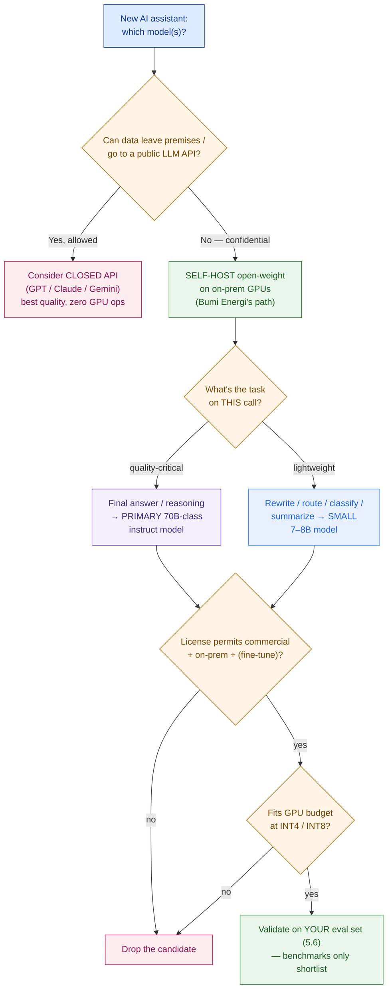

# LLM & Model Landscape

> "Just call GPT-4" is not an architecture — it's a data-leak with a demo attached. Match the model to the requirement (quality, latency, cost, license, self-hostability), or you'll design a platform the customer legally can't run.

**Type:** Design
**Track:** AI, Data & Infrastructure Solution Architect (Presales)
**Prerequisites:** Phase 4 (Data Platform Architecture) · builds above [0.5 Data & AI Literacy](../../../00-foundations/05-data-and-ai-literacy/docs/en.md)
**Time:** ~5h
**Lab:** Ollama
**Ship It:** Model-selection matrix

## The Problem

Bumi Energi wants an internal AI assistant. It's a ~12,000-employee Indonesian energy company, and the ask is concrete and reasonable: let engineers and operators ask questions — *"what's the confined-space entry procedure for a live gas line?"*, *"what did the 2021 Balikpapan incident report conclude?"* — against a confidential corpus of ~5 million technical, engineering, safety, and regulatory documents (~40 million pages) spread across SharePoint, file shares, and decades of scanned PDFs. On the call, the temptation is overwhelming, and the rookie SA gives in to it: *"Easy — we wire your documents into GPT-4 (or Claude, or Gemini). Best model on the market, six-week PoC."* Everyone nods. The demo would be gorgeous.

It is also **dead on arrival**, because the SA answered a model question without hearing the *constraint*. Bumi Energi's corpus is safety-critical and regulated; its confidentiality is **absolute** — that data cannot leave the premises and cannot be sent to a public LLM API, full stop, for reasons of intellectual property, regulatory residency, and plain contractual risk. A design that pipes engineering and incident data to a vendor's cloud endpoint isn't a design the legal and security teams will *debate* — it's one they'll *kill*, and the SA who proposed it just told the room they don't understand the business they're selling into. The very first filter on any model choice here is not "which is smartest?" It is "**can this data touch this model at all?**" — and for Bumi Energi, that filter eliminates every closed API on the market before quality is even discussed.

But eliminating closed APIs only moves you to the *next* way to lose. Now you must self-host an open-weight model on Bumi Energi's own GPUs — and here the second rookie mistake waits: **picking a model on hype or a leaderboard screenshot.** "DeepSeek is #1 this week, let's run that" ignores that its 671-billion-parameter weights need a rack of GPUs to serve; "one giant 70B model for everything" burns your cost-sensitive GPU budget running a Ferrari to reformat a search query; "the benchmark says 88% MMLU" says nothing about whether the model answers *Indonesian safety procedures* correctly, and a wrong safety answer here is not a bad demo — it can get someone hurt. This lesson is the skill underneath all of that: **choosing and defending the model(s)** for a platform, at architect altitude. You will not train a model or write a serving loop — you will read the landscape, weigh quality against latency against GPU cost against license against self-hostability, and ship a defensible **model-selection matrix** that survives a CISO, a CFO, and a plant safety officer in the same room. Get this wrong and everything downstream in Phase 5 — the RAG design (5.3), the GPU sizing (5.5), the whole Capstone E platform — is built on sand.

## The Concept

Phase 0.5 taught you *what* an LLM is: a text predictor, not a database; tokens and context windows; embeddings, vector DBs, and RAG; training versus inference. This lesson assumes all of that and climbs to the architect's job — **selecting between models**. That job has exactly five axes, and one gate in front of them.

### The gate: open-weight vs closed API (and why it's a gate, not an axis)

Before any quality comparison, one binary decision decides which shelf you even shop from.

- **Closed / API models** — GPT (OpenAI), Claude (Anthropic), Gemini (Google). You never hold the weights; you send prompts over the network to the vendor's servers and pay per token. Best-in-class quality, zero GPU operations, elastic scale — *and your data goes to their infrastructure.* (Managed variants — Azure OpenAI, AWS Bedrock, Google Vertex — add residency and no-training contractual terms, but the data still leaves your premises for a vendor-run service.)
- **Open-weight models** — Llama (Meta), Qwen (Alibaba), Mistral (Mistral AI), Gemma (Google), DeepSeek. You **download the weights** and run them on hardware *you* control — a laptop, a cloud GPU, or an on-prem rack. The data never leaves your boundary. You own the GPU bill, the ops, and the model lifecycle.

For most customers this is a trade-off. For Bumi Energi — absolute confidentiality, IP, regulatory residency — it is a **gate**: closed APIs are disqualified regardless of quality, and the entire rest of the decision happens on the open-weight shelf. Naming this gate first, out loud, is the single move that separates an architect from an order-taker. ("Open-weight," note, is not the same as "open-source": the *weights* are downloadable, but the license may restrict use and the training data/code is usually not released — more below.)

### The five axes of a model decision

Once you know which shelf, every candidate is scored on five axes that constantly trade against each other:

1. **Quality** — how good the answers are *on your task*. Correlates loosely with **parameters** (7B < 24B < 70B < 400B+), but a newer 24B routinely beats an older 70B. Quality is task-shaped: a model can ace English trivia and fail Indonesian safety procedures.
2. **Latency** — time to a finished answer. Bigger model = slower token generation. Bumi Energi's target is **~5–10 seconds** per answer; that number, not the leaderboard, bounds how big you can go.
3. **Cost** — for self-hosting, cost *is* GPU VRAM and GPU count. Bigger and higher-precision models need more (and pricier) GPUs. This customer is **cost-sensitive**, so sizing is make-or-break.
4. **Context window** — the tokens the model can consider at once (8K → 128K → 1M+). For RAG you rarely need the giant windows; you retrieve a handful of chunks. 32K–128K is plenty; paying for 1M context you won't use is waste.
5. **License** — may you use it commercially, on-prem, and (if needed) fine-tune it? Open-weight licenses range from truly permissive to restricted-but-usable to research-only. A model you can't legally deploy has quality zero.

Plus one lever that sits *across* cost and quality — **quantization** — important enough to get its own picture.

### Quantization — the size↔quality lever that makes 70B fit

A model's weights are numbers, and you get to choose how many bits each number uses. **Quantization** shrinks the weights (and thus the VRAM and the GPU bill) by trading a little precision. This is the most important lever an infrastructure-minded SA controls, because it decides whether a 70B model needs one GPU or four.

```
   QUANTIZATION = the size↔quality lever (70B-class model, weights only)
   ──────────────────────────────────────────────────────────────────────────
   PRECISION       BYTES/PARAM   VRAM (70B weights)   QUALITY vs FP16   USE
   FP16 / BF16        2.0          ~140 GB            baseline          max fidelity / research
   FP8 / INT8         1.0          ~70  GB            ≈ (negligible)    quality-first serving
   INT4 (Q4_K_M/AWQ)  0.5          ~35  GB            ~1–3% down        the cost/quality sweet spot ✅
   INT3 / INT2       <0.5          ~18–26 GB          sharp drop        avoid for safety-critical
   ──────────────────────────────────────────────────────────────────────────
   Rule of thumb:   VRAM(weights) ≈ params × bytes-per-param
   + KV cache & runtime overhead: add ~20–40% on top (grows with context length
     × concurrency). 70B @ INT4 (~35 GB) + KV → fits ONE 80 GB GPU; @ FP16 needs ~2×.
```

The headline: **INT4 quantization is what makes a 70B model affordable on-prem** — it turns a ~140 GB FP16 footprint into ~35 GB that fits a single 80 GB data-center GPU, at a quality cost small enough that eval usually can't tell the difference on RAG tasks. Go too far (INT3/INT2) and quality falls off a cliff — unacceptable when a wrong answer is a safety hazard. Ignoring quantization is the third rookie mistake: you either over-buy GPUs at FP16 or under-serve at INT2. (The formats you'll see: **GGUF** with `Q4_K_M`/`Q5_K_M`/`Q8_0` in the Ollama/llama.cpp world; **AWQ**/**GPTQ**/**FP8** in the vLLM serving world — 5.5 goes deep.)

### Base vs instruct vs fine-tuned — pick the right variant

Every model family ships in variants, and deploying the wrong one is a classic own-goal:

- **Base** — a raw next-token predictor. It completes text but does *not* reliably follow instructions or chat. **Never deploy a base model as an assistant.**
- **Instruct / chat** — the base model further trained (SFT + RLHF/DPO) to follow instructions and hold a conversation. **This is what you deploy for a RAG assistant.** Look for `-Instruct` / `-it` / `-chat` in the name.
- **Fine-tuned** — an instruct model trained further on *your* domain data. For Bumi Energi, remember 0.5's rule: **RAG injects facts, fine-tuning shapes behavior.** Fine-tuning is for domain tone, format, and vocabulary — not for teaching the model your 40M pages (that's RAG's job). With a small in-house ML team, the architect's default is **off-the-shelf instruct + RAG**, and consider a lightweight LoRA fine-tune only if eval later shows a style/terminology gap.

### Benchmarks and their limits — narrow the shortlist, never pick the winner

Leaderboards (MMLU-Pro, GPQA, HumanEval+, MATH, IFEval, and the crowd-voted LMArena Elo) are how the field brags. Use them, but know their three failure modes so a benchmark screenshot never makes your decision:

- **Contamination** — the benchmark's questions may have leaked into the model's training data, inflating the score. A high number can mean "memorized the test," not "understands the task."
- **Task mismatch** — a model that tops an English math benchmark tells you nothing about *Indonesian confined-space procedures*. Bumi Energi's task is domain-specific and bilingual; general leaderboards don't measure it.
- **Overfitting to the leaderboard** — vendors tune for the tests everyone watches. The rank can be real and still not predict *your* result.

The architect's discipline: **benchmarks narrow the shortlist to 2–3 candidates; your own eval on your own data picks the winner** (that eval is Lesson 5.6). Never let "it's #1 this week" end the conversation.

### The decision, as a tree

Put the gate and the axes together and model selection becomes a walk down one tree — the diagram you'll redraw on every AI deal:



And the artifact that tree produces is a **comparison matrix** — the same six columns for every candidate, so the decision is legible to an engineer *and* an executive:

```
   THE MODEL-COMPARISON MATRIX — the six columns that decide a model
   ┌───────────────┬─────────┬─────────┬───────────────┬───────────┬──────────┐
   │ MODEL         │ PARAMS  │ CONTEXT │ LICENSE       │ VRAM@INT4 │ HOST     │
   ├───────────────┼─────────┼─────────┼───────────────┼───────────┼──────────┤
   │ GPT-4o / 4.1  │  n/a    │ 128K–1M │ closed API    │   n/a     │ vendor ✗ │
   │ Claude Sonnet │  n/a    │  200K   │ closed API    │   n/a     │ vendor ✗ │
   │ Gemini Pro    │  n/a    │  1M–2M  │ closed API    │   n/a     │ vendor ✗ │
   │ Llama 3.3     │  70B    │  128K   │ Llama Comm.   │  ~40 GB   │ self ✓   │
   │ Qwen2.5       │  72B    │  128K   │ Qwen License  │  ~40 GB   │ self ✓   │
   │ Mistral Small3│  24B    │  128K   │ Apache 2.0    │  ~14 GB   │ self ✓   │
   │ Gemma 3       │  27B    │  128K   │ Gemma Terms   │  ~16 GB   │ self ✓   │
   │ DeepSeek-V3   │671B MoE │  128K   │ MIT           │ ~350 GB*  │ self ✓✓  │
   │ Qwen2.5 (sm)  │  7B     │  128K   │ Apache 2.0    │  ~5 GB    │ self ✓   │
   └───────────────┴─────────┴─────────┴───────────────┴───────────┴──────────┘
    ✗ = can't self-host → disqualified for a confidential corpus like Bumi Energi's.
    * MoE (mixture-of-experts): ALL experts must sit in VRAM (memory ∝ total params),
      but only ~37B are active per token (speed ∝ active params) — saves compute, not
      memory. Add a QUALITY column from YOUR eval — never from a leaderboard alone.
```

## Design It

Bumi Energi's brief, restated as an SA hears it: an internal RAG assistant over ~5M confidential documents (~40M pages), **~2,000 named users**, **~200 concurrent at peak**, **business-hours** load, target answer latency **~5–10 seconds**, **absolute confidentiality** (no public APIs, on-prem GPUs only), **cost-sensitive** GPU budget, a **small in-house ML/platform team**, and **safety-critical accuracy** demanding citations, eval, and guardrails. Your job in *this* lesson is one deliverable: **the defended model choice.** The vector store is 5.2, the RAG pipeline is 5.3, the GPU count is 5.5, the eval and guardrails are 5.6 — you reserve the seams and hand off. Every number below is a **design proposal with stated assumptions**; nothing about the customer is invented beyond the pinned figures.

### Step 1 — Apply the gate: closed APIs are off the table

Start where the tree starts. *Can Bumi Energi's engineering, safety, incident, and contract data go to a public LLM API?* No — confidentiality is absolute (IP + regulatory + residency). So **every closed API (GPT, Claude, Gemini) is disqualified before quality is discussed**, and the design is **self-hosted open-weight models on on-prem GPUs**. Write this as line one of the matrix and say it in the room: *we are not choosing the best model on Earth; we are choosing the best model we are allowed to run inside your fence.* That single sentence pre-empts the executive who saw a GPT demo and asks why you didn't use it.

### Step 2 — Right-size per task: a primary + a small utility model (not one giant model for everything)

The second rookie mistake is running one 70B model for every call. A RAG assistant does many *cheap* jobs around each *expensive* one: rewriting the user's question for retrieval, classifying intent, routing, summarizing a chunk, a first-pass guardrail check. Running a 70B for those wastes the scarce, cost-sensitive GPU. So split the fleet:

- **Primary (quality-critical):** a **~70B-class instruct model** for the final, cited, safety-relevant answer. This is where answer quality lives and where you spend the GPU.
- **Small utility (lightweight):** a **7–8B instruct model** for query rewriting, routing, classification, and cheap summarization — ~5 GB at INT4, near-free to run, keeps the big GPU reserved for answers.

This "right tool per task" tiering is the same instinct as Phase 4's "many engines, one copy" — spend heavy compute only where it changes the outcome.

### Step 3 — Pick the primary: Qwen2.5-72B vs Llama 3.3 70B

On the open-weight shelf, two candidates dominate the ~70B quality tier for this task:

| Candidate | Why it fits Bumi Energi | Watch-outs |
|---|---|---|
| **Qwen2.5-72B-Instruct** | Strong **multilingual** (incl. Indonesian) + technical/coding/reasoning; 128K context; excellent at structured, grounded answers | Under the **Qwen License** (commercial-friendly, >100M-MAU clause — irrelevant at 2K users), not Apache; validate Indonesian safety phrasing on eval |
| **Llama 3.3 70B-Instruct** | Broad ecosystem, mature tooling (vLLM/Ollama/quant formats), 128K context, huge community | **Llama Community License** (not OSI open source; "Built with Llama" naming, MAU clause) — usable here but restricted |

Both are 128K-context, both quantize cleanly to INT4 (~40 GB), both self-host on the same hardware. For a **bilingual, technical, safety-critical** corpus, **primary = Qwen2.5-72B-Instruct** on the strength of multilingual + technical grounding, with **Llama 3.3 70B-Instruct as the defended fallback** (below). This is a *shortlist*, not a verdict — Step 6's eval confirms it. (Newer Apache-2.0 lines such as **Qwen3** are worth re-benchmarking at eval time; the *method* — not the specific checkpoint — is the durable deliverable.)

### Step 4 — Set the quantization: INT4 as the default, INT8 as the safety valve

Quantization is where cost-sensitivity meets safety-critical accuracy. Default the 72B primary to **INT4 (AWQ or GGUF `Q4_K_M`)** — ~40 GB, one 80 GB GPU, ~1–3% quality cost that eval typically can't detect on RAG. But because a wrong safety answer is dangerous, make it **conditional**: if 5.6's eval shows INT4 measurably hurts accuracy on the safety-critical question set, step **up to INT8** (~72 GB, still one 80 GB GPU or a small tensor-parallel pair) and accept the extra hardware. Never drop below INT4 here. The small utility model runs INT4 unconditionally — its jobs aren't safety-bearing.

### Step 5 — Reconcile latency vs GPU cost (the ~5–10s target)

This is the tension that makes model choice an *infrastructure* decision, and the reason 5.5 exists. A 70B model is the slowest link:

```
LATENCY back-of-envelope (single stream, illustrative — firmed in 5.5)
──────────────────────────────────────────────────────────────────────
 72B @ INT4 on 1× data-center GPU .... ~30–50 tokens/sec generation (assumption)
 Grounded answer length .............. ~300–500 tokens (assumption)
 Single-stream generation ............ ~6–16 s  → near or OVER the 5–10s target
 Levers to land inside 5–10s:
   • INT4 (not FP16) → faster memory-bound decode
   • vLLM continuous batching → serve ~200 concurrent without linear slowdown
   • cap answer length + STREAM tokens → perceived latency drops sharply
   • the SMALL model absorbs non-answer tasks → big GPU reserved for answers
──────────────────────────────────────────────────────────────────────
 → The model CHOICE makes ~5–10s feasible; the GPU COUNT that guarantees it
   at 200 concurrent is the sizing exercise in Lesson 5.5.
```

Honest framing for the customer: the 72B-at-INT4 choice puts ~5–10s *within reach* given proper serving (vLLM batching, token streaming, capped answers). It does **not** promise the number on one GPU — that guarantee is the sizing sheet in 5.5. Say that; don't hand-wave it. (Avoid heavy **reasoning** models — e.g. DeepSeek-R1 and its long chain-of-thought — on the hot answer path: their thinking tokens blow the latency budget. They're an option for slow, offline analysis, not the live assistant.)

### Step 6 — Lock license fit and a fallback (supply-chain resilience)

Two license-driven decisions close the design:

- **License fit:** at ~12,000 employees / ~2,000 users, Bumi Energi clears every MAU threshold — Llama, Qwen, Mistral, Gemma, DeepSeek are all *legally deployable* on-prem with commercial use and fine-tuning allowed. The architect's real concern isn't "may we?" but **audit comfort and portability**: Apache-2.0 (Mistral, Qwen small sizes, Qwen3) and MIT (DeepSeek) are the cleanest for a regulated energy company's legal review; Llama Community and Gemma Terms are usable but restricted. Note this in the matrix so legal isn't surprised.
- **Fallback = resilience, not indecision:** name **Llama 3.3 70B-Instruct** as the drop-in fallback for the primary. If a license changes, a checkpoint is withdrawn, or eval flips the ranking, you swap models without redesigning the platform — because both are 128K-context, INT4-friendly, and served identically by vLLM. A second, license-diverse primary is cheap insurance for a small team that can't afford a re-architecture.

### The resulting decision (the matrix, condensed)

| Role | Model | Quant | ~VRAM | License | Why |
|---|---|---|---|---|---|
| **Primary answer** | Qwen2.5-72B-Instruct | INT4 (→INT8 if eval demands) | ~40 GB (72 @ INT8) | Qwen License | Multilingual + technical + 128K; quality where it matters |
| **Fallback primary** | Llama 3.3 70B-Instruct | INT4 | ~40 GB | Llama Community | License/supply-chain diversity; identical serving |
| **Small utility** | Qwen2.5-7B-Instruct | INT4 | ~5 GB | Apache 2.0 | Rewrite / route / classify / summarize — cheap, keeps big GPU free |
| **Embedding** (→ 5.2) | multilingual retrieval model (e.g. BGE-M3 / multilingual-e5) | — | small | open | Seam reserved; chosen in 5.2 with the vector store |

**One-sentence defense:** *Because Bumi Energi's data cannot leave its premises, we self-host open-weight models on-prem — a Qwen2.5-72B-Instruct primary at INT4 for cited, safety-critical answers, a small 7B model for the cheap tasks around it, and a Llama 3.3 70B fallback for resilience — a fleet that fits the GPU budget, keeps ~5–10s in reach, and clears the license review, with the final pick confirmed by our own eval, not a leaderboard.*

## Lab — Ollama: pull one small model, then compare two (10 minutes)

You don't need an H100 to *feel* the decision. **Ollama** runs open-weight models locally — fully offline, nothing leaves the machine (the exact confidentiality property Bumi Energi needs), INT4-quantized by default so a small model fits a laptop. Prove the quality/speed/size trade-off in miniature; it scales linearly up to the 72B choice.

```bash
# 1. Install Ollama:  https://ollama.com/download  (macOS / Linux / Windows)

# 2. Pull TWO small open-weight instruct models (Q4 GGUF by default)
ollama pull llama3.2:3b        # Meta Llama 3.2 3B-Instruct   (~2.0 GB at Q4)
ollama pull qwen2.5:7b         # Alibaba Qwen2.5 7B-Instruct  (~4.7 GB at Q4)

# 3. See what you pulled — note SIZE and quantization (your VRAM column, small-scale)
ollama list

# 4. Ask the SAME safety-shaped question to both — compare answer QUALITY
ollama run llama3.2:3b "A confined-space entry permit is missing its gas-test reading. In two sentences, what must the operator do before entry?"
ollama run qwen2.5:7b  "A confined-space entry permit is missing its gas-test reading. In two sentences, what must the operator do before entry?"

# 5. Measure LATENCY — --verbose prints eval rate (tokens/s) + total duration
ollama run --verbose qwen2.5:7b "Summarize the purpose of a lockout-tagout procedure in one sentence."

# 6. Inspect the model card — LICENSE, params, context, quantization (your matrix, live)
ollama show qwen2.5:7b
```

What you just proved, at architect altitude: **(1)** two open models ran **entirely offline** — no prompt left the box, which is the whole reason Bumi Energi self-hosts; **(2)** INT4 quantization shrank a 7B model to ~5 GB — the same lever that makes 72B fit one 80 GB GPU; **(3)** you *felt* the quality gap between a 3B and a 7B — extrapolate to why the safety-critical answer wants a 72B, not a 7B; and **(4)** `ollama show`'s license line **is** the license column of your matrix. Same commands, bigger box: on Bumi Energi's on-prem GPUs this identical workflow pulls `qwen2.5:72b` — and for production serving at 200 concurrent you graduate from Ollama to **vLLM** (5.5).

## Compare It

Three questions a customer will actually raise — answer each with the trade-off, not a slogan.

**1. Open vs closed — confidentiality first, then TCO.**

| | **Closed API (GPT/Claude/Gemini)** | **Self-hosted open-weight** |
|---|---|---|
| Data boundary | Leaves your premises to a vendor service | **Never leaves** — on your hardware |
| Quality ceiling | Highest available | Very strong (70B-class), closing fast |
| Cost model | Per-token, opex, scales with usage | GPU capex/opex, fixed once bought |
| Ops burden | ~None (vendor runs it) | You run GPUs, serving, upgrades |
| Fit for Bumi Energi | **Disqualified** — confidentiality gate | **✅ Required** — the only compliant path |

For a public-data chatbot, closed APIs often win on speed-to-value and pure quality. For a confidential, regulated corpus, that entire column is struck through on line one — and at Bumi Energi's steady ~2,000-user internal load, a fixed on-prem GPU cost is also often *cheaper* than per-token API bills, but the deciding factor is confidentiality, not the TCO.

**2. Which open-weight family?** They are not interchangeable:

| Family | Sizes | License | Reach for it when… |
|---|---|---|---|
| **Llama** (Meta) | 8B → 70B (405B, Llama 4 MoE) | Llama Community (restricted) | You want the biggest ecosystem, most tooling, most quant formats — the safe default fallback |
| **Qwen** (Alibaba) | 0.5B → 72B (Qwen3 MoE) | Apache 2.0 (most sizes; 72B = Qwen License) | **Multilingual** (incl. Indonesian) + technical/coding/math — Bumi Energi's primary |
| **Mistral** (Mistral AI) | 7B, Small 3 (24B), Mixtral MoE | **Apache 2.0** (open models) | You want a strong, cleanly-licensed mid-size model with low VRAM; European vendor |
| **Gemma** (Google) | 1B → 27B (multimodal, 128K) | Gemma Terms (restricted) | Efficient small/mid models, strong for their size; watch the use restrictions |
| **DeepSeek** (DeepSeek) | V3 (671B MoE), R1 (reasoning) | **MIT** (most permissive) | Frontier open quality / reasoning — but 671B needs a GPU *rack*; overkill here |

**3. API vs self-host, even within open-weight.** You *can* rent open models via an API (Together, Fireworks, Groq, or the vendors' own) — cheaper ops, no GPUs, but the data still leaves your boundary, so for Bumi Energi it collapses back into the disqualified column. Self-hosting is not a preference here; it's the confidentiality requirement expressed as infrastructure.

The through-line, and the sentence for the room: **the model decision is a constraint-satisfaction problem, not a beauty contest.** You filter by the hard gate (can the data touch it?), then by license and hostability, and only *then* rank the survivors on quality-per-GPU-dollar against the latency target — confirmed by your own eval, never a leaderboard.

## Ship It

This lesson ships a reusable **Model-Selection Matrix** — the deliverable you produce the moment "which model?" comes up, and the input to the whole Phase 5 platform. It forces the decision through the gate → axes → eval discipline so the choice is defensible to a CISO, a CFO, and a safety officer at once. Both files live in [`outputs/`](../outputs/):

- **[`template-model-selection-matrix.md`](../outputs/template-model-selection-matrix.md)** — a fill-in-the-blank matrix: the requirements header, the open-vs-closed gate, the candidate table with the six columns (quality / context / license / VRAM / quantization / latency) plus a verdict, a right-sizing fleet table, and a decision log with a fallback.
- **[`example-bumi-energi-model-selection.md`](../outputs/example-bumi-energi-model-selection.md)** — the template fully worked for Bumi Energi, so the skeleton isn't abstract: closed APIs struck by the confidentiality gate, a Qwen2.5-72B primary at INT4, a 7B utility model, a Llama 3.3 fallback, and the latency/GPU tension handed to 5.5.

The point of shipping this: the matrix is where you *defend* the un-obvious calls — no GPT despite the pretty demo, one primary plus a small model instead of one giant one, INT4 not FP16, verdict-by-eval not by leaderboard — and it feeds directly into **5.5 (serving & GPU sizing)** and **Capstone E (Private AI Platform)**.

## Exercises

1. **(Easy)** In three sentences an SA could say to Bumi Energi's steering committee, defend **why the platform self-hosts open-weight models instead of calling GPT-4**. Then, from the Concept's quantization ladder, state the VRAM a 70B model needs at FP16 versus INT4 and name the one-line reason INT4 is the default here. (Reinforces the gate + the size↔quality lever.)

2. **(Medium)** Re-run the matrix for a **different customer**: a **mid-size Indonesian retail bank** building a customer-facing support assistant over *public* product FAQs (no confidential data on this surface), latency-sensitive (~2s), high concurrency. Which way does the open-vs-closed **gate** swing now, and why? Pick a model (or a closed API) and justify it on the five axes — note the single requirement (data sensitivity) that flipped the whole decision versus Bumi Energi.

3. **(Hard)** Bumi Energi's new Head of AI, fresh from a startup, mandates: *"Skip the 72B — just fine-tune a 7B on our 40M pages and it'll be faster and cheaper."* Write a half-page rebuttal for the steering committee. Use 0.5's *RAG-injects-facts-vs-fine-tuning-shapes-behavior* rule and this lesson's latency/quality/eval reasoning to explain why fine-tuning a small model is the wrong tool for a safety-critical factual corpus, what it *would* be good for, and how your eval (5.6) would settle it. Save it beside your worked Bumi Energi matrix — you'll reuse this reasoning in **Capstone E**.

## Key Terms

| Term | What people say | What it actually means |
|------|-----------------|------------------------|
| Open-weight model | "Open-source AI" | A model whose **weights are downloadable** so you can self-host — but the license may restrict use and the training data/code is usually *not* released. "Open-weight" ≠ "open-source." |
| Closed / API model | "The good models" | GPT/Claude/Gemini — accessed only over the vendor's network; you never hold the weights and your data leaves your premises. Best quality; disqualified when confidentiality is absolute. |
| Parameters (B) | "How smart it is" | The count of weights (7B, 70B, 405B). Loosely tracks quality and directly sets VRAM — but a newer small model often beats an older big one. Not a quality guarantee. |
| Quantization | "Making it smaller" | Storing weights in fewer bits (FP16→INT8→INT4) to cut VRAM and GPU cost, trading a little precision. INT4 is the on-prem sweet spot; below it, quality collapses. |
| Context window | "Its memory" | Max tokens the model considers at once (8K→128K→1M+). RAG rarely needs the giant windows; paying for 1M you won't use is waste. |
| Base vs instruct | "The model" | Base = raw text predictor (don't deploy it); instruct/chat = tuned to follow instructions and converse (what you deploy for a RAG assistant). |
| License (model) | "It's free" | The legal terms for use: permissive (Apache 2.0, MIT), restricted-but-usable (Llama Community, Gemma Terms), or research-only. A model you can't legally deploy has quality zero. |
| MoE (mixture-of-experts) | "A huge model" | Many expert sub-networks; all sit in VRAM (memory ∝ *total* params) but only a few fire per token (speed ∝ *active* params). Saves compute, not memory. DeepSeek-V3, Mixtral, Llama 4. |
| Benchmark (MMLU, etc.) | "Proof it's best" | A standardized test score. Useful to shortlist, but vulnerable to contamination, task mismatch, and leaderboard overfitting — never the final decision. Your own eval picks the winner. |
| Model-selection matrix | "A comparison" | The deliverable: candidates scored on the same six columns (quality/context/license/VRAM/quant/latency) through the confidentiality gate, ending in a defended verdict + fallback. |

## Further Reading

- [Hugging Face — Open LLM Leaderboard](https://huggingface.co/spaces/open-llm-leaderboard/open_llm_leaderboard) and [LMArena](https://lmarena.ai/) — the two boards to *shortlist* from; read them knowing the contamination/task-mismatch caveats above, then run your own eval.
- [Meta Llama license & models](https://www.llama.com/) · [Qwen (Alibaba)](https://github.com/QwenLM/Qwen2.5) · [Mistral AI models](https://mistral.ai/technology/#models) · [Google Gemma](https://ai.google.dev/gemma) · [DeepSeek](https://github.com/deepseek-ai/DeepSeek-V3) — read one model card from each family; the license and "intended use" sections are exactly your matrix's columns.
- [Ollama](https://ollama.com/library) — the local runtime from the Lab; the library page shows every model's sizes, quantizations, and license at a glance — a working model-comparison matrix you can browse.
- [vLLM documentation](https://docs.vllm.ai/) — the production serving engine you graduate to after Ollama; skim "quantization" (AWQ/GPTQ/FP8) and "continuous batching" to see how the latency levers in Step 5 are actually pulled (deep-dived in 5.5).
- [The Open Source AI Definition (OSI)](https://opensource.org/ai) — why "open-weight" and "open-source AI" are not the same phrase; useful when a customer's legal team asks whether a model is *really* open.
- [A Survey of Quantization Methods (Gholami et al.)](https://arxiv.org/abs/2103.13630) — the theory under the INT8/INT4 size↔quality lever, if you want to defend the quantization call in depth.
- Go deeper at **engineering altitude** (a sister track, optional): [`../ai-engineering-from-scratch`](../../../../ai-engineering-from-scratch) — if you want to actually serve, quantize, and fine-tune these models rather than choose and defend them. This lesson stays at architect altitude on purpose.
