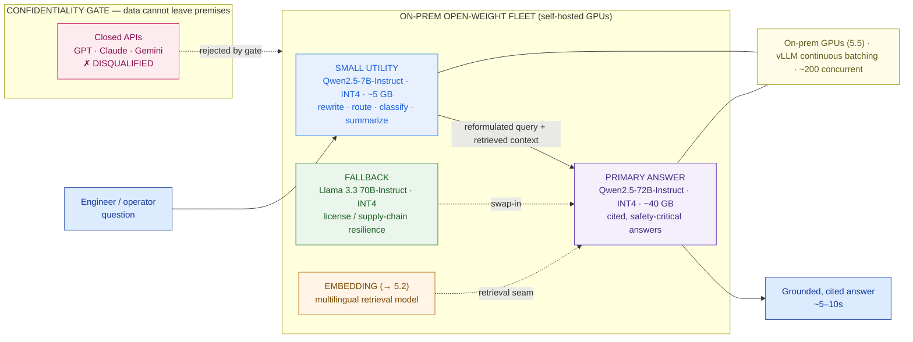

# Model-Selection Matrix — Bumi Energi (worked example)

> This is `template-model-selection-matrix.md` filled in for the running Phase 5 customer. It shows what "good" looks like: the confidentiality gate applied first (every closed API struck before quality), a defended 72B primary at INT4, a small utility model so the platform doesn't run one giant model for everything, a license-diverse fallback, and the latency/GPU tension handed cleanly to 5.5.

**Customer:** Bumi Energi (fictional)  ·  **Industry:** Indonesian energy (oil & gas / power)
**Prepared by:** SA — Presales  ·  **Date:** 2026-07-05  ·  **Opportunity:** Internal AI assistant for engineers/operators  ·  **Version:** v0.2
**Decisive constraint:** **Absolute confidentiality** — technical/engineering/safety/regulatory data **cannot leave premises / cannot go to public LLM APIs** (IP + regulatory residency) → **drives the gate to self-hosted open-weight (§2).**

**Company shape (from discovery):** ~12,000 employees · ~2,000 named users · ~200 concurrent at peak · business-hours load · target answer latency ~5–10s · retrieval corpus ~5M documents (~40M pages) across SharePoint, file shares, scanned PDFs · cost-sensitive GPU budget · small in-house ML/platform team · safety-critical accuracy (citations + eval + guardrails mandatory) · full auditability.

Legend: **open-weight** = weights self-hosted on Bumi Energi's on-prem GPUs (never leaves the fence) · **quant** = quantization (INT4 = 0.5 bytes/param, the size↔quality lever) · **VRAM ≈ params × bytes/param** + ~20–40% KV/overhead · verdict = **eval-confirmed** (5.6), not leaderboard.

---

## 1. Requirements (what bounds the choice)

| Requirement | Value | Why it matters to model choice |
|---|---|---|
| Named users / concurrency | ~2,000 users / ~200 concurrent peak | Serving scale for 5.5 |
| Answer latency target | ~5–10 s | Caps how big the primary can be |
| **Data sensitivity** | **Confidential + regulated** | **Closes the gate: no public APIs** |
| Cost posture | **Cost-sensitive** (GPU sizing is make-or-break) | Push to INT4; right-size the fleet |
| Team capacity | **Small** ML/platform team | Off-the-shelf instruct + RAG over fine-tuning |
| Accuracy stakes | **Safety-critical** (wrong answer is dangerous) | INT4 floor; eval + guardrails mandatory |
| Languages / domain | Indonesian + English; technical/safety/regulatory | Needs multilingual + technical grounding — general benchmarks won't measure it |

## 2. The gate — open-weight vs closed API

**Can Bumi Energi's data go to a public LLM API?**  **NO** — confidentiality is absolute (IP + regulatory residency).

→ **Self-host open-weight models on on-prem GPUs. Every closed API is disqualified before quality is discussed.**

**Shelf chosen: open-weight, self-hosted** — because the corpus is confidential, safety-critical, and regulated; the very first filter is not "which is smartest?" but "which are we *allowed to run inside the fence?*"

## 3. Candidate matrix

> Closed APIs listed only to show they were considered and struck by the gate. QUALITY scores are placeholders to be filled by the 5.6 eval on Bumi Energi's own safety/technical question set — never taken from a raw leaderboard.

| Candidate | Params | Context | License | VRAM @ INT4 | ~Latency | Self-host? | Quality (eval → 5.6) | Verdict |
|---|---|---|---|---|---|---|---|---|
| GPT-4o / GPT-4.1 | n/a | 128K–1M | closed API | n/a | low | **✗ vendor** | n/a | **✗ gate (confidentiality)** |
| Claude Sonnet | n/a | 200K | closed API | n/a | low | **✗ vendor** | n/a | **✗ gate (confidentiality)** |
| Gemini Pro | n/a | 1M–2M | closed API | n/a | low | **✗ vendor** | n/a | **✗ gate (confidentiality)** |
| **Qwen2.5-72B-Instruct** | 72B | 128K | Qwen License | ~40 GB | ~6–16s | ✓ | `<eval>` | **✅ PRIMARY** |
| **Llama 3.3 70B-Instruct** | 70B | 128K | Llama Community | ~40 GB | ~6–16s | ✓ | `<eval>` | **✅ FALLBACK primary** |
| Mistral Small 3 (24B) | 24B | 128K | **Apache 2.0** | ~14 GB | faster | ✓ | `<eval>` | Mid-tier candidate (cleanest license) — hold |
| Gemma 3 27B | 27B | 128K | Gemma Terms | ~16 GB | faster | ✓ | `<eval>` | Mid-tier candidate — hold |
| DeepSeek-V3 | 671B MoE | 128K | **MIT** | ~350 GB* | — | ✓✓ | `<eval>` | Frontier quality but needs a GPU **rack** — rejected on cost |
| **Qwen2.5-7B-Instruct** | 7B | 128K | **Apache 2.0** | ~5 GB | fast | ✓ | `<eval>` | **✅ SMALL utility model** |

\* MoE: all experts in VRAM (memory ∝ total params = 671B), only ~37B active per token (speed ∝ active params). Saves compute, not memory → still a rack of GPUs → rejected for a cost-sensitive shop.

## 4. Right-size the fleet (not one giant model for everything)

| Role | Model | Quant | ~VRAM | License | Why this role |
|---|---|---|---|---|---|
| **Primary (quality-critical)** | Qwen2.5-72B-Instruct | INT4 (→INT8 if eval demands) | ~40 GB (INT4) / ~72 GB (INT8) | Qwen License | Cited, safety-critical answers; multilingual + technical + 128K context |
| **Small utility (lightweight)** | Qwen2.5-7B-Instruct | INT4 | ~5 GB | Apache 2.0 | Query rewrite, routing, classification, cheap summarization — keeps the big GPU reserved for answers |
| **Fallback primary** | Llama 3.3 70B-Instruct | INT4 | ~40 GB | Llama Community | License/supply-chain resilience; identical vLLM serving, drop-in swap |
| **Embedding** (→ 5.2) | multilingual retrieval model (e.g. BGE-M3 / multilingual-e5) | — | small | open | Seam reserved; chosen in 5.2 with the vector store (must handle Indonesian + English) |

## 5. Quantization & VRAM

```
 VRAM(weights) ≈ params × bytes-per-param     (FP16=2.0 · INT8=1.0 · INT4=0.5)
 + KV cache & runtime overhead: add ~20–40% (grows with context × concurrency)

 Primary Qwen2.5-72B @ INT4 ... 72 × 0.5 ≈ 36–40 GB → fits ONE 80 GB GPU (H100/A100)
                     @ INT8 ... 72 × 1.0 ≈ 72 GB    → one 80 GB GPU or a small TP pair
 Small  Qwen2.5-7B   @ INT4 ...  7 × 0.5 ≈  4–5 GB  → shares a GPU or runs tiny
 Default INT4. Step up to INT8 ONLY if the 5.6 eval shows INT4 degrades the
 safety-critical question set. NEVER below INT4 — a wrong safety answer is a hazard.
```

## 6. Latency vs GPU cost (sanity-check, then hand to 5.5)

```
 72B @ INT4, single stream ..... ~30–50 tokens/sec (assumption)
 Grounded answer length ........ ~300–500 tokens (assumption)
 Single-stream generation ...... ~6–16 s  vs target ~5–10 s (near/over on ONE stream)
 Levers to land inside 5–10s:
   • INT4 (not FP16) → faster memory-bound decode
   • vLLM continuous batching → serve ~200 concurrent without linear slowdown
   • cap answer length + STREAM tokens → perceived latency drops
   • the 7B model absorbs non-answer tasks → big GPU reserved for answers
 → Model choice makes ~5–10s FEASIBLE. The GPU COUNT that guarantees it at
   200 concurrent (business-hours) is the sizing exercise in Lesson 5.5.
```

## 7. Decision log

| # | Decision | Alternative rejected | Why | Owner |
|---|---|---|---|---|
| 1 | Self-host open-weight on on-prem GPUs | Closed API (GPT/Claude/Gemini) | Confidentiality gate — data cannot leave premises (IP + regulatory residency) | SA |
| 2 | Qwen2.5-72B-Instruct primary @ INT4 | Llama 3.3 70B / FP16 | Multilingual + technical grounding; INT4 fits one 80 GB GPU on a cost-sensitive budget | SA |
| 3 | Primary + 7B utility fleet | One 72B for every task | 72B for lightweight tasks burns scarce GPU; right tool per task | SA |
| 4 | Llama 3.3 70B named fallback | Single-model dependency | License/supply-chain resilience; swap without re-architecting | SA |
| 5 | INT8 as conditional safety valve | INT4 unconditionally | Safety-critical accuracy — step up if eval shows INT4 hurts the critical set | SA |
| 6 | DeepSeek-V3 671B rejected | Run the frontier open model | MoE keeps all experts in VRAM → a GPU rack → fails the cost constraint | SA |
| 7 | Verdict confirmed by our eval (5.6) | Leaderboard rank ("#1 this week") | Contamination + task mismatch; the corpus is bilingual + domain-specific | SA |

**One-sentence defense:**
> Because Bumi Energi's data cannot leave its premises, we self-host open-weight models on-prem — a Qwen2.5-72B-Instruct primary at INT4 for cited, safety-critical answers, a small Qwen2.5-7B for the cheap tasks around it, and a Llama 3.3 70B fallback for resilience — a fleet that fits the GPU budget, keeps ~5–10s in reach, and clears the license review, with the final pick confirmed by our own eval, not a leaderboard.

---

## 8. Model fleet diagram



### ASCII fallback

```
   ✗ CLOSED APIs (GPT/Claude/Gemini) ── struck by the CONFIDENTIALITY GATE ──┐
                                                                              │ (data can't leave)
   question ─▶ [ SMALL 7B utility ] ── reformulated query + context ─▶ [ PRIMARY 72B @ INT4 ] ─▶ answer
                Qwen2.5-7B INT4 ~5GB       (embedding retrieval, 5.2)          Qwen2.5-72B  ~40GB     ~5–10s, cited
                rewrite/route/classify                                        [ FALLBACK: Llama 3.3 70B ] swap-in
                                                                              └── on-prem GPUs + vLLM batching (5.5) ──┘
```

---

## 9. Open items & handoffs

- **Embeddings & vector DB (5.2):** choose the multilingual embedding model (Indonesian + English) and the vector store (Milvus/Qdrant) for the ~5M docs / ~40M pages.
- **RAG architecture (5.3):** chunking of scanned PDFs (OCR quality is a real risk here), retrieval, and how the small model rewrites queries into the primary's context.
- **Serving & GPU sizing (5.5):** the GPU count and topology (tensor parallelism, vLLM continuous batching) that *guarantees* ~5–10s at 200 concurrent; firm up the INT4-vs-INT8 hardware delta.
- **Evaluation, guardrails & responsible AI (5.6):** the safety-critical eval set that confirms the primary and the INT4-vs-INT8 call; citations + refusal + PII guardrails.
- **LLMOps & AI gateway (5.7):** route lightweight vs answer traffic to the right model; log every call for full auditability.

**So what (the pivot this matrix buys you):** instead of a GPT demo Bumi Energi legally can't ship, they get a defended on-prem fleet — a 72B primary for safety-critical answers, a 7B for the cheap work, a 70B fallback for resilience — that fits a cost-sensitive GPU budget and keeps ~5–10s in reach. This is the model layer of **Capstone E (Private AI Platform)** and the direct input to the **5.5 GPU sizing sheet**.
