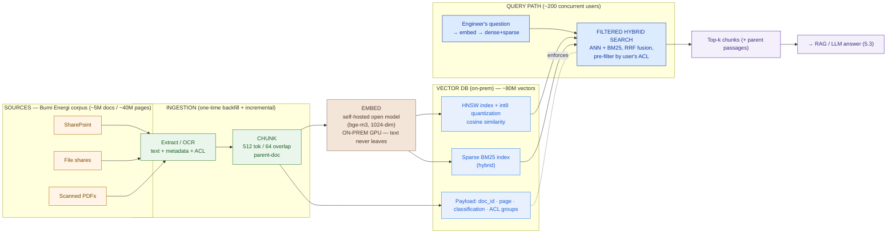
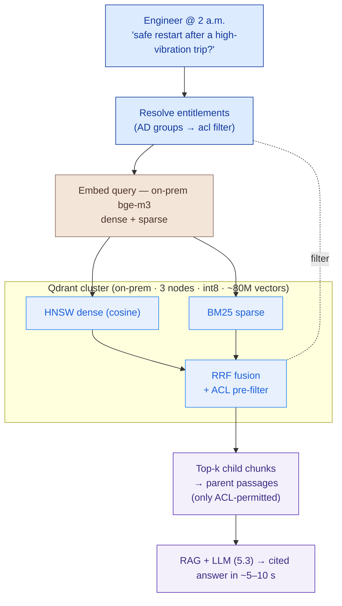

# Embeddings & Vector Databases

> Keyword search can't answer *"why did we shut Line 3?"* across 40 million pages. Turn meaning into vectors, pick a store that scales and filters, and keep every vector on-prem — because embedding confidential text through a public API *is* a data leak.

**Type:** Design
**Track:** AI, Data & Infrastructure Solution Architect (Presales)
**Prerequisites:** 5.1 LLM & Model Landscape
**Time:** ~5h
**Lab:** local vector DB
**Ship It:** Vector-store design

## The Problem

Bumi Energi's field engineers already have the answer to almost every question — it's just buried. The company is an Indonesian energy operator: ~12,000 employees, and a confidential corpus of roughly **5 million documents / 40 million pages** — operating procedures, HAZOP studies, incident reports, equipment manuals, permits, and a mountain of **scanned PDFs** — spread across SharePoint, aging file shares, and departmental drives. When a control-room engineer at 2 a.m. types *"what's the safe restart sequence for the No. 2 compressor after a high-vibration trip?"* into the intranet search box, they get keyword hits: every document containing the words "compressor" and "restart," ranked by how often those words appear. The one procedure they actually need — filed under "reciprocating machinery — post-trip recovery," never using the word "restart" — is on page 340 of the results. In a safety-critical plant, that's not an inconvenience; it's the gap between a controlled restart and an incident report.

What the engineer wants is **search by meaning**, not by matching characters. That is exactly what **embeddings** and a **vector database** give you: represent every chunk of text as a vector of numbers that captures its *meaning*, store 80-odd million of those vectors in a database built to find the nearest ones fast, and now "safe restart sequence after a trip" retrieves "post-trip recovery procedure" even though they share almost no words. This is the retrieval engine underneath every RAG system, every AI copilot, every "chat with your documents" demo — and it is the foundation of Bumi Energi's **Private AI Platform (Capstone E)**.

But at 40 million pages, with a corpus this sensitive, the naive version fails three ways — and each failure is one an unprepared SA walks straight into. **Mistake one — the wrong embedding model.** You reach for OpenAI's `text-embedding-3` because it tops the benchmarks, and you've just proposed shipping every confidential HAZOP and incident report to a public API to be embedded. For a safety-critical operator that legally and contractually cannot let its corpus leave the building, that is an instant disqualification — *the embedding model itself is a confidentiality decision, not a quality one.* **Mistake two — no chunking strategy.** You embed whole 80-page manuals as single vectors (most models won't even accept that many tokens), or you split blindly mid-sentence, and retrieval returns mush — the right document, the wrong paragraph, or nothing at all. **Mistake three — a vector store that can't do the job.** You prototype on `pgvector` with 50,000 rows, it's lovely, and then you try to scale it to 80 million vectors with sub-second latency, keyword-plus-semantic *hybrid* search, and — the one everybody forgets — **per-document access control** so an engineer never retrieves a page they're not cleared to see. The demo that dazzled at 50k rows collapses at 80M, and the deal collapses with it. This lesson is how you design the retrieval store so none of that happens.

## The Concept

An architect doesn't operate a vector database — you **size and choose** one. To do that you need six ideas in your head at once: what an embedding *is*, how to **chunk** the corpus, which **vector database** and **index** to store it in, how to **measure** similarity, how to combine semantic with keyword (**hybrid**) search, and how to enforce **access control** with metadata. Build them in that order.

### Embeddings: meaning as coordinates

An **embedding** is a fixed-length list of numbers — a **dense vector** — produced by a neural model that has learned to place text with similar *meaning* at nearby points in a high-dimensional space. "Compressor restart" and "post-trip machinery recovery" land close together; "compressor restart" and "employee leave policy" land far apart — even though the first pair shares no keywords and the second shares one. Search becomes geometry: embed the question, find the nearest chunk vectors, return their text.

```
   MEANING-SPACE (shown in 2-D; real models use 384–1024 dimensions)

        ▲                    ● "post-trip recovery procedure"
        │                 ●  "safe restart after vibration trip"   ← query lands here
        │              ● "reciprocating compressor manual"
        │
        │                                    ● "annual leave request form"
        │                                 ● "HR onboarding checklist"
        └───────────────────────────────────────────────────▶
   Nearest neighbours = most similar MEANING, not most shared words.
   A vector DB's whole job: given the query point, find the k nearest of 80M points — fast.
```

Two properties drive every downstream decision. **Dimensions** — how many numbers per vector (typically 384, 768, or 1024) — set both retrieval quality and storage cost: more dimensions usually means richer meaning but more RAM and slower search. **The model that produces them must run somewhere** — and *that* is where confidentiality bites. Embedding text means feeding it through the model; if the model is a public API, your text goes to the vendor. For Bumi Energi that rules out `text-embedding-3` (OpenAI), Cohere Embed, and Voyage — all public-API-only. The answer is a **self-hostable open embedding model** you run inside the plant network:

| Open family | Example models (dims) | Why an architect reaches for it |
|---|---|---|
| **BGE** (BAAI) | `bge-large-en-v1.5` (1024), **`bge-m3`** (1024, multilingual, dense+sparse+multi-vector) | Top open scores; `bge-m3` does dense **and** sparse in one model — a hybrid-search shortcut |
| **E5** (Microsoft) | `e5-large-v2` (1024), `multilingual-e5-large` (1024) | Strong multilingual (EN + Bahasa Indonesia); battle-tested |
| **GTE** (Alibaba) | `gte-large-en-v1.5` (1024), `gte-Qwen2-1.5B-instruct` (larger) | Competitive quality; longer context windows |
| **Nomic / Jina** | `nomic-embed-text-v1.5` (768), `jina-embeddings-v3` | Smaller/faster when 768 dims is enough |

Rank open models on the public **MTEB** leaderboard (Massive Text Embedding Benchmark) for *retrieval*, then filter to what you can self-host and what covers your languages. For a bilingual EN/Indonesian corpus, a multilingual model (`bge-m3`, `multilingual-e5-large`) is not optional.

### Chunking: the decision that makes or breaks retrieval

You do not embed whole documents. Models have a token limit (often 512–8192 tokens), and — more importantly — a single vector for an 80-page manual averages all its meaning into mush. So you **chunk**: split each document into passages, embed each passage, and store one vector per chunk. Chunking is the highest-leverage, most-overlooked decision in the whole design — get it wrong and no database or model can save the retrieval.

| Strategy | How it splits | Trade-off |
|---|---|---|
| **Fixed-size** | Every N tokens (e.g. 512), hard cut | Simplest; but slices mid-sentence, mid-table, mid-procedure-step → broken context |
| **Fixed + overlap** | N tokens with an M-token overlap (e.g. 512/64) | Overlap heals boundary cuts so a straddling answer survives; the pragmatic default |
| **Semantic / structural** | Split on real boundaries — headings, paragraphs, procedure steps, sentence groups | Chunks are coherent units; needs a document parser and costs more to build |
| **Parent-document** | Embed *small* child chunks for precise matching, but return the *larger* parent passage to the LLM | Best of both: precise retrieval, full context in the answer — the pattern serious RAG uses |

The knobs: **chunk size** (small = precise but context-poor; large = context-rich but fuzzy and fewer per page) and **overlap** (~10–20% typically). Chunk size also drives your vector *count* — and the vector count drives the entire sizing. Chunking is where a good retrieval store is won or lost, long before you pick a database.

### Vector databases, ANN indexes, and the recall↔speed↔memory triangle

Finding the true nearest neighbours of a query among 80 million vectors by brute force (compare against all 80M) is exact but far too slow. **Vector databases** use an **Approximate Nearest Neighbour (ANN)** index that trades a little *recall* (you might miss a few of the true top-k) for orders-of-magnitude more speed. Two index families dominate:

- **HNSW (Hierarchical Navigable Small World)** — a layered graph you walk from coarse to fine. **High recall, very fast queries, memory-hungry** (the graph and usually the vectors live in RAM). The default for most vector DBs.
- **IVF (Inverted File)** — cluster the vectors into *lists*, and at query time search only the nearest few lists (`nprobe`). **Lower memory, needs a training step, tunable** recall vs speed via `nprobe`. Pairs with **PQ (Product Quantization)** to shrink vectors hard (IVF-PQ) when RAM is the binding constraint. **DiskANN** is a disk-resident cousin for billion-scale on limited RAM.

```
   THE ANN TRADE-OFF TRIANGLE — you cannot max all three; pick two, tune the third.

                    RECALL (find the true neighbours)
                            ▲
                           ╱ ╲
                          ╱   ╲
             HNSW: recall+speed, pays in RAM
                        ╱       ╲
                       ╱         ╲
                      ╱  IVF-PQ:  ╲
                     ╱ speed+memory,╲
                    ╱  pays in recall ╲
      SPEED ◀──────────────────────────────▶ MEMORY / $
   Lever 1: index type (HNSW vs IVF vs IVF-PQ vs DiskANN)
   Lever 2: quantization (fp32 → int8 scalar → product/binary) shrinks RAM, costs recall
   Lever 3: HNSW M / ef, or IVF nprobe — turn recall up or latency down
```

**Similarity metric.** How "near" is measured: **cosine** (angle between vectors — the default, since most embedding models are trained for it; normalize vectors and it equals **dot product / inner product**) or **Euclidean (L2)**. Match the metric the model was trained on — mismatching it silently wrecks recall.

### Hybrid search: semantic *and* keyword

Dense embeddings are brilliant at meaning and terrible at exact tokens. Ask for equipment tag **"P-2301B"**, procedure code **"SOP-4471"**, or a specific chemical name, and a pure semantic search may drift to *similar-looking* tags — dangerous in a safety context. Classic **keyword search (BM25)** nails exact terms but misses meaning. **Hybrid search** runs both — dense ANN *and* sparse BM25 — and fuses the two ranked lists, usually with **RRF (Reciprocal Rank Fusion)**. You get meaning *and* exact-match. (`bge-m3` conveniently emits both a dense and a sparse vector, so one model feeds both halves.)

### Metadata filtering: access control that can't be skipped

Every chunk carries a **payload** of metadata — `doc_id`, `source`, `page`, `classification`, and the **access groups** allowed to see it. At query time the search is **filtered** by the requesting user's entitlements *so that an engineer only ever retrieves chunks from documents they're cleared to read*. This must be a **pre-filter applied during the ANN search**, not a filter-after-the-fact: filtering after retrieval leaks the *existence* of restricted documents and wrecks recall (the top-k fills with results the user then can't see). In a safety-critical, confidential estate, document-level access control is a hard requirement — and it's the single most common reason a toy prototype can't become a production platform.

### The pipeline, end to end



Read it left to right: sources are extracted and **chunked**, each chunk is **embedded by a model that runs inside the plant** (the text never leaves), vectors land in an on-prem **vector DB** with an HNSW index, a sparse index for hybrid, and an ACL payload; at query time the engineer's question is embedded and run through a **filtered hybrid search** that returns only permitted chunks, which flow to the RAG layer (5.3).

## Design It

Bumi Energi's brief, verbatim: **~12,000 employees; a confidential corpus of ~5 million documents / ~40 million pages** (SharePoint, file shares, scanned PDFs); **self-host everything on-prem** — confidentiality forbids any public API, *including public embedding APIs*; **~2,000 users / ~200 concurrent**; **~5–10 s** acceptable answer latency; **safety-critical** and **cost-sensitive**. Design the retrieval store in seven decisions. Every capacity figure is a **design proposal with stated assumptions and ranges** — this HLD proposes; the Phase 5.5 (GPU/serving) and Phase 6 (sizing/BOM) lessons finalize against a real sample and telemetry. The only hard numbers are the pinned corpus figures.

### Step 1 — Embedding model: self-hosted, open, multilingual

The confidentiality constraint decides this before quality does: **no public embedding API**, because embedding the corpus would ship every HAZOP and incident report to a vendor. Choose a **self-hostable open model**, served on an on-prem GPU. Pick **`bge-m3`** (1024 dimensions): it is multilingual (the corpus is EN + Bahasa Indonesia), scores well on MTEB retrieval, handles long inputs, and — decisively — emits a **dense *and* a sparse** vector from one model, so it feeds both halves of hybrid search without a second system. Alternative: `multilingual-e5-large` (1024) if they prefer a simpler dense-only model and run BM25 separately. Design dimension: **1024** (range: drop to a 768-dim model like `nomic-embed-text` only if sizing forces it — it roughly quarters RAM at some recall cost).

### Step 2 — Chunking: parent-document, 512/64, applied to 40M pages

Use **fixed-size-with-overlap child chunks (≈512 tokens, ≈64 overlap) plus parent-document retrieval**: embed small child chunks for precise matching, but return the larger parent section to the LLM so the answer has full context. For structured procedures, split on step/heading boundaries where the parser allows. Now the sizing math — the number every later decision depends on:

```
CHUNK / VECTOR COUNT  (assumptions in ⟨⟩, firm up on a real 10k-doc sample)
─────────────────────────────────────────────────────────────────────────
 Pages ....................... 40,000,000            (PINNED)
 Documents ................... 5,000,000  (⇒ ~8 pages/doc, PINNED)
 Words per page .............. ⟨~500⟩      range 400–600 (scans/forms sparser)
 Tokens per page ............. ⟨~650⟩      (words × ~1.3), range 500–800
 Chunk size / overlap ........ ⟨512 tok / 64⟩  → effective stride ~448 tok
 Chunks per page ............. ⟨~2⟩        range 1.5–3
 ─────────────────────────────────────────────────────────────────────────
 VECTORS (chunks) ............ 40M × 2  ≈  80,000,000     range 60M–120M
```

**~80 million vectors** (design midpoint; carry the 60–120M band forward). This single number sizes the database.

### Step 3 — Vector database: Qdrant (Milvus as the scale-out alternative)

Requirements: **self-host on-prem**, ~80M vectors, HNSW, **quantization** (to fit RAM affordably), **hybrid** (dense + sparse), and **first-class payload filtering** for document-level access control, at ~200 concurrent users. **Qdrant** (Rust, single-binary simplicity, HNSW, built-in scalar/product quantization, sparse-vector hybrid, and filtering applied *inside* the HNSW walk) is the recommended primary — it hits every requirement with the lightest operational footprint for a cost-sensitive team. **Milvus** is the scale-out alternative: purpose-built for billions of vectors, more index types (HNSW, IVF-PQ, DiskANN), GPU indexing — but heavier to run (needs etcd + object storage + a message queue). `pgvector` and `OpenSearch` are compared in *Compare It*; at 80M with hybrid + ACL, Qdrant or Milvus are the serious picks.

### Step 4 — Index & metric: HNSW + int8 quantization + cosine

Index type **HNSW** (the latency budget is generous at 5–10 s end-to-end, but retrieval itself should be well under a second so the LLM gets the rest of the budget). Metric **cosine** (what `bge-m3` is trained for; normalize and it's dot-product). The critical lever is **int8 scalar quantization**: store quantized vectors in RAM and keep the full-precision copies on NVMe for a rescoring pass. This roughly **quarters** the RAM bill versus float32 at a small, tunable recall cost — the difference between "fits a modest cluster" and "needs a RAM monster." HNSW params `M≈16`, `ef_construct≈128`, query `ef` tuned for recall.

### Step 5 — Hybrid search: dense + BM25, fused with RRF

Run **dense ANN and sparse BM25 in parallel and fuse with RRF.** This is not a nice-to-have for Bumi Energi — engineers search by exact equipment tags (`P-2301B`), procedure codes (`SOP-4471`), and P&ID references that pure semantic search will *approximate*, which is unacceptable in a safety context. `bge-m3` supplies both the dense and sparse vectors; Qdrant stores both and fuses at query time.

### Step 6 — Metadata filtering: document-level access control

Every chunk's payload carries `{doc_id, source, page, classification, acl_groups[]}`, populated from the source system's permissions at ingestion (SharePoint/file-share ACLs → chunk payload). At query time, resolve the user's entitlement groups and **pre-filter the search** so the HNSW walk only ever visits chunks the engineer is cleared to see. This keeps restricted procedures — and even their *existence* — invisible, and keeps recall honest (the top-k isn't polluted by results the user can't open). Access control is a first-class field in the vector store, not a bolt-on.

### Step 7 — Sizing: index RAM + storage (assumptions + ranges)

```
RAM & STORAGE SIZING  — 80M vectors, 1024-dim, HNSW, int8 quantization
──────────────────────────────────────────────────────────────────────
 PER-VECTOR
  float32 vector .............. 1024 × 4 B = 4,096 B  (~4 KB)
  int8 quantized vector ....... 1024 × 1 B = 1,024 B  (~1 KB)
  HNSW graph links (M=16) ..... ~128 B/vector

 INDEX RAM  (what must stay in memory)
  Full float32 in RAM ......... 80M × 4 KB + graph ≈ 320 GB + 10 GB ≈ 330 GB
                                → too big for one node; would need heavy sharding
  int8 quantized in RAM ....... 80M × 1 KB + graph ≈  80 GB + 10 GB ≈  90 GB   ✅
                                (full fp32 kept on NVMe for rescoring)
  RAM band (60M–120M vectors) . ~70 GB – ~140 GB quantized

 ON-DISK (NVMe)
  fp32 originals (rescoring) ... 80M × 4 KB ................ ~320 GB
  chunk text (~2 KB/chunk) ..... 80M × 2 KB ................ ~160 GB
  payload + ACL (~0.5 KB) ...... 80M × 0.5 KB .............. ~ 40 GB
  sparse/BM25 index ............ ......................... ~ 50–150 GB
  ─────────────────────────────────────────────────────────
  DISK TOTAL .................. ~600 GB – 1.5 TB

 CLUSTER PROPOSAL (on-prem, cost-sensitive)
  3 nodes · ~128 GB RAM each · NVMe ~1–2 TB each · replication ×2
  → quantized index fits in RAM with headroom; ~200 concurrent served
  Range: 3–6 nodes depending on the 60–120M vector band + replicas
  Embedding backfill: ~80M chunks is a BATCH job — ~1–3 days on a few
  GPUs (one-time), then incremental on new/changed docs. GPU count → 5.5.
```

The headline for Bumi Energi: **the whole retrieval store is a handful of commodity servers with RAM and NVMe — no per-query API cost, and nothing leaves the plant.** Int8 quantization is the move that makes it affordable (90 GB, not 330 GB, of RAM). Flag the assumptions to firm up on a real 10,000-document sample: words/page and chunks/page swing the vector count, and the vector count swings everything.



## Compare It

Four questions decide Bumi Energi's store: **which embedding model**, **which database**, **which index**, and **dense or hybrid**. Name the products and the trade-off a customer will raise.

**Embedding model — open self-hosted vs public API.**

| Option | Hosting | Fit for Bumi Energi (confidential, on-prem) |
|---|---|---|
| **OpenAI `text-embedding-3`, Cohere Embed, Voyage** | Public API only | **Disqualified** — embedding ships confidential text to a vendor. Best-in-class quality is irrelevant if it can't run on-prem |
| **`bge-m3` / `multilingual-e5-large` (open)** | **Self-host** (GPU/CPU) | **✅ Chosen** — runs inside the plant, multilingual, `bge-m3` gives dense+sparse for hybrid. Rank candidates on MTEB retrieval |
| **`nomic-embed-text` / `gte` (open, smaller)** | Self-host | Fallback if sizing forces 768 dims; less RAM, some recall cost |

**Vector database — the four you'll be asked about.**

| Database | Shape | Scale sweet spot | Pick it when… |
|---|---|---|---|
| **Qdrant** | Rust, single-binary, HNSW, quantization, sparse hybrid, filtering *inside* the search | ~1M–1B (sharded) | **✅ Recommended** — full requirements, lightest ops for a cost-sensitive on-prem team |
| **Milvus** | Distributed, many indexes (HNSW/IVF-PQ/DiskANN), GPU indexing | 100M–**billions** | Max scale headroom / GPU indexing, and a team that can run etcd + object store + MQ |
| **OpenSearch (k-NN)** | Search engine: BM25 **+** vector **+** RBAC in one already-deployed system | ~1M–100M | They already run OpenSearch/Elastic and want *one* system for keyword+vector+security |
| **pgvector** | Postgres extension (HNSW/IVFFlat) | **≤ ~1–10M** | Small/medium corpus, or "we already run Postgres, keep it simple." **Stretched at 80M** — not the pick here |

**ANN index — HNSW vs IVF.**

| | **HNSW** | **IVF / IVF-PQ** |
|---|---|---|
| Recall | Very high | Tunable (via `nprobe`), lower at aggressive PQ |
| Query speed | Very fast | Fast; depends on `nprobe` |
| Memory | **High** (graph + vectors in RAM) | **Lower** (PQ shrinks vectors hard) |
| Build | Insert-time, no training | Needs a training/clustering step |
| Reach for it | Default; recall + latency matter, RAM is available | Billion-scale on limited RAM; `DiskANN` when it won't fit memory at all |

**Dense vs hybrid.** Pure **dense** wins on meaning and loses on exact tokens; pure **keyword/BM25** is the reverse. For a safety-critical corpus full of tag numbers and procedure codes, **hybrid (dense + BM25, RRF)** is the defensible default — you cannot have "P-2301A" retrieve procedures for "P-2301B." The "it depends" a customer raises — *"isn't dense enough?"* — is answered by exactly those identifiers: dense alone approximates them, and approximation is a safety risk here.

## Lab — embed a few docs, query by meaning, in 10 minutes

You don't need 80 million vectors to prove the claim. Run a **local Qdrant** (or Chroma), embed a handful of "procedures" with a local open model, and watch a plain-language query find the right one *by meaning* — and a metadata filter enforce access control. Everything runs on your laptop; nothing leaves it (the whole point).

```bash
# --- Setup ------------------------------------------------------------
pip install qdrant-client sentence-transformers        # local, open, offline
# Optional real server:  docker run -p 6333:6333 qdrant/qdrant
```

```python
# lab_vector_store.py  — meaning search + ACL filter, fully local
from qdrant_client import QdrantClient
from qdrant_client.models import Distance, VectorParams, PointStruct, Filter, FieldCondition, MatchValue
from sentence_transformers import SentenceTransformer

model = SentenceTransformer("BAAI/bge-small-en-v1.5")   # small open model, self-hosted
client = QdrantClient(":memory:")                       # in-process; swap for host="localhost"
DIM = model.get_sentence_embedding_dimension()          # 384 for bge-small

client.create_collection("procedures",
    vectors_config=VectorParams(size=DIM, distance=Distance.COSINE))   # cosine, like production

# A few "chunks" from the corpus, each with an ACL group in its payload
docs = [
  ("Reciprocating compressor: post-trip recovery. After a high-vibration trip, "
   "verify lube-oil pressure, bar the machine over, then restart per sequence.", "ops"),
  ("Annual leave requests must be filed 14 days in advance in the HR portal.",    "hr"),
  ("Gas turbine hot-restart is prohibited within 20 minutes of a flame-out.",     "ops"),
  ("Board of Directors compensation policy, FY2026 — CONFIDENTIAL.",              "exec"),
]
pts = [PointStruct(id=i, vector=model.encode(t).tolist(), payload={"text": t, "acl": g})
       for i, (t, g) in enumerate(docs)]
client.upsert("procedures", pts)

# An ops engineer asks in plain language — no shared keywords with the target doc
q = "how do I safely start the compressor again after it shut down on vibration?"
qv = model.encode(q).tolist()

# Filtered hybrid-ish search: only docs this user's group ("ops") may see
hits = client.query_points("procedures", query=qv, limit=3,
        query_filter=Filter(must=[FieldCondition(key="acl", match=MatchValue(value="ops"))])).points

for h in hits:
    print(f"{h.score:.3f}  [{h.payload['acl']}]  {h.payload['text'][:70]}...")
# → the post-trip recovery chunk ranks #1 by MEANING, and the CONFIDENTIAL
#   exec doc never appears — the ACL pre-filter removed it from the search.
```

What you proved at architect altitude: **(1)** a query with *no keyword overlap* found the right procedure by **meaning** — that's the embedding; **(2)** it ran on a **self-hosted open model**, offline, nothing leaving the machine — that's the confidentiality story; **(3)** a **metadata filter** made a restricted document *invisible* to the search, not just hidden after the fact — that's document-level access control. Scale this from 4 chunks to 80M, add int8 quantization and a sparse index, and you have Bumi Energi's retrieval store.

## Ship It

This lesson ships a reusable **Vector-Store Design** — the deliverable you produce once the embedding-and-retrieval approach is chosen and before GPU/serving (5.5) and final BOM (Phase 6). It walks a customer and their platform team through the store in the order the decisions must be made. Both files live in [`outputs/`](../outputs/):

- **[`template-vector-store-design.md`](../outputs/template-vector-store-design.md)** — a fill-in-the-blank design: embedding model → chunking → database → index/metric → hybrid → metadata/ACL → sizing math (RAM + storage with assumptions and ranges), plus a Mermaid pipeline skeleton, an ASCII sizing block, and a decision log.
- **[`example-bumi-energi-vector-store-design.md`](../outputs/example-bumi-energi-vector-store-design.md)** — the template fully worked for Bumi Energi (~5M docs / ~40M pages → ~80M vectors, `bge-m3`, Qdrant + HNSW + int8, hybrid, ACL filtering, ~90 GB RAM cluster), so the skeleton isn't abstract. It is the retrieval layer of **Capstone E** and hands off to **5.3 (RAG)**.

The point of shipping this: the design is where you *defend* the un-obvious calls — an open self-hosted model over the benchmark leader, chunking as the make-or-break, quantization as the affordability lever, and access control as a first-class field — and where you put a RAM/storage range in front of the customer before anyone quotes a RAM monster or a public API that can't run on-prem.

## Exercises

1. **(Easy)** In three sentences an SA could say to Bumi Energi's platform lead, explain why the embedding model must be **self-hosted and open** rather than the top-ranked public API — name the confidentiality mechanism (embedding = sending text to the model), the model you'd pick, and the one property (`dense+sparse` in one model) that simplifies hybrid search. Then label each chunking strategy (fixed / fixed+overlap / semantic / parent-doc) with the one word that captures its trade-off.

2. **(Medium)** Re-run the Step 2 sizing math with a **different chunking choice**: 256-token chunks with 32 overlap (finer chunks) on the same 40M pages. Show the new vector count and its effect on **index RAM** (int8) and **NVMe** storage, with assumptions and a range. Then re-map the design for a **different customer** — a **mid-size Indonesian bank** building a customer-support copilot over ~500k policy/product PDFs — and note which single decision changes most (hint: scale drops two orders of magnitude — does `pgvector` come back into play?) and why the *access-control* requirement gets *stricter*, not looser.

3. **(Hard)** Bumi Energi's new head of digital, fresh from a startup, mandates: *"Just use OpenAI embeddings and Pinecone — self-hosting a vector DB is a science project."* Write a half-page rebuttal for the steering committee. Use the confidentiality constraint to disqualify the public embedding API outright, the Step 7 sizing block (assumptions + ranges) to show the on-prem store is a few commodity servers with no per-query cost, concede where managed/cloud genuinely wins (zero ops, elastic scale, thin-skills teams), and present the open-model-plus-Qdrant alternative with what it hands to **5.3 (RAG)** and **5.5 (GPU sizing)**. Save it beside your worked Bumi Energi design — you'll reuse this reasoning in **Capstone E**.

## Key Terms

| Term | What people say | What it actually means |
|------|-----------------|------------------------|
| Embedding | "A vector" | A dense list of numbers a model produces so that text with similar *meaning* sits at nearby points — the thing that makes search-by-meaning possible. |
| Dimensions | "The size" | How many numbers per vector (384/768/1024). More can mean richer meaning but more RAM and slower search — a cost lever, not just a quality knob. |
| Open embedding model | "The embedder" | A self-hostable model (BGE/E5/GTE) you run on-prem, so confidential text is never sent to a vendor. For a private corpus, this is a confidentiality decision, not a quality one. |
| Chunking | "Splitting the docs" | Breaking documents into passages, one vector each. The highest-leverage, most-overlooked retrieval decision; size + overlap + strategy make or break relevance — and set the vector count. |
| Parent-document retrieval | "Smart chunking" | Embed small *child* chunks for precise matching but return the larger *parent* passage to the LLM — precise retrieval with full context. What serious RAG uses. |
| Vector database | "A database for vectors" | A store with an ANN index built to find the nearest vectors among tens of millions fast (Qdrant, Milvus, OpenSearch, pgvector) — plus payload filtering and, ideally, hybrid. |
| ANN | "Nearest-neighbour search" | Approximate Nearest Neighbour — trades a little recall for huge speed vs brute force. The reason 80M-vector search returns in milliseconds. |
| HNSW | "The index" | Hierarchical Navigable Small World — a layered graph giving high recall and fast queries, at the price of keeping the graph (and usually vectors) in RAM. The default index. |
| IVF / PQ | "The other index" | Inverted File clusters vectors into lists searched via `nprobe`; Product Quantization compresses vectors hard. Lower RAM, tunable recall — the billion-scale / tight-RAM option. |
| Quantization | "Compression" | Storing vectors at lower precision (fp32 → int8 → binary). int8 roughly quarters RAM at a small recall cost — the lever that makes a large index affordable. |
| Cosine / dot product | "The distance" | How similarity is measured — angle (cosine) or inner product between vectors. Must match what the model was trained on, or recall silently collapses. |
| Hybrid search | "Semantic search" | Dense (meaning) **plus** sparse BM25 (exact keywords), fused with RRF. Needed wherever exact tags/codes matter — you can't let "P-2301A" match "P-2301B." |
| BM25 | "Keyword search" | The classic sparse keyword-ranking algorithm — great at exact terms, blind to meaning. The other half of hybrid search. |
| Metadata filtering | "Access control" | Filtering the search by a chunk's payload (ACL groups, classification) *during* the ANN walk, so a user only ever retrieves permitted documents — a hard requirement, not a bolt-on. |
| MTEB | "The benchmark" | Massive Text Embedding Benchmark — the leaderboard you rank open embedding models on (for *retrieval*) before filtering to what you can self-host. |

## Further Reading

- [MTEB — Massive Text Embedding Benchmark leaderboard](https://huggingface.co/spaces/mteb/leaderboard) — where you rank open embedding models on retrieval before filtering to self-hostable ones; the first stop when choosing a model.
- [BGE / `bge-m3` (BAAI, FlagEmbedding)](https://github.com/FlagOpen/FlagEmbedding) — the recommended open, multilingual, dense+sparse embedding model; read the `bge-m3` card to see why one model feeds hybrid search.
- [Qdrant documentation — quantization & filtering](https://qdrant.tech/documentation/guides/quantization/) — the RAM-saving int8/product/binary quantization and the filtered-HNSW mechanism this design leans on; read these two to defend the ~90 GB sizing.
- [Milvus documentation](https://milvus.io/docs) — the billion-scale alternative; skim the index-types page (HNSW / IVF-PQ / DiskANN) to know when you'd move up from Qdrant.
- [pgvector](https://github.com/pgvector/pgvector) and [OpenSearch k-NN](https://opensearch.org/docs/latest/search-plugins/knn/index/) — the two "you already run it" options; read one page of each to place them against Qdrant/Milvus for a customer who wants fewer moving parts.
- [Pinecone — Hierarchical Navigable Small Worlds (HNSW)](https://www.pinecone.io/learn/series/faiss/hnsw/) and [Nearest-neighbour indexes overview](https://www.pinecone.io/learn/series/faiss/vector-indexes/) — the clearest plain-language explanation of HNSW vs IVF and the recall/speed/memory trade you must be able to draw on a whiteboard.
- [Reciprocal Rank Fusion (RRF) — original paper (Cormack et al.)](https://plg.uwaterloo.ca/~gvcormk/cormacksigir09-rrf.pdf) — the simple, robust way hybrid search fuses dense and keyword result lists; two pages, and you'll cite it for the rest of your career.
- [Anthropic — Contextual Retrieval](https://www.anthropic.com/news/contextual-retrieval) — a practical write-up on why chunking and hybrid retrieval decide RAG quality more than the model does; the empirical backing for "chunking makes or breaks it."
