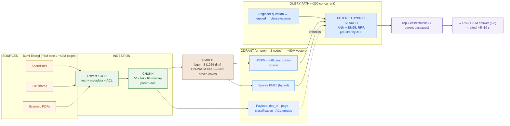

# Vector-Store Design — Bumi Energi (worked example)

> This is `template-vector-store-design.md` filled in for the running Phase 5 customer. It shows what "good" looks like: an open self-hosted embedding model defended against the benchmark leader, chunking that turns 40M pages into ~80M vectors, a Qdrant + HNSW + int8 store sized to ~90 GB of RAM, hybrid search for exact tag numbers, and document-level access control as a first-class field.

**Customer:** Bumi Energi (fictional)  ·  **Industry:** Indonesian energy operator
**Prepared by:** SA — Presales  ·  **Date:** 2026-07-05  ·  **Opportunity:** Private AI Platform (Capstone E) — retrieval layer  ·  **Version:** v0.2
**Key operating constraint:** **Confidential corpus, self-host everything on-prem — no public APIs, including no public embedding APIs** + **safety-critical** + **cost-sensitive** → **drives an open self-hosted model (§1) and document-level access control (§6).**

**Company shape (pinned):** ~12,000 employees · confidential corpus **~5 million documents / ~40 million pages** (SharePoint, file shares, scanned PDFs) · ~2,000 users / ~200 concurrent · ~5–10 s acceptable answer latency · safety-critical · cost-sensitive.

Legend: **embedding** = text → meaning vector · **chunk** = one passage, one vector · **ANN** = HNSW approximate nearest-neighbour index · **hybrid** = dense + sparse BM25 fused with RRF · **payload/ACL** = per-chunk metadata that filters search by who may see it · **quantization** = int8 vectors to shrink RAM.

---

## 1. Embedding model

| Option | Hosting | Fit for Bumi Energi |
|---|---|---|
| OpenAI `text-embedding-3` / Cohere / Voyage | Public API only | **Disqualified** — embedding ships confidential HAZOP/incident text to a vendor; benchmark score is irrelevant if it can't run on-prem |
| **`bge-m3` (BAAI, open)** | **Self-host, on-prem GPU** | **✅ Chosen** — multilingual (EN + Bahasa Indonesia), strong MTEB retrieval, long inputs, emits **dense + sparse** from one model → feeds hybrid |
| `multilingual-e5-large` (open) | Self-host | Solid dense-only fallback; run BM25 separately |
| `nomic-embed-text` (768, open) | Self-host | Only if sizing forces 768 dims — ~¼ less RAM, some recall cost |

**Chosen model:** **`bge-m3`** — **dimensions: 1024** — **languages: EN + Bahasa Indonesia** — **dense+sparse: yes** (one model feeds both halves of hybrid search).
**Defense:** *We self-host an open model because embedding text means sending it through the model — a public embedding API would export the entire confidential corpus. `bge-m3` is multilingual, ranks well on MTEB retrieval, and gives us dense and sparse vectors from a single model, so hybrid search needs no second embedding system.*

## 2. Chunking strategy → vector count

**Chosen:** fixed-size **child chunks ≈512 tokens / ≈64 overlap** + **parent-document retrieval** (embed small children for precise matching, return the larger parent section to the LLM). Split on procedure-step / heading boundaries where the OCR + parser allow.

```
CHUNK / VECTOR COUNT  (assumptions in ⟨⟩ — firm up on a real 10k-doc sample)
─────────────────────────────────────────────────────────────────────────
 Pages ....................... 40,000,000            (PINNED)
 Documents ................... 5,000,000  (⇒ ~8 pages/doc, PINNED)
 Words per page .............. ⟨~500⟩      range 400–600 (scans/forms sparser)
 Tokens per page ............. ⟨~650⟩      (words × ~1.3), range 500–800
 Chunk size / overlap ........ ⟨512 / 64⟩  → effective stride ~448 tok
 Chunks per page ............. ⟨~2⟩        range 1.5–3
 ─────────────────────────────────────────────────────────────────────────
 VECTORS (chunks) ............ 40M × 2  ≈  80,000,000     range 60M–120M
```

**Vector count (design midpoint): ~80 million** (carry 60–120M forward — it sizes RAM, disk, and node count).

## 3. Vector database

| Database | Scale sweet spot | Chosen? | Why / why not |
|---|---|---|---|
| **Qdrant** | ~1M–1B (sharded) | **✅** | Lightest self-host ops for a cost-sensitive team; HNSW + built-in int8/PQ quantization + sparse-vector hybrid + filtering *inside* the HNSW walk — hits every requirement |
| **Milvus** | 100M–billions | Alt | Scale-out alternative: more index types (IVF-PQ/DiskANN) + GPU indexing, but needs etcd + object store + message queue — heavier to run |
| **OpenSearch (k-NN)** | ~1M–100M | No | Would fold keyword+vector+RBAC into one system if they already ran it — they don't |
| **pgvector** | ≤ ~1–10M | No | Great for small corpora; **stretched at 80M** with hybrid + ACL |

**Chosen DB: Qdrant** (Milvus as the documented scale-out path if the corpus grows past a few hundred million vectors).
**Defense:** *Qdrant self-hosts as a single service, does HNSW + int8 quantization + sparse hybrid + payload filtering natively, and applies the access-control filter during the search — everything Bumi Energi needs with the smallest operational surface.*

## 4. Index & metric

| Item | Decision | Rationale |
|---|---|---|
| Index type | **HNSW** (`M=16`, `ef_construct=128`, query `ef` tuned) | High recall + fast queries; retrieval must be well under 1 s so the LLM keeps most of the 5–10 s budget |
| Similarity metric | **Cosine** (normalize → dot product) | What `bge-m3` is trained for; a mismatched metric silently wrecks recall |
| Quantization | **int8 scalar** (fp32 originals on NVMe for rescoring) | Roughly **quarters** RAM vs float32 at a small, tunable recall cost — the affordability lever (90 GB, not 330 GB) |

## 5. Hybrid search

- **Dense + sparse: yes** — **fusion: RRF (Reciprocal Rank Fusion).**
- **Why here:** engineers search by exact equipment tags (`P-2301B`), procedure codes (`SOP-4471`), and P&ID references. Pure dense search *approximates* these — unacceptable in a safety context where "P-2301A" must never surface as "P-2301B."
- **Source of sparse vectors:** `bge-m3` itself (dense + sparse from one model); Qdrant stores both and fuses at query time.

## 6. Metadata & access control (document-level)

- **Payload fields per chunk:** `{doc_id, source (SharePoint/share path), page, classification (public/internal/confidential), acl_groups[] (AD groups), business_unit}`.
- **Where ACLs come from:** the source system's permissions at ingestion — SharePoint / file-share ACLs are read and stamped onto each chunk's payload.
- **Enforcement:** at query time, resolve the engineer's AD entitlement groups and **pre-filter the HNSW search** so it only ever visits permitted chunks. Restricted procedures — and their existence — stay invisible; recall isn't polluted by results the user can't open.
- **Defense:** *Access control is a first-class field in the vector store, enforced during the search, not after — a control-room operator retrieves only documents they're cleared to read, which is a hard requirement for a safety-critical, confidential estate.*

## 7. Sizing — RAM + storage (assumptions + ranges)

```
RAM & STORAGE SIZING  — 80M vectors, 1024-dim (bge-m3), HNSW, int8 quantization
──────────────────────────────────────────────────────────────────────────────
 PER-VECTOR
  float32 vector .............. 1024 × 4 B = 4,096 B  (~4 KB)
  int8 quantized vector ....... 1024 × 1 B = 1,024 B  (~1 KB)
  HNSW graph links (M=16) ..... ~128 B/vector

 INDEX RAM
  Full float32 in RAM ......... 80M × 4 KB + graph ≈ 320 GB + 10 GB ≈ 330 GB
                                → too big for one node; heavy sharding
  int8 quantized in RAM ....... 80M × 1 KB + graph ≈  80 GB + 10 GB ≈  90 GB   ✅
                                (fp32 kept on NVMe for the rescoring pass)
  RAM band (60M–120M vectors) . ~70 GB – ~140 GB quantized

 ON-DISK (NVMe)
  fp32 originals (rescoring) ... 80M × 4 KB ................ ~320 GB
  chunk text (~2 KB/chunk) ..... 80M × 2 KB ................ ~160 GB
  payload + ACL (~0.5 KB) ...... 80M × 0.5 KB .............. ~ 40 GB
  sparse/BM25 index ............ ......................... ~ 50–150 GB
  DISK TOTAL .................. ~600 GB – 1.5 TB

 CLUSTER PROPOSAL (on-prem, cost-sensitive)
  3 nodes · ~128 GB RAM each · NVMe ~1–2 TB each · replication ×2
  → quantized index fits in RAM with headroom; ~200 concurrent users served
  Range: 3–6 nodes depending on the 60–120M vector band + replicas
  Embedding backfill: ~80M chunks is a BATCH job — ~1–3 days on a few GPUs
  (one-time), then incremental on new/changed docs. GPU count → 5.5.
```

**Sizing headline for Bumi Energi:** *The retrieval store is a handful of commodity servers with RAM and NVMe — ~90 GB of RAM across a 3-node cluster, no per-query API cost, and nothing leaves the plant. int8 quantization is what makes it affordable (90 GB, not 330 GB); the assumptions to firm up on a 10k-doc sample are words/page and chunks/page, which swing the vector count and therefore everything else.*

---

## 8. Pipeline diagram



### ASCII fallback

```
  SOURCES ──extract/OCR──▶ CHUNK ──▶ EMBED (bge-m3, on-prem) ──▶ ┌─ QDRANT (on-prem, 3 nodes) ─┐
   ~5M docs / ~40M pages   512/64 parent-doc  text never leaves  │ HNSW + int8  ·  BM25 sparse  │
                                                                 │ payload: doc·page·ACL groups  │
   QUERY: engineer Q ─embed(dense+sparse)─▶ FILTERED HYBRID ─────┤ RRF fuse · pre-filter by ACL  │
                                             │                    └──────────────┬───────────────┘
                 only ACL-permitted top-k ◀──┘                                   ▼
                                                                    → RAG / LLM answer (5.3)
   ~80M vectors · ~90 GB RAM (int8) · ~0.6–1.5 TB NVMe · no per-query API cost · nothing leaves plant
```

---

## 9. Decision log (defend the un-obvious calls)

| # | Decision | Alternative rejected | Why | Owner |
|---|---|---|---|---|
| 1 | Open self-hosted `bge-m3` | Public embedding API (OpenAI/Cohere/Voyage) | Embedding ships the confidential corpus to a vendor — instant disqualification | SA |
| 2 | Parent-doc chunking, 512/64 | Whole-doc / blind fixed cut | Precise child matching + full parent context; chunking makes or breaks recall | SA |
| 3 | Qdrant (Milvus as scale-out) | pgvector at 80M | Scale + hybrid + first-class filtering; pgvector is stretched here | SA |
| 4 | int8 quantization | Full fp32 in RAM | 90 GB vs 330 GB of RAM at a small recall cost — the affordability lever | SA |
| 5 | Hybrid dense + BM25 (RRF) | Dense only | Exact tag/procedure codes can't be approximated in a safety context | SA |
| 6 | ACL pre-filter in the search | Post-retrieval filter | Pre-filter keeps restricted docs invisible and recall honest | SA |

## 10. Open items & handoffs

- **GPU / serving (5.5):** GPU count + throughput for the ~80M-chunk backfill and ongoing incremental embedding; latency budget split between retrieval and generation.
- **RAG (5.3):** top-k, reranking, parent-passage assembly, and prompt construction over retrieved chunks; citation of source doc + page.
- **Governance / responsible AI (5.6):** PII inside chunks, retention, and an audit trail of who retrieved what — critical for a safety-critical, confidential estate.
- **Sizing / BOM (Phase 6):** firm up the vector count on a real 10k-doc sample; finalize node counts, RAM, NVMe, and the server BOM.
- **Ingestion / OCR:** scanned-PDF OCR quality (a large fraction of the 40M pages); mapping source permissions → chunk ACLs; incremental re-index of changed documents.

---

*Template: see `template-vector-store-design.md` in this folder. Feeds 5.3 (RAG) and Capstone E (Private AI Platform).*
