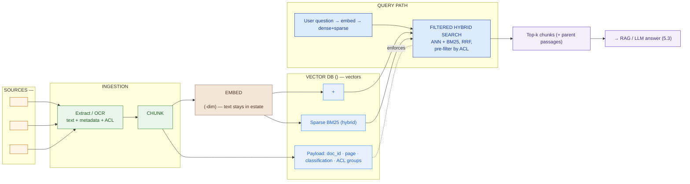

# Vector-Store Design (Template)

> Fill this in once the retrieval approach is chosen (embeddings + vector DB) and before GPU/serving (5.5) and final BOM (Phase 6). Work the sections **in order** — each decision constrains the next, and the **chunk/vector count** in §2 sizes everything after it. An executive should grasp the pipeline diagram and the RAM/storage range; a platform engineer should trust the index config, the ACL model, and the sizing math. This design is *design + defense*, not a runbook.

**Customer:** `<company>`  ·  **Prepared by:** `<SA name>`  ·  **Date:** `<YYYY-MM-DD>`
**Engagement / opportunity:** `<deal or project name>`  ·  **Version:** `<v0.1 draft>`
**Key operating constraint:** `<e.g. confidential corpus / on-prem only / no public APIs / N docs · M pages / safety-critical / cost-sensitive>` ← this drives the model + hosting choice in §1 and the ACL model in §6.

Legend for every diagram/table below: **embedding** = model that turns text into a meaning vector · **chunk** = a passage that gets one vector · **ANN** = approximate nearest-neighbour index (HNSW/IVF) · **hybrid** = dense (meaning) + sparse BM25 (keywords), fused with RRF · **payload/ACL** = per-chunk metadata used to filter search by who's allowed to see it · **quantization** = lower-precision vectors (int8) to shrink RAM.

---

## How to use this template

1. **Embedding model** — open self-host vs public API. Decide *first*; confidentiality/hosting outranks benchmark score. Sets dimensions.
2. **Chunking** — strategy + size + overlap. Produces the **vector count** that sizes the whole store.
3. **Vector database** — self-host fit, scale, hybrid, filtering. Qdrant / Milvus / OpenSearch / pgvector.
4. **Index & metric** — HNSW vs IVF; cosine/dot; quantization to fit RAM.
5. **Hybrid search** — dense + BM25 + RRF, wherever exact tags/codes matter.
6. **Metadata & access control** — payload fields; pre-filter the ANN search by user entitlements.
7. **Sizing** — assumptions → arithmetic → RAM + storage range → cluster proposal. Never a single magic number.

---

## 1. Embedding model

> Confidentiality/hosting decides this before quality. If the corpus can't leave the estate, a public embedding API is disqualified — embedding *sends text to the model*.

| Option | Hosting | Fit vs constraint |
|---|---|---|
| Public API (OpenAI `text-embedding-3` / Cohere / Voyage) | API only | `<disqualified if on-prem/confidential — say why>` |
| **Open self-host (BGE / E5 / GTE)** | On-prem (GPU/CPU) | `<runs in the estate; rank on MTEB retrieval; multilingual if needed>` |
| Open, smaller (Nomic / GTE-base) | On-prem | `<768 dims if sizing forces it — less RAM, some recall cost>` |

**Chosen model:** `<model>` — **dimensions:** `<384 / 768 / 1024>` — **languages:** `<EN / +local>` — **dense+sparse?** `<yes (e.g. bge-m3) → feeds hybrid from one model / no → run BM25 separately>`
**Defense (one sentence):** `<why this model over the benchmark leader — hosting/confidentiality, languages, and the hybrid shortcut>`

## 2. Chunking strategy → vector count

| Strategy | Chosen? | Note |
|---|---|---|
| Fixed-size | `<>` | Simplest; slices mid-context |
| **Fixed + overlap** | `<✓?>` | Overlap heals boundary cuts — pragmatic default |
| Semantic / structural | `<>` | Split on headings/steps; needs a parser |
| **Parent-document** | `<✓?>` | Embed small children, return larger parent — precise + full context |

```
CHUNK / VECTOR COUNT  (assumptions in ⟨⟩ — firm up on a real sample)
─────────────────────────────────────────────────────────────────
 Pages ....................... <N>                (given)
 Documents ................... <N>                (given)
 Words per page .............. ⟨<~500>⟩   range <..–..>
 Tokens per page ............. ⟨<~650>⟩   (words × ~1.3)
 Chunk size / overlap ........ ⟨<512 / 64>⟩  → stride ~<..> tok
 Chunks per page ............. ⟨<~2>⟩     range <..–..>
 ─────────────────────────────────────────────────────────────────
 VECTORS (chunks) ............ <pages × chunks/page> ≈ <N>   range <..–..>
```

**Vector count (design midpoint):** `<N>` (carry the range forward — it sizes RAM, disk, and node count).

## 3. Vector database

| Database | Scale sweet spot | Chosen? | Why / why not |
|---|---|---|---|
| **Qdrant** | ~1M–1B (sharded) | `<>` | `<lightest self-host ops; HNSW + quantization + sparse hybrid + filtering inside search>` |
| **Milvus** | 100M–billions | `<>` | `<max scale / GPU indexing; heavier ops (etcd + object store + MQ)>` |
| **OpenSearch (k-NN)** | ~1M–100M | `<>` | `<BM25 + vector + RBAC in one already-deployed system>` |
| **pgvector** | ≤ ~1–10M | `<>` | `<simplest if small or already on Postgres; stretched past ~10M>` |

**Chosen DB:** `<db>` — **Defense:** `<self-host fit + scale headroom + hybrid + first-class filtering for the constraint>`

## 4. Index & metric

| Item | Decision | Rationale |
|---|---|---|
| Index type | `<HNSW / IVF / IVF-PQ / DiskANN>` | `<HNSW: recall+speed, RAM cost / IVF-PQ: low RAM, tunable / DiskANN: won't fit RAM>` |
| Similarity metric | `<cosine / dot / L2>` | `<match what the model was trained on — mismatch wrecks recall>` |
| Quantization | `<none / int8 scalar / product / binary>` | `<int8 ≈ ¼ the RAM at small recall cost; keep fp32 on NVMe for rescoring>` |
| HNSW params | `<M≈16, ef_construct≈128, query ef=<..>>` | `<tune recall vs latency within the answer budget>` |

## 5. Hybrid search

- **Dense + sparse?** `<yes/no>` — **fusion:** `<RRF / weighted>`
- **Why here:** `<exact identifiers that pure dense would approximate — tag numbers, codes, part IDs; safety/correctness risk of approximation>`
- **Source of sparse vectors:** `<same model (bge-m3) / separate BM25 index>`

## 6. Metadata & access control (document-level)

- **Payload fields per chunk:** `<doc_id, source, page, classification, acl_groups[], …>`
- **Where ACLs come from:** `<source-system permissions at ingestion — e.g. SharePoint/file-share ACLs → chunk payload>`
- **Enforcement:** **pre-filter the ANN search** by the user's entitlements — *not* a post-retrieval filter (that leaks existence and wrecks recall).
- **Defense (one sentence):** `<a user only ever retrieves permitted documents; restricted docs are invisible, not just hidden>`

## 7. Sizing — RAM + storage (assumptions + ranges)

```
RAM & STORAGE SIZING  — <N> vectors, <dim>-dim, <index>, <quantization>
──────────────────────────────────────────────────────────────────────
 PER-VECTOR
  float32 vector .............. <dim> × 4 B = <..> B
  int8 quantized vector ....... <dim> × 1 B = <..> B
  HNSW graph links (M=<..>) ... ~<..> B/vector

 INDEX RAM
  Full float32 in RAM ......... <N × fp32 + graph> ≈ <..> GB
  int8 quantized in RAM ....... <N × int8 + graph> ≈ <..> GB   ✅ (fp32 on NVMe for rescoring)
  RAM band (<lo>–<hi> vectors)  ~<..> – <..> GB quantized

 ON-DISK (NVMe)
  fp32 originals .............. <N × fp32>  ≈ <..> GB
  chunk text (~<..> KB/chunk) . <..> GB
  payload + ACL .............. <..> GB
  sparse/BM25 index .......... <..> GB
  DISK TOTAL ................. ~<..> GB – <..> TB

 CLUSTER PROPOSAL (on-prem / cloud)
  <N> nodes · ~<..> GB RAM each · NVMe ~<..> TB each · replication ×<..>
  Embedding backfill: <N> chunks is a BATCH job — ~<..> on <..> GPUs (one-time),
  then incremental on new/changed docs. GPU count → 5.5 (serving/GPU sizing).
```

**Sizing headline:** `<one sentence: RAM range, node count, no per-query API cost / on-prem, and the quantization lever that made it affordable>`

---

## 8. Pipeline diagram (Mermaid skeleton)



### ASCII fallback

```
  SOURCES ──extract/OCR──▶ CHUNK ──▶ EMBED (self-hosted, on-prem) ──▶ ┌─ VECTOR DB (one estate) ─┐
   <N docs / M pages>       <size/overlap>   text never leaves       │ HNSW + int8  ·  BM25      │
                                                                     │ payload: doc·page·ACL      │
   QUERY: question ─embed(dense+sparse)─▶ FILTERED HYBRID SEARCH ────┤ RRF fuse · pre-filter ACL │
                                              │                       └───────────┬──────────────┘
                    only ACL-permitted top-k ◀┘                                   ▼
                                                                     → RAG / LLM answer (5.3)
```

---

## 9. Decision log (defend the un-obvious calls)

| # | Decision | Alternative rejected | Why | Owner |
|---|---|---|---|---|
| 1 | `<open self-hosted embedding model>` | `<public embedding API>` | `<embedding ships confidential text to a vendor>` | `<SA>` |
| 2 | `<parent-doc chunking, 512/64>` | `<whole-doc / blind fixed cut>` | `<precise match + full context; chunking makes or breaks recall>` | `<SA>` |
| 3 | `<Qdrant / Milvus>` | `<pgvector at this scale>` | `<scale + hybrid + first-class filtering>` | `<SA>` |
| 4 | `<int8 quantization>` | `<full fp32 in RAM>` | `<~¼ the RAM at small recall cost — affordability lever>` | `<SA>` |
| 5 | `<hybrid dense+BM25>` | `<dense only>` | `<exact tags/codes can't be approximated — safety/correctness>` | `<SA>` |
| 6 | `<ACL pre-filter in search>` | `<post-retrieval filter>` | `<pre-filter avoids leaking existence + keeps recall honest>` | `<SA>` |

## 10. Open items & handoffs

- **GPU / serving (5.5):** `<embedding backfill GPU count + throughput; ongoing incremental embedding load>`
- **RAG (5.3):** `<top-k, reranking, parent-passage assembly, prompt construction over retrieved chunks>`
- **Governance / responsible AI (5.6):** `<PII in chunks, retention, audit of who retrieved what>`
- **Sizing / BOM (Phase 6):** `<finalize vector count on a real sample; node counts, RAM, NVMe, server BOM>`
- **Ingestion / OCR:** `<scanned-PDF OCR quality; source-permission → ACL mapping; incremental re-index of changed docs>`

---

*Worked example: see `example-bumi-energi-vector-store-design.md` in this folder.*
