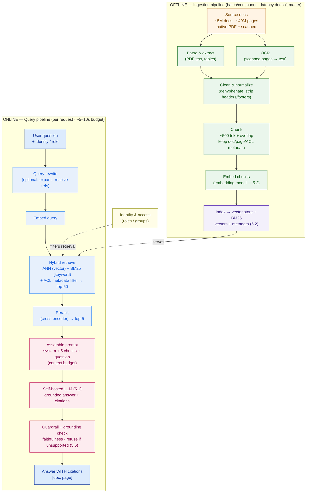
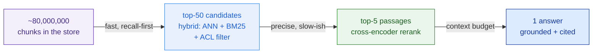

# RAG Architecture

> A bare LLM answers every question. A grounded one knows which questions it can't answer — and cites the page for the ones it can.

**Type:** Design
**Track:** AI, Data & Infrastructure Solution Architect (Presales)
**Prerequisites:** 5.2 Embeddings & Vector Databases
**Time:** ~6h
**Lab:** Haystack / local RAG
**Ship It:** RAG reference architecture

## The Problem

A field engineer at one of **Bumi Energi's** gas-processing plants stands at compressor K-201, tablet in hand, and asks the new internal assistant: *"What's the correct nitrogen purge duration before opening the K-201 casing for maintenance?"* A bare self-hosted LLM — even a capable one — answers **instantly, fluently, and with a specific number.** It may also be inventing that number. The model saw thousands of purge procedures during training; what it returns is a plausible *average*, not Bumi Energi's actual procedure for *this* compressor. In a hydrocarbon environment, a wrong purge time is not a bad customer experience. It is an explosion, an injury, and an inquest.

That is the failure mode of a raw LLM: it is a fluent pattern-completer, not a lookup system. It has no internal signal for *"I don't hold Bumi Energi's document for this."* It will **always** answer and it will **always** sound certain. For a marketing chatbot that's a shrug; for a safety-critical procedure it is a fatality waiting for a prompt. Worse, a raw model **can't cite** (it generated the words, there is no source), it is **frozen at its training cutoff** (last year's revision of a procedure, not the one issued after the last incident), and it **can't respect access control** (it has no idea this engineer isn't cleared for the offshore platform's documents). For Bumi Energi — ~2,000 users, ~5 million documents / ~40 million pages of technical and safety material, answers that **must cite sources and must not hallucinate procedures** — a raw LLM is disqualified on day one.

**RAG — Retrieval-Augmented Generation — fixes exactly this.** Instead of asking the model to *recall*, you *retrieve* the actual Bumi Energi document chunk for K-201, hand it to the model, and instruct it to answer **only** from that text and **cite** it. Knowledge lives in the documents (fresh, owned, access-controlled); the model only reads and paraphrases. But — and this is where the architect earns the fee — a *naive* RAG that just does "top-k vector search → stuff it in the prompt" fails in its own ways: it retrieves the wrong chunk, ignores the exact equipment tag, drowns the answer in fifty half-relevant passages, blows the latency budget, silently skips the ~16 million **scanned** pages that never got OCR'd, and has no way to *prove* an answer was grounded. Designing the pipeline so retrieval is precise, generation is grounded and cited, access is enforced at the right layer, and the whole round-trip returns in the **~5–10 second** target — **that** is RAG architecture, and it is what you design in this lesson.

## The Concept

RAG separates two things a raw LLM fuses together: **knowledge** (facts, which belong in documents and change constantly) from **reasoning and language** (which belong in the model weights and are stable). The model never has to *remember* the K-201 purge time — it reads it fresh from a retrieved chunk and rephrases it with a citation. Get that separation right and hallucination stops being the default.

Every RAG system is really **two pipelines** with wildly different service levels. Confusing them is the most common architecture mistake, so name them up front:

- **OFFLINE — Ingestion.** Runs as a batch or continuous background job. **Latency does not matter** (hours or days is fine); throughput, coverage, and cost do. This is where you parse, OCR, chunk, embed, and index — everything from Lesson 5.2.
- **ONLINE — Query.** Runs **per user request** under the ~5–10s budget. **Latency is everything.** This is retrieve → rerank → generate → cite.



### Ingestion — turning 40M pages into retrievable, access-tagged chunks

Four moves, in order, each of which a naive design gets wrong:

1. **Parse & OCR.** Native PDFs give you a text layer for free. **Scanned** PDFs — a large slice of any energy company's legacy safety archive — are just images; without an **OCR** pass they are invisible to retrieval. Skipping OCR silently drops millions of pages, and nobody notices until the assistant "can't find" a procedure that plainly exists.
2. **Clean & normalize.** Strip repeating headers/footers, de-hyphenate line breaks, keep tables intact. Garbage in the chunk is garbage the model will faithfully cite.
3. **Chunk.** Split into ~500-token passages with a small overlap so a procedure step isn't sliced in half. Chunk **too big** and retrieval loses precision (the right sentence is buried); chunk **too small** and the model loses the surrounding context it needs to be correct. Attach metadata to every chunk: `doc_id`, `page`, `title`, `revision`, `classification`, and — critically — **`allowed_roles/groups`** for access control.
4. **Embed & index.** Turn each chunk into a vector (Lesson 5.2's embedding model) and load it into the vector store **plus** a keyword (BM25) index. You now have a searchable corpus.

### Retrieval — precision is the whole game

The generator can only be as good as the passages you feed it. Retrieval has three stages that turn ~80 million chunks into the ~5 the model will actually read:

- **Hybrid search.** Run **vector (ANN)** search *and* **keyword (BM25)** search, then fuse the results. Safety documents are full of exact tokens — equipment tags (`K-201`), procedure numbers (`SOP-4471`), chemical names — that keyword nails and embeddings blur; they also contain paraphrasable intent ("how long to make the vessel safe") that embeddings nail and keyword misses. **Hybrid gets both;** vector-only is the classic naive miss.
- **Metadata / ACL filter.** Push the user's roles into the search query so forbidden documents are **never retrieved.** (More on why this must happen here, not later.)
- **Rerank.** ANN returns *approximately* relevant candidates fast. A **cross-encoder reranker** then reads *query + candidate together* and re-scores true relevance, promoting the best 5 out of ~50. When you only feed five chunks, precision at the top is everything — reranking is the single highest-leverage upgrade over naive RAG.

Read it as a **funnel**: each stage trades a little latency for a lot of precision, so the model only ever reads the few passages that actually answer the question.



### Generation — grounded, cited, or silent

Now assemble the prompt and call the **self-hosted LLM from 5.1** with a strict contract:

> *Answer using ONLY the numbered sources below. Every factual claim must cite its source as [doc, page]. If the sources do not contain the answer, say so and suggest who to contact — do NOT use outside knowledge.*

That "cite-or-refuse" instruction is the anti-hallucination guarantee. It converts the model from a confident guesser into a librarian: it either grounds the answer in a real Bumi Energi page or it declines. A **grounding/faithfulness check** (Lesson 5.6) can then verify the answer's claims actually appear in the retrieved sources before it reaches the engineer.

The budget that makes or breaks generation is the **context window**. You do *not* dump all 50 candidates in — that triggers "lost in the middle" (models attend poorly to the center of a long context), slows the prefill, and raises cost. You feed the **fewest chunks that answer the question.**

```
ONLINE QUERY FLOW   (target end-to-end: 5–10 s)

  question ─▶ [rewrite] ─▶ [embed] ─▶ [ HYBRID RETRIEVE ] ─▶ [ RERANK ] ─▶ [ GENERATE ] ─▶ answer + cites
                                        ANN + BM25              cross-        self-hosted
                                        + ACL filter            encoder       LLM (streamed)
                                        top-50                  top-5

  LATENCY BUDGET (per request)          p50        p95      note
  ──────────────────────────────────────────────────────────────────────────────────
  query rewrite (small LLM, optional)   0.15 s     0.4 s    skip for simple questions
  embed query                           0.05 s     0.1 s    one short text
  hybrid retrieve (top-50)              0.20 s     0.5 s    ANN + BM25 over ~80M chunks
  rerank 50 → 5 (cross-encoder)         0.45 s     0.9 s    GPU, batched
  assemble prompt                       0.01 s     0.02 s
  LLM generation (~350 out tokens)      3.5  s     7.0 s    DOMINATES — set by 5.5 sizing
  ──────────────────────────────────────────────────────────────────────────────────
  TOTAL                                 ~4.4 s     ~8.9 s   within the 5–10 s target
  (perceived latency is lower: first token streams at ~1–2 s)


CONTEXT BUDGET   (LLM window = 32,768 tokens — we deliberately use a fraction)

  ┌─────────────────────────────── 32,768-token window ───────────────────────────────┐
  │ system prompt + citation rules ...........................  ~400 tok               │
  │ question + short chat history ............................  ~300 tok               │
  │ retrieved context = 5 reranked chunks × ~600 tok .........  ~3,000 tok   ◀ hard cap │
  │ reserved for the answer (output) .........................  ~700 tok               │
  │ headroom / intentionally unused ..........................  ~28,000 tok            │
  └────────────────────────────────────────────────────────────────────────────────────┘
  Rule: feed the FEWEST chunks that answer the question. More chunks ⇒ lost-in-the-middle,
  slower prefill, higher cost — NOT a better answer.
```

### Advanced RAG — the levers that separate a demo from a deployable system

Beyond hybrid + rerank, four techniques earn their place for a safety-critical corpus:

- **Query rewriting** — expand abbreviations, resolve "it/that" from chat history, and split a compound question so retrieval isn't confused. Cheap, high recall payoff.
- **Parent-document retrieval** — retrieve on *small* chunks (precision) but hand the model the *larger* parent section (enough surrounding procedure to be correct). Best of both chunk sizes.
- **Reranking** — covered above; the highest-leverage single addition.
- **A guardrail + evaluation hook** — a grounding check on the way out (5.6) and an offline eval harness (retrieval hit-rate + answer faithfulness) so you can *measure* quality instead of hoping. **A RAG system with no eval hook is untestable and unshippable.**

### RAG reduces hallucination — it does not delete it

Do not oversell RAG in the room. It removes the *worst* failure (a fully invented procedure) but leaves three residual modes an architect must name and design against — because on a safety corpus each still hurts:

1. **Retrieval miss** — the right passage was never fetched (bad chunking, vector-only search, wrong OCR), so the model grounds on the *wrong* page. Fixed by hybrid + rerank + OCR + eval, not by a better prompt.
2. **Context ignored** — the passage was retrieved but the model paraphrased loosely or blended in its own "knowledge." Fixed by the cite-or-refuse contract and an output grounding check.
3. **Over-generalization** — the sources cover K-105 but not K-201, and the model quietly applies the general rule. Fixed by forcing a refusal when no source matches the *specific* entity in the question.

The takeaway you sell: RAG makes hallucination **rare, detectable, and bounded** — and the eval + guardrail hooks (5.6) are what turn "rare" into "measured."

## Design It

Design a RAG reference architecture for **Bumi Energi's** internal assistant. The pinned figures: an Indonesian energy company; **~5 million documents / ~40 million pages** of technical and safety docs (including scanned PDFs needing **OCR**); a **self-hosted LLM** (from 5.1) and **vector store** (from 5.2); **~2,000 users / ~200 concurrent**; target answer latency **~5–10 seconds**; **safety-critical** so answers **must cite sources and must not hallucinate procedures**; **access-controlled** so engineers see only documents they're permitted. This is the core of **Capstone E — the Private AI Platform.**

### Step 1 — Split the pipeline (and set the SLAs)

Draw the line first: **offline ingestion** (throughput/coverage/cost SLA — "initial backfill in days, incremental within an hour of a doc landing") versus **online query** (latency SLA — "p95 ≤ 10s"). Everything else hangs off this split. The ingestion backfill of 40M pages is a one-time heavy job; steady state is a trickle of new/revised documents. Never let ingestion cost or OCR queue depth leak into your online latency thinking, and never let the online budget constrain how thorough ingestion is.

### Step 2 — Size the ingestion pipeline (with the OCR job nobody scopes)

State assumptions, show the math, give a range — never a single magic number.

```
CORPUS                5,000,000 docs · 40,000,000 pages  (≈ 8 pages/doc)

CHUNKING              ~500 tokens/chunk, ~50 overlap; technical page ≈ 1.5 chunks
                      40M pages × 2.0  ≈  80,000,000 chunks   → ~80M vectors (ties to 5.2)

OCR (the hidden job)  assume ~40% of pages are scanned  →  16,000,000 pages need OCR
                      at ~2 pages/sec/worker:
                        16M / 2      = 8,000,000 worker-sec ≈ 2,220 worker-hours
                        20 workers   ≈ 111 h  ≈ 4.6 days
                        50 workers   ≈ 44  h  ≈ 1.9 days
                      → OCR is a MULTI-DAY batch, not an afterthought. Scope it explicitly.

EMBEDDING BACKFILL    80M chunks at ~300–1,000 chunks/sec/GPU
                        = 22–74 GPU-hours total  → parallelize across 8 GPUs ⇒ ~3–9 hours

VECTOR STORAGE        80M × 1024-dim × 4 B ≈ 328 GB raw float32;
                      + HNSW overhead ⇒ ~400–500 GB (quantize to cut it — see 5.2)
```

The headline finding: **OCR is a first-class, multi-day workstream**, and the corpus produces **~80M chunks** — a sizing number the vector store (5.2) and GPU plan (5.5) both depend on. An SA who forgets OCR ships an assistant that can't see 40% of the safety archive.

### Step 3 — Design hybrid retrieval + the reranker

For Bumi Energi's mix of exact tags and safety prose, vector-only retrieval is malpractice. The retrieval stack:

1. **Query rewrite** (optional): expand plant abbreviations, resolve references from the chat.
2. **Hybrid search**: ANN over the ~80M-vector store **+** BM25 keyword over the same corpus; fuse to a **top-50** candidate set. Keyword guarantees `K-201` and `SOP-4471` land; vectors guarantee "how to make the vessel safe" lands.
3. **ACL filter** (Step 5): pushed into the query so only permitted docs are candidates.
4. **Cross-encoder rerank**: re-score the 50 by true query-passage relevance, keep **top-5**. This is the difference between "an answer" and "the right page."

### Step 4 — Design citation-grounded generation

Assemble the prompt within the **context budget** (Concept ASCII): system + citation rules (~400 tok), question (~300 tok), **5 reranked chunks (~3,000 tok)**, reserve ~700 tok for the answer. Call the **self-hosted LLM (5.1)** with the **cite-or-refuse** contract. Require **inline citations** — `[Doc SOP-4471, p.12]` — after every claim, and stream the answer so the engineer sees the first token in ~1–2s. On the way out, a **grounding check (5.6)** verifies each cited claim actually appears in the sources; if not, the answer is blocked or flagged. For a safety corpus, **a confident answer with no citation is a defect, not a feature.**

### Step 5 — Enforce access control at retrieval, never after

Access control is a **safety and compliance** requirement, and *where* you apply it is the design decision that gets audited:

> **ACL filtering MUST happen at retrieval, before the LLM ever sees a chunk.** Once a forbidden passage is inside the prompt, the model can quote or paraphrase it — post-generation redaction is unsafe and unauditable.

Concretely: every chunk carries `allowed_roles/groups` metadata (Step 2); the user's identity and roles (from the platform's SSO) become a **metadata filter** pushed into the hybrid query, so an unpermitted document is **never a candidate.** The engineer who isn't cleared for the offshore platform simply gets "not in your accessible sources," identical to a document that doesn't exist. This wires the RAG pipeline into the identity story you'll formalize in the AI gateway (5.7).

### Step 6 — Prove the ~5–10s budget holds

Lay the latency budget out per stage with assumptions (Concept ASCII). The verdict: retrieve + rerank cost **under ~1.5s** even at p95; **generation dominates** at ~3.5–7s and is governed by model size, GPU count, and the ~200-concurrent load — decided in **5.5 (Model Serving & GPU Sizing).** The three levers if p95 drifts past 10s: **(a)** cap output length, **(b)** use a smaller/faster model, **(c)** add GPUs. Streaming keeps *perceived* latency at the ~1–2s first-token mark regardless. Put p50 ~4.4s / p95 ~8.9s on the page — **within target, with the generation stage flagged as the thing to watch.**

**Putting the six steps together:** you now have a defensible architecture, not a chatbot demo. The offline pipeline turns 40M pages (OCR included) into ~80M access-tagged chunks; the online pipeline funnels them to five reranked passages; the LLM answers only from those, cites them, or refuses; access control lives at retrieval where it can be audited; and every stage carries a latency number that sums inside the target. Each decision has a *reason* you can defend to a skeptical customer architect — which is exactly what separates the SA from the order-taker, and exactly what Capstone E asks you to produce.

## Compare It

**Naive RAG vs Advanced RAG** — the demo you'd build in a weekend vs the system Bumi Energi can deploy:

| Dimension | Naive RAG | Advanced RAG (what Bumi Energi needs) |
|---|---|---|
| Retrieval | top-k vector only | hybrid (vector + BM25) + ACL metadata filter |
| Ranking | ANN order as-is | cross-encoder rerank top-50 → top-5 |
| Query | as typed | rewrite / expand, resolve references |
| Chunking | fixed blind split | structure-aware + parent-document lookup |
| Grounding | "here's context, answer" | strict cite-or-refuse + grounding check (5.6) |
| Scanned docs | silently ignored | OCR pass in ingestion |
| Evaluation | none | retrieval hit-rate + faithfulness eval hook |
| Typical failure | confident wrong answer | "not in my sources — contact the process-safety team" |

**RAG vs Fine-tuning vs Long-context** — three ways to get knowledge into an answer, and why RAG wins *here*:

| Approach | How it injects knowledge | Best when | Verdict for Bumi Energi |
|---|---|---|---|
| **RAG** | Retrieve documents at query time; model reads + cites | Knowledge changes, must cite, access-controlled, huge corpus | ✅ **Right.** Docs revise constantly, citations are mandatory, ACL is mandatory, 40M pages ≫ any window |
| **Fine-tuning** | Bake knowledge into the weights | Fixed *style/format/skill*, stable knowledge | ✗ Can't cite; stale the moment a procedure is revised; no per-user ACL; a retrain to update one document |
| **Long-context** | Stuff all documents into the prompt window | Small corpus that fits the window | ✗ 40M pages dwarf any window; latency and cost explode; you *still* need retrieval to choose what to include |

These compose — a light fine-tune can fix *tone and citation format* while **RAG owns the knowledge.** But knowledge for a changing, cited, access-controlled corpus is RAG's job, full stop.

**Frameworks — Haystack vs LlamaIndex vs LangChain** — the SA picks the shape, not the library, but knows the trade-offs:

| Framework | Sweet spot | Watch out for |
|---|---|---|
| **Haystack** (deepset) | Production, explicit **pipeline** components; self-hosted / on-prem friendly; strong retrieval + reranking | Smaller ecosystem than LangChain |
| **LlamaIndex** | Best-in-class **ingestion & indexing** ergonomics; many connectors; advanced retrievers | Index-centric; production wiring (serving, auth, obs) is on you |
| **LangChain / LangGraph** | Breadth, agents, huge ecosystem, fast prototyping | Abstraction churn; opinionated glue can hide latency/cost |

For a **self-hosted, safety-critical, on-prem** platform, Haystack's explicit pipeline model paired with LlamaIndex-grade ingestion is a common, defensible combo. The framework is replaceable; the architecture in this lesson is not.

## Ship It

This lesson ships a reusable **RAG Reference Architecture** — the deliverable you produce whenever a customer wants a grounded, cited assistant over their own documents, and the backbone of **Capstone E**. Both files live in [`outputs/`](../outputs/); a runnable proof-of-claim lives in [`lab/`](../lab/):

- **[`template-rag-reference-architecture.md`](../outputs/template-rag-reference-architecture.md)** — a fill-in-the-blank template: the offline/online split, an ingestion design (incl. OCR + chunking + a metadata/ACL schema), a hybrid-retrieval + rerank design, a citation-grounded generation contract, a **latency-budget table**, **eval + guardrail hooks**, and a Mermaid skeleton. A colleague can run a whole RAG design session from it.
- **[`example-bumi-energi-rag-architecture.md`](../outputs/example-bumi-energi-rag-architecture.md)** — the template fully worked for Bumi Energi, with the sizing math, the latency budget, and the ACL decision spelled out.
- **[`lab/`](../lab/)** — a copy-run Haystack RAG over a handful of local documents that *demonstrates* the load-bearing claim of this lesson: hybrid retrieval + a reranker + a cite-or-refuse prompt beats naive top-k, in code you can run on a laptop.

The point of shipping this: a RAG diagram that shows *retrieve → rerank → generate → cite* with a latency budget and an ACL story tells the customer you know why their bare-LLM PoC hallucinated — and exactly how you'll stop it.

## Exercises

1. **(Easy)** Take Bumi Energi's ~5–10s latency budget from **Design It** and re-balance it for a **32B model that generates at half the tokens/sec** of the assumed model. Recompute the generation stage, decide whether p95 still lands under 10s, and pick which of the three levers (cap output / smaller model / add GPUs) you'd pull. State your assumption for tokens/sec.
2. **(Medium)** Apply the RAG reference template to a **different customer**: a hospital building a clinical-guidelines assistant over ~500k documents. Change what must change — the corpus size and chunk count, the ACL model (clinician vs admin vs patient), the citation format (guideline + section), and the grounding bar (a hallucinated dose is as dangerous as a hallucinated purge time). Note one thing that gets *easier* than Bumi Energi and one that gets *harder*.
3. **(Hard)** Combine this lesson with **5.2 (vector DB)** and **5.5 (model serving)**: write a one-page defense of the **~80M-chunk** ingestion estimate and the **p95 latency budget** for a skeptical customer architect. Show the sizing formula and assumptions, the retrieve/rerank/generate split, and the single sentence you'd say when they ask *"why not just fine-tune the model on our documents?"* Save it beside your worked example — it becomes a Capstone E section.

## Key Terms

| Term | What people say | What it actually means |
|------|-----------------|------------------------|
| RAG | "The chatbot searches then answers" | Retrieval-Augmented Generation — retrieve relevant document chunks, then have the LLM answer **only** from them and cite. Separates changing *knowledge* (docs) from stable *reasoning* (weights). |
| Ingestion (offline) | "Loading the docs" | The batch/continuous pipeline — parse, OCR, clean, chunk, embed, index. Latency doesn't matter; coverage and cost do. Where scanned PDFs live or die. |
| Chunking | "Splitting the text" | Cutting docs into ~500-token passages with overlap. Too big loses retrieval precision; too small loses the context the model needs to be correct. |
| Hybrid retrieval | "Vector search" | Vector (ANN) **plus** keyword (BM25), fused. Keyword catches exact tags/procedure numbers; vectors catch paraphrase. Vector-only is the classic naive miss. |
| Reranking | "Sorting results" | A cross-encoder reads query + candidate *together* and re-scores true relevance, promoting the best ~5 of ~50. Highest-leverage upgrade over naive RAG. |
| Grounding / faithfulness | "Not hallucinating" | A verifiable property: every claim in the answer is supported by a retrieved source. Enforced by a cite-or-refuse prompt + an output grounding check. |
| Context budget | "The prompt size" | The token split across system + question + retrieved chunks + reserved output. Feed the *fewest* chunks that answer — more triggers lost-in-the-middle and slower prefill. |
| ACL filter (at retrieval) | "Permissions" | Metadata filter that removes unpermitted documents **before** the LLM sees them. Must run at retrieval — post-generation redaction is unsafe. |

## Further Reading

- [Lewis et al., 2020 — *Retrieval-Augmented Generation for Knowledge-Intensive NLP*](https://arxiv.org/abs/2005.11401) — the paper that named RAG; read the intro for the knowledge-vs-parameters framing this lesson is built on.
- [Haystack documentation — building RAG pipelines](https://docs.haystack.deepset.ai/docs/intro) — the explicit-pipeline framework used in the lab; the component model maps cleanly onto retrieve → rerank → generate.
- [Anthropic — *Contextual Retrieval*](https://www.anthropic.com/news/contextual-retrieval) — a concrete, measured case for hybrid retrieval + reranking (exactly the advanced-RAG levers here) and how much they cut retrieval failures.
- [*Lost in the Middle: How Language Models Use Long Contexts* (Liu et al., 2023)](https://arxiv.org/abs/2307.03172) — the evidence behind "feed fewer chunks"; models attend poorly to the middle of a long context.
- [Pinecone — *Rerankers and Two-Stage Retrieval*](https://www.pinecone.io/learn/series/rag/rerankers/) — a clear walk-through of why ANN-then-rerank beats ANN-alone, with the precision/latency trade-off you budget in this lesson.
