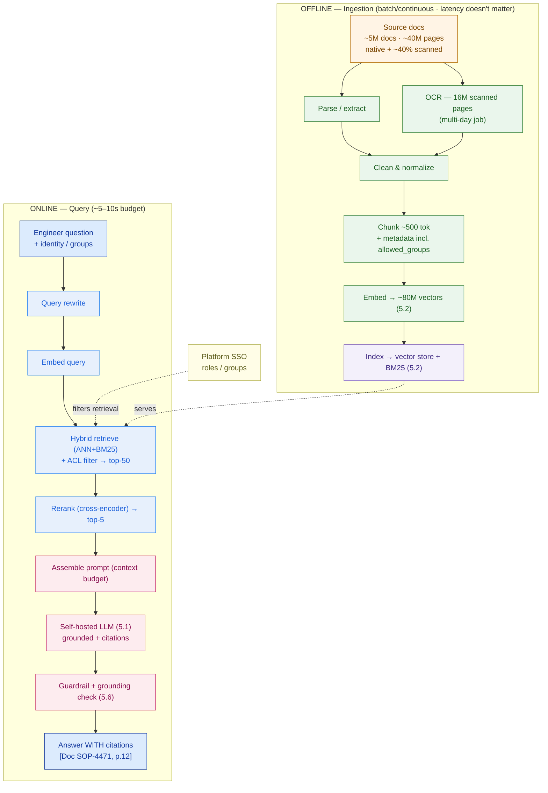

# RAG Reference Architecture — Bumi Energi (worked example)

> This is `template-rag-reference-architecture.md` filled in for the running customer. It shows what "good" looks like: the two pipelines, the sizing math (including the OCR job everyone forgets), the latency budget, and the access-control decision that gets audited. This is the core artifact of **Capstone E — the Private AI Platform.**

**Customer:** Bumi Energi (fictional) — Indonesian energy company  ·  **Use case:** internal AI assistant over technical & safety documents
**Prepared by:** SA — Presales  ·  **Date:** 2026-07-05  ·  **Opportunity:** Private AI Platform (Capstone E)  ·  **Version:** v0.2

**Corpus:** ~5,000,000 docs / ~40,000,000 pages (incl. scanned PDFs → OCR)  ·  **Users:** ~2,000 total / ~200 concurrent  ·  **Latency target:** answer in ~5–10 s
**Hard constraints:** ☑ must cite sources ☑ must not hallucinate procedures ☑ access-controlled (engineers see only permitted docs) ☑ self-hosted LLM (5.1) + vector store (5.2) ☑ scanned docs (OCR) ☑ safety-critical

**The trigger (verbatim):** an engineer at compressor K-201 asks *"What's the correct nitrogen purge duration before opening the casing for maintenance?"* — a bare LLM answers fluently and may invent the number. That is disqualifying. RAG grounds it in the actual procedure, with a citation, or refuses.

---

## 1. Pipeline split & SLAs

| Pipeline | Runs | SLA that matters | SLA that doesn't |
|---|---|---|---|
| **Offline — ingestion** | continuous; one heavy backfill | backfill in **days**; a new/revised doc searchable within **~1 hour** | latency |
| **Online — query** | per request | **p95 ≤ 10 s** | backfill throughput |

## 2. Ingestion design (offline)

```
CORPUS            5,000,000 docs · 40,000,000 pages  (≈ 8 pages/doc)

PARSE / OCR       native PDF text layer: free
                  assume ~40% scanned → 16,000,000 pages need OCR
                  at ~2 pages/sec/worker: 16M/2 = 8,000,000 worker-sec ≈ 2,220 worker-hours
                    20 workers ≈ 111 h ≈ 4.6 days   |   50 workers ≈ 44 h ≈ 1.9 days   ◀ multi-day job

CHUNKING          ~500 tokens/chunk, ~50 overlap; technical page ≈ 1.5 chunks
                  40M pages × 2.0 ≈ 80,000,000 chunks → ~80M vectors  (feeds vector store, 5.2)

EMBEDDING         80M chunks at ~300–1,000 chunks/sec/GPU = 22–74 GPU-hours
                    → across 8 GPUs ≈ 2–7 hours (initial backfill)

VECTOR STORAGE    80M × 1024-dim × 4 B ≈ 328 GB raw float32
                    + HNSW overhead ⇒ ~400–500 GB (quantize int8/PQ to cut it — see 5.2)
```

**Chunk metadata schema:**

| Field | Value for Bumi Energi |
|---|---|
| `doc_id`, `page`, `title` | e.g. `SOP-4471`, `p.12`, "K-Series Compressor Maintenance" — powers the citation |
| `revision`, `effective_date` | serve the current revision; flag superseded procedures |
| `classification` | `public / internal / restricted / safety-critical` |
| **`allowed_groups`** | e.g. `plant-onshore`, `platform-offshore-A`, `process-safety` — **the ACL filter (§4)** |
| `source_type` | `native` / `ocr` (+ OCR confidence; low-confidence pages get re-scanned) |

**Findings:** (1) ~40% scanned ⇒ **OCR is a multi-day workstream**, not a checkbox — an assistant without it is blind to ~16M safety pages. (2) The corpus produces **~80M chunks**, the sizing number the vector store (5.2) and GPU plan (5.5) both hang on.

## 3. Retrieval design (online)

| Stage | Choice | Why for Bumi Energi |
|---|---|---|
| Query rewrite | on | expand plant abbreviations, resolve "it/the casing" from chat |
| Hybrid search | ANN + BM25 → **top-50** | BM25 guarantees `K-201`, `SOP-4471`; vectors catch "make the vessel safe" |
| ACL filter | user's `groups` pushed into query | offshore-only docs never retrieved for an onshore engineer |
| Rerank | cross-encoder → **top-5** | only 5 chunks reach the model — precision at the top is the answer's quality |

## 4. Generation design (online)

**Prompt contract:**

> Answer using ONLY the numbered sources below. Every factual claim must cite its source as `[Doc, p.##]`. If the sources do not contain the answer, say *"That isn't in the procedures you can access — contact the Process Safety team"* — do NOT use outside knowledge or general engineering rules of thumb.

**Context budget** (self-hosted LLM window = 32,768 tokens; used deliberately small):

```
system + citation rules ....... ~400 tok
question + short history ...... ~300 tok
5 reranked chunks × ~600 ...... ~3,000 tok   ◀ hard cap (precision > volume)
reserved for answer ........... ~700 tok
```

- **Citation format:** `[Doc SOP-4471, p.12]` after each claim.
- **Refusal:** the exact wording above — a confident answer with no citation is treated as a **defect**.
- **Streaming:** yes — engineer sees the first token in ~1–2 s.

## 5. Latency budget (online)

| Stage | p50 | p95 | Assumption |
|---|---|---|---|
| query rewrite | 0.15 s | 0.4 s | small LLM; skipped for simple questions |
| embed query | 0.05 s | 0.1 s | one short text |
| hybrid retrieve (top-50) | 0.20 s | 0.5 s | ANN + BM25 over ~80M chunks |
| rerank 50 → 5 | 0.45 s | 0.9 s | cross-encoder on GPU, batched |
| assemble prompt | 0.01 s | 0.02 s | — |
| **LLM generation (~350 out tok)** | **3.5 s** | **7.0 s** | **dominates — set by 5.5 GPU sizing at ~200 concurrent** |
| **TOTAL** | **~4.4 s** | **~8.9 s** | **within the 5–10 s target** |

**Verdict:** retrieve + rerank cost under ~1.5 s even at p95; **generation is the thing to watch.** If p95 drifts past 10 s at 200 concurrent, pull one lever: **cap output length**, **use a smaller/faster model**, or **add GPUs** — the trade decided in **5.5**. Streaming holds *perceived* latency at ~1–2 s regardless.

## 6. Access control, guardrail & evaluation hooks

- **ACL at retrieval, never after.** The engineer's `groups` (from platform SSO) become a metadata filter pushed into the hybrid query. An offshore-only procedure is **never a candidate** for an onshore engineer — identical to a doc that doesn't exist. Filtering *after* generation would let the model quote a forbidden passage; that is unsafe and unauditable.
- **Grounding check (5.6):** before the answer reaches the engineer, verify each cited claim actually appears in the retrieved sources; block or flag if not.
- **Eval harness (5.6):** a gold set of ~300 real engineer questions with known-correct source pages; track **retrieval hit-rate@5** and **answer faithfulness / citation-correctness** on every model or pipeline change.
- **AI gateway (5.7):** auth, per-user rate limiting, full query/answer logging for audit, PII checks at the edge.

## 7. Reference architecture



### ASCII fallback

```
 OFFLINE  5M docs/40M pages ─▶ parse + OCR(16M scanned) ─▶ clean ─▶ chunk(~80M, +ACL meta) ─▶ embed ─▶ INDEX(vector+BM25)
 ONLINE   "purge time for K-201?" ─▶ rewrite ─▶ embed ─▶ HYBRID+ACL(top-50) ─▶ RERANK(top-5) ─▶ LLM(5.1) ─▶ "…10 min N2 purge [SOP-4471 p.12]"
                                                                                                   ▲ grounding check (5.6): claim IS in SOP-4471? → pass
```

## 8. Findings, risks & assumptions

| # | Finding / risk | Stage | Implication | Severity |
|---|---|---|---|---|
| 1 | ~40% pages scanned → ~16M-page, multi-day OCR | Ingestion | Scope OCR as a funded workstream; without it ~16M safety pages are invisible | **High** |
| 2 | Generation dominates the ~5–10s budget at 200 concurrent | Generation | GPU count / model size decided in **5.5**; cap output length as a lever | **High** |
| 3 | Per-user ACL over safety-critical docs | Retrieval | Metadata filter at retrieval, audited; never post-filter | **High** |
| 4 | Vector-only retrieval misses exact equipment tags | Retrieval | Hybrid (BM25 + ANN) is mandatory, not optional | Medium |
| 5 | No eval hook = can't prove grounding | Eval | Gold-set harness (hit-rate@5 + faithfulness) before go-live | Medium |

**One-line scope statement:**
> Bumi Energi's assistant is a **RAG system of engagement** over ~40M pages that must return **cited, grounded** answers in **~5–10 s** under **per-user access control** — the OCR ingestion workstream, the hybrid+rerank retrieval, and the generation-stage GPU sizing (5.5), not the chatbot UI, are the real drivers of quality, latency, and cost.

**So what (the pivot this buys you):** instead of "a chatbot on our docs" (which will confidently invent a purge time), you scope a defensible platform — grounded, cited, access-controlled, measurable — and you win it because the customer sees you understood *why* their bare-LLM PoC was dangerous and exactly how the architecture removes the danger.
