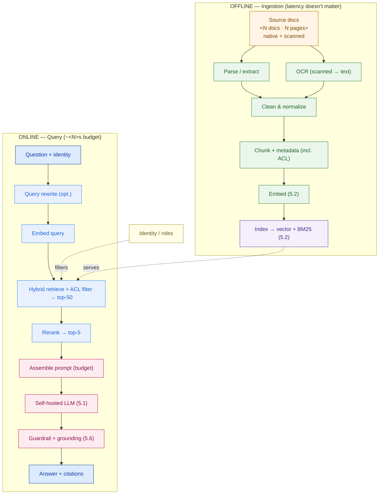

# RAG Reference Architecture — Design Template

> Fill this in when a customer wants a grounded, cited assistant over their own documents. It designs the two pipelines (offline ingestion + online query), sizes them, sets the latency budget, and wires in access control and evaluation. An executive should grasp the diagram; an engineer should trust the numbers.

**Customer:** `<company>`  ·  **Use case:** `<internal assistant / support / knowledge search>`  ·  **Prepared by:** `<SA name>`  ·  **Date:** `<YYYY-MM-DD>`
**Corpus:** `<N docs / N pages>`  ·  **Users:** `<total / concurrent>`  ·  **Latency target:** `<p95 seconds>`  ·  **Version:** `<v0.1 draft>`

**Hard constraints (tick all that apply):** ☐ must cite sources ☐ must not hallucinate ☐ access-controlled (per-user) ☐ self-hosted / on-prem ☐ scanned docs (OCR needed) ☐ regulated / safety-critical

---

## How to use this template

1. **Split the pipeline** — offline ingestion (throughput SLA) vs online query (latency SLA). Do this first.
2. **Size ingestion** — parse/OCR, chunk count, embedding backfill, vector storage. Show the math.
3. **Design retrieval** — query rewrite, hybrid (vector + BM25), ACL filter, rerank.
4. **Design generation** — prompt contract, context budget, citation format, refusal behavior.
5. **Budget the latency** — retrieve / rerank / generate, with p50 and p95.
6. **Wire the hooks** — access control at retrieval, guardrail + eval.
7. **Draw the map** — fill the Mermaid skeleton, list findings/risks.

Legend: **ANN** = approximate nearest-neighbor (vector search) · **BM25** = keyword search · **ACL** = access-control list · **OCR** = optical character recognition · **cross-encoder** = reranker that reads query+passage together.

---

## 1. Pipeline split & SLAs

| Pipeline | Runs | SLA that matters | SLA that doesn't |
|---|---|---|---|
| **Offline — ingestion** | `<batch / continuous>` | throughput, coverage, cost (`<backfill in days? incremental in <1h?>`) | latency |
| **Online — query** | per request | latency (`<p95 ≤ N s>`) | throughput of the backfill |

> **Do not let the two leak into each other.** Ingestion cost never constrains online latency; the online budget never limits ingestion thoroughness.

## 2. Ingestion design (offline)

```
CORPUS            <N> docs · <N> pages  (≈ <pages/doc>)

PARSE / OCR       native PDF text layer: free
                  scanned pages needing OCR: <% of pages> → <N> pages
                  OCR throughput <pages/sec/worker> × <workers> ⇒ <hours/days>   ◀ scope this job

CHUNKING          ~<size> tokens/chunk, ~<overlap> overlap; <chunks/page> chunks/page
                  <pages> × <chunks/page> ≈ <N> chunks  → <N> vectors  (feeds §Vector store, 5.2)

EMBEDDING         <N> chunks at <chunks/sec/GPU> ⇒ <GPU-hours> total → across <G> GPUs ≈ <hours>

VECTOR STORAGE    <N> × <dim> × 4 B ≈ <GB> raw + index overhead ⇒ <GB> (quantize? see 5.2)
```

**Chunk metadata schema (every chunk carries this):**

| Field | Purpose |
|---|---|
| `doc_id`, `page`, `title` | citation + traceability |
| `revision`, `effective_date` | serve the *current* version, flag superseded |
| `classification` | routing / redaction |
| **`allowed_roles` / `allowed_groups`** | **ACL filter at retrieval (§4) — mandatory if access-controlled** |
| `source_type` | native / OCR (track OCR-confidence for quality) |

*Findings to flag:* scanned-doc % (the OCR workstream) · chunk count (drives vector store + GPU sizing) · any doc type the parser can't handle.

## 3. Retrieval design (online)

| Stage | Choice | Why |
|---|---|---|
| Query rewrite | `<on / off>` — `<expand abbrevs, resolve refs>` | recall on messy questions |
| Hybrid search | ANN + BM25 → **top-`<50>`** | exact tags *and* paraphrase |
| ACL filter | roles pushed into query | forbidden docs never retrieved |
| Rerank | cross-encoder → **top-`<5>`** | precision at the top (only 5 reach the model) |

## 4. Generation design (online)

**Prompt contract (the anti-hallucination guarantee):**

> Answer using ONLY the numbered sources below. Every factual claim must cite its source as `<[doc, page]>`. If the sources do not contain the answer, say so and suggest `<who to contact>` — do NOT use outside knowledge.

**Context budget** (window = `<N>` tokens; use a fraction):

```
system + citation rules ....... ~<400> tok
question + history ............ ~<300> tok
retrieved = <5> chunks × ~<600> ~<3,000> tok   ◀ hard cap
reserved for answer ........... ~<700> tok
```

- **Citation format:** `<[Doc SOP-####, p.##]>` after each claim.
- **Refusal behavior:** `<exact wording when unsupported>`.
- **Streaming:** `<yes/no>` — first token target `<~1–2 s>`.

## 5. Latency budget (online)

| Stage | p50 | p95 | Assumption |
|---|---|---|---|
| query rewrite | `<s>` | `<s>` | `<small LLM / skip>` |
| embed query | `<s>` | `<s>` | one short text |
| hybrid retrieve | `<s>` | `<s>` | top-`<50>` over `<N>` chunks |
| rerank | `<s>` | `<s>` | cross-encoder, GPU |
| assemble prompt | `<s>` | `<s>` | — |
| **LLM generation** | `<s>` | `<s>` | **dominates — set by 5.5 sizing** |
| **TOTAL** | `<s>` | `<s>` | target `<≤ N s>` |

*If p95 breaches target, pull one lever:* cap output length · smaller/faster model · add GPUs (decided in 5.5).

## 6. Access control, guardrail & evaluation hooks

- **ACL at retrieval (not after):** `<how user roles become the metadata filter>`. Forbidden = invisible, identical to non-existent.
- **Guardrail / grounding check (5.6):** `<verify cited claims appear in sources; block/flag if not>`.
- **Evaluation harness (5.6):** retrieval `<hit-rate@k / recall>` + answer `<faithfulness / citation-correctness>` on a `<N>`-question gold set. **No eval hook = unshippable.**
- **AI gateway (5.7):** `<auth, rate-limit, logging, PII redaction at the edge>`.

## 7. Reference architecture (Mermaid skeleton)



### ASCII fallback

```
 OFFLINE  sources ─▶ parse/OCR ─▶ clean ─▶ chunk(+ACL meta) ─▶ embed ─▶ INDEX (vector+BM25)
 ONLINE   question ─▶ [rewrite] ─▶ embed ─▶ HYBRID+ACL(top-50) ─▶ RERANK(top-5) ─▶ LLM ─▶ answer+cites
                                                                         ▲ guardrail/grounding check (5.6)
```

## 8. Findings, risks & assumptions

| # | Finding / risk | Stage | Implication | Severity |
|---|---|---|---|---|
| 1 | `<e.g. X% scanned → multi-day OCR>` | Ingestion | `<scope OCR as a workstream>` | `<H/M/L>` |
| 2 | `<e.g. generation dominates latency>` | Generation | `<GPU/model decided in 5.5>` | `<…>` |
| 3 | `<e.g. per-user ACL>` | Retrieval | `<metadata filter, audited>` | `<…>` |

**One-line scope statement:**
> The `<solution>` is a **RAG system of engagement** over `<N>` documents that must return **cited, grounded** answers in `<≤ N s>` under `<per-user access control>` — precision retrieval (hybrid + rerank) and the generation-stage GPU sizing, not the chatbot UI, are the real drivers of quality, latency, and cost.

---

*Worked example: see `example-bumi-energi-rag-architecture.md` in this folder. Runnable proof: see `../lab/`.*
