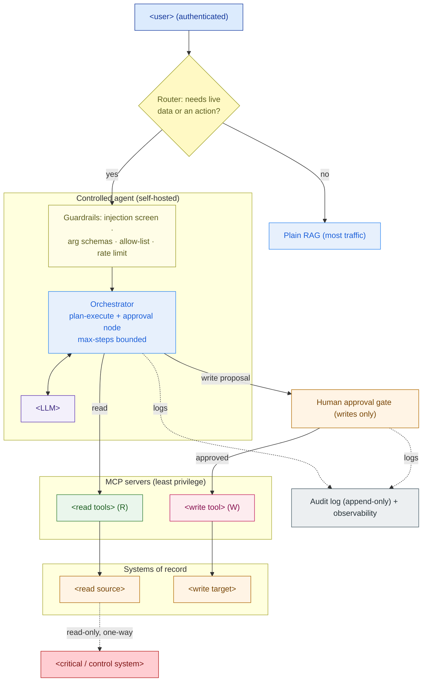

# Agent Architecture — Design Template

> Fill this in when a customer wants their AI assistant to *do things*, not just answer. It produces a design a security team can approve: which requests become an agent, which tools it gets, how writes are gated, how injection is contained, and how every action is audited. Pairs with the RAG reference architecture (5.3); together they extend Capstone E (Private AI Platform).

**Customer:** `<company>`  ·  **Industry:** `<industry>`  ·  **Prepared by:** `<SA name>`  ·  **Date:** `<YYYY-MM-DD>`
**Engagement / opportunity:** `<deal or project name>`  ·  **Version:** `<v0.1 draft>`
**Base system:** `<the existing RAG assistant / app this agent extends>`

---

## How to use this template

Work the sections in order. The first is the gate that keeps most traffic *out* of the agent — do not skip it.

1. **Decision gate** — sort every use-case into plain-RAG vs agent-read vs agent-write.
2. **Tool inventory** — the *fewest* tools that cover the mandate; note the tools you deliberately do **not** expose.
3. **Permission matrix** — classify each tool (read/write) and assign a gate (auto / human-approval / never).
4. **Human-in-the-loop** — design the approval gate for every write.
5. **Prompt-injection defenses** — defense-in-depth so a poisoned source is survivable.
6. **Audit & observability** — what you record so any action can be reconstructed.
7. **Architecture** — fill the Mermaid skeleton and list the findings.

Legend: **R** = read (low-risk, can auto-run) · **W** = write (state-changing, gate it) · **HITL** = human-in-the-loop approval · **MCP** = Model Context Protocol server (the governable boundary per system).

---

## 1. Decision gate — RAG vs agent (the section rookies skip)

> One question per request: does answering require **(a)** live data the documents don't contain, **(b)** a multi-step lookup across systems, or **(c)** an action? If none → it stays **plain RAG**. An agent adds latency, cost, non-determinism, and risk; spend it only where it's earned.

| Use-case (verbatim from customer) | Needs live data? | Needs an action? | Verdict (RAG / agent-read / agent-write) |
|---|---|---|---|
| `<request>` | `<Y/N>` | `<Y/N>` | `<verdict>` |
| `<request>` | `<Y/N>` | `<Y/N>` | `<verdict>` |
| `<…>` | | | |

*Findings:* `<what % of traffic stays RAG; which requests justify the agent; anything the customer wants that a deterministic workflow would serve better>`

## 2. Tool inventory (narrow beats general)

> List the smallest tool set that covers the mandate. Each tool sits behind an MCP server where auth, scoping, and logging are enforced once. Then list the tools you **deliberately never expose** — that boundary is a design decision, not a hope.

| Tool (name + args) | Purpose | Target system | Access (R/W) |
|---|---|---|---|
| `<tool(args)>` | `<what it does>` | `<system>` | `<R / W>` |
| `<tool(args)>` | `<…>` | `<…>` | `<…>` |

**Deliberately NOT exposed:** `<tool / capability>` — because `<the one-line safety argument>`.

## 3. Tool-permission matrix (this IS the safety model)

> The artifact you hand the security team. A reviewer should read the blast radius of a fully-hijacked agent in ten seconds.

```
 TOOL                     ACCESS  TARGET SYSTEM              GATE
 ─────────────────────────────────────────────────────────────────────
 <read_tool>              READ    <system / read replica>    auto
 <read_tool>              READ    <system>                   auto
 <write_tool>             WRITE   <system (write API)>        HUMAN APPROVAL
 ─── <forbidden action> ─ WRITE   <control / critical sys>    NEVER EXPOSED
```

*Rule this encodes:* `<e.g. reads auto, writes need a human, control-system writes don't exist>`.

## 4. Human-in-the-loop (HITL) — the approval gate for writes

> Every write is *proposed* by the agent and *executed only after a human approves*. Design one gate per write tool.

| Write tool | Who approves | What the proposal shows | On rejection / timeout |
|---|---|---|---|
| `<write_tool>` | `<role>` | `<action + evidence the agent gathered>` | `<default-safe: nothing happens>` |

Properties to verify: the proposal shows the **exact action + evidence**; the decision is **recorded with identity + timestamp**; rejection is **cheap and default-safe**.

## 5. Prompt-injection defenses (assume the corpus is hostile)

> Defense-in-depth so no single failure is fatal. Tick each layer and note how it's implemented.

| Layer | Defense | Implemented as |
|---|---|---|
| Trust boundary | Retrieved/tool content is **data, not instructions**; tool decisions come from system prompt + authenticated user only | `<…>` |
| Least privilege | Agent holds only the scoped tools in §2 | `<…>` |
| Human approval | All writes route through §4 | `<…>` |
| Guardrails | Injection/intent screen · strict argument schemas · allow-lists · rate limits | `<…>` |
| No secrets in context | Credentials live in MCP servers, never in the prompt | `<…>` |

**Customer one-liner:** *"We assume the model can be tricked; we make sure that even then it cannot do anything a human didn't approve, and every attempt is logged."*

## 6. Audit & observability

- **Audit log (append-only, immutable):** `<records: user + session identity, each reasoning step, each tool call + args + result, each approval decision + who/when>`
- **Retention / access:** `<who can read the log, how long it's kept, regulator/incident-review access>`
- **Observability signals:** `<latency, tool error rate, approval-rejection rate (rising = agent drift), cost per session>`

## 7. The architecture (Mermaid skeleton)

> Replace placeholders. Keep the RAG-vs-agent gate at the front, reads on the auto path, writes through the human gate, a hard wall to any critical/control system, and everything logged.



### ASCII fallback (for docs/email that can't render Mermaid)

```
   user ─▶ [ router: live data or action? ] ──no──▶ plain RAG (most traffic)
                       │ yes
                       ▼
             [ guardrails ] ─▶ [ orchestrator + LLM ]  (reason → act → observe)
                       │                    │
              read tools (auto)      write tool (proposal)
                       │                    │
                       ▼                    ▼
             <read sources>         [ HUMAN APPROVAL ] ─approved─▶ <write target>
                       │                    │
                       └──── every step, tool call, approval ──▶ AUDIT LOG
   HARD WALL:  agent reads a replica; NO arrow back to <critical/control system>
```

---

## 8. Findings & implications

| # | Finding | Area | Implication for the solution | Severity |
|---|---|---|---|---|
| 1 | `<e.g. most traffic is pure Q&A>` | Scoping | `<keep it on RAG; agent is a branch, not a replacement>` | `<H/M/L>` |
| 2 | `<e.g. one write tool needed>` | Safety | `<HITL gate + audit required>` | `<…>` |
| 3 | `<e.g. corpus is untrusted>` | Security | `<injection defense-in-depth; least privilege>` | `<…>` |

**One-line scope statement (fill in):**
> The proposed agent extends `<base system>` with `<n>` scoped tools (`<list>`); **reads run automatically, the `<n>` write(s) require human approval, and `<forbidden capability>` is never exposed** — so a fully-hijacked agent can at worst *propose* an action a human then rejects, and every attempt is audited.

---

*Worked example: see `example-bumi-energi-agent-architecture.md` in this folder.*
