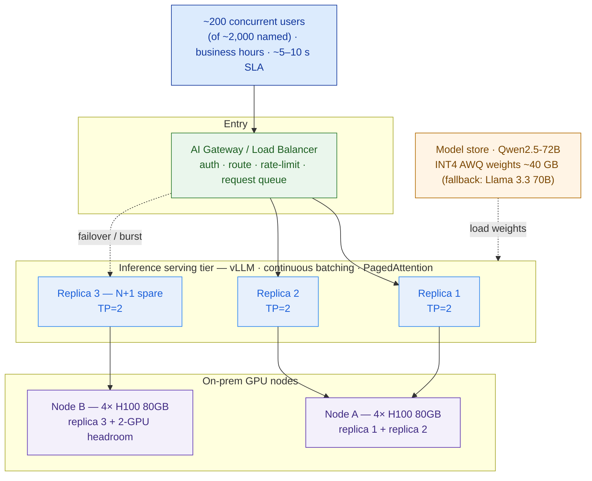

# Model Serving, Inference & GPU Sizing

> Weights are the cheap part. Size the KV-cache and the N+1, or the deal falls over at 200 concurrent — or you quote a fortune and lose it.

**Type:** Design
**Track:** AI, Data & Infrastructure Solution Architect (Presales)
**Prerequisites:** 5.4 Agents & MCP
**Time:** ~6h
**Lab:** vLLM micro-bench
**Ship It:** GPU sizing sheet + serving design

## The Problem

You are three weeks into the biggest AI deal of your year. **Bumi Energi** — an Indonesian energy company — wants a self-hosted RAG assistant over ~5M documents / ~40M pages of drilling reports, HSE procedures, and regulatory filings, running **on-prem** because the data can't leave their estate. In Lessons 5.1–5.4 you chose the model, designed the embeddings and vector store, drew the RAG flow, and wired the agent. Every one of those slides landed. Then the customer's infrastructure lead asks the only question that actually decides the deal: *"So how many GPUs, and what does that cost?"*

This is the lesson where AI proposals live or die. Size the GPUs by vibes and you fail in one of two directions, both fatal. Quote high — "let's put in eight H100s to be safe" — and your number is triple the competitor's; procurement kills the deal before the architecture review. Quote low — "one server should do it" — and the platform holds beautifully in the demo with three users, then falls over the first Monday morning when **~200 people hit it at once**, requests queue for 40 seconds, and the sponsor who championed you stops answering email. The GPU line is the single most expensive, most scrutinized, and most misunderstood number in the whole proposal, and it is *yours* to defend.

The traps are specific, and every one of them has sunk a real proposal. Architects size for the **model weights** and forget the **KV-cache** — the per-request memory that, at 200 concurrent, dwarfs the weights and dictates the GPU count. They confuse **throughput** (total tokens per second) with **latency** (how long *one* user waits) with **concurrency** (how many at once) — three different numbers that trade against each other, so optimizing one silently wrecks another. They pick the wrong **precision**, doubling the hardware bill for quality nobody can measure. They forget **continuous batching** and quote as if each request needs its own GPU. They forget **N+1**, so the first GPU failure is a full outage for a small team that can't scramble at 2am. This lesson gives you the method: design the serving stack, size the VRAM from first principles, and hand over a GPU bill of materials a CFO can interrogate and an engineer can build.

## The Concept

An LLM in production is not "a model." It is a **serving system**: a request queue, a batching scheduler, a memory manager for the attention cache, and a pool of GPUs the model weights are sharded across. You size that system, not the model file. Four ideas do all the work.

### 1. What actually consumes VRAM

A GPU's video memory (VRAM) is the hard constraint. Two things fill it, and you must budget both:

```
   TOTAL VRAM  =  MODEL WEIGHTS   +   KV-CACHE   +   overhead (activations, CUDA graphs, fragmentation)
                  ├─ fixed ──────┤   ├─ grows with concurrency × context ─┤
                  set by params      the part everyone forgets — and the part that decides GPU count
                  and precision
```

- **Model weights** — a fixed cost: `params × bytes-per-param`. A 70-billion-parameter model in FP16 (2 bytes) is ~140 GB; in INT4 (0.5 bytes) it is ~35 GB. This is the number people quote. It is the *small* one.
- **KV-cache** — the running cost. For every token of every in-flight request, the attention mechanism caches a key and value vector on the GPU so it doesn't recompute the whole prompt on each new token. This memory scales with **context length × number of simultaneous requests**. At 200 concurrent users over a long RAG context, it can exceed the weights — and it is invisible if you only think about the model file.

### 2. Continuous batching + PagedAttention — why one GPU serves many users

Naïvely, one request = one forward pass = the GPU busy start-to-finish. That would need one GPU per concurrent user — economically insane. Modern inference servers (**vLLM**, **SGLang**, **TGI**) do two things that break that:

- **Continuous batching** — the scheduler runs many requests in one batch and, crucially, admits and evicts requests *token-by-token* rather than waiting for the slowest to finish. A GPU that could serve 3 requests one-at-a-time serves 30+ interleaved.
- **PagedAttention** — the KV-cache is managed like OS virtual memory: allocated in small fixed **pages**, on demand, instead of reserving `max_context × batch` contiguously up front. That is what makes high concurrency fit in finite VRAM without massive waste. (This is vLLM's core innovation; SGLang's **RadixAttention** extends it by *reusing* the cache for shared prefixes — a big win for RAG, where every request shares the same system prompt.)

Continuous batching is why your sizing is a **fleet** question ("how many replicas to hold the peak?"), not a "one GPU per user" question.

### 3. Throughput ≠ Latency ≠ Concurrency — the three numbers people conflate

```
   THROUGHPUT   = aggregate tokens/sec the whole system emits   → drives how many REPLICAS you need
   CONCURRENCY  = requests in flight at the same instant        → drives KV-cache VRAM
   LATENCY      = how long ONE user waits for their answer      → drives batch-size ceiling
                = TTFT (time to first token) + output_tokens × TPOT (time per output token)
```

The trap: **batching trades them against each other.** A bigger batch raises throughput (great for cost) but raises **TPOT** (each user waits longer per token) — so past a point, chasing throughput blows your latency SLA. You cannot maximize all three; you size for the **latency SLA first**, which caps batch size, which caps concurrency-per-GPU, which sets how many replicas you buy. An architect who quotes "tokens/sec" as if it answered "how many will wait" is measuring the wrong thing.

### 4. Quantization — the cost lever, and its tax

**Quantization** stores the weights (and sometimes the KV-cache) in fewer bits. It is the biggest dial you have on the GPU bill, because it shrinks weights *and* frees VRAM for more KV-cache (more concurrency per GPU):

| Precision | Bytes/param | 70B weights | Quality tax | When to use |
|---|---|---|---|---|
| **FP16 / BF16** | 2 | ~140 GB | none (baseline) | quality-critical, GPUs to spare |
| **FP8** | 1 | ~70 GB | ~negligible on Hopper (H100/H200) | strong default *if* on Hopper |
| **INT8** (GPTQ/SmoothQuant) | 1 | ~70 GB | small, usually <1–2% on benchmarks | broad hardware support |
| **INT4** (AWQ/GPTQ) | 0.5 | ~35 GB | measurable (~1–3% on hard tasks), often fine for RAG | the cost lever — validate quality on *the customer's* eval set |

The rule: quantization is a **quality-vs-cost trade you must test, not assume.** INT4 can halve the hardware and still pass a RAG eval — or it can quietly degrade citation accuracy on the customer's domain. You pin the choice with the eval set from Lesson 5.6, not with a blog post.

### The sizing method (memorize this order)

```
① WEIGHTS VRAM   = params × bytes/param (at chosen precision)
② KV per token   = 2 × layers × kv_heads × head_dim × bytes         (2 = key + value)
③ IN-FLIGHT reqs = concurrent_users / query_cadence × avg_latency   (Little's Law — NOT all users at once)
④ KV VRAM        = in-flight × avg_context × KV-per-token
⑤ GPUs / replica = CEIL( (weights + working-KV + overhead) / VRAM-per-GPU )   → tensor-parallel if > 1
⑥ REPLICAS       = MAX( throughput-driven , latency/concurrency-driven ) at target load ≤ ~60–70%
⑦ + N+1          = one spare replica so a GPU/host failure is not an outage
⑧ NODES          = pack replicas into GPU servers, keep each tensor-parallel group INSIDE one node
RESULT: a GPU count + type as a RANGE, with a recommended point estimate and a cost band.
```

Step ② is the one that separates architects from the "just add GPUs" crowd. Note `kv_heads`, not `attention_heads`: modern models use **Grouped-Query Attention (GQA)**, sharing key/value heads across query heads. A 70B model with 64 query heads but only **8** KV heads has an **8× smaller** KV-cache than the same model without GQA — the difference between a buildable design and a VRAM catastrophe. Always read the model's real config; never assume.

## Design It

Let's size Bumi Energi's serving tier end to end. This is the core of its GPU bill of materials and the heart of **Capstone E (Private AI Platform)**. Every figure below is a **labelled assumption carried as a band** — never a magic number. The lab validates the two that matter most.

**Pinned inputs (given by the customer — do not soften these):**
- **~200 concurrent users at peak** (of ~2,000 named), business hours.
- **Target answer latency ~5–10 seconds.**
- Self-hosted, **on-prem**, RAG assistant over ~5M docs / ~40M pages. GPU cost is make-or-break; small team.

**Carried-forward assumptions (confirm against the named lessons):**
- `ASSUMPTION [from 5.1]` — model = **Qwen2.5-72B-Instruct** (72B params, open-weight, the PRIMARY from 5.1's matrix), quantized to **INT4 (AWQ)**. *(5.1 also names Llama 3.3 70B-Instruct as the license-diverse fallback — same GQA config, same VRAM class, so this sizing carries over unchanged: swap the model name, keep every formula.)*
- `ASSUMPTION [from 5.3]` — RAG request shape: **input ~5K tokens** (retrieved chunks + system prompt + question; band 3K–8K), **output ~500 tokens** (band 300–800). Effective resident sequence length for KV ≈ **6K tokens** (band 4K–8K).
- `ASSUMPTION` — Qwen2.5-72B config (public model card): 80 layers, 64 attention heads, **8 KV heads (GQA)**, head_dim 128, FP16 KV-cache — architecturally identical to Llama 3.3 70B's config, which is why the fallback swap is drop-in.

### Step 1 — Weights VRAM

```
weights_VRAM = params × bytes_per_param
INT4 (AWQ):  72e9 × 0.5 bytes = 36 GB   → + ~15% loaded overhead (non-quantized embeds, scales) ≈ 41 GB
Band: 35–45 GB.   For reference: FP16 = 144 GB · FP8/INT8 = 72 GB.
```

**Result: ~40 GB of weights per model copy** (band 35–45). Note this *fits on a single 80 GB GPU* — hold that thought, because the KV-cache is about to overrule it.

### Step 2 — KV-cache per token

```
KV_per_token = 2 × num_layers × num_kv_heads × head_dim × bytes_per_element
             = 2 × 80 × 8 × 128 × 2 (FP16)
             = 327,680 bytes ≈ 0.31 MB / token          (band 0.30–0.33)

KV_per_sequence (@ 6K resident tokens) = 6,144 × 0.31 MB ≈ 1.9 GB / request
   sanity band:  4K → ~1.25 GB   ·   8K → ~2.5 GB
```

**Result: ~1.9 GB of KV-cache per in-flight request.** Without GQA (64 KV heads) this would be ~15 GB/request — the design would be impossible. GQA is why it's buildable.

### Step 3 — How many requests are *actually* in flight (Little's Law)

The costliest rookie error: reading "200 concurrent users" as "200 requests generating this instant." They aren't. A user sends a query, then *reads the answer* for 30–60 seconds before the next one. What the GPU must hold simultaneously is far smaller — and getting this right is the difference between a sane cluster and a comically oversized one.

```
Little's Law:  in-flight = arrival_rate (λ) × service_time (W)

λ (arrival rate) = concurrent_users / query_cadence
                 = 200 users / 45 s per query  ≈ 4.4 req/s     (band: 200/90 = 2.2  to  200/30 = 6.7)
W (service time) ≈ target latency ≈ 7.5 s                     (mid of the pinned 5–10 s SLA)

in-flight = λ × W = 4.4 × 7.5 ≈ 33 simultaneous requests       (band ~15–50)
Design target with burst headroom: ~48 KV slots.
```

**Result: the KV-cache must hold ~33 simultaneous requests (design for ~48).** Not 200. This single correction is often a 3–4× reduction in the quoted cluster — and it *uses* the pinned 200 concurrent, it doesn't ignore it.

### Step 4 — VRAM per replica → GPUs per replica

A **replica** is one complete, independently-serving copy of the model. Try to fit it on **one H100 80GB**:

```
1× H100 80GB:  80 − 40 (weights) − ~10 (overhead) = ~30 GB for KV  →  30 / 1.9 ≈ 15 requests
```

Only **15** in-flight — below our 33, with zero burst room. The weights fit on one GPU; the *concurrency doesn't*. This is exactly the KV-cache trap. So we **pool VRAM with tensor parallelism (TP)** — shard the model across GPUs on the same NVLink so the KV budget adds up:

```
Replica = TP=2 on 2× H100 80GB  →  160 GB pooled
   weights (sharded) 40 GB  +  overhead ~15 GB  →  KV budget ≈ 105 GB
   KV slots = 105 / 1.9 ≈ 55 requests            ← VRAM-capped concurrency
   Latency cap: to hold TPOT ≤ ~20 ms (500 tok × 20 ms = 10 s), keep running batch ≤ ~40  [ASSUMPTION → LAB]
   Safe concurrency / replica = MIN(VRAM 55, latency 40) ≈ 40 in-flight
   Throughput / replica ≈ 2,000–3,000 tok/s aggregate decode  [ASSUMPTION → validate in the lab]
```

**Result: 1 replica = 2× H100 (TP=2), good for ~40 in-flight and ~2,500 tok/s.** (An alternative that removes TP entirely: **1× H200 141GB** per replica — 141 − 40 − 15 ≈ 86 GB KV ≈ 45 requests on a *single* GPU. Fewer, bigger GPUs vs more, smaller with TP — a real trade we price in Compare It.)

### Step 5 — Replicas to hold the peak (throughput AND latency)

```
Peak demand:  ~33 in-flight (band →50)  ·  aggregate ≈ λ × output = 4.4 × 500 ≈ 2,200 tok/s  (band 1,300–5,400)

By concurrency: 33 / 40 ≈ 1 replica — but running one replica near saturation blows TTFT under bursts.
By throughput:  2,200 / 2,500 ≈ 0.9 replica.
Rule: never plan a serving replica above ~60–70% steady load (the SLA lives in the headroom).
→ 2 ACTIVE replicas: splits ~33 → ~17 each (≈43% load), comfy TPOT, absorbs Monday-morning bursts.
```

**Result: 2 active replicas = 4× H100.**

### Step 6 — N+1, then pack into nodes

A small team cannot hand-fail-over at 2am, and this platform is make-or-break. Add **one spare replica** so any single GPU/host loss is a capacity dip, not an outage:

```
+ N+1 replica  →  3 replicas total = 6× H100 (TP=2 each)

Node packing (keep each TP=2 group INSIDE one server — TP needs NVLink, not the slow cross-node fabric):
   Option A: 1× 8-GPU server (HGX/DGX H100) holds 3 replicas + 2-GPU headroom.
             Densest, cheapest/GPU — BUT single node = no host redundancy. ✗ for make-or-break.
   Option B: 2× 4-GPU servers = 8× H100. Node A = replica 1 + replica 2; Node B = replica 3 (N+1) + 2-GPU headroom.
             Survives a whole-node loss; each TP pair stays on-node NVLink; room to grow to a 4th replica. ✓ recommended.
```

**Result: recommended 8× H100 80GB across 2× 4-GPU nodes** (2 active + 1 N+1 replica, TP=2, plus growth headroom). Minimum viable is **6× H100** (3 replicas, single 8-GPU node) if the customer accepts single-node risk.

### The worksheet, on one page

```
BUMI ENERGI — GPU SIZING WORKSHEET (Qwen2.5-72B · INT4 AWQ · vLLM)   [all figures = assumption + band]
─────────────────────────────────────────────────────────────────────────────────────────────────────
① WEIGHTS       72e9 × 0.5 B         = 36 GB  → ~40 GB loaded         band 35–45 GB
② KV / token    2×80×8×128×2 B       = 0.31 MB/token                  band 0.30–0.33
   KV / request 6,144 tok × 0.31 MB  = 1.9 GB/request                 band 1.25 (4K) – 2.5 (8K)
③ IN-FLIGHT     (200/45 s) × 7.5 s   = ~33 requests                   band 15–50   (Little's Law)
④ KV VRAM       33 × 1.9 GB          = ~63 GB working  (design ~48 → ~90 GB)
⑤ REPLICA       TP=2 · 2× H100 80GB  = 160 GB → ~105 GB KV → ~55 slots / ~2,500 tok/s   [LAB-validated]
⑥ REPLICAS      MAX(thru 0.9, conc 33/40) at ≤65% load → 2 ACTIVE  = 4× H100
⑦ + N+1         + 1 spare replica                        → 3 replicas = 6× H100
⑧ NODES         2× 4-GPU servers (host-redundant)        → 8× H100 (6 used + 2 headroom)
─────────────────────────────────────────────────────────────────────────────────────────────────────
RESULT   6× H100 (min) — 8× H100 (recommended, host-redundant)   ·   GPU type/count/cost band below
SANITY   load/replica ≈ 1,100 of 2,500 tok/s ≈ 44%  ✓   ·   ~40 GB weights ≪ 105 GB KV → KV-BOUND design ✓
```

### The serving stack



Read it left-to-right for a request's life (user → gateway queue → a replica → its 2 GPUs on NVLink) and note the two design decisions an executive will ask about: the **N+1 spare replica** (availability for a small team) and **TP stays inside a node** (no expensive cross-node fabric needed, because each tensor-parallel pair shares one server's NVLink).

## Compare It

Three choices sit under every serving design. Name the trade in the room.

### Serving framework — production vs dev

| Framework | Core strength | Batching / cache | Reach for it when… |
|---|---|---|---|
| **vLLM** | The production default; PagedAttention, wide model + quant support, tensor parallelism, OpenAI-compatible API | continuous batching + PagedAttention | The general answer for on-prem multi-user serving. Bumi Energi's pick. |
| **SGLang** | **RadixAttention** reuses KV for shared prefixes — big win for RAG (same system prompt every call) and agentic/structured output | continuous batching + prefix-cache reuse | Prefix-heavy RAG or agent workloads; squeezing more concurrency from the same GPUs. |
| **TGI** (HF Text Generation Inference) | Mature, well-supported, tight Hugging Face ecosystem integration | continuous batching | You're standardized on the HF stack and want vendor-backed support. |
| **Ollama** / llama.cpp | Dead-simple single-user local runtime | one request at a time (not built for it) | PoCs, laptops, a developer's desk. **Never** the tier that serves 200 users — this is the classic "it worked in the demo" trap. |

### GPU options — VRAM, interconnect, cost, fit

`ASSUMPTION` — street prices are volatile and region-dependent; **confirm every figure with the hardware partner.** Bands are for BOM ranging, not quotes.

```
GPU (80GB class + below)   VRAM     Interconnect      FP8?  ~GPU $ band*  Best fit for a 70B serving replica
──────────────────────────────────────────────────────────────────────────────────────────────────────────
H200 (Hopper)              141 GB   NVLink            yes   $30k–40k      1 GPU/replica — huge KV, no TP needed
H100 (Hopper)               80 GB   NVLink            yes   $25k–35k      TP=2/replica — the balanced default
A100 (Ampere)               80 GB   NVLink            no    $15k–20k      TP=2/replica — value pick, slower, no FP8
L40S (Ada)                  48 GB   PCIe (no NVLink)  yes   $8k–12k       small models (7–14B) or single-GPU replicas
L4  (Ada)                   24 GB   PCIe              no    $2.5k–3.5k    embeddings / reranker / low-volume small models
──────────────────────────────────────────────────────────────────────────────────────────────────────────
* GPU silicon only. On-prem you buy SERVERS: a 4× H100 node ≈ $130k–190k; 8× H100 (HGX/DGX) ≈ $250k–400k. Confirm w/ partner.
```

The architect's read: **NVLink matters when you tensor-parallel.** L40S has no NVLink, so TP across two L40S runs over PCIe and stalls — great for many *single-GPU* replicas of a small model, poor for splitting a 70B. **A100 is the value play** (cheaper, no FP8, ~2× slower memory bandwidth than H100 → lower throughput, so you may need more replicas). **H200's 141 GB** buys you out of tensor parallelism entirely for a 70B — often fewer, simpler replicas. Do not default to "H100 because everyone says H100"; price the A100 and H200 alternatives.

### Precision — the cost lever and its tax

`FP16` (safest, 2× the GPUs) → `FP8` (near-free quality on Hopper, halves weights — the strong default *if* on H100/H200) → `INT8` (broad support) → `INT4 AWQ/GPTQ` (the aggressive lever; halves again, small measurable quality tax). The "it depends" the customer will ask: *"Will INT4 make it dumber?"* Your honest answer: *"Maybe 1–3% on hard reasoning — usually invisible for grounded RAG, but we prove it on your eval set (Lesson 5.6) before we commit the BOM. If it fails the eval, we step up to FP8 and re-price."* That sentence — a tested trade, not an assumed one — is what separates you from the vendor who quoted FP16 to be safe and lost on cost.

## Ship It

This lesson ships a reusable **GPU Sizing Sheet + Serving Design** — the make-or-break artifact of any self-hosted-LLM deal and the compute heart of Capstone E's bill of materials. Both files live in [`outputs/`](../outputs/):

- **[`template-gpu-sizing-and-serving-design.md`](../outputs/template-gpu-sizing-and-serving-design.md)** — a fill-in-the-blank sheet: inputs → weights VRAM → KV-cache → in-flight (Little's Law) → per-replica capacity → replicas (throughput + latency + N+1) → nodes → **GPU BOM range**, with a Mermaid serving-stack skeleton, the ASCII worksheet, and an assumptions-&-risks register the CFO will read.
- **[`example-bumi-energi-gpu-sizing.md`](../outputs/example-bumi-energi-gpu-sizing.md)** — the sheet fully worked for Bumi Energi, landing on **6–8× H100 80GB** with every formula shown, so the template isn't abstract.

The [`lab/`](../lab/) folder holds a **vLLM micro-bench** you can run on a single rented or on-prem GPU to *measure* the two assumptions the whole sheet rests on — per-replica **tokens/sec** and **TPOT under load** — so your quote is validated, not guessed. Never present a sizing sheet whose throughput number you have not seen a GPU actually produce.

## Exercises

1. **(Easy — reinforce the core idea)** Recompute Step 3 (Little's Law) if Bumi Energi's users are heavier: they query every **20 seconds** on average instead of 45. What is the new arrival rate, the new in-flight count, and roughly how many active 2× H100 replicas would that require to stay under ~65% load? State which of the pinned numbers you did *not* change, and why.
2. **(Medium — different scenario)** Re-run the whole sheet for a **smaller model**: assume 5.1 instead chose a **14B** model at FP16 (28 GB weights) with the same RAG context and concurrency. Does it now fit **one GPU per replica**? Which GPU from the Compare It table is the cheapest that works, and how do the GPU count and the cost band change versus the 70B design? Name the one line in the pitch this lets you say to a cost-sensitive buyer.
3. **(Hard — extend / combine)** Bumi Energi's sponsor pushes back: *"Cut the GPU bill in half."* Produce a **half-page decision memo** giving three levers — (a) **INT4 → is it already there?**, (b) **drop N+1 to N+0**, (c) **cap concurrency / relax the latency SLA to 15 s** — with the VRAM/replica/cost impact and the *risk* of each, and a recommendation. Combine it with your **model-selection matrix from 5.1** and the **RAG design from 5.3** to show the knock-on effects. Save it beside the worked example; you'll fold it into the Capstone E BOM and the Phase 7 pricing conversation.

## Key Terms

| Term | What people say | What it actually means |
|------|----------------|------------------------|
| KV-cache | "Some memory the model uses" | Per-request GPU memory caching each token's key/value so tokens aren't recomputed. Scales with context × concurrency; at scale it dwarfs the weights and dictates GPU count. The number rookies forget. |
| Continuous batching | "Batching requests" | Token-by-token admission/eviction of many requests into one running batch, so a GPU serves 30+ users interleaved instead of one at a time. Why serving is a fleet question, not one-GPU-per-user. |
| PagedAttention | "vLLM magic" | Managing the KV-cache in small on-demand pages (like OS virtual memory) instead of reserving max-context×batch up front — what makes high concurrency fit in finite VRAM. |
| Tensor parallelism (TP) | "Using multiple GPUs" | Sharding *one* model's weights and compute across GPUs so their VRAM (and bandwidth) pool for a single replica. Needs fast interconnect (NVLink); keep each TP group inside one node. |
| Quantization | "Making the model smaller" | Storing weights/KV in fewer bits (FP16→FP8→INT8→INT4). The biggest lever on the GPU bill; carries a quality tax you must test on the customer's eval set, not assume. |
| GQA (Grouped-Query Attention) | "An attention thing" | Sharing key/value heads across query heads, shrinking the KV-cache several-fold (64 query but 8 KV heads = 8× smaller cache). Often the difference between a buildable design and a VRAM blowout. |
| TTFT / TPOT | "Latency" | Time To First Token (prompt processing) and Time Per Output Token (each following token). Answer latency = TTFT + output_tokens × TPOT. Batch size trades TPOT for throughput. |
| Throughput vs concurrency | "How fast it is" | Throughput = aggregate tokens/sec (drives replica count); concurrency = simultaneous in-flight requests (drives KV VRAM). Different numbers; conflating them mis-sizes the cluster. |
| Replica | "An instance" | One complete, independently-serving copy of the model (possibly spanning several GPUs via TP). You scale concurrency and add N+1 by adding replicas. |

## Further Reading

- [vLLM documentation](https://docs.vllm.ai/) — the production default; read the PagedAttention and distributed-serving (tensor-parallel) pages, and `gpu_memory_utilization` for how the KV budget is set in practice.
- [Efficient Memory Management for LLM Serving with PagedAttention (vLLM paper)](https://arxiv.org/abs/2309.06180) — the primary source for why the KV-cache, not the weights, governs serving capacity.
- [SGLang — RadixAttention](https://lmsys.org/blog/2024-01-17-sglang/) — prefix-cache reuse; why a shared RAG system prompt can meaningfully raise concurrency per GPU.
- [Hugging Face Text Generation Inference (TGI)](https://huggingface.co/docs/text-generation-inference/) — the mature HF-ecosystem alternative, useful for framework comparison.
- [NVIDIA H100 / H200 / A100 / L40S datasheets](https://www.nvidia.com/en-us/data-center/h100/) — confirm VRAM, memory bandwidth, and interconnect (NVLink vs PCIe) before you commit a BOM; bandwidth, not just VRAM, sets throughput.
- [AWQ: Activation-aware Weight Quantization](https://arxiv.org/abs/2306.00978) — the INT4 method behind the cost lever, and what its quality tax actually is.
- [Qwen2.5-72B-Instruct model card](https://huggingface.co/Qwen/Qwen2.5-72B-Instruct) and the [Llama 3.3 70B model card](https://huggingface.co/meta-llama/Llama-3.3-70B-Instruct) — read the real configs (layers, KV heads, head_dim) so your KV-per-token formula uses facts, not assumptions; note how similar the two are, which is exactly why the fallback swap in 5.1 doesn't cost a re-derivation.
