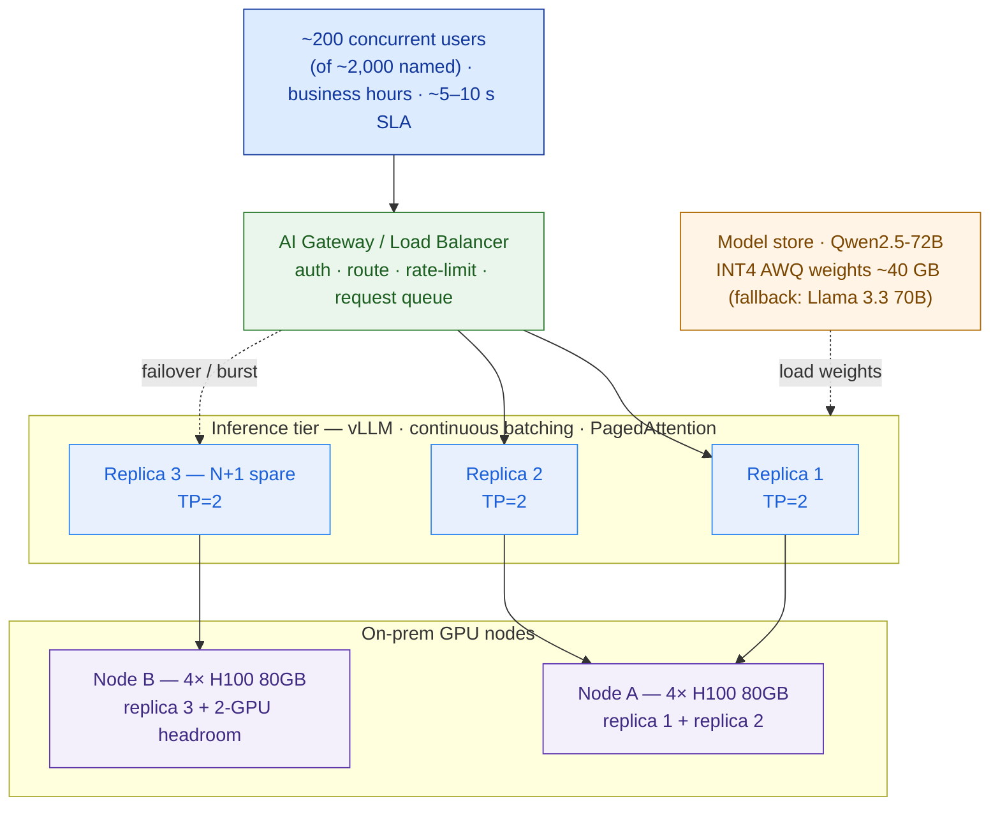

# GPU Sizing Sheet + Serving Design — Bumi Energi (Worked Example)

> This is the [GPU Sizing Sheet template](./template-gpu-sizing-and-serving-design.md) filled in for **Bumi Energi** (fictional): an Indonesian energy company standing up a **self-hosted, on-prem RAG assistant** over ~5M documents / ~40M pages of drilling reports, HSE procedures, and regulatory filings, for **~200 concurrent users at peak** (of ~2,000 named) at a **~5–10 s answer latency**, with a small platform team and where **GPU cost is make-or-break**. It answers the infra lead's question — *how many GPUs, of what type, and why* — and is the compute heart of **Capstone E's** private-AI-platform BOM.

**Customer:** Bumi Energi  ·  **Prepared by:** `<SA name>`  ·  **Date:** `<YYYY-MM-DD>`
**Engagement:** Private AI Platform (on-prem RAG assistant)  ·  **Placement:** on-prem DC  ·  **Version:** v0.1 draft

**Pinned facts (given — do not soften):** ~200 concurrent users at peak · ~2,000 named users · target answer latency ~5–10 s · on-prem, self-hosted · GPU cost make-or-break · small team.
**Everything else is a labelled `ASSUMPTION` carried as a band.** Legend: VRAM = GPU memory · KV = key/value cache · TP = tensor parallelism · TTFT/TPOT = time to first / per output token · GQA = grouped-query attention · [LAB] = must be measured.

---

## 1. Inputs

| Input | Value (+ band) | Source |
|---|---|---|
| Model + params | **Qwen2.5-72B-Instruct**, 72B params, open-weight (fallback: Llama 3.3 70B-Instruct, same config class) | Lesson 5.1 matrix `ASSUMPTION` |
| Quantization | **INT4 (AWQ)** → 0.5 bytes/param | Lesson 5.1 (quality validated in 5.6) |
| Model config | 80 layers · **8 KV heads (GQA)** · 64 attn heads · head_dim 128 | Qwen2.5-72B model card |
| RAG request shape | input **~5K** tok (band 3K–8K) · output **~500** tok (band 300–800) | Lesson 5.3 RAG design |
| Effective resident sequence | **~6K tokens** (band 4K–8K) | input + output + margin |
| **Peak concurrent users** | **200** (pinned) | discovery |
| Query cadence | **~45 s** between queries per active user (band 30–90) | `ASSUMPTION` — read-then-ask behaviour |
| **Target answer latency** | **~5–10 s** (pinned) | discovery |
| Availability posture | **N+1** | small team can't hand-fail-over at 2am |

## 2. Weights VRAM (step ①)

```
weights_VRAM = params × bytes_per_param
INT4 (AWQ):  72e9 × 0.5 = 36 GB  → + ~15% loaded overhead ≈ 41 GB      band 35–45 GB
reference:   FP16 = 144 GB · FP8/INT8 = 72 GB
```

**~40 GB weights per model copy.** This fits on a single 80 GB GPU — but the KV-cache below overrules that.

## 3. KV-cache per token & per request (step ②)

```
KV_per_token   = 2 × 80 × 8 × 128 × 2 (FP16)  = 327,680 bytes ≈ 0.31 MB/token       band 0.30–0.33
KV_per_request = 6,144 tok × 0.31 MB          ≈ 1.9 GB/request                       band 1.25 (4K) – 2.5 (8K)
```

**~1.9 GB KV per in-flight request.** GQA (8 KV heads, not 64) makes this 8× smaller than it would otherwise be — without it, ~15 GB/request would make the whole design impossible.

## 4. In-flight requests — Little's Law (step ③)

```
λ (arrival) = 200 users / 45 s        ≈ 4.4 req/s          band 2.2 (90 s) – 6.7 (30 s)
W (service) ≈ target latency          ≈ 7.5 s              (mid of 5–10 s SLA)
IN-FLIGHT   = λ × W = 4.4 × 7.5        ≈ 33 requests        band ~15–50
Design target (burst headroom):       ~48 KV slots.
```

**The GPUs must hold ~33 simultaneous requests, not 200.** 200 users are *active*, but each spends 30–60 s reading before the next query, so only ~33 are mid-generation at any instant. This uses the pinned 200 concurrent and corrects the sizing by ~3–4×.

## 5. Per-replica capacity → GPUs per replica (steps ④–⑤)

```
1× H100 80GB:  80 − 40 (weights) − ~10 (overhead) = ~30 GB KV → /1.9 ≈ 15 in-flight   → NOT ENOUGH (need ~33)
```
The weights fit on one GPU; the *concurrency doesn't*. Pool VRAM with TP=2:
```
Replica = TP=2 · 2× H100 80GB = 160 GB pooled
   weights (sharded) 40 GB + overhead ~15 GB → KV budget ≈ 105 GB → /1.9 ≈ 55 in-flight   ← VRAM cap
   Latency cap [LAB]: keep running batch ≤ ~40 to hold TPOT ≤ ~20 ms (500 tok × 20 ms = 10 s)
   Safe concurrency/replica = MIN(55, 40) ≈ 40 in-flight
   Throughput/replica [LAB] ≈ 2,000–3,000 tok/s aggregate decode   ← MEASURE (see lab/); point ~2,500
```

**1 replica = 2× H100 (TP=2) ≈ 40 in-flight, ~2,500 tok/s.**
*Alternative:* 1× **H200 141GB** per replica removes TP entirely (141 − 40 − 15 ≈ 86 GB KV ≈ 45 in-flight on a single GPU) — priced in §7.

## 6. Replicas, nodes, N+1 (steps ⑥–⑧)

```
Peak demand:  in-flight ~33 (band →50)  ·  aggregate ≈ 4.4 × 500 ≈ 2,200 tok/s   band 1,300–5,400
ACTIVE = MAX( 2,200/2,500 = 0.9 ,  33/40 = 0.8 ) at ≤ 65% load → 2 ACTIVE replicas = 4× H100
   (2 active splits ~33 → ~17 each ≈ 43% load: comfy TPOT, absorbs Monday-morning bursts)
+ N+1 spare  → 3 replicas = 6× H100
NODES (keep each TP=2 pair inside one server's NVLink):
   Option A: 1× 8-GPU HGX/DGX H100 → 3 replicas + 2-GPU headroom. Densest, cheapest/GPU. ✗ single node = no host redundancy.
   Option B: 2× 4-GPU H100 servers = 8× H100. Node A = replica 1+2; Node B = replica 3 (N+1) + 2-GPU headroom. ✓ survives a node loss.
```

## 7. Result — the range and the recommendation

```
                 ACTIVE   +N+1   NODES               GPUs (total)
Option A (dense)    2       3     1× 8-GPU H100        6 (of 8)
Option B (HA)       2       3     2× 4-GPU H100        8 (6 used + 2 headroom)
────────────────────────────────────────────────────────────────
GPU BOM = 6× H100 80GB (min viable) — 8× H100 80GB (recommended, host-redundant)
Recommended point estimate: 8× H100 80GB across 2× 4-GPU nodes (2 active + 1 N+1 replica, TP=2)
```

**Cost band** `ASSUMPTION — confirm with hardware partner; GPU prices are volatile and region-dependent:`

```
GPU silicon:   6–8 × $25k–35k/H100                       = $150k – $280k
Servers:       2 × $130k–190k (4-GPU node: GPU+CPU+RAM+NIC+chassis)  = $260k – $380k   ← quote SERVERS, not bare GPUs
GPU compute layer (recommended, Option B):               ≈ $260k – $400k capex
+ not in this sheet: DC networking · model & vector storage · power & cooling · ~10–15%/yr support/warranty
```

Cross-check against the **H200 path:** 3× H200 141GB (1 GPU/replica, 2 active + N+1) at ~$30k–40k/GPU ≈ $90k–120k silicon, fewer GPUs to license/operate and no TP — often competitive once server chassis and simplicity are counted. **Price both** before recommending.

**Sanity checks:**
- Load/replica ≈ 1,100 of ~2,500 tok/s ≈ **44%** — healthy latency headroom (< ~70%). ✓
- Weights **40 GB** vs working-KV **~63 GB** (33 req) → design is **KV-BOUND**: concurrency, not the model file, forces the GPU count. ✓
- ~40 GB weights fit one GPU but only ~15 in-flight fit one GPU → TP=2 is a **KV/concurrency** decision, not a "model too big" decision. ✓
- $ per named user ≈ $300k / 2,000 ≈ **~$150/user** capex; per concurrent seat ≈ $300k / 200 ≈ **~$1,500/seat**. Defensible for an on-prem, data-sovereign platform.

## 8. Serving topology



## 9. Assumptions & risks register

| # | Assumption / risk | Value used | Band | How to confirm | If wrong → impact |
|---|---|---|---|---|---|
| 1 | Model + params | Qwen2.5-72B | — | 5.1 sign-off | swap to Llama 3.3 70B fallback ≈ same; a 30B halves GPUs |
| 2 | Quantization | INT4 AWQ | policy | 5.6 quality eval on Bumi's docs | fails eval → FP8 (70 GB) → +replicas or H200 |
| 3 | Query cadence | ~45 s | 30–90 s | pilot usage analytics | 30 s → ~50 in-flight → +1 active replica |
| 4 | Resident context | ~6K tok | 4K–8K | 5.3 retrieval trace | 8K → ~2.5 GB/req → fewer slots/replica |
| 5 | Per-replica tokens/sec | ~2,500 | **[LAB]** 2,000–3,000 | vLLM micro-bench | ± active replica count |
| 6 | Running-batch / TPOT cap | ~40 / ~20 ms | **[LAB]** | vLLM bench under load | miss 5–10 s SLA, or over-buy |
| 7 | H100 price / server | $25k–35k / $130k–190k | volatile | hardware partner quote | shifts cost band, maybe GPU class |
| 8 | Availability | N+1 | N+0 ↔ N+2 | risk appetite / team size | N+0 saves 2 GPUs but a failure = outage |

**One-line sizing statement:**
> Bumi Energi's RAG serving tier sizes to **8× H100 80GB (band 6–8)** across 2× 4-GPU nodes, running **Qwen2.5-72B at INT4 AWQ on vLLM** (drop-in swap to the Llama 3.3 70B fallback — same config class, same math) with TP=2, **2 active + 1 N+1** replicas; the design is **KV-bound** because holding ~33 simultaneous requests (Little's Law from 200 concurrent) needs more cache VRAM than one GPU can spare, not because the 40 GB weights are large. The cost dials are **precision (INT4 vs FP8)**, **N+1 vs N+0**, and **H100 (TP=2) vs H200 (1 GPU/replica)** — each priced, none assumed.

## Why this beats the guess

The "be safe" instinct — size KV for all 200 concurrent users and mirror everything — would demand roughly **250–375 GB of KV-cache** and push the quote toward a dozen-plus GPUs, tripling the bill and losing on price. The opposite guess — "the 70B fits on one 80 GB H100, so one server is fine" — sizes only the weights, ignores the KV-cache, and the platform collapses under ~33 simultaneous generations the first busy morning. Applying Little's Law (200 concurrent → ~33 in-flight), budgeting KV explicitly, and treating N+1 as availability rather than luxury lands the number where it belongs: **6–8× H100**, a range the CFO can interrogate and the small platform team can actually run.

## Carry-forward → Capstone E (Private AI Platform BOM)

| BOM line | From this sheet | Confirm before purchase |
|---|---|---|
| GPU servers (serving) | 2× 4-GPU H100 (recommended) → 6× H100 min | final overcommit of headroom; partner SKU + price |
| GPU class decision | H100 TP=2 vs H200 1-GPU/replica | price both; H200 simpler ops, fewer GPUs |
| Serving framework | vLLM (SGLang if prefix-cache wins on RAG) | validate throughput/TPOT in `lab/` |
| Precision | INT4 AWQ (fallback FP8 on Hopper) | quality eval on Bumi's domain (5.6) |
| Replicas / N+1 | 2 active + 1 spare | availability sign-off with the platform team |
| Separate small GPUs | L4/L40S for embeddings + reranker | size from 5.2 embeddings design (not on the 70B serving GPUs) |
