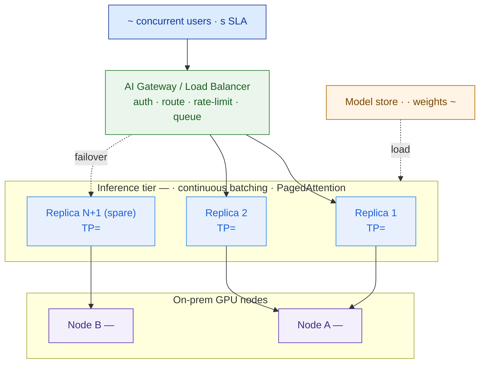

# GPU Sizing Sheet + Serving Design — Template

> Fill this in to answer "how many GPUs, of what type, and why?" for a self-hosted LLM engagement. Every number must trace to a **stated assumption** and land inside a **range** — never a single magic figure. An executive should read the summary; an engineer should trust the math; the two throughput/latency numbers must be **measured** with the lab, not guessed. This sheet feeds the GPU lines of the AI-platform bill of materials (Capstone E).

**Customer:** `<company>`  ·  **Prepared by:** `<SA name>`  ·  **Date:** `<YYYY-MM-DD>`
**Engagement:** `<deal / project>`  ·  **Placement:** `<on-prem DC / private cloud / hybrid>`  ·  **Version:** `<v0.1 draft>`

**Legend:** VRAM = GPU video memory · KV = key/value attention cache · TP = tensor parallelism (one model sharded across N GPUs) · TTFT = time to first token · TPOT = time per output token · GQA = grouped-query attention · N+1 = one spare replica · [LAB] = must be measured, not assumed.

---

## 0. How to size (the method, once)

```
① WEIGHTS VRAM   = params × bytes/param (at chosen precision: FP16=2, FP8/INT8=1, INT4=0.5)
② KV per token   = 2 × layers × kv_heads × head_dim × bytes         (2 = key + value; use kv_heads, not attn_heads — GQA!)
③ IN-FLIGHT reqs = (concurrent_users / query_cadence) × avg_latency  (Little's Law — NOT all users at once)
④ KV VRAM        = in-flight × avg_context × KV-per-token
⑤ GPUs / replica = CEIL( (weights + working-KV + overhead) / VRAM-per-GPU )   → TP if > 1; keep TP group in ONE node
⑥ REPLICAS       = MAX( throughput-driven , concurrency/latency-driven ) at target load ≤ ~60–70%
⑦ + N+1          = one spare replica so a GPU/host failure is a capacity dip, not an outage
⑧ NODES          = pack replicas into GPU servers (TP group inside one server's NVLink)
RESULT: GPU type + count as a RANGE, a recommended point estimate, and a cost band.
```

The single most important check on this page: **is the design weights-bound or KV-bound?** For a big model at high concurrency it is almost always **KV-bound** — the weights fit, the *cache for simultaneous requests* is what forces more GPUs. Get that wrong and you'll oversize the model layer and undersize the fleet.

---

## 1. Inputs (pin these first — most come from earlier lessons)

| Input | Value (+ band) | Source |
|---|---|---|
| Model + params | `<model, N B params>` | Lesson 5.1 model-selection matrix |
| Quantization / precision | `<FP16 / FP8 / INT8 / INT4 AWQ>` | Lesson 5.1 (validate quality in 5.6) |
| Model config: layers / kv_heads / head_dim | `<L / KVh / hd>` | model card — **use real numbers** |
| RAG request shape: input / output tokens | `<in ~N (band) · out ~N (band)>` | Lesson 5.3 RAG design |
| Effective resident sequence length | `<~N tokens (band)>` | input + output + margin |
| **Peak concurrent users** | `<N>` (**pinned — do not soften**) | discovery |
| Query cadence (per active user) | `<~N s between queries (band)>` | `ASSUMPTION` — behaviour |
| **Target answer latency (SLA)** | `<~N–N s>` (**pinned**) | discovery |
| Availability posture | `<N+1 / N+2 / N+0>` | risk appetite / team size |

## 2. Weights VRAM (step ①)

```
weights_VRAM = params × bytes_per_param  → + ~10–20% loaded overhead
  <N B> × <bytes> = <X GB>  → ~<Y GB> loaded          band <lo>–<hi> GB
  reference:  FP16 = <2×N> GB · FP8/INT8 = <1×N> GB · INT4 = <0.5×N> GB
```

> `ASSUMPTION` — loaded overhead (non-quantized embeddings/scales, CUDA context) adds ~10–20% over the raw weight bytes.

## 3. KV-cache per token & per request (step ②)

```
KV_per_token   = 2 × <layers> × <kv_heads> × <head_dim> × <bytes(KV precision)>  = <X bytes> ≈ <Y MB>/token   band <lo>–<hi>
KV_per_request = <resident_tokens> × <Y MB>  = <Z GB>/request                                  band <at-min-ctx>–<at-max-ctx>
```

> `ASSUMPTION` — KV precision `<FP16 = 2 bytes / FP8 = 1 byte>`. **Check GQA:** kv_heads `<KVh>` ≪ attn_heads `<Ah>` shrinks this by `<Ah/KVh>×`. If the model has no GQA, this line explodes — re-check the model card.

## 4. In-flight requests — Little's Law (step ③)

```
λ (arrival) = concurrent_users / query_cadence = <N> / <cadence s> ≈ <λ> req/s   band <lo>–<hi>
W (service) ≈ target latency ≈ <W s>                                             (mid of SLA)
IN-FLIGHT   = λ × W = <λ> × <W> ≈ <M> simultaneous requests                      band <lo>–<hi>
Design target (burst headroom): ~<M×1.4> KV slots.
```

> The costly error is sizing KV for *all* concurrent users. Only the requests **mid-generation** hold KV. Little's Law gives that number and still honours the pinned concurrency.

## 5. Per-replica capacity → GPUs per replica (steps ④–⑤)

Try one GPU first; escalate to TP only if concurrency (KV), not weights, forces it.

```
1× <GPU, VRAM>:  <VRAM> − <weights> − <overhead> = <KV budget> → / <KV/req> ≈ <slots> in-flight   → enough?  Y/N
TP=<k> on <k>× <GPU>:  <k×VRAM> pooled − <weights> − <overhead> = <KV budget> → / <KV/req> ≈ <slots> in-flight
   Latency cap  [LAB]:  keep running batch ≤ <B> to hold TPOT ≤ <ms> (so out_tok × TPOT ≤ SLA)
   Safe concurrency/replica = MIN(VRAM <slots>, latency <B>) ≈ <C> in-flight
   Throughput/replica  [LAB]: ≈ <lo>–<hi> tok/s aggregate decode   ← MEASURE with the micro-bench
```

> `ASSUMPTION [LAB]` — the running-batch cap and per-replica tokens/sec are the two numbers you **must** validate on real hardware (see `lab/`). Everything downstream rests on them.

## 6. Replicas, nodes, N+1 (steps ⑥–⑧)

```
Peak demand:  in-flight ~<M>  ·  aggregate ~<λ × out_tok> tok/s   band <lo>–<hi>
ACTIVE replicas = MAX( <aggregate>/<thru per replica> , <M>/<C> ) at ≤ ~65% load = <A>   → <A × k> GPUs
+ N+1 spare     = <A+1> replicas                                                        → <(A+1) × k> GPUs
NODES: pack into <g>-GPU servers, each TP=<k> group inside one server.
   Option A (dense, 1 node): single <g>-GPU server — no host redundancy (✗ if make-or-break)
   Option B (host-redundant): <n>× <g/2 or g>-GPU servers — survives a node loss (✓ recommended for small teams)
```

## 7. Result — the range and the recommendation

```
                 ACTIVE   +N+1    NODES              GPUs (total)
<config>           <A>    <A+1>   <n × g-GPU>         <min>–<max>
─────────────────────────────────────────────────────────────────
GPU BOM = <MIN>× <GPU> (min viable) — <MAX>× <GPU> (recommended, host-redundant)
Recommended point estimate: <N>× <GPU> across <n> nodes (<A> active + 1 N+1, TP=<k>)
```

**Cost band** `ASSUMPTION — confirm with hardware partner; prices volatile:`

```
GPU silicon:   <N> × $<lo>–$<hi>/GPU            = $<lo>–$<hi>
Servers:       <n> × $<lo>–$<hi>/node (GPU+CPU+RAM+NIC+chassis) = $<lo>–$<hi>   ← quote SERVERS, not bare GPUs
+ not-in-this-sheet: networking · model/storage · power & cooling · <10–15%/yr> support/warranty
```

**Sanity checks:**
- Load per replica ≈ `<demand/replicas>` of `<thru>` tok/s ≈ `<%>` (healthy < ~70%).
- Weights `<X GB>` vs working-KV `<Z GB>` → design is **`<weights-bound / KV-bound>`** because `<reason>`.
- $ per named user ≈ `<capex / users>`; $ per concurrent seat ≈ `<capex / peak concurrent>`.

## 8. Serving topology (Mermaid skeleton — fill node/replica counts)



## 9. Assumptions & risks register (the CFO will read this)

| # | Assumption / risk | Value used | Band | How to confirm | If wrong → impact |
|---|---|---|---|---|---|
| 1 | Model + params | `<model>` | — | 5.1 sign-off | changes weights & KV per token |
| 2 | Quantization | `<INT4/FP8>` | policy | 5.6 quality eval | fail eval → step up precision → more GPUs |
| 3 | Query cadence | `<~N s>` | `<lo–hi>` | usage analytics / pilot | ± in-flight → ± replicas |
| 4 | Resident context length | `<~N tok>` | `<lo–hi>` | RAG design (5.3) trace | ± KV/request → ± GPUs |
| 5 | Per-replica tokens/sec | `<band>` | **[LAB]** | vLLM micro-bench | ± replica count |
| 6 | Running-batch / TPOT cap | `<B / ms>` | **[LAB]** | vLLM micro-bench under load | miss SLA or over-buy |
| 7 | GPU spec / VRAM / price | `<GPU, $band>` | `<lo–hi>` | hardware partner quote | changes count & cost |
| 8 | Availability posture | `<N+1>` | N+0↔N+2 | risk appetite / team size | outage tolerance |

**One-line sizing statement (fill in):**
> `<Customer>`'s serving tier sizes to **`<N>`× `<GPU>` (band `<MIN>`–`<MAX>`)** across `<n>` nodes, running `<model>` at `<quant>` on `<vLLM/…>` with TP=`<k>`, `<A>` active + `<N+1>` replicas; the design is **`<KV-bound / weights-bound>`** because `<the binding constraint>`. The cost dials are `<precision>`, `<N+1 posture>`, and `<GPU class>`.

---

*Worked example: see `example-bumi-energi-gpu-sizing.md` in this folder. Validate the two [LAB] numbers with `../lab/`.*
