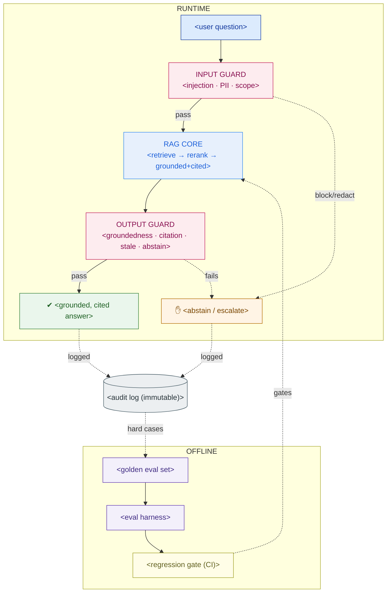

# Eval + Guardrail Plan — Template

> Fill this in before go-live and keep it live afterward. For a safety-critical assistant this document **is** the license to operate: it is how you prove a wrong answer is caught before it reaches a human, and how you keep proving it after every model or prompt change. An HSE / risk committee should grasp the scorecard and the gate; an engineer should be able to implement the guardrail matrix directly.

**Customer:** `<company>`  ·  **System:** `<assistant name>`  ·  **Corpus:** `<# docs / pages, domain>`
**Prepared by:** `<SA name>`  ·  **Date:** `<YYYY-MM-DD>`  ·  **Version:** `<v0.1 draft>`
**Go-live decision owner:** `<name / committee>`

---

## How to use this template

Work it top-down. Do **not** start from tooling — start from *harm*: tier the questions by how badly a wrong answer hurts, then hold the highest tier to near-perfection.

1. **Tier the eval set** — group questions by consequence of a wrong answer (S / A / B).
2. **Set metrics + thresholds** — thresholds rise with the tier; safety tier is near-perfect.
3. **Define the regression gate** — when the eval runs and what blocks a release.
4. **Specify the guardrail matrix** — every runtime input/output check, its action, its tool.
5. **Design human-in-the-loop** — what the highest tier does instead of free-generating.
6. **Run the responsible-AI checklist** — grounding, citations, abstention, auditability, fairness.
7. **Draw the pipeline** — fill the Mermaid skeleton.

Legend: **SoR truth** = the answer must trace to an authoritative source · **abstain** = designed refusal when not grounded · **Tier S/A/B** = safety-critical / operational / general.

---

## 1. Tiered golden eval set

> Build with SMEs, not alone. Each question needs a **human-verified ground-truth answer** and the **exact source(s)** it must cite. Version it like code; grow it from production logs.

| Tier | Covers | Example question | Harm if wrong | # questions (start → grow) |
|---|---|---|---|---|
| **S — Safety-critical** | `<life-safety procedures>` | `<question>` | Injury / death | `<~100 → …>` |
| **A — Operational** | `<specs, startup/shutdown, maintenance>` | `<question>` | Cost / downtime | `<~100 → …>` |
| **B — General / FAQ** | `<policy, definitions, "where is…">` | `<question>` | Convenience | `<~100 → …>` |

**Sourcing & growth:** `<who curates · how logs are mined · review cadence>`

## 2. Metrics & PASS thresholds (the scorecard)

> Thresholds rise with the tier. Any Tier-S cell below threshold = release blocked.

```
 EVAL SCORECARD — <system>                             run: <date>   model: <model/prompt version>
 ─────────────────────────────────────────────────────────────────────────────────────────────
 STAGE       METRIC                            TIER S      TIER A     TIER B     RESULT
 ─────────────────────────────────────────────────────────────────────────────────────────────
 Retrieval   recall@k   (right doc in top-k)   <≥ … >      <≥ … >     <≥ … >     <val / PASS|FAIL>
 Retrieval   context precision                 <≥ … >      <≥ … >     <≥ … >     <…>
 Generation  faithfulness / groundedness       <≥ … >      <≥ … >     <≥ … >     <…>
 Generation  citation coverage                 <= 100%>    <≥ … >     <≥ … >     <…>
 Generation  answer relevance                  <≥ … >      <≥ … >     <≥ … >     <…>
 Safety      false-answer rate (out-of-corpus) <= 0%>      <≤ … >     <≤ … >     <…>
 Safety      correct-abstention rate           <≥ … >      <≥ … >     <≥ … >     <…>
 ─────────────────────────────────────────────────────────────────────────────────────────────
 GATE: any TIER S cell below its threshold ⇒ RELEASE BLOCKED.
```

**How each number is produced:** `<RAGAS / custom / LLM-judge / human — per metric>`

## 3. Regression gate (CI policy)

| Trigger | What runs | Block condition |
|---|---|---|
| PR touching model / prompt / retriever / chunking | Full eval set | Any Tier-S metric below threshold **or** drop > `<margin>` pts vs prod baseline |
| Nightly | Full set vs prod config | Drift beyond `<margin>` → alert |
| Weekly | SME review of sampled + abstained production answers | Corrections feed §1 |

**Baseline & promotion:** `<current production model/prompt version = the baseline every change is compared against>`

## 4. Guardrail matrix (runtime)

```
 GUARDRAIL MATRIX — <system>
 ──────────────────────────────────────────────────────────────────────────────────────────
 STAGE    CHECK                          TRIGGER                          ACTION             TOOL
 ──────────────────────────────────────────────────────────────────────────────────────────
 INPUT    prompt-injection / jailbreak   <"ignore the manual…">           <block + log>      <Llama Guard / NeMo>
 INPUT    PII in query                   <names · IDs · phone>            <redact before log><classifier / regex>
 INPUT    out-of-scope                   <off-topic request>              <polite refuse>    <topical rail>
 OUTPUT   groundedness (NLI)             <claim not entailed by sources>  <abstain + escalate><verifier model>
 OUTPUT   citation-required              <safety claim w/o citation>      <suppress + abstain><custom policy>
 OUTPUT   stale-source                   <cited doc superseded/expired>   <abstain + flag>   <doc-version check>
 OUTPUT   toxicity / unsafe             <harmful content>                <block>            <Llama Guard>
 OUTPUT   low retrieval confidence       <top-k score < threshold>        <abstain + route>  <score threshold>
 ──────────────────────────────────────────────────────────────────────────────────────────
 DEFAULT POSTURE: <when in doubt, ABSTAIN — a refusal is safe, a confident wrong answer is not>
```

## 5. Human-in-the-loop (highest tier)

- **Tier-S behavior:** `<retrieve-and-present verbatim cited excerpt + "verify with authority" banner, NOT free-generate>`
- **Escalation path:** `<who reviews abstentions / low-confidence / flagged answers, and SLA>`
- **Feedback loop:** `<how SME corrections flow back into §1 eval set + a safe-answer library>`

## 6. Responsible-AI checklist

| Principle | Control in this system | Status |
|---|---|---|
| Grounding | `<answer only from retrieved sources; no open-domain generation>` | `<✓ / gap>` |
| Citations | `<every answer → source + version + effective date>` | `<…>` |
| Abstention | `<refuse when not grounded / low confidence>` | `<…>` |
| Human oversight | `<Tier-S retrieve-and-present + escalation>` | `<…>` |
| Transparency | `<sources + "as-of" date + confidence shown to user>` | `<…>` |
| Auditability | `<immutable log: query · chunks · model+prompt ver · answer · citations · guard decisions>` | `<…>` |
| Fairness / coverage | `<measure recall per equipment/topic class; flag thin coverage>` | `<…>` |
| Access control | `<user sees only documents they're cleared for (tie to identity)>` | `<…>` |

## 7. The pipeline (Mermaid skeleton)

> Replace the placeholders. Keep the runtime rails on top and the offline loop below; everything logs to the audit store.



### ASCII fallback (for docs/email that can't render Mermaid)

```
   AUDIT LOG (immutable) ◀── logs every answer, abstention, and guard decision ──────────────
   ─────────────────────────────────────────────────────────────────────────────────────────
   RUNTIME:  question ─▶ [INPUT GUARD] ─pass─▶ [RAG CORE] ─▶ [OUTPUT GUARD] ─pass─▶ ✔ answer
                              └─block─▶ ✋ abstain          └─fail─▶ ✋ abstain / escalate
   OFFLINE:  golden eval set ─▶ eval harness ─▶ scorecard ─▶ REGRESSION GATE ─gates─▶ RAG CORE
```

---

## 8. Go / no-go statement (fill in)

> The `<system>` is cleared to `<ship / stage / block>` because on the `<date>` scorecard **all Tier-S metrics `<pass / fail>`**, the regression gate `<is / is not>` wired into CI, the guardrail matrix `<is / is not>` implemented, and human-in-the-loop `<covers / does not cover>` every safety-critical answer. Residual risks: `<list>`.

---

*Worked example: see `example-bumi-energi-eval-guardrail-plan.md` in this folder.*
