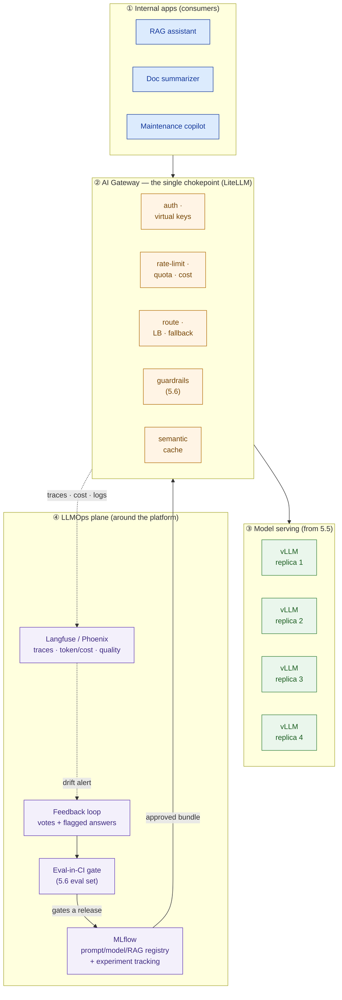

# LLMOps & AI Gateway

> A model in production without an operate layer degrades in the dark, blows its budget, and can't be audited. Design the gateway and the LLMOps loop, or you've handed the customer an outage waiting to happen.

**Type:** Design
**Track:** AI, Data & Infrastructure Solution Architect (Presales)
**Prerequisites:** 5.6 Evaluation, Guardrails & Responsible AI
**Time:** ~5h
**Lab:** LiteLLM + MLflow
**Ship It:** LLMOps + AI-gateway design

## The Problem

By now the AI platform exists on paper. Across Phase 5 you chose the **model** (5.1), stood up **embeddings and a vector database** (5.2), designed the **RAG** pipeline (5.3), decided where **agents and MCP** fit (5.4), sized the **GPU serving** tier with self-hosted vLLM replicas (5.5), and built the **evaluation and guardrails** that keep answers safe and grounded (5.6). It is a real private AI platform. Now it has to *run* — every working day, for thousands of employees, on a budget a small team can defend — and that is a different job.

Picture six weeks after go-live at **Bumi Energi**, an Indonesian energy company that self-hosts a RAG assistant over its internal knowledge — SOPs, equipment manuals, maintenance logs, safety procedures — for **~2,000 users** (**~200 concurrent** at peak) on its own vLLM replicas. The pilot was a hit, so two more internal apps quietly appeared: a **document summarizer** for inspection reports and a **maintenance-log copilot** that drafts work orders. All three point *straight at the vLLM endpoints*. Then the estate bites back. One afternoon the assistant starts giving thinner, less-grounded answers; three weeks earlier someone had "improved" the system prompt, and the change silently dropped faithfulness from **0.90 to 0.72** — but there was no monitoring, so nobody noticed until users complained. The same week the maintenance copilot kicked off an overnight batch that summarized 40,000 old logs, saturated the GPUs, and made the interactive assistant crawl for everyone else — there was no rate-limit and no quota, so one app starved the others. And when the security lead asked the questions that always come — *who queried the assistant last month, what did they ask, and prove it* — the honest answer was "we don't log that," because every app hits the model directly and there is no central place that sees the traffic.

Every one of those failures traces to the same rookie move: **shipping a model and calling it a platform.** A running LLM system with no operate layer *silently degrades* (you can't tell quality drifted), *blows its budget* (no cost control on a shared, finite GPU tier), *can't be audited* (no central log of who asked what), and *can't be changed safely* (nobody can say which prompt, model, or RAG config produced last month's answers). Letting every internal app hit the model directly is chaos — there is no single point to authenticate, throttle, guard, meter, or record. The architect's job here is not to run the platform day-to-day; it is to **design the operate layer** — an **AI gateway** in front of every model call plus the **LLMOps** discipline around it — so that a *small in-house team* can run it safely, cheaply, and defensibly. This lesson designs that layer, and it closes the private AI platform (Capstone E) as a system you can actually operate.

## The Concept

There are two things to design, and they clip together. The **AI gateway** is the *runtime* control point — one door that every model call passes through. **LLMOps** is the *lifecycle* discipline — how you version, evaluate, ship, and monitor what runs behind that door. Neither is a tool you install and forget; both are architecture.

### LLMOps is not MLOps

You already know MLOps in spirit from the data platform. LLMOps rhymes with it, but the artifacts and the failure modes are different, and confusing the two is how SAs oversize (a full training MLOps stack for a platform that trains nothing) or undersize (treating a live LLM like a static web service).

| Dimension | **MLOps** (classic ML) | **LLMOps** (LLM platform) |
|---|---|---|
| What you version | Training data, features, model weights | **Prompts, RAG config** (chunking, top-k, embedding model), **and** the served model version |
| Do you train? | Usually yes — pipelines, feature store | **Usually no** — you consume a served/pre-trained model; you *configure* it |
| What "a release" is | A retrained model artifact | A **bundle**: prompt version + model version + RAG config, promoted together |
| How you evaluate | Accuracy / F1 on a holdout set | **Quality** on generated text — faithfulness, relevance, guardrail pass-rate (5.6) |
| What you monitor | Feature drift, model accuracy | Latency, **token/cost**, and **quality/faithfulness drift** — two signals classic APM never had |
| The new operational risk | Data drift | **Cost blowout**, **prompt injection**, **silent quality regression** |

The one-line takeaway: **in LLMOps the model is often fixed and the moving parts are the prompt, the retrieval, and the guardrails** — so those are what you version, gate, and watch. The observability muscle from 2.7 (the three pillars, SLIs/SLOs, error budgets, burn-rate alerts) still applies; LLMs just add **two new signal types a generic monitoring stack won't capture on its own — token/cost per request and answer quality.**

### The AI gateway: one door in front of every model

Left to nature, every app grows its own copy of retries, its own API key, its own logging (or none). The fix is the same pattern you'd use in front of any shared backend: a **gateway** — a single proxy every request goes through, so cross-cutting concerns live in *one* place instead of scattered across every app. For LLMs the gateway earns its keep on seven responsibilities:

```
                 ┌───────────────────────────────────────────────────┐
   every app ───▶│                AI GATEWAY  (one door)             │───▶ vLLM replicas
   request       │                                                   │      (from 5.5)
                 │  AUTH        virtual API key per app / per team    │
                 │  RATE-LIMIT  RPM / TPM caps · per-team quota       │
                 │  ROUTE       load-balance replicas + fallback      │
                 │  GUARDRAIL   enforce 5.6 (PII, injection, refusal) │
                 │  CACHE       exact + semantic (reclaim GPU)        │
                 │  COST        count tokens → showback per team      │
                 │  LOG         full request/response → audit store   │
                 └───────────────────────────────────────────────────┘
   One chokepoint = one place to authenticate, throttle, guard, meter, and audit.
   Move any of these into the apps and you have seven copies to keep in sync — or, worse, zero.
```

Three of these deserve the architect's specific attention because they are the ones rookies leave out. **Routing + fallback** is what turns "four vLLM replicas" into "one resilient endpoint": the gateway load-balances across the healthy replicas and, if one is down or slow, retries on another — the apps never see it. **Cost tracking on a self-hosted tier is subtle**: there is no per-token cloud bill, so the "budget" is really the *finite GPU capacity* you already paid for. The gateway meters tokens per team and, by attaching an *internal* price (a nominal cost per 1K tokens), produces **showback** — the report that tells the business which team is consuming the shared GPU investment, and the quota that stops one team starving the rest. And the **guardrail enforcement point** is where 5.6 stops being a document and becomes a control: PII masking, prompt-injection checks, and topic/refusal rules run *at the gateway* on every call, so no app can accidentally skip them.

### Observability for LLMs: traces, cost, and quality

Behind the gateway sits the LLM-specific observability layer. It is the three pillars from 2.7 plus the two new signals:

- **Traces** — the path of one request across retrieval → prompt assembly → model → guardrails, with the actual prompt, retrieved chunks, tokens, and latency at each hop. This is how you answer *"why was this answer wrong?"* — usually because retrieval returned the wrong chunks, which a trace shows and a metric never will.
- **Token / cost metrics** — tokens in/out and cost per request, per app, per team — the input to showback and to catching a runaway job before it eats the budget.
- **Quality metrics** — faithfulness and relevance scored on sampled live traffic and on a fixed eval set, tracked over time so a **quality regression shows up as a falling line, not a support ticket three weeks late.**

Tools built for this — **Langfuse** and **Arize Phoenix** (both open-source, self-hostable) — capture LLM traces, token/cost, and quality scores in one place; the gateway streams its logs straight to them. Keep the SLI/SLO discipline from 2.7: define what "good" means (availability, p95 latency, a *quality floor*), and alert on burn, not on every blip.

### The LLMOps lifecycle loop

Versioning and evaluation only pay off when they run as a loop. Every change to the moving parts — a new prompt, a RAG tweak, a model bump — passes the **eval gate from 5.6** before it ships, gets **registered** as a versioned bundle, is **served** through the gateway, is **monitored** in production, and feeds a **feedback** signal back into the next change:

```
        ┌──────────────┐      ┌──────────────┐      ┌──────────────┐
        │ 1. CHANGE    │      │ 2. EVAL GATE │      │ 3. REGISTER  │
        │ prompt / RAG │────▶ │ 5.6 eval set │────▶ │ MLflow: ver. │
        │ model bump   │      │ in CI (pass?)│ pass │ prompt+model │
        └──────────────┘      └──────┬───────┘      └──────┬───────┘
               ▲                 fail │ block              │ promote
               │                      ▼                    ▼
        ┌──────┴───────┐      (reject — keep the    ┌──────────────┐
        │ 6. FEEDBACK  │       last good bundle)     │ 4. SERVE     │
        │ up/down votes│                             │ via gateway  │
        │ + flagged    │◀────────────────────────────│              │
        └──────┬───────┘                             └──────┬───────┘
               │                                            │
               └──────────── 5. MONITOR ◀───────────────────┘
                     latency · token/cost · faithfulness drift
```

**MLflow** is the reference tool for boxes 2 and 3: it tracks each eval run as an *experiment* (parameters = prompt version, model, RAG config; metrics = faithfulness, relevance, latency, cost) and its **registry** versions the approved bundle so you can always answer *"which prompt+model+RAG produced last month's answers?"* and roll back in one step. The whole loop is designed so a small team spends its attention on the two boxes that need judgement — reviewing eval results and triaging feedback — while the gateway and CI do the mechanical work.

### The whole picture



Read it as *two planes*: the **runtime plane** (apps → gateway → replicas) carries live traffic; the **LLMOps plane** wraps around it — CI gates a release, the registry stores it and feeds the approved bundle to the gateway, observability watches production, and feedback closes the loop. The architect designs both planes and the operating model that lets three people run them; the team writes the config.

## Design It

Design Bumi Energi's operate layer as an overlay on the vLLM serving tier from 5.5 and the eval/guardrails from 5.6. Work it in seven steps; the output is the Ship It deliverable.

**Platform recap (pinned):** ~2,000 internal users · ~200 concurrent at peak · a **RAG assistant** plus two more apps (doc summarizer, maintenance copilot) · **self-hosted vLLM replicas serving Qwen2.5-72B-Instruct (INT4)**, in-country · run by a **small in-house team (~3 people)** · cost control, auditability, and the 5.6 eval/guardrails must be enforced. *(From 5.5 sizing: 3 vLLM replicas — 2 active + 1 N+1 — TP=2, across 2× 4-GPU H100 nodes.)*

### Step 1 — Put a gateway in front of everything (kill the direct connections)

The first and highest-value decision: **no app talks to a vLLM endpoint directly — ever.** Deploy **LiteLLM** as an OpenAI-compatible proxy in front of the replicas and repoint all three apps at it. This single move creates the chokepoint that every later step needs. Apps keep using the standard OpenAI SDK; only the base URL changes. The vLLM endpoints move onto a segmented network reachable *only* by the gateway, so a leaked URL is no longer a way in.

### Step 2 — Routing, load-balancing, and fallback across the replicas

Register the 3 vLLM replicas (2 active + N+1) as one logical model in the gateway. Configure **least-busy (or round-robin) load-balancing** and **fallback**: if a replica is unhealthy or times out, the gateway retries the next one. The apps see a single, resilient endpoint with a stable name (e.g. `bumi-rag-llm`) — the replica count behind it can grow or shrink without any app change. This is where the 5.5 serving tier becomes operable.

### Step 3 — Auth, per-team rate-limits, quotas, and cost showback

Issue a **virtual API key per app/team** — the RAG assistant, the summarizer, and the copilot each get their own. On each key set:

- **Rate limits** (requests-per-minute and tokens-per-minute) so no single app can saturate the GPUs — the fix for the batch job that starved the assistant.
- **Quotas / budgets** — a monthly token (or nominal-cost) ceiling per team; batch-style workloads get a lower interactive priority so the RAG assistant's latency is protected.
- **Cost showback** — assign an *internal* price per 1K tokens (an assumption to confirm with finance) so the gateway attributes the finite, already-paid-for GPU capacity back to each team. On a self-hosted tier the "bill" is capacity, not cash — showback is how the business sees who is using the shared investment.

### Step 4 — Enforce the 5.6 guardrails and log everything for audit

Wire 5.6 into the gateway as **pre- and post-call hooks** so guardrails run on *every* request regardless of which app made it: PII masking on inputs/outputs, prompt-injection detection, and topic/refusal rules. Then turn on **full request/response logging** to an append-only audit store, capturing who (which key/user), when, the prompt, the retrieved sources, the answer, tokens, and any guardrail action. This is the artifact that answers the security lead's question — *who asked what, last month, and prove it* — and it is a design requirement for an energy company under Indonesia's PDP Law and internal data-sovereignty rules, not a nice-to-have.

### Step 5 — Version prompts, models, and RAG config in MLflow

Stand up **MLflow** as the registry and experiment tracker. Every candidate change is logged as an experiment run — parameters (prompt version, model version, chunking/top-k/embedding-model) and metrics (faithfulness, relevance, latency, cost from the 5.6 eval). The **approved bundle** (prompt + model + RAG config, promoted together) is versioned in the registry. Now "which configuration produced last month's answers?" is one lookup, and a bad release rolls back to the last good bundle in one step instead of a frantic guess.

### Step 6 — Monitor latency, cost, and quality; gate releases in CI; close the feedback loop

Point the gateway's logs at **Langfuse (or Phoenix)** for live traces, token/cost, and sampled quality scores. Define the platform's SLOs (Step 7 below), and alert on **burn**, not on every blip. Put the **5.6 eval set in CI**: no prompt/RAG/model change ships unless it clears the quality floor and adds no guardrail regressions — this is the gate that would have caught the 0.90→0.72 faithfulness drop *before* production. Add a **feedback loop**: a thumbs up/down in the assistant plus a "flag this answer" path, feeding a queue the team triages weekly into new eval cases. The loop from The Concept is now real.

### Step 7 — Define the SLOs and the small-team operating model

Set the handful of SLIs the users and the business would actually feel — including the LLM-specific **quality floor** — as *proposed* targets the business confirms:

| Service | SLI | Proposed SLO (window) | Rationale |
|---|---|---|---|
| RAG assistant | Availability (gateway up) | **99.5% / 30d** (~3.6 h/mo) | Internal productivity tool, not 24/7 payments — three-plus nines would over-spend |
| RAG assistant | Latency (p95, end-to-end) | **≤ 6 s** (time-to-first-token ≤ 2 s) | Interactive Q&A; users abandon a slow assistant |
| RAG assistant | **Faithfulness (quality floor)** | **≥ 0.85** rolling weekly (5.6 eval + sampled live) | The LLM-specific SLI — catches silent quality drift |
| Platform | Interactive latency held at ≤ 200 concurrent | p95 within SLO at peak | Batch workloads throttled so they never break interactive |

Then define **who watches what** — the operating model is what proves a small team can run this:

```
   AUTOMATED (the gateway/CI do it, no human)      HUMAN (the ~3-person team)
   ──────────────────────────────────────────      ─────────────────────────────────────
   rate-limit / quota enforcement                   weekly: review eval + quality dashboard
   replica load-balance + fallback                  weekly: triage flagged answers → eval set
   guardrail checks on every call                   on alert: SLO burn (latency / quality)
   token metering + showback tally                  monthly: cost/showback review with teams
   full request/response audit logging              quarterly: audit export for compliance
   eval-in-CI gate on every release                 approve/promote a release bundle
```

The design goal of this table: **the gateway and CI absorb the toil so judgement is the only thing left for the humans.** That is what makes "operable by a small in-house team" a defensible claim rather than a hope.

### Validate it (Lab) — LiteLLM in front of a model, one run logged to MLflow

You don't architect an operate layer you've never seen carry a request. Stand up the smallest possible version — a LiteLLM proxy in front of one model, and a single eval run logged to MLflow — so Steps 1 and 5 stop being abstract. Everything is local; it validates the design claim, it does not build a product.

**1. Run a LiteLLM gateway in front of a model.** Create `litellm-config.yaml` (point `api_base` at your local vLLM from 5.5, or any OpenAI-compatible endpoint):

```yaml
model_list:
  - model_name: bumi-rag-llm          # the stable name apps call
    litellm_params:
      model: openai/llama-3.1-8b-instruct
      api_base: http://localhost:8000/v1   # your vLLM replica
      api_key: os.environ/VLLM_API_KEY
router_settings:
  routing_strategy: least-busy         # load-balance when you add more replicas
  num_retries: 2                        # fallback on failure
```

```bash
pip install "litellm[proxy]" mlflow
litellm --config litellm-config.yaml --port 4000 &   # the gateway is now the one door

# call the MODEL THROUGH THE GATEWAY with the standard OpenAI shape:
curl http://localhost:4000/v1/chat/completions \
  -H "Content-Type: application/json" \
  -d '{"model":"bumi-rag-llm","messages":[{"role":"user","content":"What PPE is required to enter a live substation?"}]}'
# every app hits :4000, never the vLLM port — that is the chokepoint from Step 1.
```

**2. Log one eval run to MLflow** (Step 5 in miniature — version a "bundle" and its quality metric):

```python
import mlflow
mlflow.set_experiment("bumi-rag-eval")
with mlflow.start_run(run_name="prompt-v3"):
    mlflow.log_param("prompt_version", "v3")
    mlflow.log_param("model", "llama-3.1-8b-instruct")
    mlflow.log_param("rag_top_k", 5)
    mlflow.log_metric("faithfulness", 0.88)   # from your 5.6 eval harness
    mlflow.log_metric("p95_latency_s", 4.2)
# then run `mlflow ui` and open http://localhost:5000 to compare runs.
```

Open the MLflow UI and you can see two runs side by side — `prompt-v3` at faithfulness 0.88 versus a `prompt-v4` you'd reject at 0.72. That comparison *is* the eval gate: the whole platform is this pattern multiplied by every app, replica, and release.

## Compare It

The design names open reference tools. In a real deal the customer will ask "why this and not that?" — so know the trade-offs, and the one that dominates for a self-hosting Indonesian energy company: **data residency and a small team's operating burden.**

**AI gateway — which proxy:**

| Option | What it is | Residency / self-host | Best when… |
|---|---|---|---|
| **LiteLLM** (open, self-hosted) | OpenAI-compatible proxy, 100+ providers, routing/fallback, keys/quotas/budgets, caching, guardrail hooks, callbacks to Langfuse | **Self-host, in-country**; you own every byte | On-prem/regulated, small team, fronting your own vLLM — **Bumi's case** |
| **Portkey** (commercial; OSS core) | AI gateway with richer built-in observability, prompt management, and guardrails; SaaS or self-host enterprise | Self-host tier keeps data local; SaaS does not | You want more built-in observability and will pay/self-host the enterprise build |
| **Kong AI Gateway** (plugins on Kong) | AI routing, rate-limit, semantic cache, guardrails as plugins on the Kong API gateway | Self-hostable alongside existing Kong | You **already run Kong** for APIs and want AI on the same gateway plane |
| **Cloud AI gateways** (Bedrock, Azure AI Foundry / APIM, Vertex) | Managed gateway tied to the cloud's model catalog | **Traffic leaves to the cloud** → residency problem for on-prem serving | Already cloud-native, using cloud-hosted models, no residency limit |

For Bumi the cloud gateways are largely **disqualified for the serving path** — the models are self-hosted in-country by design, so routing that traffic through a cloud control plane defeats the point. That leaves the self-hostable options, and for a three-person team the pragmatic default is **LiteLLM**: it does the seven jobs, self-hosts, and keeps the surface small.

**Experiment tracking & LLM observability — which registry/observer:**

| Option | Strength | Watch-outs | Fit for Bumi |
|---|---|---|---|
| **MLflow** (open) | Experiment tracking **+ model/prompt registry**; self-host; strong for versioning + eval-in-CI | Live LLM tracing is newer than purpose-built tools | **Yes** — the registry + CI-gate backbone |
| **Weights & Biases** | Excellent experiment UX; Weave adds LLM tracing/eval | Commercial; SaaS raises residency questions | Only if self-hosted enterprise and budget allows |
| **Langfuse** (open) | **LLM-native** production observability — traces, sessions, token/cost, quality scores, prompt mgmt | Not a full training-experiment registry | **Yes** — the live observability half |

The clean split for Bumi: **MLflow for versioning + the eval-in-CI gate, Langfuse for live traces/cost/quality.** They overlap a little (both touch prompts and eval); pick the pairing, don't run three overlapping tools with three people.

**Build vs buy for a small team.** The temptation is to "just build a thin proxy." Don't. A gateway that does auth, routing, fallback, quotas, caching, guardrails, and audit logging is a product in itself — building it burns the exact scarce resource (three people's time) the platform is supposed to conserve. **Adopt battle-tested open source and self-host it**; the team's job is to *operate* the platform, not to *build* an ops platform. Managed SaaS would remove even the operating burden, but residency and data-sovereignty rule it out for the serving path here — which is itself a point worth stating plainly in the proposal, because an executive respects a constraint-driven decision.

## Ship It

This lesson ships an **LLMOps + AI-Gateway Design** — the operate-layer chapter that turns a built AI platform into a runnable, auditable, cost-controlled one, and the **final input to Capstone E**. Both files live in [`outputs/`](../outputs/):

- **[`template-llmops-ai-gateway-design.md`](../outputs/template-llmops-ai-gateway-design.md)** — a fill-in-the-blank template: the two-plane architecture (Mermaid), the gateway-responsibilities matrix, the versioning/registry section, the SLO + monitoring table, the eval-in-CI gate, the feedback loop, and the small-team operating model. A colleague can run it against any self-hosted LLM platform.
- **[`example-bumi-energi-llmops-gateway.md`](../outputs/example-bumi-energi-llmops-gateway.md)** — the template fully worked for Bumi Energi, so the skeleton isn't abstract. It is the artifact you attach to the Capstone E proposal.

The point of shipping this as the phase closer: a design that shows *both* how every model call is authenticated, throttled, guarded, metered, and logged *and* how a small team keeps quality from drifting is the difference between "we built you an AI platform" and "we built you one you can **run, afford, and defend** with the team you have." The second one is what actually goes into production — and it closes the private AI platform.

## Exercises

1. **(Easy)** For each incident from The Problem, name the *one* gateway or LLMOps capability that would have prevented it: (a) faithfulness silently dropped 0.90→0.72 for three weeks; (b) a batch job saturated the GPUs and starved the assistant; (c) "who queried the assistant last month?" is unanswerable. Then write the single **quality-floor SLO** you'd propose for Bumi's RAG assistant, with its measurement definition and one sentence of rationale.
2. **(Medium)** Re-scope the operate layer for a *different* customer: a **mid-size Indonesian bank** running a self-hosted LLM for internal document search, under OJK (recall 2.7). Keep the seven gateway responsibilities, but rewrite the **audit** and **residency** requirements for OJK, and name the **one SLO that gets stricter** than Bumi's and why. Which gateway would you pick, and what disqualifies the cloud options?
3. **(Hard)** Combine this with your **5.6 eval/guardrail plan** and the **2.7 observability design**. Design the **release pipeline** end-to-end: a prompt change enters CI → runs the 5.6 eval set → (a pass/fail decision rule you specify) → registers a bundle in MLflow → is served through the gateway → is monitored with the SLOs here. Draw where a **rollback** triggers automatically and where a human must approve. Save it alongside your worked example; you'll reuse it in Capstone E.

## Key Terms

| Term | What people say | What it actually means |
|------|-----------------|------------------------|
| LLMOps | "MLOps for LLMs" | The lifecycle discipline for a platform that usually *doesn't train* — you version and gate the **prompt, RAG config, and model bundle**, and monitor **quality and cost**, not training accuracy. |
| AI gateway | "A proxy" | The single door every model call passes through, so auth, rate-limits, routing/fallback, guardrails, caching, cost metering, and audit logging live in **one** place instead of scattered across apps. |
| Virtual API key | "The API key" | A per-app/per-team credential the gateway issues, carrying its own rate-limit, quota, and budget — the unit of throttling and cost attribution. |
| Cost showback | "The bill" | On a self-hosted tier there is no cloud bill; the gateway meters tokens and attaches an *internal* price so the business sees which team consumes the **finite, already-paid-for GPU capacity**. |
| Prompt/RAG/model bundle | "The prompt" | The three moving parts promoted **together** as one versioned release — so you can say exactly what produced an answer and roll back in one step. |
| Eval-in-CI gate | "We test it" | The 5.6 eval set run automatically on every change; a release **cannot ship** unless it clears the quality floor and adds no guardrail regressions — the cure for silent drift. |
| Quality / faithfulness drift | "It got worse" | A measurable fall in an answer-quality SLI (e.g. faithfulness) over time — an LLM-specific signal a generic APM never captures, so you must monitor it deliberately. |
| LLM observability | "Monitoring" | Traces (retrieval→prompt→model→guardrail), token/cost, and quality scores in one place (Langfuse/Phoenix) — the three pillars of 2.7 plus the two LLM-only signals. |
| Semantic caching | "Caching" | Returning a stored answer for a *semantically* similar (not byte-identical) prompt — reclaims scarce GPU capacity on a self-hosted tier. |

## Further Reading

- [LiteLLM Proxy documentation](https://docs.litellm.ai/docs/simple_proxy) — the OpenAI-compatible gateway used in the lab; read routing, virtual keys, budgets, and callbacks to see the seven responsibilities in one tool.
- [MLflow — Tracking and Model Registry](https://mlflow.org/docs/latest/index.html) and [MLflow GenAI / Prompt Registry](https://mlflow.org/docs/latest/llms/index.html) — experiment tracking and the versioned-bundle registry behind the LLMOps loop.
- [Langfuse documentation](https://langfuse.com/docs) and [Arize Phoenix](https://docs.arize.com/phoenix) — the open, self-hostable LLM-observability half: traces, token/cost, and quality scoring.
- [Kong AI Gateway](https://docs.konghq.com/gateway/latest/ai-gateway/) and [Portkey AI Gateway](https://portkey.ai/docs) — the two gateway alternatives from Compare It; skim each to argue the "why LiteLLM" choice.
- [Google SRE Workbook — Alerting on SLOs](https://sre.google/workbook/alerting-on-slos/) — the burn-rate discipline from 2.7 that the SLO/monitoring step reuses for the LLM quality floor.
- [Chip Huyen — Building LLM applications for production](https://huyenchip.com/2023/04/11/llm-engineering.html) — a grounded tour of prompt/version drift, evaluation, and cost in production LLM systems; the mental model this lesson operationalizes.
- [OWASP Top 10 for LLM Applications](https://owasp.org/www-project-top-10-for-large-language-model-applications/) — prompt injection and the risks the gateway's guardrail enforcement point exists to contain; pair with your 5.6 plan.
