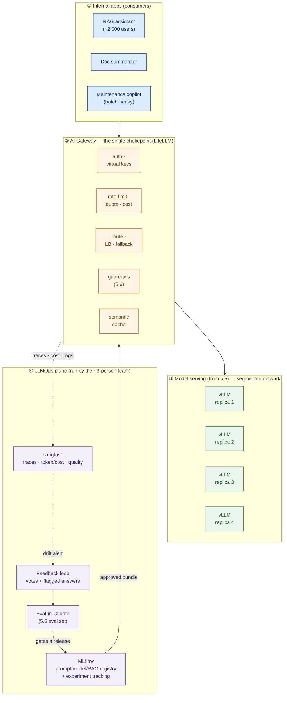

# LLMOps + AI-Gateway Design — Bumi Energi (worked example)

> This is `template-llmops-ai-gateway-design.md` filled in for a fictional customer. It shows what "good" looks like: a gateway that makes every model call authenticated, throttled, guarded, metered, and logged, plus an LLMOps loop that keeps quality from drifting — all runnable by a small team. It is the operate-layer chapter of the Capstone E private-AI-platform proposal, and it closes that capstone.

**Customer:** Bumi Energi (fictional)  ·  **Industry / regulator:** Energy · Indonesia's **PDP Law (UU PDP)** + internal data-sovereignty rules
**Prepared by:** SA — Presales  ·  **Date:** 2026-07-05  ·  **Opportunity:** Private AI platform (Capstone E)  ·  **Version:** v0.2

**Platform shape (pinned):** **~2,000 users** · **~200 concurrent** at peak · apps: **RAG assistant** (primary) + **doc summarizer** + **maintenance-log copilot** · serving: **self-hosted vLLM replicas serving Qwen2.5-72B-Instruct (INT4), in-country** *(from 5.5: 3 replicas — 2 active + 1 N+1, TP=2 — across 2× 4-GPU H100 nodes)* · run by a **small in-house team (~3 people)** · must enforce **cost control · auditability · the 5.6 eval/guardrails**.
**Non-negotiables (verbatim):** must run in production, **operable by a small in-house team**, with **cost control, auditability**, and the **eval/guardrails from 5.6 enforced**; models and data stay **in-country**.

---

## Part A — The operate-layer architecture



**Deployment note:** the gateway is the *only* client of the vLLM replicas; the replicas sit on a segmented network with no route from the apps. Gateway, MLflow, and Langfuse all run **in-country** on the same private platform — no traffic crosses the border, which is what keeps the design PDP-compliant and disqualifies cloud AI gateways for the serving path.

```
   every app ───▶ [ AI GATEWAY (LiteLLM): auth · rate-limit · route/fallback ·
   request         guardrail(5.6) · cache · cost · log ] ───▶ 4× vLLM replicas
                          │  traces · token/cost · logs
                          ▼
   [ LLMOps plane ]  MLflow(registry) ── eval-in-CI(5.6) ── Langfuse(obs) ── feedback
                     approved bundle ──▶ back to gateway;  drift alert ──▶ feedback
```

---

## Part B — Gateway responsibilities matrix

| # | Responsibility | What it does here | Config / tool | Owner |
|---|---|---|---|---|
| 1 | **Auth** | one virtual key per app: `rag-assistant`, `doc-summarizer`, `maint-copilot`; direct vLLM access blocked | LiteLLM virtual keys | Platform eng |
| 2 | **Rate-limit** | RPM/TPM caps per key so the copilot's batch can't saturate the GPUs | per-key RPM/TPM | Platform eng |
| 3 | **Quota / budget** | monthly token ceiling per team; copilot batch runs at lower priority than interactive RAG | per-key budget | Platform eng |
| 4 | **Route / LB / fallback** | balance across the 4 healthy replicas (`least-busy`), retry on a 5th choice; apps see one name `bumi-rag-llm` | routing strategy + `num_retries` | Platform eng |
| 5 | **Guardrails** | 5.6 controls on **every** call: PII masking (names, meter IDs, locations), prompt-injection check, off-topic refusal | pre/post-call hooks | AI eng + Security |
| 6 | **Cache** | exact + semantic cache for repeated SOP/manual questions — reclaims GPU capacity for the interactive tier | LiteLLM cache (Redis) | Platform eng |
| 7 | **Cost / showback** | tokens metered per key; internal price **~Rp 50–150 / 1K tokens** *(assumption — amortized GPU cost, confirm with finance)* → monthly showback of the shared GPU capacity | LiteLLM spend tracking | Platform eng + Finance |
| 8 | **Audit log** | full request/response (who · when · prompt · retrieved sources · answer · tokens · guardrail action) → append-only store | LiteLLM logging → object store | Security |

---

## Part C — LLMOps: versioning, eval-gate, monitoring, feedback

### C1. Versioning & registry

- **The bundle:** system-prompt version **+** served model (`Qwen2.5-72B-Instruct` INT4 *(from 5.5; fallback Llama 3.3 70B)*) **+** RAG config (chunk size, `top_k=5`, embedding model from 5.2) — promoted **together** as one release.
- **Registry:** **MLflow** — each candidate is an experiment run (params = prompt/model/RAG; metrics = faithfulness, relevance, latency, cost from the 5.6 eval); the approved bundle is versioned in the MLflow registry.
- **Rollback:** re-point the gateway at the previous registered bundle — one step, minutes, not a frantic guess.
- **"Which config produced last month's answers?"** → a single MLflow lookup keyed by date/version. (This is exactly what was unanswerable in The Problem.)

### C2. Top SLOs (proposed — business to confirm)

| Service | SLI | Proposed SLO (30-day) | Rationale |
|---|---|---|---|
| RAG assistant | Availability (gateway up) | **99.5%** (~3.6 h/mo) | Internal productivity tool for 2,000 users, not 24/7 payments — three-plus nines would over-spend a small team's effort |
| RAG assistant | Latency (p95, end-to-end) | **≤ 6 s** (TTFT ≤ 2 s) | Interactive Q&A; engineers abandon a slow assistant on the plant floor |
| RAG assistant | **Faithfulness (quality floor)** | **≥ 0.85** rolling weekly (5.6 eval + sampled live) | The LLM-specific SLI — this is the line that would have caught the 0.90→0.72 drop |
| Platform | Interactive latency held at ≤ 200 concurrent | p95 within SLO at peak | Copilot batch throttled so it never breaks the interactive assistant again |

*Assumptions to confirm:* "faithfulness" scored by the 5.6 harness on a 120-case eval set weekly + a 2% live sample; "available" from a synthetic probe hitting the gateway; window = rolling 30 days; internal token price set by finance.

### C3. Monitoring & alerting (page only on burn)

| Condition | Signal | Action | Routes to |
|---|---|---|---|
| Availability/latency fast burn (2-window) | SLO symptom | **Page** | AI on-call (1 of 3) |
| **Faithfulness < 0.85** on weekly eval or live sample | quality SLI | **Page + freeze releases** | AI on-call |
| Team over monthly token quota | cost | Ticket + notify team lead | Ops queue |
| Prompt-injection / PII blocks spike | security | **Page + fork** | Security channel |
| A vLLM replica down (fallback absorbed it) | infra cause | Dashboard + ticket | Ops queue |

*Every alert links a runbook; a page means "act now," a ticket means "next working day." Cause alerts that fallback already absorbed do not page.*

### C4. Eval-in-CI gate

- **Eval set:** the 5.6 set — **~120 graded Q&A cases** over SOPs, manuals, and safety procedures.
- **Pass rule:** `faithfulness ≥ 0.85` **AND** `answer-relevance ≥ 0.80` **AND** no increase in guardrail violations vs the current production bundle.
- **On fail:** block the merge; the last good bundle stays live. *(This is the gate that stops another silent regression reaching 2,000 users.)*
- **On pass:** register the bundle in MLflow → a human promotes it → the gateway serves it.

### C5. Feedback loop

- **Signals:** thumbs up/down in the assistant UI, a "flag this answer" button (routes the trace + sources to a queue), and low-similarity retrievals auto-flagged from Langfuse.
- **Cadence:** the team triages the queue **weekly**, converts real misses into new eval cases, and feeds them into the next change — the eval set grows from production reality.

---

## Part D — The small-team operating model (the ~3-person team)

Roles: **Platform engineer** (gateway, serving, cost), **AI engineer** (prompts, RAG, eval, quality), **Security/compliance liaison** (part-time: guardrails, audit exports).

```
   AUTOMATED (gateway / CI — no human)              HUMAN (the ~3-person team)
   ──────────────────────────────────────           ─────────────────────────────────────
   rate-limit / quota enforcement                    weekly: AI eng reviews eval + quality dashboard
   replica load-balance + fallback                   weekly: triage flagged answers → new eval cases
   guardrail checks on every call                    on alert: whoever is on-call handles SLO burn
   token metering + showback tally                   monthly: platform eng runs cost/showback with teams
   full request/response audit logging               quarterly: security liaison exports audit for compliance
   eval-in-CI gate on every release                  approve/promote a release bundle (AI eng)
```

**Why 3 people is enough:** the gateway and CI do every repeating, mechanical job — throttling, failover, guardrails, metering, logging, and the release quality-gate — so the humans only spend time where judgement is required: reading the quality trend, triaging real misses, and approving a release. Nothing in the operating model requires a night shift or a large ops team.

---

## Part E — Findings & so-what

| # | Finding | Plane | Implication | Severity |
|---|---|---|---|---|
| 1 | All three apps hit the vLLM endpoints directly — no chokepoint | Runtime | No auth, throttle, or audit; a leaked URL exposes the model. Add the LiteLLM gateway (Step 1) | **High** |
| 2 | No quality monitoring — faithfulness fell 0.90→0.72 unnoticed for 3 weeks | LLMOps | Silent drift reached users; add the quality-floor SLO + eval-in-CI gate | **High** |
| 3 | No versioning of prompt/RAG — "what produced last month's answers?" unanswerable | LLMOps | No rollback, no audit of behavior; add the MLflow bundle registry | **High** |
| 4 | No rate-limit/quota — a batch job starved the interactive assistant | Runtime | One app breaks the platform for 2,000 users; add per-key rate-limits + quotas | **High** |
| 5 | No central request log | Runtime | Cannot answer "who asked what, last month"; PDP audit gap. Add full audit logging | **High** |
| 6 | A cloud AI-gateway trial routed traffic off-shore | Both | Residency breach for models chosen to be in-country; self-host the gateway | Medium |

**One-line design statement:**
> Bumi Energi's platform is made **operable** by a **LiteLLM** chokepoint enforcing **eight responsibilities** on every model call (auth, rate-limit, quota, routing/fallback, 5.6 guardrails, caching, cost showback, audit logging), and **safe to change** by an LLMOps loop that versions the prompt/model/RAG bundle in **MLflow**, gates every release on the **120-case 5.6 eval set**, and monitors **four SLOs including a 0.85 faithfulness floor** — all runnable by a **~3-person team**, with models, traffic, and audit records kept **in-country**.

**So what (the pivot this design buys you):** it turns "we built you a private AI platform" into "we built you one you can **run, afford, and defend** with the team you have." Every model call is now authenticated, throttled, guarded, metered, and logged; quality drift shows up as a falling line before users feel it; a bad release rolls back in one step; and the PDP/audit questions have a ready answer. This is the **final input to Capstone E** — it sits on top of the model, RAG, serving, and eval/guardrail work from 5.1–5.6 and makes the whole thing a system that goes into production, not a pilot that quietly rots.
