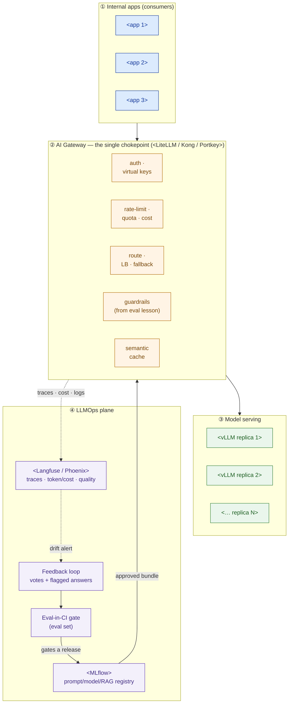

# LLMOps + AI-Gateway Design — Template

> Fill this in once the AI platform architecture (model, embeddings, RAG, serving, eval/guardrails) exists. It is the operate-layer chapter of an AI-platform proposal: it shows *how every model call is authenticated, throttled, guarded, metered, and logged* and *how a small team keeps quality from drifting and cost under control*. An executive should read the diagram and the operating model; an engineer should trust the gateway, SLO, and eval-gate tables.

**Customer:** `<company>`  ·  **Industry / regulator:** `<industry — e.g. energy · PDP Law · sector rules>`  ·  **Prepared by:** `<SA name>`  ·  **Date:** `<YYYY-MM-DD>`
**Engagement / opportunity:** `<deal or project name>`  ·  **Platform:** `<self-hosted / hybrid — where the models run>`  ·  **Version:** `<v0.1 draft>`

**Platform shape (carry the pinned figures forward):** `<N users>` · `<N concurrent at peak>` · apps: `<list the internal apps hitting the model>` · serving: `<N vLLM replicas / where>` · run by `<team size>` · must enforce `<cost control · audit · eval/guardrails>`.

---

## How to use this template

Two things to design, and they clip together:

1. **AI gateway** — the *runtime* control point: one door in front of every model call (auth, rate-limit, route/fallback, guardrails, cache, cost, log).
2. **LLMOps** — the *lifecycle* discipline around it: version the prompt/model/RAG bundle, gate every release on the eval set, monitor quality/cost/latency, close the feedback loop — all operable by a small team.

Legend: **bundle** = prompt version + model version + RAG config, promoted together · **SLI** = a measured indicator · **SLO** = its target over a window · **quality floor** = a minimum faithfulness/relevance SLO · **showback** = per-team cost/capacity attribution.

---

## Part A — The operate-layer architecture (Mermaid skeleton)

> Replace the app, replica, and tool nodes. Keep the two planes: runtime (apps → gateway → replicas) across the top, LLMOps plane (registry, observability, CI gate, feedback) around it. Delete rows you don't need.



### ASCII fallback (for docs/email that can't render Mermaid)

```
   every app ───▶ [ AI GATEWAY: auth · rate-limit · route/fallback · guardrail ·
   request         cache · cost · log ] ───▶ <vLLM replicas>
                          │  traces · cost · logs
                          ▼
   [ LLMOps plane ]  registry(<MLflow>) ── eval-in-CI ── observability(<Langfuse>) ── feedback
                     approved bundle ──▶ back to the gateway; drift alert ──▶ feedback
```

---

## Part B — Gateway responsibilities matrix

> The core of the runtime plane. Fill the tool/config column for the customer's chosen gateway.

| # | Responsibility | What it does here | Config / tool | Owner |
|---|---|---|---|---|
| 1 | **Auth** | virtual API key per app/team; no direct model access | `<gateway keys>` | `<team>` |
| 2 | **Rate-limit** | RPM/TPM caps so no app saturates the GPUs | `<per-key limits>` | |
| 3 | **Quota / budget** | monthly token/cost ceiling per team; batch de-prioritized | `<per-key budget>` | |
| 4 | **Route / LB / fallback** | balance across healthy replicas; retry on failure | `<routing strategy + retries>` | |
| 5 | **Guardrails** | enforce the eval-lesson controls on *every* call (PII, injection, refusal) | `<pre/post-call hooks>` | |
| 6 | **Cache** | exact + semantic caching to reclaim GPU capacity | `<cache backend>` | |
| 7 | **Cost / showback** | count tokens → attribute finite GPU capacity per team | `<internal price/1K tok>` | |
| 8 | **Audit log** | full request/response → append-only store | `<audit store + retention>` | |

---

## Part C — LLMOps: versioning, eval-gate, monitoring, feedback

### C1. Versioning & registry (what "a release" is)

- **The bundle:** `<prompt version + model version + RAG config (chunking / top-k / embedding model)>` — promoted together.
- **Registry:** `<MLflow / other>` — every candidate logged as an experiment run (params + eval metrics); approved bundle versioned.
- **Rollback:** `<one-step revert to the last good bundle — describe the mechanism>`.
- **Answer this:** *"which prompt+model+RAG produced last month's answers?"* → `<a single registry lookup>`.

### C2. Top SLOs (propose targets; the business confirms)

> Include at least one **LLM-specific quality floor** — the SLI a generic APM never captures. Never a magic number without rationale.

| Service | SLI | Proposed SLO (window) | Rationale |
|---|---|---|---|
| `<app>` | Availability (gateway up) | `<99.x% / 30d>` | `<why — not necessarily bank-grade>` |
| `<app>` | Latency (p95 / TTFT) | `<≤ X s>` | `<interactive UX>` |
| `<app>` | **Faithfulness (quality floor)** | `<≥ 0.8x rolling>` | `<catches silent quality drift>` |
| Platform | Interactive latency held at peak concurrency | `<p95 within SLO at ≤ N concurrent>` | `<batch throttled off interactive>` |

*Assumptions to confirm:* `<how faithfulness is measured, on what sample; what counts as "available", from where; the window>`.

### C3. Monitoring & alerting (page only on burn)

| Condition | Signal | Action | Routes to |
|---|---|---|---|
| Latency/availability fast burn | SLO symptom | **Page** | `<on-call>` |
| **Quality floor breached** (faithfulness < target) | quality SLI | **Page / review** | `<AI on-call>` |
| Cost/quota burn (team over budget) | cost | Ticket + notify team | `<ops queue>` |
| Guardrail spike (injection/PII blocks up) | security | **Page + fork** | `<security channel>` |

*Rule (from 2.7):* every alert is **actionable, urgent, and links a runbook** — or it is noise.

### C4. Eval-in-CI gate (the cure for silent drift)

- **Eval set:** `<the eval-lesson set — N graded cases>`; **pass rule:** `<e.g. faithfulness ≥ floor AND relevance ≥ X AND no guardrail regression>`.
- **On fail:** `<block the release; keep the last good bundle>`.
- **On pass:** `<register bundle → promote → serve via gateway>`.

### C5. Feedback loop

- **Signals:** `<thumbs up/down · "flag this answer" · low-confidence retrievals>`.
- **Cadence:** `<team triages weekly → new eval cases → next change>`.

---

## Part D — The small-team operating model (who watches what)

> This table is what makes "operable by a small team" a defensible claim, not a hope. The gateway/CI absorb the toil; humans keep only the judgement.

```
   AUTOMATED (gateway / CI — no human)              HUMAN (the <N>-person team)
   ──────────────────────────────────────           ─────────────────────────────────────
   rate-limit / quota enforcement                    weekly: review eval + quality dashboard
   replica load-balance + fallback                   weekly: triage flagged answers → eval set
   guardrail checks on every call                    on alert: SLO burn (latency / quality)
   token metering + showback tally                   monthly: cost/showback review with teams
   full request/response audit logging               quarterly: audit export for compliance
   eval-in-CI gate on every release                  approve/promote a release bundle
```

---

## Part E — Findings & so-what

| # | Finding | Plane | Implication | Severity |
|---|---|---|---|---|
| 1 | `<e.g. apps hit vLLM directly — no chokepoint>` | Runtime | `<no auth/throttle/audit; add gateway>` | `<H/M/L>` |
| 2 | `<e.g. no quality monitoring>` | LLMOps | `<silent drift; add eval-in-CI + quality SLO>` | `<…>` |
| 3 | `<e.g. no versioning of prompt/RAG>` | LLMOps | `<can't answer "what produced this"; add registry>` | `<…>` |
| 4 | `<e.g. SaaS gateway sends traffic off-shore>` | Runtime | `<residency breach; self-host>` | `<…>` |

**One-line design statement (fill in):**
> `<Customer>`'s platform is made **operable** by a `<gateway>` chokepoint enforcing `<7-8>` responsibilities on every model call, and **safe to change** by an LLMOps loop that versions the prompt/model/RAG bundle in `<registry>`, gates every release on the `<eval set>`, and monitors `<N>` SLOs including a **quality floor** — all runnable by a `<N>`-person team, with traffic and audit records staying `<in-country / as required>`.

---

*Worked example: see `example-bumi-energi-llmops-gateway.md` in this folder.*
