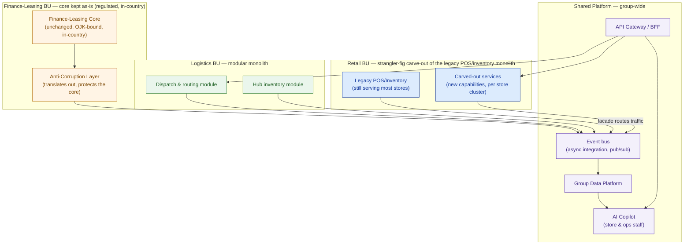

# Architecture Patterns

> A pattern is not a religion. Pick one per capability, defend the pick with a criterion, and expect to run four different patterns side by side in the same proposal.

**Type:** Design
**Track:** AI, Data & Infrastructure Solution Architect (Presales)
**Prerequisites:** Phase 5 (AI Platform Architecture)
**Time:** ~5h
**Lab:** —
**Ship It:** Pattern-selection guide

## The Problem

You're the SA on the board-sponsored transformation for **Cakrawala Group** — a diversified Indonesian conglomerate: ~350 retail outlets, ~40 logistics hubs, and one finance/leasing back office, ~18,000 employees group-wide, ~Rp 8 trillion in annual revenue. The board wants one proposal, not three: modernize the aging on-prem infrastructure across all three business units, adopt cloud where it fits, stand up a group-wide data platform, and add an AI copilot for store and ops staff. Budget ceiling is Rp 45–65 billion over a 3-year TCO, the delivery window is 12–18 months, and the headline number the board wants to see move is a 15–20% cost-to-serve reduction. They will read the HLD themselves, so whatever you propose has to be defensible in one sentence per decision.

Two junior instincts both fail here, and they fail in opposite directions. The first is **pattern-as-fashion**: because the AI copilot is the exciting part, propose microservices everywhere — decompose retail, logistics, and finance into forty independently deployable services, put an event mesh under all of it, and call it "cloud-native." On paper it looks modern. In practice, Cakrawala's operating team is mostly unskilled at running distributed systems — no SRE bench, no one who has operated a message broker in production — and you have 12–18 months, not three years, to get to value. A microservices-everywhere design turns the delivery window into a distributed-systems training program and the budget ceiling into a rounding error. The second instinct is the mirror image: **monolith-forever**, freeze everything as-is because "it's working" and just bolt a chatbot on the side. That fails differently — it can't compose. The AI copilot needs to read live inventory from retail, dispatch status from logistics, and (carefully) reference data from finance-leasing; a "don't touch anything" stance means the copilot either can't see real data or someone hand-wires a fragile point-to-point integration per BU, and the group-wide data platform the board asked for never actually gets built.

There's a third, quieter failure mode underneath the first two: treating "one proposal" as "one architecture." Cakrawala's three business units run three genuinely different stacks today — retail on an aging on-prem POS/inventory suite, logistics on its own dispatch system, finance-leasing on a regulated core — with no shared platform between them. That fragmentation is precisely *why* the board escalated this to one board-sponsored program instead of letting each BU modernize on its own budget. If your proposal collapses that reality into a single pattern choice, you've either ignored the fragmentation (and priced nothing to fix it) or over-corrected into a from-scratch platform rebuild (and blown both the budget ceiling and the 12–18 month window). The pattern menu below exists so you can hold "one proposal" and "three different stacks with three different right answers" in your head at the same time.

The real job is neither extreme: **pick the pattern per capability, not per enterprise.** Retail POS/inventory changes constantly and needs to shed 350 stores' worth of legacy risk — that's a different problem than the finance-leasing core, which is stable, regulated, and must stay in-country under OJK-style data residency rules and is the last thing you want to touch with a risky rewrite. An SA who reflexively reaches for one pattern for the whole estate — trendy or conservative — will either blow the budget/timeline or ship something the AI copilot can't actually plug into. This lesson gives you the pattern menu and, more importantly, the discipline to score each capability against team skill, change frequency, and coupling need *before* you name a pattern — and to expect the answers to disagree with each other across business units, because they should.

## The Concept

Architecture patterns are not a stack you climb from "worst" (monolith) to "best" (microservices). They're a **menu**, and the right selection criterion is almost never size or trendiness — it's **team boundaries and independent scaling/deploy needs**. If one team owns a capability end to end and it doesn't need to scale or deploy separately from its neighbors, splitting it into services only adds network calls, another thing to monitor, and another thing to fail. Split when a real organizational or scaling seam exists; don't split because a codebase "feels big."

### The pattern menu, at architect altitude

| Pattern | What it actually is | The real trigger to use it |
|---|---|---|
| **Monolith** | One deployable unit, one codebase, shared process | Small team, simple domain, low change velocity, no independent-scaling need |
| **Modular monolith** | One deployable unit, but internally partitioned into modules with enforced boundaries (own tables/schemas, no reaching across) | Multiple sub-teams or sub-domains that need clean seams *now*, but don't yet need independent deploy/scale — the default for most mid-size BU applications |
| **Microservices** | Independently deployable services, each owned by a team, each scaled separately | Distinct teams need to ship on different cadences, or a specific capability has a scaling profile wildly different from its neighbors (e.g., an AI inference service vs. a CRUD backend) — **and** the org can operate the platform this requires (CI/CD per service, service discovery, distributed tracing, on-call) |
| **Event-driven architecture (EDA)** | Services communicate by publishing/reacting to events on a bus, not by calling each other directly | Producers and consumers must be decoupled in time (consumer can be down, slow, or added later without touching the producer) and the org can operate a broker — or buys a managed one |
| **API Gateway / BFF** (Backend-for-Frontend) | A single front door that routes, authenticates, and shapes responses per consumer | Multiple heterogeneous front-ends (store app, ops app, AI copilot) need different views of the same backends, and you want one place to enforce auth/rate-limits instead of N places |
| **Strangler fig** | Route traffic through a facade; carve capabilities out of a legacy system incrementally until nothing is left to strangle | Retiring a legacy system you can't rewrite in one shot, and you need to keep it live and valuable throughout the migration |
| **Anti-corruption layer (ACL)** | A translation layer that protects a clean domain model from a messy or regulated one, without rewriting the thing it's protecting | The system behind it must stay largely untouched (compliance, stability, vendor lock, or simply "it works and rewriting it is not funded") but the rest of the estate still needs to integrate with it |

Two of these deserve a deeper look because they're where teams over- or under-commit.

**Choreography vs. orchestration** are the two ways to run a multi-step, cross-service business process once you've gone event-driven:

- **Choreography** — each service reacts to events and emits its own, with no central conductor. Lightweight, no single point of failure, scales well for simple fan-out (e.g., "inventory updated" triggers three independent listeners). But when something goes wrong, tracing "why didn't step 4 happen" means chasing logs across every service — it demands strong distributed-tracing discipline and a team that's comfortable operating a broker under incident pressure.
- **Orchestration** — a central engine (a workflow/state-machine service) calls each step, tracks state, and handles retries/compensation explicitly. Slightly more coupling to the orchestrator, but failure is visible in one place: you can look at the workflow instance and see exactly which step is stuck. For a team without deep distributed-systems experience, that visibility is worth the coupling.

The mistake to avoid: defaulting to choreography because it's the "purer" event-driven style, then discovering the operating team has no way to answer "where did this fail?" Match the failure-visibility need to the team's actual debugging skill, not to the pattern's reputation.

### Patterns compose — they don't replace each other

The most common architect-altitude mistake is treating this as a single enterprise-wide choice. It never is. The target is almost always **"shared platform, per-BU applications"**: each business unit keeps (or evolves) the application pattern that fits its own team and change profile, and a thin, shared integration and data layer stitches them together for cross-cutting concerns — group reporting, identity, and the AI copilot.



Four different patterns, one map, one delivery window. That's the skill this lesson teaches: not "which pattern is best" but "which pattern per box, and why." Notice, too, what the diagram deliberately does *not* show: no service mesh, no per-store microservice fleet, no choreographed event storm with forty producers and consumers. The shared platform is intentionally thin — one bus, one gateway, one data platform — because a thin shared layer is something a small, mostly-unskilled operating team can actually run. Every extra moving part you add to the "SHARED" box is something Cakrawala's ops team has to operate on day two, long after your proposal is signed off.

### Why the API Gateway / BFF earns its place here specifically

A gateway is not automatically justified just because a system has an API. It earns its place when you have **multiple, meaningfully different consumers of the same backend capabilities** — which is exactly Cakrawala's shape: a store-facing app, an ops-facing app, and now an AI copilot, all needing overlapping-but-different views of retail, logistics, and finance-leasing data. Without a gateway, each consumer wires its own point-to-point integration to each BU backend — 3 consumers × 3 BUs is nine fragile links before you've shipped anything. With a gateway, it's three links in, one contract out, and the AI copilot in particular never needs to know that "logistics" and "finance-leasing" are different systems, different teams, and (for finance-leasing) a different regulatory boundary. That single fact is also why the gateway is the natural seat for the access controls Lesson 6.2 will add — one front door is one thing to secure, not three.

### The pattern-selection matrix

Score every major capability against the same four columns before you name a pattern. This is the tool that keeps the decision honest and repeatable across a whole estate:

```
CAPABILITY                 CHANGE FREQUENCY   TEAM SKILL     COUPLING NEED        VERDICT
────────────────────────────────────────────────────────────────────────────────────────────────
High change + low skill  → Strangler fig, carve out incrementally, facade hides the mess
High change + high skill → Modular monolith or microservices, team can own the seam
Low change + any skill   → Leave as-is; wrap with an ACL if others must integrate with it
Any change + needs async → Event-driven integration; choreography only if skill supports it,
  decoupling from others    else orchestration for visibility
Many heterogeneous       → API Gateway / BFF — one front door, N backends, per-consumer shape
  consumers of one domain
```

Read it as a decision tree, not a lookup table: change frequency tells you whether the capability is even worth restructuring; team skill tells you how much operational complexity you can safely add; coupling need tells you whether you need synchronous calls, async events, or nothing at all; heterogeneity of consumers tells you whether a gateway earns its keep. You'll apply exactly this matrix to Cakrawala's five biggest capabilities next.

### Four ways an SA gets this wrong

Before you touch Cakrawala's actual capabilities, name the failure modes so you can catch yourself making them:

1. **Pattern-as-fashion.** Picking microservices because it's the pattern that shows up in every vendor slide deck, not because a specific capability scored high on team-skill and coupling need. The tell: you can't name which *team boundary* the split follows.
2. **Ignoring team skill.** Sizing the pattern to the architecture diagram instead of to the people who will run it at 2 a.m. Cakrawala's operating team is mostly unskilled at distributed systems — that fact alone should veto at least two of the fancier options on the menu, regardless of how clean they'd look on a slide.
3. **Event-driven where nobody can operate a broker.** Choosing choreography-heavy EDA because it's "the decoupled way," then discovering the team has never run Kafka (or anything like it) in production and has no plan for who's on call when a consumer group falls behind. A managed broker plus orchestration for the few processes that need visibility is the honest version of this pattern for a team like Cakrawala's.
4. **Monolith-forever blocking the AI copilot.** Freezing every BU's application as-is "because it works," then discovering the copilot has no sane way to read live data from any of them. The AI copilot is a new *consumer*, not a new backend — if nothing in the estate can produce clean, timely, governed data for it to read, the copilot proposal quietly becomes vaporware regardless of how good the model is.

Each of Cakrawala's five verdicts below is, in part, a defense against one of these four. Keep the list handy while you read Design It — every step names which of these four temptations it's resisting.

## Design It

The board wants one proposal covering three business units. Your job is to run each major capability through the matrix, land on a pattern, and be ready to defend every pick in one sentence to a board member who isn't an engineer.

### Step 1 — List the capabilities that actually need an architecture decision

Not every corner of the estate needs a pattern debate. Focus on the capabilities that are either changing, integrating, or both:

```
Retail POS / Inventory   ·   Logistics Dispatch   ·   Finance-Leasing Core   ·   AI Copilot   ·   Group Reporting
```

Five capabilities, five decisions. Everything else in the estate (HR, procurement, etc.) either isn't in scope for this transformation or inherits whichever BU pattern it already sits inside.

### Step 2 — Score each capability against the matrix

| Capability | Change frequency | Team skill (current ops) | Coupling need | Verdict |
|---|---|---|---|---|
| **Retail POS / Inventory** | High — 350 outlets, frequent promos, SKU churn | Low–Medium — retail IT runs the legacy stack, no platform team | Loose per store, needs group-wide visibility | **Strangler fig** — carve out store-facing services from the legacy monolith incrementally |
| **Logistics Dispatch** | Medium-High — routing rules change with network growth (40 hubs) | Low–Medium — ops-focused team, not a services team | Medium — hubs need to coordinate, but don't need per-hub independent deploy | **Modular monolith** with clear module boundaries; integrate to the group via events, not a full microservices split |
| **Finance-Leasing Core** | Low — regulated, stable, changes are deliberate and audited | Low — small, specialist team, no appetite for a rewrite | Others need read access, core must stay untouched | **Anti-Corruption Layer** in front of an unchanged core; no strangler fig, no rewrite — the core is not the risk, exposing it carelessly is |
| **AI Copilot (new)** | High — new capability, will iterate fast post-launch | Low (store/ops staff are the *users*, not operators; a small central team owns the copilot) | Loose — pure consumer of retail, logistics, and finance-leasing data | **API Gateway / BFF** in front of the copilot, so it never talks to three BU backends directly |
| **Group Reporting** | Low–Medium — board-level metrics, monthly/quarterly cadence | Low — no dedicated data engineering bench yet (this is what Phase 5's data platform lessons build toward) | Loose, read-only, can tolerate latency | **Shared data platform**, fed by CDC/batch extracts through the event bus — never a direct query against BU systems of record |

Notice the pattern in the "team skill" column: it's low or low-medium everywhere. That single fact rules out full microservices-everywhere and rules out choreography-heavy event storms as the default — not because those patterns are bad, but because Cakrawala can't operate them safely within a 12–18 month window with the team it has today.

### Step 3 — Retail: apply the strangler fig, don't rewrite 350 stores at once

Put a facade in front of the legacy POS/inventory monolith that routes each request either to the legacy system or to a newly carved-out service, by store cluster or by capability (start with inventory lookups — high value, low risk — before touching payment flows). Each sprint retires one more slice of the legacy system and the facade's routing table shrinks. This is the only realistic path to modernizing 350 outlets inside 12–18 months without a big-bang cutover risking Rp 8 trillion in revenue-generating stores going dark.

*Watch for:* carving out payment or promotions logic first because it's "more interesting" than inventory lookups. That's the highest-blast-radius slice in the whole monolith — a strangler fig only pays off if you sequence carve-outs from lowest to highest risk, and payments/promotions should be nearly last, not first.

### Step 4 — Logistics: modular monolith, event-driven integration to the rest of the group

Dispatch and hub-inventory stay one deployable unit — the team is small and doesn't need independent scaling per hub yet — but the module boundaries are enforced (dispatch cannot reach into hub-inventory's tables directly). Cross-BU visibility (retail needs to know delivery ETAs, the copilot needs dispatch status) goes out over the shared event bus as domain events like `shipment.dispatched` or `hub.inventory.updated`, not as direct database reads.

*Watch for:* the temptation to split dispatch and hub-inventory into separate services just because they're "different concerns." With 40 hubs and one small team, that split adds two deploy pipelines and a network hop for zero scaling benefit — the module boundary inside one deployable unit gives you the same clean seam without the operational cost.

### Step 5 — Finance-Leasing: wrap it, don't touch it

The core stays exactly where it is, in-country, under existing controls — that's non-negotiable given the OJK-style data residency constraint. An anti-corruption layer sits in front of it: it translates the core's native formats into the canonical event schema the rest of the group understands, and it is the *only* thing that talks to the core directly. This means the finance-leasing team's low change appetite is fully respected — the ACL absorbs all the "the rest of the group changed its integration needs" churn, so the regulated core never has to.

*Watch for:* letting "the AI copilot needs finance-leasing data" turn into "so let's put a read replica in the cloud." The ACL should expose only the specific, scoped facts the copilot needs (e.g., a customer's lease status, not the full ledger), and it should do so without moving the underlying regulated data itself out of the in-country boundary.

### Step 6 — AI Copilot: one gateway, three backends it never sees directly

The copilot needs retail inventory, logistics dispatch status, and finance-leasing reference data (kept read-only and heavily scoped, given the residency constraint) — three different domains, three different owning teams, three different data shapes. An API Gateway / BFF sits between the copilot and the group, exposing one coherent "ask a question, get grounded facts" contract while internally fanning out to the event bus and the group data platform. This also means when 6.2 (Security Architecture & Zero Trust) adds the auth and network controls, there's exactly one front door to secure for the copilot, not three.

*Watch for:* letting the copilot team wire direct connections to retail, logistics, and finance-leasing "just for the pilot, we'll clean it up later." Pilots have a way of becoming production; the gateway needs to exist from the first integration, not retrofitted after three direct connections already exist.

### Step 7 — Assemble the target operating model and sequence it against the window

Put the five verdicts on one map (the Concept diagram above *is* this map) and sequence delivery against the 12–18 month window and the 15–20% cost-to-serve target:

1. **Months 1–6:** Stand up the event bus and API gateway (shared platform foundations), start the retail strangler fig on the highest-value store clusters, and stand up the ACL in front of finance-leasing — these three unlock everything else and carry the least rewrite risk.
2. **Months 6–12:** Continue retail carve-out, bring logistics onto the event bus, land the first version of the group data platform fed by CDC from the ACL and the event bus.
3. **Months 12–18:** Ship the AI copilot behind the gateway, now that it has real, governed data to stand on; measure cost-to-serve against the 15–20% target using the first full quarter of shared-platform operation.

This sequencing is itself a defensible answer to "why this order?" — you start with the moves that de-risk everything downstream (integration plumbing, protecting the regulated core) and end with the most visible, most fashionable piece (the copilot), because it depends on everything before it.

It also matters that this sequencing survives a board member asking "what do we get at month 6 if the program stops there?" The answer has to be a real, usable slice of value, not a pile of unfinished plumbing — at month 6, retail already has fewer legacy dependencies, finance-leasing's core is safely wrapped instead of exposed, and the shared platform exists for whatever comes next. A sequencing plan that only produces value at month 18 is itself a red flag inside a board-sponsored program with a hard delivery window.

### Step 8 — Sanity-check the pattern choices against the budget ceiling

Before this goes in front of the board, run one gut-check: does the *pattern* set imply a cost shape that's even plausible inside Rp 45–65 billion over a 3-year TCO? Patterns aren't priced in this lesson (that's Lesson 6.4's job), but a rough allocation catches an oversized design early:

```
SHARED PLATFORM (bus, gateway, data platform)   ~15–20% of 3-yr TCO   — built once, used by all three BUs
RETAIL strangler-fig carve-out                  ~35–40% of 3-yr TCO   — 350 outlets is the largest surface area
LOGISTICS modular-monolith evolution            ~15–20% of 3-yr TCO   — smallest footprint, 40 hubs
FINANCE-LEASING ACL (core untouched)            ~5–10%  of 3-yr TCO   — wrapper only, not a rewrite
AI COPILOT (behind the gateway)                 ~15–20% of 3-yr TCO   — new build, but thin once the platform exists
```

*(Illustrative split for a sanity check, not a quote — Lesson 6.4 builds the real BOM.)* If your pattern choices implied, say, 40% of the budget on the finance-leasing core alone, that would be a signal you'd accidentally proposed a rewrite instead of an ACL — exactly the mistake Compare It warns against below. The pattern decision and the cost shape should agree with each other; if they don't, one of them is wrong.

## Compare It

The verdicts above are Cakrawala-specific answers; the trade-offs behind them are general enough to reuse on any deal. The next three comparisons are the ones a technical stakeholder will actually push back on in a design review — not "which pattern is theoretically best," but "why didn't you pick the other one, given our timeline and our team."

### Monolith vs. modular monolith vs. microservices — cost and risk against a 12–18 month window

| | Monolith | Modular monolith | Microservices |
|---|---|---|---|
| Ops burden | Lowest — one deploy pipeline | Low — still one deploy pipeline, internal discipline only | High — per-service CI/CD, service discovery, distributed tracing, on-call rotation |
| Team fit | Small team, one deploy cadence | Multiple sub-teams, shared deploy cadence | Multiple teams, each needing its *own* deploy cadence |
| Time-to-value in 12–18 months | Fast to build, slow to evolve safely at scale | Fast to build, safer to evolve than a plain monolith | Slowest to stand up — you're building a platform before you build the product |
| Fits Cakrawala today? | Yes, for logistics-scale teams | **Yes — the default for logistics and the carved-out retail services** | Only where a specific scaling profile demands it (e.g., a future GPU-backed inference tier) and a platform team exists to run it |

The honest read for Cakrawala: microservices-everywhere is not "more mature," it's a cost and operability bet that this transformation's team profile and timeline can't cash.

### Choreography vs. orchestration

| | Choreography | Orchestration |
|---|---|---|
| Coupling | Lowest — services don't know about each other, only about events | Slightly higher — steps are coupled to the orchestrator, not each other |
| Failure visibility | Poor without mature distributed tracing | Good — one workflow instance shows exactly where it's stuck |
| Team skill required | High | Moderate — the orchestration engine (e.g., a managed workflow service) does the hard part |
| Best fit at Cakrawala | Simple, high-volume domain events (`inventory.updated`, `shipment.dispatched`) | The few genuinely cross-BU processes — e.g., "copilot flags a stockout, opens a logistics task, notifies the store" |

Recommendation: default to choreography for simple fan-out events over the shared bus, but wrap any process with more than two or three steps and a human-visible outcome in an orchestration engine, so a small ops team can actually answer "what happened to this request?" without a distributed-tracing setup they don't yet have the skill to run.

### Strangler fig vs. big-bang rewrite

| | Strangler fig | Big-bang rewrite |
|---|---|---|
| Risk profile | Incremental, reversible — each slice can be rolled back independently | All-or-nothing — the legacy and the new system both must work until cutover, then one flips off entirely |
| Value delivery | Every sprint retires a slice and can be measured against cost-to-serve | No measurable value until the whole rewrite ships |
| Fit to 12–18 months for 350 stores | **Realistic** — you don't need to finish the strangler fig inside the window, only to be visibly and measurably shrinking the legacy footprint | Unrealistic — a full POS/inventory rewrite across 350 outlets in 12–18 months is a program on its own, and any slip endangers the whole board mandate |
| Fit to the finance-leasing core | N/A — the core isn't being retired, only wrapped (ACL) | Actively wrong — rewriting a regulated, in-country system for a first transformation phase adds risk with no upside |

The pattern to internalize: **strangler fig where you must retire legacy under deadline pressure; anti-corruption layer where you must integrate with something you should not retire at all.** Confusing the two — strangler-figging the finance-leasing core, or ACL-wrapping the retail legacy system forever instead of shrinking it — is the single most common mistake at this stage of a transformation proposal.

### API Gateway/BFF vs. point-to-point integration

| | API Gateway / BFF | Point-to-point (each consumer wires its own client) |
|---|---|---|
| Number of integration links | N consumers + M backends, roughly linear | N × M, grows fast — 3 consumers × 3 BUs is already 9 links |
| Where auth/rate-limiting lives | One place, enforced once | Reimplemented (or forgotten) per link |
| Blast radius of a backend change | Contained behind the gateway's contract | Every consumer wired to that backend breaks at once |
| Fit for Cakrawala | **Yes** — store app, ops app, and the copilot are exactly the heterogeneous-consumer case this pattern exists for | Only tolerable when there's genuinely one consumer and one backend — not the case here |

The vendor-neutral takeaway a customer will ask about: a gateway is infrastructure you're buying (managed, e.g. Kong, Apigee, AWS API Gateway, or Azure API Management) precisely so nine fragile point-to-point links don't become nine things the small ops team has to keep alive.

### The "it depends" a board member will actually ask

*"Why can't we just modernize everything the same way, it would be simpler to manage?"* Your answer, in one board-legible sentence per BU: retail is high-change and needs to shed legacy risk fast, so it gets a strangler fig; logistics is stable enough to stay one deployable unit, so it gets a modular monolith; finance-leasing is regulated and must not move, so it gets wrapped, not rewritten; and the copilot is a brand-new, fast-iterating consumer, so it gets its own front door. "Simpler to manage" is exactly the goal — but the simplest architecture is the one matched to each unit's actual change rate and skill level, not the one with the fewest distinct pattern names on the slide. A single pattern forced onto all four contexts would either over-engineer the stable parts (finance-leasing) or under-engineer the volatile ones (retail) — and the board is on the hook for both the budget ceiling and the cost-to-serve number either way.

## Ship It

**Deliverable: Pattern-Selection Guide.** This is the artifact that turns "we chose microservices" (a slogan) into "we scored five capabilities against change frequency, team skill, and coupling need, and here's why each one landed where it did" (a defensible architecture decision the board can follow without an engineering degree). It feeds directly into 6.2 (the security overlay goes on top of this same map) and into Capstone F.

Two files live in [`outputs/`](../outputs/):

- **[`template-pattern-selection-guide.md`](../outputs/template-pattern-selection-guide.md)** — a fill-in-the-blank guide: the scoring matrix, a Mermaid target-map skeleton, and a short decision-log format for recording the one-sentence justification per capability. Hand it to a colleague and they can run the same exercise on a different customer's estate.
- **[`example-cakrawala-pattern-selection.md`](../outputs/example-cakrawala-pattern-selection.md)** — the guide fully worked for Cakrawala Group: all five capabilities scored, verdicts justified, and the target pattern map assembled and sequenced against the 12–18 month window.

The point of shipping this early in Phase 6: every later deliverable — the security overlay in 6.2, the sizing sheet in 6.3, the BOM in 6.4, the HLD itself in 6.6 — assumes a pattern decision already exists per capability. Get this guide wrong and every downstream artifact inherits the mistake; get it right and the rest of the phase is mostly filling in numbers against a map you've already defended.

## Exercises

1. **(Easy)** Cakrawala's board later mentions a sixth capability that was never scoped: a **group-wide loyalty/points program** shared across all 350 retail outlets, updated in real time at checkout. Score it against the four-column matrix (change frequency, team skill, coupling need, consumer heterogeneity) and write the one-sentence verdict + pattern, the way Step 2 does for the other five.
2. **(Medium)** Apply the same pattern-selection guide to a different estate: a **regional hospital network** (mid-size, several hospitals, one shared EHR-adjacent patient-scheduling system, and a hospital board asking for a patient-facing symptom-checker chatbot). Name at least four capabilities, score them, and land on verdicts. Note which Cakrawala pattern shows up again here and which doesn't — and why the domain difference changes the answer.
3. **(Hard)** Six months into delivery, Cakrawala's board adds a requirement: **real-time fraud detection** on finance-leasing transactions, feeding alerts into the AI copilot for ops staff to act on. Re-run the matrix for this new capability given the existing ACL and event bus already in place. Decide: does this stay behind the ACL, does it need its own choreographed event stream, or does it need an orchestrated workflow (given a fraud alert has a clear multi-step human-in-the-loop process)? Write the half-page recommendation, including how it changes — or doesn't change — the target pattern map from Design It. Save it alongside your worked example; you'll reuse this reasoning when 6.2 layers Zero Trust controls onto this same map.

## Key Terms

| Term | What people say | What it actually means |
|------|-----------------|------------------------|
| Modular monolith | "A monolith, so it's legacy" | One deployable unit with enforced internal module boundaries — the right default when teams need clean seams but not independent deploy/scale. Not a stepping stone you're embarrassed by; often the correct end state. |
| Microservices | "The modern way to build software" | Independently deployable, independently scaled services — a cost you take on for a real organizational or scaling seam, not a default. Requires a platform team to operate safely. |
| Event-driven architecture (EDA) | "Everything talks over Kafka" | Producers publish events; consumers react asynchronously, decoupled in time. Earns its complexity when consumers must be independently down/slow/added without touching the producer — and only if the org can operate a broker. |
| Choreography | "Services just react to each other" | No central conductor — each service listens and emits independently. Low coupling, but failure tracing requires strong distributed-tracing maturity. |
| Orchestration | "A workflow engine calling the shots" | A central engine drives a multi-step process, tracking state and handling retries explicitly. More coupling, far better failure visibility — the safer default for a low-skill operating team. |
| Strangler fig | "We're migrating the old system" | A facade routes traffic between legacy and new; capabilities are carved out incrementally until the legacy system is empty. For retiring something you can't rewrite in one shot but must keep live throughout. |
| Anti-corruption layer (ACL) | "An adapter" | A translation layer that protects a clean domain model from a messy, legacy, or regulated one — used when the protected system must stay largely untouched, not when it's being retired. |
| API Gateway / BFF | "The API layer" | A single front door per class of consumer, handling routing, auth, and response shaping so heterogeneous front-ends (store app, ops app, AI copilot) don't each wire directly into every backend. |
| Pattern-selection matrix | "A checklist" | The scoring tool (change frequency × team skill × coupling need × consumer heterogeneity) that turns a pattern choice from a preference into a defensible, repeatable decision per capability. |
| Shared platform, per-BU applications | "A common framework everyone uses" | The target operating model where each business unit keeps the application pattern that fits its own team and change profile, and only a thin integration/data layer is shared across all of them. |

## Further Reading

- [Martin Fowler — StranglerFigApplication](https://martinfowler.com/bliki/StranglerFigApplication.html) — the original description of the pattern this lesson leans on for the retail legacy carve-out.
- [Martin Fowler — Microservices](https://martinfowler.com/articles/microservices.html) — the canonical statement that microservices are an organizational/scaling trade-off, not a maturity ladder; read it before you ever propose "microservices everywhere" again.
- [Chris Richardson — microservices.io pattern catalog](https://microservices.io/patterns/index.html) — a full pattern reference, including choreography-based and orchestration-based saga patterns for multi-step processes.
- [Eric Evans — Domain-Driven Design, "Anti-Corruption Layer"](https://www.domainlanguage.com/ddd/) — the origin of the ACL concept used here to shield the finance-leasing core.
- [Gregor Hohpe & Bobby Woolf — Enterprise Integration Patterns](https://www.enterpriseintegrationpatterns.com/) — the reference catalog for the event bus, gateway, and messaging patterns used throughout this lesson's target map.
- [AWS Well-Architected Framework — application integration patterns](https://docs.aws.amazon.com/wellarchitected/latest/framework/) and [Azure Architecture Center — event-driven architecture style](https://learn.microsoft.com/en-us/azure/architecture/guide/architecture-styles/event-driven) — vendor-neutral guidance on when EDA earns its complexity, worth skimming before you commit a customer to a managed broker.
