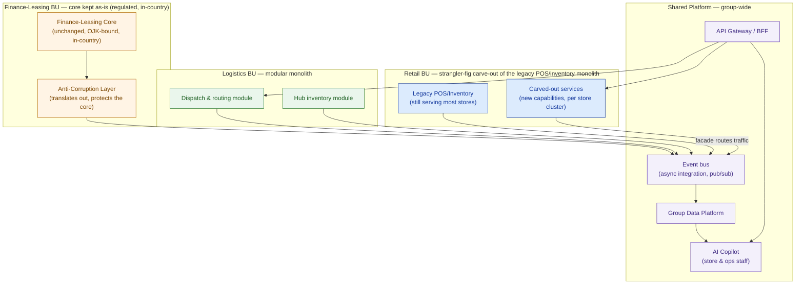

# Pattern-Selection Guide — Cakrawala Group (worked example)

> This is the template in [`template-pattern-selection-guide.md`](./template-pattern-selection-guide.md) fully filled in for **Cakrawala Group**: a diversified Indonesian conglomerate — ~350 retail outlets, ~40 logistics hubs, one finance/leasing back office, ~18,000 employees group-wide, ~Rp 8 trillion annual revenue. The board has sponsored ONE proposal: modernize all three business units, adopt cloud where it fits, stand up a group-wide data platform, and add an AI copilot for store/ops staff. Budget ceiling: ~Rp 45–65 billion (3-yr TCO). Delivery window: 12–18 months. Headline ROI metric: 15–20% cost-to-serve reduction. Finance-leasing data must stay in-country (OJK-style residency); the operating team is mostly unskilled at distributed systems; the board reads the HLD directly.

## 1. Scope: capabilities needing a pattern decision

```
Retail POS / Inventory   ·   Logistics Dispatch   ·   Finance-Leasing Core   ·   AI Copilot   ·   Group Reporting
```

Everything else in the estate (HR, procurement, and similar back-office functions) is out of scope for this phase of the transformation and inherits whichever pattern its business unit already runs.

## 2. Scoring table

| Capability | Change frequency | Team skill (current ops) | Coupling need | Consumer heterogeneity | Verdict (pattern) |
|---|---|---|---|---|---|
| **Retail POS / Inventory** | High — 350 outlets, frequent promos, constant SKU churn | Low–Medium — retail IT runs the legacy stack, no platform team | Loose per store, needs group-wide visibility | Medium — store app + group reporting + copilot | **Strangler fig** |
| **Logistics Dispatch** | Medium-High — routing rules evolve as the 40-hub network grows | Low–Medium — ops-focused team, not a services team | Medium — hubs coordinate, but no per-hub independent deploy need | Low-Medium — mostly internal, plus copilot | **Modular monolith** + event-driven integration |
| **Finance-Leasing Core** | Low — regulated, stable, deliberate/audited changes only | Low — small specialist team, no rewrite appetite or budget | Others need read access; core itself must stay untouched | Low — one core, but the copilot and reporting both need scoped reads | **Anti-Corruption Layer** (core kept as-is) |
| **AI Copilot (new)** | High — new capability, will iterate quickly post-launch | Low — store/ops staff are users, not operators; a small central team owns it | Loose — pure consumer of the other three domains | High — retail, logistics, and finance-leasing all feed it | **API Gateway / BFF** |
| **Group Reporting** | Low–Medium — board metrics, monthly/quarterly cadence | Low — no dedicated data engineering bench yet | Loose, read-only, latency-tolerant | Medium — board, BU leads, and (indirectly) the copilot | **Shared data platform**, fed via CDC/batch through the event bus |

**Read across the "team skill" column:** it is low or low-medium for every single capability. That fact alone rules out a microservices-everywhere design and rules out choreography-heavy event-driven architecture as the *default* — not because those patterns are wrong in general, but because Cakrawala cannot safely operate them within a 12–18 month window with the team it has today.

## 3. Decision log

```
CAPABILITY:      Retail POS / Inventory
PATTERN CHOSEN:  Strangler fig
WHY:             350 outlets carry the largest legacy footprint and the highest change rate in
                 the estate; a facade lets us retire the legacy monolith incrementally, in
                 sequence from lowest to highest blast radius (inventory lookups first,
                 payments/promotions last), while stores keep trading throughout.
WHY NOT a big-bang rewrite: rewriting POS/inventory across 350 live, revenue-generating stores
                 inside 12-18 months risks the entire board mandate on one all-or-nothing cutover.
UNBLOCKS:        Group reporting (clean data feed), the AI copilot (live inventory reads),
                 measurable cost-to-serve progress every sprint instead of only at the end.
```

```
CAPABILITY:      Logistics Dispatch
PATTERN CHOSEN:  Modular monolith, integrated to the group via events
WHY:             40 hubs and one small ops team don't need per-hub independent scaling or
                 deploy — a modular monolith gives clean internal seams (dispatch vs. hub
                 inventory) without the operational cost of running two more deploy pipelines.
WHY NOT microservices: splitting dispatch and hub-inventory into separate services would add a
                 network hop and two CI/CD pipelines for zero scaling benefit at this team size.
UNBLOCKS:        Retail can read delivery ETAs, the copilot can read dispatch status — both via
                 the shared event bus, not direct database access.
```

```
CAPABILITY:      Finance-Leasing Core
PATTERN CHOSEN:  Anti-Corruption Layer (core kept as-is)
WHY:             The core is regulated and must stay in-country under OJK-style residency
                 rules; it is stable, low-change, and has no rewrite budget or appetite. An ACL
                 translates its native format into the group's canonical event schema and is the
                 only thing that talks to the core directly — it absorbs all of the "the rest of
                 the group's integration needs changed" churn so the core never has to.
WHY NOT a strangler fig: the core is not being retired — there is nothing to strangle. Treating
                 a "keep as-is" system like a migration target is the single most common mistake
                 at this stage of a transformation proposal.
UNBLOCKS:        The AI copilot and group reporting get scoped, read-only access to
                 finance-leasing facts (e.g., lease status) without any regulated data leaving
                 its in-country boundary.
```

```
CAPABILITY:      AI Copilot (new)
PATTERN CHOSEN:  API Gateway / BFF
WHY:             The copilot is a new consumer of three different domains, three different
                 owning teams, three different data shapes. A single gateway gives it one
                 coherent "ask a question, get grounded facts" contract, fanning out internally
                 to the event bus and the group data platform.
WHY NOT direct point-to-point integration: 1 consumer x 3 backends still means three fragile,
                 separately-secured links; a gateway means one front door to secure (feeds
                 directly into Lesson 6.2's Zero Trust overlay) and one contract to maintain.
UNBLOCKS:        A pilot-to-production path that doesn't require re-wiring integrations after
                 the fact — the gateway exists from the first integration, not retrofitted later.
```

```
CAPABILITY:      Group Reporting
PATTERN CHOSEN:  Shared data platform, fed via CDC/batch through the event bus
WHY:             Board-level metrics are read-only, latency-tolerant, and don't need to query
                 systems of record directly. A shared platform, fed by the same event bus and
                 ACL already built for the copilot, gives the board its 15-20% cost-to-serve
                 tracking without adding a fourth bespoke integration path.
WHY NOT direct BI queries against each BU's systems of record: this is exactly the
                 "point-to-point sprawl" this whole guide exists to avoid, and it re-couples
                 reporting to three different systems' change schedules.
UNBLOCKS:        A single, board-legible source for the ROI metric the whole program is judged
                 against.
```

## 4. Target pattern map



## 5. Sequencing against the 12–18 month window

| Phase | Timeframe | What ships | Why this order |
|---|---|---|---|
| 1 | Months 1–6 | Event bus + API gateway stood up (shared platform foundations); retail strangler fig begins on highest-value store clusters; ACL stood up in front of finance-leasing core | These three de-risk everything downstream and carry the least rewrite risk — no capability past this phase depends on anything that hasn't shipped yet |
| 2 | Months 6–12 | Retail carve-out continues; logistics onboarded to the event bus; first version of the group data platform live, fed by CDC from the ACL and the bus | Builds directly on Phase 1's plumbing; produces the first board-visible reporting improvements |
| 3 | Months 12–18 | AI copilot ships behind the gateway; cost-to-serve measured against the 15–20% target using the first full quarter of shared-platform operation | The copilot is the most visible, most fashionable piece — it ships last because it depends on governed data existing first, not because it's less important |

**Value at month 6, if the program had to stop there:** retail already has fewer legacy dependencies and a shrinking facade routing table; the finance-leasing core is safely wrapped instead of exposed to ad hoc integrations; the shared platform exists as a foundation for whatever comes next. That is the answer to a board member asking "what do we actually have if this stalls halfway?"

## 6. Budget sanity check (illustrative, not a quote — see Lesson 6.4 for the real BOM)

```
Shared platform (bus, gateway, data platform)   ~15-20% of 3-yr TCO   — built once, used by all three BUs
Retail strangler-fig carve-out                  ~35-40% of 3-yr TCO   — 350 outlets, largest surface area
Logistics modular-monolith evolution            ~15-20% of 3-yr TCO   — smallest footprint, 40 hubs
Finance-leasing ACL (core untouched)             ~5-10%  of 3-yr TCO   — wrapper only, not a rewrite
AI copilot (behind the gateway)                  ~15-20% of 3-yr TCO   — new build, thin once the platform exists
```

This shape stays inside the Rp 45–65 billion ceiling and matches the pattern verdicts above: the largest line item is the largest legacy-risk capability (retail), and the smallest is the capability that is explicitly *not* being rewritten (finance-leasing). If a future revision of this guide shows the finance-leasing line growing past its wrapper-only share, that is the signal someone has started scoping a core rewrite by accident — re-check Section 2 before proceeding.

## 7. Pre-flight checklist

- [x] No verdict was picked for being fashionable — every pattern traces to a specific row in the scoring table.
- [x] Every "event-driven" and "modular monolith" verdict matches a team that can operate it at Cakrawala's current skill level; no verdict assumes a platform team that doesn't exist yet.
- [x] The finance-leasing core is protected by an anti-corruption layer, not left directly exposed to new integrations.
- [x] The AI copilot reaches all three business units through a single gateway, not direct point-to-point wiring.
- [x] The sequencing plan delivers real, board-visible value at month 6 — not just at month 18.
