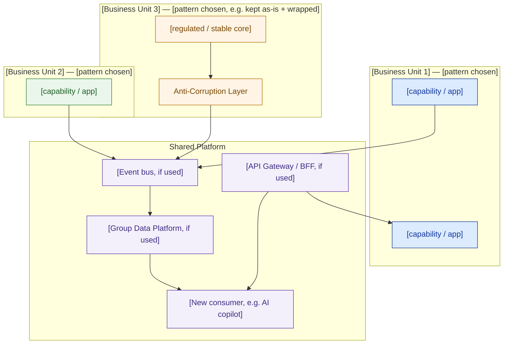

# Pattern-Selection Guide — Template

> Fill in every `[ ]` and `_____`. This guide produces one artifact: a per-capability pattern decision the board (or the customer's technical stakeholders) can follow in one sentence each, plus a target pattern map that shows how the decisions fit together. See [`docs/en.md`](../docs/en.md) for the full reasoning behind each pattern and the worked Cakrawala Group example in [`example-cakrawala-pattern-selection.md`](./example-cakrawala-pattern-selection.md).

## 1. Scope: which capabilities need a pattern decision

Not every corner of the estate needs a debate. List only the capabilities that are **changing, integrating, or both** as part of this engagement.

```
[Capability 1]   ·   [Capability 2]   ·   [Capability 3]   ·   [Capability 4]   ·   [Capability 5]   ·   [ ... ]
```

Anything not listed here inherits whichever pattern its owning business unit already uses, or is explicitly out of scope — say so.

## 2. Scoring criteria — definitions

Use these four columns consistently. Do not invent new criteria per capability; the point of the matrix is that the same four questions produce a repeatable, comparable verdict across the whole estate.

| Criterion | Question you're answering | Low | Medium | High |
|---|---|---|---|---|
| **Change frequency** | How often does this capability's logic or data model change? | Rarely, deliberate/audited changes | Periodic, planned releases | Continuous, frequent iteration |
| **Team skill (current ops)** | Can the team that will *operate* this actually run the pattern you're about to propose? | No distributed-systems / broker / service-mesh experience | Some experience, no dedicated platform team | Dedicated platform/SRE team exists |
| **Coupling need** | Does this capability need to call others synchronously, react asynchronously, or stay isolated? | Isolated / no cross-capability need | Async, tolerant of delay | Synchronous, low-latency, tightly coordinated |
| **Consumer heterogeneity** | How many meaningfully different consumers (apps, teams, external partners) need access to this capability? | One consumer | Two to three consumers with overlapping needs | Many consumers needing different views |

## 3. Pattern menu — quick reference

| Pattern | Use when |
|---|---|
| Monolith | Small team, low change frequency, no independent-scaling need |
| Modular monolith | Multiple sub-domains need clean seams now, but not independent deploy/scale |
| Microservices | A real team boundary or scaling seam exists, **and** the team can operate the platform this requires |
| Event-driven (choreography) | Producers/consumers must decouple in time; simple, high-volume fan-out; team can operate a broker |
| Event-driven (orchestration) | Same decoupling need, but the process has multiple steps and needs visible, centrally-tracked failure state |
| API Gateway / BFF | Multiple heterogeneous consumers need different views of the same backend capabilities |
| Strangler fig | Retiring a legacy system incrementally while it must stay live and valuable throughout |
| Anti-corruption layer (ACL) | Integrating with a system that must stay largely untouched (regulatory, stability, vendor lock, no rewrite budget) |

## 4. Scoring table

| Capability | Change frequency | Team skill (current ops) | Coupling need | Consumer heterogeneity | Verdict (pattern) | One-sentence justification |
|---|---|---|---|---|---|---|
| [Capability 1] | [ ] | [ ] | [ ] | [ ] | [ ] | [ ] |
| [Capability 2] | [ ] | [ ] | [ ] | [ ] | [ ] | [ ] |
| [Capability 3] | [ ] | [ ] | [ ] | [ ] | [ ] | [ ] |
| [Capability 4] | [ ] | [ ] | [ ] | [ ] | [ ] | [ ] |
| [Capability 5] | [ ] | [ ] | [ ] | [ ] | [ ] | [ ] |

## 5. Decision log

For each capability, record the verdict as a stand-alone paragraph a non-technical stakeholder can read without the table. This is what actually goes in front of a board or a customer's steering committee.

```
CAPABILITY:      [ ]
PATTERN CHOSEN:  [ ]
WHY (1 sentence): [ ]
WHY NOT [alternative pattern]: [ ]
WHAT THIS UNBLOCKS DOWNSTREAM: [ ]
```

Repeat one block per capability.

## 6. Target pattern map — Mermaid skeleton

Fill in the boxes; delete subgraphs that don't apply; add more per-BU subgraphs if the estate has more than the three shown.



## 7. Sequencing against the delivery window

| Phase | Timeframe | What ships | Why this order |
|---|---|---|---|
| 1 | [ ] | [ ] | [ ] |
| 2 | [ ] | [ ] | [ ] |
| 3 | [ ] | [ ] | [ ] |

Rule of thumb: sequence the moves that de-risk everything downstream (shared integration plumbing, protecting anything regulated/stable) before the most visible, most fashionable capability — the flashy piece should depend on the boring plumbing, not the other way around.

## 8. Budget sanity check (illustrative, not a quote)

Before this guide goes in front of a sponsor, check that the pattern choices imply a plausible cost shape against the budget ceiling. This is a gut-check, not a BOM — the real costing happens in the Cost Estimation & BOM lesson.

```
[Shared platform]                    ~___% of TCO   — built once, used by all business units
[Capability with largest surface]    ~___% of TCO   — usually the largest legacy footprint
[Capability(ies) kept as-is/wrapped] ~___% of TCO   — wrapper only, should be the smallest line item
[New capability, e.g. AI feature]    ~___% of TCO   — new build, but thin if it sits on the shared platform
```

If a "kept as-is" capability implies a large share of the budget, that's a signal you've accidentally scoped a rewrite instead of a wrap — go back to Section 4 and re-check the verdict.

## 9. Pre-flight checklist — common mistakes to rule out before you finalize

- [ ] Did any verdict get picked because it's fashionable, rather than because it scored that way on the matrix?
- [ ] Does every "microservices" or "event-driven" verdict have a named team that can actually operate it — or a managed service that removes that burden?
- [ ] Is there at least one capability marked "kept as-is" that is protected by an anti-corruption layer, not left fully exposed to new integrations?
- [ ] Can any new consumer (AI feature, new front-end, partner integration) reach every backend it needs through a single gateway, rather than direct point-to-point wiring?
- [ ] Does the sequencing plan deliver real, measurable value at the halfway point of the delivery window — not just at the very end?
