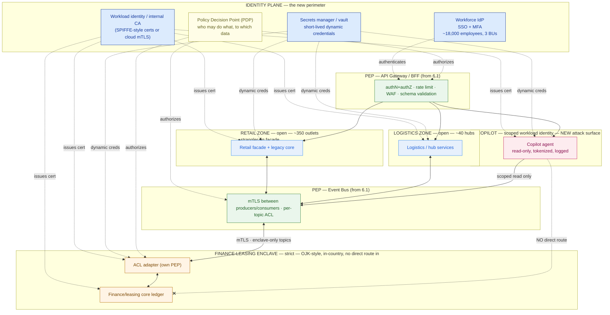

# Security Architecture & Zero Trust

> The integration bus you just designed to connect three siloed businesses is also the fastest path a breach can travel — from a public storefront to a regulated ledger. Zero trust is the design that keeps *identity*, not the network wire, as the perimeter.

**Type:** Design
**Track:** AI, Data & Infrastructure Solution Architect (Presales)
**Prerequisites:** 6.1 Architecture Patterns
**Time:** ~4h
**Lab:** —
**Ship It:** Security architecture

## The Problem

**Cakrawala Group** is an Indonesian conglomerate: roughly 350 retail outlets and 40 logistics hubs feeding them, plus a finance/leasing back office that writes and services leased and financed assets, all together employing about 18,000 people. For decades the three businesses ran as three separate worlds — three stacks, three networks, three identity systems, connected by nothing more than the occasional batch file. That isolation was accidental, not designed, but it had one accidental virtue: a compromise in the retail point-of-sale estate had no path to the finance-leasing ledger. The businesses couldn't talk to each other, so a breach in one couldn't reach the others either.

In 6.1 you tore that isolation down on purpose, and for good reasons: a strangler-fig migration is modernizing the retail stack outlet by outlet, an event bus now lets retail, logistics, and finance-leasing publish and subscribe to each other's facts, an anti-corruption layer (ACL) lets the finance-leasing core keep its own model while still joining the shared bus, and an API gateway now fronts everything so a new AI copilot can answer questions like "which outlets are behind on this month's lease payments?" across all three businesses at once. That architecture is exactly right for the business problem.

It is also, in security terms, the single biggest attack-surface expansion in Cakrawala's history. You just built a highway between a public-facing storefront and a regulated financial ledger, and handed the keys to a chatbot.

Here is the failure mode this lesson exists to prevent. An SA hands over the 6.1 pattern set — event bus, ACL, API gateway — and assumes "we'll put a firewall around it" is a security architecture. It is not. A perimeter firewall answers *where is the traffic coming from*; it has nothing to say about *whether the caller is who it claims to be*, once it's inside. The moment retail, logistics, and finance-leasing share one bus and one gateway, the old assumption — "if you're on the corporate network, you're trusted" — becomes the single most dangerous sentence in the design.

An attacker who phishes one retail-outlet credential, or a prompt-injection attack that tricks the AI copilot into forwarding a query it shouldn't, is now one hop from a leased-asset ledger holding regulated financial data that Indonesian financial-services regulatory expectations (OJK-style rules for finance and leasing entities) require to stay in-country and auditable. A perimeter-only design treats that ledger as protected because it's "behind the firewall, same as everything else." It isn't behind anything anymore — it's on the bus. Your job in this lesson is to design **zero trust** across a newly-connected, historically-siloed enterprise: to make identity, not network location, the thing every request has to prove — before it reaches a system of record that a regulator, a leasing customer, and 18,000 employees are all counting on you to protect.

## The Concept

### Zero trust, past the one-slide version

Phase 0 gave you the honest starting model: **DMZ → app zone → data zone**, traffic crosses one boundary inward at a time, and the database is never reachable from the internet, not even in one hop. That model is still true and still load-bearing — you do not throw it away. But it answers one question only: *which network segment is this packet coming from?* It says nothing about *who* is making the call, on whose behalf, or whether that caller should be allowed to touch *this* piece of data at *this* moment. Once Cakrawala's three BUs share a bus and a gateway, "which segment" stops being a useful trust signal — a compromised retail-outlet laptop is on the "trusted" corporate network by definition, and network zones alone will wave it through.

**Zero trust** is the architecture built on top of the zone model to close that gap: **never trust, always verify** — every request, from every caller, to every resource, is authenticated and authorized explicitly, every time, regardless of whether it originates inside or outside a network zone. Network segmentation still narrows the blast radius; zero trust decides, *inside* every segment, who is actually allowed to do what. Three shifts define the jump from a Phase-0 network diagram to a Phase-6 zero-trust architecture:

| | Perimeter model (Phase 0) | Zero-trust model (this lesson) |
|---|---|---|
| **Trust signal** | Network location (which subnet/VLAN you're on) | Verified identity (who/what you are, cryptographically) |
| **Where the check happens** | Once, at the network edge (DMZ) | At every hop, between every service, every time |
| **Unit of segmentation** | Network zone (public / private / data) | Identity + data sensitivity (a BU, a service, a data class) |
| **What a breach gets you** | Everything "inside" the same zone | Only what that one verified identity was scoped to reach |
| **Underlying question** | "Which wire did this arrive on?" | "Can this specific caller prove it should see this specific data?" |

Zero trust rests on four mechanisms. Get the vocabulary straight before you draw anything:

- **Identity as the new perimeter.** Every human (workforce identity) and every service, script, and AI agent (workload identity) gets a verifiable identity. The perimeter is no longer a network boundary — it's the set of identities and the policies attached to them.
- **Microsegmentation.** Instead of a handful of broad network zones, you segment by *who talks to what, over which data* — a much finer grain than "app tier" and "data tier." A retail service and a finance-leasing service can sit in the same data center rack and still be fully segmented from each other if no policy grants them a path.
- **Policy Enforcement Points (PEPs).** The literal places in the architecture — an API gateway, a service-mesh sidecar, a bus broker's ACL — where an identity's request is checked against policy *before* it's allowed to proceed. A PEP asks a **Policy Decision Point (PDP)**: "does this identity, right now, have permission for this action on this resource?"
- **Continuous verification, not a one-time login.** A session token from this morning does not imply trust this afternoon. Certificates rotate, tokens expire short-lived, and anomalous behavior (a retail service suddenly querying finance-leasing data at 3 a.m.) is a signal, not background noise.

### Workforce identity vs workload identity

Cakrawala's 18,000 employees need **workforce identity**: one directory, single sign-on (SSO), and multi-factor authentication (MFA) — so a store associate, a hub supervisor, and a finance-leasing back-office analyst each authenticate once, centrally, with access scoped to their role and BU. But the bigger volume of "who is calling whom" on the new bus isn't humans — it's services: the strangler-fig retail façade calling the legacy retail core, the ACL adapter translating finance-leasing events onto the bus, the AI copilot calling the API gateway.

Every one of those needs **workload identity**: a cryptographic identity issued to the *service*, not a shared API key pasted into a config file. Workload identities authenticate to each other with **mutual TLS (mTLS)** — both sides present a certificate, so a service proves who it is the same way its caller does. This is the mechanism that lets you say, truthfully, "a compromised retail credential cannot pretend to be the finance-leasing ACL adapter" — because the ACL adapter's identity is a certificate no stolen password can produce.

### Microsegmentation on the event bus — by BU and by sensitivity, not just by network

6.1's event bus is the shared nervous system connecting retail, logistics, and finance-leasing. A network-only view says "it's one bus, on one segment." A zero-trust view segments it by **two axes at once**: which BU a topic belongs to, and how sensitive the data on that topic is. A retail "order placed" event and a finance-leasing "lease payment posted" event may traverse the same physical broker, but they must never be reachable by the same set of identities. Concretely: every topic on the bus gets an access-control list (ACL) of exactly which workload identities may publish and which may subscribe — enforced by mTLS at the broker, not by a network firewall rule that can't see which topic is which.

### Policy enforcement at the API gateway / BFF

6.1's API gateway is where the AI copilot and any external-facing integration touch the estate — which makes it the single most important Policy Enforcement Point in the whole design. Every call through the gateway carries a verified identity (a workforce token for a human, a workload identity for a service or the copilot itself), and the gateway checks that identity's scope before forwarding anything.

A **Backend-for-Frontend (BFF)** pattern narrows this further for the copilot specifically: the copilot doesn't get a general-purpose API key to "the estate" — it gets a purpose-built backend that exposes only the specific, scoped operations it needs, nothing more.

### The AI copilot is a new attack surface, not just a new feature

Phase 5 (5.4 agents/MCP, 5.6 guardrails) taught you to guard the copilot's *answers* — grounding, citations, abstention. At architecture altitude, the copilot is also a new **identity** with its own blast radius, and it introduces two threats that didn't exist before it: **prompt injection**, where a crafted input tricks the copilot into calling a tool or fetching data outside its intended scope, and **data exfiltration via natural language**, where a user asks the copilot to summarize or reformat data it can technically reach, bypassing controls built for structured queries.

The architectural answer is the same principle as everywhere else in this lesson — least privilege, enforced by identity, not by hoping the model behaves: the copilot's workload identity is scoped to read-only, tokenized access to specific topics and gateway routes, it never receives a direct route into the finance-leasing enclave, and every tool call it makes is logged with the same audit rigor as a human transaction.

### The finance-leasing enclave — a stricter tier, by design

Retail and logistics data is commercially sensitive but not regulated in the same way. Finance-leasing data — loan and lease terms, repayment schedules, customer financial identifiers — sits under Indonesian financial-services regulatory expectations (OJK-style rules for finance and leasing entities) for data residency, access control, and auditability. Treating it as "one more topic on the bus" is the mistake this lesson exists to prevent.

Zero trust gives you the vocabulary to make the finance-leasing back office a genuinely stricter **enclave**: no direct network path from retail or logistics, all access mediated by the ACL's own Policy Enforcement Point, in-country data residency and encryption keys, and an audit log with longer retention and stricter integrity guarantees than the rest of the estate.

### Secrets management: no more static keys

Every workload identity above is only as trustworthy as the credential behind it, and static, long-lived secrets — an API key hardcoded in a config file, a database password shared across three services since 2019 — are the single easiest way to undo everything the identity plane just bought you. A **secrets manager / vault** centralizes credential issuance: services request short-lived, dynamically generated credentials at startup (or per-request), rotation happens automatically instead of "whenever someone remembers," and a leaked credential expires on its own within minutes or hours rather than staying valid until someone notices.

For Cakrawala this matters most at the seams — the ACL adapter, the event-bus producers/consumers, and the copilot's tool-calling layer are exactly the places where a hardcoded key would otherwise sit, and exactly the places an attacker would look first.

### Zero trust is a program, not a switch

You cannot flip a "zero trust" toggle across 18,000 employees and three legacy stacks in a weekend, and pretending otherwise is how these programs die in year one. It is a **maturity-phased rollout**, sequenced by risk: the highest-value target (the regulated enclave) gets hardened first, the identity foundation is built once and reused everywhere, and the AI copilot's controls land alongside its own rollout rather than being bolted on after launch.



And the same design read as a zone-by-sensitivity matrix — the artifact you'll actually hand a security reviewer:

```
 ZONE / BU                 DATA SENSITIVITY      REACHABLE FROM               IDENTITY REQUIRED               ENCRYPTION            AUDIT / RETENTION
 ──────────────────────────────────────────────────────────────────────────────────────────────────────────────────────────────────────────────────
 Retail (~350 outlets)     Low–Medium            Gateway, event bus,          Workforce SSO+MFA (staff)       TLS 1.2+ in transit   Standard, 90 days
                           catalog / orders      copilot (scoped read)       Workload mTLS (services)

 Logistics (~40 hubs)      Medium                Gateway, event bus,         Workforce SSO+MFA (staff)       TLS 1.2+ in transit   Standard, 90 days
                           inventory / routing   copilot (scoped read)       Workload mTLS (services)

 AI Copilot / shared       Medium in itself,     Gateway (BFF) only;         Scoped workload identity;       TLS 1.2+ + output     Enhanced — every
 platform                  HIGH in reach         retail+logistics via bus;   step-up MFA for admin actions    DLP scan on egress    prompt/tool call logged

 Finance-Leasing enclave   HIGH — regulated,     ONLY via the ACL's own      Workforce SSO+MFA+PAM step-up;  Encrypted at rest,    Enhanced, OJK-style —
                           in-country only       PEP; no direct route from   workload mTLS, cert-pinned      in-country KMS keys   immutable, long retention
                                                 retail, logistics, copilot
 ──────────────────────────────────────────────────────────────────────────────────────────────────────────────────────────────────────────────────
```

The rule the matrix encodes: **the enclave row is the only one with "no direct route in."** Every other zone can reach every other zone through a PEP with a policy check; the enclave can only be reached through one narrow, audited, mediated door.

### Before you leave the whiteboard: the six questions a security review asks

Whatever you draw, a customer's security lead will run it against the same checklist a network diagram gets in Phase 0 — except every question now points at identity, not IP address:

1. **Whose identity is on this arrow?** Every connection in the diagram names a workforce or workload identity — never "the app talks to the database" with no caller named.
2. **Which PEP checks it, and against what policy?** Every zone boundary has a named enforcement point; "the network" is not an acceptable answer.
3. **Can the enclave be reached in one hop from anywhere untrusted?** The answer must be no — including from the AI copilot.
4. **What does the copilot's identity actually scope to?** Not "the API," but the exact routes and topics — read-only, tokenized, logged.
5. **Where do credentials live, and how long do they live for?** Static, long-lived secrets anywhere in the design is an automatic finding.
6. **What does the rollout look like, and which phase hardens the highest-risk zone first?** "We'll get to the enclave eventually" fails the review on its own.

## Design It

Let's design the security architecture for **Cakrawala Group** — the overlay that sits on top of the 6.1 patterns, not a replacement for them. Seven steps, in the order you'd actually present them to a mixed-skill platform team.

### Step 1 — Workforce and workload identity

Consolidate the three BUs' historically separate logins onto a single workforce identity provider with SSO and MFA, grouped by BU and role: retail store staff, logistics hub operations, finance-leasing back office, HQ/shared services, and a small privileged-access tier (platform admins, DBAs) held to step-up MFA and time-boxed, logged elevation — a **Privileged Access Management (PAM)** pattern, not a shared admin password.

Expect the legacy stacks to resist this on day one; some retail and logistics systems will still hold local accounts for a while, and that gap goes on the risk register (6.5's territory), not swept under the rug.

Alongside workforce identity, issue every service a **workload identity** — the strangler-fig retail façade, the ACL adapter, every event-bus producer/consumer, the API gateway's backend services, and the AI copilot itself. Concretely: an internal certificate authority (or a managed workload-identity service) issues short-lived certificates per service instance; every service-to-service call authenticates with **mTLS**, so "which service is calling" is a cryptographic fact, not an assumption based on which subnet the call came from.

### Step 2 — mTLS across the event bus

The event bus is Cakrawala's new shared nervous system, so it gets the strictest workload-identity enforcement of any component that isn't the enclave itself: every producer and consumer authenticates to the broker with its workload certificate, every topic carries an explicit ACL of which identities may publish and which may subscribe, and finance-leasing topics are additionally encrypted at rest with dedicated, in-country keys. A retail service publishing "order placed" cannot subscribe to "lease payment posted" — not because a firewall rule forbids the IP range, but because its certificate was never granted that topic's ACL entry.

### Step 3 — Microsegmentation with the finance-leasing enclave as its own tier

Draw four segments, not two: **Retail** and **Logistics** as open-to-each-other zones (they already share operational data daily and the business needs that), a **shared platform / AI copilot** zone treated as medium-sensitivity but high-reach (because whatever it can query, thousands of users can ask it to fetch), and the **Finance-Leasing enclave** as its own strict tier with no direct network path from anything else.

The enclave's only door is the ACL adapter from 6.1 — which now doubles as this zone's Policy Enforcement Point: every message crossing from the bus into the enclave (or back out) is authenticated, authorized against a narrow allowlist of message types, and logged immutably. This is the structural fix for the failure mode in The Problem: even a fully compromised copilot identity or a phished retail credential has *no path* to the ledger except through one narrow, monitored gate.

### Step 4 — Policy enforcement at the API gateway / BFF

Every external-facing and copilot-facing call goes through the 6.1 API gateway, which now carries the policy-enforcement load for the whole estate's "front door": it validates the caller's workforce token or workload identity, checks scope against the PDP, applies rate limiting and schema validation, and fronts a WAF for anything internet-reachable. For the copilot specifically, stand up a dedicated **BFF**: a purpose-built backend exposing only the operations the copilot needs (e.g., "read order status," "read lease payment status — aggregate only, no line-level customer financial detail") rather than a general integration key that happens to reach everything the gateway fronts.

### Step 5 — Secrets management at the seams

Stand up one secrets manager for the whole estate rather than letting each BU's stack accumulate its own convention. Priority order for the mixed-skill team: first, the ACL adapter and event-bus credentials (the newest, highest-blast-radius seams), then the API gateway's backend service credentials, then the copilot's tool-calling credentials, then everything else. Every credential is short-lived and dynamically issued; nothing is a static string that outlives the deployment that created it. This is a small, unglamorous piece of the architecture, and it is also the one a penetration test will find first if it's skipped — a hardcoded key in the ACL adapter defeats every other control in this lesson in one line of leaked config.

### Step 6 — AI-copilot-specific controls, at the architecture level

Recap 5.4 and 5.6 here, but at architect altitude — you are designing the *scope*, not tuning the model. Give the copilot its own workload identity, scoped by the BFF from Step 4 to read-only, tokenized access on retail and logistics data, and to **aggregate-only, no-line-detail** access on finance-leasing data if the business case demands cross-BU answers at all — never row-level financial identifiers. Layer the 5.6 guardrails (prompt-injection screening, output DLP scanning, groundedness/citation checks) as the copilot's *input/output* controls, and treat this step's identity scoping as its *access* control — the two are complementary, and a guardrail failure should still hit a wall of insufficient permission, not an open door.

### Step 7 — A phased rollout that fits the 12–18 month window

Sequence by risk, not by convenience, and land it inside the pinned 12–18 month program window:

```
 MONTH    PHASE                                   WHAT SHIPS
 ─────────────────────────────────────────────────────────────────────────────────────────
 0–3      Identity foundation                     Workforce IdP (SSO+MFA) live for HQ + one
                                                   pilot BU; workload-identity CA and secrets
                                                   manager stood up; PDP service deployed.
 3–6      Enclave hardening FIRST                 Finance-leasing ACL becomes the enclave's PEP;
                                                   no-direct-route enforced; in-country KMS keys;
                                                   enhanced audit logging live. Highest regulatory
                                                   and reputational risk, so it goes first.
 6–10     Bus microsegmentation                   mTLS + per-topic ACLs rolled out across retail
                                                   and logistics topics, BU by BU, alongside the
                                                   6.1 strangler-fig waves already in flight.
 8–14     Gateway PEP + copilot scoping            API gateway policy enforcement hardened; copilot
                                                   BFF and scoped identity shipped alongside its
                                                   own feature rollout, not bolted on after launch.
 12–18    Continuous verification maturity         Anomaly detection on identity behavior, policy-
                                                   as-code review cadence, external pen test /
                                                   red-team of the enclave boundary, audit automation.
 ─────────────────────────────────────────────────────────────────────────────────────────
```

The enclave is hardened in the second phase, not the last — the opposite of how most rollouts default. That ordering is the single sentence that will make Cakrawala's risk committee trust the rest of the plan: the regulated ledger is the one thing you refuse to leave exposed for a program's-length "we'll get to it."

## Compare It

**Perimeter (castle-and-moat) vs zero trust.** The perimeter model isn't wrong, it's incomplete for a newly-connected estate: it still belongs at the network-zone level (a finance-leasing enclave subnet with no internet route is good hygiene, not obsolete). What breaks is treating "inside the corporate network" as sufficient trust once three previously isolated businesses share a bus.

The honest answer for Cakrawala is **both, layered**: keep the DMZ→app→data zoning from Phase 0 as the outer shell, and add zero-trust identity checks at every hop inside it. Pick perimeter-only when an estate genuinely stays siloed (it no longer does, once 6.1's patterns ship); pick zero trust the moment two previously separate trust domains start sharing infrastructure — which is exactly Cakrawala's situation.

**Big-bang vs phased-by-BU rollout.** A big-bang cutover — flip zero trust on for all three BUs and 18,000 employees simultaneously — is the version vendors pitch in a slide deck and the version that produces an outage, a help-desk meltdown, and a stalled program in year one, particularly with a mixed-skill team that hasn't operated this model before.

Phased-by-BU (or, as designed above, phased-by-risk-tier) lets the platform team learn on a smaller blast radius, catch integration surprises with one legacy stack before repeating them across three, and show the risk committee incremental, provable progress instead of asking for an 18-month leap of faith. The only case for big-bang is a greenfield estate with no legacy debt to migrate around — which describes none of Cakrawala's three stacks.

**Commercial ZTNA (Zscaler, Palo Alto Prisma Access) vs open workload-identity stack (SPIFFE/SPIRE + service-mesh mTLS, e.g., Istio or Linkerd).** Commercial Zero Trust Network Access platforms are strong at **workforce**-side remote access and policy management with a support contract and a UI a mixed-skill team can operate without deep in-house security engineering — the trade-off is recurring per-user licensing that scales with headcount (a real cost line against the pinned budget ceiling) and a degree of vendor lock-in. The open stack (SPIFFE/SPIRE for workload identity issuance, a service mesh for mTLS enforcement between services) is strong at **east-west, service-to-service** traffic — exactly the event-bus and inter-BU traffic this lesson spends most of its design budget on — at the cost of needing in-house platform expertise to operate it well, which cuts against "mixed-skill team."

The realistic Cakrawala answer is a **hybrid**: a commercial ZTNA product for workforce remote access and policy administration (lower operating burden, faster time-to-value for the identity foundation in Step 1), paired with an open workload-identity/mTLS stack for the high-volume service-to-service traffic on the bus and around the enclave (avoids per-connection licensing that would balloon against the 3-year budget ceiling as the bus's message volume grows). Name both halves in the proposal — a customer's security lead will ask which one covers which traffic, and "it depends on the traffic direction" is the correct, defensible answer.

## Ship It

This lesson ships a reusable **Security Architecture** — the zero-trust overlay you produce once the 6.1 patterns are drawn and before sizing (6.3) or the BOM (6.4) can be trusted. Both files live in [`outputs/`](../outputs/):

- **[`template-security-architecture.md`](../outputs/template-security-architecture.md)** — a fill-in-the-blank template: workforce + workload identity design, a microsegmentation/zone matrix skeleton, a Policy Enforcement Point inventory, AI-copilot-specific controls, secrets management, a phased rollout table, and a Mermaid architecture skeleton. A colleague can run a zero-trust design session straight from it.
- **[`example-cakrawala-security-architecture.md`](../outputs/example-cakrawala-security-architecture.md)** — the template fully worked for Cakrawala Group, so the skeleton isn't abstract: the enclave-first rollout, the copilot's scoped identity, and the zone matrix all filled in and ready to defend in a review.

This artifact is a direct input to **6.3 Sizing & Capacity Planning** (every PEP, mTLS termination point, and enclave gateway is a component that needs sizing) and to **Capstone F**, where it becomes the security section of the full Enterprise AI Transformation Proposal.

## Exercises

1. **(Easy)** In the zero-trust Mermaid diagram above, list every node that acts as a **Policy Enforcement Point (PEP)** and, for each one, write one sentence naming what it checks before it forwards a request. Then name the one node that is *not* a PEP but decides the answer every PEP asks — and explain the difference between the two roles.

2. **(Medium)** Cakrawala acquires a fourth business unit — a consumer e-wallet / digital-payments arm — six months into the rollout. Using the zone-matrix pattern from The Concept, decide which sensitivity tier the new BU belongs in (hint: payment credentials and transaction data carry their own regulatory weight, distinct from — but comparable to — the finance-leasing enclave), name the PEPs a new BU must sit behind before its services touch the shared bus, and state where in the Step 7 rollout table you would insert its onboarding and why.

3. **(Hard)** Combine this lesson with **5.6 Evaluation, Guardrails & Responsible AI** and **6.1's ACL pattern**. Write a half-page threat model for a single attack path: a user crafts a prompt-injection attack against the Cakrawala AI copilot, attempting to make it retrieve and summarize finance-leasing customer data it should never see. Walk the request through every control that should stop it — the copilot's scoped workload identity, the BFF's exposed operations, the gateway's authorization check, the bus's per-topic ACL, and the enclave's own PEP — and name the *specific* control that fails the attack at each stage, plus the one control whose absence would let the whole chain succeed. Save this alongside your worked example; you will reuse it in Capstone F's risk section.

## Key Terms

| Term | What people say | What it actually means |
|------|-----------------|------------------------|
| Zero trust | "No VPN, just MFA everywhere" | An architecture where every request is authenticated and authorized explicitly, at every hop, regardless of network location — identity replaces network position as the trust signal. |
| Workforce identity | "Everyone's login" | The single directory + SSO + MFA that authenticates *humans* — employees across every BU, scoped by role, not by which building's Wi-Fi they're on. |
| Workload identity | "A service account" | A cryptographic identity issued to a *service*, not a person — proven via a certificate, not a shared password, so "which service is calling" is verifiable, not assumed. |
| mTLS (mutual TLS) | "HTTPS" | Both sides of a connection present a certificate and prove their identity to each other — the mechanism that lets services authenticate one another the way a client authenticates a server. |
| Microsegmentation | "More firewall rules" | Segmenting by identity and data sensitivity rather than broad network zones — two services in the same data center rack can still be fully isolated if no policy grants them a path. |
| Policy Enforcement Point (PEP) | "The firewall" | The specific place in the architecture — a gateway, a mesh sidecar, a bus broker's ACL — where a request is actually checked against policy before being allowed through. |
| Policy Decision Point (PDP) | "The rules engine" | The service a PEP asks "is this identity allowed to do this, to this resource, right now?" — centralizes the *decision*; PEPs only *enforce* it. |
| Enclave | "A secure zone" | A segment held to a stricter policy tier than the rest of the estate — reachable only through one mediated, audited door — used here for the regulated finance-leasing back office. |
| Secrets management | "A password vault" | Centralized, short-lived, dynamically issued credentials for services, replacing static API keys baked into config files or code. |
| ZTNA (Zero Trust Network Access) | "The new VPN" | A commercial product category (Zscaler, Palo Alto Prisma Access) that grants workforce remote access per-application, per-identity, instead of putting a remote user on the whole corporate network. |
| Blast radius | "How bad a breach could be" | The set of systems and data a single compromised identity can reach. Zero trust's entire purpose is to shrink this from "everything on the network" to "exactly what that identity was scoped for." |
| Backend-for-Frontend (BFF) | "A wrapper API" | A purpose-built backend that exposes only the specific operations one consumer (here, the AI copilot) needs — instead of handing it a general-purpose key to everything the gateway fronts. |
| Prompt injection | "Jailbreaking the chatbot" | An input crafted to make an AI system ignore its instructions and take an unintended action or disclose data outside its scope — an *access* problem as much as a model-behavior problem. |
| Privileged Access Management (PAM) | "Admin accounts" | Time-boxed, logged, step-up-authenticated elevation for high-risk actions, replacing standing admin credentials that stay valid — and dangerous — indefinitely. |
| Data residency | "Keep it in-country" | A regulatory or contractual requirement that specific data (here, finance-leasing records) never leaves a jurisdiction — enforced architecturally via region-pinned storage and keys, not a policy document. |

## Further Reading

- [NIST SP 800-207: Zero Trust Architecture](https://csrc.nist.gov/pubs/sp/800/207/final) — the vendor-neutral reference definition of zero trust; the tenets in section 2 map directly to the identity-plane and PEP/PDP vocabulary in this lesson.
- [Google — BeyondCorp: A New Approach to Enterprise Security](https://research.google/pubs/beyondcorp-a-new-approach-to-enterprise-security/) — the original production case study for "identity and device trust replace the VPN perimeter"; still the clearest real-world narrative of the shift this lesson teaches.
- [SPIFFE / SPIRE documentation](https://spiffe.io/docs/latest/spiffe-about/overview/) — the open standard and implementation for workload identity referenced in Compare It; read the "SVID" concept to see how a service's certificate becomes its identity.
- [OWASP Top 10 for Large Language Model Applications](https://owasp.org/www-project-top-10-for-large-language-model-applications/) — LLM01 (prompt injection) and LLM06 (sensitive information disclosure) are the two threats behind this lesson's AI-copilot attack surface; read them before writing the Exercise 3 threat model.
- [Microsoft — Zero Trust deployment guidance](https://learn.microsoft.com/en-us/security/zero-trust/) and [Google Cloud — Designing Networks for Zero Trust](https://cloud.google.com/architecture/framework/security/design-for-zero-trust) — two vendor implementations of the same NIST tenets; skim both so you can translate this lesson's vocabulary into whichever platform a customer has already standardized on.
