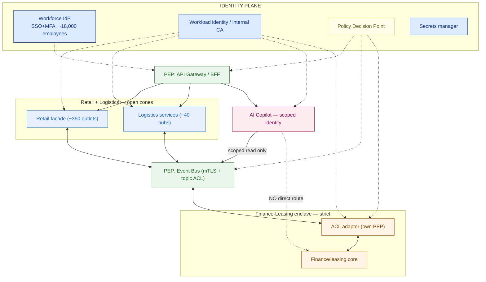

# Security Architecture — Cakrawala Group

> This document is the zero-trust overlay on top of the 6.1 architecture patterns: the strangler-fig retail migration, the cross-BU event bus, the anti-corruption layer (ACL) fronting the finance-leasing core, and the API gateway that fronts the new AI copilot. It answers one question for the risk committee: *if any single identity in this estate is compromised, what exactly can it reach?*

**Customer:** Cakrawala Group  ·  **Estate:** 3 business units (retail — ~350 outlets, logistics — ~40 hubs, finance-leasing — 1 back office), ~18,000 employees
**Prepared by:** `<SA name>`  ·  **Date:** 2026-07-05  ·  **Version:** v0.1 draft
**Depends on:** 6.1 Architecture Patterns (strangler-fig retail, event bus, ACL, API gateway) · Program window: 12–18 months · Budget ceiling: ~Rp 45–65B (3-yr)

---

## 1. Workforce identity

| Group / role | Directory / IdP | MFA required? | Scope |
|---|---|---|---|
| Retail outlet staff (~350 outlets) | Central workforce IdP (SSO) | Yes | POS + local inventory read/write; no bus or gateway access |
| Logistics hub operations (~40 hubs) | Central workforce IdP (SSO) | Yes | Hub inventory, routing, dispatch systems |
| Finance-leasing back office | Central workforce IdP (SSO) | Yes, step-up on sensitive actions | Lease/loan systems only; no retail or logistics access by default |
| HQ / shared services (analytics, IT) | Central workforce IdP (SSO) | Yes | Role-scoped read access across BUs via the gateway, not direct DB access |
| Platform admins / DBAs (privileged tier) | Central workforce IdP + PAM | Yes, step-up, time-boxed | Elevation is logged, expires automatically, never a standing admin session |

**Known gaps:** several retail point-of-sale terminals and one logistics hub system still hold local accounts outside the central IdP. Logged on the risk register (6.5) with a target migration date; treated as an accepted, tracked risk, not ignored.

## 2. Workload identity

| Service / component | Identity mechanism | Authenticates to | Notes |
|---|---|---|---|
| Retail strangler-fig façade + legacy core | Workload cert (internal CA) | Legacy retail systems, event bus | Facade is the migration seam — every call it makes carries a cert |
| Logistics hub services | Workload cert | Event bus, gateway | Same CA, same rotation policy as retail |
| Event-bus producers/consumers (all BUs) | Workload cert | Bus broker | mTLS required to publish or subscribe to any topic |
| ACL adapter (finance-leasing) | Workload cert, cert-pinned | Bus + finance-leasing core | Doubles as the enclave's Policy Enforcement Point |
| API gateway backend services | Workload cert | Gateway | Terminates workforce tokens and workload certs alike |
| AI copilot / agent | Scoped workload cert | Gateway BFF only | Read-only, tokenized, every call logged — no cert issued for the enclave |

## 3. Microsegmentation / zone matrix

```
 ZONE / BU                 DATA SENSITIVITY      REACHABLE FROM               IDENTITY REQUIRED               ENCRYPTION            AUDIT / RETENTION
 ──────────────────────────────────────────────────────────────────────────────────────────────────────────────────────────────────────────────────
 Retail (~350 outlets)     Low–Medium            Gateway, event bus,          Workforce SSO+MFA (staff)       TLS 1.2+ in transit   Standard, 90 days
                           catalog / orders      copilot (scoped read)       Workload mTLS (services)

 Logistics (~40 hubs)      Medium                Gateway, event bus,         Workforce SSO+MFA (staff)       TLS 1.2+ in transit   Standard, 90 days
                           inventory / routing   copilot (scoped read)       Workload mTLS (services)

 AI Copilot / shared       Medium in itself,     Gateway (BFF) only;         Scoped workload identity;       TLS 1.2+ + output     Enhanced — every
 platform                  HIGH in reach         retail+logistics via bus;   step-up MFA for admin actions    DLP scan on egress    prompt/tool call logged

 Finance-Leasing enclave   HIGH — regulated,     ONLY via the ACL's own      Workforce SSO+MFA+PAM step-up;  Encrypted at rest,    Enhanced, OJK-style —
                           in-country only       PEP; no direct route from   workload mTLS, cert-pinned      in-country KMS keys   immutable, long retention
                                                 retail, logistics, copilot
 ──────────────────────────────────────────────────────────────────────────────────────────────────────────────────────────────────────────────────
```

**Rule enforced:** the Finance-Leasing enclave is the only row with "no direct route in." A phished retail credential or a fully compromised copilot identity has no network or application path to the ledger except through the ACL's own gate.

## 4. Policy Enforcement Point (PEP) inventory

| PEP | Sits at | Checks | Action on fail |
|---|---|---|---|
| API Gateway / BFF | Estate front door (from 6.1) | Workforce token or workload cert, scope vs. PDP, rate limit, schema, WAF | Reject, log |
| Event-bus broker ACL | Integration bus (from 6.1) | mTLS cert identity, per-topic publish/subscribe ACL | Reject, log |
| ACL adapter / enclave gateway | Finance-leasing boundary | mTLS, cert-pinned, message-type allowlist | Reject, alert compliance |
| Copilot BFF | The copilot's only route out | Scoped operation allowlist, DLP scan on responses | Block, abstain, log |

## 5. AI-copilot-specific controls

- **Identity:** its own scoped workload identity, issued and rotated the same as every other service — never a shared integration key.
- **Access scope:** read-only, tokenized access to retail catalog/order-status and logistics inventory/routing topics; **aggregate-only, no line-level customer financial detail** on finance-leasing data, and only if the business case for cross-BU answers demands it.
- **Route to the enclave:** none directly. Any finance-leasing figure the copilot surfaces is pre-aggregated and published to the bus by the ACL adapter — the copilot never queries the core.
- **Input guards:** prompt-injection and jailbreak screening (recap 5.6) before a request reaches the RAG/tool-calling layer.
- **Output guards:** DLP scan for exfiltration attempts (bulk export phrased as a summarization request), groundedness/citation checks recapped from 5.6.
- **Logging:** every prompt, tool call, and response logged immutably with the same audit rigor as a human transaction — this is the record that answers "what did the copilot actually see and say" after any incident.

## 6. Secrets management

- **Mechanism:** a single secrets manager / vault for the whole estate, replacing per-BU conventions.
- **Credential lifetime:** short-lived, dynamically issued at service startup or per-request; nothing is a static string in a config file.
- **Priority rollout order:** (1) ACL adapter + event-bus credentials — newest, highest-blast-radius seams; (2) API gateway backend credentials; (3) AI copilot's tool-calling credentials; (4) everything else.

## 7. Phased rollout (12–18 month window)

```
 MONTH    PHASE                                   WHAT SHIPS
 ─────────────────────────────────────────────────────────────────────────────────────────
 0–3      Identity foundation                     Workforce IdP (SSO+MFA) live for HQ + one
                                                   pilot BU; workload-identity CA and secrets
                                                   manager stood up; PDP service deployed.
 3–6      Enclave hardening FIRST                 Finance-leasing ACL becomes the enclave's PEP;
                                                   no-direct-route enforced; in-country KMS keys;
                                                   enhanced audit logging live.
 6–10     Bus microsegmentation                   mTLS + per-topic ACLs rolled out across retail
                                                   and logistics topics, BU by BU, alongside the
                                                   6.1 strangler-fig waves already in flight.
 8–14     Gateway PEP + copilot scoping            API gateway policy enforcement hardened; copilot
                                                   BFF and scoped identity shipped alongside its
                                                   own feature rollout.
 12–18    Continuous verification maturity         Anomaly detection on identity behavior, policy-
                                                   as-code review cadence, external pen test /
                                                   red-team of the enclave boundary, audit automation.
 ─────────────────────────────────────────────────────────────────────────────────────────
```

The enclave is hardened in month 3–6, not last — the single ordering decision that earns the risk committee's trust in the rest of the plan.

## 8. Architecture diagram



### ASCII fallback

```
 IDENTITY PLANE (workforce IdP + workload CA + PDP + secrets) ── issues/authorizes every hop below
 ──────────────────────────────────────────────────────────────────────────────────────────────
 user/service ─▶ [PEP: gateway/BFF] ─▶ retail facade  ─┐
                                    └▶ logistics svc  ─┼─▶ [PEP: bus] ─▶ [PEP: ACL] ─▶ finance core
                                    └▶ AI copilot ─────┘        (scoped, read-only)      ▲
                                                                    NO direct route ────┘
```

---

## 9. Residual risk / go-live statement

> The Cakrawala Group security architecture is **staged**, not yet ready for full go-live, because as of 2026-07-05: workforce identity covers HQ and one pilot BU only (retail and logistics onboarding scheduled through month 6); workload identity is issued to the ACL adapter and bus producers/consumers but not yet to every gateway backend service; the finance-leasing enclave has its own PEP designed and scheduled for month 3–6 delivery, not yet live; and the AI copilot's scoped identity and BFF are designed but gated behind the gateway hardening in month 8–14. Residual risks: legacy local accounts on select retail POS and one logistics hub system (owner: platform team, target: month 10); vendor selection for the ZTNA/workload-identity hybrid stack not yet finalized (owner: SA + procurement, target: month 2).
