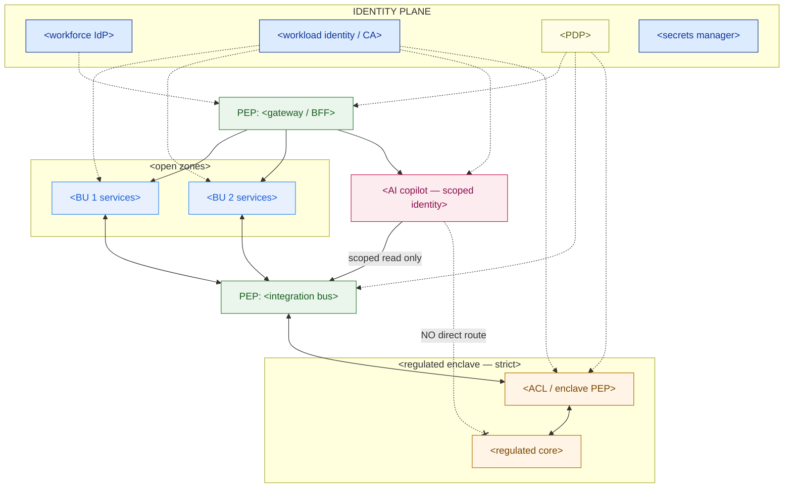

# Security Architecture — Template

> This document is the zero-trust overlay that sits on top of your architecture patterns (HLD/6.1), not a replacement for your network diagram (Phase 0). Fill it in *after* the integration pattern (event bus, ACL, API gateway, strangler-fig facade, etc.) is drawn — every identity, zone, and policy enforcement point below should map onto a component that already exists on that diagram. A risk committee should be able to read Sections 3 and 7 alone and understand the posture; a platform engineer should be able to implement Section 4 directly.

**Customer:** `<company>`  ·  **Estate:** `<# business units, # locations, # employees>`
**Prepared by:** `<SA name>`  ·  **Date:** `<YYYY-MM-DD>`  ·  **Version:** `<v0.1 draft>`
**Depends on:** `<architecture-patterns / integration design this overlays>`

---

## How to use this template

Work top-down. Do not start with tooling — start with *what must never be reachable from what*, then design the identity and enforcement layer that guarantees it.

1. **Design workforce identity** — one directory, SSO, MFA, role/BU-scoped groups, a privileged-access tier.
2. **Design workload identity** — every service gets a certificate; mTLS between services, not shared keys.
3. **Draw the zone/sensitivity matrix** — segment by business unit *and* data sensitivity, not network topology alone.
4. **Inventory every Policy Enforcement Point (PEP)** — name the check, the trigger, and the action.
5. **Specify AI-agent/copilot-specific controls** — scope its identity, not just its prompts.
6. **Specify secrets management** — where credentials live, how short-lived they are.
7. **Sequence the phased rollout** — by risk, not by convenience; the highest-sensitivity zone hardens first.
8. **Draw the architecture** — fill the Mermaid skeleton.
9. **State residual risk** — what is *not* covered yet, and by when it will be.

Legend: **PEP** = Policy Enforcement Point (where a request is checked) · **PDP** = Policy Decision Point (what decides the answer) · **enclave** = a zone held to a stricter policy tier than the rest of the estate.

---

## 1. Workforce identity

| Group / role | Directory / IdP | MFA required? | Scope |
|---|---|---|---|
| `<BU 1 front-line staff>` | `<IdP>` | `<yes/no>` | `<what this role can access>` |
| `<BU 2 operations>` | `<IdP>` | `<yes/no>` | `<...>` |
| `<regulated-BU back office>` | `<IdP>` | `<yes, step-up>` | `<...>` |
| `<HQ / shared services>` | `<IdP>` | `<yes>` | `<...>` |
| `<privileged / platform admin>` | `<IdP + PAM>` | `<yes, step-up, time-boxed>` | `<elevation logged, expires>` |

**Known gaps (legacy local accounts, etc.):** `<list — these go on the risk register, not silently accepted>`

## 2. Workload identity

| Service / component | Identity mechanism | Authenticates to | Notes |
|---|---|---|---|
| `<facade / migration layer>` | `<cert / SPIFFE SVID>` | `<legacy core>` | `<...>` |
| `<integration bus producer/consumer>` | `<cert>` | `<broker>` | `<per-topic ACL, see §3>` |
| `<anti-corruption layer / adapter>` | `<cert>` | `<regulated core + bus>` | `<this is an enclave PEP too>` |
| `<API gateway backend services>` | `<cert>` | `<gateway>` | `<...>` |
| `<AI copilot / agent>` | `<cert, scoped>` | `<gateway BFF only>` | `<read-only, tokenized, logged>` |

## 3. Microsegmentation / zone matrix

> Segment by BU **and** data sensitivity — not by network zone alone. Every row should map to a subnet/VPC *and* an identity policy.

```
 ZONE / BU              DATA SENSITIVITY     REACHABLE FROM              IDENTITY REQUIRED            ENCRYPTION           AUDIT / RETENTION
 ──────────────────────────────────────────────────────────────────────────────────────────────────────────────────────────────────────────
 <zone 1 — open>        <low/medium>         <...>                       <...>                        <...>                <...>
 <zone 2 — open>        <medium>             <...>                       <...>                        <...>                <...>
 <shared platform / AI> <medium, high reach> <...>                       <scoped workload identity>   <...>                <enhanced>
 <regulated enclave>    <HIGH>               <ONLY via its own PEP>      <SSO+MFA+PAM, mTLS pinned>   <encrypted at rest,  <enhanced,
                                                                                                        in-country keys>    immutable, long retention>
 ──────────────────────────────────────────────────────────────────────────────────────────────────────────────────────────────────────────
```

**Rule to enforce:** the regulated enclave row is the only one with "no direct route in" — every other zone reaches every other zone through a PEP; the enclave is reachable only through one narrow, mediated, audited door.

## 4. Policy Enforcement Point (PEP) inventory

| PEP | Sits at | Checks | Action on fail |
|---|---|---|---|
| `<API Gateway / BFF>` | `<estate front door>` | `<authN token, authZ scope, rate limit>` | `<reject, log>` |
| `<Bus broker ACL>` | `<integration bus>` | `<mTLS cert, per-topic publish/subscribe ACL>` | `<reject, log>` |
| `<Enclave gateway / ACL adapter>` | `<regulated core boundary>` | `<mTLS, message-type allowlist>` | `<reject, alert>` |
| `<Copilot BFF>` | `<AI agent's only route out>` | `<scope, DLP scan on egress>` | `<block, abstain, log>` |

## 5. AI-copilot / agent-specific controls

- **Identity:** `<its own scoped workload identity — never a shared/general integration key>`
- **Access scope:** `<read-only? which topics/routes? aggregate-only on regulated data?>`
- **Input guard(s):** `<prompt-injection screening — link to your guardrail plan if one exists>`
- **Output guard(s):** `<DLP / exfiltration scan on responses, groundedness/citation check>`
- **Route to the regulated enclave:** `<should be "none" or "read-only, aggregate, via ACL only">`
- **Logging:** `<every tool call / query logged with the same rigor as a human transaction>`

## 6. Secrets management

- **Mechanism:** `<vault / cloud secrets manager>`
- **Credential lifetime:** `<short-lived, dynamically issued — no static keys>`
- **Priority rollout order:** `<highest-blast-radius seams first — usually the ACL/bus, then gateway, then everything else>`

## 7. Phased rollout

```
 MONTH RANGE   PHASE                         WHAT SHIPS
 ─────────────────────────────────────────────────────────────────────────────
 <0–?>          Identity foundation           <workforce IdP, workload CA, PDP>
 <?–?>          <highest-risk zone> FIRST      <why this goes first, not last>
 <?–?>          Bus / integration segmentation <mTLS + ACLs, BU by BU>
 <?–?>          Gateway PEP + agent scoping    <alongside the agent's own launch>
 <?–?>          Continuous verification        <anomaly detection, pen test, audit automation>
 ─────────────────────────────────────────────────────────────────────────────
```

## 8. Architecture skeleton



### ASCII fallback

```
 IDENTITY PLANE (workforce IdP + workload CA + PDP + secrets) ── issues/authorizes every hop below
 ──────────────────────────────────────────────────────────────────────────────────────────────
 user/service ─▶ [PEP: gateway/BFF] ─▶ <BU zone 1> ─┐
                                    └▶ <BU zone 2> ─┼─▶ [PEP: bus] ─▶ [PEP: enclave gate] ─▶ <core>
                                    └▶ <AI copilot> ─┘        (scoped, read-only)      ▲
                                                                    NO direct route ────┘
```

---

## 9. Residual risk / go-live statement (fill in)

> The `<estate>` security architecture is `<ready / staged / blocked>` because as of `<date>`: workforce identity `<covers / does not yet cover>` all BUs, workload identity `<is / is not>` issued to every seam service, the regulated enclave `<has / does not yet have>` its own PEP with no direct route in, and the AI copilot `<is / is not>` scoped to least privilege. Residual risks: `<list, with owner and target date>`.

---

*Worked example: see `example-cakrawala-security-architecture.md` in this folder.*
