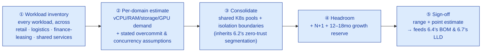
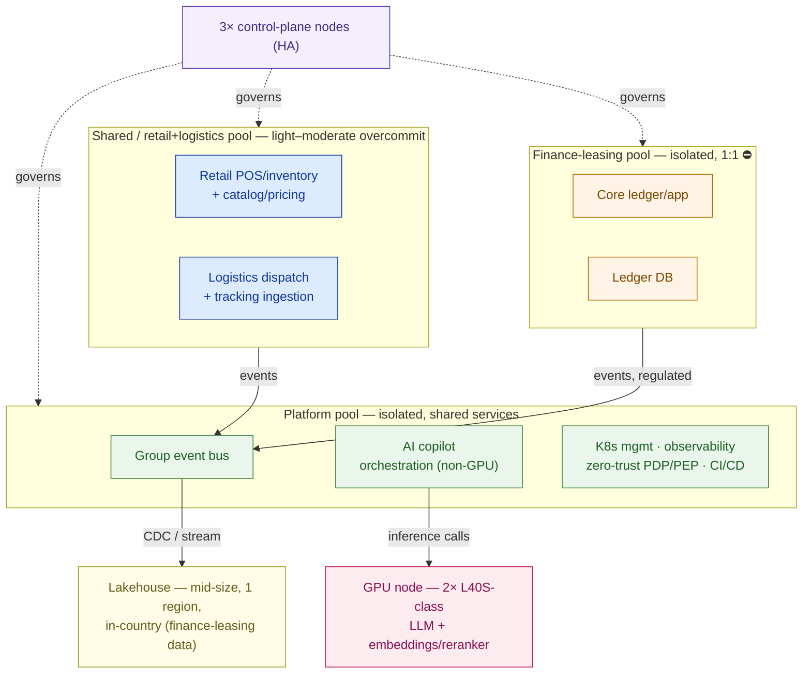

# Sizing & Capacity Planning

> Every workload, sized once, with the assumption written down — or the CFO finds the gap before your customer does.

**Type:** Design
**Track:** AI, Data & Infrastructure Solution Architect (Presales)
**Prerequisites:** 6.2 Security Architecture & Zero Trust
**Time:** ~5h
**Lab:** —
**Ship It:** Sizing methodology + sheet

## The Problem

**Cakrawala Group** is an Indonesian conglomerate: ~350 retail outlets, ~40 logistics hubs, one finance/leasing back office, ~18,000 employees. Following 6.1's pattern selection and 6.2's zero-trust design, the target platform is settled: a **shared Kubernetes platform**, a **group event bus**, a **lightweight AI ops-copilot** (a RAG assistant for store and ops staff — a bounded feature, not an enterprise AI platform), and a **group data lakehouse** with finance-leasing data kept in-country. The board has pinned the envelope: **Rp 45–65B over a 3-year TCO**, a **12–18 month** delivery window, and a **15–20% cost-to-serve** target. What's missing is the number that turns "shared platform" into something you can price, staff, and defend in the room: *how many nodes, how much GPU, how much lakehouse.*

Skip this step and you fail in one of two predictable directions. Undersize, and the platform that looked cheap on the slide falls over the first time retail's Saturday peak, logistics' promo-season surge, and finance's month-end close land in the same week — and you're back in front of the CFO explaining an emergency procurement six months into a 12-month program. Oversize — "let's just add 30% everywhere to be safe" — and the Rp 45–65B ceiling breaks before a single workload runs, because you priced compute, GPU, and storage for three independent enterprise platforms instead of one consolidated one. Both failures have the same root cause: sizing a **multi-domain transformation** (three business units, a bounded AI feature, and a group data platform) using single-workload instincts. A solution architect who can't produce a defensible number across all four domains — infrastructure, AI, data, network — hands the deal to whoever can.

This lesson is where those numbers get made, and they get made **once**: 6.4 (Cost Estimation & BOM) multiplies this sheet by unit price, and 6.7 (the LLD) inherits these exact node, GPU, and storage counts as the physical design. Get the methodology right here and every later artifact inherits a defensible number instead of a guess.

## The Concept

Capacity planning for a single workload — Phase 2's private-cloud hosts, Phase 4's lakehouse, Phase 5's GPU serving tier — is a solved problem you already have the discipline for: inventory the workload, state the overcommit or concurrency assumption, run the formula, land on a range. **Capacity planning for a whole transformation is the same discipline run four times, then reconciled once**, because the domains share infrastructure and compete for the same budget line.



Four things make multi-domain sizing different from the single-workload version you already know:

1. **The workload inventory spans business units, not one estate.** Retail POS/inventory, logistics dispatch/tracking, and finance-leasing core each have a different shape (bursty vs steady, stateless vs 1:1-critical) and a different peak *time* — that mismatch in peaks is the whole argument for consolidation.
2. **Consolidation is a negotiation, not just arithmetic.** Recall 2.1/2.5's overcommit-and-N+1 discipline (state the ratio, refuse to overcommit the tier that can't afford contention, add one spare). At transformation scale you additionally decide **which workloads may share a node pool** and which must sit in an isolated pool — a decision 6.2's zero-trust segmentation already made for you (finance-leasing does not bin-pack with retail).
3. **The AI feature is explicitly bounded, and the sizing must say so out loud.** Phase 5's Bumi Energi built a *dedicated* AI platform for 200 concurrent / 2,000 named users on a 72B model — 6–8 GPUs was the honest answer to that scope. Cakrawala's copilot serves a few dozen ops/store staff on a narrow SOP/inventory corpus. Running Bumi Energi's method on Cakrawala's numbers is what proves the GPU footprint should be *small* — the same Little's Law and KV-budget math, a completely different scale of answer.
4. **The data platform recaps 4.2's lakehouse pattern, scaled down.** Bronze→silver→gold medallion sizing, storage/compute separated and elastic, one open copy — the pattern doesn't change; only the row counts and the number of source business units do.

The four domains, side by side, are the sizing worksheet you'll fill in under Design It:

```
DOMAIN                          METHOD                                      RESULT (band → point)
────────────────────────────────────────────────────────────────────────────────────────────────
① INFRA / KUBERNETES    workload inventory → per-tier overcommit →         36–44 → 40 nodes
                         dual-constraint (cores vs RAM) → +isolation
                         pools +N+1 +control-plane +12–18mo growth reserve

② AI / GPU (copilot)    bounded concurrency (Little's Law) → weights +     1–2 nodes → 1 node,
                         KV-cache budget on an 8–14B model → colocate      2× GPU-class cards
                         embeddings/reranker + N+1 availability            (L40S-class)

③ DATA / LAKEHOUSE      medallion sizing (bronze→silver→gold) scaled to   ~70–120 GB/mo new data →
                         3 BUs' event volume + retention/residency        mid-size, single-region,
                         policy (finance-leasing kept in-country)          in-country lakehouse

④ NETWORK               per-site WAN bandwidth × site count (350 outlets  banded per-site sizing —
                         + 40 hubs) + event-bus ingestion headroom         no single pinned total
────────────────────────────────────────────────────────────────────────────────────────────────
```

The rule that survives from every earlier sizing lesson, unchanged: **every figure is an assumption, a formula, and a range — never a single number conjured from experience.** At transformation scale that rule matters *more*, not less, because four domains' worth of unstated assumptions compound into a proposal nobody can defend.

## Design It

Work Cakrawala Group's sizing sheet domain by domain. Pinned facts (do not soften): ~350 retail outlets, ~40 logistics hubs, 1 finance/leasing back office, ~18,000 employees, Rp 45–65B 3-yr TCO ceiling, 12–18 month window, 15–20% cost-to-serve target. Everything else below is a labelled `ASSUMPTION` carried as a band.

### Step 1 — Workload inventory across the three business units

Before any arithmetic, name what actually runs, grouped into tiers the way 2.1 grouped VM tiers — don't size 350 outlets one store at a time.

| Tier | Business unit | What it does | Overcommit character |
|---|---|---|---|
| Retail POS/inventory sync | Retail (~350 outlets) | Transaction sync, stock-on-hand, local cache invalidation for all outlets | light–moderate (bursty, stateless) |
| Retail catalog/pricing/promo | Retail | Central catalog, pricing, promotion rules served to all outlets | light–moderate |
| Logistics dispatch & route optimization | Logistics (~40 hubs) | Dispatch assignment, route planning across the hub network | moderate (compute-heavier, business-hours) |
| Logistics tracking/telemetry ingestion | Logistics | GPS/status events from vehicles and couriers, hub scan events | moderate (event-driven) |
| Finance-leasing core ledger/app | Finance-leasing (1 back office) | Loan/lease origination, servicing, core ledger | **1:1 ⛔** (system of record, regulator-facing) |
| Finance-leasing DB | Finance-leasing | Ledger and contract database | **1:1 ⛔** |
| Group event bus | Shared, cross-BU | Kafka-class brokers carrying retail/logistics/finance events group-wide | 1:1 (throughput/latency-sensitive) |
| AI ops-copilot orchestration | Shared, bounded feature | RAG API, vector store, gateway — the *non-GPU* half of the copilot | light–moderate |
| Shared platform services | Shared | K8s control/ingress, observability, zero-trust PDP/PEP (6.2), CI/CD | light–moderate |

Note what is deliberately **not** on this list: 350 dedicated per-outlet nodes or 40 dedicated per-hub nodes. Retail and logistics workloads are centralized backend services reached by every site over the network (Step 8) — the store count and hub count drive *load* on a handful of centralized tiers, not a node-per-site topology.

### Step 2 — Per-tier vCPU/RAM demand (bands → midpoint)

> `ASSUMPTION (confirm in discovery)` — pod counts and per-pod specs are bands until confirmed against a live workload profile. Point estimate uses the midpoint, as in 2.1's method.

| # | Tier | Pods (band → mid) | vCPU/pod | RAM/pod | Σ vCPU | Σ RAM |
|---|---|---|---|---|---|---|
| 1 | Retail POS/inventory sync | 40–60 → **50** | 2 | 4 GB | 100 | 200 GB |
| 2 | Retail catalog/pricing/promo | 20–30 → **25** | 2 | 4 GB | 50 | 100 GB |
| 3 | Logistics dispatch & route opt. | 20–30 → **24** | 4 | 8 GB | 96 | 192 GB |
| 4 | Logistics tracking/telemetry | 15–20 → **18** | 2 | 4 GB | 36 | 72 GB |
| 5 | Finance-leasing core ledger/app | 10–14 → **12** | 4 | 16 GB | 48 | 192 GB |
| 6 | Finance-leasing DB | 4–6 → **5** | 8 | 64 GB | 40 | 320 GB |
| 7 | Group event bus (brokers) | 6–9 → **6** | 4 | 16 GB | 24 | 96 GB |
| 8 | AI copilot orchestration (non-GPU) | 10–14 → **12** | 2 | 8 GB | 24 | 96 GB |
| 9 | Shared platform services | 20–30 → **24** | 2 | 4 GB | 48 | 96 GB |
| | **Totals** | **~176 pods** | | | **466 vCPU** | **1,364 GB** |

### Step 3 — Overcommit policy → physical demand

> `ASSUMPTION` — finance-leasing at 1:1 is deliberate and non-negotiable (regulator-facing ledger, no contention tolerance); the group event bus is 1:1 because broker throughput/latency degrades under CPU contention. Retail and shared/platform tiers run light overcommit; logistics dispatch runs a touch tighter because route optimization is genuinely compute-bound.

| # | Tier | Σ vCPU | Overcommit | **pCores** |
|---|---|---|---|---|
| 1 | Retail POS/inventory sync | 100 | 3:1 | 34 |
| 2 | Retail catalog/pricing/promo | 50 | 3:1 | 17 |
| 3 | Logistics dispatch & route opt. | 96 | 2:1 | 48 |
| 4 | Logistics tracking/telemetry | 36 | 2:1 | 18 |
| 5 | Finance-leasing core ledger/app | 48 | 1:1 ⛔ | 48 |
| 6 | Finance-leasing DB | 40 | 1:1 ⛔ | 40 |
| 7 | Group event bus | 24 | 1:1 | 24 |
| 8 | AI copilot orchestration | 24 | 2:1 | 12 |
| 9 | Shared platform services | 48 | 2:1 | 24 |
| | **Physical demand** | 466 | — | **265 pCores** |

### Step 4 — Dual-constraint math: cores vs RAM, then headroom

```
SUBTOTAL DEMAND            265 pCores      1,364 GB RAM
  + headroom (plan to ≤75% steady utilization, per 2.1's rule — never plan a
    node pool to 100%; the N+1 spare needs room to absorb a failed node's pods):
        cores: 265 / 0.75 ≈ 354 pCores        RAM: 1,364 / 0.75 ≈ 1,819 GB
```

> `ASSUMPTION` — **node spec: 16 vCPU / 64 GB RAM** (band 12–16 vCPU / 48–64 GB) per worker node. Kubernetes worker nodes are deliberately **mid-size, not few giant boxes**: more, smaller nodes spread pods across more failure domains and shrink the blast radius of a single node loss — the opposite instinct from the big dual-socket bare-metal hosts in 2.1's VM sizing.

```
cores-driven nodes = CEIL(354 / 16)  = 23
RAM-driven nodes   = CEIL(1,819 / 64) = 29   ← binding constraint
WORKLOAD NODES (dual-constraint, RAM-bound) = 29
```

Cakrawala's platform is **RAM-bound**, not core-bound (the mirror image of Garuda Finance in 2.1, which was core-bound by its refusal to overcommit payments). Here, the finance-leasing 1:1 tiers plus the memory-heavy DB tier push RAM demand ahead of CPU demand — a small, useful fact: buying nodes with a richer core:RAM ratio would waste money on unused cores.

### Step 5 — Isolation pools, N+1, control plane, growth reserve

Three pools, not one, because 6.2's zero-trust segmentation already drew the boundary: finance-leasing cannot bin-pack alongside retail/logistics pods, and shared platform services (identity, observability, CI/CD) sit in their own pool for blast-radius reasons.

```
29  workload nodes (dual-constraint result, Step 4)
+3  isolation/fragmentation overhead — three pools can't bin-pack across each
     other's slack the way one shared pool could            ASSUMPTION ~10%
+3  N+1 spare, one per pool (retail+logistics shared pool ·
     finance-leasing dedicated pool · platform/shared-services pool)
+3  dedicated HA control plane (3 nodes, per 2.5's recipe — never fewer,
     etcd quorum kept intra-DC)
+2  growth/headroom reserve for the 12–18 month rollout (phase-2 site
     rollout not yet live at go-live)
──────────────────────────────────────────────────────────────────────
= 40 NODES  (band 36–44; point estimate 40)
```

**Sanity check:** 29 workload nodes × 64 GB = 1,856 GB capacity against 1,819 GB of headroom-inclusive demand ≈ 98% packed — tight by design, because the ≤75% steady-utilization target was already built into the 1,819 GB figure; the pool is not actually running at 98% day to day.

### Step 6 — The AI ops-copilot: sizing the *bounded* feature

Run Phase 5's exact method — weights VRAM, KV-cache per request, Little's Law for in-flight requests — but on Cakrawala's real numbers, not Bumi Energi's.

**Inputs.** Named users: ~1,000–1,500 (store ops leads across 350 outlets, hub supervisors across 40 hubs, finance-leasing ops staff) — a small slice of the ~18,000 employees, not the whole workforce. Peak concurrent: `ASSUMPTION` ~40–60, point **50** — an occasional-use SOP/inventory lookup tool, not a continuously-open chat app. Query cadence: `ASSUMPTION` ~90 s between queries (band 60–120 s). Target answer latency: `ASSUMPTION` ~3–6 s. Model: because the corpus is narrow (store SOPs, inventory FAQs, basic ops procedures — not Bumi Energi's deep technical/regulatory corpus), an **8–14B open-weight instruct model** (e.g. Qwen2.5-14B-Instruct class) at INT4/AWQ is the right-sized choice, not a 70B+.

```
weights_VRAM = 14e9 × 0.5 bytes (INT4) = 7 GB → +~15% load overhead ≈ 8 GB    band 4–9 GB (8–14B class)

KV_per_token  ≈ 2 × 32 layers × 8 KV-heads × 128 head_dim × 2 (FP16) ≈ 0.125 MB/token   (a smaller
                                                                        model class than Bumi's 72B)
KV_per_request = ~1,500 tok (band 1,000–2,500) × 0.125 MB ≈ 0.18 GB/request

λ (arrival) = 50 users / 90 s ≈ 0.56 req/s        band 0.33 (120s) – 0.83 (60s)
W (service) ≈ target latency ≈ 4.5 s               (mid of 3–6 s SLA)
IN-FLIGHT   = λ × W ≈ 2.5 requests                 band ~1.2–4
Design target (burst headroom): ~6 in-flight slots.
```

**Per-GPU capacity, one L40S-class card (48 GB):**

```
48 − 8 (weights) − ~5 (overhead) ≈ 35 GB KV budget  /  0.18 GB per request  ≈ 194 in-flight capacity
```

One card alone clears the ~6 in-flight design target with roughly **30× headroom** — the honest arithmetic says this workload does not need a GPU *platform*. So why two cards, and why this belongs on one node, not a fleet:

- **Colocate embeddings + reranker.** The RAG retrieval pipeline's embedding model and reranker are small (~1–2 GB VRAM each) but benefit from a dedicated card, so they don't compete with the LLM's decode latency during a retrieval-heavy query.
- **N+1 availability, not N+1 throughput.** A single-card node has no failover; a bounded feature embedded in daily operations across ~390 sites still needs to survive one GPU/driver fault without an outage ticket during business hours.
- **Growth margin for the 12–18 month rollout.** As adoption grows past the initial ~1,000–1,500 named users, the second card doubles capacity without a new procurement cycle.

**Result: 1 GPU node, 2× GPU-class cards (L40S-class, 48 GB each)** — one active on LLM serving, one active on embeddings/reranker and absorbing overflow or failover. This is explicitly **not** Bumi Energi's altitude: Phase 5 sized a *dedicated* AI platform (6–8× H100 across 2 nodes) because 200 concurrent users on a 72B model made the design KV-bound — concurrency, not weights, forced the GPU count up. Here, the same math says the opposite: at ~50 concurrent users on a right-sized 8–14B model, one card already clears the target, and the second card is bought for availability and colocation, not raw throughput. Cost follows the scope: `ASSUMPTION — confirm with hardware partner` 2× L40S-class at ~$7k–9k/card + a modest server ≈ **$30k–45k total** — a rounding error next to Bumi Energi's $260k–400k GPU compute layer, exactly because the feature is bounded and the sizing says so.

### Step 7 — The group data lakehouse: 4.2's pattern, scaled down

Same medallion pattern as 4.2 (bronze → silver → gold, open table format on object storage, storage/compute separated and elastic) — applied to three BUs' event volume instead of one logistics company's parcel stream, with finance-leasing data kept in-country by policy.

```
Retail:     350 outlets × ~800 tx/day (band 500–1,200) ≈ 280,000 tx/day ≈ 8.4M/mo
            × ~2 KB/tx (header+line items+stock delta) ≈ 16.8 GB/day raw ≈ 500 GB/mo raw
            columnar compression ~5–7×  →  ~85 GB/mo compressed (bronze+silver)

Logistics:  ~2,500 vehicles/couriers group-wide × 720 pings/day (60s cadence, ~12h ops)
            ≈ 1.8M events/day ≈ 54M/mo × ~300 B/event ≈ 16.2 GB/mo raw → ~4 GB/mo compressed
            + hub scan events (40 hubs × ~2,000 scans/day) ≈ 2.4 GB/mo raw → ~1 GB/mo compressed

Finance-leasing: ~50,000–80,000 active contracts, ~5,000–10,000 ledger/journal
            events/day × ~1.5 KB ≈ 12 GB/mo raw → ~3 GB/mo compressed
            (small monthly volume; the driver here is retention length, not rate —
            regulatory retention, band 5–10 years, dominates cumulative footprint)

NEW DATA/MONTH (bronze+silver, compressed) ≈ 85 + 5 + 3 ≈ 93 GB/mo    band 70–120 GB/mo
→ ≈ 1–1.5 TB/year new data
```

Over the **3-year TCO horizon** that 6.4 will cost against, with a lifecycle policy (bronze raw hot for ~1 year then cold-tiered; silver/gold retained longer for BI and regulatory evidence), the cumulative hot+warm footprint lands at roughly **3–5 TB** — a handful of terabytes, not the tens-to-hundreds of terabytes that would force a multi-region, hyperscale lake. Ingestion and orchestration jobs run as always-on services already counted in Step 2's "shared platform" and "AI copilot orchestration" tiers; the elastic BI query engine (Trino/Spark-class) bursts on demand into the same platform's growth reserve (Step 5's +2 nodes) rather than pinning dedicated query nodes — the separated-storage-and-compute point from 4.2, applied here as "don't buy compute you can turn off."

**Result: one mid-size, single-region, in-country lakehouse** — single region because nothing in Cakrawala's pinned facts requires multi-region DR for analytics, and in-country specifically for the finance-leasing data domain, consistent with 6.2's data-residency posture.

### Step 8 — Network (bounded, no single pinned total)

```
Per-outlet link (350):   ASSUMPTION 10–50 Mbps (POS sync + catalog pulls + copilot queries)
Per-hub link (40):       ASSUMPTION 50–100 Mbps (dispatch, tracking telemetry, higher burst)
Backhaul to shared platform:  aggregate of the above + event-bus ingestion headroom (2–3×
                          steady-state, per 2.3's discipline, to absorb Monday-morning /
                          month-end bursts without saturating the link)
```

Network sizing here is a per-site bandwidth table, not a single node count — it feeds the WAN/circuit line of 6.4's BOM directly and is revisited in 6.7's LLD once actual site-survey data replaces the band above.

### Step 9 — Result: the sheet, in one place

```
              WORKLOAD   +ISOLATION  +N+1  +CTRL-PLANE  +GROWTH        RESULT
Infra/K8s        29           32       35        38          40      36–44 → 40 nodes
AI/GPU            —            —        —          —           —      1 node, 2× L40S-class
Data/Lakehouse    —            —        —          —           —      mid-size, 1 region, in-country
Network           —            —        —          —           —      per-site band (§8)
─────────────────────────────────────────────────────────────────────────────────────────
This is the sheet 6.4 prices and 6.7 turns into a physical design. Every number above traces
to the assumption that produced it — that traceability, not the number itself, is the deliverable.
```

### Step 10 — The platform, drawn

Putting the four domains and the isolation pools from Step 5 into one picture — the diagram you'd actually put in front of the customer's platform team:



Three CPU pools (36 non-control-plane, non-GPU nodes) + 3 control-plane nodes = the ~40 node figure from Step 5; the GPU node and the lakehouse are separate line items, exactly as Step 9's result table keeps them.

### Why this beats the guess

The "be generous" instinct — price three independent platforms so no BU ever has to negotiate for capacity, and add a 70B-class model to the copilot "so it can grow into anything" — would push the infra line past 50 nodes and the GPU line into Bumi-Energi territory (a dedicated multi-GPU serving tier), blowing through the Rp 45–65B ceiling before the BOM even reaches storage or licensing. The opposite guess — "it's just a shared platform and a chatbot, round down" — undersizes finance-leasing's 1:1 tiers, ignores that RAM, not cores, actually binds the estate, and ships a copilot with no failover the first time a GPU driver crashes on a Monday morning across 390 sites. Running the dual-constraint formula per domain, stating every overcommit ratio and concurrency assumption as a labelled band, and sizing the AI feature to its *actual* bounded population instead of the workforce headcount lands the platform at **40 nodes, 1 GPU node with 2 cards, and one mid-size in-country lakehouse** — a number the CFO can interrogate line by line and the platform team can actually run within the 12–18 month window.

## Compare It

Sizing a single workload (Phase 2's private cloud, Phase 4's lakehouse, Phase 5's GPU tier) and sizing a multi-domain transformation are the same formulas, but the trade-off that decides the final number is different.

| | **Single-domain sizing** (Phase 2/4/5 style) | **Multi-domain transformation sizing** (this lesson) |
|---|---|---|
| What you inventory | One workload type on one platform | Three business units + a bounded AI feature + a data platform, sharing infrastructure |
| The hard decision | Overcommit ratio, redundancy level | *Which* workloads may share a node pool, and which must be isolated (6.2's segmentation) |
| Peak behavior | One peak profile to plan for | Multiple peaks that don't coincide (retail evenings/weekends, finance month-end, logistics promo season) — the argument *for* consolidation |
| Redundancy overhead | One N+1, one control plane | N+1 *per isolation pool*, but still one shared control plane — not one per BU |
| Governance | One team owns the number | Three BU stakeholders + platform team negotiate capacity, cost allocation, and priority during contention |

The consolidation trade-off, made concrete: sizing retail, logistics, and finance-leasing as **three independent platforms** — each with its own control plane (3×3 = 9 nodes instead of 3 shared) and no cross-BU peak-pooling (each BU must size for its *own* worst case, since nothing smooths a shared pool) — plausibly lands around **50–55 nodes** for the same aggregate workload this lesson sized at 40. That gap is the entire commercial argument for "shared platform" on the slide in 6.1: it isn't a slogan, it's ~10–15 fewer nodes, priced out in 6.4. The cost of that saving is real, though — a shared platform means finance-leasing's month-end batch and retail's Saturday peak are now a **capacity negotiation** between BU owners and the platform team, not an independent decision each BU makes for itself. Present both numbers to the customer; let them see what consolidation buys and what it costs in governance.

## Ship It

This lesson ships the **Sizing Methodology + Sheet** — the hard input 6.4 (BOM) and 6.7 (LLD) cite verbatim, so its figures cannot drift between artifacts. Both files live in [`outputs/`](../outputs/):

- **[`template-sizing-methodology-and-sheet.md`](../outputs/template-sizing-methodology-and-sheet.md)** — a fill-in-the-blank template: a Mermaid methodology skeleton, workload-inventory tables per domain (infra/K8s, AI/GPU, data/lakehouse, network), the dual-constraint formula, and a consolidated result table with headroom. Hand it to a colleague and they can size a transformation from scratch.
- **[`example-cakrawala-group-sizing-sheet.md`](../outputs/example-cakrawala-group-sizing-sheet.md)** — the template fully worked for Cakrawala Group, landing on **~40 Kubernetes nodes**, **1 GPU node with 2× GPU-class cards** for the ops-copilot, and **1 mid-size, single-region, in-country lakehouse** — the exact figures 6.4 and 6.7 will build on.

## Exercises

1. **(Easy)** Cakrawala's platform team pushes back on the finance-leasing 1:1 overcommit policy and asks to run it at 2:1 "like the rest of the estate." Recompute Step 3's physical demand and Step 4's node count with finance-leasing at 2:1, and write one sentence on why the 1:1 policy exists in the first place (hint: reread Step 3's stated reason).
2. **(Medium)** A second Indonesian conglomerate — same shape as Cakrawala but with a fourth business unit (a small e-commerce arm, ~500 orders/day) added to the estate — asks for the same sizing exercise. Add a tenth workload tier for the e-commerce backend, re-run Steps 2–5, and state the new node band. Does the new tier change which resource (cores or RAM) binds the estate?
3. **(Hard)** Cakrawala's board asks what happens to the GPU sizing in Step 6 if the copilot's adoption succeeds beyond plan and named users grow from ~1,500 to ~6,000 (the AI feature is still bounded to ops/store staff — not all 18,000 employees — but adoption within that population goes from partial to near-total). Recompute peak concurrency, in-flight requests, and the GPU count using Phase 5's method, and write a half-page memo: at what adoption level does Cakrawala's "bounded feature" GPU sizing start to look like Bumi Energi's "dedicated platform" sizing, and what does the SA say to the board about that inflection point?

## Key Terms

| Term | What people say | What it actually means |
|------|-----------------|------------------------|
| Workload inventory | "List of servers" | The grouped-by-tier catalogue of everything that runs, with its overcommit character stated — the input every sizing formula depends on, done once per domain. |
| Dual-constraint sizing | "How many boxes do we need?" | Computing node count from *both* cores and RAM demand and taking the binding one — an estate is either core-bound or RAM-bound, never neither. |
| Isolation pool | "A separate cluster" | A node pool that cannot bin-pack with another tier's pods, because a security or regulatory boundary (here, 6.2's zero-trust segmentation) forbids sharing — costs nodes, buys blast-radius containment. |
| Headroom | "Some buffer" | A stated ceiling on steady-state utilization (here ≤75%) built into the demand *before* dividing by node capacity — not an afterthought added to a tight number. |
| N+1 | "A spare" | One extra unit (node, GPU, replica) per isolation pool sized so the estate survives one failure with zero capacity loss — priced per pool, not once for the whole platform. |
| Little's Law | "Concurrent users" | `in-flight = arrival rate × service time` — the formula that converts *named* or *peak concurrent* users into the much smaller number of requests actually mid-flight at any instant, which is what a GPU or node pool must hold. |
| Bounded AI feature | "The AI project" | An AI capability scoped to a specific user population and task (here: ops/store staff, SOP/inventory lookup) rather than an enterprise-wide platform — the scope decision that makes a 1-node, 2-card GPU footprint the *correct* answer, not an underpowered one. |
| Medallion architecture | "The data lake" | The bronze→silver→gold layering (raw → conformed → curated) that both 4.2's Kirim Cepat and this lesson's Cakrawala lakehouse use — the pattern doesn't change with scale, only the row counts do. |
| Cost-to-serve | "Run cost" | The ongoing operating cost of the platform as a percentage of the business it serves — Cakrawala's board pinned this at 15–20%, and every sizing decision here (consolidation, N+1 level, GPU footprint) is a dial against that target. |

## Further Reading

- [Kubernetes — Managing Resources for Containers](https://kubernetes.io/docs/concepts/configuration/manage-resources-containers/) — requests/limits and node capacity, the mechanics underneath Step 3–4's dual-constraint math.
- [Kubernetes — Node Overview and Cluster Autoscaling](https://kubernetes.io/docs/concepts/architecture/nodes/) — why mid-size worker nodes and pool-based scaling are the default recommendation over few giant hosts.
- *The Art of Capacity Planning* (John Allspaw, O'Reilly) — the general discipline of turning workload growth into a defensible hardware number; the mid-size-versus-single-workload framing in this lesson is this book's argument applied to a multi-BU transformation.
- [Efficient Memory Management for LLM Serving with PagedAttention (vLLM paper)](https://arxiv.org/abs/2309.06180) — the KV-cache and Little's Law reasoning Step 6 reruns at a smaller scale; read it once in 5.5, reuse it forever.
- [Apache Iceberg documentation](https://iceberg.apache.org/docs/latest/) — the open table format underneath Step 7's lakehouse sizing, and the storage/compute separation that lets query capacity stay elastic rather than pinned.
