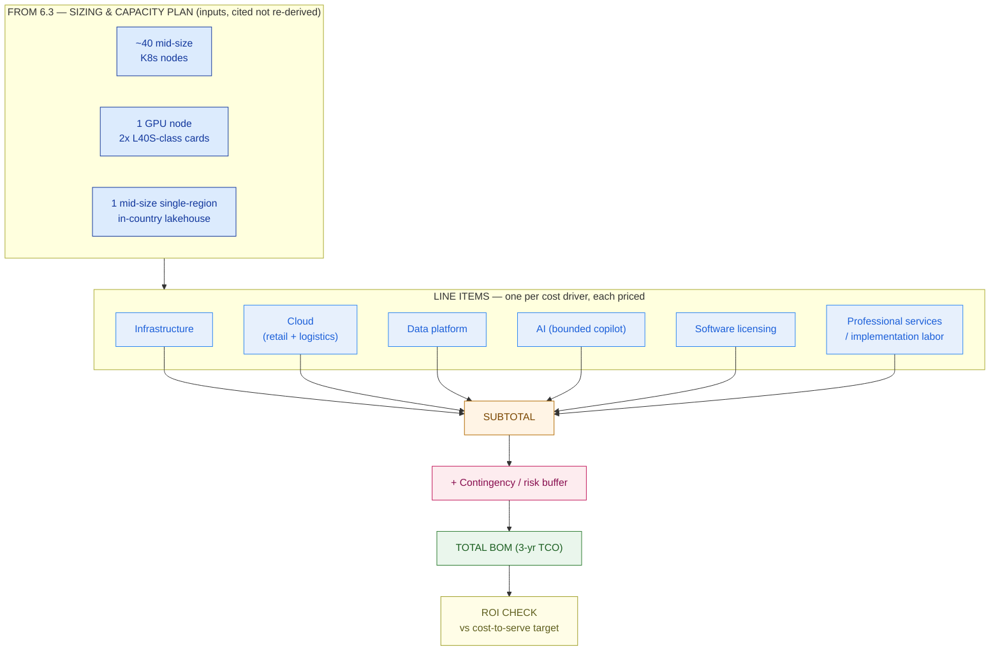

# Cost Estimation & BOM

> A proposal without a priced, itemized BOM is a guess wearing a suit. Turn sizing into rupiah the board can defend.

**Type:** Design
**Track:** AI, Data & Infrastructure Solution Architect (Presales)
**Prerequisites:** 6.3 Sizing & Capacity Planning
**Time:** ~5h
**Lab:** —
**Ship It:** BOM + pricing sheet

## The Problem

The Cakrawala Group steering committee has seen your architecture. Three business units — retail, logistics, finance-leasing — will sit on one shared Kubernetes platform, with a bounded AI ops-copilot and an in-country lakehouse underneath (per 6.1–6.3). The CFO has one question left, and it is the one that actually decides the deal: *"What does this cost, and can I defend that number to the board next week?"*

There are two ways an SA answers this question, and only one of them survives the meeting. The first is the number you're tempted to give under time pressure: a single lump sum — "call it Rp 50 billion" — backed by nothing but confidence. It sounds fine in the room. Then procurement asks for the breakdown, finance asks which parts are CapEx versus OpEx for the cash-flow model, and the delivery lead — who wasn't in the room when you said "50 billion" — discovers six months in that the professional-services estimate you never wrote down was actually half again what the number implied. Now you're renegotiating scope on a signed deal, in public, with the customer who trusted your number. That's not a pricing miss; it's a credibility miss, and those don't come back.

The second way is the one this lesson teaches: a **Bill of Materials (BOM)** — every cost driver named as its own line, each line backed by an assumption and a formula, rolled up into a total with an honest range, split by CapEx and OpEx so the CFO can model cash flow, and checked against the return the transformation is supposed to buy. This is slower to build and far harder to argue with. It also happens to be the only version of "the number" that a delivery team can actually be held to, and the only version a board will approve without a follow-up meeting. The BOM you ship in this lesson isn't paperwork — it's the artifact 6.7 (the LLD) will cite verbatim when it has to justify exact figures to engineering, and the one 6.5 (risk) will attach its contingency reasoning to. Get the line items wrong here and every downstream document inherits the error.

Cakrawala's board has one more constraint that makes this harder than a generic pricing exercise: a pinned budget ceiling of ~Rp 45–65 billion for the full 3-year TCO, a 12–18 month delivery window, and a mandate that the transformation pay for itself through a 15–20% cost-to-serve reduction. A BOM that lands outside the ceiling gets rejected before anyone reads the line items; a BOM that lands suspiciously at the exact bottom of the range reads as sandbagged. The honest exercise is to build the number from the sizing up — 6.3's node counts, GPU footprint, and lakehouse scope — and see where it lands, then defend the range it produces. That's what Design It does below.

## The Concept

A BOM is not a quote. A quote is an answer; a BOM is the *work* that produces the answer, kept visible. Anatomically, every solution-architecture BOM decomposes into the same seven cost drivers, regardless of industry or deal size:

| Cost driver | What it covers | Timing |
|---|---|---|
| **Infrastructure** | Hardware, hosting, racking, network fabric, storage for anything you own or colocate | Mostly one-time (CapEx) |
| **Cloud** | Public-cloud consumption for workloads that live there | Recurring (OpEx), 3-yr run-rate |
| **Data platform** | The lakehouse/warehouse — storage, compute, platform licensing | Recurring (OpEx), 3-yr run-rate |
| **AI** | Model serving, orchestration, guardrails, inference spend — *not* the GPU hardware, which is Infrastructure | Recurring (OpEx), 3-yr run-rate |
| **Software licensing** | Platform management, event-bus/API-gateway licensing (recap 6.1's pattern choices), observability, security tooling | Recurring (OpEx), 3-yr run-rate |
| **Professional services / implementation labor** | The team that builds it — usually the single biggest line in any transformation, and the one rookies underprice because it's not a SKU | One-time |
| **Contingency / risk buffer** | The buffer that survives contact with reality — sized as a percentage of subtotal *or* against named risks (recap feeds 6.5) | One-time, mostly |

Two framings sit on top of this anatomy, and a board needs both:

- **CapEx vs OpEx** is an *accounting* lens: what gets capitalized and depreciated versus what hits the P&L as it's spent. Hardware is almost always CapEx; cloud, licensing, and services are almost always OpEx unless the customer's finance team elects to capitalize implementation labor (some do). This lens matters because it changes which budget approves the spend and how it shows up on the balance sheet.
- **One-time vs recurring** is a *cash-flow* lens: what you pay once versus what you pay every year for the life of the deal. This is the lens a CFO actually plans around, and it does not map 1:1 onto CapEx/OpEx — professional services is one-time cash but rarely capitalized.

Present both. A CFO who only sees "CapEx: 14, OpEx: 38" can't tell you when the cash actually leaves the building; a CFO who only sees "Year 1: 29, Year 2: 12, Year 3: 11" can't tell finance which budget line to code it against. Ship both tables or you'll get called back to build the one you skipped.

**Contingency** is the line every junior SA either forgets or pads blindly. "10% for contingency" is a habit, not an estimate — it's the same number whether the deal is a straightforward lift-and-shift or a first-of-kind AI integration across three business units with incompatible legacy systems. The more defensible version ties each contingency rupiah to a *named* risk (FX exposure on imported hardware, integration unknowns, schedule compression) so the number can be defended line by line — and so it can shrink or grow honestly as those specific risks are retired or discovered. We build both views below; the risk-based version is what 6.5 will formalize into a full risk register.

**ROI framing** closes the loop: the BOM is a cost, but the deal exists because the customer expects a return — here, a 15–20% cost-to-serve reduction. A full TCO/NPV model with discount rates and scenario trees is a heavier deliverable the board will want validated later (that's follow-on work, not this lesson). What you owe *now* is a simple, honestly-caveated payback check: baseline cost-to-serve, apply the target reduction, compare the annualized saving to the BOM total, and be explicit about the ramp — savings don't start on day one, they ramp in as the platform goes live.

Notice what this anatomy deliberately leaves out: it does not ask you to price "the AI project" or "the platform" as single blobs. Every one of the seven drivers is priced independently, against its own assumption, because they fail independently too — a GPU import can blow its FX budget while the services line lands exactly on estimate, or vice versa. A BOM that can't tell you *which* line moved when the number changes six months into delivery is no more useful than the lump sum it replaced; it just has more decimal places.

Here's how sizing becomes a number:



And the same build-up as a table skeleton, plus the two board-facing splits every BOM should also render:

```
ITEMIZED BOM (skeleton)                      CapEx / OpEx split          3-YR RUN-RATE VIEW
──────────────────────────────────           ────────────────────       ─────────────────────
# Line item             Amount  Cx/Ox         CapEx:  <hardware only>    Yr1  <ramp-in, partial>
1 Infrastructure         <Rp X>  CapEx         OpEx:   <everything        Yr2  <near-full run>
2 Cloud                  <Rp X>  OpEx                  else, recurring    Yr3  <full run-rate>
3 Data platform          <Rp X>  OpEx                  + one-time svcs>
4 AI                     <Rp X>  OpEx                                     Sum of Yr1..3 =
5 Software licensing     <Rp X>  OpEx          Total = CapEx + OpEx       recurring subtotal
6 Professional services  <Rp X>  OpEx*
7 Contingency            <Rp X>  —
  ─────────────────────────────
  TOTAL (3-yr TCO)       <Rp X>
                                              * usually expensed, occasionally
                                                capitalized — confirm with the
                                                customer's finance team.
```

Six mistakes account for most BOMs that blow up after signature — check your own against this list before it leaves your hands:

1. **Forgetting professional services** entirely, or treating it as an afterthought line instead of the biggest driver in most transformations.
2. **Pricing "the AI" as a mystery premium** instead of decomposing it into GPU hardware (Infrastructure), inference software (AI), and the labor to build the guardrails (Services) — three different lines, three different owners.
3. **A single contingency percentage** applied uniformly regardless of how novel or risky the specific deal is.
4. **No CapEx/OpEx split**, forcing the customer's finance team to reverse-engineer one from your total — and often getting it wrong in your favor by accident.
5. **A payback calc with no ramp**, implying savings start the day the contract is signed rather than after the platform is live and adopted.
6. **A range so wide it says nothing** ("Rp 30–80 billion") or so narrow it's clearly fabricated confidence ("Rp 52.347 billion") — both destroy trust for opposite reasons.

## Design It

Let's build Cakrawala Group's BOM. This is the artifact 6.7 will cite verbatim, so every figure below carries its assumption and formula — no number appears without a way to check it. Six steps: recap the sizing, price every line, roll up the total and defend the band, split it two ways for the board, show how the recurring spend actually lands year over year, and check it against the return the deal was pitched on.

### Step 1 — Recap the sizing inputs (from 6.3, not re-derived)

Three sizing facts anchor everything that follows; we price them, we don't re-litigate them:

- **~40 mid-size Kubernetes nodes** — the shared platform underneath all three BUs (retail, logistics, finance-leasing).
- **1 on-prem GPU node, 2× GPU-class cards (L40S-class)** — the entire compute footprint for the bounded AI ops-copilot. One node, one use case — this is deliberate, and it's why the AI line item below is small.
- **1 mid-size, single-region, in-country lakehouse** — the shared analytics/data platform.

Resist the urge to second-guess 6.3's numbers here. Sizing and pricing are different jobs done by (often) different people at different times, and re-deriving node counts mid-BOM is how a pricing exercise quietly turns into a three-week architecture re-review. If a sizing input looks wrong, flag it back to 6.3 as a change and re-price once it's confirmed — don't silently adjust it inside the BOM. Exercise 1 below walks through exactly that scenario.

### Step 2 — Price each line item

Every row states its assumption and formula before its number. Figures are in Indonesian Rupiah, billions (Rp B) unless marked `/yr` or `/mo`; the horizon is the 3-year TCO window agreed with the board.

| # | Line item | Assumption | Formula | Estimate | Range |
|---|---|---|---|---|---|
| 1 | **Infrastructure** (hardware) | 40 nodes @ ~Rp 220M installed (compute/RAM/NVMe, rack+network amortized) · GPU node (2× L40S-class + host) @ ~Rp 1.2B · shared fabric/storage/racking @ ~40% of compute HW (standard enterprise ratio) | (40×220M) + 1.2B + 0.40×(8.8B+1.2B) | **Rp 14.0B** | Rp 13.0–15.4B |
| 2 | **Cloud** (retail + logistics public-cloud, 3-yr) | Blended run-rate: retail ~Rp 140M/mo (web/mobile/edge), logistics ~Rp 110M/mo (tracking, routing, DR) — recap 3.7's tagging/showback so each BU sees its own line, not a shared blob | (140M+110M)×36mo | **Rp 9.0B** (Retail 5.0B + Logistics 4.0B) | Rp 7.0–11.0B |
| 3 | **Data platform** (lakehouse, 3-yr) | Mid-size single-region lakehouse: storage + compute + platform licensing ~Rp 2.0B/yr average | Rp 2.0B × 3 | **Rp 6.0B** | Rp 5.0–7.0B |
| 4 | **AI** (bounded ops-copilot, 3-yr) | Inference/orchestration software, vector store, guardrails, token spend ~Rp 1.0B/yr — GPU *hardware* is already in line 1 | Rp 1.0B × 3 | **Rp 3.0B** | Rp 2.0–4.0B |
| 5 | **Software licensing** (3-yr) | Platform mgmt, event-bus + API-gateway licensing (recap 6.1's pattern choice), observability/security tooling, blended across shared platform + 3 BUs ~Rp 1.67B/yr | Rp 1.67B × 3 | **Rp 5.0B** | Rp 4.0–6.0B |
| 6 | **Professional services / labor** (12–18mo build) | ~25 FTE blended team (architects, platform/data/AI engineers, PM) × 14-month average tenure × ~Rp 31M/FTE-month blended rate | 25 × 14 × 31M | **Rp 11.0B** | Rp 9.0–13.0B |
| | **Subtotal (lines 1–6)** | | | **Rp 48.0B** | — |
| 7 | **Contingency / risk buffer** | Risk-based, not a blind percentage (detail below) | sum of named risks | **Rp 4.0B** (~8.3% of subtotal) | Rp 3.0–5.0B |
| | **TOTAL (3-yr TCO)** | | | **~Rp 52.0B** | **Rp 48.0–58.0B** |

That total sits inside the pinned Rp 45–65B ceiling with genuine headroom — comfortable enough to survive one round of scope negotiation without a re-quote.

**A note on currency:** every hardware and GPU-card figure above assumes an imported component priced in USD and converted to Rupiah at prevailing rates during a multi-month procurement window. That conversion risk is real and is *not* buried inside the unit-cost assumption — it's called out by name as the Rp 1.2B FX line in the contingency worksheet below, rather than smeared invisibly across every hardware row. Naming it once, in one place, is what lets it be hedged or renegotiated as a single decision instead of chased through seven line items.

**Contingency, risk-based (not a habit percentage):** the Rp 4.0B buffer is the sum of four named, board-legible risks, so it can be defended line by line and retired as each risk is closed:

```
NAMED RISK                                                      BUFFER
──────────────────────────────────────────────────────────────────────
FX exposure — imported GPU/hardware, procurement-window rupiah swing   Rp 1.2B
Integration unknowns — legacy systems across 3 BUs (6.1/6.2 findings)  Rp 1.5B
Delivery-window compression — 12mo vs the full 18mo window             Rp 0.8B
Licensing/cloud true-up — usage-based overage on go-live                Rp 0.5B
──────────────────────────────────────────────────────────────────────
TOTAL CONTINGENCY                                                       Rp 4.0B
```

**Why the AI line stays small:** contrast Cakrawala's copilot with a hypothetical **Bumi-Energi** — a fictional mining/energy conglomerate running multi-site computer-vision and predictive maintenance across dozens of plants. That footprint needs a multi-node GPU cluster, not one host, and its AI line alone could plausibly run **Rp 25–40B** — several times Cakrawala's *entire contingency budget*. Cakrawala's copilot is deliberately bounded to one node, two cards, one use case (per 6.3), which is exactly why AI is ~6% of this BOM rather than its headline. A board should read "why is AI so cheap here?" as a scoping discipline, not an oversight.

**On the band, honestly:** summing every line's *own* worst case (15.4+11+7+4+6+13+5 ≈ Rp 61.4B) would overstate risk — it assumes FX, scope creep, and cloud overage all land badly in the same year, which is not how portfolio risk behaves. The **Rp 48–58B band is a ±12% portfolio band around the Rp 52.0B central estimate** — the number you present to the board — while the per-line ranges above stay in your procurement back-pocket for negotiating individual contracts.

**Sanity-checking the assumptions:** before this table goes to the board, cross-check at least the two largest and least-standard lines against something external — a hardware vendor's list quote for the 40 nodes and the GPU host, and a rate card or two from the delivery team's own bench for the blended FTE-month figure. A BOM built entirely from internal rules of thumb, with nothing checked against a real quote, is still a guess — just a more organized one. Table 2's ranges exist precisely so this cross-check has somewhere to land.

### Step 3 — CapEx / OpEx split (the accounting lens)

| View | Line items | Amount |
|---|---|---|
| **CapEx** (capitalizable hardware) | Infrastructure (#1) | **Rp 14.0B** |
| **OpEx** (expensed) | Cloud + Data + AI + Licensing + Services + Contingency (#2–7) | **Rp 38.0B** |
| **Total** | | **Rp 52.0B** |

### Step 4 — One-time vs recurring (the cash-flow lens)

| View | Line items | Amount |
|---|---|---|
| **One-time** (Year-1-weighted cash out) | Infrastructure (14.0) + Services/labor (11.0) + Contingency (4.0) | **Rp 29.0B** |
| **Recurring** (3-yr OpEx run-rate) | Cloud (9.0) + Data platform (6.0) + AI (3.0) + Licensing (5.0) | **Rp 23.0B** |
| **Total** | | **Rp 52.0B** |

Notice these two splits disagree on purpose: Professional services is OpEx by accounting convention but one-time by cash timing. Hand the customer's CFO whichever table answers their actual question — usually both, side by side.

### Step 5 — The 3-year run-rate view

The Rp 23.0B recurring subtotal doesn't land evenly — the platform comes online partway through the 12–18 month build, so Year 1 carries a partial run-rate and Year 3 carries the full one:

```
YEAR     CLOUD + DATA + AI + LICENSING (ramping)         CUMULATIVE
────────────────────────────────────────────────────────────────────
Year 1   Rp 4.0B   (partial — systems land mid-build)      Rp 4.0B
Year 2   Rp 9.0B   (near-full run-rate)                    Rp 13.0B
Year 3   Rp 10.0B  (full run-rate + normal growth)         Rp 23.0B
────────────────────────────────────────────────────────────────────
Sum = Rp 23.0B, matching the recurring subtotal in Step 4.
```

### Step 6 — ROI check against the cost-to-serve target

This is a **simple payback screen, not a full TCO/NPV model** — say so explicitly when you present it; the heavier, discount-rate-adjusted version is validated later, and 6.5's risk register is what protects this number if the ramp slips.

- **Group revenue:** ~Rp 8 trillion/year (deal discovery baseline).
- **Assumption — cost-to-serve baseline:** the operating cost this transformation targets (fulfillment, back-office processing, service operations across the 3 BUs) is ~12% of group revenue, range 10–14%.
  **Formula:** revenue × baseline% → Rp 8T × 12% = **Rp 960B/yr** (range Rp 800B–1.12T/yr).
- **Formula — annualized saving:** cost-to-serve baseline × target reduction (15–20%, pinned).
  Using the central baseline: Rp 960B × 15% = **Rp 144B/yr**; Rp 960B × 20% = **Rp 192B/yr**; midpoint **~Rp 168B/yr**.
- **Naive payback** (ignoring ramp): Rp 52.0B ÷ Rp 168B/yr ≈ 0.31 yr (~4 months). **Reject this number** — it assumes full savings from day one, which is impossible before the platform is live.
- **Ramp-adjusted payback:** assume savings ramp *linearly* from 0% at kickoff to full run-rate by month 24 (the 12–18 month delivery window plus a short adoption tail). Cumulative saving at year `T` (T ≤ 2) ≈ Rp 168B × T²/4.
  Solve for breakeven: `168 × T²/4 = 52` → `T² ≈ 1.24` → **T ≈ 1.11 years ≈ 13 months.**
- **Reading it:** breakeven lands *inside* the 12–18 month delivery window, not years after it — a credible, board-defensible payback story, precisely because the AI and infra spend were kept bounded (Step 2) instead of gold-plated.

Put the six steps together and the CFO's original question gets a real answer: **~Rp 52.0 billion (board band Rp 48.0–58.0 billion) over 3 years, Rp 14.0B of it CapEx, breaking even around month 13** — not a lump sum defended by confidence, but a number built line by line from the same sizing inputs 6.3 already validated, ready for 6.5 to risk-check and 6.7 to build against.

## Compare It

Three questions come up in almost every BOM review, and how you answer them says as much about your judgment as the number itself.

**CapEx-heavy (on-prem-first) vs OpEx-heavy (cloud-first) BOM shapes**

| | CapEx-heavy | OpEx-heavy | Cakrawala's shape |
|---|---|---|---|
| Cash timing | Large upfront outlay, low run-rate | Low upfront, spend scales with usage | Blended: owns the shared K8s + GPU platform (CapEx), rents elastic retail/logistics front-ends (OpEx) |
| Board approval | Capital committee, depreciation schedule | Opex budget, easier incremental approval | Needs both tables (Steps 3–4) — one committee per lens |
| Flexibility | Sized for peak, hard to shrink | Scales down if demand doesn't materialize | Private platform is right-sized to 6.3's number; public-cloud lines can flex |
| Best fit | Predictable, steady-state, data-residency-bound workloads (the lakehouse, the copilot) | Spiky, growth-uncertain, customer-facing workloads (retail storefront) | Matches: platform+AI on-prem, BU-facing edges on cloud |

**Lump-sum quote vs itemized BOM**

A lump sum wins the room for five minutes and loses the deal the first time anyone asks "why." An itemized BOM is slower to build and harder to argue with — every line is auditable by the customer's own finance and procurement teams, which is exactly the trust a rushed number can't buy. The tell: a customer who asks for the breakdown *after* accepting a lump-sum number has already downgraded their trust in you; ship the itemized version first and that question never gets asked in a way that costs you credibility.

**Contingency-as-percentage vs risk-based contingency**

A flat "10% for contingency" is fast and defensible nowhere — it's the same number for a lift-and-shift and a first-of-kind AI integration. The risk-based version built in Step 2 (Rp 1.2B FX + Rp 1.5B integration + Rp 0.8B schedule + Rp 0.5B licensing true-up = Rp 4.0B) survives the follow-up question "what specifically is this covering?" and gives 6.5 a head start: each named risk becomes a row in the formal risk register, with its buffer already sized.

**Cost-estimation tooling** (name the products; know when to reach for which):

| Tool | Use when |
|---|---|
| **AWS Pricing Calculator / Azure TCO Calculator / GCP Pricing Calculator** | Sizing the cloud line item precisely once instance types and services are chosen — good for Step 2's Cloud row, not for the whole BOM. |
| **Apptio TBM / Cloudability / CloudHealth** | The customer already runs multi-cloud spend management and wants your BOM's cloud line to plug into their existing showback model (recap 3.7). |
| **Internal spreadsheet/BOM model** (what this lesson ships) | Everything else — infra, services, licensing, contingency, and the roll-up — because no vendor calculator prices your own labor or risk buffer. |

The "it depends" a customer will actually ask: *"Why isn't this all in the cloud — wouldn't that be cheaper and faster?"* Your BOM answers it with the CapEx-heavy row above: the shared platform and the GPU node are steady-state, data-residency-bound workloads that run cheaper owned over a 3-year horizon and don't need elastic scale-out — exactly the profile that loses money under a pure consumption model. The retail and logistics front-ends, by contrast, are exactly the spiky, demand-uncertain workloads cloud OpEx is built for. The BOM's blended shape isn't indecision; it's each workload priced against the model that actually fits it.

## Ship It

This lesson ships the **BOM + Pricing Sheet** — the artifact that turns 6.3's sizing into a number the board can approve and 6.7 can build against. Both files live in [`outputs/`](../outputs/):

- **[`template-bom-pricing-sheet.md`](../outputs/template-bom-pricing-sheet.md)** — a fill-in-the-blank template: sizing-inputs recap → seven-line item table (assumption + formula + range, never a bare number) → risk-based contingency worksheet → CapEx/OpEx split → one-time/recurring split → 3-year run-rate view → ROI/payback check, with a Mermaid skeleton. Hand it to a colleague and they can price a deal from it without you in the room.
- **[`example-cakrawala-group-bom.md`](../outputs/example-cakrawala-group-bom.md)** — the template fully worked for Cakrawala Group, landing on **~Rp 52.0B (band Rp 48.0–58.0B)**, the exact figure 6.7 (LLD) will cite when it needs a number to build against.

Ship both, always. A template without a worked example is a form nobody trusts; a worked example without a template can't be reused on the next deal.

**How to present it — the same BOM, three audiences:**

- **Board / CFO:** lead with the total and the band (Step 2's roll-up), the CapEx/OpEx split (Step 3), and the ROI check (Step 6). They approve or reject in one meeting off these four numbers.
- **Procurement:** hand over the full line-item table with assumptions and per-line ranges (Step 2) — this is what they negotiate vendor contracts against, and the wider per-line ranges matter more to them than the board's tighter portfolio band.
- **Delivery lead:** the risk-based contingency worksheet and the 3-year run-rate view (Steps 2 and 5) — the two artifacts that tell them what they're accountable for hitting, and what buffer exists if a named risk actually lands.

## Exercises

1. **(Easy)** 6.3 revises the sizing to 48 Kubernetes nodes (up from 40) after a late capacity finding. Recompute only the Infrastructure line (Step 2, row 1) using the same per-node assumption, then recompute the total BOM and the new board-level band. Show your formula, not just the new number.
2. **(Medium)** Price a BOM for a different, smaller customer: a single-BU logistics company (no AI copilot, no multi-BU platform) needing ~12 mid-size nodes and a small managed data warehouse, no GPU. Build all seven line items (skip AI, note why), CapEx/OpEx split, and a payback check against a stated cost-to-serve target of your choosing — state every assumption.
3. **(Hard)** Cakrawala's steering committee asks what the BOM looks like if the delivery window compresses from 18 months to 9. Rebuild Step 2's Professional Services line (does compressing the timeline change the FTE count, the blended rate, or both — and why), recompute the schedule-compression contingency line, and rebuild the ramp-adjusted payback in Step 6 for the new timeline. Save your reasoning alongside the worked example; 6.5 (Risk, Compliance & Migration Strategy) will reuse this exact schedule-risk logic.

## Key Terms

| Term | What people say | What it actually means |
|------|-----------------|------------------------|
| BOM (Bill of Materials) | "The quote" | An itemized list of every priced cost driver — each with its own assumption and formula — that rolls up into a total. The opposite of a lump sum. |
| CapEx vs OpEx | "Upfront vs recurring" | An *accounting* distinction (capitalized/depreciated vs expensed), not a cash-flow one — professional services is usually OpEx but paid one-time. Present both lenses. |
| TCO (Total Cost of Ownership) | "The 3-year number" | All costs over a defined horizon — infra, cloud, licensing, services, run-rate — used for comparing options, not just totaling one. |
| Contingency / risk buffer | "The 10% padding" | A rupiah amount tied to named, specific risks (FX, integration, schedule) so it can be defended and retired line by line, not a blind percentage habit. |
| Cost-to-serve | "Our operating cost" | The subset of operating cost a transformation specifically targets (fulfillment, back-office, service ops) — the baseline a reduction target is measured against, not total company opex. |
| Payback period | "When we break even" | The point where cumulative savings equal cumulative investment — must account for *ramp* (savings phase in with adoption), or the number is fiction. |
| Run-rate | "The ongoing cost" | The steady-state annual recurring spend once a platform is fully live — distinct from the blended average, which understates Year 3 and overstates Year 1. |
| Portfolio band | "The uncertainty range" | A band around the central BOM estimate reflecting that not every line's worst case lands in the same year — narrower than the naive sum of per-line worst cases. |
| Blended rate | "The day rate" | A single averaged cost-per-FTE-month across a mixed team (architects, engineers, PM) used to price professional services without listing every individual role and rate. |
| Showback / chargeback | "Splitting the cloud bill" | Showback = each BU *sees* its own cost line (what 6.4's Cloud row does for retail vs logistics); chargeback = each BU is actually *billed* for it. Recap of 3.7. |

## Further Reading

- [FinOps Foundation — FinOps Framework](https://www.finops.org/framework/) — the discipline behind the Cloud line's tagging/showback assumptions (recap of 3.7); read the "Understand Cost & Usage" capability.
- [AWS Pricing Calculator](https://calculator.aws/) and [Azure Pricing Calculator](https://azure.microsoft.com/pricing/calculator/) — the tools that price your Cloud line item once instance types and services are chosen; use them to sanity-check Step 2's assumptions.
- [Gartner — IT Cost Optimization](https://www.gartner.com/en/information-technology/topics/it-cost-optimization) — the analyst framing for CapEx/OpEx trade-offs and contingency sizing that boards expect an SA to already know.
- [A Guide to the Project Management Body of Knowledge (PMBOK) — Cost Management chapter](https://www.pmi.org/pmbok-guide-standards) — the formal source for contingency-reserve methodology (percentage vs risk-based) referenced in Compare It.
- [Apptio — Technology Business Management (TBM) Framework](https://www.apptio.com/topics/tbm/) — how multi-cloud spend-management tools structure a showback/chargeback model your BOM's Cloud line should be able to plug into.
- [NVIDIA — Data Center GPU product lineup](https://www.nvidia.com/en-us/data-center/products/) — current L40S-class specs and typical enterprise-server pricing context for sanity-checking the GPU-node assumption in Step 2.
