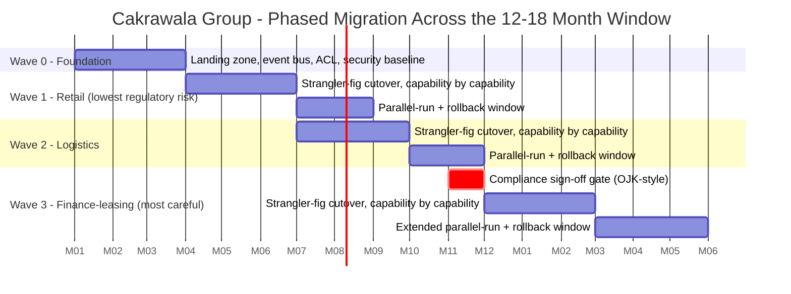

# Risk, Compliance & Migration Strategy

> A risk you named in the register is a line item. A risk you didn't is a crisis with your name on it.

**Type:** Design
**Track:** AI, Data & Infrastructure Solution Architect (Presales)
**Prerequisites:** 6.4 Cost Estimation & BOM
**Time:** ~4h
**Lab:** —
**Ship It:** Risk register + migration plan

## The Problem

You've done the hard architectural work. The pattern is chosen (6.1: strangler-fig, event bus, anti-corruption layer). The security model is defined (6.2: zero trust, segmented by BU). The platform is sized (6.3: ~40 Kubernetes nodes, a small GPU node, one lakehouse). The price is on the table (6.4: ~Rp 52B, band Rp 48–58B). The board reads the deck, nods, and asks the question every transformation this size eventually asks: *"What could go wrong, and what happens if it does?"*

If your answer is a shrug and "we'll handle issues as they come up," you have just told the board you haven't actually thought past the architecture diagram. A transformation that touches three business units, a shared platform nobody has run before, a regulator who cares where finance data physically sits, and a 12–18 month clock is not a project that goes smoothly by default — it's a project that goes smoothly *because someone named the ways it could fail and built mitigations before they were needed*. The SA who shows up with a risk register and a phased migration plan is the SA who gets asked back for the next phase. The SA who doesn't is the SA who gets blindsided in front of the steering committee the first time a risk they never mentioned materializes.

The common failure modes are predictable, which is exactly why they're avoidable. **No risk register** — risks get discovered live, in production, usually during the worst possible wave of the migration. **Big-bang migration of the regulated core** — cutting the finance-leasing business unit over in one weekend because "we did retail fine, this is the same," except finance-leasing has an OJK-style residency requirement, an audit trail, and zero tolerance for a botched cutover; big-bang here isn't bold, it's reckless. **No rollback plan** — the team ships the cutover and discovers, mid-incident, that there is no path back to the old system, so a fixable problem becomes an unrecoverable one. **Ignoring organizational risk** — treating "skills gap" as a training slide instead of a scored risk with a mitigation and an owner, when it's actually one of the likeliest things to blow the 12–18 month window, because a mixed-skill team running a platform they've never operated will move slower than the plan assumes. This lesson gives you the two artifacts that close all four gaps: a risk register that forces you to name what could go wrong before it does, and a migration strategy that sequences the cutover so no single failure — technical, regulatory, or organizational — takes down the business.

## The Concept

### The risk register, at transformation scale

You've almost certainly used a risk register before — it's not a new idea. What changes at transformation scale is the *categories* you must cover and the fact that the register isn't a compliance artifact you file and forget; it drives the sequencing of the migration itself. The discipline is unchanged: every risk gets a **likelihood**, an **impact**, a **mitigation**, and an **owner** — a named person or role, not a team, because a risk owned by everyone is owned by no one.

```
RISK REGISTER — the five columns that matter
┌─────────────────────────┬────────────┬─────────┬──────────────────────────────┬─────────────┐
│ RISK                     │ LIKELIHOOD │ IMPACT  │ MITIGATION                    │ OWNER       │
├─────────────────────────┼────────────┼─────────┼──────────────────────────────┼─────────────┤
│ <name the failure mode>  │ L / M / H  │ L/M/H   │ <the concrete action taken    │ <a named    │
│ in one sentence          │            │         │  BEFORE the risk fires>       │  role>      │
└─────────────────────────┴────────────┴─────────┴──────────────────────────────┴─────────────┘

Score = Likelihood x Impact. Sort the register by score, descending. The top of the
list is what you brief the steering committee on; the bottom is what you note and move on.
```

At the scale of a multi-BU consolidation, five categories recur on almost every deal, and each has a distinct owner and a distinct failure signature:

| Category | What it looks like | Who typically owns the mitigation |
|---|---|---|
| **Regulatory / compliance** | Data residency violated mid-migration; audit trail has a gap during cutover; a regulator sign-off is assumed instead of obtained | Compliance / legal, with the SA as technical translator |
| **Technical** | The anti-corruption layer mistranslates a legacy field; the event bus loses or duplicates messages during dual-write; the strangler-fig facade routes traffic to the wrong system | Delivery / engineering lead |
| **Organizational** | The team operating the new platform doesn't have the skills the platform assumes; key people leave mid-program; three BUs each expect the platform to work "their way" | Program sponsor + delivery lead jointly |
| **Delivery** | The window slips because integration effort was underestimated; one wave's delay cascades into the next; scope creeps past what was priced | Delivery lead |
| **Vendor / lock-in** | Over-reliance on one SI partner's tribal knowledge; a single cloud/K8s distribution becomes a single point of organizational failure; hardware lead times (the GPU node from 6.3) slip | Procurement + delivery lead |

Notice what's *not* in this list as its own category: cost. Cost risk is real, but you already have the tool for it — 6.4's contingency banding (the Rp 48–58B range) *is* the financial risk register, expressed as a number instead of a row. This lesson's register handles the risks that don't reduce to a percentage on top of a BOM.

### The register is a living document, not a deliverable you file

The single most common way a risk register fails is that it gets produced once, presented once, and never opened again. Treat it instead as something with a **cadence**: reviewed weekly during any active migration wave (risks change fast while a cutover is in flight), monthly otherwise, and re-scored — not just re-read — every time. A risk that scored Medium/Medium at the start of the program because "the team will ramp up" needs to be re-scored honestly if the team hasn't ramped up by the time Wave 2 starts. An SA who updates the register only for the steering-committee slide deck is keeping a prop, not a tool.

Score likelihood and impact on the same simple scale so risks are comparable across categories: **Low = 1, Medium = 2, High = 3**, multiplied for a score from 1 to 9. This is deliberately coarse — the goal is a defensible ranking, not false precision. A risk register with fifteen decimal-point probability estimates is a register nobody trusts; one with L/M/H and a clear sort order is a register people actually use in the room.

### Migration strategy: sequencing so no single failure takes down the business

A risk register tells you what could go wrong. A migration strategy tells you how you've arranged the *order* of events so that when something does go wrong, the blast radius is small and there's a way back. Four ideas do almost all of the work.

**Phase by business unit, ordered by regulatory risk, not by convenience.** Cakrawala Group has three BUs riding on the shared platform from 6.1: retail (~350 outlets), logistics (~40 hubs), and finance-leasing. They are not equally risky to migrate. Retail has the lowest regulatory exposure — no residency constraint, high transaction volume but low individual-transaction stakes, and the most outlets to validate the pattern against. Finance-leasing has an OJK-style residency requirement, an audit trail, and money-movement consequences if it goes wrong. The sequencing decision writes itself once you frame it this way: **retail first, as the proving ground; finance-leasing last, once the pattern has survived contact with two BUs already.**

**Cut over with the strangler-fig pattern, not a swap.** Recall 6.1's approach: a facade sits in front of the legacy system and the new platform, routing traffic capability-by-capability, so a BU migrates its capabilities incrementally rather than all at once. This is what makes the rest of this lesson possible — you cannot have a phased migration with rollback if the cutover mechanism is "flip the DNS and pray." The facade *is* the rollback mechanism: shifting routing weight back to the legacy system is a configuration change, not a restore-from-backup exercise.

**Run parallel, then cut the rollback window, not the legacy system.** For each wave, the old and new systems run side by side for a defined window — the new platform serves live traffic (or a canary slice of it) while the legacy system keeps running and keeps being the system of record until the parallel-run window closes cleanly. Only after that window passes its exit criteria does the legacy path get decommissioned. Skipping straight to decommissioning to save a few weeks is exactly how "no rollback plan" happens.

**Gate the regulated wave on an explicit compliance sign-off.** For BUs like retail and logistics, the exit criteria for a wave are technical: error rates, latency, reconciliation checks. For finance-leasing, technical exit criteria are necessary but not sufficient — you also need an explicit sign-off from compliance/legal (an OJK-style checkpoint) confirming residency, audit-trail completeness, and regulatory reporting continuity *before* the cutover proceeds, not after. This is the single gate that separates a defensible finance-leasing migration from a reckless one.

Put the phasing on a timeline and the shape becomes obvious — retail proves the pattern early, logistics follows once the facade and event bus have survived one BU's real traffic, and finance-leasing lands last, gated on compliance, still inside the 12–18 month window:



The overlap between waves is deliberate: Wave 2 begins once Wave 1's cutover is stable (not once its rollback window fully closes), because a 12–18 month window doesn't survive three fully sequential waves with no overlap. Only the compliance gate before Wave 3 is a hard stop — everything upstream of it can flex; nothing about the finance-leasing cutover starts before it clears.

Read the timeline's three sections as three different risk postures, not three identical waves stamped out with different names. Wave 0 has no rollback because it has no production traffic yet — the only thing that "fails" is a delayed start, which is a delivery risk, not a business one. Waves 1 and 2 both carry real production traffic but a *symmetric* rollback tolerance — reverting either wave is annoying, not existential, so a two-month window is proportionate. Wave 3 is asymmetric: it is gated by a hard compliance stop *before* it starts and carries a longer window *after* it starts, because both ends of a regulated cutover deserve more margin than an unregulated one. If you remember one rule for sequencing any migration, remember this: **the rollback window should be sized to the cost of getting the rollback wrong, not to a uniform template.**

### RACI: who owns what when the plan is under a dozen stakeholders

A migration this size fails almost as often on ambiguity ("I thought Ops owned that call") as on any technical defect. A RACI matrix — **R**esponsible (does the work), **A**ccountable (owns the outcome, one name only), **C**onsulted (input sought), **I**nformed (told after) — removes the ambiguity for the handful of decisions that actually matter: who can call a rollback, who signs off compliance, who owns the register itself.

```
RACI - Cakrawala transformation program (excerpt; the worked example has the full table)
+---------------------------------+---------+----------+------------+------------+----------+
| ACTIVITY                        | Sponsor | Delivery | Compliance | BU Ops     | Security |
|                                  | (CIO)   | Lead     | / Legal    | Lead       | Lead     |
+---------------------------------+---------+----------+------------+------------+----------+
| Maintain risk register           |    I    |   A/R    |     C      |     C      |    C     |
| Wave cutover go/no-go            |    C    |   A/R    |     C      |     R      |    C     |
| Rollback decision                 |    I    |   A/R    |     I      |     R      |    I     |
| Finance-leasing compliance gate   |    A    |    R     |    A/R     |     C      |    C     |
| Post-cutover platform operations  |    I    |    C     |     I      |    A/R     |    C     |
+---------------------------------+---------+----------+------------+------------+----------+
Only ONE "A" per row. Two accountable owners for the same decision is how rollback
calls get made twice, in opposite directions, in the middle of an incident.
```

## Design It

Now build both artifacts for Cakrawala Group: the risk register that names what could go wrong, and the migration plan that sequences the cutover so nothing takes down the business.

### Step 1 — Score the top risks

Work through the five categories from The Concept and name the risks that are *specific to this deal*, not generic transformation boilerplate. A generic register ("integration might fail") is worthless in a steering-committee review; a specific one ("the anti-corruption layer's mapping of the finance-leasing chart-of-accounts has never been tested against logistics' inventory schema") gets nodded through because it's clearly been thought about.

```
CAKRAWALA GROUP - TOP 10 RISKS (sorted by score, descending)
+----+----------------------------------------------------+------+------+-------+---------------+
| #  | RISK                                                | LIKE | IMP  | SCORE | OWNER         |
+----+----------------------------------------------------+------+------+-------+---------------+
| 1  | Mixed-skill team can't operate the new K8s/          |  H   |  H   |  9    | Delivery Lead |
|    | lakehouse platform at required pace post-cutover     |      |      |       |               |
| 2  | Finance-leasing residency breach during migration    |  M   |  H   |  6    | Compliance    |
|    | (data transits or lands outside OJK-approved region) |      |      |       |               |
| 3  | 12-18 month window slips - legacy integration        |  M   |  H   |  6    | Delivery Lead |
|    | effort underestimated across all three BUs           |      |      |       |               |
| 4  | Anti-corruption layer mistranslates legacy fields    |  M   |  H   |  6    | Eng Lead      |
|    | between BU schemas and the shared platform           |      |      |       |               |
| 5  | Cost overrun beyond the Rp 58B upper band            |  M   |  H   |  6    | Program       |
|    | (6.4 contingency exhausted by rework or delay)       |      |      |       | Sponsor       |
| 6  | Event bus loses/duplicates messages during           |  M   |  M   |  4    | Eng Lead      |
|    | dual-write parallel-run                              |      |      |       |               |
| 7  | Retail wave delay cascades into logistics and        |  M   |  M   |  4    | Delivery Lead |
|    | finance-leasing wave start dates                     |      |      |       |               |
| 8  | Audit-trail gap during event-bus cutover             |  L   |  H   |  3    | Compliance    |
|    | (transactions unaccounted for during dual-write)     |      |      |       |               |
| 9  | Over-reliance on one SI partner's tribal knowledge   |  L   |  M   |  2    | Program       |
|    | of the platform (bus factor of one)                  |      |      |       | Sponsor       |
| 10 | GPU node hardware lead time slips past Wave 0        |  L   |  M   |  2    | Procurement   |
|    | (recap 6.3 sizing) delaying platform readiness       |      |      |       |               |
+----+----------------------------------------------------+------+------+-------+---------------+
```

Read the shape of this list, not just the rows. Risk #1 (organizational) outscores the regulatory risk — this is the finding that matters most to say out loud, because most first-time transformation plans over-invest in technical risk mitigation and under-invest in the skills-gap risk that 6.2 and 6.3 already flagged as a constraint. The mitigation for #1 isn't "more training slides" — it's a concrete decision in Step 4 (RACI + delivery model) about how much of day-2 operations gets handed to an SI partner versus run internally, which is exactly the Compare It question below.

### Step 2 — Sequence the three waves inside the 12–18 month window

Retail first, logistics second, finance-leasing last — the ordering argued for in The Concept. Each wave gets explicit entry/exit criteria and a rollback trigger, because "we'll know it's stable when we see it" is not an exit criterion.

```
WAVE   BU               MONTHS    PARALLEL-RUN / ROLLBACK WINDOW    EXIT CRITERIA (go to next wave)
-----------------------------------------------------------------------------------------------------
 0     Foundation        1-3      n/a - no prod traffic yet          Platform live (40 nodes, GPU
       (all BUs)                                                     node, lakehouse); event bus +
                                                                      ACL smoke-tested; security
                                                                      baseline (6.2) verified
 1     Retail            3-8      2 months, capability-by-capability Error rate / latency within
       (~350 outlets)                                                SLO for 30 consecutive days;
                                                                      reconciliation matches legacy
 2     Logistics         7-12     2 months, capability-by-capability Same technical bar as Wave 1,
       (~40 hubs)                                                    PLUS: event bus proven stable
                                                                      under a second BU's traffic
                                                                      shape
 3     Finance-leasing  11-17/18  3 months (extended - regulated     Technical bar (as above) AND
                                   core; slower rollback tolerance)   compliance sign-off (Step 3)
                                                                      cleared BEFORE cutover starts
-----------------------------------------------------------------------------------------------------
ROLLBACK TRIGGER (any wave): reconciliation mismatch beyond threshold, sustained SLO breach,
or a compliance finding (Wave 3 only) -> strangler-fig facade weight reverts to legacy; legacy
system remains system of record until the trigger condition is resolved and re-tested.
```

Wave 3 gets a longer parallel-run window than Waves 1 and 2 for a specific reason: rollback tolerance is asymmetric. A retail rollback means retail transactions briefly reconcile against two systems — annoying, not existential. A finance-leasing rollback that's rushed risks the residency and audit-trail guarantees the whole gate exists to protect. Buying an extra month of parallel-run there is cheaper than a regulatory finding.

### Step 3 — Define the compliance gate before the finance-leasing cutover

This is the artifact that turns "we'll be careful with finance-leasing" into something an auditor and a board member can both verify happened.

```
COMPLIANCE SIGN-OFF GATE - Finance-Leasing Cutover (must clear ALL before Wave 3 begins)
+---+---------------------------------------------------------+-------------+----------+
| # | CHECK                                                    | EVIDENCE    | SIGN-OFF |
+---+---------------------------------------------------------+-------------+----------+
| 1 | Finance-leasing data confirmed in-country at rest        | Data        | Compliance|
|   | AND in transit through the migration path                | residency   |          |
|   |                                                           | audit report|          |
| 2 | Audit trail continuous across the cutover window         | Reconcili-  | Compliance|
|   | (no unaccounted transaction gap during dual-write)        | ation report|          |
| 3 | Regulatory reporting (OJK-style) continues uninterrupted  | Test report | Legal    |
|   | through the parallel-run window                          |             |          |
| 4 | Rollback path tested end-to-end at least once before      | Rollback    | Eng Lead |
|   | the live cutover, not just designed on paper              | drill log   |          |
+---+---------------------------------------------------------+-------------+----------+
Gate owner: Compliance/Legal (Accountable). Missing ANY row blocks Wave 3 - no exceptions,
because this is the one gate the register scored a 6-impact regulatory risk against.
```

Notice that row 4 — a live rollback drill, not just a documented rollback procedure — is on the compliance checklist, not just the engineering one. A rollback plan nobody has ever executed is a hypothesis, and a regulator-facing cutover is the wrong place to test a hypothesis for the first time. This is the concrete answer to the "no rollback plan" failure mode named in The Problem: the drill log is the evidence that rollback is a rehearsed capability, not a comforting sentence in a slide.

### Step 4 — Build the program RACI

The excerpt in The Concept generalizes; the worked example in `outputs/` carries the full table across every activity that matters for Cakrawala specifically — including the one decision the risk register flagged as highest-scoring: who runs day-2 operations on a platform the mixed-skill team hasn't operated before. That decision is deliberately made explicit in the RACI (as an "Accountable" assignment) rather than left to whoever happens to be in the room when the platform starts misbehaving.

Two RACI mistakes are worth naming so you don't repeat them. First, assigning "Accountable" to a committee ("Steering Committee: A") instead of a person — a committee cannot be paged at 2 a.m. when a rollback decision needs to be made in minutes, so accountability must resolve to one human. Second, leaving the RACI static for the life of the program: the finance-leasing compliance gate's "Accountable" owner should be named *before* Wave 0 starts, not assigned reactively once Wave 3 is imminent, because a rushed RACI assignment right before the highest-stakes cutover is itself a risk that belongs back in Step 1's register.

### Five signatures that tell you a register or a migration plan is failing

Before moving to Design It, pin these to memory — they're the tells that separate a healthy program from one about to surprise its steering committee:

1. **The register hasn't changed in three consecutive reviews.** Either the program is unusually stable, or nobody is actually re-scoring it.
2. **Every risk is "Medium/Medium."** Coarse scoring is fine; refusing to differentiate at all means the exercise was performed, not done.
3. **A wave's exit criteria are subjective** ("the team feels good about it") instead of measurable (error rate, latency, reconciliation match, sign-off obtained).
4. **The rollback path has never been executed**, only diagrammed — see the compliance gate's drill-log requirement below.
5. **Two names could plausibly answer "who calls the rollback"** — which means, in practice, that no one will, in the ten minutes it matters.

## Compare It

Three "it depends" questions a customer will ask, in almost every migration deal.

| Question | Option A | Option B | When to pick which |
|---|---|---|---|
| **Big-bang vs. phased migration** | Cut every BU over in one event | Phase by BU, strangler-fig, parallel-run per wave (this lesson) | Big-bang is only defensible for small, low-risk, easily-reversible systems. For a multi-BU, regulator-touching transformation like Cakrawala's, phased is the only version that survives a steering-committee risk review — big-bang concentrates every risk in the register into one weekend. |
| **Risk-based contingency vs. flat percentage** | A flat "add 15% to every estimate" buffer | A contingency banded to scored risk (6.4's Rp 48–58B, wider where the register scores higher) | A flat percentage treats a low-risk retail rollout and a regulator-touching finance-leasing cutover as equally uncertain, which is false on its face. Band the contingency to the register: BUs with higher-scored risks (finance-leasing) carry a proportionally wider band than BUs that scored lower (retail). This is 6.4's discipline, driven by *this* lesson's register instead of intuition. |
| **Internal delivery vs. SI-partner-led delivery** | The customer's own (mixed-skill) team delivers and operates | An external systems-integrator partner leads delivery and/or a managed day-2 operations period | Straight to risk #1 on the register: a mixed-skill team delivering *and* operating a platform they've never run is the highest-scored risk in the whole exercise. An SI partner (or a hybrid: SI-led delivery with a knowledge-transfer period before handover) directly mitigates that risk — at the cost of the "over-reliance on one SI partner" risk (#9) if the handover plan is vague. The right call is rarely "all internal" or "all SI" — it's a staged handover with named exit criteria, the same discipline as the migration waves themselves. |
| **Static risk register vs. living register** | Produce the register once, present it in the kickoff deck, never reopen it | Review weekly during an active wave, re-score honestly, retire closed risks, add newly discovered ones | A register that isn't revisited becomes theater by Wave 2 — the skills-gap risk (#1) looks very different in month 1 than in month 9, and only a living register catches that drift before it becomes an incident. |

## Ship It

This lesson ships a **Risk Register + Migration Plan** — the artifact that turns "we've thought about what could go wrong" into something a steering committee can actually inspect. Both files live in [`outputs/`](../outputs/):

- **[`template-risk-register-and-migration-plan.md`](../outputs/template-risk-register-and-migration-plan.md)** — a fill-in-the-blank template: a risk register table (five categories, likelihood × impact scoring), a phased wave-plan skeleton with a Mermaid timeline, entry/exit criteria and rollback triggers per wave, a compliance-gate checklist, and a RACI matrix.
- **[`example-cakrawala-group-risk-and-migration-plan.md`](../outputs/example-cakrawala-group-risk-and-migration-plan.md)** — the template fully worked for Cakrawala Group: the top 10 scored risks, the retail → logistics → finance-leasing wave plan inside the 12–18 month window, the OJK-style compliance gate, and the full program RACI.

This deliverable feeds directly into **6.6 (Writing the HLD)** — the risk register becomes the HLD's risk section, and the wave plan becomes its implementation roadmap — and into **Capstone F (Enterprise AI Transformation Proposal)**, where a board-facing proposal without a risk-and-migration story is an incomplete proposal.

## Exercises

1. **(Easy)** Take risk #6 from Cakrawala's register (event bus message loss/duplication during dual-write) and write out its full row: likelihood, impact, a concrete mitigation (not "test more"), and a named owner role. Then explain in one sentence why this risk sits in the "technical" category and not "delivery."
2. **(Medium)** A different customer — a regional hospital network merging three hospitals onto one shared EHR/patient-data platform — asks you for a risk register. Name the five categories from this lesson applied to their situation (one risk each), and decide the wave order for their three hospitals. Which one goes first, and what's your one-line justification (hint: use the same "lowest regulatory/patient-safety risk first" logic used for Cakrawala's retail wave)?
3. **(Hard)** Cakrawala's steering committee pushes back on Wave 3's 3-month parallel-run window, arguing it's too slow and want it cut to 6 weeks to protect the 12–18 month deadline. Using the register (risk #2 and #8) and the compliance gate from Step 3, write a half-page response: what you'd concede, what you'd hold firm on, and what evidence you'd bring to the room to defend your position. Save it alongside your worked example — you'll reuse this negotiation pattern in Capstone F.

## Key Terms

| Term | What people say | What it actually means |
|------|-----------------|------------------------|
| Risk register | "A list of things that could go wrong" | A scored, owned artifact — every risk gets a likelihood, an impact, a concrete mitigation, and a single named owner. Sorted by score, it tells you what to brief the steering committee on first. |
| Likelihood × Impact | "High risk" | The two-axis score (e.g., L/M/H each) that lets you rank risks objectively instead of by whoever argued loudest in the room. |
| Phased migration | "We'll do it in stages" | Sequencing BUs/workloads by *risk*, not convenience — lowest regulatory/technical risk first, as a proving ground, so the pattern is validated before it meets the highest-stakes system. |
| Parallel-run | "Testing in production" | Old and new systems serving (or reconciling against) the same traffic for a defined window with explicit exit criteria — the mechanism that makes rollback possible instead of theoretical. |
| Rollback window | "We can always roll back" | A time-boxed period, defined *before* cutover, during which reverting to the legacy system is a routine operation (a facade weight change) rather than a crisis restore. |
| Compliance sign-off gate | "Legal will review it" | An explicit, evidenced checklist that must clear in full before a regulated cutover proceeds — not a courtesy review after the fact. |
| RACI | "Everyone knows their job" | A matrix naming exactly one **A**ccountable owner per decision (plus Responsible/Consulted/Informed) — the artifact that prevents two people from making opposite rollback calls during the same incident. |
| Strangler-fig cutover | "We're migrating capability by capability" | The facade-routing pattern from 6.1 that makes phased migration *and* rollback both possible — it's the mechanism, not just the philosophy, behind everything in this lesson. |
| OJK-style residency gate | "Data compliance" | A jurisdiction-specific requirement (modeled here on Indonesia's OJK financial-sector oversight) that regulated data — finance-leasing, in Cakrawala's case — physically stays in-country through migration, not just at rest afterward. |
| Blast radius | "How bad could it get" | The scope of impact if a given risk fires — the reason waves are ordered lowest-blast-radius-first and why Wave 3 gets a longer rollback window than Waves 1–2. |
| Wave | "A migration phase" | A bounded unit of migration (typically one BU here) with its own entry criteria, exit criteria, parallel-run window, and rollback trigger — never just a date range on a Gantt chart. |
| Anti-corruption layer (ACL) | "A translation layer" | The component (from 6.1) that isolates the new platform's data model from a legacy BU's schema quirks — its mistranslation risk (#4 in the register) is a top-5 technical risk precisely because it sits on every cutover's critical path. |

## Further Reading

- [PMI — Practice Standard for Project Risk Management](https://www.pmi.org/pmbok-guide-standards/foundational/practice-standard-project-risk-management) — the likelihood/impact/mitigation/owner discipline this lesson applies at transformation scale, from the source.
- [Martin Fowler — StranglerFigApplication](https://martinfowler.com/bliki/StranglerFigApplication.html) — the cutover mechanism that makes phased migration and rollback both possible; read it once, reuse it in every migration plan you write.
- [Otoritas Jasa Keuangan (OJK) — regulatory framework overview](https://www.ojk.go.id/en/Default.aspx) — the real-world regulator this lesson's "OJK-style" gate is modeled on; skim it so you recognize what a residency/audit requirement actually demands.
- [Gartner — IT Risk Management framework](https://www.gartner.com/en/information-technology/glossary/it-risk-management) — how large advisory firms categorize technology risk; useful for aligning your register's categories to a customer's existing GRC (governance, risk, compliance) taxonomy.
- [AWS Prescriptive Guidance — Migration readiness and planning](https://docs.aws.amazon.com/prescriptive-guidance/latest/migration-readiness/welcome.html) — a vendor-neutral-enough treatment of wave planning, cutover, and rollback that generalizes past any single cloud.
- [ISO 31000 — Risk Management Guidelines](https://www.iso.org/iso-31000-risk-management.html) — the international standard behind most enterprise GRC risk taxonomies; useful shorthand when a customer's own risk function asks "which standard is this register aligned to?"
