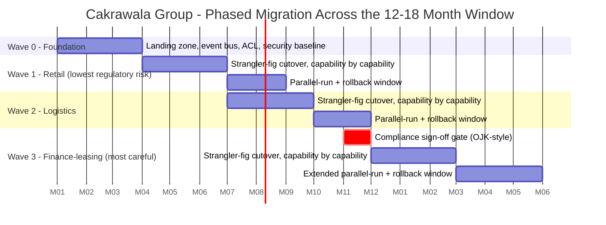

# Risk Register + Migration Plan — Cakrawala Group (worked example)

> This is `template-risk-register-and-migration-plan.md` filled in for the running Phase 6 customer. It shows what "good" looks like: a scored register that puts the organizational risk ahead of the regulatory one, a 3-wave plan that spends the finance-leasing risk last, an OJK-style compliance gate that has to clear before that wave starts, and a RACI with exactly one accountable owner per critical decision. This is the artifact that becomes the risk section and the roadmap of the **6.6 HLD**, and the risk-and-migration story inside **Capstone F**.

**Customer:** Cakrawala Group (fictional)  ·  **Industry / regulator:** Diversified conglomerate — retail, logistics, finance-leasing (finance-leasing regulated OJK-style)
**Prepared by:** SA — Presales  ·  **Date:** 2026-07-05  ·  **Engagement / opportunity:** "Shared Platform Consolidation" transformation program  ·  **Version:** v0.2
**Delivery window:** 12–18 months  ·  **Business units in scope:** Retail (~350 outlets), Logistics (~40 hubs), Finance-leasing

**Hard constraints (drove every decision below):**
- **Residency / regulatory:** finance-leasing data must stay in-country (OJK-style requirement) — at rest and in transit through the migration.
- **Delivery window:** 12–18 months, hard outer bound — waves overlap deliberately to fit inside it.
- **Operating model constraint:** mixed-skill team will operate the platform day-2; this is the single highest-scored risk in the register.
- **Prior architecture decisions recapped here:** strangler-fig facade + event bus + anti-corruption layer as the cutover/rollback mechanism (6.1); zero-trust, BU-segmented security model (6.2); ~40 K8s nodes + a small GPU node + one lakehouse (6.3); ~Rp 52B price, band Rp 48–58B (6.4).

Legend: **L/M/H** = Low/Medium/High (score 1/2/3; risk score = Likelihood × Impact, 1–9) · **RACI** = Responsible/Accountable/Consulted/Informed (exactly one **A** per row) · **facade** = the strangler-fig router used as the rollback mechanism.

---

## 1. Risk register (all 10 risks, sorted by score)

| # | Risk (specific to this deal) | Category | Likelihood | Impact | Score | Mitigation | Owner |
|---|---|---|---|---|---|---|---|
| 1 | Mixed-skill team can't operate the new K8s/lakehouse platform at required pace post-cutover | Organizational | H | H | 9 | Staged SI-partner-led delivery with a named knowledge-transfer period and exit criteria before full internal handover (see Compare It in the lesson); day-2 ops RACI assigned before Wave 0 starts | Delivery Lead |
| 2 | Finance-leasing residency breach during migration (data transits or lands outside the OJK-approved region) | Regulatory / compliance | M | H | 6 | Migration path routed exclusively through in-country infrastructure; residency audit report required before Wave 3 (§3, check 1) | Compliance |
| 3 | 12–18 month window slips — legacy integration effort underestimated across all three BUs | Delivery | M | H | 6 | Wave 0 foundation work sized against 6.3's actual node/GPU/lakehouse build effort, not a guess; wave overlap built into the timeline as slack | Delivery Lead |
| 4 | Anti-corruption layer mistranslates legacy fields between BU schemas and the shared platform | Technical | M | H | 6 | ACL mapping tested against sample data from all three BUs before each wave's cutover, not just the BU actively migrating | Eng Lead |
| 5 | Cost overrun beyond the Rp 58B upper band (6.4 contingency exhausted by rework or delay) | Delivery / financial | M | H | 6 | Contingency banded to this register's scores (widest for Wave 3), monthly burn-rate review against the Rp 48–58B band | Program Sponsor |
| 6 | Event bus loses or duplicates messages during dual-write parallel-run | Technical | M | M | 4 | Idempotency keys + reconciliation job comparing event-bus totals against the legacy system nightly during every parallel-run window | Eng Lead |
| 7 | Retail wave delay cascades into logistics and finance-leasing wave start dates | Delivery | M | M | 4 | Wave 2 entry criteria require only Wave 1 cutover stability, not full rollback-window closure — decouples the dependency | Delivery Lead |
| 8 | Audit-trail gap during event-bus cutover (transactions unaccounted for during dual-write) | Regulatory / compliance | L | H | 3 | Reconciliation report is a named checklist item (§3, check 2) before Wave 3; drilled during Waves 1–2 first | Compliance |
| 9 | Over-reliance on one SI partner's tribal knowledge of the platform (bus factor of one) | Vendor / lock-in | L | M | 2 | Knowledge-transfer milestones written into the SI contract with named internal counterparts per capability | Program Sponsor |
| 10 | GPU node hardware lead time slips past Wave 0 (recap 6.3 sizing), delaying platform readiness | Vendor / lock-in | L | M | 2 | GPU node ordered at contract signature, ahead of Wave 0 start, with a documented fallback (CPU-only inference) if it slips | Procurement |

**Reading the register:** risk #1 (organizational) outscores every regulatory and technical risk on the list. That is the single most important finding to say out loud in the steering-committee review — most first-pass transformation plans over-invest in ACL/event-bus mitigation (real risks, but scored 4–6 here) and under-invest in the skills-gap risk that 6.2 and 6.3 already flagged as a constraint. The mitigation for #1 is the delivery-model decision in the RACI (§4), not a training slide.

---

## 2. Migration wave plan

**Timeline:**



**Wave table:**

```
WAVE   BU               MONTHS    PARALLEL-RUN / ROLLBACK WINDOW    EXIT CRITERIA (go to next wave)
-----------------------------------------------------------------------------------------------------
 0     Foundation        1-3      n/a - no prod traffic yet          Platform live (40 nodes, GPU
       (all BUs)                                                     node, lakehouse); event bus +
                                                                      ACL smoke-tested; security
                                                                      baseline (6.2) verified
 1     Retail            3-8      2 months, capability-by-capability Error rate / latency within
       (~350 outlets)                                                SLO for 30 consecutive days;
                                                                      reconciliation matches legacy
 2     Logistics         7-12     2 months, capability-by-capability Same technical bar as Wave 1,
       (~40 hubs)                                                    PLUS: event bus proven stable
                                                                      under a second BU's traffic
                                                                      shape
 3     Finance-leasing  11-17/18  3 months (extended - regulated     Technical bar (as above) AND
                                   core; slower rollback tolerance)   compliance sign-off (§3) cleared
                                                                      BEFORE cutover starts
-----------------------------------------------------------------------------------------------------
ROLLBACK TRIGGER (any wave): reconciliation mismatch beyond threshold, sustained SLO breach, or a
compliance finding (Wave 3 only) -> strangler-fig facade weight reverts to legacy; legacy system
remains system of record until the trigger condition is resolved and re-tested.
```

**Why this order, why these windows:** retail carries the lowest regulatory exposure and the most outlets to validate the pattern against — it proves the strangler-fig facade and the event bus work before either meets the finance-leasing core. Logistics follows once that proof exists. Finance-leasing goes last, gated on compliance before it starts and given a longer parallel-run after it starts, because a rushed rollback there risks the residency and audit-trail guarantees the whole gate exists to protect (risks #2 and #8). Wave 2 begins once Wave 1's cutover is *stable*, not once its rollback window fully closes — the overlap is what makes three waves fit inside 12–18 months instead of requiring 18–24.

---

## 3. Compliance sign-off gate — Finance-Leasing Cutover

```
COMPLIANCE SIGN-OFF GATE - Finance-Leasing Cutover (must clear ALL before Wave 3 begins)
+---+---------------------------------------------------------+-------------+----------+
| # | CHECK                                                    | EVIDENCE    | SIGN-OFF |
+---+---------------------------------------------------------+-------------+----------+
| 1 | Finance-leasing data confirmed in-country at rest AND    | Data        | Compliance|
|   | in transit through the migration path                    | residency   |          |
|   |                                                           | audit report|          |
| 2 | Audit trail continuous across the cutover window          | Reconcili-  | Compliance|
|   | (no unaccounted transaction gap during dual-write)         | ation report|          |
| 3 | Regulatory reporting (OJK-style) continues uninterrupted   | Test report | Legal    |
|   | through the parallel-run window                           |             |          |
| 4 | Rollback path tested end-to-end at least once before       | Rollback    | Eng Lead |
|   | the live cutover, not just designed on paper               | drill log   |          |
+---+---------------------------------------------------------+-------------+----------+
Gate owner: Compliance/Legal (Accountable). Missing ANY row blocks Wave 3 - no exceptions,
because this is the one gate the register scored a 6-impact regulatory risk (#2) against.
```

**On check 4 specifically:** the rollback drill is scheduled during Wave 2 (logistics), using a non-production replica of the finance-leasing cutover mechanics, so the first-ever execution of a finance-leasing rollback is not the live one. A rollback plan nobody has rehearsed is a hypothesis, and a regulator-facing cutover is the wrong place to test a hypothesis for the first time.

---

## 4. Program RACI (full table)

```
RACI - Cakrawala Group transformation program
+------------------------------------+---------+----------+------------+------------+----------+
| ACTIVITY                           | Sponsor | Delivery | Compliance | BU Ops     | Security |
|                                     | (CIO)   | Lead     | / Legal    | Lead       | Lead     |
+------------------------------------+---------+----------+------------+------------+----------+
| Maintain risk register              |    I    |   A/R    |     C      |     C      |    C     |
| Wave cutover go/no-go                |    C    |   A/R    |     C      |     R      |    C     |
| Rollback decision                    |    I    |   A/R    |     I      |     R      |    I     |
| Finance-leasing compliance gate       |    A    |    R     |    A/R     |     C      |    C     |
| Post-cutover platform operations      |    I    |    C     |     I      |    A/R     |    C     |
| Training / knowledge transfer (SI)    |    A    |    R     |     I      |     R      |    I     |
+------------------------------------+---------+----------+------------+------------+----------+
```

**On the two "A/R" rows for the compliance gate:** Delivery is Responsible for *producing* the evidence (the residency audit, the reconciliation report, the drill log); Compliance/Legal is Accountable for *certifying* it clears. That split is deliberate — the team doing the work should never also be the sole signer-off on whether that work is good enough, especially for the highest-impact regulatory risk on the register (#2).

---

## 5. Review cadence & one-line summary

**Review cadence:** weekly during any active wave (Waves 0–3 back-to-back cover nearly the whole program); monthly in any gap between waves. Every review re-scores the register — it does not just re-read it.

**One-line strategy statement:**
> The register's highest-scored risk is the mixed-skill team's ability to operate the new platform (9/9), mitigated by a staged SI-partner-led delivery with named knowledge-transfer exit criteria. The migration is 3 waves — retail first as the proving ground, logistics second, finance-leasing last behind an OJK-style compliance gate — inside the 12–18 month window, with rollback via the strangler-fig facade and exactly one accountable owner per critical decision.
