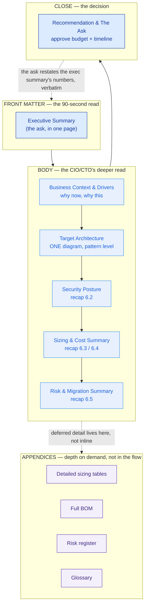
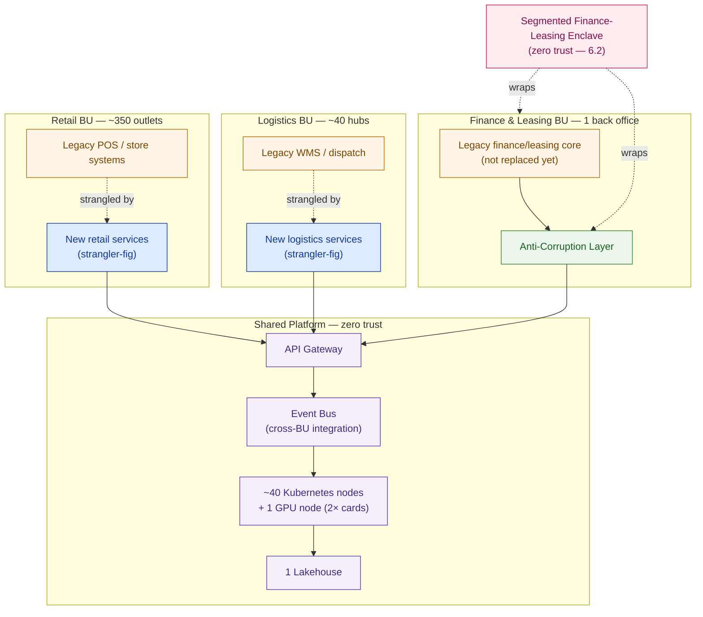

# Writing the HLD

> The board doesn't read your diagrams — they read your ask. If they can't find it in ninety seconds, you haven't written an HLD; you've written an LLD with a title page.

**Type:** Design
**Track:** AI, Data & Infrastructure Solution Architect (Presales)
**Prerequisites:** 6.5 Risk, Compliance & Migration Strategy
**Time:** ~5h
**Lab:** —
**Ship It:** HLD document

## The Problem

You've done the work. Across 6.1–6.5 you chose the patterns (strangler-fig migration, an event bus, an anti-corruption layer in front of the legacy core, an API gateway at the edge), designed the zero-trust security model with a segmented enclave around the finance-leasing business, sized the platform (roughly 40 Kubernetes nodes, one GPU node with two cards, one lakehouse), priced it (~Rp 52 billion, banded 48–58B), and mapped the risk and a three-wave migration with a compliance gate before the finance-leasing cutover. Five lessons, five excellent artifacts. Now you have twenty minutes with the Cakrawala Group board.

You open with the pattern diagram from 6.1. A director who runs the leasing arm asks, reasonably, "what does this cost and when do we see it working?" You flip forward through the sizing tables looking for the number. By the time you find it, you've lost the room — not because the number is bad, but because the *document* made them hunt for it. This is the single most common way a technically sound architecture loses a board vote: the artifact that reaches the decision-makers is built for the wrong altitude. It reads like a **Low-Level Design (LLD)** — the engineer's "exactly how do we build this" — when what the room needs is a **High-Level Design (HLD)**: the executive's "what are we building, why, what does it cost, and what's the risk."

The failure has a shape you'll see again and again: no executive summary, so there's no ninety-second version of the pitch; the ask (the money, the timeline, the decision you need from them) is buried on page 14 instead of stated on page 1; ten diagrams where one would do, each one a different zoom level with no map showing how they relate; and — the fatal one — a menu of options with no recommendation, which reads to a board as "the vendor doesn't actually know what they'd do in our shoes." Every one of 6.1–6.5's deliverables is *correct*. None of them, handed over as-is, is *approvable*. The HLD is the document that takes five lessons of technical work and re-renders it at board altitude — one document, and it has to work whether the reader is the CEO skimming the first page or the CTO reading every appendix. That synthesis is this lesson's entire job.

## The Concept

### Two documents, two questions, two readers

An HLD and an LLD both describe the same solution. They are not the same document at different levels of polish — they answer **different questions** for **different readers**, and confusing them is the root cause of the failure in The Problem.

| | **HLD (this lesson)** | **LLD (6.7)** |
|---|---|---|
| Question it answers | *What* are we building, *why*, at *what cost*, with *what risk*? | *Exactly how* do we build it? |
| Primary reader | Board, CEO, CFO, business sponsor | Engineers, implementers, the delivery team |
| Altitude | Pattern-level: "an event bus decouples retail from the legacy core" | Component-level: topic names, partition counts, IAM policies, runbook steps |
| Diagram count | One target-architecture diagram (the "money diagram") | A diagram per domain/subsystem |
| Numbers shown | Rounded, banded, sanity-checked (~Rp 52B, band 48–58B) | Exact BOM line items, SKUs, licence counts |
| Decision it drives | Approve the budget and the timeline | Execute the build |
| Length that works | 15–25 pages, most of it prose | However long the engineers need |

Neither document is "better" — an LLD handed to a board is unreadable; an HLD handed to an engineer is unbuildable. You will write both for the same engagement (6.7 picks up where this lesson stops), and the discipline is knowing which altitude you're at on every page.

### The anatomy of an approvable HLD

A board-legible HLD has a fixed shape. Each section exists to answer one question a decision-maker will actually ask, in the order they'll ask it:



Read the shape, not just the boxes: **front matter and close are the same altitude** (executive), **the body is one altitude lower** (CIO/CTO), and **appendices exist so detail never has to interrupt the narrative**. A reader who only ever opens the executive summary and the closing ask should still walk away understanding the deal. A reader who reads the whole body should never hit a number that contradicts the summary — the body recaps 6.1–6.5, it does not re-derive them.

### Writing for two audiences in one document

The trick that makes a single document work for both the CEO and the CTO is **layered detail, not two documents**. Every section opens with a one-sentence, board-legible claim, and only *then* earns the right to go one level deeper for the reader who wants it:

```
LAYER 1 (everyone reads this)
  "We will run Cakrawala's three business units on one shared platform,
   sized at ~40 Kubernetes nodes plus a GPU node, for ~Rp 52 billion."
        │
        ▼ (the CTO keeps reading; the CEO stops here and is still informed)
LAYER 2 (the technical sponsor reads this)
  "The platform uses a strangler-fig migration off the legacy core, an
   event bus for cross-BU integration, and an anti-corruption layer in
   front of systems we are not replacing yet — see the target architecture
   diagram."
        │
        ▼ (the engineer flips to the LLD for this)
LAYER 3 (deferred to 6.7's LLD, referenced not reproduced)
  "Node pool taints, event-bus topic partitioning, ACL transformation
   rules, IAM role bindings — see the Low-Level Design."
```

This is why the HLD's target-architecture diagram earns the nickname the **"money diagram"** — it's the one image a CFO will screenshot into a board pack and a CTO will still recognize as accurate. If you need two diagrams to carry the pitch, you haven't finished synthesizing 6.1's patterns into one picture yet.

### The section-purpose map

Before drafting, plan the document as a table of contents where every row states *why* the section exists — this is the check that catches "no executive summary" and "buried ask" before you write a word:

```
SECTION                      READER STOPS HERE IF...        ANSWERS
──────────────────────────────────────────────────────────────────────────────
1. Executive Summary          they only have 90 seconds       What, cost, timeline, ask
2. Business Context           they want the "why now"         Why this, why Cakrawala, why 3 BUs
3. Target Architecture        they're technical but not deep  What are we building (1 diagram)
4. Security Posture           they own risk/compliance         Is this safe to run finance-leasing on
5. Sizing & Cost Summary      they own the budget              Does the number reconcile to 6.3/6.4
6. Risk & Migration Summary   they own the go-live decision     What could go wrong, how do we sequence
7. Recommendation & The Ask   everyone, again, at the end       What do we need YOU to approve, by when
── appendices ──────────────────────────────────────────────────────────────
A. Detailed sizing              the CTO wants 6.3's full math
B. Full BOM                     the CFO wants 6.4's line items
C. Risk register                the risk officer wants 6.5's full table
D. Glossary                     anyone who needs a term defined
```

If a section can't be mapped to a reader and a question, cut it or move it to an appendix. That single discipline is most of what separates an HLD from an LLD wearing an HLD's cover page.

## Design It

Let's write Cakrawala Group's HLD, section by section, citing — never re-deriving — the pinned figures from 6.1 to 6.5.

### Step 1 — Executive Summary (the 90-second read)

This is the section that must survive being read alone. State the ask first, the architecture second, the numbers third:

> **The ask:** Approve a **~Rp 52 billion** investment (banded **Rp 48–58 billion**, within the board's approved ceiling of Rp 45–65 billion) to modernize Cakrawala Group's shared technology platform across Retail, Logistics, and Finance & Leasing, delivered over a **12–18 month** window in three migration waves, targeting a **15–20% reduction in cost-to-serve**.
>
> **The architecture, in one sentence:** a shared, zero-trust platform — sized at roughly 40 Kubernetes nodes plus one GPU node — migrates the three business units off their siloed legacy estates using a strangler-fig pattern, an event bus for cross-BU integration, and an anti-corruption layer that protects the finance-leasing core until it is safe to touch.
>
> **The risk, in one sentence:** the finance-leasing business unit does not cut over until it clears a dedicated compliance gate — see §6 — so the group's regulatory exposure is bounded by design, not by hope.

Notice what this paragraph does *not* do: it does not explain Kubernetes, does not list BOM line items, does not name the specific event-bus product. That detail exists — it's cited, not repeated — in the body and appendices.

### Step 2 — Business Context & Drivers

State why this program exists in terms the board already agrees with, because it's their own business:

- **Scale that makes "do nothing" expensive:** ~350 retail outlets, ~40 logistics hubs, and one finance/leasing back office, run by ~18,000 employees, generating ~Rp 8 trillion in annual revenue — a group of this size is paying a fragmentation tax every quarter it runs three siloed technology estates instead of one shared platform.
- **Why three business units, one program:** Retail, Logistics, and Finance & Leasing each have a legacy core that works but doesn't talk to the others — the cost-to-serve target (15–20%) is only reachable if the three units share infrastructure, not if each modernizes alone.
- **Why now:** the compliance and risk picture from 6.5 gets *harder*, not easier, the longer the finance-leasing enclave stays on legacy infrastructure. The migration window (12–18 months) is a decision to act while the gate is still achievable on the current regulatory timeline, not a padding estimate.

This section earns the ask in §1 by connecting it to numbers the board already owns (revenue, headcount, outlet count) — it never introduces a new one.

### Step 3 — Target Architecture (the money diagram)

One diagram, synthesizing 6.1's patterns across all three business units. This is the only architecture diagram in the HLD — everything else is deferred to 6.7's LLD.



Read left to right, top to bottom, and it tells the whole story in one look: two of the three business units are being **strangled** off legacy (retail, logistics); the third (finance-leasing) is **protected, not replaced**, behind an anti-corruption layer, because its risk profile is different — that's 6.2's segmented enclave made visible. All three land on one **shared platform**, which is where the sizing numbers in §5 come from. This is the diagram that goes in the board pack. Everything about *which* Kubernetes distribution, *which* event-bus product, and *how* the ACL transforms each message type is 6.7's problem, not this document's.

### Step 4 — Security Posture Summary

Recap 6.2 in a paragraph a risk officer can approve without reading the full security architecture:

> The platform is built zero trust — every service-to-service call is authenticated and authorized regardless of network location, and no business unit is trusted by default just because it's "inside" the corporate network. Finance & Leasing, carrying the group's tightest regulatory exposure, sits in a **segmented enclave**: its legacy core is not directly reachable from Retail or Logistics services, and every interaction crosses the anti-corruption layer shown in §3. This is why the finance-leasing cutover is gated separately in §6 — the security model was designed so that a Retail incident cannot become a Finance & Leasing incident.

Full policy detail — the specific segmentation rules, the identity provider configuration, the certificate rotation policy — belongs in the LLD (6.7) and the appendix, not here.

### Step 5 — Sizing & Cost Summary

This is the section a CFO will re-read twice, so state the numbers once, cleanly, and point to where they came from rather than re-deriving them:

| Item | Figure | Source |
|---|---|---|
| Compute | ~40 Kubernetes nodes | 6.3 Sizing & Capacity Planning |
| AI/ML capacity | 1 GPU node, 2× cards | 6.3 Sizing & Capacity Planning |
| Analytics | 1 lakehouse (shared across 3 BUs) | 6.3 Sizing & Capacity Planning |
| Total investment | ~Rp 52 billion (band Rp 48–58B) | 6.4 Cost Estimation & BOM |
| Board ceiling | Rp 45–65 billion | Pinned engagement parameter |
| Target outcome | 15–20% cost-to-serve reduction | Pinned engagement parameter |

The rule for this section: **no new arithmetic**. If a board member asks "how did you get to 52 billion," the answer is "see Appendix B, which is 6.4's full BOM" — not a recalculation done live in the room. An HLD that shows its full costing model inline has already become an LLD.

### Step 6 — Risk & Migration Summary

Recap 6.5's shape without its full risk register:

> The migration runs in **three waves**, sequenced by risk, not by convenience: Retail and Logistics — the two business units already being strangled off legacy in §3 — move first, because a rollback there is a service outage, not a regulatory event. **Finance & Leasing moves last, and only after clearing a dedicated compliance gate** — the migration does not proceed into the segmented enclave until that gate is signed off. This sequencing is the primary control on the program's downside risk: the group's most tightly regulated business unit is never the one absorbing early-wave migration risk.

The full risk register — likelihoods, owners, mitigations per risk — is Appendix C, cited from 6.5, not reproduced.

### Step 7 — Recommendation & The Ask

Close by restating the ask from §1, now backed by everything in between:

> We recommend the board approve **~Rp 52 billion** (within the Rp 45–65 billion ceiling), a **12–18 month** delivery window, and the three-wave migration sequence described in §6, with the explicit condition that **Finance & Leasing does not cut over until the compliance gate clears**. This is the path to the group's **15–20% cost-to-serve** target with the group's regulatory exposure bounded throughout.

If the recommendation section introduces a number that hasn't appeared in §1 or §5, that's a synthesis bug — go back and fix the exec summary, don't add a new figure here.

### What gets left out — and why

The discipline of an HLD is as much about what you *cut* as what you write. Everything below is real, was produced in 6.1–6.5, and is deliberately **not** in this document — it's 6.7's job:

- Exact Kubernetes node pool specs, taints, and autoscaling policies (6.3's detail, 6.7's LLD)
- The full BOM line-by-line, vendor SKUs, and licence counts (6.4's detail, appendix + LLD)
- Event-bus topic design, partition counts, schema registry choice (6.1's pattern, 6.7's LLD)
- Anti-corruption layer transformation rules per message type (6.1's pattern, 6.7's LLD)
- IAM role bindings, network segmentation rules, certificate policies (6.2's detail, 6.7's LLD)
- Wave-by-wave runbook steps, rollback procedures, cutover checklists (6.5's detail, 6.7's runbook)

A board member who asks for any of the above is telling you, politely, that they want the LLD — hand it to them, don't cram it into the HLD to preempt the question.

## Compare It

### HLD vs LLD — the altitude difference

| | HLD | LLD |
|---|---|---|
| Written for | The approval decision | The build |
| Gets the money number | Yes, once, prominent | Rarely; if present, it's a line item, not the headline |
| Survives being read out of order | Yes — each section is self-contained | No — sequence matters (setup, then config, then runbook) |
| Diagram density | One per document | One per subsystem/domain |

### Consulting-style HLD vs vendor-style HLD

| | Consulting-style | Vendor-style |
|---|---|---|
| Center of gravity | Narrative: business drivers, risk, sequencing | Product: features, SKUs, licensing tiers |
| Strength | Wins trust with the board because it reasons from *their* business, not a catalog | Wins trust with procurement because it's concrete and priceable fast |
| Failure mode | Can read as all prose, no proof it'll actually work | Can read as a brochure that never mentions the customer's own risk |
| Cakrawala Group fit | This is the style used in Design It — a conglomerate board wants to see *their* three business units reasoned about, not a product catalog | Appropriate as a supporting appendix (e.g., "why this specific event-bus product") — never the whole document |

Most winning HLDs are consulting-style in structure with vendor-style specifics dropped into the appendices — narrative and risk carry the board vote; product specifics carry the technical sign-off.

### One diagram vs a diagram-per-domain

| | One "money diagram" | Diagram-per-domain |
|---|---|---|
| Right for | The HLD — the whole point is one thing a board can hold in their head | The LLD (6.7) — engineers need Retail's diagram separate from Finance-Leasing's |
| Risk if used wrong | A ten-diagram HLD loses the exec reader (The Problem, restated) | A one-diagram LLD hides implementation detail engineers actually need |
| Cakrawala Group's HLD uses | The single diagram in Step 3 | — (that's 6.7's job) |

## Ship It

This lesson ships the board-facing artifact of Capstone F — the document a Cakrawala Group board member would actually be handed. Both files live in [`outputs/`](../outputs/):

- **[`template-hld.md`](../outputs/template-hld.md)** — a fill-in-the-blank HLD template: the full seven-section structure from Design It, a Mermaid target-architecture skeleton, a sizing/cost summary table, and an explicit "what's deferred to the LLD" checklist so the next SA who uses it doesn't accidentally write an LLD by mistake.
- **[`example-cakrawala-hld.md`](../outputs/example-cakrawala-hld.md)** — the template fully worked for Cakrawala Group, citing 6.3's ~40 Kubernetes nodes / 1 GPU node and 6.4's ~Rp 52 billion (band 48–58B) exactly as pinned, so the next lesson (6.7, the LLD) has a board-approved HLD to build the engineering detail against.

The point of shipping this now, before the LLD: **you cannot design the engineering detail of a solution the board hasn't approved.** The HLD is the gate 6.7 waits behind, the same way the finance-leasing cutover waits behind its compliance gate in §6.

## Exercises

1. **(Easy)** Take the executive summary you wrote in Step 1 and read only that paragraph aloud to someone unfamiliar with the engagement. If they can't repeat back the ask (amount, timeline, target outcome) after one read, rewrite it until they can.
2. **(Medium)** Cakrawala Group's board includes a director who runs a fourth, smaller business unit not covered by this program (a regional e-commerce arm). Write a half-page addendum to the executive summary explaining, in board-legible language, why this HLD's three-BU scope is correct and what would need to change (referencing 6.3/6.4's sizing and cost approach, without inventing new figures) if the e-commerce arm were added in a future wave.
3. **(Hard)** Take the full HLD you built in Design It and produce a **one-page board handout** version — the document a director takes into a meeting with no laptop. It must fit the ask, the money diagram (simplified further if needed), and the recommendation on one page, while still being traceable back to every pinned figure from 6.1–6.5. This is the artifact you'll hand alongside 6.7's LLD when the program reaches its steering committee.

## Key Terms

| Term | What people say | What it actually means |
|------|-----------------|------------------------|
| HLD (High-Level Design) | "The architecture doc" | The board-legible synthesis of *what*, *why*, *cost*, and *risk* — one document, one recommendation, appendices for depth. Answers whether to approve, not how to build. |
| LLD (Low-Level Design) | "The technical spec" | The engineer-legible detail of *exactly how* to build what the HLD approved — node specs, configs, runbooks. Written next, in 6.7, once the HLD is approved. |
| Executive summary | "The intro" | The 90-second, standalone read that states the ask (money, timeline, outcome) before anything else — must survive being the *only* section read. |
| The ask | "What we're proposing" | The specific decision you need the reader to make — approve this budget, this timeline, this recommendation — stated explicitly, not implied by the diagrams. |
| Money diagram | "The architecture picture" | The single target-architecture diagram that carries the whole HLD's pitch — the one a CFO screenshots and a CTO still trusts. If you need two, the synthesis isn't finished. |
| Layered detail | "Different versions of the doc" | One document where every section opens at board altitude and only earns the right to go deeper for the reader who keeps reading — not two separate documents for two audiences. |
| Section-purpose map | "The table of contents" | A planning check where every HLD section is mapped to *which reader stops there* and *what question it answers* — catches missing exec summaries and buried asks before drafting. |
| Compliance gate | "A checkpoint" | The explicit approval milestone (from 6.5) that the finance-leasing migration wave cannot pass without — the HLD states its existence; the LLD/runbook states its checklist. |

## Further Reading

- [Better Business Writing (Harvard Business Review Guide)](https://hbr.org/) — the "state the conclusion first, then support it" discipline that an HLD's executive summary depends on.
- [The Pyramid Principle — Barbara Minto](https://www.barbaraminto.com/) — the classic framework for structuring an argument top-down for an executive reader, which is exactly the shape of an approvable HLD.
- [TOGAF Standard — Architecture Vision & Requirements phases](https://pubs.opengroup.org/architecture/togaf-standard/) — the formal enterprise-architecture equivalent of an HLD's business-context and target-architecture sections.
- [C4 Model — System Context diagrams](https://c4model.com/) — the zoom level an HLD's "money diagram" should sit at: one solution amid the systems and business units around it, no deeper.
- [Arachnys / Big 4 style HLD and SOW examples (search "solution architecture document template")](https://www.google.com/search?q=high+level+design+document+template+consulting) — skim two or three real-world consulting HLDs to see the front-matter/body/close shape in the wild.
