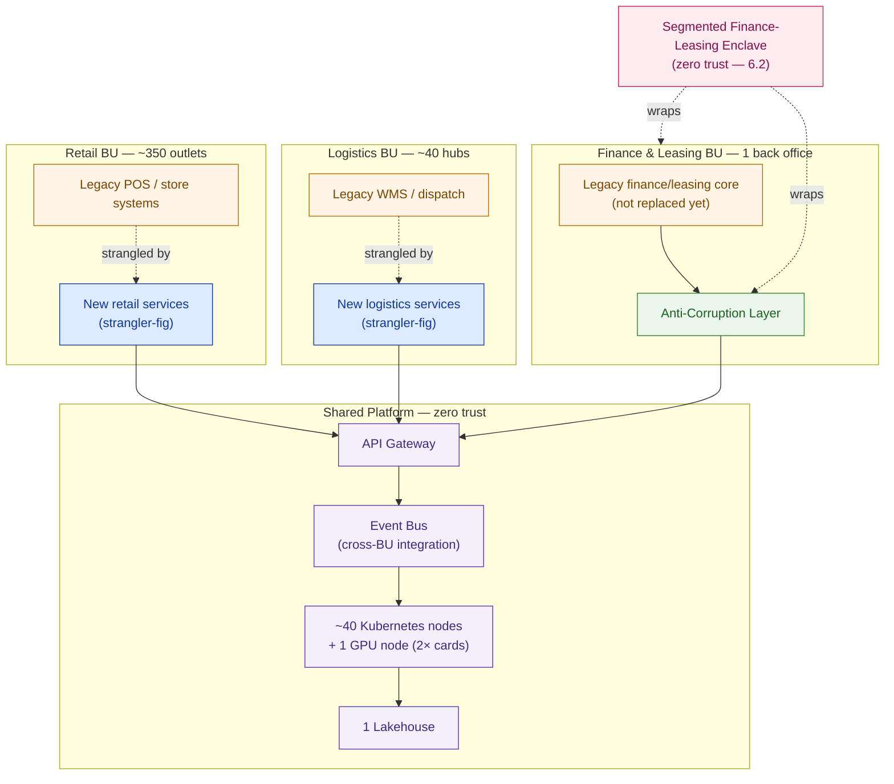

# High-Level Design — Cakrawala Group

> This is `template-hld.md` filled in for a fictional customer. It shows what "good" looks like: five lessons of technical work re-rendered as one board-legible ask, with every figure cited from the artifact that produced it.

**Customer:** Cakrawala Group (fictional)  ·  **Engagement:** Group Technology Platform Modernization — Capstone F
**Prepared by:** SA — Presales  ·  **Date:** 2026-07-05  ·  **Version:** v1.0 (board draft)  ·  **Status:** For board review

**Prior artifacts synthesized in this HLD:**

| Source lesson | What it contributed |
|---|---|
| 6.1 Architecture Patterns | Strangler-fig, event bus, anti-corruption layer, API gateway — the pattern set in §3 |
| 6.2 Security Architecture & Zero Trust | Zero-trust model, segmented finance-leasing enclave — §4 |
| 6.3 Sizing & Capacity Planning | ~40 Kubernetes nodes, 1 GPU node (2× cards), 1 lakehouse — §5 |
| 6.4 Cost Estimation & BOM | ~Rp 52 billion total investment, banded Rp 48–58B — §5 |
| 6.5 Risk, Compliance & Migration Strategy | Three-wave migration, compliance gate before finance-leasing cutover — §6 |

---

## 1. Executive Summary (the 90-second read)

> **The ask:** Approve a **~Rp 52 billion** investment (banded **Rp 48–58 billion**, within the board's approved ceiling of **Rp 45–65 billion**) to modernize Cakrawala Group's shared technology platform across Retail, Logistics, and Finance & Leasing, delivered over a **12–18 month** window in **three migration waves**, targeting a **15–20% reduction in cost-to-serve**.
>
> **The architecture, in one sentence:** a shared, zero-trust platform — sized at roughly **40 Kubernetes nodes plus one GPU node** — migrates the three business units off their siloed legacy estates using a **strangler-fig** pattern, an **event bus** for cross-BU integration, and an **anti-corruption layer** that protects the finance-leasing core until it is safe to touch.
>
> **The risk, in one sentence:** the **Finance & Leasing** business unit does not cut over until it clears a dedicated **compliance gate** (§6), so the group's regulatory exposure is bounded by design, not by hope.

## 2. Business Context & Drivers

- **Scale that makes "do nothing" expensive:** Cakrawala Group runs **~350 retail outlets**, **~40 logistics hubs**, and **one finance/leasing back office**, employing **~18,000 people** and generating **~Rp 8 trillion** in annual revenue. A group of this size pays a fragmentation tax every quarter it runs three siloed technology estates instead of one shared platform.
- **Why this program, why now:** the compliance and risk picture for the finance-leasing enclave gets harder, not easier, the longer it stays on legacy infrastructure. The 12–18 month window is a decision to act while the regulatory timeline still supports the compliance gate in §6 — not a padding estimate.
- **Why this scope:** Retail, Logistics, and Finance & Leasing each have a legacy core that works in isolation but does not talk to the others. The group's 15–20% cost-to-serve target is only reachable if all three units share one platform — modernizing any single unit alone does not move the number.

## 3. Target Architecture (the money diagram)



### ASCII fallback

```
  ┌────────────────────────────┬────────────────────────────┬───────────────────────────┐
  │ Retail BU (~350 outlets)    │ Logistics BU (~40 hubs)     │ Finance & Leasing (1 BO)   │
  │ legacy POS ──strangled──▶   │ legacy WMS ──strangled──▶    │ legacy core ──▶ ACL        │
  │ new retail services         │ new logistics services       │ (protected, not replaced)  │
  └───────────────┬──────────────┴───────────────┬─────────────┴─────────────┬─────────────┘
                  └───────────────────────────────┼───────────────────────────┘
                                     ┌─────────────▼─────────────┐
                                     │   SHARED PLATFORM           │
                                     │   API gateway → event bus    │
                                     │   → ~40 K8s nodes + 1 GPU     │
                                     │   node (2× cards) → lakehouse │
                                     └─────────────┬─────────────┘
                    zero trust / segmented finance-leasing enclave wraps FIN BU + ACL
```

**What's deferred to 6.7's LLD (deliberately not in this document):**
- [ ] Exact Kubernetes node pool specs, taints, autoscaling policy
- [ ] Full BOM line items, vendor SKUs, licence counts
- [ ] Event-bus topic/partition design, schema registry choice
- [ ] Anti-corruption layer transformation rules per message type
- [ ] IAM role bindings, network segmentation rules, certificate policy
- [ ] Wave-by-wave runbook steps, rollback procedures, cutover checklists

## 4. Security Posture Summary

The platform is built zero trust — every service-to-service call is authenticated and authorized regardless of network location, and no business unit is trusted by default just because it's "inside" the corporate network. Finance & Leasing, carrying the group's tightest regulatory exposure, sits in a **segmented enclave**: its legacy core is not directly reachable from Retail or Logistics services, and every interaction crosses the anti-corruption layer shown in §3. This is why the finance-leasing cutover is gated separately in §6 — the security model is designed so that a Retail incident cannot become a Finance & Leasing incident.

## 5. Sizing & Cost Summary

| Item | Figure | Source |
|---|---|---|
| Compute | ~40 Kubernetes nodes | 6.3 Sizing & Capacity Planning |
| AI/ML capacity | 1 GPU node, 2× cards | 6.3 Sizing & Capacity Planning |
| Analytics | 1 lakehouse (shared across 3 BUs) | 6.3 Sizing & Capacity Planning |
| Total investment | ~Rp 52 billion (band Rp 48–58B) | 6.4 Cost Estimation & BOM |
| Board ceiling | Rp 45–65 billion | Pinned engagement parameter |
| Target outcome | 15–20% cost-to-serve reduction | Pinned engagement parameter |

No new arithmetic is performed in this section — every figure above is cited, not recalculated. The full BOM sits behind Appendix B.

## 6. Risk & Migration Summary

The migration runs in **three waves**, sequenced by risk, not by convenience: Retail and Logistics — the two business units already being strangled off legacy in §3 — move first, because a rollback there is a service outage, not a regulatory event. **Finance & Leasing moves last, and only after clearing a dedicated compliance gate** — the migration does not proceed into the segmented enclave until that gate is signed off. This sequencing is the primary control on the program's downside risk: the group's most tightly regulated business unit is never the one absorbing early-wave migration risk.

## 7. Recommendation & The Ask

> We recommend the board approve **~Rp 52 billion** (within the Rp 45–65 billion ceiling), a **12–18 month** delivery window, and the three-wave migration sequence described in §6, with the explicit condition that **Finance & Leasing does not cut over until the compliance gate clears**. This is the path to the group's **15–20% cost-to-serve** target with the group's regulatory exposure bounded throughout.

---

## Appendices (depth on demand — not in the flow above)

- **Appendix A — Detailed sizing:** see 6.3 Sizing & Capacity Planning's full capacity model.
- **Appendix B — Full BOM:** see 6.4 Cost Estimation & BOM's complete line-item costing (the source of the Rp 48–58B band).
- **Appendix C — Risk register:** see 6.5 Risk, Compliance & Migration Strategy's full risk table and wave-by-wave migration plan.
- **Appendix D — Glossary:** strangler-fig (incremental legacy replacement pattern), anti-corruption layer (a translation boundary protecting a system not yet migrated), zero trust (no implicit trust by network location), compliance gate (a formal sign-off milestone a migration wave cannot pass without).

---

**Next step:** this HLD, once approved, is the input to **6.7 Writing the LLD, Runbook & Implementation Plan** — the engineering-detail document that turns "approved" into "buildable."
