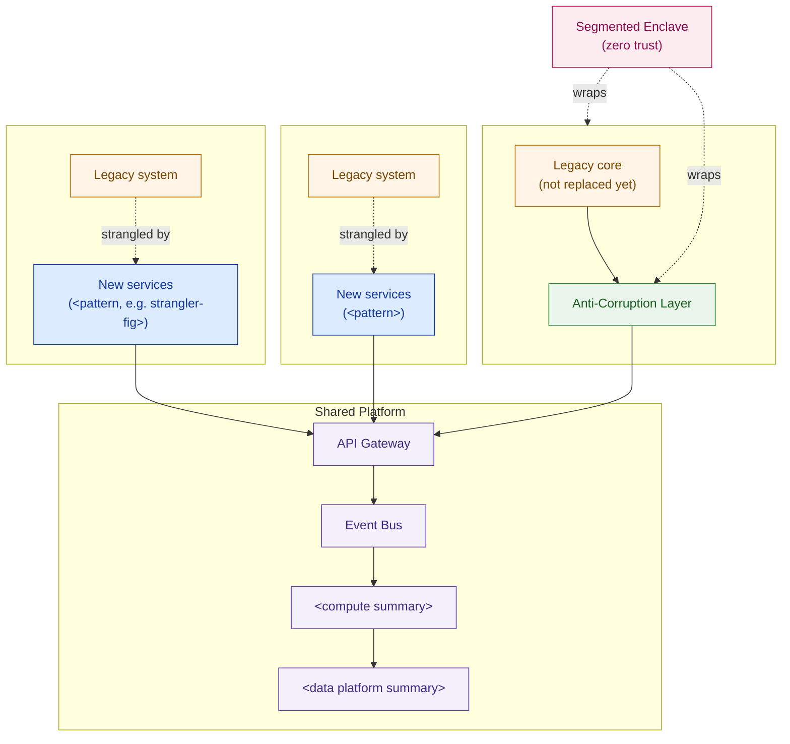

# High-Level Design — `<Customer Name>`

> This is the board-facing document. It answers *what are we building, why, what does it cost, and what's the risk* — never *exactly how do we build it* (that's the LLD, a separate document). One recommendation, not a menu. If a section can't be mapped to a reader and a question, cut it or move it to an appendix.

**Customer:** `<company>`  ·  **Engagement:** `<program / deal name>`  ·  **Prepared by:** `<SA name>`
**Date:** `<YYYY-MM-DD>`  ·  **Version:** `<v0.1 draft>`  ·  **Status:** `<draft | for review | approved>`

**Prior artifacts synthesized in this HLD:**

| Source lesson | What it contributed |
|---|---|
| `<architecture patterns lesson>` | Target architecture patterns (§3) |
| `<security architecture lesson>` | Security posture summary (§4) |
| `<sizing & capacity lesson>` | Sizing figures (§5) |
| `<cost estimation / BOM lesson>` | Cost figures (§5) |
| `<risk / compliance / migration lesson>` | Risk & migration summary (§6) |

---

## How to use this template

1. Write **§1 (Executive Summary)** last, after every other section is finalized — but place it first in the document. It must survive being the *only* section a reader opens.
2. Every number in this HLD must be **cited from a prior lesson/artifact**, never re-derived here. If you find yourself doing new arithmetic in this document, that math belongs in an appendix or the source artifact, not the HLD body.
3. Keep **one** target-architecture diagram (§3). If you need a second diagram to explain the pitch, the synthesis in §3 isn't finished yet.
4. Use the **"what's deferred to the LLD"** checklist at the end of §3 to actively police the altitude — anything on that list that creeps into the body is a sign this document is turning into an LLD.
5. Fill appendices with the *detail*, not summaries of the detail — the body should never need to repeat what an appendix already shows.

---

## 1. Executive Summary (the 90-second read)

> **The ask:** Approve `<figure>` (banded `<low>`–`<high>`, within a ceiling of `<ceiling>`) to `<one-sentence description of the program>`, delivered over `<timeframe>` in `<N>` `<waves/phases>`, targeting `<the business outcome, e.g. cost-to-serve reduction, revenue enablement>`.
>
> **The architecture, in one sentence:** `<the target architecture pattern summary — e.g. a shared platform migrates N business units off legacy using pattern X, integration Y, protection Z>`.
>
> **The risk, in one sentence:** `<the single biggest risk and how it's controlled — e.g. the most sensitive business unit does not cut over until it clears a named gate>`.

## 2. Business Context & Drivers

- **Scale that makes "do nothing" expensive:** `<company shape: locations, headcount, revenue — cite exact figures already pinned for this engagement, do not estimate new ones>`.
- **Why this program, why now:** `<the business driver connecting the ask to numbers the reader already owns>`.
- **Why this scope:** `<why these business units / domains, and not more or fewer>`.

## 3. Target Architecture (the money diagram)

> One diagram. Pattern-level only — no node counts, no product SKUs, no config. Everything below "pattern name" is the LLD's job.



### ASCII fallback (for docs/email that can't render Mermaid)

```
  ┌───────────────────────────┬───────────────────────────┬──────────────────────────┐
  │ <Business Unit 1>          │ <Business Unit 2>          │ <Sensitive Business Unit> │
  │ legacy ──strangled by──▶   │ legacy ──strangled by──▶   │ legacy core ──▶ ACL       │
  │ new services               │ new services                │ (protected, not replaced) │
  └──────────────┬──────────────┴──────────────┬─────────────┴────────────┬─────────────┘
                 └──────────────────────────────┼──────────────────────────┘
                                    ┌────────────▼────────────┐
                                    │   SHARED PLATFORM        │
                                    │   API gateway → event bus │
                                    │   → compute → data layer  │
                                    └────────────┬────────────┘
                          zero trust / segmented enclave wraps sensitive BU + ACL
```

**What's deferred to the LLD (do not add these here):**
- [ ] Exact compute node specs, autoscaling policy
- [ ] Full BOM line items, vendor SKUs, licence counts
- [ ] Event-bus topic/partition design, schema registry
- [ ] ACL transformation rules per message type
- [ ] IAM role bindings, network segmentation rules, certificate policy
- [ ] Wave-by-wave runbook steps, rollback procedures

## 4. Security Posture Summary

> One paragraph, citing the security architecture lesson. State the model and the one control the reader will ask about (usually: how is the most sensitive domain protected).

`<Zero trust / segmentation / identity summary, one paragraph, no policy detail>`

## 5. Sizing & Cost Summary

> No new arithmetic. Cite the sizing and cost lessons; if asked "how did you get this number," the answer is "see Appendix," not a live recalculation.

| Item | Figure | Source |
|---|---|---|
| Compute | `<figure>` | `<sizing lesson>` |
| AI/ML capacity | `<figure>` | `<sizing lesson>` |
| Data platform | `<figure>` | `<sizing lesson>` |
| Total investment | `<figure>` (band `<low>`–`<high>`) | `<cost/BOM lesson>` |
| Budget ceiling | `<figure>` | Pinned engagement parameter |
| Target outcome | `<figure>` | Pinned engagement parameter |

## 6. Risk & Migration Summary

> One paragraph, citing the risk/migration lesson. State the wave sequencing logic and the one gate that controls the biggest risk.

`<Migration wave summary + the compliance/risk gate that protects the most sensitive business unit, one paragraph, no full risk register>`

## 7. Recommendation & The Ask

> Restate §1's ask. If a new number appears here that wasn't in §1 or §5, fix §1 — don't add it here.

> We recommend approval of `<figure>` (within `<ceiling>`), a `<timeframe>` delivery window, and the `<N>`-wave migration sequence in §6, with the explicit condition that `<the gate condition>`. This is the path to `<the target outcome>` with `<the risk being managed>` bounded throughout.

---

## Appendices (depth on demand — not in the flow above)

- **Appendix A — Detailed sizing:** `<link/reference to the sizing lesson's full tables>`
- **Appendix B — Full BOM:** `<link/reference to the cost/BOM lesson's full line items>`
- **Appendix C — Risk register:** `<link/reference to the risk/migration lesson's full table>`
- **Appendix D — Glossary:** `<terms a non-technical reader may need defined>`

---

*Worked example: see `example-cakrawala-hld.md` in this folder.*
