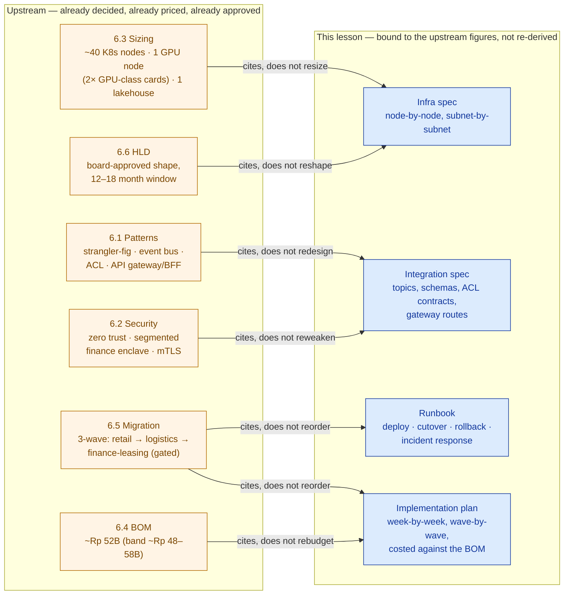
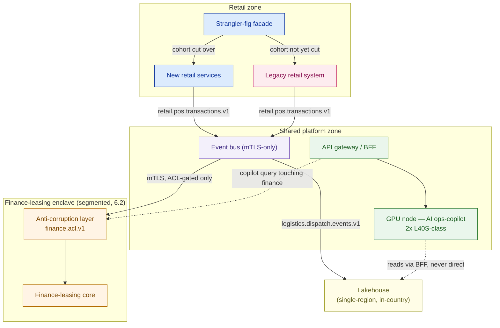

# Writing the LLD, Runbook & Implementation Plan

> The HLD earns the yes. The LLD earns the trust that the yes was worth having — because every number in it traces back to the deal the customer actually signed.

**Type:** Design
**Track:** AI, Data & Infrastructure Solution Architect (Presales)
**Prerequisites:** 6.6 Writing the HLD
**Time:** ~4h
**Lab:** —
**Ship It:** LLD + runbook + implementation plan

## The Problem

The board at **Cakrawala Group** — the Indonesian conglomerate running ~350 retail outlets, ~40 logistics hubs, and one finance/leasing back office across ~18,000 employees — signed off on the HLD from 6.6. The deal is real: ~40 mid-size Kubernetes nodes, a GPU node for the AI ops-copilot, a lakehouse, a 3-wave migration, a ~Rp 52 billion budget, a 12–18 month clock. Champagne, handshakes, a signed statement of work. And then the delivery team shows up on Monday morning and asks the only question that matters: *"Okay — what do we actually build, in what order, and how do we know when to stop and roll back?"*

The HLD does not answer that. It was never supposed to. It answers "is this the right shape, and can we afford it" — at the altitude a CIO and CFO read. It does not say which subnet the finance-leasing enclave sits on, what the anti-corruption layer's interface contract looks like, which of the 350 retail outlets go in the first cutover batch, or what a network engineer does at 2 a.m. if the retail cutover fails halfway through. Hand a delivery team an HLD and nothing else, and here is exactly what happens: the platform team invents a node count because the HLD only said "roughly 40," the integration team invents an event schema because the HLD only named "event bus," and six weeks in, someone reconciles the build against the signed BOM and finds the delivery team quietly re-sized the platform to 55 nodes because "40 felt tight." Now the customer is being asked to pay for capacity nobody priced, on a design nobody approved, and the SA who owned the deal is explaining a number that doesn't exist anywhere in a document they signed.

This is the single most expensive failure mode in delivery-side architecture: **a downstream document re-deriving a number instead of citing it.** It looks harmless — an engineer rounds up, a spec writer "improves" an estimate, a runbook author picks a nicer-sounding figure — but every invented number is a silent contradiction of the HLD, the BOM, and the sizing model the deal was priced against. The moment a customer's own engineer notices the LLD says something different from the proposal, every other number in every other document becomes suspect, and the SA's credibility — the actual product being sold in presales — is gone. The job of this lesson is to write the **LLD, the runbook, and the implementation plan** as the *exact build spec*, bound field-for-field to what 6.1 through 6.6 already established — never a fresh redesign, never a rounder number, never a "close enough."

## The Concept

A **Low-Level Design (LLD)** is the HLD's numbers made buildable: exact node counts and roles, exact subnets, exact API contracts, exact schemas — plus the two artifacts that turn a design into an operation: a **runbook** (the step-by-step procedure a mixed-skill delivery team follows to deploy, cut over, and recover) and an **implementation plan** (the week-by-week, wave-by-wave schedule that turns the timeline into a calendar). None of the three exist to *re-decide* anything. Their entire job is **traceability** — every figure in the LLD must point at the upstream lesson that produced it, the way a financial statement's every line points at a ledger entry.



Read the arrows as a rule, not a suggestion: **every arrow says "cites," never "recomputes."** If the LLD needs a number the HLD/BOM/sizing lesson didn't give — a subnet range, a topic name, a rollback timeout — that number is genuinely new *implementation* detail, and it's fine to invent it. But the moment an LLD number could be checked against an upstream lesson and *doesn't match*, that is not a detail, it's a defect, and it is the single most common way a delivery-phase document quietly re-prices a deal the customer already signed.

### The four things an LLD must contain

| Artifact | Answers | Written for | Traces to |
|---|---|---|---|
| **Infrastructure spec** | Exactly which nodes, where, running what | Platform/infra engineers | 6.3 (sizing), 6.2 (security zoning) |
| **Integration spec** | Exactly which topics, schemas, contracts, routes | Integration/app engineers | 6.1 (patterns), 6.2 (mTLS/zero trust) |
| **Runbook** | Exactly what to do, in order, and when to stop | The delivery team on cutover night | 6.5 (migration waves) |
| **Implementation plan** | Exactly when, in what order, against what budget | PM, sponsors, steering committee | 6.5 (waves), 6.4 (BOM), 6.6 (timeline) |

### Why a runbook is not an operations manual

A **runbook** is scoped to *one event* — a specific deploy, a specific cutover, a specific incident class — and is written so a **mixed-skill team** (a platform engineer who's never touched retail POS, a retail app owner who's never touched Kubernetes) can execute it without improvising. It is a checklist with decision points, not a reference manual. Conflating the two is why so many "runbooks" are 40-page PDFs nobody opens during an actual incident — by the time you're reading paragraph three, the SLA is already blown.

### Who reads which document

The LLD, runbook, and implementation plan aren't one document wearing three hats — they have different readers, different update cadences, and different failure costs if they drift from the numbers above them.

| Document | Primary reader | Updated when | Cost of drift from upstream |
|---|---|---|---|
| Infrastructure spec | Platform/infra engineers, security reviewers | A sizing or security decision changes (6.3/6.2) | Under-provisioned prod, or a customer bill that doesn't match the BOM |
| Integration spec | Integration/app engineers, the ACL/gateway owners | A pattern or security control changes (6.1/6.2) | A contract nobody agreed to, or a boundary the security review never saw |
| Runbook | The delivery team executing a specific cutover | Before each wave, from lessons of the prior wave | An improvised cutover with no tested rollback |
| Implementation plan | PM, sponsors, steering committee | A milestone slips or the gate outcome changes | A steering committee approving progress against a schedule nobody is actually running |

## Design It

Cakrawala's delivery team needs four things this week: the platform spec, the integration spec, a runbook for the *first* migration wave, and a plan for all 12–18 months. Build each one bound to the exact upstream figures — cite the lesson number at every step.

### Step 1 — Break the sizing number into a buildable platform spec (traces to 6.3, 6.2)

6.3 sized the platform at **~40 mid-size Kubernetes nodes**, **1 on-prem GPU node with 2× GPU-class cards (e.g. L40S-class)** for the bounded AI ops-copilot, and **1 mid-size single-region in-country lakehouse**. The LLD's job is not to re-size that — it's to say *which 40 nodes, doing what, in which network zone*, so the number still adds up to what was priced.

| Cluster / zone | Nodes | Role | Network zone | Security posture (per 6.2) |
|---|---:|---|---|---|
| Retail production | 14 | POS/order/inventory services behind the strangler-fig facade (6.1) | 10.20.0.0/20 | Zero trust, standard segment |
| Logistics production | 8 | Dispatch/routing services, event bus consumers | 10.21.0.0/20 | Zero trust, standard segment |
| Finance-leasing production | 6 | Ledger/leasing core, reachable only via the anti-corruption layer (6.1) | 10.22.0.0/22 | **Segmented enclave** (6.2) — isolated VRF, mTLS-only ingress |
| Shared platform | 8 | API gateway/BFF (6.1), event bus brokers, observability, CI/CD, identity | 10.10.0.0/22 | Zero trust, cross-zone chokepoint |
| Non-production | 4 | Staging/UAT for all three business units | 10.30.0.0/21 | Zero trust, no prod data |
| **Subtotal (K8s)** | **40** | | | matches 6.3's ~40-node figure exactly |
| GPU node | 1 | AI ops-copilot inference — 2× L40S-class cards (per 6.3) | Shared platform zone, reachable only through the API gateway/BFF | Zero trust, no direct external ingress |
| Lakehouse | 1 | Single-region, in-country — landing zone for all three BUs' event streams (per 6.3) | 10.40.0.0/24 | Data residency boundary for the finance-leasing compliance gate (6.5) |

The 40-node breakdown above is one valid allocation of 6.3's total across Cakrawala's three business units plus shared services — it is how an LLD makes an aggregate sizing number buildable. It is **not** a new sizing decision: the subtotal reconciles to 6.3's ~40 exactly, the GPU node and lakehouse are the same single units 6.3 called out, and if a future re-plan needs a different split, that's a change against 6.3 — not a silent edit buried in this table.

```
                    CAKRAWALA PLATFORM — ZONE MAP (LLD, traces to 6.3 / 6.2)
   ┌──────────────────────────────────────────────────────────────────────────┐
   │  SHARED PLATFORM ZONE  10.10.0.0/22  (8 nodes + GPU node)                 │
   │  API gateway/BFF · event bus brokers · observability · CI/CD · identity  │
   │  GPU node (2× L40S-class) — AI ops-copilot, reachable ONLY via gateway   │
   └───────────┬───────────────────────┬───────────────────────┬─────────────┘
               │ mTLS                  │ mTLS                  │ mTLS + ACL only
   ┌───────────▼───────────┐ ┌─────────▼─────────────┐ ┌──────▼──────────────┐
   │ RETAIL PROD           │ │ LOGISTICS PROD         │ │ FINANCE-LEASING PROD │
   │ 10.20.0.0/20 (14)      │ │ 10.21.0.0/20 (8)       │ │ 10.22.0.0/22 (6)      │
   │ strangler-fig facade   │ │ dispatch/routing       │ │ SEGMENTED ENCLAVE     │
   └────────────────────────┘ └────────────────────────┘ └──────────────────────┘
               │                        │                          │
               └──────────────┬─────────┴──────────────────────────┘
                               ▼
                 LAKEHOUSE  10.40.0.0/24  (single-region, in-country — 6.3)
                 NON-PROD  10.30.0.0/21  (4 nodes, all BUs, no prod data)
```

### Step 2 — Write the integration spec against 6.1's named patterns (traces to 6.1, 6.2)

6.1 named four patterns for Cakrawala; the LLD gives each one an exact contract.

- **Strangler-fig retail legacy retirement** (6.1) — the facade in the retail production zone routes each capability (checkout, inventory lookup, returns) to either the legacy retail system or the new service, per store cohort. Routing is a config flag per cohort, not a code branch — that's what makes Step 3's rollback a flag flip, not a redeploy.
- **Event bus integration** (6.1) — topics are versioned and BU-scoped: `retail.pos.transactions.v1`, `logistics.dispatch.events.v1`, `finance.ledger.postings.v1`. Every producer and consumer authenticates with **mTLS** (6.2) — no topic accepts an unauthenticated connection, and the finance-leasing topic is the only one gated by the ACL below.
- **Anti-corruption layer (ACL) on the finance-leasing core** (6.1) — the ACL exposes one stable, versioned interface, `finance.acl.v1`, that translates inbound events (e.g., a retail sale that becomes a leasing-fee accrual) into the finance-leasing core's internal ledger model. Nothing outside the segmented enclave (6.2) ever calls the core directly; the ACL is the only sanctioned entry point, which is also what makes the enclave's zero-trust boundary enforceable in practice rather than just on paper.
- **API gateway / BFF for the AI ops-copilot** (6.1) — the gateway exposes `/copilot/v1/query`, authenticates and rate-limits every call, and routes to the GPU node's inference service. The BFF aggregates read-only views from retail and logistics data via the lakehouse; it never talks to the finance-leasing core directly — a copilot question that touches finance-leasing data must go through the ACL like everything else.

A single topic's schema, made concrete enough for an integration engineer to implement without a follow-up meeting:

```json
// retail.pos.transactions.v1 — produced by retail zone, consumed by event bus + lakehouse
{
  "event_id": "uuid",
  "cohort_id": "string",        // which store cutover cohort produced this (Step 3)
  "store_id": "string",
  "occurred_at": "iso8601",
  "line_items": [{ "sku": "string", "qty": "number", "unit_price_idr": "number" }],
  "producer_auth": "mTLS client cert — retail-zone-issued (per 6.2)"
}
```

And the gateway's route table for the AI ops-copilot, bounded by the single GPU node 6.3 sized:

| Route | Backend | AuthN/Z | Rate limit | Notes |
|---|---|---|---|---|
| `POST /copilot/v1/query` | GPU node inference service | Service token + user SSO claim | Capped to the single GPU node's throughput (6.3) | Read-only; never writes to any SoR |
| `GET /copilot/v1/context/retail` | BFF → lakehouse | Service token | Standard | Aggregated retail view only |
| `GET /copilot/v1/context/logistics` | BFF → lakehouse | Service token | Standard | Aggregated logistics view only |
| `GET /copilot/v1/context/finance` | BFF → ACL (`finance.acl.v1`) | Service token + enclave-scoped cert (6.2) | Standard, logged | The only path into finance-leasing data — never direct to the core |



### Step 3 — Write the runbook for the retail-wave cutover (traces to 6.5, first of the 3 waves)

6.5 fixed the migration order — **retail first, then logistics, then finance-leasing last, behind a compliance gate.** This runbook covers only the first wave, written so a mixed-skill team (platform engineer, retail app owner, network/security on-call) can execute it without guessing:

1. **Pre-cutover (T-48h):** confirm data backfill for the pilot store cohort completed and reconciled; confirm mTLS certs on the event bus rotated and valid (6.2); confirm the facade's rollback flag is tested in staging; confirm on-call roster (platform, retail app, network/security) is published.
2. **Freeze (T-0):** freeze legacy writes for the pilot cohort only — every other store cohort keeps running on legacy, untouched.
3. **Cutover:** flip the facade routing flag for the pilot cohort from legacy → new services; run the smoke-test suite (checkout, inventory lookup, returns) against the cohort.
4. **Monitor window (4h):** watch the error budget for the cohort. **Rollback trigger:** error rate crosses the pre-agreed threshold, or any smoke test fails twice — flip the flag back to legacy, unfreeze, notify stakeholders. Rollback is a config change, not a redeploy, because Step 2 built it that way.
5. **Go/no-go:** platform lead + retail app owner sign off; if go, unfreeze the cohort on the new path and schedule the next cohort; if no-go, the rollback in step 4 already happened — the runbook's job is done either way.
6. **Incident response (any time during the window):** Sev1 (customer-facing outage) pages platform + retail app owner + network/security on-call simultaneously; Sev2 (degraded, not down) pages platform on-call only, escalates after 30 minutes without mitigation.

This is wave 1 of 3. Logistics repeats the same shape once retail is stable; finance-leasing does **not** start until the compliance gate (Step 4) opens — that ordering is 6.5's, not a scheduling choice made here.

**Roles for the mixed-skill cutover team** — this is the table that makes the runbook executable at 2 a.m. by people who don't share a background:

| Role | Owns | Paged for |
|---|---|---|
| Platform lead | Facade routing flag, infra health, rollback execution | Sev1, Sev2, every go/no-go |
| Retail app owner | Smoke tests, store cohort selection, business sign-off | Sev1, every go/no-go |
| Network/security on-call | mTLS cert validity, zone boundary integrity (6.2) | Sev1 only |
| PM (implementation plan owner) | Schedule impact of a rollback, stakeholder notification | Any rollback, any missed milestone |

### Step 3½ — Confirm rollback is cheap before cutover, not after

The reason Step 3's rollback is a one-line flag flip instead of an emergency redeploy is a design choice made back in Step 2 — the strangler-fig facade routes *per cohort*, not per code path. Before signing off on any runbook, check that the thing it calls "rollback" is actually as cheap as the runbook claims: if reverting requires a redeploy, a data un-migration, or a manual reconciliation, the runbook is describing a rollback that doesn't exist, and Step 2's integration spec needs to change before the cutover date, not during it.

### Step 4 — Turn the timeline into a week-by-week, wave-by-wave plan (traces to 6.5, 6.4, 6.6)

The HLD committed the board to a **12–18 month delivery window** (6.6), built on 6.5's 3-wave order and priced inside the **~Rp 52 billion BOM (band ~Rp 48–58 billion, per 6.4)**. The implementation plan turns that into a calendar — using the 12–18 month band's own endpoints, not a new number:

| Phase | Weeks | Wave (6.5) | Milestone | Funded from (6.4) |
|---|---|---|---|---|
| Mobilization | 1–4 | — | Team onboarded, environments stood up per Step 1's spec | BOM services/labor line item |
| Wave 1 — Retail | 5–24 (~months 2–6) | Retail (first) | Pilot cohort cut over (Step 3), then remaining cohorts in batches | BOM services/labor line item |
| Wave 2 — Logistics | 20–44 (~months 5–11, overlaps wave 1's tail) | Logistics (second) | All 40 hubs migrated, event bus load validated | BOM services/labor line item |
| **Compliance gate** | 44–48 | — | Data residency confirmed in the lakehouse; ACL and enclave segmentation (6.2) independently reviewed; regulator sign-off obtained for the finance-leasing back office | — (gate, not a build activity) |
| Wave 3 — Finance-leasing | 48–78 (~months 11–18) | Finance-leasing (last, gated) | ACL live, core cut over, enclave validated in production | BOM services/labor line item |
| Hypercare & close | 75–78 | — | Runbooks handed to steady-state operations, stabilization window closed | BOM services/labor line item |

A faster 12-month path compresses the same three waves with tighter overlap between wave 1 and wave 2 and a shorter hypercare tail; an 18-month path (shown above) is the conservative end of the same band. Neither path moves the compliance gate ahead of wave 3 — that ordering is fixed by 6.5, not by schedule pressure.

```
        MONTH:  1    2    3    4    5    6    7    8    9   10   11   12   13   14   15   16   17   18
Mobilization  [====]
Wave 1 Retail      [========================]
Wave 2 Logistics                [==========================================]
Compliance gate                                                  [==]
Wave 3 Finance-leasing                                                [============================]
Hypercare                                                                                        [==]
                ^retail first        ^logistics second                 ^gate       ^finance-leasing last (6.5)
```

### Step 5 — Close the loop: a traceability line for every field

Before handing the LLD to delivery, run one pass where every number gets a citation:

```
LLD FIELD                          VALUE                          TRACES TO
──────────────────────────────────────────────────────────────────────────
K8s node count                     ~40 (14+8+6+8+4)                6.3 sizing
GPU node                           1 node, 2x L40S-class cards     6.3 sizing
Lakehouse                          1, mid-size, single-region      6.3 sizing
Total BOM envelope                 ~Rp 52B (band ~Rp 48-58B)       6.4 cost estimation
Migration order                    retail -> logistics -> finance  6.5 migration strategy
Delivery window                    12-18 months                   6.6 HLD (derived from 6.4/6.5)
Zero trust / enclave / mTLS        as specified                    6.2 security architecture
Strangler-fig / event bus / ACL /  as specified                    6.1 architecture patterns
API gateway-BFF
```

Any field that can't fill in the right-hand column is either genuine new implementation detail (fine — say so) or a number that just got invented (not fine — go find where it should have come from).

## Compare It

**LLD vs. HLD** — same recap as 6.6, now from the build side. The HLD sells the shape at board altitude: "roughly 40 nodes, a GPU node, a lakehouse, 12–18 months, ~Rp 52B." The LLD builds the shape at engineer altitude: which 40, which subnet, which topic name, which rollback flag. An SA who writes LLD-level detail into an HLD loses the executive; an SA who leaves HLD-level vagueness in an LLD loses the delivery team. The discipline is the same discipline this whole phase teaches: know your altitude, and never let one document's altitude leak into the other's.

**Runbook vs. operations manual** — a runbook is scoped to one event (this deploy, this cutover, this incident class) and optimized to be *followed under pressure* by people who don't share a skill set. An operations manual is scoped to the whole system and optimized to be *referenced* when there's time to read. Cakrawala needs both eventually — this lesson ships the first, because it's the one the delivery team needs before anything else runs in production.

| | Runbook | Operations manual |
|---|---|---|
| Scope | One event (a cutover, a deploy, an incident class) | The whole running system |
| Audience | Mixed-skill delivery/on-call team, under time pressure | Steady-state operators, with time to read |
| Format | Numbered steps, explicit go/no-go and rollback triggers | Reference sections, indexed by topic |
| Written when | Before the event it covers | After the system stabilizes |
| Failure mode if missing | Improvised cutover, undocumented rollback | Tribal knowledge, bus-factor of one |

**Gantt-style plan vs. wave/milestone plan** — a classic Gantt chart is built for parallel, independent workstreams with soft dependencies; it earns its keep on projects where nothing gates anything else. Cakrawala's migration has one hard gate — finance-leasing cannot start until the compliance gate opens — which a wave/milestone plan makes impossible to miss and a dense Gantt chart can bury in a sea of parallel bars. For phased migrations with a regulatory or compliance gate, prefer the wave/milestone shape; reach for a full Gantt chart when the workstreams genuinely don't depend on each other in a hard, sequenced way.

## Ship It

This lesson ships the **LLD + Runbook + Implementation Plan** template — the build-ready spec that closes Capstone F's deliverable set (HLD in 6.6; this completes it). Both files live in [`outputs/`](../outputs/):

- **[`template-lld-runbook-implementation-plan.md`](../outputs/template-lld-runbook-implementation-plan.md)** — a fill-in-the-blank template covering the infrastructure spec, integration spec, a wave-1 cutover runbook, and a week-by-week implementation plan, with every field carrying a "traces to" column pointing at the upstream lesson (HLD/BOM/sizing/migration/patterns/security) it must be bound to.
- **[`example-cakrawala-lld-runbook-implementation-plan.md`](../outputs/example-cakrawala-lld-runbook-implementation-plan.md)** — the template fully worked for Cakrawala Group, using the exact pinned figures from 6.1 through 6.6 verbatim: ~40 K8s nodes, 1 GPU node (2× GPU-class cards), 1 lakehouse, ~Rp 52 billion (band ~Rp 48–58 billion), 12–18 months, and the 3-wave migration order.

Hand the template to a colleague on a different deal and they can produce a build-ready LLD without inventing a single number — the traceability column forces them back to the source lesson every time.

## Exercises

1. **(Easy)** Take the node-count table in Step 1 and change one thing: Cakrawala adds a fourth business unit (an e-commerce arm) after the deal is signed. Without changing the ~40-node total from 6.3, redistribute the table across four zones and write one sentence explaining which zone you shrank and why — this is the exact discipline of citing a fixed total instead of inventing a bigger one.
2. **(Medium)** Write a short runbook (6–10 steps, same shape as Step 3) for the **logistics-wave** cutover — the second of the 3 waves from 6.5. Reuse the retail runbook's structure (pre-cutover, freeze, cutover, monitor, go/no-go, incident response) but adapt the triggers to logistics (40 hubs, dispatch/routing) instead of retail (350 outlets, POS).
3. **(Hard)** The finance-leasing wave's compliance gate (Step 4) is currently one row in a table. Expand it into its own half-page gate checklist: name at least four concrete things a reviewer must confirm before wave 3 can start (tie at least two of them explicitly to 6.2's zero trust/segmented enclave/mTLS controls), and state what happens to the 12–18 month timeline if the gate fails on first attempt. Save it alongside the worked example — it's the artifact Capstone F's steering committee will actually ask to see.

## Key Terms

| Term | What people say | What it actually means |
|------|-----------------|------------------------|
| LLD (Low-Level Design) | "The detailed diagram" | The exact build spec — node counts, subnets, schemas, contracts — bound field-for-field to the HLD/BOM/sizing numbers, never a fresh re-design. |
| Runbook | "The docs" | A step-by-step procedure scoped to *one event* (a cutover, a deploy, an incident class), written for a mixed-skill team to execute under pressure without improvising. |
| Traceability | "Documentation" | The discipline of citing every LLD figure back to the upstream lesson/HLD/BOM it came from, so a customer's engineer can check the build spec against the signed deal and find no contradictions. |
| Anti-corruption layer (ACL) | "An API wrapper" | A translation boundary that protects a core system's internal model from external callers — here, the only sanctioned entry point into the finance-leasing core, enforcing the segmented enclave's zero-trust boundary in practice. |
| Compliance gate | "A sign-off meeting" | A hard go/no-go checkpoint that blocks the next migration wave until specific, named conditions (data residency, security review, regulator approval) are independently confirmed — not a formality. |
| Wave / milestone plan | "A project plan" | A schedule structured around hard sequencing dependencies (wave N cannot start until wave N-1 clears a gate), preferred over a parallel-workstream Gantt chart whenever a real gate exists. |
| Spec drift | "Scope creep" | The gradual divergence of a delivery-phase document from the numbers a deal was actually sold and priced on — the failure mode this entire lesson exists to prevent. |

## Further Reading

- [Google SRE Workbook — "Implementing SLOs" and the runbooks chapters](https://sre.google/workbook/table-of-contents/) — the definitive reference for writing runbooks a mixed-skill on-call team can actually execute under pressure.
- [Martin Fowler — StranglerFigApplication](https://martinfowler.com/bliki/StranglerFigApplication.html) — the pattern named in 6.1; read it once at LLD depth to see how the facade routing flag becomes the rollback mechanism.
- [Hohpe & Woolf — Enterprise Integration Patterns (Anti-Corruption Layer, Message Bus)](https://www.enterpriseintegrationpatterns.com/) — the vocabulary this lesson's integration spec is built on; use it to write contracts a receiving engineer can implement without asking follow-up questions.
- [ITIL 4 — Incident Management practice guide](https://www.axelos.com/certifications/itil-service-management/itil-4-foundation) — the formal Sev1/Sev2 escalation model the runbook's incident-response section is adapted from.
- [AWS Prescriptive Guidance — Migration wave planning](https://docs.aws.amazon.com/prescriptive-guidance/latest/migration-planning-technical-guide/wave-planning.html) — a concrete reference for structuring gated, multi-wave migrations like Cakrawala's retail → logistics → finance-leasing order.
